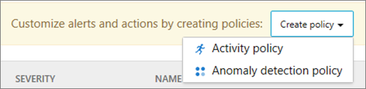

# Office 365 Cloud App Security のアクティビティ ポリシーと警告

|評価 * *\>**|計画 * *\>**|展開 * *\>**|使用率 * * * *|
|:-----|:-----|:-----|:-----|
|[評価の開始](office-365-cas-overview.md)   |[計画を開始する](get-ready-for-office-365-cas.md)   |ここでは、    [次の手順](anomaly-detection-policies-in-ocas.md)   |[利用を開始する](utilization-activities-for-ocas.md)   |
   
Office 365 cloud App Security では、高度なクラウド管理ポリシーによって、発生した、または頻繁に発生した特定のアクティビティについてのアラートがトリガーされます。 たとえば、ユーザーが Office 365 にサインインしようとし、1分間に70回失敗したとします。 別のユーザーが、別の場所にいると想定されている場合、7000ファイルをダウンロードするか、カナダからサインインするように表示されるとします。 さらに悪いことは、ユーザーのアカウントが侵害されており、攻撃者がそのアカウントを使用して組織のクラウドアプリや機密データにアクセスしているということです。
  
[グローバル管理者またはセキュリティ管理者](permissions-in-the-security-and-compliance-center.md)の場合は、このようなイベントが発生したときにアクティビティの警告が表示されます。 その後、何が起こったのかを調査できるまで、ユーザーアカウントの中断など、特定のアクションを実行できます。
  
> [!NOTE]
> office 365 Cloud App security ポリシーは[、office 365 セキュリティ&amp;コンプライアンスセンターのアラートポリシーと](alert-policies.md)は異なります。 この記事で説明するアクティビティポリシーは、Office 365 cloud App Security ポータルで定義されており、組織のクラウド環境をより適切に管理するのに役立ちます。 
  
## 始める前に

以下を確認してください。
  
- 組織に[Office 365 Cloud App Security](office-365-cas-overview.md)があり、サービスがオン[になっ](turn-on-office-365-cas.md)ている。
    
- Office 365 環境では、[監査ログ](turn-audit-log-search-on-or-off.md)が有効になっています。 
    
- Office 365 の全体管理者またはセキュリティ管理者であること。
    
## 新しいアクティビティポリシーを作成する

1. グローバル管理者またはセキュリティ管理者は、Cloud App security ポータル ([https://portal.cloudappsecurity.com](https://portal.cloudappsecurity.com)) にアクセスして、サインインします。  これにより、Office 365 Cloud App Security Policies ページが表示されます。 ![Office 365 Cloud App Security ポータルに移動するときに、[ポリシー] ページから始めます。](media/5cb8833c-4e08-438c-bab3-91b5106f6f3f.png)
  
2. [**ポリシーの作成**] をクリックし、[**アクティビティポリシー**] を選択します。 
  
3. [**アクティビティポリシーの作成**] ページで、**ポリシーの名前**と**説明**を指定します。 ポリシーを既定のテンプレートに基づいて作成するには、[**ポリシーテンプレート**] の一覧からポリシーを選択するか、テンプレートを使用せずに独自のポリシーを作成します。 
  
4. このポリシーによって警告がトリガーされた場合に、深刻な事態を測定する**ポリシーの重要度**(低、中、高) を選択します。 これは、後でメッセージを確認しているときに通知をフィルター処理するのに役立ちます。 
    
5. このポリシーの**カテゴリ**を選択します。 これにより、トリガーされた通知をフィルター処理したり並べ替えたり、変更を行うために確認しているときにグループポリシーに分類することができます。 
    
6. このポリシーに基づいて通知をトリガーする他のアクションまたは指標を設定するには、[**アクティビティフィルター** ] を選択します。 
    
7. [**アクティビティ一致パラメーター**] で、1つのアクティビティがフィルターに一致したときにポリシー違反が発生するかどうか、またはアラートがトリガーされるまでに指定した数の繰り返しアクティビティが必要な場合に、ポリシー違反をトリガーするかどうかを指定します。 **繰り返しアクティビティ**を選択する場合は、アクティビティの数、時間枠、および特定のアプリ内のユーザー、または任意のアプリを使用しているユーザーに対して違反がカウントされるかどうかを指定します。
    
8. 必要に応じて、[**警告の作成**] を選択して、このポリシーから通知を受信する追加の通知を作成できます (電子メール、テキストメッセージ、またはその両方を使用)。 **メールプロバイダーがから`no-reply@cloudappsecurity.com`送信されるメールをブロックしないように**します。 
  
9. 通知がトリガーされたときに実行する**アクション**を選択して、ユーザーを中断したり、ユーザーが Office 365 アプリに再度サインインするように要求します。 
    
10. [**作成**] を選択して、ポリシーの作成を完了します。 
    
## 次のステップ

- [異常検出ポリシー](anomaly-detection-policies-in-ocas.md)
    
- [SIEM サーバーの統合](integrate-your-siem-server-with-office-365-cas.md)
    
- [通知を確認して処理を実行する](review-office-365-cas-alerts.md)
    
- [IP アドレスをグループ化して管理を簡素化する](group-your-ip-addresses-in-ocas.md)
    

