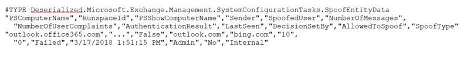
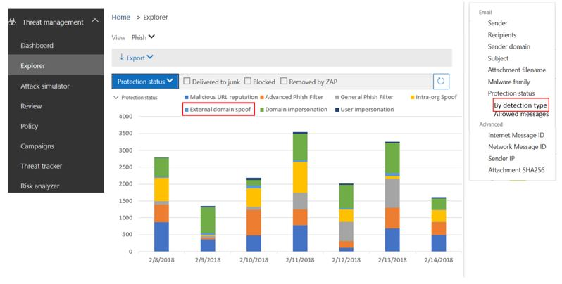
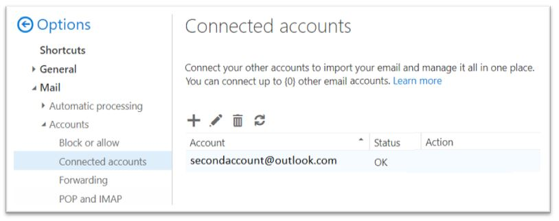

# <a name="anti-spoofing-protection-in-office-365"></a><span data-ttu-id="9ec5b-105">Office 365 でのスプーフィング対策保護</span><span class="sxs-lookup"><span data-stu-id="9ec5b-105">Anti-spoofing protection in Office 365</span></span>

<span data-ttu-id="9ec5b-106">この記事では、偽造された送信者ドメイン (スプーフィングされているドメイン) を使用するフィッシング攻撃に対して Office 365 が軽減される方法について説明します。</span><span class="sxs-lookup"><span data-stu-id="9ec5b-106">This article describes how Office 365 mitigates against phishing attacks that use forged sender domains, that is, domains that are spoofed.</span></span> <span data-ttu-id="9ec5b-107">これは、メッセージを分析し、標準の電子メール認証方法またはその他の送信者評価手法を使用して認証できないメッセージをブロックすることによって実現されます。</span><span class="sxs-lookup"><span data-stu-id="9ec5b-107">It accomplishes this by analyzing the messages and blocking the ones that cannot be authenticated using standard email authentication methods, nor other sender reputation techniques.</span></span> <span data-ttu-id="9ec5b-108">この変更は、Office 365 の組織が公開されるフィッシング攻撃の数を減らすために実装されました。</span><span class="sxs-lookup"><span data-stu-id="9ec5b-108">This change was implemented to reduce the number of phishing attacks to which organizations in Office 365 are exposed.</span></span>
  
<span data-ttu-id="9ec5b-109">この記事では、この変更が行われる理由、ユーザーがこの変更をどのように準備できるか、影響を受けるメッセージを表示する方法、メッセージについてのレポート方法、誤検知を軽減する方法、Microsoft がこのように準備する方法についても説明します。変化.</span><span class="sxs-lookup"><span data-stu-id="9ec5b-109">This article also describes why this change is being made, how customers can prepare for this change, how to view messages that will be affected, how to report on messages, how to mitigate false positives, as well as how senders to Microsoft should prepare for this change.</span></span>
  
<span data-ttu-id="9ec5b-110">Microsoft のスプーフィング対策テクノロジは、最初に office 365 Enterprise E5 サブスクリプションを持っているか、またはサブスクリプションのために office 365 Advanced Threat Protection (ATP) アドオンを購入した組織に展開されていました。</span><span class="sxs-lookup"><span data-stu-id="9ec5b-110">Microsoft's anti-spoofing technology was initially deployed to its organizations that had an Office 365 Enterprise E5 subscription or had purchased the Office 365 Advanced Threat Protection (ATP) add-on for their subscription.</span></span> <span data-ttu-id="9ec5b-111">2018年10月時点で、Exchange Online protection (EOP) を備えた組織に対する保護が拡張されました。</span><span class="sxs-lookup"><span data-stu-id="9ec5b-111">As of October, 2018 we extended the protection to organizations that have Exchange Online Protection (EOP) as well.</span></span> <span data-ttu-id="9ec5b-112">また、すべてのフィルターが相互に理解するようになったため、Outlook.com ユーザーも影響を受ける可能性があります。</span><span class="sxs-lookup"><span data-stu-id="9ec5b-112">Additionally, because of the way all of our filters learn from each other, Outlook.com users may also be affected.</span></span>
  
## <a name="how-spoofing-is-used-in-phishing-attacks"></a><span data-ttu-id="9ec5b-113">フィッシング攻撃でのスプーフィングの使用方法</span><span class="sxs-lookup"><span data-stu-id="9ec5b-113">How spoofing is used in phishing attacks</span></span>

<span data-ttu-id="9ec5b-114">ユーザーを保護することにより、Microsoft はフィッシングの脅威に真剣に取り組んでいます。</span><span class="sxs-lookup"><span data-stu-id="9ec5b-114">When it comes to protecting its users, Microsoft takes the threat of phishing seriously.</span></span> <span data-ttu-id="9ec5b-115">スパム送信者と phishers が一般的に使用する手法の1つはスプーフィングで、送信者が偽造されると、実際のソース以外の人物または他の場所からメッセージが送信されるように表示されます。</span><span class="sxs-lookup"><span data-stu-id="9ec5b-115">One of the techniques that spammers and phishers commonly use is spoofing, which is when the sender is forged, and a message appears to originate from someone or somewhere other than the actual source.</span></span> <span data-ttu-id="9ec5b-116">この手法は、ユーザー資格情報を取得するように設計されたフィッシングキャンペーンでよく使用されます。</span><span class="sxs-lookup"><span data-stu-id="9ec5b-116">This technique is often used in phishing campaigns designed to obtain user credentials.</span></span> <span data-ttu-id="9ec5b-117">Microsoft の偽造防止技術では、「From: header」 (Outlook などの電子メールクライアントに表示される) の偽造を具体的に調査しています。</span><span class="sxs-lookup"><span data-stu-id="9ec5b-117">Microsoft's Anti-spoof technology specifically examines forgery of the 'From: header' which is the one that shows up in an email client like Outlook.</span></span> <span data-ttu-id="9ec5b-118">Microsoft では、From: ヘッダーがスプーフィングされているという確信がある場合、そのメッセージがスプーフィングとして識別されます。</span><span class="sxs-lookup"><span data-stu-id="9ec5b-118">When Microsoft has high confidence that the From: header is spoofed, it identifies the message as a spoof.</span></span>
  
<span data-ttu-id="9ec5b-119">スプーフィングメッセージは、実際のライフユーザーに対して次の2つの悪影響を及ぼします。</span><span class="sxs-lookup"><span data-stu-id="9ec5b-119">Spoofing messages have two negative implications for real life users:</span></span>
  
### <a name="1-spoofed-messages-deceive-users"></a><span data-ttu-id="9ec5b-120">1. スプーフィングされたメッセージ deceive ユーザー</span><span class="sxs-lookup"><span data-stu-id="9ec5b-120">1. Spoofed messages deceive users</span></span>
  
<span data-ttu-id="9ec5b-121">最初に、スプーフィングされたメッセージは、ユーザーがリンクをクリックして、資格情報を表示したり、マルウェアをダウンロードしたり、機密コンテンツ (後者はビジネスメールが危険にさらされる) を含むメッセージに返信したりすることがあります。</span><span class="sxs-lookup"><span data-stu-id="9ec5b-121">First, a spoofed message may trick a user into clicking a link and giving up their credentials, downloading malware, or replying to a message with sensitive content (the latter of which is known as Business Email Compromise).</span></span> <span data-ttu-id="9ec5b-122">たとえば、次に示すのは、msoutlook94@service.outlook.com のスプーフィングされた送信者を含むフィッシングメッセージです。</span><span class="sxs-lookup"><span data-stu-id="9ec5b-122">For example, the following is a phishing message with a spoofed sender of msoutlook94@service.outlook.com:</span></span>
  

  
<span data-ttu-id="9ec5b-124">上記の操作は実際には service.outlook.com から行われていませんでしたが、その代わりに、フィッシャーによってスプーフィングされたため、そのようになります。</span><span class="sxs-lookup"><span data-stu-id="9ec5b-124">The above did not actually come from service.outlook.com, but instead was spoofed by the phisher to make it look like it did.</span></span> <span data-ttu-id="9ec5b-125">ユーザーがメッセージ内のリンクをクリックするように誘導しようとしています。</span><span class="sxs-lookup"><span data-stu-id="9ec5b-125">It is attempting to trick a user into clicking the link within the message.</span></span>
  
<span data-ttu-id="9ec5b-126">次の例は、スプーフィング contoso.com です。</span><span class="sxs-lookup"><span data-stu-id="9ec5b-126">The next example is spoofing contoso.com:</span></span>
  

  
<span data-ttu-id="9ec5b-128">このメッセージは正規のように見えますが、実際にはなりすましになります。</span><span class="sxs-lookup"><span data-stu-id="9ec5b-128">The message looks legitimate, but in fact is a spoof.</span></span> <span data-ttu-id="9ec5b-129">このフィッシングメッセージは、フィッシングのサブカテゴリであるビジネスメール侵害の一種です。</span><span class="sxs-lookup"><span data-stu-id="9ec5b-129">This phishing message is a type of Business Email Compromise which is a subcategory of phishing.</span></span>

### <a name="2-users-confuse-real-messages-for-fake-ones"></a><span data-ttu-id="9ec5b-130">2. ユーザーが偽のメッセージに対して実際のメッセージを混同する</span><span class="sxs-lookup"><span data-stu-id="9ec5b-130">2. Users confuse real messages for fake ones</span></span>
  
<span data-ttu-id="9ec5b-131">2番目に、スプーフィングされたメッセージは、フィッシングメッセージを認識しているが、実際のメッセージとスプーフィングされたメッセージの違いを見分けることができないユーザーに対しては不確実性を作成します</span><span class="sxs-lookup"><span data-stu-id="9ec5b-131">Second, spoofed messages create uncertainty for users who know about phishing messages but cannot tell the difference between a real message and spoofed one.</span></span> <span data-ttu-id="9ec5b-132">たとえば、次に示すのは、Microsoft セキュリティアカウントの電子メールアドレスからの実際のパスワードのリセットの例です。</span><span class="sxs-lookup"><span data-stu-id="9ec5b-132">For example, the following is an example of an actual password reset from the Microsoft Security account email address:</span></span>
  

  
<span data-ttu-id="9ec5b-134">上記のメッセージは Microsoft から送信されましたが、ユーザーがフィッシングメッセージを取得して、ユーザーがリンクをクリックして、資格情報を入力したり、マルウェアをダウンロードしたり、機密性の高いコンテンツを含むメッセージに返信したりする可能性があります。</span><span class="sxs-lookup"><span data-stu-id="9ec5b-134">The above message did come from Microsoft, but at the same time, users are used to getting phishing messages that may trick a user into clicking a link and giving up their credentials, downloading malware, or replying to a message with sensitive content.</span></span> <span data-ttu-id="9ec5b-135">実際のパスワードのリセットとフェイクの違いを見分けることは難しいため、多くのユーザーはこれらのメッセージを無視するか、スパムとして報告するか、またはメッセージを不必要に Microsoft に報告して、フィッシング詐欺に失敗します。</span><span class="sxs-lookup"><span data-stu-id="9ec5b-135">Because it is difficult to tell the difference between a real password reset and a fake one, many users ignore these messages, report them as spam, or unnecessarily report the messages back to Microsoft as missed phishing scams.</span></span>

<span data-ttu-id="9ec5b-136">スプーフィングを阻止するため、電子メールフィルター業界は、 [SPF](https://docs.microsoft.com/office365/SecurityCompliance/set-up-spf-in-office-365-to-help-prevent-spoofing)、 [dkim](https://docs.microsoft.com/office365/SecurityCompliance/use-dkim-to-validate-outbound-email)、 [DMARC](https://docs.microsoft.com/office365/SecurityCompliance/use-dmarc-to-validate-email)などの電子メール認証プロトコルを開発してきました。</span><span class="sxs-lookup"><span data-stu-id="9ec5b-136">To stop spoofing, the email filtering industry has developed email authentication protocols such as [SPF](https://docs.microsoft.com/office365/SecurityCompliance/set-up-spf-in-office-365-to-help-prevent-spoofing), [DKIM](https://docs.microsoft.com/office365/SecurityCompliance/use-dkim-to-validate-outbound-email), and [DMARC](https://docs.microsoft.com/office365/SecurityCompliance/use-dmarc-to-validate-email).</span></span> <span data-ttu-id="9ec5b-137">DMARC は、メッセージの送信者を調査できないようにします。ユーザーが電子メールクライアントに表示する (上記の例では、service.outlook.com、outlook.com、および accountprotection.microsoft.com)、SPF または dkim が渡されたドメインを使用しています。</span><span class="sxs-lookup"><span data-stu-id="9ec5b-137">DMARC prevents spoofing examining a message's sender - the one that the user sees in their email client (in the examples above, this is service.outlook.com, outlook.com, and accountprotection.microsoft.com) - with the domain that passed SPF or DKIM.</span></span> <span data-ttu-id="9ec5b-138">つまり、ユーザーに表示されるドメインは認証されているため、スプーフィングされていません。</span><span class="sxs-lookup"><span data-stu-id="9ec5b-138">That is, the domain that the user sees has been authenticated and is therefore not spoofed.</span></span> <span data-ttu-id="9ec5b-139">詳細な説明については、この記事の「*電子メール認証がスプーフィングを停止するには常に十分であるとは限りません」* のセクションを参照してください。</span><span class="sxs-lookup"><span data-stu-id="9ec5b-139">For a more complete discussion, see the section "*Understanding why email authentication is not always enough to stop spoofing"*  later on in this article.</span></span>
  
<span data-ttu-id="9ec5b-140">ただし、問題は、電子メール認証レコードが省略可能であり、必須ではないことです。</span><span class="sxs-lookup"><span data-stu-id="9ec5b-140">However, the problem is that email authentication records are optional, not required.</span></span> <span data-ttu-id="9ec5b-141">そのため、microsoft.com や skype.com のような強力な認証ポリシーを持つドメインはスプーフィングから保護されていますが、弱い認証ポリシーを発行するドメイン、またはポリシーがまったくない場合、スプーフィングされる対象になります。2018年3月の場合、フォーチュン500の企業のうち 9% のドメインのみが、強力な電子メール認証ポリシーを発行します。</span><span class="sxs-lookup"><span data-stu-id="9ec5b-141">Therefore, while domains with strong authentication policies like microsoft.com and skype.com are protected from spoofing, domains that publish weaker authentication policies, or no policy at all, are targets for being spoofed.As of March 2018, only 9% of domains of companies in the Fortune 500 publish strong email authentication policies.</span></span> <span data-ttu-id="9ec5b-142">残りの 91% は、フィッシャーによってスプーフィングされる可能性があり、別のポリシーを使用して電子メールフィルターが検出しない限り、エンドユーザーに配信され、deceive することができます。</span><span class="sxs-lookup"><span data-stu-id="9ec5b-142">The remaining 91% may be spoofed by a phisher, and unless the email filter detects it using another policy, may be delivered to an end user and deceive them:</span></span>
  

  
<span data-ttu-id="9ec5b-144">強力な電子メール認証ポリシーを公開する Fortune 500 に含まれていない小規模から中規模の企業の比率は、北米および西ヨーロッパの範囲外のドメインではまだ小さくなっています。</span><span class="sxs-lookup"><span data-stu-id="9ec5b-144">The proportion of small-to-medium sized companies that are not in the Fortune 500 that publish strong email authentication policies is smaller, and smaller still for domains that are outside of North America and western Europe.</span></span>
  
<span data-ttu-id="9ec5b-145">これは、企業が電子メール認証のしくみを認識していない場合でも、phishers はその不足を認識して利用するため、大きな問題になります。</span><span class="sxs-lookup"><span data-stu-id="9ec5b-145">This is a big problem because while enterprises may not be aware of how email authentication works, phishers do understand and take advantage of the lack of it.</span></span>
  
<span data-ttu-id="9ec5b-146">SPF、dkim、および DMARC の設定の詳細については、このドキュメントの「*Office 365 の顧客*」セクションを参照してください。</span><span class="sxs-lookup"><span data-stu-id="9ec5b-146">For information on setting up SPF, DKIM, and DMARC, see the section "*Customers of Office 365"*  later on in this document.</span></span> 
  
## <a name="stopping-spoofing-with-implicit-email-authentication"></a><span data-ttu-id="9ec5b-147">暗黙的な電子メール認証によるスプーフィングの停止</span><span class="sxs-lookup"><span data-stu-id="9ec5b-147">Stopping spoofing with implicit email authentication</span></span>

<span data-ttu-id="9ec5b-148">フィッシングとスピアーフィッシングはこのような問題であり、強力な電子メール認証ポリシーの導入には制限があるため、Microsoft はお客様を保護する機能への投資を継続しています。</span><span class="sxs-lookup"><span data-stu-id="9ec5b-148">Because phishing and spear phishing is such a problem, and because of the limited adoption of strong email authentication policies, Microsoft continues to invest in capabilities to protect its customers.</span></span> <span data-ttu-id="9ec5b-149">そのため、microsoft は暗黙的な*電子メール認証*を使用しています。ドメインが認証されていない場合、microsoft はメールの認証レコードを公開した場合と同様に処理し、それに合格しない場合はそれを取り扱います。</span><span class="sxs-lookup"><span data-stu-id="9ec5b-149">Therefore, Microsoft is moving ahead with  *implicit email authentication* - if a domain doesn't authenticate, Microsoft will treat it as if it had published email authentication records and treat it accordingly if it doesn't pass.</span></span> 
  
<span data-ttu-id="9ec5b-150">これを実現するため、Microsoft では、送信者評価、送信者/受信者履歴、動作分析、その他の高度な手法を含む、通常の電子メール認証にさまざまな拡張機能を構築しています。</span><span class="sxs-lookup"><span data-stu-id="9ec5b-150">To accomplish this, Microsoft has built numerous extensions to regular email authentication including sender reputation, sender/recipient history, behavioral analysis, and other advanced techniques.</span></span> <span data-ttu-id="9ec5b-151">電子メール認証を公開しないドメインから送信されたメッセージは、正当であることを示す他の通知が含まれていない限り、スプーフィングとしてマークされます。</span><span class="sxs-lookup"><span data-stu-id="9ec5b-151">A message sent from a domain that doesn't publish email authentication will be marked as spoof unless it contains other signals to indicate that it is legitimate.</span></span>
  
<span data-ttu-id="9ec5b-152">これにより、エンドユーザーは、自分に送信された電子メールがスプーフィングされていないことを確信でき、誰もドメインを偽装していないこと、および Office 365 のお客様が偽装保護などのより優れた保護を提供できるようになります。</span><span class="sxs-lookup"><span data-stu-id="9ec5b-152">By doing this, end users can have confidence that an email sent to them has not been spoofed, senders can be confident that nobody is impersonating their domain, and customers of Office 365 can offer even better protection such as Impersonation protection.</span></span>
  
<span data-ttu-id="9ec5b-153">Microsoft の一般的なアナウンスについては、「[フィッシング Part 2-Office 365 で強化されたスプーフィング対策](https://techcommunity.microsoft.com/t5/Security-Privacy-and-Compliance/Schooling-A-Sea-of-Phish-Part-2-Enhanced-Anti-spoofing/ba-p/176209)」を参照してください。</span><span class="sxs-lookup"><span data-stu-id="9ec5b-153">To see Microsoft's general announcement, see [A Sea of Phish Part 2 - Enhanced Anti-spoofing in Office 365](https://techcommunity.microsoft.com/t5/Security-Privacy-and-Compliance/Schooling-A-Sea-of-Phish-Part-2-Enhanced-Anti-spoofing/ba-p/176209).</span></span>
  
## <a name="identifying-that-a-message-is-classified-as-spoofed"></a><span data-ttu-id="9ec5b-154">メッセージがスプーフィングとして分類されていることを識別する</span><span class="sxs-lookup"><span data-stu-id="9ec5b-154">Identifying that a message is classified as spoofed</span></span>

### <a name="composite-authentication"></a><span data-ttu-id="9ec5b-155">複合認証</span><span class="sxs-lookup"><span data-stu-id="9ec5b-155">Composite authentication</span></span>

<span data-ttu-id="9ec5b-156">SPF、dkim、DMARC はすべて、自分で使用することができますが、メッセージに明示的な認証レコードがない場合は、十分な認証状態を伝えません。</span><span class="sxs-lookup"><span data-stu-id="9ec5b-156">While SPF, DKIM, and DMARC are all useful by themselves, they don't communicate enough authentication status in the event a message has no explicit authentication records.</span></span> <span data-ttu-id="9ec5b-157">そのため、Microsoft では、複数の信号を複合認証または compauth という1つの値に結合するアルゴリズムを開発しています。</span><span class="sxs-lookup"><span data-stu-id="9ec5b-157">Therefore, Microsoft has developed an algorithm that combines multiple signals into a single value called Composite Authentication, or compauth for short.</span></span> <span data-ttu-id="9ec5b-158">Office 365 のお客様は、メッセージヘッダー内の [*認証結果*ヘッダーに compauth 値がスタンプされています。</span><span class="sxs-lookup"><span data-stu-id="9ec5b-158">Customers in Office 365 have compauth values stamped into the *Authentication-Results* header in the message headers.</span></span> 
  
```
Authentication-Results:
  compauth=<fail|pass|softpass|none> reason=<yyy>

```

|<span data-ttu-id="9ec5b-159">**compauth の結果**</span><span class="sxs-lookup"><span data-stu-id="9ec5b-159">**CompAuth result**</span></span>|<span data-ttu-id="9ec5b-160">**説明**</span><span class="sxs-lookup"><span data-stu-id="9ec5b-160">**Description**</span></span>|
|:-----|:-----|
|<span data-ttu-id="9ec5b-161">失敗</span><span class="sxs-lookup"><span data-stu-id="9ec5b-161">fail</span></span>|<span data-ttu-id="9ec5b-162">メッセージの明示的な認証が失敗しました (dns でドメイン公開レコードを明示的に送信する) か、暗黙の認証を行います (ドメインは dns でレコードを発行していません。そのため、Office 365 は結果を、発行されたレコードのように補間しました)。</span><span class="sxs-lookup"><span data-stu-id="9ec5b-162">Message failed explicit authentication (sending domain published records explicitly in DNS) or implicit authentication (sending domain did not publish records in DNS, so Office 365 interpolated the result as if it had published records).</span></span>|
|<span data-ttu-id="9ec5b-163">処理</span><span class="sxs-lookup"><span data-stu-id="9ec5b-163">pass</span></span>|<span data-ttu-id="9ec5b-164">明示的な認証が渡された (メッセージが渡されたメッセージ、または[最適な推測](https://blogs.msdn.microsoft.com/tzink/2015/05/06/what-is-dmarc-bestguesspass-in-office-365)による DMARC)、または信頼性の高い暗黙的な認証 (送信側ドメインでは電子メール認証レコードは公開されませんが、Office 365 には、DMARC の強力なバックエンドシグナルがあります。メッセージが正当であることを示します。</span><span class="sxs-lookup"><span data-stu-id="9ec5b-164">Message passed explicit authentication (message passed DMARC, or [Best Guess Passed DMARC](https://blogs.msdn.microsoft.com/tzink/2015/05/06/what-is-dmarc-bestguesspass-in-office-365)) or implicit authentication with high confidence (sending domain does not publish email authentication records, but Office 365 has strong backend signals to indicate the message is likely legitimate).</span></span>|
|<span data-ttu-id="9ec5b-165">softpass</span><span class="sxs-lookup"><span data-stu-id="9ec5b-165">softpass</span></span>|<span data-ttu-id="9ec5b-166">メッセージが低対中の信頼度で暗黙的な認証を受けた (送信側ドメインでは電子メール認証は公開されませんが、Office 365 にはメッセージが正当であることを示すバックエンド信号がありますが、信号の強度が弱い)。</span><span class="sxs-lookup"><span data-stu-id="9ec5b-166">Message passed implicit authentication with low-to-medium confidence (sending domain does not publish email authentication, but Office 365 has backend signals to indicate the message is legitimate but the strength of the signal is weaker).</span></span>|
|<span data-ttu-id="9ec5b-167">なし</span><span class="sxs-lookup"><span data-stu-id="9ec5b-167">none</span></span>|<span data-ttu-id="9ec5b-168">メッセージは認証されていません (または認証されたが、整列されていません)。ただし、送信者評価またはその他の要因により、コンポジット認証は適用されません。</span><span class="sxs-lookup"><span data-stu-id="9ec5b-168">Message did not authenticate (or it did authenticate but did not align), but composite authentication not applied due to sender reputation or other factors.</span></span>|
   
|||
|:-----|:-----|
|<span data-ttu-id="9ec5b-169">**理由**</span><span class="sxs-lookup"><span data-stu-id="9ec5b-169">**Reason**</span></span>|<span data-ttu-id="9ec5b-170">**説明**</span><span class="sxs-lookup"><span data-stu-id="9ec5b-170">**Description**</span></span>|
|<span data-ttu-id="9ec5b-171">0xx</span><span class="sxs-lookup"><span data-stu-id="9ec5b-171">0xx</span></span>|<span data-ttu-id="9ec5b-172">メッセージの複合認証が失敗しました。</span><span class="sxs-lookup"><span data-stu-id="9ec5b-172">Message failed composite authentication.</span></span><br/><span data-ttu-id="9ec5b-173">**000**は、拒否または検疫のアクションによってメッセージが失敗したことを意味します。 DMARC。</span><span class="sxs-lookup"><span data-stu-id="9ec5b-173">**000** means the message failed DMARC with an action of reject or quarantine.</span></span>  <br/><span data-ttu-id="9ec5b-174">**001**は、メッセージが暗黙的な電子メール認証に失敗したことを意味します。</span><span class="sxs-lookup"><span data-stu-id="9ec5b-174">**001** means the message failed implicit email authentication.</span></span> <span data-ttu-id="9ec5b-175">これは、送信側ドメインに電子メール認証レコードが公開されていない場合、またはそのようにした場合に、エラーが発生したことを示すエラーポリシー (SPF soft fail またはニュートラル、DMARC policy of p = none) があることを意味します。</span><span class="sxs-lookup"><span data-stu-id="9ec5b-175">This means that the sending domain did not have email authentication records published, or if they did, they had a weaker failure policy (SPF soft fail or neutral, DMARC policy of p=none).</span></span>  <br/><span data-ttu-id="9ec5b-176">**002**は、組織に、スプーフィングされた電子メールの送信を明示的に禁止された送信者/ドメインのペアに対するポリシーがあることを意味します。この設定は、管理者によって手動で設定されます。</span><span class="sxs-lookup"><span data-stu-id="9ec5b-176">**002** means the organization has a policy for the sender/domain pair that is explicitly prohibited from sending spoofed email, this setting is manually set by an administrator.</span></span>  <br/><span data-ttu-id="9ec5b-177">**010**は、メッセージが reject または quarantine の処理によって DMARC に失敗したことを意味し、送信側ドメインは組織の承認済みドメインの1つであることを示します (これは、自己完結型または組織内の一部です)。</span><span class="sxs-lookup"><span data-stu-id="9ec5b-177">**010** means the message failed DMARC with an action of reject or quarantine, and the sending domain is one of your organization's accepted-domains (this is part of self-to-self, or intra-org, spoofing).</span></span>  <br/><span data-ttu-id="9ec5b-178">**011**は、メッセージが暗黙的な電子メール認証に失敗したことを意味し、送信側ドメインは、組織の承認済みドメインの1つであることを示します (これは、自己から自己間で、または組織内でのスプーフィングに含まれます)。</span><span class="sxs-lookup"><span data-stu-id="9ec5b-178">**011** means the message failed implicit email authentication, and the sending domain is one of your organization's accepted domains (this is part of self-to-self, or intra-org, spoofing).</span></span>|
|<span data-ttu-id="9ec5b-179">その他のすべてのコード (1xx、2xx、3xx、4xx、5xx)</span><span class="sxs-lookup"><span data-stu-id="9ec5b-179">All other codes (1xx, 2xx, 3xx, 4xx, 5xx)</span></span>|<span data-ttu-id="9ec5b-180">メッセージが暗黙的な認証を通過したか、認証が行われなかったが、アクションが適用されなかった理由に関する、さまざまな内部コードに対応します。</span><span class="sxs-lookup"><span data-stu-id="9ec5b-180">Corresponds to various internal codes for why a message passed implicit authentication, or had no authentication but no action was applied.</span></span>|
   
<span data-ttu-id="9ec5b-181">メッセージのヘッダーを見ることによって、管理者またはエンドユーザーであっても、送信者がスプーフィングされているという結論で Office 365 を受信する方法を判断できます。</span><span class="sxs-lookup"><span data-stu-id="9ec5b-181">By looking at the headers of a message, an administrator or even an end user can determine how Office 365 arrives at the conclusion that the sender may be spoofed.</span></span>
  
### <a name="differentiating-between-different-types-of-spoofing"></a><span data-ttu-id="9ec5b-182">さまざまな種類のスプーフィングの違い</span><span class="sxs-lookup"><span data-stu-id="9ec5b-182">Differentiating between different types of spoofing</span></span>

<span data-ttu-id="9ec5b-183">Microsoft は、2つの異なる種類のスプーフィングメッセージを区別します。</span><span class="sxs-lookup"><span data-stu-id="9ec5b-183">Microsoft differentiates between two different types of spoofing messages:</span></span>
  
 <span data-ttu-id="9ec5b-184">**組織内のスプーフィング**</span><span class="sxs-lookup"><span data-stu-id="9ec5b-184">**Intra-org spoofing**</span></span>
  
<span data-ttu-id="9ec5b-185">自己自己のスプーフィングとも呼ばれますが、これは、From: アドレス内のドメインが受信者ドメインと同じであるか、またはこのドメインと一致している場合 (受信者のドメインが組織の[承認済みドメイン](https://technet.microsoft.com/en-us/library/jj945194%28v=exchg.150%29.aspx)のいずれかである場合) に発生します。または、From: アドレスのドメインが同じ組織の一部である場合。</span><span class="sxs-lookup"><span data-stu-id="9ec5b-185">Also known as self-to-self spoofing, this occurs when the domain in the From: address is the same as, or aligns with, the recipient domain (when recipient domain is one of your organization's [Accepted Domains](https://technet.microsoft.com/en-us/library/jj945194%28v=exchg.150%29.aspx)); or, when the domain in the From: address is part of the same organization.</span></span>
  
<span data-ttu-id="9ec5b-186">たとえば、同じドメイン (contoso.com) の送信者と受信者が次のようになります。</span><span class="sxs-lookup"><span data-stu-id="9ec5b-186">For example, the following has sender and recipient from the same domain (contoso.com).</span></span> <span data-ttu-id="9ec5b-187">このページで spambot を実行できないようにするため、メールアドレスにスペースが挿入されます)。</span><span class="sxs-lookup"><span data-stu-id="9ec5b-187">Spaces are inserted into the email address to prevent spambot harvesting on this page):</span></span>
  
<span data-ttu-id="9ec5b-188">From: sender @ contoso.com</span><span class="sxs-lookup"><span data-stu-id="9ec5b-188">From: sender @ contoso.com</span></span>
  
<span data-ttu-id="9ec5b-189">宛先: 受信者 @ contoso.com</span><span class="sxs-lookup"><span data-stu-id="9ec5b-189">To: recipient @ contoso.com</span></span>
  
<span data-ttu-id="9ec5b-190">次の例では、送信者と受信者のドメインが組織のドメイン (fabrikam.com) と連携しています。</span><span class="sxs-lookup"><span data-stu-id="9ec5b-190">The following has the sender and recipient domains aligning with the organizational domain (fabrikam.com):</span></span>
  
<span data-ttu-id="9ec5b-191">From: sender @ foo.fabrikam.com</span><span class="sxs-lookup"><span data-stu-id="9ec5b-191">From: sender @ foo.fabrikam.com</span></span>
  
<span data-ttu-id="9ec5b-192">宛先: 受信者 @ bar.fabrikam.com</span><span class="sxs-lookup"><span data-stu-id="9ec5b-192">To: recipient @ bar.fabrikam.com</span></span>
  
<span data-ttu-id="9ec5b-193">次の送信者と受信者のドメインは異なる (microsoft.com と bing.com)。ただし、それらは同じ組織 (つまり、組織の承認済みドメインの一部) に属しています。</span><span class="sxs-lookup"><span data-stu-id="9ec5b-193">The following sender and recipient domains are different (microsoft.com and bing.com), but they belong to the same organization (that is, both are part of the organization's Accepted Domains):</span></span>
  
<span data-ttu-id="9ec5b-194">From: sender @ microsoft.com</span><span class="sxs-lookup"><span data-stu-id="9ec5b-194">From: sender @ microsoft.com</span></span>
  
<span data-ttu-id="9ec5b-195">宛先: 受信者 @ bing.com</span><span class="sxs-lookup"><span data-stu-id="9ec5b-195">To: recipient @ bing.com</span></span>
  
<span data-ttu-id="9ec5b-196">組織内のスプーフィングに失敗したメッセージのヘッダーには、次の値が含まれています。</span><span class="sxs-lookup"><span data-stu-id="9ec5b-196">Messages that fail intra-org spoofing contain the following values in the headers:</span></span>
  
<span data-ttu-id="9ec5b-197">スパム対策-レポート:...CAT: SPM/HSPM/PHSH;...SFTY: 9.11</span><span class="sxs-lookup"><span data-stu-id="9ec5b-197">X-Forefront-Antispam-Report: ...CAT:SPM/HSPM/PHSH;...SFTY:9.11</span></span>
  
<span data-ttu-id="9ec5b-198">CAT はメッセージのカテゴリで、通常は SPM (スパム) としてスタンプされますが、メッセージで発生する他のパターンの種類に応じて、hspm (高精度のスパム) またはフィッシング (フィッシング) の場合があります。</span><span class="sxs-lookup"><span data-stu-id="9ec5b-198">The CAT is the category of the message, and it is normally stamped as SPM (spam), but occasionally may be HSPM (high confidence spam) or PHISH (phishing) depending upon what other types of patterns occur in the message.</span></span>
  
<span data-ttu-id="9ec5b-199">SFTY はメッセージの安全性レベルです。最初の桁 (9) はメッセージがフィッシングであることを意味し、ドット (11) の後の数字の2番目のセットは、組織内のスプーフィングであることを意味します。</span><span class="sxs-lookup"><span data-stu-id="9ec5b-199">The SFTY is the safety level of the message, the first digit (9) means the message is phishing, and second set of digits after the dot (11) means it is intra-org spoofing.</span></span>
  
<span data-ttu-id="9ec5b-200">組織内のスプーフィングに対しては、2018 (タイムラインがまだ定義されていない) に対して、複合認証のための具体的な理由コードはありません。</span><span class="sxs-lookup"><span data-stu-id="9ec5b-200">There is no specific reason code for Composite Authentication for intra-org spoofing, that will be stamped later in 2018 (timeline not yet defined).</span></span>
  
 <span data-ttu-id="9ec5b-201">**クロスドメインのスプーフィング**</span><span class="sxs-lookup"><span data-stu-id="9ec5b-201">**Cross-domain spoofing**</span></span>
  
<span data-ttu-id="9ec5b-202">これは、From: アドレスの送信側ドメインが、受信側の組織の外部ドメインである場合に発生します。</span><span class="sxs-lookup"><span data-stu-id="9ec5b-202">This occurs when the sending domain in the From: address is an external domain to the receiving organization.</span></span> <span data-ttu-id="9ec5b-203">クロスドメインスプーフィングのために複合認証に失敗するメッセージには、次の値がヘッダーに含まれています。</span><span class="sxs-lookup"><span data-stu-id="9ec5b-203">Messages that fail Composite Authentication due to cross-domain spoofing contain the following values in the headers:</span></span>
  
<span data-ttu-id="9ec5b-204">認証-結果:...</span><span class="sxs-lookup"><span data-stu-id="9ec5b-204">Authentication-Results: …</span></span> <span data-ttu-id="9ec5b-205">compauth = fail reason = 000/001</span><span class="sxs-lookup"><span data-stu-id="9ec5b-205">compauth=fail reason=000/001</span></span>
  
<span data-ttu-id="9ec5b-206">スパム対策-レポート:...CAT: スプーフィング;...SFTY: 9.22</span><span class="sxs-lookup"><span data-stu-id="9ec5b-206">X-Forefront-Antispam-Report: ...CAT:SPOOF;...SFTY:9.22</span></span>
  
<span data-ttu-id="9ec5b-207">どちらの場合も、次の赤い安全なヒントがメッセージにスタンプされるか、受信者のメールボックスの言語に合わせてカスタマイズされた同等のものになります。</span><span class="sxs-lookup"><span data-stu-id="9ec5b-207">In both cases, the following red safety tip is stamped in the message, or an equivalent that is customized to the recipient mailbox's language:</span></span>
  

  
<span data-ttu-id="9ec5b-209">これは、From: アドレスを調べて、受信者の電子メールが何か、または電子メールのヘッダーを調べることによってのみ、組織内およびドメイン間のスプーフィングを区別することができます。</span><span class="sxs-lookup"><span data-stu-id="9ec5b-209">It's only by looking at the From: address and knowing what your recipient email is, or by inspecting the email headers, that you can differentiate between intra-org and cross-domain spoofing.</span></span>
  
## <a name="how-customers-of-office-365-can-prepare-themselves-for-the-new-anti-spoofing-protection"></a><span data-ttu-id="9ec5b-210">Office 365 のお客様が新しいスプーフィング対策保護のために自らを準備する方法</span><span class="sxs-lookup"><span data-stu-id="9ec5b-210">How customers of Office 365 can prepare themselves for the new anti-spoofing protection</span></span>

### <a name="information-for-administrators"></a><span data-ttu-id="9ec5b-211">管理者向けの情報</span><span class="sxs-lookup"><span data-stu-id="9ec5b-211">Information for administrators</span></span>

<span data-ttu-id="9ec5b-212">Office 365 の組織の管理者は、いくつかの重要な情報を把握しておく必要があります。</span><span class="sxs-lookup"><span data-stu-id="9ec5b-212">As an administrator of an organization in Office 365, there are several key pieces of information you should be aware of.</span></span>
  
### <a name="understanding-why-email-authentication-is-not-always-enough-to-stop-spoofing"></a><span data-ttu-id="9ec5b-213">電子メール認証がスプーフィングを停止するのに十分ではない理由を理解する</span><span class="sxs-lookup"><span data-stu-id="9ec5b-213">Understanding why email authentication is not always enough to stop spoofing</span></span>

<span data-ttu-id="9ec5b-214">新しいスプーフィング防止保護は、電子メール認証 (SPF、dkim、および DMARC) に依存して、メッセージがスプーフィングとしてマークされないようにします。</span><span class="sxs-lookup"><span data-stu-id="9ec5b-214">The new anti-spoofing protection relies on email authentication (SPF, DKIM, and DMARC) to not mark a message as spoofing.</span></span> <span data-ttu-id="9ec5b-215">一般的な例として、送信ドメインが SPF レコードを公開していない場合があります。</span><span class="sxs-lookup"><span data-stu-id="9ec5b-215">A common example is when a sending domain has never published SPF records.</span></span> <span data-ttu-id="9ec5b-216">SPF レコードがない場合、または正しく設定されていない場合、送信されたメッセージは、Microsoft が、メッセージが正当であるというバックエンドインテリジェンスを持っていない限り、スプーフィングとしてマークされます。</span><span class="sxs-lookup"><span data-stu-id="9ec5b-216">If there are no SPF records or they are incorrectly set up, a sent message will be marked as spoofed unless Microsoft has back-end intelligence that says the message is legitimate.</span></span>
  
<span data-ttu-id="9ec5b-217">たとえば、スプーフィング対策が展開されていない場合は、SPF レコードがなく、dkim レコードがなく、DMARC レコードがないというメッセージが次のように表示されている可能性があります。</span><span class="sxs-lookup"><span data-stu-id="9ec5b-217">For example, prior to anti-spoofing being deployed, a message may have looked like the following with no SPF record, no DKIM record, and no DMARC record:</span></span> 
  
```
Authentication-Results: spf=none (sender IP is 1.2.3.4)
  smtp.mailfrom=example.com; contoso.com; dkim=none
  (message not signed) header.d=none; contoso.com; dmarc=none
  action=none header.from=example.com;
From: sender @ example.com
To: receiver @ contoso.com
```
<span data-ttu-id="9ec5b-218">スプーフィング対策の後、Office 365 Enterprise E5、EOP、または ATP がある場合、compauth の値はスタンプされます。</span><span class="sxs-lookup"><span data-stu-id="9ec5b-218">After anti-spoofing, if you have Office 365 Enterprise E5, EOP, or ATP, the compauth value is stamped:</span></span>
  
```
Authentication-Results: spf=none (sender IP is 1.2.3.4)
  smtp.mailfrom=example.com; contoso.com; dkim=none
  (message not signed) header.d=none; contoso.com; dmarc=none
  action=none header.from=example.com; compauth=fail reason=001
From: sender @ example.com
To: receiver @ contoso.com

```

<span data-ttu-id="9ec5b-219">example.com が、dkim レコードではなく spf レコードを設定することで修正した場合は、spf が From: アドレス内のドメインと一致しているため、これは複合認証を通過します。</span><span class="sxs-lookup"><span data-stu-id="9ec5b-219">If example.com fixed this by setting up an SPF record but not a DKIM record, this would pass composite authentication because the domain that passed SPF aligned with the domain in the From: address:</span></span> 
  
```
Authentication-Results: spf=pass (sender IP is 1.2.3.4)
  smtp.mailfrom=example.com; contoso.com; dkim=none
  (message not signed) header.d=none; contoso.com; dmarc=bestguesspass
  action=none header.from=example.com; compauth=pass reason=109
From: sender @ example.com
To: receiver @ contoso.com
```

<span data-ttu-id="9ec5b-220">または、dkim レコードを設定しても、SPF レコードを設定していない場合は、From: アドレス内のドメインとの間で調整された dkim 署名のドメインであるため、これによっても複合認証が渡されます。</span><span class="sxs-lookup"><span data-stu-id="9ec5b-220">Or, if they set up a DKIM record but not an SPF record, this would also pass composite authentication because the domain in the DKIM-Signature that passed aligned with the domain in the From: address:</span></span> 
  
```
Authentication-Results: spf=none (sender IP is 1.2.3.4)
  smtp.mailfrom=example.com; contoso.com; dkim=pass
  (signature was verified) header.d=outbound.example.com;
  contoso.com; dmarc=bestguesspass action=none
  header.from=example.com; compauth=pass reason=109
From: sender @ example.com
To: receiver @ contoso.com
```

<span data-ttu-id="9ec5b-221">ただし、フィッシャーは、SPF と dkim をセットアップして、自分のドメインでメッセージに署名することもできますが、From: アドレスに別のドメインを指定します。</span><span class="sxs-lookup"><span data-stu-id="9ec5b-221">However, a phisher may also set up SPF and DKIM and sign the message with their own domain, but specify a different domain in the From: address.</span></span> <span data-ttu-id="9ec5b-222">SPF も dkim でも、ドメインが From: アドレス内のドメインと一致している必要があるので、example.com が公開されていない DMARC レコードは、DMARC を使用したスプーフィングとしてマークされません。</span><span class="sxs-lookup"><span data-stu-id="9ec5b-222">Neither SPF nor DKIM requires the domain to align with the domain in the From: address, so unless example.com published DMARC records, this would not be marked as a spoof using DMARC:</span></span> 
  
```
Authentication-Results: spf=pass (sender IP is 5.6.7.8)
  smtp.mailfrom=maliciousDomain.com; contoso.com; dkim=pass
  (signature was verified) header.d=maliciousDomain.com;
  contoso.com; dmarc=none action=none header.from=example.com;
From: sender @ example.com
To: receiver @ contoso.com
```

<span data-ttu-id="9ec5b-223">電子メールクライアント (outlook、outlook on the web、またはその他の電子メールクライアント) では、"from: domain" のみが表示されます。これにより、ユーザーが example.com からのメッセージであると誤解を与えることがありますが、実際には maliciousDomain.com から来たものになります。.</span><span class="sxs-lookup"><span data-stu-id="9ec5b-223">In the email client (Outlook, Outlook on the web, or any other email client), only the From: domain is displayed, not the domain in the SPF or DKIM, and that can mislead the user into thinking the message came from example.com, but actually came from maliciousDomain.com.</span></span>
  

  
<span data-ttu-id="9ec5b-225">そのため、Office 365 では、From: アドレスのドメインが SPF または dkim 署名のドメインと一致している必要があり、そうでない場合は、メッセージが正当であることを示す他の内部通知が含まれています。</span><span class="sxs-lookup"><span data-stu-id="9ec5b-225">For that reason, Office 365 requires that the domain in the From: address aligns with the domain in the SPF or DKIM signature, and if it doesn't, contains some other internal signals that indicates that the message is legitimate.</span></span> <span data-ttu-id="9ec5b-226">それ以外の場合、メッセージは compauth fail になります。</span><span class="sxs-lookup"><span data-stu-id="9ec5b-226">Otherwise, the message would be a compauth fail.</span></span> 
  
```
Authentication-Results: spf=none (sender IP is 5.6.7.8)
  smtp.mailfrom=maliciousDomain.com; contoso.com; dkim=pass
  (signature was verified) header.d=maliciousDomain.com;
  contoso.com; dmarc=none action=none header.from=contoso.com;
  compauth=fail reason=001
From: sender@contoso.com
To: someone@example.com
```

<span data-ttu-id="9ec5b-227">そのため、Office 365 のスプーフィング対策は、認証を行わずにドメインを保護します。認証を設定していないドメインに対しては、ユーザーがメッセージの送信者であると判断した場合と同じであると考えられるドメインに対しては一致しません。</span><span class="sxs-lookup"><span data-stu-id="9ec5b-227">Thus, Office 365 anti-spoofing protects against domains with no authentication, and against domains who set up authentication but mismatch against the domain in the From: address as that is the one that the user sees and believes is the sender of the message.</span></span> <span data-ttu-id="9ec5b-228">これは、組織外のドメインと組織内のドメインの両方に当てはまります。</span><span class="sxs-lookup"><span data-stu-id="9ec5b-228">This is true both of domains external to your organization, as well as domains within your organization.</span></span>
  
<span data-ttu-id="9ec5b-229">そのため、エラーメッセージが spf と dkim に渡された場合でも、エラーが発生したというメッセージが表示されます。これは、spf と dkim が渡されたドメインが From: アドレス内のドメインと一致していないためです。</span><span class="sxs-lookup"><span data-stu-id="9ec5b-229">Therefore, if you ever receive a message that failed composite authentication and is marked as spoofed, even though the message passed SPF and DKIM, it's because the domain that passed SPF and DKIM are not aligned with the domain in the From: address.</span></span>
  
### <a name="understanding-changes-in-how-spoofed-emails-are-treated"></a><span data-ttu-id="9ec5b-230">スプーフィングされたメールの処理方法の変更について</span><span class="sxs-lookup"><span data-stu-id="9ec5b-230">Understanding changes in how spoofed emails are treated</span></span>

<span data-ttu-id="9ec5b-231">現時点では、Office 365 のすべての組織について、DMARC がポリシーによって拒否または検疫のポリシーによって失敗した場合は、スパムとしてマークされているメッセージ、または通常のスパムアクション (その他のスパムルールは最初にスパムとして識別します)。</span><span class="sxs-lookup"><span data-stu-id="9ec5b-231">Currently, for all organizations in Office 365 - ATP and non-ATP - messages that fail DMARC with a policy of reject or quarantine are marked as spam and usually take the high confidence spam action, or sometimes the regular spam action (depending on whether other spam rules first identify it as spam).</span></span> <span data-ttu-id="9ec5b-232">組織内のスプーフィング検出では、通常のスパムアクションが実行されます。</span><span class="sxs-lookup"><span data-stu-id="9ec5b-232">Intra-org spoof detections take the regular spam action.</span></span> <span data-ttu-id="9ec5b-233">この動作は、有効にする必要はありません。無効にすることもできません。</span><span class="sxs-lookup"><span data-stu-id="9ec5b-233">This behavior does not need to be enabled, nor can it be disabled.</span></span>
  
<span data-ttu-id="9ec5b-234">ただし、クロスドメインスプーフィングメッセージの場合は、この変更が定期的なスパム、フィッシング、マルウェアチェックを通過し、フィルターの他の部分が疑わしいと識別された場合は、それらをそれぞれスパム、フィッシング、またはマルウェアとしてマークします。</span><span class="sxs-lookup"><span data-stu-id="9ec5b-234">However, for cross-domain spoofing messages, before this change they would go through regular spam, phish, and malware checks and if other parts of the filter identified them as suspicious, would mark them as spam, phish, or malware respectively.</span></span> <span data-ttu-id="9ec5b-235">新しいクロスドメインのスプーフィング対策を使用すると、既定では、認証されていないメッセージはフィッシング\>対策対策ポリシーで定義された処理を実行します。</span><span class="sxs-lookup"><span data-stu-id="9ec5b-235">With the new cross-domain spoofing protection, any message that can't be authenticated will, by default, take the action defined in the Anti-phishing \> Anti-spoofing policy.</span></span> <span data-ttu-id="9ec5b-236">定義されていない場合は、[ユーザー] 迷惑メールフォルダーに移動されます。</span><span class="sxs-lookup"><span data-stu-id="9ec5b-236">If one is not defined, it will be moved to a users Junk Email folder.</span></span> <span data-ttu-id="9ec5b-237">場合によっては、疑わしいメッセージのメッセージにも赤い安全なヒントが追加されることがあります。</span><span class="sxs-lookup"><span data-stu-id="9ec5b-237">In some cases, more suspicious messages will also have the red safety tip added to the message.</span></span>
  
<span data-ttu-id="9ec5b-238">これにより、スパムとしてマークされたままの状態でスパムとしてマークされていても、安全性のヒントが赤になっているメッセージが発生することがあります。その他の場合は、以前に非スパムとしてマークされたメッセージが、赤い安全なヒントを追加して、スパムとしてマークされるようになります (CAT: スプーフ)。</span><span class="sxs-lookup"><span data-stu-id="9ec5b-238">This may result in some messages that were previously marked as spam still getting marked as spam but will now also have a red safety tip; in other cases, messages that were previously marked as non-spam will start getting marked as spam (CAT:SPOOF) with a red safety tip added.</span></span> <span data-ttu-id="9ec5b-239">その他の場合でも、すべてのスパムとフィッシングを検疫に移動していたお客様は、それらを迷惑メールフォルダーに移動することになります (この動作は変更できます。変更は、「[スプーフィング対策の設定を変更](#changing-your-anti-spoofing-settings)する」を参照してください)。</span><span class="sxs-lookup"><span data-stu-id="9ec5b-239">In still other cases, customers that were moving all spam and phish to the quarantine would now see them going to the Junk Mail Folder (this behavior can be changed, see [Changing your anti-spoofing settings](#changing-your-anti-spoofing-settings)).</span></span>
  
<span data-ttu-id="9ec5b-240">メッセージが偽装される方法は複数あります (この記事で前述し[た「異なる種類のスプーフィング間](#differentiating-between-different-types-of-spoofing)の相違」を参照してください)。ただし、Office 365 がこれらのメッセージを扱う方法は、2018年3月現在、これらのメッセージは統合されていません。</span><span class="sxs-lookup"><span data-stu-id="9ec5b-240">There are multiple different ways a message can be spoofed (see  [Differentiating between different types of spoofing](#differentiating-between-different-types-of-spoofing) earlier in this article) but as of March 2018 the way Office 365 treats these messages is not yet unified.</span></span> <span data-ttu-id="9ec5b-241">次の表は、クロスドメインスプーフィング対策が新しい動作であることを簡単にまとめたものです。</span><span class="sxs-lookup"><span data-stu-id="9ec5b-241">The following table is a quick summary, with Cross-domain spoofing protection being new behavior:</span></span> 
  
|<span data-ttu-id="9ec5b-242">**スプーフィングの種類**</span><span class="sxs-lookup"><span data-stu-id="9ec5b-242">**Type of spoof**</span></span>|<span data-ttu-id="9ec5b-243">**分類**</span><span class="sxs-lookup"><span data-stu-id="9ec5b-243">**Category**</span></span>|<span data-ttu-id="9ec5b-244">**セキュリティヒントが追加されましたか?**</span><span class="sxs-lookup"><span data-stu-id="9ec5b-244">**Safety tip added?**</span></span>|<span data-ttu-id="9ec5b-245">**適用対象**</span><span class="sxs-lookup"><span data-stu-id="9ec5b-245">**Applies to**</span></span>|
|:-----|:-----|:-----|:-----|
|<span data-ttu-id="9ec5b-246">DMARC fail (検疫または拒否)</span><span class="sxs-lookup"><span data-stu-id="9ec5b-246">DMARC fail (quarantine or reject)</span></span>  <br/> |<span data-ttu-id="9ec5b-247">hspm (既定) は、SPM または phsh でもかまいません。</span><span class="sxs-lookup"><span data-stu-id="9ec5b-247">HSPM (default), may also be SPM or PHSH</span></span>  <br/> |<span data-ttu-id="9ec5b-248">いいえ (未完了)</span><span class="sxs-lookup"><span data-stu-id="9ec5b-248">No (not yet)</span></span>  <br/> |<span data-ttu-id="9ec5b-249">すべての Office 365 お客様、Outlook.com</span><span class="sxs-lookup"><span data-stu-id="9ec5b-249">All Office 365 customers, Outlook.com</span></span>  <br/> |
|<span data-ttu-id="9ec5b-250">自己完結型</span><span class="sxs-lookup"><span data-stu-id="9ec5b-250">Self-to-self</span></span>  <br/> |<span data-ttu-id="9ec5b-251">SPM</span><span class="sxs-lookup"><span data-stu-id="9ec5b-251">SPM</span></span>  <br/> |<span data-ttu-id="9ec5b-252">はい</span><span class="sxs-lookup"><span data-stu-id="9ec5b-252">Yes</span></span>  <br/> |<span data-ttu-id="9ec5b-253">すべての Office 365 組織、Outlook.com</span><span class="sxs-lookup"><span data-stu-id="9ec5b-253">All Office 365 organizations, Outlook.com</span></span>  <br/> |
|<span data-ttu-id="9ec5b-254">クロスドメイン</span><span class="sxs-lookup"><span data-stu-id="9ec5b-254">Cross-domain</span></span>  <br/> |<span data-ttu-id="9ec5b-255">なりすます</span><span class="sxs-lookup"><span data-stu-id="9ec5b-255">SPOOF</span></span>  <br/> |<span data-ttu-id="9ec5b-256">はい</span><span class="sxs-lookup"><span data-stu-id="9ec5b-256">Yes</span></span>  <br/> |<span data-ttu-id="9ec5b-257">Office 365 Advanced Threat Protection および E5 お客様</span><span class="sxs-lookup"><span data-stu-id="9ec5b-257">Office 365 Advanced Threat Protection and E5 customers</span></span>  <br/> |

### <a name="changing-your-anti-spoofing-settings"></a><span data-ttu-id="9ec5b-258">スプーフィング対策の設定を変更する</span><span class="sxs-lookup"><span data-stu-id="9ec5b-258">Changing your anti-spoofing settings</span></span>

<span data-ttu-id="9ec5b-259">(クロスドメイン) のスプーフィング対策設定を作成または更新するには、セキュリティ\> \> &amp;コンプライアンスセンターの [脅威の管理ポリシー] タブにある [フィッシング対策] 設定に移動します。</span><span class="sxs-lookup"><span data-stu-id="9ec5b-259">To create or update your (cross-domain) anti-spoofing settings, navigate to the Anti-phishing \> Anti-spoofing settings under the Threat Management \> Policy tab in the Security &amp; Compliance Center.</span></span> <span data-ttu-id="9ec5b-260">フィッシング対策設定を作成していない場合は、次のいずれかを作成する必要があります。</span><span class="sxs-lookup"><span data-stu-id="9ec5b-260">If you have never created any anti-phishing settings, you will need to create one:</span></span>
  

  
<span data-ttu-id="9ec5b-262">既に作成してある場合は、それを選択して変更することができます。</span><span class="sxs-lookup"><span data-stu-id="9ec5b-262">If you've already created one, you can select it to modify it:</span></span>
  

  
<span data-ttu-id="9ec5b-264">作成したポリシーを選択し、「[スプーフィングインテリジェンスについて](learn-about-spoof-intelligence.md)」で説明されている手順に従います。</span><span class="sxs-lookup"><span data-stu-id="9ec5b-264">Select the policy you just created and proceed through the steps as described in [Learn more about spoof intelligence](learn-about-spoof-intelligence.md).</span></span>
  

  

  
<span data-ttu-id="9ec5b-267">PowerShell を使用して新しいポリシーを作成するには、次のようにします。</span><span class="sxs-lookup"><span data-stu-id="9ec5b-267">To create a new policy by using PowerShell:</span></span> 
  
```powershell
$org = Get-OrganizationConfig
$name = "My first anti-phishing policy for " + $org.Name
# Note: The name should not exclude 64 characters, including spaces.
# If it does, you will need to pick a smaller name.
# Next, create a new anti-phishing policy with the default values
New-AntiphishPolicy -Name $Name
# Select the domains to scope it to
# Multiple domains are specified in a comma-separated list
$domains = "domain1.com, domain2.com, domain3.com"
# Next, create the anti-phishing rule, scope it to the anti-phishing rule
New-AntiphishRule -Name $name -AntiphishPolicy $name -RecipientDomainIs $domains
```

<span data-ttu-id="9ec5b-268">その後、 [get-antiphishpolicy](https://docs.microsoft.com/powershell/module/exchange/advanced-threat-protection/Set-AntiPhishPolicy?view=exchange-ps)に記載されているドキュメントに従って、PowerShell を使用してフィッシング対策ポリシーのパラメーターを変更することができます。</span><span class="sxs-lookup"><span data-stu-id="9ec5b-268">You may then modify the anti-phishing policy parameters using PowerShell, following the documentation at [Set-AntiphishPolicy](https://docs.microsoft.com/powershell/module/exchange/advanced-threat-protection/Set-AntiPhishPolicy?view=exchange-ps).</span></span> <span data-ttu-id="9ec5b-269">$name をパラメーターとして指定できます。</span><span class="sxs-lookup"><span data-stu-id="9ec5b-269">You may specify the $name as a parameter:</span></span>
  
```powershell
Set-AntiphishPolicy -Identity $name <fill in rest of parameters>
```

<span data-ttu-id="9ec5b-270">2018では、既定のポリシーを作成するのではなく、組織内のすべての受信者を対象とするように作成され、手動で指定する必要はありません (以下のスクリーンショットは最終実装の前に変更される可能性があります)。</span><span class="sxs-lookup"><span data-stu-id="9ec5b-270">Later in 2018, rather than you having to create a default policy, one will be created for you that is scoped to all the recipients in your organization so you don't have to specify it manually (the screenshots below are subject to change before the final implementation).</span></span>
  

  
<span data-ttu-id="9ec5b-272">作成するポリシーとは異なり、既定のポリシーを削除したり、優先度を変更したり、対象とするユーザー、ドメイン、またはグループを選択したりすることはできません。</span><span class="sxs-lookup"><span data-stu-id="9ec5b-272">Unlike a policy that you create, you cannot delete the default policy, modify its priority, or choose which users, domains, or groups to scope it to.</span></span>
  

  
<span data-ttu-id="9ec5b-274">PowerShell を使用して既定の保護を設定するには、次のようにします。</span><span class="sxs-lookup"><span data-stu-id="9ec5b-274">To set up your default protection by using PowerShell:</span></span>
  
```powershell
$defaultAntiphishPolicy = Get-AntiphishPolicy | ? {$_.IsDefault -eq $true}
Set-AntiphishPolicy -Identity $defaultAntiphishPolicy.Name -EnableAntispoofEnforcement <$true|$false>
```

<span data-ttu-id="9ec5b-275">Office 365 の前に別のメールサーバーまたはサーバーがある場合にのみ、スプーフィング防止保護を無効にします (詳細については、「スプーフィング対策を無効にする」を参照してください)。</span><span class="sxs-lookup"><span data-stu-id="9ec5b-275">You should only disable anti-spoofing protection if you have another mail server or servers in front of Office 365 (see Legitimate scenarios to disable anti-spoofing for more details).</span></span>
  
```powershell
$defaultAntiphishPolicy = Get-AntiphishiPolicy | ? {$_.IsDefault $true}
Set-AntiphishPolicy -Identity $defaultAntiphishPolicy.Name -EnableAntispoofEnforcement $false 

```
> [!IMPORTANT]
> <span data-ttu-id="9ec5b-276">メールパスの最初のホップが Office 365 で、スプーフィングとしてマークされた正当な電子メールが多すぎる場合は、まずドメインへのスプーフィングされたメールを送信することが許可された送信者を設定する必要があります (「u を送信している*正当な送信者を管理する」を参照してください)。n 認証*された電子メール)。</span><span class="sxs-lookup"><span data-stu-id="9ec5b-276">If the first hop in your email path is Office 365, and you are getting too many legitimate emails marked as spoof, you should first set up your senders that are allowed to send spoofed email to your domain (see the section  *"Managing legitimate senders who are sending unauthenticated email"*  ).</span></span> <span data-ttu-id="9ec5b-277">まだ誤検知 (スプーフィングとしてマークされた正当なメッセージ) を取得している場合は、スプーフィング対策保護を完全に無効にすることはお勧めしません。</span><span class="sxs-lookup"><span data-stu-id="9ec5b-277">If you are still getting too many false positives (that is, legitimate messages marked as spoof), we do NOT recommend disabling anti-spoofing protection altogether.</span></span> <span data-ttu-id="9ec5b-278">代わりに、高レベルの保護ではなく Basic を選択することをお勧めします。</span><span class="sxs-lookup"><span data-stu-id="9ec5b-278">Instead, we recommend choosing Basic instead of High protection.</span></span> <span data-ttu-id="9ec5b-279">偽陽性を使用した方が、長期間において大幅にコストがかかることがあるように組織を偽装した電子メールを公開するよりもよいでしょう。</span><span class="sxs-lookup"><span data-stu-id="9ec5b-279">It is better to work through false positives than to expose your organization to spoofed email which could end up imposing significantly higher costs in the long term.</span></span>

### <a name="managing-legitimate-senders-who-are-sending-unauthenticated-email"></a><span data-ttu-id="9ec5b-280">認証されていない電子メールを送信している正当な送信者の管理</span><span class="sxs-lookup"><span data-stu-id="9ec5b-280">Managing legitimate senders who are sending unauthenticated email</span></span>

<span data-ttu-id="9ec5b-281">Office 365 は、組織に対して認証されていない電子メールを送信しているユーザーを追跡します。</span><span class="sxs-lookup"><span data-stu-id="9ec5b-281">Office 365 keeps track of who is sending unauthenticated email to your organization.</span></span> <span data-ttu-id="9ec5b-282">サービスが送信者が正当でないと判断すると、その送信者は*compauth*エラーとしてマークされます。</span><span class="sxs-lookup"><span data-stu-id="9ec5b-282">If the service thinks the sender is not legitimate, it will mark it as a *compauth* failure.</span></span> <span data-ttu-id="9ec5b-283">これは、メッセージに適用されたスプーフィング対策ポリシーによって決まるので、スプーフィングとして分類されます。</span><span class="sxs-lookup"><span data-stu-id="9ec5b-283">This will be classified as SPOOF although it depends on your anti-spoofing policy that was applied to the message.</span></span>
  
<span data-ttu-id="9ec5b-284">ただし、管理者として、スプーフィングされた電子メールを送信することを許可する送信者を指定できます。 Office 365 の決定は無効です。</span><span class="sxs-lookup"><span data-stu-id="9ec5b-284">However, as an administrator, you can specify which senders are permitted to send spoofed email, overriding Office 365's decision.</span></span>
  
<span data-ttu-id="9ec5b-285">**方法 1-組織がドメインを所有している場合は、電子メール認証を設定します。**</span><span class="sxs-lookup"><span data-stu-id="9ec5b-285">**Method 1 - If your organization owns the domain, set up email authentication**</span></span>
  
<span data-ttu-id="9ec5b-286">この方法は、複数のテナントを所有または操作する場合に、組織内のスプーフィングを解決し、クロスドメインのスプーフィングを解決するために使用できます。</span><span class="sxs-lookup"><span data-stu-id="9ec5b-286">This method can be used to resolve intra-org spoofing, and cross-domain spoofing in cases where you own or interact with multiple tenants.</span></span> <span data-ttu-id="9ec5b-287">また、Office 365 内の他のお客様に送信するクロスドメインのスプーフィングや、他のプロバイダーでホストされているサードパーティも解決できます。</span><span class="sxs-lookup"><span data-stu-id="9ec5b-287">It also helps resolve cross-domain spoofing where you send to other customers within Office 365, and also third parties that are hosted in other providers.</span></span>
  
<span data-ttu-id="9ec5b-288">詳細については、「 [Office 365 のお客様](#customers-of-office-365)」を参照してください。</span><span class="sxs-lookup"><span data-stu-id="9ec5b-288">For more details, see [Customers of Office 365](#customers-of-office-365).</span></span>

<span data-ttu-id="9ec5b-289">**方法 2-スプーフィングインテリジェンスを使用して、認証されていない電子メールの許可された送信者を構成する**</span><span class="sxs-lookup"><span data-stu-id="9ec5b-289">**Method 2 - Use Spoof intelligence to configure permitted senders of unauthenticated email**</span></span>
  
<span data-ttu-id="9ec5b-290">[スプーフィングインテリジェンス](https://support.office.com/article/Learn-more-about-spoof-intelligence-978c3173-3578-4286-aaf4-8a10951978bf)を使用して、送信者が認証されていないメッセージを組織に送信することを許可することもできます。</span><span class="sxs-lookup"><span data-stu-id="9ec5b-290">You can also use [Spoof Intelligence](https://support.office.com/article/Learn-more-about-spoof-intelligence-978c3173-3578-4286-aaf4-8a10951978bf) to permit senders to transmit unauthenticated messages to your organization.</span></span> 
  
<span data-ttu-id="9ec5b-291">外部ドメインの場合、スプーフィングされたユーザーは From アドレスのドメイン、送信元インフラストラクチャは送信元 ip アドレス (最大 24 CIDR 範囲に分割)、または PTR レコードの組織的ドメイン (以下のスクリーンショットでは、送信元 ip がPTR レコードが outbound.mail.protection.outlook.com で、送信元のインフラストラクチャの outlook.com として表示される131.107.18.4 になります。</span><span class="sxs-lookup"><span data-stu-id="9ec5b-291">For external domains, the spoofed user is the domain in the From address, while the sending infrastructure is either the sending IP address (divided up into /24 CIDR ranges), or the organizational domain of the PTR record (in the screenshot below, the sending IP might be 131.107.18.4 whose PTR record is outbound.mail.protection.outlook.com, and this would show up as outlook.com for the sending infrastructure).</span></span>
  
<span data-ttu-id="9ec5b-292">この送信者が認証されてい**ない**電子メールを送信することを許可するには、 **[いいえ] を [はい]** に変更します。</span><span class="sxs-lookup"><span data-stu-id="9ec5b-292">To permit this sender to send unauthenticated email, change the **No** to a **Yes**.</span></span>
  

  
<span data-ttu-id="9ec5b-294">PowerShell を使用して、特定の送信者がドメインを偽装できるようにすることもできます。</span><span class="sxs-lookup"><span data-stu-id="9ec5b-294">You can also use PowerShell to allow specific sender to spoof your domain:</span></span>
  
```powershell
$file = "C:\My Documents\Summary Spoofed Internal Domains and Senders.csv"
```

```powershell
Get-PhishFilterPolicy -Detailed -SpoofAllowBlockList -SpoofType External | Export-CSV $file
```


  
<span data-ttu-id="9ec5b-296">前の画像では、このスクリーンショットが適合するように改行が追加されています。</span><span class="sxs-lookup"><span data-stu-id="9ec5b-296">In the previous image, additional line breaks have been added to make this screenshot fit.</span></span> <span data-ttu-id="9ec5b-297">通常、すべての値は1行に表示されます。</span><span class="sxs-lookup"><span data-stu-id="9ec5b-297">Normally, all the values would appear on a single line.</span></span>
  
<span data-ttu-id="9ec5b-298">ファイルを編集して、outlook.com と bing.com に対応する行を検索し、allowedtospoof エントリを [いいえ] から [はい] に変更します。</span><span class="sxs-lookup"><span data-stu-id="9ec5b-298">Edit the file and look for the line that corresponds to outlook.com and bing.com, and change the AllowedToSpoof entry from No to Yes:</span></span>
  

  
<span data-ttu-id="9ec5b-300">ファイルを保存し、次のように実行します。</span><span class="sxs-lookup"><span data-stu-id="9ec5b-300">Save the file, and then run:</span></span>
  
```powershell
$UpdateSpoofedSenders = Get-Content -Raw "C:\My Documents\Spoofed Senders.csv"
Set-PhishFilterPolicy -Identity Default -SpoofAllowBlockList $UpdateSpoofedSenders
```

<span data-ttu-id="9ec5b-301">これで、bing.com が outlook.com から\*認証されていない電子メールを送信できるようになります。</span><span class="sxs-lookup"><span data-stu-id="9ec5b-301">This will now allow bing.com to send unauthenticated email from \*.outlook.com.</span></span>

<span data-ttu-id="9ec5b-302">**方法 3-送信者/受信者のペアの許可エントリを作成する**</span><span class="sxs-lookup"><span data-stu-id="9ec5b-302">**Method 3 - Create an allow entry for the sender/recipient pair**</span></span>
  
<span data-ttu-id="9ec5b-303">特定の送信者に対してすべてのスパムフィルタリングをバイパスすることを選択することもできます。</span><span class="sxs-lookup"><span data-stu-id="9ec5b-303">You can also choose to bypass all spam filtering for a particular sender.</span></span> <span data-ttu-id="9ec5b-304">詳細については、「 [Office 365 の許可一覧に送信者を安全に追加する方法](https://blogs.msdn.microsoft.com/tzink/2017/11/29/how-to-securely-add-a-sender-to-an-allow-list-in-office-365/)」を参照してください。</span><span class="sxs-lookup"><span data-stu-id="9ec5b-304">For more details, see [How to securely add a sender to an allow list in Office 365](https://blogs.msdn.microsoft.com/tzink/2017/11/29/how-to-securely-add-a-sender-to-an-allow-list-in-office-365/).</span></span>
  
<span data-ttu-id="9ec5b-305">このメソッドを使用する場合は、スパムと、フィッシングフィルタリングではなく、一部のスパムをスキップします。</span><span class="sxs-lookup"><span data-stu-id="9ec5b-305">If you use this method, it will skip spam and some of the phish filtering, but not malware filtering.</span></span>
  
<span data-ttu-id="9ec5b-306">**方法 4-送信者に連絡して、電子メール認証を設定するように依頼します。**</span><span class="sxs-lookup"><span data-stu-id="9ec5b-306">**Method 4 - Contact the sender and ask them to set up email authentication**</span></span>
  
<span data-ttu-id="9ec5b-307">スパムやフィッシングの問題のため、すべての送信者が電子メール認証を設定することをお勧めします。</span><span class="sxs-lookup"><span data-stu-id="9ec5b-307">Because of the problem of spam and phishing, Microsoft recommends all senders set up email authentication.</span></span> <span data-ttu-id="9ec5b-308">送信側ドメインの管理者がわかっている場合は、それらのユーザーに連絡して、電子メール認証レコードの設定を要求して、上書きを追加する必要はありません。</span><span class="sxs-lookup"><span data-stu-id="9ec5b-308">If you know an administrator of the sending domain, contact them and request that they set up email authentication records so you do not have to add any overrides.</span></span> <span data-ttu-id="9ec5b-309">詳細については、この記事で後述[する「Office 365 の顧客ではないドメインの管理者](#administrators-of-domains-that-are-not-office-365-customers)」を参照してください。</span><span class="sxs-lookup"><span data-stu-id="9ec5b-309">For more information, see [Administrators of domains that are not Office 365 customers](#administrators-of-domains-that-are-not-office-365-customers)" later in this article.</span></span> 
  
<span data-ttu-id="9ec5b-310">最初に認証のためにドメインを送信することが難しい場合がありますが、時間が経つにつれて、junking を開始したり、電子メールを拒否したりすると、適切なレコードが設定されて配信が向上します。</span><span class="sxs-lookup"><span data-stu-id="9ec5b-310">While it may be difficult at first to get sending domains to authenticate, over time, as more and more email filters start junking or even rejecting their email, it will cause them to set up the proper records to ensure better delivery.</span></span>
  
### <a name="viewing-reports-of-how-many-messages-were-marked-as-spoofed"></a><span data-ttu-id="9ec5b-311">スプーフィングとしてマークされたメッセージの数のレポートを表示する</span><span class="sxs-lookup"><span data-stu-id="9ec5b-311">Viewing reports of how many messages were marked as spoofed</span></span>

<span data-ttu-id="9ec5b-312">スプーフィング対策ポリシーを有効にしたら、脅威インテリジェンスを使用して、フィッシングとしてマークされているメッセージの数を示す数値を取得できます。</span><span class="sxs-lookup"><span data-stu-id="9ec5b-312">Once your anti-spoofing policy is enabled, you can use Threat Intelligence to get numbers around how many messages are marked as phish.</span></span> <span data-ttu-id="9ec5b-313">これを行うには、[脅威&amp;管理\>エクスプローラー] の下の [セキュリティ/コンプライアンスセンター (SCC)]、[ビュー] を [フィッシング] に設定し、[送信者ドメインまたは保護の状態でグループ化] の順に移動します。</span><span class="sxs-lookup"><span data-stu-id="9ec5b-313">To do this, go into the Security &amp; Compliance Center (SCC) under Threat Management \> Explorer, set the View to Phish, and group by Sender Domain or Protection Status:</span></span>
  

  
<span data-ttu-id="9ec5b-315">さまざまなレポートを操作して、スプーフィングとしてマークされたメッセージなど、フィッシングとしてマークされた回数を確認できます。</span><span class="sxs-lookup"><span data-stu-id="9ec5b-315">You can interact with the various reports to see how many were marked as phishing, including messages marked as SPOOF.</span></span> <span data-ttu-id="9ec5b-316">詳細については、「 [Office 365 の脅威インテリジェンスの概要](get-started-with-ti.md)」を参照してください。</span><span class="sxs-lookup"><span data-stu-id="9ec5b-316">To learn more, see [Get started with Office 365 Threat Intelligence](get-started-with-ti.md).</span></span>
  
<span data-ttu-id="9ec5b-317">他の種類のフィッシング (一般的なフィッシング、ドメインまたはユーザーの偽装など) ではなく、スプーフィングが原因でマークされたメッセージを分割アウトすることはできません。</span><span class="sxs-lookup"><span data-stu-id="9ec5b-317">You can't yet split out which messages were marked due to spoofing as opposed to other types of phishing (general phishing, domain or user impersonation, and so on).</span></span> <span data-ttu-id="9ec5b-318">ただし、後で、セキュリティ&amp;コンプライアンスセンターを使用してこれを行うことができます。</span><span class="sxs-lookup"><span data-stu-id="9ec5b-318">However, later, you will be able to do this through the Security &amp; Compliance Center.</span></span> <span data-ttu-id="9ec5b-319">その後、このレポートを使用して、認証に失敗したためにスプーフィングとしてマークされている正当なドメインを特定することができます。</span><span class="sxs-lookup"><span data-stu-id="9ec5b-319">Once you do, you can use this report as a starting place to identify sending domains that may be legitimate that are being marked as spoof due to failing authentication.</span></span>
  
<span data-ttu-id="9ec5b-320">次のスクリーンショットは、このデータがどのように表示されるかを提案していますが、リリースされると変わる可能性があります。</span><span class="sxs-lookup"><span data-stu-id="9ec5b-320">The following screenshot is a proposal for how this data will look, but may change when released:</span></span>
  

  
<span data-ttu-id="9ec5b-322">非 ATP および E5 のお客様の場合、これらのレポートは脅威保護の状態 (TPS) レポートの後で利用可能になりますが、少なくとも24時間は遅れます。</span><span class="sxs-lookup"><span data-stu-id="9ec5b-322">For non-ATP and E5 customers, these reports will be available later under the Threat Protection Status (TPS) reports, but will be delayed by at least 24 hours.</span></span> <span data-ttu-id="9ec5b-323">このページは、セキュリティ&amp;コンプライアンスセンターに統合されると更新されます。</span><span class="sxs-lookup"><span data-stu-id="9ec5b-323">This page will be updated as they are integrated into the Security &amp; Compliance Center.</span></span>
  
### <a name="predicting-how-many-messages-will-be-marked-as-spoof"></a><span data-ttu-id="9ec5b-324">スプーフィングとしてマークされるメッセージの数を予測する</span><span class="sxs-lookup"><span data-stu-id="9ec5b-324">Predicting how many messages will be marked as spoof</span></span>

<span data-ttu-id="9ec5b-325">Office 365 で、スプーフィング対策の実施を無効にするか、基本または高強制を使用して設定を更新すると、さまざまな設定でメッセージの表示がどのように変化するかを確認できるようになります。</span><span class="sxs-lookup"><span data-stu-id="9ec5b-325">Once Office 365 updates its settings to let you turn the anti-spoofing enforcement Off, or on with Basic or High enforcement, you will be given the ability to see how message disposition will change at the various settings.</span></span> <span data-ttu-id="9ec5b-326">つまり、スプーフィング対策がオフになっている場合は、Basic を有効にすると、スプーフィングとして検出されるメッセージの数を確認できます。または、基本の場合は、それより多くのメッセージがスプーフィングとして検出された場合に、それを高にすることができます。</span><span class="sxs-lookup"><span data-stu-id="9ec5b-326">That is, if anti-spoofing is Off, you will be able to see how many messages will be detected as Spoof if you turn to Basic; or, if it's Basic, you will be able to see how many more messages will be detected as Spoof if you turn it to High.</span></span>
  
<span data-ttu-id="9ec5b-327">この機能は現在開発中です。</span><span class="sxs-lookup"><span data-stu-id="9ec5b-327">This feature is currently under development.</span></span> <span data-ttu-id="9ec5b-328">詳細が定義されると、このページは、セキュリティ/コンプライアンスセンターのスクリーンショットと、PowerShell の例を使用して更新されます。</span><span class="sxs-lookup"><span data-stu-id="9ec5b-328">As more details are defined, this page will be updated both with screenshots of the Security and Compliance Center, and with PowerShell examples.</span></span>
  

  

  
### <a name="understanding-how-spam-phishing-and-advanced-phishing-detections-are-combined"></a><span data-ttu-id="9ec5b-331">スパム、フィッシング、および高度なフィッシング検出がどのように統合されるかを理解する</span><span class="sxs-lookup"><span data-stu-id="9ec5b-331">Understanding how spam, phishing, and advanced phishing detections are combined</span></span>

<span data-ttu-id="9ec5b-332">Exchange Online を使用する組織では、ATP があるかどうかにかかわらず、サービスがマルウェア、スパム、信頼度の高いスパム、フィッシング、および一括でメッセージを識別するときに実行するアクションを指定できます。</span><span class="sxs-lookup"><span data-stu-id="9ec5b-332">Organizations that use Exchange Online, with or without ATP, can specify which actions to take when the service identifies messages as malware, spam, high confidence spam, phishing, and bulk.</span></span> <span data-ttu-id="9ec5b-333">atp のお客様のための atp のフィッシング対策ポリシーと、EOP のお客様のためのフィッシング対策ポリシーを使用しており、メッセージが複数の検出タイプ (マルウェア、フィッシング、ユーザー偽装など) をヒットすることがあるという事実については、次のような混乱があります。ポリシーが適用されます。</span><span class="sxs-lookup"><span data-stu-id="9ec5b-333">With the ATP Anti-phishing policies for ATP customers, and the Anti-phishing policies for EOP customers, and the fact that a message may hit multiple detection types (for example, malware, phishing, and user-impersonation), there may be some confusion as to which policy applies.</span></span>
  
<span data-ttu-id="9ec5b-334">一般に、メッセージに適用されるポリシーは、CAT (Category) プロパティのスパム対策ヘッダーで識別されます。</span><span class="sxs-lookup"><span data-stu-id="9ec5b-334">In general, the policy applied to a message is identified in the X-Forefront-Antispam-Report header in the CAT (Category) property.</span></span>
  
|<span data-ttu-id="9ec5b-335">**優先度**</span><span class="sxs-lookup"><span data-stu-id="9ec5b-335">**Priority**</span></span>|<span data-ttu-id="9ec5b-336">**ポリシー**</span><span class="sxs-lookup"><span data-stu-id="9ec5b-336">**Policy**</span></span>|<span data-ttu-id="9ec5b-337">**分類**</span><span class="sxs-lookup"><span data-stu-id="9ec5b-337">**Category**</span></span>|<span data-ttu-id="9ec5b-338">**管理されている場所**</span><span class="sxs-lookup"><span data-stu-id="9ec5b-338">**Where managed?**</span></span>|<span data-ttu-id="9ec5b-339">**適用対象**</span><span class="sxs-lookup"><span data-stu-id="9ec5b-339">**Applies to**</span></span>|
|:-----|:-----|:-----|:-----|:-----|
|<span data-ttu-id="9ec5b-340">1-d</span><span class="sxs-lookup"><span data-stu-id="9ec5b-340">1</span></span>  <br/> |<span data-ttu-id="9ec5b-341">ウェア</span><span class="sxs-lookup"><span data-stu-id="9ec5b-341">Malware</span></span>  <br/> |<span data-ttu-id="9ec5b-342">悪意のある w</span><span class="sxs-lookup"><span data-stu-id="9ec5b-342">MALW</span></span>  <br/> |[<span data-ttu-id="9ec5b-343">マルウェアポリシー</span><span class="sxs-lookup"><span data-stu-id="9ec5b-343">Malware policy</span></span>](configure-anti-malware-policies.md) <br/> |<span data-ttu-id="9ec5b-344">すべての組織</span><span class="sxs-lookup"><span data-stu-id="9ec5b-344">All organizations</span></span>  <br/> |
|<span data-ttu-id="9ec5b-345">pbm-2</span><span class="sxs-lookup"><span data-stu-id="9ec5b-345">2</span></span>  <br/> |<span data-ttu-id="9ec5b-346">フィッシング</span><span class="sxs-lookup"><span data-stu-id="9ec5b-346">Phishing</span></span>  <br/> |<span data-ttu-id="9ec5b-347">phsh</span><span class="sxs-lookup"><span data-stu-id="9ec5b-347">PHSH</span></span>  <br/> |[<span data-ttu-id="9ec5b-348">スパム フィルター ポリシーの構成</span><span class="sxs-lookup"><span data-stu-id="9ec5b-348">Configure your spam filter policies</span></span>](configure-your-spam-filter-policies.md) <br/> |<span data-ttu-id="9ec5b-349">すべての組織</span><span class="sxs-lookup"><span data-stu-id="9ec5b-349">All organizations</span></span>  <br/> |
|<span data-ttu-id="9ec5b-350">1/3</span><span class="sxs-lookup"><span data-stu-id="9ec5b-350">3</span></span>  <br/> |<span data-ttu-id="9ec5b-351">信頼度の高いスパム</span><span class="sxs-lookup"><span data-stu-id="9ec5b-351">High confidence spam</span></span>  <br/> |<span data-ttu-id="9ec5b-352">hspm</span><span class="sxs-lookup"><span data-stu-id="9ec5b-352">HSPM</span></span>  <br/> |[<span data-ttu-id="9ec5b-353">スパム フィルター ポリシーの構成</span><span class="sxs-lookup"><span data-stu-id="9ec5b-353">Configure your spam filter policies</span></span>](configure-your-spam-filter-policies.md) <br/> |<span data-ttu-id="9ec5b-354">すべての組織</span><span class="sxs-lookup"><span data-stu-id="9ec5b-354">All organizations</span></span>  <br/> |
|<span data-ttu-id="9ec5b-355">2/4</span><span class="sxs-lookup"><span data-stu-id="9ec5b-355">4</span></span>  <br/> |<span data-ttu-id="9ec5b-356">なりすまし</span><span class="sxs-lookup"><span data-stu-id="9ec5b-356">Spoofing</span></span>  <br/> |<span data-ttu-id="9ec5b-357">なりすます</span><span class="sxs-lookup"><span data-stu-id="9ec5b-357">SPOOF</span></span>  <br/> |<span data-ttu-id="9ec5b-358">[フィッシング対策ポリシー](https://go.microsoft.com/fwlink/?linkid=864553)、[スプーフィングインテリジェンス](learn-about-spoof-intelligence.md)</span><span class="sxs-lookup"><span data-stu-id="9ec5b-358">[Anti-phishing policy](https://go.microsoft.com/fwlink/?linkid=864553), [Spoof intelligence](learn-about-spoof-intelligence.md)</span></span> <br/> |<span data-ttu-id="9ec5b-359">すべての組織</span><span class="sxs-lookup"><span data-stu-id="9ec5b-359">All organizations</span></span>  <br/> |
|<span data-ttu-id="9ec5b-360">5</span><span class="sxs-lookup"><span data-stu-id="9ec5b-360">5</span></span>  <br/> |<span data-ttu-id="9ec5b-361">スパム</span><span class="sxs-lookup"><span data-stu-id="9ec5b-361">Spam</span></span>  <br/> |<span data-ttu-id="9ec5b-362">SPM</span><span class="sxs-lookup"><span data-stu-id="9ec5b-362">SPM</span></span>  <br/> |[<span data-ttu-id="9ec5b-363">スパム フィルター ポリシーの構成</span><span class="sxs-lookup"><span data-stu-id="9ec5b-363">Configure your spam filter policies</span></span>](configure-your-spam-filter-policies.md) <br/> |<span data-ttu-id="9ec5b-364">すべての組織</span><span class="sxs-lookup"><span data-stu-id="9ec5b-364">All organizations</span></span>  <br/> |
|<span data-ttu-id="9ec5b-365">シックス</span><span class="sxs-lookup"><span data-stu-id="9ec5b-365">6</span></span>  <br/> |<span data-ttu-id="9ec5b-366">大半</span><span class="sxs-lookup"><span data-stu-id="9ec5b-366">Bulk</span></span>  <br/> |<span data-ttu-id="9ec5b-367">大半</span><span class="sxs-lookup"><span data-stu-id="9ec5b-367">BULK</span></span>  <br/> |[<span data-ttu-id="9ec5b-368">スパム フィルター ポリシーの構成</span><span class="sxs-lookup"><span data-stu-id="9ec5b-368">Configure your spam filter policies</span></span>](configure-your-spam-filter-policies.md) <br/> |<span data-ttu-id="9ec5b-369">すべての組織</span><span class="sxs-lookup"><span data-stu-id="9ec5b-369">All organizations</span></span>  <br/> |
|<span data-ttu-id="9ec5b-370">7</span><span class="sxs-lookup"><span data-stu-id="9ec5b-370">7</span></span>  <br/> |<span data-ttu-id="9ec5b-371">ドメイン偽装</span><span class="sxs-lookup"><span data-stu-id="9ec5b-371">Domain Impersonation</span></span>  <br/> |<span data-ttu-id="9ec5b-372">dimp</span><span class="sxs-lookup"><span data-stu-id="9ec5b-372">DIMP</span></span>  <br/> |[<span data-ttu-id="9ec5b-373">Office 365 の ATP のフィッシング対策およびフィッシング対策ポリシーをセットアップする</span><span class="sxs-lookup"><span data-stu-id="9ec5b-373">Set up Office 365 ATP anti-phishing and anti-phishing policies</span></span>](set-up-anti-phishing-policies.md) <br/> |<span data-ttu-id="9ec5b-374">ATP のみを使用している組織</span><span class="sxs-lookup"><span data-stu-id="9ec5b-374">Organizations with ATP only</span></span>  <br/> |
|<span data-ttu-id="9ec5b-375">~</span><span class="sxs-lookup"><span data-stu-id="9ec5b-375">8</span></span>  <br/> |<span data-ttu-id="9ec5b-376">ユーザー偽装</span><span class="sxs-lookup"><span data-stu-id="9ec5b-376">User Impersonation</span></span>  <br/> |<span data-ttu-id="9ec5b-377">uimp</span><span class="sxs-lookup"><span data-stu-id="9ec5b-377">UIMP</span></span>  <br/> |[<span data-ttu-id="9ec5b-378">Office 365 の ATP のフィッシング対策およびフィッシング対策ポリシーをセットアップする</span><span class="sxs-lookup"><span data-stu-id="9ec5b-378">Set up Office 365 ATP anti-phishing and anti-phishing policies</span></span>](set-up-anti-phishing-policies.md) <br/> |<span data-ttu-id="9ec5b-379">ATP のみを使用している組織</span><span class="sxs-lookup"><span data-stu-id="9ec5b-379">Organizations with ATP only</span></span> <br/> |

<span data-ttu-id="9ec5b-380">複数の異なるフィッシング対策ポリシーがある場合は、優先度の高いポリシーが適用されます。</span><span class="sxs-lookup"><span data-stu-id="9ec5b-380">If you have multiple different Anti-phishing policies, the one at the highest priority will apply.</span></span> <span data-ttu-id="9ec5b-381">たとえば、次の2つのポリシーがあるとします。</span><span class="sxs-lookup"><span data-stu-id="9ec5b-381">For example, suppose you have two policies:</span></span>

|<span data-ttu-id="9ec5b-382">**ポリシー**</span><span class="sxs-lookup"><span data-stu-id="9ec5b-382">**Policy**</span></span>|<span data-ttu-id="9ec5b-383">**優先度**</span><span class="sxs-lookup"><span data-stu-id="9ec5b-383">**Priority**</span></span>|<span data-ttu-id="9ec5b-384">**ユーザー/ドメインの偽装**</span><span class="sxs-lookup"><span data-stu-id="9ec5b-384">**User/Domain Impersonation**</span></span>|<span data-ttu-id="9ec5b-385">**スプーフィング対策**</span><span class="sxs-lookup"><span data-stu-id="9ec5b-385">**Anti-spoofing**</span></span>|
|:-----|:-----|:-----|:-----|
|<span data-ttu-id="9ec5b-386">A</span><span class="sxs-lookup"><span data-stu-id="9ec5b-386">A</span></span>  <br/> |<span data-ttu-id="9ec5b-387">1-d</span><span class="sxs-lookup"><span data-stu-id="9ec5b-387">1</span></span>  <br/> |<span data-ttu-id="9ec5b-388">オン</span><span class="sxs-lookup"><span data-stu-id="9ec5b-388">On</span></span>  <br/> |<span data-ttu-id="9ec5b-389">Off</span><span class="sxs-lookup"><span data-stu-id="9ec5b-389">Off</span></span>  <br/> |
|<span data-ttu-id="9ec5b-390">B</span><span class="sxs-lookup"><span data-stu-id="9ec5b-390">B</span></span>  <br/> |<span data-ttu-id="9ec5b-391">pbm-2</span><span class="sxs-lookup"><span data-stu-id="9ec5b-391">2</span></span>  <br/> |<span data-ttu-id="9ec5b-392">Off</span><span class="sxs-lookup"><span data-stu-id="9ec5b-392">Off</span></span>  <br/> |<span data-ttu-id="9ec5b-393">オン</span><span class="sxs-lookup"><span data-stu-id="9ec5b-393">On</span></span>  <br/> |

<span data-ttu-id="9ec5b-394">メッセージが受信され、スプーフィングとユーザー偽装の両方として識別され、同じユーザーセットがポリシー a およびポリシー B を対象としている場合、メッセージはスプーフィングとして扱われますが、スプーフィング対策がオフになっているため、アクションは適用されません。、なりすましは、ユーザー偽装 (8) よりも高い優先度 (4) で実行されます。</span><span class="sxs-lookup"><span data-stu-id="9ec5b-394">If a message comes in and is identified as both spoofing and user impersonation, and the same set of users is scoped to Policy A and Policy B, then the message is treated as a spoof but no action is applied since Anti-spoofing is turned off, and SPOOF runs at a higher priority (4) than User Impersonation (8).</span></span>
  
<span data-ttu-id="9ec5b-395">他の種類のフィッシングポリシーを適用するには、さまざまなポリシーを適用するユーザーの設定を調整する必要があります。</span><span class="sxs-lookup"><span data-stu-id="9ec5b-395">To make other types of phishing policy apply, you will need to adjust the settings of who the various policies are applied to.</span></span>
  
### <a name="legitimate-scenarios-to-disable-anti-spoofing"></a><span data-ttu-id="9ec5b-396">スプーフィング対策を無効にするための正当なシナリオ</span><span class="sxs-lookup"><span data-stu-id="9ec5b-396">Legitimate scenarios to disable anti-spoofing</span></span>

<span data-ttu-id="9ec5b-397">スプーフィング対策は、フィッシング攻撃からお客様を保護します。そのため、スプーフィング対策保護を無効にすることをお勧めしません。</span><span class="sxs-lookup"><span data-stu-id="9ec5b-397">Anti-spoofing better protects customers from phishing attacks, and therefore disabling anti-spoofing protection is strongly discouraged.</span></span> <span data-ttu-id="9ec5b-398">この設定を無効にすることで、短期的な誤検知を解決できる場合がありますが、長期になると、より多くのリスクにさらされることになります。</span><span class="sxs-lookup"><span data-stu-id="9ec5b-398">By disabling it, you may resolve some short-term false positives, but long term you will be exposed to more risk.</span></span> <span data-ttu-id="9ec5b-399">送信側で認証をセットアップする、またはフィッシングポリシーを調整するためのコストは、通常、1回限りのイベントであるか、定期的なメンテナンスを最小限に抑える必要があります。</span><span class="sxs-lookup"><span data-stu-id="9ec5b-399">The cost for setting up authentication on the sender side, or making adjustments in the phishing policies, are usually one-time events or require only minimal, periodic maintenance.</span></span> <span data-ttu-id="9ec5b-400">ただし、データが公開されている、またはアセットが侵害されているフィッシング攻撃から回復するためのコストが大幅に増加します。</span><span class="sxs-lookup"><span data-stu-id="9ec5b-400">However, the cost to recover from a phishing attack where data has been exposed, or assets have been compromised is much higher.</span></span>
  
<span data-ttu-id="9ec5b-401">このため、スプーフィング防止保護を無効にするよりも、スプーフィング対策の誤検知を使用したほうがよい場合があります。</span><span class="sxs-lookup"><span data-stu-id="9ec5b-401">For this reason, it is better to work through anti-spoofing false positives than to disable anti-spoof protection.</span></span>
  
<span data-ttu-id="9ec5b-402">しかし、メッセージのルーティングに他のメールフィルター処理製品があり、Office 365 が電子メールのパスの最初のホップではない場合に、スプーフィング対策を無効にする必要があるという正当なシナリオがあります。</span><span class="sxs-lookup"><span data-stu-id="9ec5b-402">However, there is a legitimate scenario where anti-spoofing should be disabled, and that is when there are additional mail-filtering products in the message routing, and Office 365 is not the first hop in the email path:</span></span>
  

  
<span data-ttu-id="9ec5b-404">その他のサーバーは、Exchange オンプレミスのメールサーバー、Ironport などのメールフィルターデバイス、または他のクラウドホストサービスである場合があります。</span><span class="sxs-lookup"><span data-stu-id="9ec5b-404">The other server may be an Exchange on-premises mail server, a mail filtering device such as Ironport, or another cloud hosted service.</span></span>
  
<span data-ttu-id="9ec5b-405">受信者のドメインの mx レコードが office 365 を指していない場合、office 365 は受信側のドメインの mx レコードを検索し、別のサービスを指している場合にはスプーフィング対策を抑制するため、スプーフィング対策を無効にする必要はありません。</span><span class="sxs-lookup"><span data-stu-id="9ec5b-405">If the MX record of the recipient domain does not point to Office 365, then there is no need to disable anti-spoofing because Office 365 looks up your receiving domain's MX record and suppresses anti-spoofing if it points to another service.</span></span> <span data-ttu-id="9ec5b-406">ドメインの前に別のサーバーがあるかどうかわからない場合は、mx ツールバーなどの web サイトを使用して mx レコードを調べることができます。</span><span class="sxs-lookup"><span data-stu-id="9ec5b-406">If you don't know if your domain has another server in front, you can use a website like MX Toolbox to look up the MX record.</span></span> <span data-ttu-id="9ec5b-407">次のような内容になるかもしれません。</span><span class="sxs-lookup"><span data-stu-id="9ec5b-407">It might say something like the following:</span></span>
  

  
<span data-ttu-id="9ec5b-409">このドメインには、office 365 をポイントしない MX レコードが含まれているため、office 365 はスプーフィング対策の実施を適用しません。</span><span class="sxs-lookup"><span data-stu-id="9ec5b-409">This domain has an MX record that does not point to Office 365, so Office 365 would not apply anti-spoofing enforcement.</span></span>
  
<span data-ttu-id="9ec5b-410">ただし、受信者のドメインの MX レコードが\*\* office 365 を指している場合は、office 365 の前に別のサービスがある場合でも、スプーフィング対策を無効にする必要があります。</span><span class="sxs-lookup"><span data-stu-id="9ec5b-410">However, if the MX record of the recipient domain  *does*  point to Office 365, even though there is another service in front of Office 365, then you should disable anti-spoofing.</span></span> <span data-ttu-id="9ec5b-411">最も一般的な例として、受信者書き換えを使用する方法があります。</span><span class="sxs-lookup"><span data-stu-id="9ec5b-411">The most common example is through the use of a recipient rewrite:</span></span> 
  

  
<span data-ttu-id="9ec5b-413">ドメイン protection.outlook.com、または eo.outlook.com に mx レコードが含まれているため、ドメインの mx レコードはオンプレミスのサーバーを指していますが、mx \*レコードには\*が含まれているため、Office 365 を指しています。</span><span class="sxs-lookup"><span data-stu-id="9ec5b-413">The domain contoso.com's MX record points to the on-premises server, while the domain @office365.contoso.net's MX record points to Office 365 because it contains \*.protection.outlook.com, or \*.eo.outlook.com in the MX record:</span></span>
  

  
<span data-ttu-id="9ec5b-415">受信者のドメインの MX レコードが Office 365 をポイントしていない場合と、受信者の書き換えに切り替えられた場合は、必ず区別してください。</span><span class="sxs-lookup"><span data-stu-id="9ec5b-415">Be sure to differentiate when a recipient domain's MX record does not point to Office 365, and when it has undergone a recipient rewrite.</span></span> <span data-ttu-id="9ec5b-416">この2つのケースの違いを伝えることが重要です。</span><span class="sxs-lookup"><span data-stu-id="9ec5b-416">It is important to tell the difference between these two cases.</span></span>
  
<span data-ttu-id="9ec5b-417">受信側のドメインで受信者の書き換えが行われているかどうかがわからない場合は、メッセージヘッダーを参照して確認することもできます。</span><span class="sxs-lookup"><span data-stu-id="9ec5b-417">If you are unsure whether or not your receiving domain has undergone a recipient-rewrite, sometimes you can tell by looking at the message headers.</span></span>
  
<span data-ttu-id="9ec5b-418">) 最初に、認証結果ヘッダー内の受信者ドメインのメッセージのヘッダーを確認します。</span><span class="sxs-lookup"><span data-stu-id="9ec5b-418">a) First, look at the headers in the message for the recipient domain in the Authentication-Results header:</span></span>
  
```
Authentication-Results: spf=fail (sender IP is 1.2.3.4)
  smtp.mailfrom=example.com; office365.contoso.net; dkim=fail
  (body hash did not verify) header.d=simple.example.com;
  office365.contoso.net; dmarc=none action=none
  header.from=example.com; compauth=fail reason=001
```

<span data-ttu-id="9ec5b-419">受信者のドメインは、上記の太字の赤いテキスト (この例では office365.contoso.net) にあります。</span><span class="sxs-lookup"><span data-stu-id="9ec5b-419">The recipient domain is found in the bold red text above, in this case office365.contoso.net.</span></span> <span data-ttu-id="9ec5b-420">これは、To: ヘッダーの受信者と異なる場合があります。</span><span class="sxs-lookup"><span data-stu-id="9ec5b-420">This may be different that the recipient in the To: header:</span></span>
  
<span data-ttu-id="9ec5b-421">宛先: 受信者\<受信者 @ contoso.com の例\></span><span class="sxs-lookup"><span data-stu-id="9ec5b-421">To: Example Recipient \<recipient @ contoso.com\></span></span>
  
<span data-ttu-id="9ec5b-422">実際の受信者ドメインの MX レコード検索を実行します。</span><span class="sxs-lookup"><span data-stu-id="9ec5b-422">Perform an MX-record lookup of the actual recipient domain.</span></span> <span data-ttu-id="9ec5b-423">protection.outlook.com、mail.messaging.microsoft.com \*、 \*eo.outlook.com、または mail.global.frontbridge.com が含まれている場合は、MX が Office 365 をポイントしていることを意味します。</span><span class="sxs-lookup"><span data-stu-id="9ec5b-423">If it contains \*.protection.outlook.com, mail.messaging.microsoft.com, \*.eo.outlook.com, or mail.global.frontbridge.com, that means that the MX points to Office 365.</span></span>
  
<span data-ttu-id="9ec5b-424">この値が含まれていない場合は、MX が Office 365 を指していないことを意味します。</span><span class="sxs-lookup"><span data-stu-id="9ec5b-424">If it does not contain those values, then it means that the MX does not point to Office 365.</span></span> <span data-ttu-id="9ec5b-425">これが MX ツールボックスであることを確認するために使用できる1つのツール。</span><span class="sxs-lookup"><span data-stu-id="9ec5b-425">One tool you can use to verify this is MX Toolbox.</span></span>
  
<span data-ttu-id="9ec5b-426">この例では、次のようにします。この例では、contoso.com (To: ヘッダーの後に受信者として表示されるドメイン) は、MX レコードがオンプレミスサーバーを指しています。</span><span class="sxs-lookup"><span data-stu-id="9ec5b-426">For this particular example, the following says that contoso.com, the domain that looks like the recipient since it was the To: header, has MX record points to an on-prem server:</span></span>
  

  
<span data-ttu-id="9ec5b-428">ただし、実際の受信者は、office365.contoso.net が Office 365 をポイントしている場合は、次のようになります。</span><span class="sxs-lookup"><span data-stu-id="9ec5b-428">However, the actual recipient is office365.contoso.net whose MX record does point to Office 365:</span></span>
  

  
<span data-ttu-id="9ec5b-430">そのため、このメッセージは受信者書き換えになっている可能性があります。</span><span class="sxs-lookup"><span data-stu-id="9ec5b-430">Therefore, this message has likely undergone a recipient-rewrite.</span></span>
  
<span data-ttu-id="9ec5b-431">b) 2 番目に、受信者の書き換えの一般的なユースケースを区別してください。</span><span class="sxs-lookup"><span data-stu-id="9ec5b-431">b) Second, be sure to distinguish between common use cases of recipient rewrites.</span></span> <span data-ttu-id="9ec5b-432">受信者のドメインを onmicrosoft.com に\*書き直す場合は、代わりに mail.onmicrosoft.com に\*書き換えます。</span><span class="sxs-lookup"><span data-stu-id="9ec5b-432">If you are going to rewrite the recipient domain to \*.onmicrosoft.com, instead rewrite it to \*.mail.onmicrosoft.com.</span></span>
  
<span data-ttu-id="9ec5b-433">別のサーバーの背後にルーティングされ、受信者ドメインの MX レコードが実際に Office 365 を指している (DNS レコードに公開されている) ことを確認したら、スプーフィング対策を無効にすることができます。</span><span class="sxs-lookup"><span data-stu-id="9ec5b-433">Once you have identified the final recipient domain that is routed behind another server and the recipient domain's MX record actually points to Office 365 (as published in its DNS records), you may proceed to disable anti-spoofing.</span></span>
  
<span data-ttu-id="9ec5b-434">ルーティングパスのドメインの最初のホップが Office 365 の場合は、1つ以上のサービスが実行されている場合に限り、スプーフィング対策を無効にしないことを忘れないでください。</span><span class="sxs-lookup"><span data-stu-id="9ec5b-434">Remember, you don't want to disable anti-spoofing if the domain's first hop in the routing path is Office 365, only when it's behind one or more services.</span></span>
  
### <a name="how-to-disable-anti-spoofing"></a><span data-ttu-id="9ec5b-435">スプーフィング対策を無効にする方法</span><span class="sxs-lookup"><span data-stu-id="9ec5b-435">How to disable anti-spoofing</span></span>

<span data-ttu-id="9ec5b-436">フィッシング対策ポリシーが既に作成されている場合は、EnableAntispoofEnforcement パラメーターを $false に設定します。</span><span class="sxs-lookup"><span data-stu-id="9ec5b-436">If you already have an Anti-phishing policy created, set the EnableAntispoofEnforcement parameter to $false:</span></span>
  
```
$name = "<name of policy>"
Set-AntiphishPolicy -Identity $name -EnableAntiSpoofEnforcement $false

```

<span data-ttu-id="9ec5b-437">無効にするポリシーの名前 (ポリシー) がわからない場合は、次のように表示できます。</span><span class="sxs-lookup"><span data-stu-id="9ec5b-437">If you don't know the name of the policy (or policies) to disable, you can display them:</span></span>
  
```
Get-AntiphishPolicy | fl Name
```

<span data-ttu-id="9ec5b-438">既存のマルウェア対策ポリシーがない場合は、それを作成して無効にすることができます (ポリシーがない場合でも、スプーフィング対策は引き続き適用されます)。2018では、既定のポリシーが作成され、それを作成するのではなく無効にすることができます。.</span><span class="sxs-lookup"><span data-stu-id="9ec5b-438">If you don't have any existing anti-phishing policies, you can create one and then disable it (even if you don't have a policy, anti-spoofing is still applied; later on in 2018, a default policy will be created for you and you can then disable that instead of creating one).</span></span> <span data-ttu-id="9ec5b-439">これは、複数の手順で行う必要があります。</span><span class="sxs-lookup"><span data-stu-id="9ec5b-439">You will have to do this in multiple steps:</span></span>
  
```
$org = Get-OrganizationConfig
$name = "My first anti-phishing policy for " + $org.Name
# Note: If the name is more than 64 characters, you will need to choose a smaller one
```

```
# Next, create a new anti-phishing policy with the default values
New-AntiphishPolicy -Name $Name
# Select the domains to scope it to
# Multiple domains are specified in a comma-separated list
$domains = "domain1.com, domain2.com, domain3.com"
# Next, create the anti-phishing rule, scope it to the anti-phishing rule
New-AntiphishRule -Name $name -AntiphishPolicy -RecipientDomainIs $domains
# Finally, scope the anti-phishing policy to the domains
Set-AntiphishPolicy -Identity $name -EnableAntispoofEnforcement $false

```

<span data-ttu-id="9ec5b-440">スプーフィング対策を無効にすることは、コマンドレットを介してのみ使用できます&amp; (後でセキュリティコンプライアンスセンターで利用できます)。</span><span class="sxs-lookup"><span data-stu-id="9ec5b-440">Disabling anti-spoofing is only available via cmdlet (later it will be available in the Security &amp; Compliance Center).</span></span> <span data-ttu-id="9ec5b-441">PowerShell にアクセスできない場合は、サポートチケットを作成します。</span><span class="sxs-lookup"><span data-stu-id="9ec5b-441">If you do not have access to PowerShell, create a support ticket.</span></span>
  
<span data-ttu-id="9ec5b-442">これは、Office 365 に送信された場合に、間接的なルーティングが行われるドメインにのみ適用する必要があることに注意してください。</span><span class="sxs-lookup"><span data-stu-id="9ec5b-442">Remember, this should only be applied to domains that undergo indirect routing when sent to Office 365.</span></span> <span data-ttu-id="9ec5b-443">誤検知を無効にしないようにしないようにしてください。これにより、長期に対応していることがあります。</span><span class="sxs-lookup"><span data-stu-id="9ec5b-443">Resist the temptation to disable anti-spoofing because of some false positives, it will be better in the long run to work through them.</span></span>
  
### <a name="information-for-individual-users"></a><span data-ttu-id="9ec5b-444">個々のユーザー向けの情報</span><span class="sxs-lookup"><span data-stu-id="9ec5b-444">Information for individual users</span></span>

<span data-ttu-id="9ec5b-445">個々のユーザーは、スプーフィング対策の安全性のヒントを操作する方法に制限があります。</span><span class="sxs-lookup"><span data-stu-id="9ec5b-445">Individual users are limited in how they can interact with the anti-spoofing safety tip.</span></span> <span data-ttu-id="9ec5b-446">ただし、一般的なシナリオを解決するには、いくつかの方法があります。</span><span class="sxs-lookup"><span data-stu-id="9ec5b-446">However, there are several things you can do to resolve common scenarios.</span></span>
  
### <a name="common-scenario-1---mailbox-forwarding"></a><span data-ttu-id="9ec5b-447">一般的なシナリオ #1-メールボックス転送</span><span class="sxs-lookup"><span data-stu-id="9ec5b-447">Common scenario #1 - Mailbox forwarding</span></span>

<span data-ttu-id="9ec5b-448">別の電子メールサービスを使用して、Office 365 または Outlook.com に電子メールを転送すると、電子メールがスプーフィングとしてマークされ、赤い安全なヒントが表示される場合があります。</span><span class="sxs-lookup"><span data-stu-id="9ec5b-448">If you use another email service and forward your email to Office 365 or Outlook.com, your email may be marked as spoofing and receive a red safety tip.</span></span> <span data-ttu-id="9ec5b-449">office 365 および Outlook.com は、フォワーダーが Outlook.com、Office 365、Gmail、または[ARC プロトコル](https://arc-spec.org)を使用するその他のサービスのいずれかである場合に、このことを自動的に解決することを計画します。</span><span class="sxs-lookup"><span data-stu-id="9ec5b-449">Office 365 and Outlook.com plan to address this automatically when the forwarder is one of Outlook.com, Office 365, Gmail, or any other service that uses the [ARC protocol](https://arc-spec.org).</span></span> <span data-ttu-id="9ec5b-450">ただし、修正が展開されるまで、ユーザーは、[転送] オプションを使用するのではなく、接続されたアカウント機能を使用してメッセージを直接インポートする必要があります。</span><span class="sxs-lookup"><span data-stu-id="9ec5b-450">However, until that fix is deployed, users should use the Connected Accounts feature to import their messages directly, rather than using the forwarding option.</span></span>
  
<span data-ttu-id="9ec5b-451">office 365 \>で接続されたアカウントをセットアップするには、office 365 web インターフェイスのメール\>メール\>アカウント\>が接続されたアカウントの右上隅にある歯車アイコンを選択します。</span><span class="sxs-lookup"><span data-stu-id="9ec5b-451">To set up connected accounts in Office 365, select the Gear icon in the top right corner of the Office 365 web interface \> Mail \> Mail \> Accounts \> Connected accounts.</span></span>
  

  
<span data-ttu-id="9ec5b-453">Outlook.com でのプロセスは\> 、[メール\> \>アカウント\>が接続されているアカウント] の歯車アイコンオプションです。</span><span class="sxs-lookup"><span data-stu-id="9ec5b-453">In Outlook.com, the process is the Gear icon \> Options \> Mail \> Accounts \> Connected accounts.</span></span>
  
### <a name="common-scenario-2---discussion-lists"></a><span data-ttu-id="9ec5b-454">一般的なシナリオ #2-ディスカッションリスト</span><span class="sxs-lookup"><span data-stu-id="9ec5b-454">Common scenario #2 - Discussion lists</span></span>

<span data-ttu-id="9ec5b-455">ディスカッションリストには、メッセージを転送し、そのコンテンツを変更して元の差出人: アドレスを保持することによって、スプーフィング対策の問題が発生することが知られています。</span><span class="sxs-lookup"><span data-stu-id="9ec5b-455">Discussion lists are known to have problems with anti-spoofing due to the way they forward the message and modify its contents yet retain the original From: address.</span></span>
  
<span data-ttu-id="9ec5b-456">たとえば、電子メールアドレスがユーザー @ contoso.com で、鳥を見ていて、ディスカッションリスト birdwatchers @ example.com に参加したいとします。</span><span class="sxs-lookup"><span data-stu-id="9ec5b-456">For example, suppose your email address is user @ contoso.com, and you are interested in Bird Watching and join the discussion list birdwatchers @ example.com.</span></span> <span data-ttu-id="9ec5b-457">ディスカッションリストにメッセージを送信する場合は、次のように送信することができます。</span><span class="sxs-lookup"><span data-stu-id="9ec5b-457">When you send a message to the discussion list, you might send it this way:</span></span>
  
<span data-ttu-id="9ec5b-458">**From:** John Doe \<user @ contoso.com\></span><span class="sxs-lookup"><span data-stu-id="9ec5b-458">**From:** John Doe \<user @ contoso.com\></span></span> 
  
<span data-ttu-id="9ec5b-459">**宛先:** Birdwatcher のディスカッションリスト\<birdwatchers @ example.com\></span><span class="sxs-lookup"><span data-stu-id="9ec5b-459">**To:** Birdwatcher's Discussion List \<birdwatchers @ example.com\></span></span> 
  
<span data-ttu-id="9ec5b-460">**件名:** Mt の一番上にある青の jays の見栄えをよく見る。</span><span class="sxs-lookup"><span data-stu-id="9ec5b-460">**Subject:** Great viewing of blue jays at the top of Mt.</span></span> <span data-ttu-id="9ec5b-461">今週の Rainier</span><span class="sxs-lookup"><span data-stu-id="9ec5b-461">Rainier this week</span></span> 
  
<span data-ttu-id="9ec5b-462">この週の表示を Mt からチェックアウトすることを希望するユーザーがいます。</span><span class="sxs-lookup"><span data-stu-id="9ec5b-462">Anyone want to check out the viewing this week from Mt.</span></span> <span data-ttu-id="9ec5b-463">Rainier?</span><span class="sxs-lookup"><span data-stu-id="9ec5b-463">Rainier?</span></span>
  
<span data-ttu-id="9ec5b-464">電子メールリストがメッセージを受信すると、メッセージの書式を設定し、その内容を変更して、さまざまな電子メール受信者からの参加者で構成されるディスカッションリストにあるメンバーの残りのメンバーに再生します。</span><span class="sxs-lookup"><span data-stu-id="9ec5b-464">When the email list receives the message, they format the message, modify its contents, and replay it to the rest of the members on the discussion list which is made up of participants from many different email receivers.</span></span>
  
<span data-ttu-id="9ec5b-465">**From:** John Doe \<user @ contoso.com\></span><span class="sxs-lookup"><span data-stu-id="9ec5b-465">**From:** John Doe \<user @ contoso.com\></span></span> 
  
<span data-ttu-id="9ec5b-466">**宛先:** Birdwatcher のディスカッションリスト\<birdwatchers @ example.com\></span><span class="sxs-lookup"><span data-stu-id="9ec5b-466">**To:** Birdwatcher's Discussion List \<birdwatchers @ example.com\></span></span> 
  
<span data-ttu-id="9ec5b-467">**件名:**[BIRDWATCHERS]Mt の一番上にある青の jays の見栄えをよく見る。</span><span class="sxs-lookup"><span data-stu-id="9ec5b-467">**Subject:** [BIRDWATCHERS] Great viewing of blue jays at the top of Mt.</span></span> <span data-ttu-id="9ec5b-468">今週の Rainier</span><span class="sxs-lookup"><span data-stu-id="9ec5b-468">Rainier this week</span></span> 
  
<span data-ttu-id="9ec5b-469">この週の表示を Mt からチェックアウトすることを希望するユーザーがいます。</span><span class="sxs-lookup"><span data-stu-id="9ec5b-469">Anyone want to check out the viewing this week from Mt.</span></span> <span data-ttu-id="9ec5b-470">Rainier?</span><span class="sxs-lookup"><span data-stu-id="9ec5b-470">Rainier?</span></span>
  
---
  
<span data-ttu-id="9ec5b-471">このメッセージは Birdwatchers のディスカッションリストに送信されました。</span><span class="sxs-lookup"><span data-stu-id="9ec5b-471">This message was sent to the Birdwatchers Discussion List.</span></span> <span data-ttu-id="9ec5b-472">いつでも登録を解除できます。</span><span class="sxs-lookup"><span data-stu-id="9ec5b-472">You can unsubscribe at any time.</span></span>
  
<span data-ttu-id="9ec5b-473">上記の例では、再生されるメッセージの From: address (user @ contoso.com) は同じですが、元のメッセージは件名行にタグを追加することによって変更され、フッターがメッセージの一番下に表示されます。</span><span class="sxs-lookup"><span data-stu-id="9ec5b-473">In the above, the replayed message has the same From: address (user @ contoso.com) but the original message has been modified by adding a tag to the Subject line, and a footer to the bottom of the message.</span></span> <span data-ttu-id="9ec5b-474">この種のメッセージ変更は、メーリングリストでよく行われ、誤検知につながる可能性があります。</span><span class="sxs-lookup"><span data-stu-id="9ec5b-474">This type of message modification is common in mailing lists, and may result in false positives.</span></span>
  
<span data-ttu-id="9ec5b-475">組織内のユーザーがメーリングリストの管理者である場合は、それを構成してスプーフィング対策チェックに合格することができます。</span><span class="sxs-lookup"><span data-stu-id="9ec5b-475">If you or someone in your organization is an administrator of the mailing list, you may be able to configure it to pass anti-spoofing checks.</span></span>
  
- <span data-ttu-id="9ec5b-476">DMARC.org の FAQ を確認してください。「[メーリングリストを運用しているので、DMARC と相互運用する必要があるのですが、どうすればいいですか?](https://dmarc.org/wiki/FAQ#I_operate_a_mailing_list_and_I_want_to_interoperate_with_DMARC.2C_what_should_I_do.3F)</span><span class="sxs-lookup"><span data-stu-id="9ec5b-476">Check the FAQ at DMARC.org: [I operate a mailing list and I want to interoperate with DMARC, what should I do?](https://dmarc.org/wiki/FAQ#I_operate_a_mailing_list_and_I_want_to_interoperate_with_DMARC.2C_what_should_I_do.3F)</span></span>

- <span data-ttu-id="9ec5b-477">このブログ投稿の手順を読んでください。[メーリングリストオペレーターが DMARC と相互運用して障害を回避するためのヒント](https://blogs.msdn.microsoft.com/tzink/2017/03/22/a-tip-for-mailing-list-operators-to-interoperate-with-dmarc-to-avoid-failures/)</span><span class="sxs-lookup"><span data-stu-id="9ec5b-477">Read the instructions at this blog post: [A tip for mailing list operators to interoperate with DMARC to avoid failures](https://blogs.msdn.microsoft.com/tzink/2017/03/22/a-tip-for-mailing-list-operators-to-interoperate-with-dmarc-to-avoid-failures/)</span></span>

- <span data-ttu-id="9ec5b-478">ARC をサポートするために、メーリングリストサーバーに更新プログラムをインストールすることを検討してください。[https://arc-spec.org](https://arc-spec.org/)</span><span class="sxs-lookup"><span data-stu-id="9ec5b-478">Consider installing updates on your mailing list server to support ARC, see [https://arc-spec.org](https://arc-spec.org/)</span></span>

<span data-ttu-id="9ec5b-479">メーリングリストの所有権を持っていない場合:</span><span class="sxs-lookup"><span data-stu-id="9ec5b-479">If you do not have ownership of the mailing list:</span></span>
  
- <span data-ttu-id="9ec5b-480">メーリングリストのメンテナに対して、上記のオプションの1つを実装するよう要求することができます (メーリングリストの中継元ドメインに対して電子メール認証を設定する必要もあります)。</span><span class="sxs-lookup"><span data-stu-id="9ec5b-480">You can request the maintainer of the mailing list to implement one of the options above (they should also have email authentication set up for the domain the mailing list is relaying from)</span></span>

- <span data-ttu-id="9ec5b-481">メールクライアントでメールボックスルールを作成して、メッセージを受信トレイに移動することができます。</span><span class="sxs-lookup"><span data-stu-id="9ec5b-481">You can create mailbox rules in your email client to move messages to the Inbox.</span></span> <span data-ttu-id="9ec5b-482">「認証されていない電子メールを送信している正当な送信者を管理する」のセクションで説明されているように、組織の管理者に許可ルールの設定または上書きを要求することもできます。</span><span class="sxs-lookup"><span data-stu-id="9ec5b-482">You can also request your organization's administrators to set up allow rules, or overrides as discussed in the section Managing legitimate senders who are sending unauthenticated email</span></span>

- <span data-ttu-id="9ec5b-483">Office 365 を使用してサポートチケットを作成し、宛先リストの上書きを作成して正規のものとして扱うことができます。</span><span class="sxs-lookup"><span data-stu-id="9ec5b-483">You can create a support ticket with Office 365 to create an override for the mailing list to treat it as legitimate</span></span>

### <a name="other-scenarios"></a><span data-ttu-id="9ec5b-484">その他のシナリオ</span><span class="sxs-lookup"><span data-stu-id="9ec5b-484">Other scenarios</span></span>

1. <span data-ttu-id="9ec5b-485">上記の一般的なシナリオがどちらも状況に当てはまらない場合は、そのメッセージを誤検知として Microsoft に報告します。</span><span class="sxs-lookup"><span data-stu-id="9ec5b-485">If neither of the above common scenarios applies to your situation, report the message as a false positive back to Microsoft.</span></span> <span data-ttu-id="9ec5b-486">詳細については、この記事の後半の「[スパムまたは非スパムメッセージを Microsoft に報告する方法](#how-can-i-report-spam-or-non-spam-messages-back-to-microsoft)」を参照してください。</span><span class="sxs-lookup"><span data-stu-id="9ec5b-486">For more information, see the section [How can I report spam or non-spam messages back to Microsoft?](#how-can-i-report-spam-or-non-spam-messages-back-to-microsoft) later in this article.</span></span> 

2. <span data-ttu-id="9ec5b-487">Microsoft とのサポートチケットとして、メール管理者に連絡することもできます。</span><span class="sxs-lookup"><span data-stu-id="9ec5b-487">You may also contact your email administrator who can raise it as a support ticket with Microsoft.</span></span> <span data-ttu-id="9ec5b-488">Microsoft のエンジニアリングチームは、メッセージがスプーフィングとしてマークされた理由を調査します。</span><span class="sxs-lookup"><span data-stu-id="9ec5b-488">The Microsoft engineering team will investigate why the message was marked as a spoof.</span></span>

3. <span data-ttu-id="9ec5b-489">さらに、送信者が悪意のある人物であることがわかっている場合は、認証されていないメールサーバーからメッセージを送信していることを通知するメッセージを送信者に返信することもできます。</span><span class="sxs-lookup"><span data-stu-id="9ec5b-489">Additionally, if you know who the sender is and are confident they are not being maliciously spoofed, you may reply back to the sender indicating that they are sending messages from a mail server that does not authenticate.</span></span> <span data-ttu-id="9ec5b-490">これにより、元の送信者が、必要な電子メール認証レコードを設定する IT 管理者にアクセスすることがあります。</span><span class="sxs-lookup"><span data-stu-id="9ec5b-490">This sometimes results in the original sender contacting their IT administrator who will set up the required email authentication records.</span></span>
  
<span data-ttu-id="9ec5b-491">メールの認証レコードを設定する必要があることをドメインの所有者に返信するのに十分な数の送信者がいる場合は、それらを spurs してアクションを実行する必要があります。</span><span class="sxs-lookup"><span data-stu-id="9ec5b-491">When enough senders reply back to domain owners that they should set up email authentication records, it spurs them into taking action.</span></span> <span data-ttu-id="9ec5b-492">また、Microsoft はドメインの所有者と協力して必要なレコードを発行していますが、個々のユーザーが要求すると、さらに役に立ちます。</span><span class="sxs-lookup"><span data-stu-id="9ec5b-492">While Microsoft also works with domain owners to publish the required records, it helps even more when individual users request it.</span></span>

4. <span data-ttu-id="9ec5b-493">必要に応じて、送信者を [信頼できる差出人のリスト] に追加します。</span><span class="sxs-lookup"><span data-stu-id="9ec5b-493">Optionally, add the sender to your Safe Senders list.</span></span> <span data-ttu-id="9ec5b-494">ただし、フィッシャーがそのアカウントをスプーフすると、そのアカウントがメールボックスに配信されることに注意してください。</span><span class="sxs-lookup"><span data-stu-id="9ec5b-494">However, be aware that if a phisher spoofs that account, it will be delivered to your mailbox.</span></span> <span data-ttu-id="9ec5b-495">そのため、このオプションは慎重に使用する必要があります。</span><span class="sxs-lookup"><span data-stu-id="9ec5b-495">Therefore, this option should be used sparingly.</span></span>

## <a name="how-senders-to-microsoft-should-prepare-for-anti-spoofing-protection"></a><span data-ttu-id="9ec5b-496">Microsoft に送信者がスプーフィング対策保護を準備する方法</span><span class="sxs-lookup"><span data-stu-id="9ec5b-496">How senders to Microsoft should prepare for anti-spoofing protection</span></span>

<span data-ttu-id="9ec5b-497">現在、Microsoft にメッセージを送信している管理者 (Office 365 または Outlook.com のいずれか) の場合は、電子メールが正しく認証されていることを確認する必要があります。そうでない場合は、スパムまたはフィッシングとしてマークされる可能性があります。</span><span class="sxs-lookup"><span data-stu-id="9ec5b-497">If you are an administrator who currently sends messages to Microsoft, either Office 365 or Outlook.com, you should ensure that your email is properly authenticated otherwise it may be marked as spam or phish.</span></span>
  
### <a name="customers-of-office-365"></a><span data-ttu-id="9ec5b-498">Office 365 のお客様</span><span class="sxs-lookup"><span data-stu-id="9ec5b-498">Customers of Office 365</span></span>

<span data-ttu-id="9ec5b-499">office 365 お客様の場合、office 365 を使用して送信電子メールを送信するには、次のようにします。</span><span class="sxs-lookup"><span data-stu-id="9ec5b-499">If you are an Office 365 customer and you use Office 365 to send outbound email:</span></span>
  
- <span data-ttu-id="9ec5b-500">ドメインの場合、[スプーフィングを防止するために Office 365 で SPF をセットアップ](set-up-spf-in-office-365-to-help-prevent-spoofing.md)します。</span><span class="sxs-lookup"><span data-stu-id="9ec5b-500">For your domains, [Set up SPF in Office 365 to help prevent spoofing](set-up-spf-in-office-365-to-help-prevent-spoofing.md)</span></span>

- <span data-ttu-id="9ec5b-501">プライマリドメインの場合は、 [dkim を使用して、Office 365 でカスタムドメインから送信される送信電子メールを検証](use-dkim-to-validate-outbound-email.md)します。</span><span class="sxs-lookup"><span data-stu-id="9ec5b-501">For your primary domains, [Use DKIM to validate outbound email sent from your custom domain in Office 365](use-dkim-to-validate-outbound-email.md)</span></span>

- <span data-ttu-id="9ec5b-502">自分のドメインの[DMARC レコードをセットアップして](use-dmarc-to-validate-email.md)、正当な送信者であるユーザーを特定することを検討してください。</span><span class="sxs-lookup"><span data-stu-id="9ec5b-502">[Consider setting up DMARC records](use-dmarc-to-validate-email.md) for your domain to determine who are your legitimate senders</span></span>

<span data-ttu-id="9ec5b-503">Microsoft は、SPF、dkim、および DMARC のそれぞれについて、詳細な実装ガイドラインを提供していません。</span><span class="sxs-lookup"><span data-stu-id="9ec5b-503">Microsoft does not provide detailed implementation guidelines for each of SPF, DKIM, and DMARC.</span></span> <span data-ttu-id="9ec5b-504">しかし、オンラインで公開されている情報はたくさんあります。</span><span class="sxs-lookup"><span data-stu-id="9ec5b-504">However, there is a lot of information published online.</span></span> <span data-ttu-id="9ec5b-505">また、組織でメールの認証レコードを設定するための専任のサードパーティ企業もあります。</span><span class="sxs-lookup"><span data-stu-id="9ec5b-505">There are also 3rd party companies dedicated to helping your organization set up email authentication records.</span></span>
  
### <a name="administrators-of-domains-that-are-not-office-365-customers"></a><span data-ttu-id="9ec5b-506">Office 365 をご利用のお客様以外のドメインの管理者</span><span class="sxs-lookup"><span data-stu-id="9ec5b-506">Administrators of domains that are not Office 365 customers</span></span>

<span data-ttu-id="9ec5b-507">ドメイン管理者であり、Office 365 お客様ではない場合:</span><span class="sxs-lookup"><span data-stu-id="9ec5b-507">If you are a domain administrator but are not an Office 365 customer:</span></span>
  
- <span data-ttu-id="9ec5b-508">SPF をセットアップして、ドメインの送信元 IP アドレスを公開し、メッセージにデジタル署名するために dkim (使用可能な場合) を設定する必要があります。</span><span class="sxs-lookup"><span data-stu-id="9ec5b-508">You should set up SPF to publish your domain's sending IP addresses, and also set up DKIM (if available) to digitally sign messages.</span></span> <span data-ttu-id="9ec5b-509">DMARC レコードのセットアップを検討することもできます。</span><span class="sxs-lookup"><span data-stu-id="9ec5b-509">You may also consider setting up DMARC records.</span></span>

- <span data-ttu-id="9ec5b-510">自分の代わりに電子メールを送信しているバルク送信者がある場合、それらのユーザーと共に電子メールを送信して、SPF または DMARC を通過するドメインに対して送信元のアドレス (自分が属している場合) を送信することができます。</span><span class="sxs-lookup"><span data-stu-id="9ec5b-510">If you have bulk senders who are transmitting email on your behalf, you should work with them to send email in a way such that the sending domain in the From: address (if it belongs to you) aligns with the domain that passes SPF or DMARC.</span></span>

- <span data-ttu-id="9ec5b-511">オンプレミスのメールサーバーを使用している場合、または Microsoft Azure、GoDaddy、Rackspace、Amazon Web サービスなどのクラウドホストサービスから送信している場合は、SPF レコードに追加されていることを確認する必要があります。</span><span class="sxs-lookup"><span data-stu-id="9ec5b-511">If you have on-premises mail servers, or send from a Software-as-a-service provider, or from a cloud-hosting service like Microsoft Azure, GoDaddy, Rackspace, Amazon Web Services, or similar, you should ensure that they are added to your SPF record.</span></span>

- <span data-ttu-id="9ec5b-512">isp によってホストされている小規模のドメインの場合は、isp によって提供される指示に従って SPF レコードを設定する必要があります。</span><span class="sxs-lookup"><span data-stu-id="9ec5b-512">If you are a small domain that is hosted by an ISP, you should set up your SPF record according to the instructions that is provided to you by your ISP.</span></span> <span data-ttu-id="9ec5b-513">ほとんどの isp は、このような種類の指示を提供しており、企業のサポートページにあります。</span><span class="sxs-lookup"><span data-stu-id="9ec5b-513">Most ISPs provide these types of instructions and can be found on the company's support pages.</span></span>

- <span data-ttu-id="9ec5b-514">電子メール認証レコードを発行する必要がなく、正常に動作していた場合でも、電子メール認証レコードを公開して Microsoft に送信する必要があります。</span><span class="sxs-lookup"><span data-stu-id="9ec5b-514">Even if you have not had to publish email authentication records before, and it worked fine, you must still publish email authentication records to send to Microsoft.</span></span> <span data-ttu-id="9ec5b-515">そうすることで、フィッシング対策を行うことができ、自分または組織の phished のどちらかに送信される可能性を減らすことができます。</span><span class="sxs-lookup"><span data-stu-id="9ec5b-515">By doing so, you are helping in the fight against phishing, and reducing the possibility that either you, or organizations you send to, will get phished.</span></span>

### <a name="what-if-you-dont-know-who-sends-email-as-your-domain"></a><span data-ttu-id="9ec5b-516">ドメインとしてメールを送信するユーザーがわからない場合はどうすればよいですか?</span><span class="sxs-lookup"><span data-stu-id="9ec5b-516">What if you don't know who sends email as your domain?</span></span>

<span data-ttu-id="9ec5b-517">多くのドメインでは、すべての送信者が誰であるかがわからないため、SPF レコードは公開されません。</span><span class="sxs-lookup"><span data-stu-id="9ec5b-517">Many domains do not publish SPF records because they do not know who all their senders are.</span></span> <span data-ttu-id="9ec5b-518">それでも、すべてのユーザーを知る必要はありません。</span><span class="sxs-lookup"><span data-stu-id="9ec5b-518">That's okay, you do not need to know who all of them are.</span></span> <span data-ttu-id="9ec5b-519">その代わりに、自分が知っているものに対して SPF レコードを発行し、特に企業のトラフィックが配置され、ニュートラル SPF ポリシーを発行することによって、開始する必要があります。</span><span class="sxs-lookup"><span data-stu-id="9ec5b-519">Instead, you should get started by publishing an SPF record for the ones you do know of, especially where your corporate traffic is located, and publish a neutral SPF policy, ?all:</span></span>
  
<span data-ttu-id="9ec5b-520">example.com IN TXT "v = spf1 には、次のようにします。</span><span class="sxs-lookup"><span data-stu-id="9ec5b-520">example.com IN TXT "v=spf1 include:spf.example.com ?all"</span></span>
  
<span data-ttu-id="9ec5b-521">中立的な SPF ポリシーは、企業インフラストラクチャから出たすべての電子メールが、他のすべての電子メールレシーバーで電子メール認証を通過することを意味します。</span><span class="sxs-lookup"><span data-stu-id="9ec5b-521">The neutral SPF policy means that any email that comes out of your corporate infrastructure will pass email authentication at all other email receivers.</span></span> <span data-ttu-id="9ec5b-522">知らない送信者から送信された電子メールは、中立的にフォールバックすることになります。これは、SPF レコードの公開とほとんど同じです。</span><span class="sxs-lookup"><span data-stu-id="9ec5b-522">Email that comes from senders you don't know about will fall back to neutral, which is almost the same as publishing no SPF record at all.</span></span>
  
<span data-ttu-id="9ec5b-523">office 365 に送信すると、企業のトラフィックからの電子メールは認証済みとしてマークされますが、不明なソースからのメールは、(Office 365 が暗黙的に認証できるかどうかに応じて) スプーフィングとしてマークされることがあります。</span><span class="sxs-lookup"><span data-stu-id="9ec5b-523">When sending to Office 365, email that comes from your corporate traffic will be marked as authenticated, but the email that comes from sources you don't know about may still be marked as spoof (depending upon whether or not Office 365 can implicitly authenticate it).</span></span> <span data-ttu-id="9ec5b-524">しかし、これは、Office 365 によってスプーフィングとしてマークされているすべての電子メールについては引き続き改善されています。</span><span class="sxs-lookup"><span data-stu-id="9ec5b-524">However, this is still an improvement from all email being marked as spoof by Office 365.</span></span>
  
<span data-ttu-id="9ec5b-525">フォールバックポリシーが設定された SPF レコードの使用を開始すると、より多くの送信元インフラストラクチャを徐々に追加して、より厳しいポリシーを発行することができます。</span><span class="sxs-lookup"><span data-stu-id="9ec5b-525">Once you've gotten started with an SPF record with a fallback policy of ?all, you can gradually include more and more sending infrastructure and then publish a stricter policy.</span></span> 
  
### <a name="what-if-you-are-the-owner-of-a-mailing-list"></a><span data-ttu-id="9ec5b-526">メーリングリストの所有者である場合は、どうすればよいですか?</span><span class="sxs-lookup"><span data-stu-id="9ec5b-526">What if you are the owner of a mailing list?</span></span>

<span data-ttu-id="9ec5b-527">「[一般的なシナリオ #2 ディスカッションリスト](#common-scenario-2---discussion-lists)」を参照してください。</span><span class="sxs-lookup"><span data-stu-id="9ec5b-527">See the section [Common scenario #2 - Discussion lists](#common-scenario-2---discussion-lists).</span></span>
  
### <a name="what-if-you-are-an-infrastructure-provider-such-as-an-internet-service-provider-isp-email-service-provider-esp-or-cloud-hosting-service"></a><span data-ttu-id="9ec5b-528">インターネットサービスプロバイダー (ISP)、電子メールサービスプロバイダー (ESP)、クラウドホスティングサービスなどのインフラストラクチャプロバイダーである場合は、どうすればよいですか?</span><span class="sxs-lookup"><span data-stu-id="9ec5b-528">What if you are an infrastructure provider such as an Internet Service Provider (ISP), Email Service Provider (ESP), or cloud hosting service?</span></span>

<span data-ttu-id="9ec5b-529">ドメインの電子メールをホストしていて、電子メールを送信できるホスティングインフラストラクチャを提供している場合は、次の操作を実行する必要があります。</span><span class="sxs-lookup"><span data-stu-id="9ec5b-529">If you host a domain's email, and it sends email, or provide hosting infrastructure that can send email, you should do the following:</span></span>
  
- <span data-ttu-id="9ec5b-530">お客様が SPF レコードで発行する内容を詳述したドキュメントを所有していることを確認する</span><span class="sxs-lookup"><span data-stu-id="9ec5b-530">Ensure your customers have documentation detailing what to publish in their SPF records</span></span>

- <span data-ttu-id="9ec5b-531">お客様が明示的に設定していない場合でも (既定のドメインで署名する)、送信メールで dkim-署名に署名することを検討してください。</span><span class="sxs-lookup"><span data-stu-id="9ec5b-531">Consider signing DKIM-signatures on outbound email even if the customer doesn't explicitly set it up (sign with a default domain).</span></span> <span data-ttu-id="9ec5b-532">また、dkim 署名を使用して電子メールを二重署名することもできます (顧客のドメインに設定されている場合は一度に、会社の dkim 署名に対して2回目の署名を使用します)。</span><span class="sxs-lookup"><span data-stu-id="9ec5b-532">You can even double-sign the email with DKIM signatures (once with the customer's domain if they have set it up, and a second time with your company's DKIM signature)</span></span>

<span data-ttu-id="9ec5b-533">プラットフォームからの電子メールを認証している場合でも、Deliverability は保証されませんが、少なくとも、認証されていないため、microsoft はメールを迷惑メールではないことを保証します。</span><span class="sxs-lookup"><span data-stu-id="9ec5b-533">Deliverability to Microsoft is not guaranteed even if you authenticate email originating from your platform, but at least it ensures that Microsoft does not junk your email because it is not authenticated.</span></span> <span data-ttu-id="9ec5b-534">Outlook.com が電子メールをフィルター処理する方法の詳細については、 [Outlook.com ポストマスターページ](https://postmaster.live.com/pm/postmaster.aspx)を参照してください。</span><span class="sxs-lookup"><span data-stu-id="9ec5b-534">For more details around how Outlook.com filters email, see the [Outlook.com Postmaster page](https://postmaster.live.com/pm/postmaster.aspx).</span></span>
  
<span data-ttu-id="9ec5b-535">サービスプロバイダーのベストプラクティスの詳細については、「 [M3AAWG Mobile Messaging best 習慣 for service providers](https://www.m3aawg.org/sites/default/files/M3AAWG-Mobile-Messaging-Best-Practices-Service-Providers-2015-08.pdf)」を参照してください。</span><span class="sxs-lookup"><span data-stu-id="9ec5b-535">For more details on service providers best practices, see [M3AAWG Mobile Messaging Best Practices for Service Providers](https://www.m3aawg.org/sites/default/files/M3AAWG-Mobile-Messaging-Best-Practices-Service-Providers-2015-08.pdf).</span></span>
  
## <a name="frequently-asked-questions"></a><span data-ttu-id="9ec5b-536">よく寄せられる質問</span><span class="sxs-lookup"><span data-stu-id="9ec5b-536">Frequently Asked Questions</span></span>

### <a name="why-is-microsoft-making-this-change"></a><span data-ttu-id="9ec5b-537">Microsoft がこの変更を行うのはなぜですか?</span><span class="sxs-lookup"><span data-stu-id="9ec5b-537">Why is Microsoft making this change?</span></span>

<span data-ttu-id="9ec5b-538">フィッシング攻撃が影響を受けるため、電子メール認証が15年以上にわたって存在するため、Microsoft は、認証されていない電子メールを引き続き許可するリスクが正当なメールを失うリスクよりも高いと考えています。</span><span class="sxs-lookup"><span data-stu-id="9ec5b-538">Because of the impact of phishing attacks, and because email authentication has been around for over 15 years, Microsoft believes that the risk of continue to allow unauthenticated email is higher than the risk of losing legitimate email.</span></span>
  
### <a name="will-this-change-cause-legitimate-email-to-be-marked-as-spam"></a><span data-ttu-id="9ec5b-539">この変更によって正当な電子メールがスパムとしてマークされるようになりますか。</span><span class="sxs-lookup"><span data-stu-id="9ec5b-539">Will this change cause legitimate email to be marked as spam?</span></span>

<span data-ttu-id="9ec5b-540">最初に、スパムとしてマークされているメッセージがいくつかあります。</span><span class="sxs-lookup"><span data-stu-id="9ec5b-540">At first, there will be some messages that are marked as spam.</span></span> <span data-ttu-id="9ec5b-541">しかし、時間の経過と共に送信者が調整し、mislabeled のメッセージ数は、ほとんどの電子メールパスでは無視できる程度になります。</span><span class="sxs-lookup"><span data-stu-id="9ec5b-541">However, over time, senders will adjust and then the amount of messages mislabeled as spoofed will be negligible for most email paths.</span></span>
  
<span data-ttu-id="9ec5b-542">Microsoft は、この機能をお客様の他のユーザーに展開する前に数週間にわたって採用しています。</span><span class="sxs-lookup"><span data-stu-id="9ec5b-542">Microsoft itself first adopted this feature several weeks before deploying it to the rest of its customers.</span></span> <span data-ttu-id="9ec5b-543">最初に中断が発生しても、徐々に拒否されます。</span><span class="sxs-lookup"><span data-stu-id="9ec5b-543">While there was disruption at first, it gradually declined.</span></span>
  
### <a name="will-microsoft-bring-this-feature-to-outlookcom-and-non-advanced-threat-protection-customers-of-office-365"></a><span data-ttu-id="9ec5b-544">Microsoft は、Office 365 の Outlook.com および Advanced 以外の脅威保護のお客様にこの機能を提供しますか?</span><span class="sxs-lookup"><span data-stu-id="9ec5b-544">Will Microsoft bring this feature to Outlook.com and non-Advanced Threat Protection customers of Office 365?</span></span>

<span data-ttu-id="9ec5b-545">Microsoft のスプーフィング対策テクノロジは、最初に office 365 Enterprise E5 サブスクリプションを持っているか、またはサブスクリプションのために office 365 Advanced Threat Protection (ATP) アドオンを購入した組織に展開されていました。</span><span class="sxs-lookup"><span data-stu-id="9ec5b-545">Microsoft's anti-spoofing technology was initially deployed to its organizations that had an Office 365 Enterprise E5 subscription or had purchased the Office 365 Advanced Threat Protection (ATP) add-on for their subscription.</span></span> <span data-ttu-id="9ec5b-546">2018年10月現在、Exchange Online protection (EOP) を備えた組織に対して保護が拡張されています。</span><span class="sxs-lookup"><span data-stu-id="9ec5b-546">As of October, 2018 we've extended the protection to organizations that have Exchange Online Protection (EOP) as well.</span></span> <span data-ttu-id="9ec5b-547">将来的には、Outlook.com のためにリリースされる可能性があります。</span><span class="sxs-lookup"><span data-stu-id="9ec5b-547">In the future, we may release it for Outlook.com.</span></span> <span data-ttu-id="9ec5b-548">ただし、レポートやカスタムオーバーライドなど、適用されていない機能がある場合があります。</span><span class="sxs-lookup"><span data-stu-id="9ec5b-548">However, if we do, there may be some capabilities that are not applied such as reporting and custom overrides.</span></span>
  
### <a name="how-can-i-report-spam-or-non-spam-messages-back-to-microsoft"></a><span data-ttu-id="9ec5b-549">スパムまたは非スパムメッセージを Microsoft に報告するにはどうすればよいですか?</span><span class="sxs-lookup"><span data-stu-id="9ec5b-549">How can I report spam or non-spam messages back to Microsoft?</span></span>

<span data-ttu-id="9ec5b-550">[Outlook 用のレポートメッセージアドイン](https://support.office.com/article/use-the-report-message-add-in-b5caa9f1-cdf3-4443-af8c-ff724ea719d2)を使用するか、またはそれがインストールされていない場合は、[スパム、非スパム、フィッシング詐欺メッセージを分析のために Microsoft に送信](https://technet.microsoft.com/en-us/library/jj200769%28v=exchg.150%29.aspx)することができます。</span><span class="sxs-lookup"><span data-stu-id="9ec5b-550">You can either use the [Report Message Add-in for Outlook](https://support.office.com/article/use-the-report-message-add-in-b5caa9f1-cdf3-4443-af8c-ff724ea719d2), or if it isn't installed, [Submit spam, non-spam, and phishing scam messages to Microsoft for analysis](https://technet.microsoft.com/en-us/library/jj200769%28v=exchg.150%29.aspx).</span></span>
  
### <a name="im-a-domain-administrator-who-doesnt-know-who-all-my-senders-are"></a><span data-ttu-id="9ec5b-551">すべての送信者が誰であるかを把握していないドメイン管理者です。</span><span class="sxs-lookup"><span data-stu-id="9ec5b-551">I'm a domain administrator who doesn't know who all my senders are!</span></span>

<span data-ttu-id="9ec5b-552">「 [Office 365 のお客様ではないドメインの管理者」を](#administrators-of-domains-that-are-not-office-365-customers)参照してください。</span><span class="sxs-lookup"><span data-stu-id="9ec5b-552">Please see [Administrators of domains that are not Office 365 customers](#administrators-of-domains-that-are-not-office-365-customers).</span></span>
  
### <a name="what-happens-if-i-disable-anti-spoofing-protection-for-my-organization-even-though-office-365-is-my-primary-filter"></a><span data-ttu-id="9ec5b-553">Office 365 がプライマリフィルターであっても、自分の組織のスプーフィング対策保護を無効にした場合はどうなりますか。</span><span class="sxs-lookup"><span data-stu-id="9ec5b-553">What happens if I disable anti-spoofing protection for my organization, even though Office 365 is my primary filter?</span></span>

<span data-ttu-id="9ec5b-554">これは、検出されていないフィッシングおよびスパムメッセージに公開されるため、お勧めしません。</span><span class="sxs-lookup"><span data-stu-id="9ec5b-554">We do not recommend this because you will be exposed to more missed phishing and spam messages.</span></span> <span data-ttu-id="9ec5b-555">すべてのフィッシングがスプーフィングであるとは限りません。また、すべてのスプーフィングが失われるわけではありません。</span><span class="sxs-lookup"><span data-stu-id="9ec5b-555">Not all phishing is spoofing, and not all spoofs will be missed.</span></span> <span data-ttu-id="9ec5b-556">ただし、リスクは、スプーフィング対策を有効にしたお客様よりも高くなります。</span><span class="sxs-lookup"><span data-stu-id="9ec5b-556">However, your risk will be higher than a customer who enables anti-spoofing.</span></span>
  
### <a name="does-enabling-anti-spoofing-protection-mean-i-will-be-protected-from-all-phishing"></a><span data-ttu-id="9ec5b-557">スプーフィング対策保護を有効にすることは、すべてのフィッシングから保護されることを意味しますか?</span><span class="sxs-lookup"><span data-stu-id="9ec5b-557">Does enabling anti-spoofing protection mean I will be protected from all phishing?</span></span>

<span data-ttu-id="9ec5b-558">phishers は、侵害されたアカウントなどの他の手法を使用するか、無料サービスのアカウントを設定することに適応するため、残念です。</span><span class="sxs-lookup"><span data-stu-id="9ec5b-558">Unfortunately, no, because phishers will adapt to use other techniques such as compromised accounts, or setting up accounts of free services.</span></span> <span data-ttu-id="9ec5b-559">ただし、Office 365 の保護レイヤーは相互に連携して相互に機能するように設計されているため、フィッシング対策保護は、これらの他の種類のフィッシング方式を検出するのに非常に優れています。</span><span class="sxs-lookup"><span data-stu-id="9ec5b-559">However, anti-phishing protection works much better to detect these other types of phishing methods because Office 365's protection layers are designed work together and build on top of each other.</span></span>
  
### <a name="do-other-large-email-receivers-block-unauthenticated-email"></a><span data-ttu-id="9ec5b-560">その他の大規模な電子メール受信者は認証されていない電子メールをブロックするか</span><span class="sxs-lookup"><span data-stu-id="9ec5b-560">Do other large email receivers block unauthenticated email?</span></span>

<span data-ttu-id="9ec5b-561">ほぼすべての大規模メールレシーバーは、従来の SPF、dkim、DMARC を実装しています。</span><span class="sxs-lookup"><span data-stu-id="9ec5b-561">Nearly all large email receivers implement traditional SPF, DKIM, and DMARC.</span></span> <span data-ttu-id="9ec5b-562">一部の受信者には、これらの標準だけではより厳密な他のチェックがありますが、認証されていない電子メールをブロックし、それらをスプーフィングとして扱うことはほとんどありません。</span><span class="sxs-lookup"><span data-stu-id="9ec5b-562">Some receivers have other checks that are more strict than just those standards, but few go as far as Office 365 to block unauthenticated email and treat them as a spoof.</span></span> <span data-ttu-id="9ec5b-563">しかし、このような特定の種類の電子メールについては、特にフィッシングの問題があるため、業界のほとんどがより厳密になりつつあります。</span><span class="sxs-lookup"><span data-stu-id="9ec5b-563">However, most of the industry is becoming more and more strict about this particular type of email, particularly because of the problem of phishing.</span></span>
  
### <a name="do-i-still-need-the-advanced-spam-filtering-option-enabled-for-spf-hard-fail-if-i-enable-anti-spoofing"></a><span data-ttu-id="9ec5b-564">スプーフィング対策を有効にした場合、"SPF Hard Fail" に対して高度なスパムフィルターオプションが有効になっている必要がありますか?</span><span class="sxs-lookup"><span data-stu-id="9ec5b-564">Do I still need the Advanced Spam Filtering option enabled for "SPF Hard Fail" if I enable anti-spoofing?</span></span>

<span data-ttu-id="9ec5b-565">いいえ。ただし、このオプションは、SPF の障害を考慮するだけでなく、非常に幅広い条件セットを考慮しているため、このオプションは不要になりました。</span><span class="sxs-lookup"><span data-stu-id="9ec5b-565">No, this option is no longer required because the anti-spoofing feature not only considers SPF hard fails, but a much wider set of criteria.</span></span> <span data-ttu-id="9ec5b-566">スプーフィング対策が有効になっており、SPF Hard Fail オプションが有効になっている場合は、さらに多くの誤検知が表示される可能性があります。</span><span class="sxs-lookup"><span data-stu-id="9ec5b-566">If you have anti-spoofing enabled and the SPF Hard Fail option enabled, you will probably get more false positives.</span></span> <span data-ttu-id="9ec5b-567">この機能を無効にすることをお勧めします。これにより、スパムまたはフィッシングの追加のキャッチはほとんど提供されません。代わりに、ほとんどが誤検知を生成します。</span><span class="sxs-lookup"><span data-stu-id="9ec5b-567">We recommend disabling this feature as it would provide almost no additional catch for spam or phish, and instead generate mostly false positives.</span></span>
  
### <a name="does-sender-rewriting-scheme-srs-help-fix-forwarded-email"></a><span data-ttu-id="9ec5b-568">送信者書き換えスキーム (SRS) は転送された電子メールの修正に役立ちますか?</span><span class="sxs-lookup"><span data-stu-id="9ec5b-568">Does Sender Rewriting Scheme (SRS) help fix forwarded email?</span></span>

<span data-ttu-id="9ec5b-569">SRS は、転送された電子メールの問題を部分的に修正するだけです。</span><span class="sxs-lookup"><span data-stu-id="9ec5b-569">SRS only partially fixes the problem of forwarded email.</span></span> <span data-ttu-id="9ec5b-570">SMTP メールをから再書き込みすることで、SRS は転送されたメッセージが次の宛先に SPF を通過することを保証できます。</span><span class="sxs-lookup"><span data-stu-id="9ec5b-570">By rewriting the SMTP MAIL FROM, SRS can ensure that the forwarded message passes SPF at the next destination.</span></span> <span data-ttu-id="9ec5b-571">ただし、スプーフィング対策は、from: アドレスと (またはその他の信号の) from または dkim 署名ドメイン (またはその他の信号) のどちらかとの組み合わせに基づいているため、転送された電子メールがスプーフィングとしてマークされないようにするだけで十分ではありません。</span><span class="sxs-lookup"><span data-stu-id="9ec5b-571">However, because anti-spoofing is based upon the From: address in combination with either the MAIL FROM or DKIM-signing domain (or other signals), it is not enough to prevent forwarded email from being marked as spoofed.</span></span>