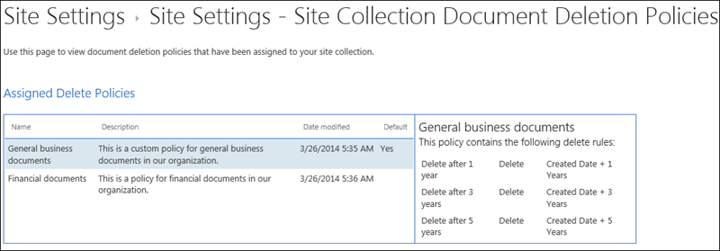

# サイトのドキュメント削除ポリシーを適用または削除するApply or remove a document deletion policy for a site

多くの場合、組織は一定期間、ドキュメントの保持が要求されるコンプライアンス、法的要件、その他の規制を受けます。しかし、必要以上にドキュメントを長く保持すると、組織が法的なリスクにさらされる場合があります。このため、組織は、例えば一般的なビジネス文書は作成の 5 年後に削除する必要があるといった、ドキュメント削除ポリシーをサイトに作成する場合があります。Organizations are often subject to compliance, legal, or other regulations that require them to retain documents for a certain period of time. However, retaining documents for longer than required can expose the organization to legal risk. For this reason, your organization may have created a document deletion policy for your site — for example, general business documents might be required to be deleted five years after they were created.
  
組織に応じて、ドキュメント削除ポリシーには次のようなものがあります。Depending on your organization, a document deletion policy might be:
  
- **必須**サイトの所有者は、お客様が、必須なポリシーは、サイトに自動的に適用されてからです。**Mandatory** A site owner can't opt out of a mandatory policy, which is automatically applied to the site. 
    
- **既定** 既定のポリシーがサイトに自動的に適用されますが、サイトの所有者には次の選択肢がある。**Default** A default policy is automatically applied to a site, but a site owner can: 
    
  - 利用可能な場合は、別のポリシーを選択する。Choose another policy if available.
    
  - そのポリシーがサイト内のコンテンツに関連していない場合は、全く適用しない。Opt out of the policy entirely if it is not relevant to the content in the site.
    
- **必須でも既定でもない** この場合、サイトにはどのポリシーも自動的に適用されず、サイトの所有者はポリシーを適用するためにアクションが必要。**Neither mandatory nor default** In this case, no policy is automatically applied to the site, and the site owner needs to take action to apply one. 
    
ドキュメント削除ポリシーには複数のルールが含まれる場合があります。例えば、あるルールはドキュメントを作成の 1 年後に削除し、別のルールはドキュメントが最後に変更されてから 1 年後に削除する、というようにです。ポリシーに複数のルールが含まれている場合は、サイトへの適用が最適になるルールを選択できます。削除ルールは、サイト内のすべてのライブラリに適用されます。1 つのサイトに一度に有効にできるのは、1 つのポリシーおよび 1 つのルールのみです。ポリシー同様、ルールを既定として設定し、ポリシーが適用されたときに自動的に適用されるようにできます。A document deletion policy may contain more than one rule — for example, one rule might say delete documents one year after they were created, but another rule might say delete documents one year after they were last modified. If a policy contains more than one rule, you can select the rule that best applies to your site. The delete rule will be applied to all libraries within the site. Only one policy and one rule can be active in a site at one time. Like a policy, a rule can be set as default, so that it is applied automatically when the policy is applied.
  
最後に、ドキュメント削除ポリシーは継承されます。サイトにポリシーやルールを選択すると、その選択はすべてのサブサイトに継承されますが、サブサイトの所有者は別のポリシーやルールを選択することにより、継承を止めることができます。ポリシーやルールを選択する際には、サイトの下位にあるすべてのサブサイトのコンテンツを検討してください。Finally, document deletion policies are inherited. When you select a policy or rule for your site, that selection is inherited by all subsites, although an owner of a subsite can break inheritance by selecting a different policy or rule. When you select a policy or rule, consider the content of any subsites below your site.
  
## サイト コレクションで使用できるドキュメント削除ポリシーを表示するView the document deletion policies available in a site collection

組織は、異なるサイト コレクションに異なるポリシーを割り当てる場合があります。サイト コレクション レベルでは、サイト コレクションの所有者は、そのサイト コレクションで使用可能なすべてのドキュメント削除ポリシーを表示できます。ポリシーはサイト コレクション テンプレート (そしてそのテンプレートから作成されたすべてのサイト コレクション) で使用できるようになっている場合も、その特定のサイト コレクションで使用できるようになっている場合もあります。Your organization may assign different policies to different site collections. At the site collection level, an owner of a site collection can view all of the document deletion policies that are available to that site collection. The policies may have been made available to the site collection template (and therefore all site collections created from this template) or to this specific site collection.
  
1. **設定**ダイアログ ボックスの [歯車アイコン] を選択して右上隅で、[サイト コレクションのトップレベル サイトで\>**サイトの設定**。In the top-level site in the site collection, in the upper-right corner, choose **Settings** [gear icon] \> **Site Settings**.
    
2. **サイト コレクションの管理**下にある\>**ドキュメント削除のポリシー**です。Under **Site Collection Administration** \> **Document Deletion Policies**.
    
    > [!NOTE]
    > サイト コレクションにポリシーが割り当てられていない限り、**ドキュメントの削除ポリシー**のリンクは表示されません。ポリシーは、サイトに割り当てられている後にすぐにリンクが表示されないまた、-にポリシーが割り当てられている**ドキュメントの削除ポリシー**のリンクが表示されたらときから 24 時間がかかることができます。The **Document Deletion Policies** link won't appear unless policies have been assigned to the site collection. Also, the link doesn't appear immediately after policies have been assigned to the site — it can take up to 24 hours from when the policies are assigned to when the **Document Deletion Policies** link appears. 
  
3. このページでは次のものが確認できます。On this page you can view:
    
  - 現在割り当てられているポリシーおよび関連するルール。右側のウィンドウで、ルールを表示するポリシーを選択します。The currently assigned policies and the associated rules. Select a policy to view the rules in the right pane.
    
  - 既定のポリシーがある場合、[**既定**] 列に [**はい**] が表示されます。The default policy, if any, displays **Yes** in the **Default** column. 
    
  - ポリシーが [**必須**] として割り当てられている場合は、リストの下にメッセージが表示されます。A message is displayed below the list if the policy has been assigned as **Mandatory**.
    
このリストは表示専用であり、サイト コレクションの所有者に、使用可能なすべてのポリシーとルールが表示されます。ポリシーを適用するには、次のセクションを参照してください。This list is view only, for the site collection owner to see all of the available policies and rules. To apply a policy, see the next section.
  

  
## サイトのドキュメント削除ポリシーを適用または削除するApply or remove a document deletion policy for a site

サイト所有者またはサイト コレクション所有者が自分のサイトに適用するか、まったく適用しないかを選択できるポリシーを組織が作成してある場合があります。As a site owner or site collection owner, your organization may have created policies that you can either apply to your site or opt out of entirely.
  
1. 右下隅の**設定**ダイアログ ボックスの [歯車アイコン] を選択します\>**サイトの設定**。In the upper-right corner, choose **Settings** [gear icon] \> **Site Settings**.
    
2. **サイトの管理**下にある\>**ドキュメント削除のポリシー**です。Under **Site Administration** \> **Document Deletion Policies**.
    
    > [!NOTE]
    > サイト コレクションにポリシーが割り当てられていない限り、**ドキュメントの削除ポリシー**のリンクは表示されません。ポリシーは、サイトに割り当てられている後にすぐにリンクが表示されないまた、-にポリシーが割り当てられている**ドキュメントの削除ポリシー**のリンクが表示されたらときから 24 時間がかかることができます。The **Document Deletion Policies** link won't appear unless policies have been assigned to the site collection. Also, the link doesn't appear immediately after policies have been assigned to the site — it can take up to 24 hours from when the policies are assigned to when the **Document Deletion Policies** link appears. 
  
3. 次のいずれかを実行します。Do one of the following:
    
  - **ポリシーを適用するには**ポリシーを選択して\>でそのポリシー ルールを選択\>**を保存**します。**To apply a policy** Select a policy \> select a rule in that policy \> **Save**.
    
    1 つのサイトに一度に有効にできるのは、1 つのポリシーおよび 1 つのルールのみです。組織は複数のポリシーとルールを用意して選択できるようにする場合も、ポリシーやルールを 1 つだけ用意する場合もあります。Only one policy and one rule can be active in a site at one time. Your organization may provide several policies and rules to choose from, or only one policy or rule.
    
    
  
  - **ポリシーを無効にする**選択**脱退: 削除に注意してください** \> **を保存**します。**To opt out of a policy** Choose **Opt-Out: Do Note Delete** \> **Save**.
    
    サイト所有者が、ドキュメント削除ポリシーがサイトのコンテンツに適用可能ではないと判断した場合は、そのポリシーを除外できます。ただし、[**必須**] としてマークされたポリシーは除外できません。As a site owner, you can opt out of a document deletion policy if you determine that the policy is not applicable to the content in your site. However, you cannot opt out of a policy that has been marked as **Mandatory**.
    
    
  
## ドキュメント削除ポリシーによる、他のポリシーの上書きDocument deletion policies override other policies

コンテンツの保持と削除のために、サイトでは別のポリシーを使用する場合があります。A site may use other policies for retaining and deleting content:
  
- サイト コレクションのコンテンツ タイプ ポリシー。Content type policies for the site collection.
    
- リストまたはライブラリの情報管理ポリシー。Information management policies for a list or library.
    
ドキュメント削除のポリシーをリストまたはライブラリのコンテンツ タイプのポリシーや情報管理ポリシーを既に使用しているサイトに適用すると、ドキュメントの削除ポリシーが有効なときにこれらのポリシーが無視されます。他のポリシーは無視する場合は、「このサイトのコンテンツは、ドキュメントの削除ポリシーを使用」をメッセージに表示されます。If you apply a document deletion policy to a site that already uses content type policies or information management policies for a list or library, those policies are ignored while the document deletion policy is in effect. If other policies are ignored, you will see the message "Content on this site uses Document Deletion Policies".
  
つまり、構造化コンテンツ (情報管理ポリシーとコンテンツ タイプ ポリシー) 用か、非構造化コンテンツ (ドキュメント削除ポリシー) 用のいずれかのポリシーのみを使用するサイトを計画する必要があり、両方を使用することはできません。ドキュメント削除ポリシーを除外した場合、警告は表示されず、他のタイプのポリシーが引き続き機能します。This means you should plan for a site to use only policies meant for structured content (information management policies and content type policies) or unstructured content (document deletion policies), not both. If you opt out of a document deletion policy, the warning will not be displayed and other types of policies will continue to work.
  
サイト ポリシーはドキュメント削除ポリシーの影響を受けません。Site policies are not affected by document deletion policies.
  
### コンテンツ タイプ ポリシーが無視されているかどうかを確認するDetermine if content type policies are being ignored

サイトを使用していた場合は、コンテンツ タイプのポリシーとしてこのメッセージが表示、これらのポリシーが有効では不要になった。コンテンツ タイプのポリシーを復元するには、前述のとおり、脱退のオプションが利用できる場合、サイトからドキュメントの削除ポリシーを削除できます。選択するオプションがない場合は、ドキュメントのポリシーの削除は必須であり、組織の法令遵守責任者に連絡する必要があります。If your site was using content type policies and you now see this message, those policies are no longer in effect. To restore the content type policies, you can remove the document deletion policy from your site, as described earlier, if there's an opt-out option available. If there's no option to opt out, the document deletion policy is mandatory, and you need to contact the compliance officer in your organization.
  
1. 右下隅の**設定**ダイアログ ボックスの [歯車アイコン] を選択します\>**サイトの設定**。In the upper-right corner, choose **Settings** [gear icon] \> **Site Settings**.
    
2. **サイトの管理**下にある\>**ポリシー テンプレートのコンテンツ タイプ**。Under **Site Administration** \> **Content Type Policy Templates**.
    
    
  
### 情報管理ポリシーが無視されているかどうかを確認するDetermine if information management policies are being ignored

サイトは、情報管理ポリシーを使用するいたし、このメッセージが表示、これらのポリシーは不要になった有効にします。情報管理ポリシーを復元するには、前述のとおり、脱退のオプションが利用できる場合、サイトからドキュメントの削除ポリシーを削除できます。選択するオプションがない場合は、ドキュメントのポリシーの削除は必須であり、組織の法令遵守責任者に連絡する必要があります。If your site was using information management policies and you now see this message, those policies are no longer in effect. To restore the information management policies, you can remove the document deletion policy from your site, as described earlier, if there's an opt-out option available. If there's no option to opt out, the document deletion policy is mandatory, and you need to contact the compliance officer in your organization.
  
- リストまたはライブラリで、リボン上の\>[**ライブラリ**] タブ\>**ライブラリの設定** \> [**権限と管理** \> **情報管理ポリシーの設定**。For a list or library, on the Ribbon \> **Library** tab \> **Library Settings** \> under **Permissions and Management** \> **Information Management Policy Settings**.
    
    
  
## 関連項目See also

[ドキュメント削除ポリシーの概要Overview of document deletion policies](document-deletion-policies.md)
  
[ドキュメント削除ポリシーを作成するCreate a document deletion policy](create-a-document-deletion-policy.md)

