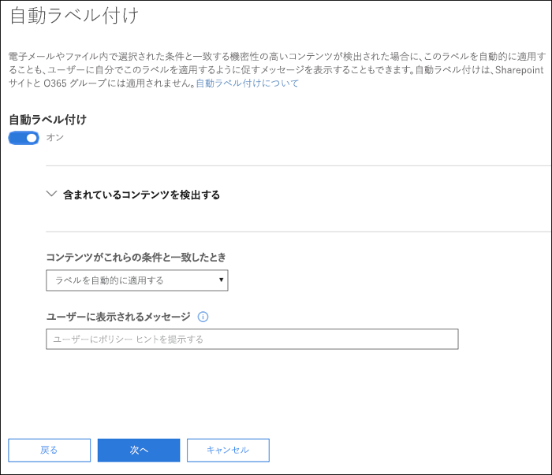
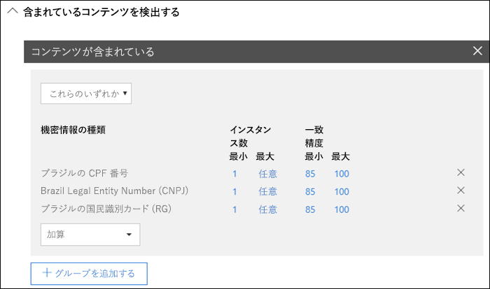
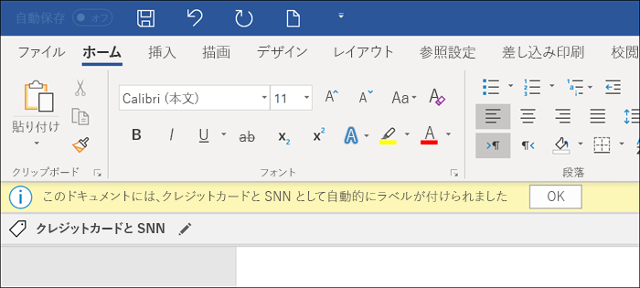
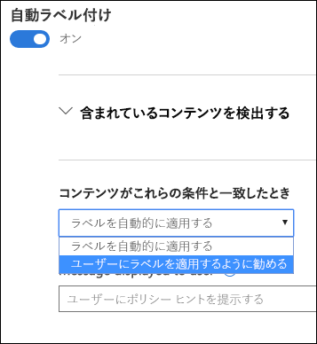
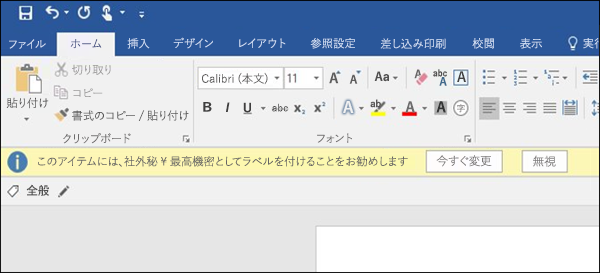

# 機密ラベルをコンテンツに自動的に適用する

機密ラベルを作成する場合、機密情報を含むコンテンツにそのラベルを自動的に割り当てるか、あるいは推奨するラベルを適用するようにユーザーに求めることができます。

機密ラベルを自動的にコンテンツに適用する機能が重要である理由は次のとおりです。

- ユーザーのトレーニングは、一部の分類方法についてのみ必要。

- ユーザーへの依存は、一部のコンテンツを正しく分類するためにのみ必要。

- ユーザーはポリシーについて把握する必要がなくなり、自分たちの仕事に集中できる。

> [!NOTE]
> ラベルを自動的に適用する機能では、Azure Information Protection P2 サブスクリプションが必要になります。この機能を使用するには、[Azure Information Protection 統合ラベル付けクライアントをダウンロードしてインストールする](https://docs.microsoft.com/ja-JP/azure/information-protection/rms-client/install-unifiedlabelingclient-app)必要があります。Azure Information Protection 統合ラベル付けクライアントが不要になるように、Office アプリのこの機能のネイティブ サポートに取り組んでいます。また、統合ラベル付けクライアントは、Windows 上でのみ実行されるため、この機能は、Mac、iOS、Android ではまだサポートされていません。

## 条件に基づいた機密ラベルの自動適用

機密ラベルの最も強力な機能の 1 つは、特定の条件に一致したコンテンツにラベルを自動的に適用する機能です。この場合、機密ラベルは Office 365 によって適用されるため、組織内のユーザーがラベルを適用する必要はありません。
   
コンテンツに特定の種類の機密情報が含まれている場合、そのコンテンツに機密ラベルを自動的に適用することを選択できます。機密ラベルを自動的に適用するように構成すると、データ損失防止 (DLP) ポリシーを作成する場合と同じ機密情報の種類のリストが表示されます。たとえば、クレジット カード番号や社会保障番号などの顧客の個人情報 (PII) が含まれるすべてのコンテンツに高機密ラベルを自動的に適用できます。 

機密情報の種類を選択した後は、インスタンス数または一致精度を変更して条件を絞り込むことができます。詳細については、「[一致の難易度を設定するためのルールの調整](data-loss-prevention-policies.md#tuning-rules-to-make-them-easier-or-harder-to-match)」を参照してください。

さらに、条件で検知する必要があるのは、機密情報の種類のすべてか、またはそのうちの 1 つだけかを選択できます。また、条件をより柔軟または複雑にするには、グループを追加し、グループ間で論理演算子を使用できます。詳細については、「[グループ化および論理演算子](data-loss-prevention-policies.md#grouping-and-logical-operators)」を参照してください。

機密ラベルが自動的に適用されると、ユーザーの Office アプリに通知が表示されます。**[OK]** をクリックして通知を閉じることができます。

## ユーザーが機密ラベルを適用することを推奨

状況に応じて、機密ラベルをコンテンツに自動的に適用する代わりに、ユーザーがラベルを適用することを推奨できます。このオプションでは、分類および関連する保護を受け入れるか、またはラベルがドキュメントや電子メールに適していない場合、推奨事項を無視するかをユーザーが柔軟に選択できます。

推奨ラベルは、Word、PowerPoint、Excel でサポートされていますが、Azure Information Protection 統合ラベル付けクライアントがインストールされている必要があることに注意してください。Outlook での推奨ラベルのサポートに取り組んでいます。

ラベルを推奨される操作として適用するように条件を構成したときのプロンプトの例を、カスタム ポリシー ヒントと共に示します。ポリシー ヒントに表示するテキストを選択できます。

## 自動ラベルと推奨ラベルが適用されるしくみ

- 自動ラベル付けは、Word、Excel、PowerPoint でドキュメントが保存されるときと、Outlook で電子メールが送信されるときに適用されます。これらの条件により、ドキュメントや電子メール内の本文、およびヘッダーとフッターに含まれる機密情報が検出されますが、件名や電子メールの添付ファイルのものは検知されません。

- 以前に手動でラベルが付けられているか、以前に上位の分類で自動的にラベルが付けられているドキュメントと電子メールには自動分類を使用できません。ドキュメントや電子メールに適用できる機密ラベルは (1 つの保持ラベルに加えて) 1 つだけであることにご注意ください。

- 推奨分類は、Word、Excel、PowerPoint でドキュメントが保存されるときに適用されます。Outlook での推奨ラベルのサポートに取り組んでいます。

- 以前に上位の分類でラベルが付けられているドキュメントには推奨分類を使用できません。この場合、コンテンツにすでに上位の分類でラベルが付けられていると、推奨事項とポリシー ヒントに関するプロンプトは、ユーザーに表示されません。

## 複数のラベルに適用するときの複数の条件の評価方法

ラベルは、ポリシー内で指定した位置に従って評価の順序を決められます。先頭に配置したラベルが最下位 (機密性が最も低い) になり、最後に配置したラベルが最上位 (機密性が最も高い) になります。優先度に関する詳細については、「[ラベルの優先度 (順序の問題)](sensitivity-labels.md#label-priority-order-matters)」を参照してください。

## 自動適用または推奨されるように親ラベルを構成しない

親ラベル (サブラベルのあるラベル) はコンテンツに適用することはできませんのでご注意ください。 親ラベルは Azure Information Protection 統合ラベル付けクライアントを使用する Office アプリのコンテンツには適用されないため、決して親ラベルを自動適用または推奨するように構成しないでください。 親ラベルとサブラベルの詳細については、「[サブラベル (ラベルのグループ化)](sensitivity-labels.md#sublabels-grouping-labels)」を参照してください。
