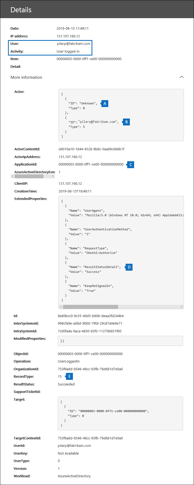

# <a name="search-the-office-365-audit-log-to-troubleshoot-common-scenarios"></a>Office 365 監査ログを検索して一般的なシナリオのトラブルシューティングを行う

この記事では、一般的なサポート シナリオのトラブルシューティングに役立つ Office 365 監査ログ検索ツールの使用方法をご紹介します。監査ログを使用して、以下のことが可能です。

- 侵害されたアカウントにアクセスするために使用されたコンピューターの IP アドレスを見つける
- 誰がメールボックスの電子メール転送を設定したかを判別する
- あるユーザーが自分のメールボックスのメール項目を削除したかどうかを判別する
- ユーザーが受信トレイ ルールを作成したかどうかを判別する
- 組織外のユーザーによるログインが成功した理由を調べる

## <a name="using-the-office-365-audit-log-search-tool"></a>Office 365 監査ログ検索ツールを使用する

この記事で説明されている各トラブルシューティングのシナリオは、Office 365 セキュリティ/コンプライアンスセンターでの監査ログ検索ツールの使用に基づいています。 このセクションでは、監査ログの検索に必要なアクセス許可の一覧を示します。また、監査ログの検索にアクセスして実行する手順について説明します。 各シナリオセクションには、監査ログ検索クエリを構成する方法と、検索条件に一致する監査レコードの詳細情報について調べる方法についての具体的なガイダンスが用意されています。

### <a name="permissions-required-to-use-the-audit-log-search-tool"></a>監査ログ検索ツールを使用するために必要なアクセス許可

Office 365 監査ログを検索するには、Exchange Online で [表示のみの監査ログまたは監査ログの役割が割り当てられている必要があります。 既定では、これらの役割は、Exchange 管理センターの [**アクセス許可**] ページで、コンプライアンス管理および組織の管理役割グループに割り当てられます。 Office 365 および Microsoft 365 の全体管理者は、Exchange Online で組織の管理役割グループのメンバーとして自動的に追加されます。 詳細については、「 [Manage role groups In Exchange Online](https://go.microsoft.com/fwlink/p/?LinkID=730688)」を参照してください。

### <a name="running-audit-log-searches"></a>監査ログ検索の実行

このセクションでは、監査ログの検索を作成して実行するための基本事項について説明します。 この記事のトラブルシューティングの各シナリオでは、これらの手順を出発点として使用します。 詳細な手順については、「[監査ログを検索する](search-the-audit-log-in-security-and-compliance.md#step-1-run-an-audit-log-search)」を参照してください。

1. に[https://protection.office.com/unifiedauditlog](https://protection.office.com/unifiedauditlog)移動し、職場または学校のアカウントを使用してサインインします。
    
    [**監査ログの検索**] ページが表示されます。 
    
    ![条件を設定し、[検索] をクリックして検索を実行します](media/8639d09c-2843-44e4-8b4b-9f45974ff7f1.png)
  
4. 次の検索条件を構成できます。 この記事のトラブルシューティングのシナリオでは、これらのフィールドを構成するための具体的なガイダンスを示します。
    
    a. **アクティビティ:** ドロップダウンリストをクリックして、検索可能なアクティビティを表示します。 検索を実行すると、選択したアクティビティの監査レコードのみが表示されます。 [**すべてのアクティビティの結果を表示]** を選択すると、他の検索条件に一致するすべてのアクティビティの結果が表示されます。 トラブルシューティングのシナリオによっては、このフィールドを空白のままにしておく必要もあります。
    
    b. **開始日**と**終了日:** その期間内に発生したイベントを表示する日付と時刻の範囲を選択します。 既定では、過去7日間が選択されています。 日付と時刻は、世界協定時刻 (UTC) 形式で表示されます。 指定できる最大日付範囲は90日です。

    c. **ユーザー:** このボックスをクリックし、検索結果を表示するユーザーを1人以上選択します。 このボックスで選択したユーザーが実行した選択されたアクティビティの監査レコードは、結果の一覧に表示されます。 組織内のすべてのユーザー (およびサービスアカウント) のエントリを返すには、このボックスを空白のままにします。
    
    d. **ファイル、フォルダー、またはサイト:** 指定したキーワードを含むフォルダーのファイルに関連するアクティビティを検索するために、ファイル名またはフォルダー名の一部またはすべてを入力します。 ファイルまたはフォルダーの URL を指定することもできます。 URL を使用する場合は、url の完全パスを入力するか、URL の一部のみを入力して、特殊文字やスペースを含めないようにしてください。 組織内のすべてのファイルおよびフォルダーのエントリを返すには、このボックスを空白のままにします。 この記事に記載されているすべてのトラブルシューティングのシナリオでは、このフィールドは空白のままになります。
    
5. [**検索**] をクリックして、設定した検索条件で検索を実行します。 
    
    検索結果が読み込まれ、しばらくすると、[**監査ログの検索**] ページの [**結果**] の下に表示されます。 この記事の各セクションでは、特定のトラブルシューティングのシナリオについて、どのような状況において注目すべきかを説明します。

    監査ログの検索結果の表示、フィルター処理、エクスポートに関する詳細は、以下を参照してください。

    - [検索結果を表示する](search-the-audit-log-in-security-and-compliance.md#step-2-view-the-search-results)
    - [検索結果をフィルター処理する](search-the-audit-log-in-security-and-compliance.md#step-3-filter-the-search-results)
    - [検索結果をエクスポートする](search-the-audit-log-in-security-and-compliance.md#step-4-export-the-search-results-to-a-file)

## <a name="find-the-ip-address-of-the-computer-used-to-access-a-compromised-account"></a>侵害されたアカウントにアクセスするために使用されたコンピューターの IP アドレスを見つける

ほとんどの監査レコードには、任意のユーザーによって実行されたアクティビティに対応する IP アドレスが含まれています。また、使用されたクライアントについての情報も監査レコードにも含まれます。

このシナリオで監査ログの検索クエリを構成する方法は次のとおりです。

**アクティビティ:** ケースに関連する場合は、検索する特定のアクティビティを選択します。 侵害されたアカウントのトラブルシューティングについては、「 **Exchange メールボックスアクティビティ**」の「**メールボックスアクティビティにサインイン**しているユーザーの選択を検討してください。 これにより、メールボックスへのサインイン時に使用された IP アドレスを示す監査レコードが返されます。 それ以外の場合は、このフィールドを空白のままにして、すべてのアクティビティの監査レコードを返します。 

> [!TIP]
> このフィールドを空白のままにしたときに返される **UserLoggedIn** アクティビティは、誰かが Office 365 ユーザー アカウントにサインインしたことを示す Azure Active Directory アクティビティです。検索結果でフィルターを使用すると、**UserLoggedIn** 監査レコードを表示できます。

[**開始日**] と [**終了日]:** 調査に適用される日付の範囲を選択します。

**ユーザー:** 危険にさらされているアカウントを調査している場合は、アカウントが侵害されたユーザーを選択します。 これにより、そのユーザーアカウントによって実行されたアクティビティの監査レコードが返されます。

**ファイル、フォルダー、またはサイト:** このフィールドは空白のままにします。

検索の実行後、各アクティビティの IP アドレスが検索結果の [**IP アドレス**] 列に表示されます。検索結果の中のレコードをクリックすると、より詳細な情報がポップアップ ページに表示されます。

## <a name="determine-who-set-up-email-forwarding-for-a-mailbox"></a>誰がメールボックスの電子メール転送を設定したかを判別する

あるメールボックスの電子メール転送が構成されている場合、メールボックスに送られた電子メール メッセージは別のメールボックスに転送されます。組織の内部ユーザーと外部ユーザーのどちらにもメッセージが転送される可能性があります。メールボックスで電子メール転送が設定されると、基盤となる Exchange Online cmdlet の **Set-Mailbox** が使用されます。

このシナリオで監査ログの検索クエリを構成する方法は次のとおりです。

**アクティビティ:** このフィールドを空白のままにすると、検索によってすべてのアクティビティの監査レコードが返されます。 これは、**メールボックスの設定**コマンドレットに関連する監査レコードを返すために必要です。

[**開始日**] と [**終了日]:** 調査に適用される日付の範囲を選択します。

**ユーザー:** 特定のユーザーの電子メールの転送に関する問題を調査している場合以外は、このフィールドを空白のままにします。 これにより、ユーザーに対して電子メール転送が設定されているかどうかを特定できます。

**ファイル、フォルダー、またはサイト:** このフィールドは空白のままにします。

検索の実行後、検索結果ページの [**結果をフィルター**] をクリックします。[**アクティビティ**] 列見出しの下のボックスで「**Set-Mailbox**」と入力すると、**Set-Mailbox** cmdlet に関連する監査レコードだけが表示されます。


この時点で、アクティビティが電子メールの転送に関連しているかどうかを判断するには、各監査レコードの詳細を確認する必要があります。 監査レコードをクリックして [**詳細**] フライアウトページを表示し、[**詳細情報**] をクリックします。 次のスクリーンショットと説明は、メールボックスに電子メールの転送が設定されたことを示す情報を強調しています。


a. [**ObjectId**] フィールドに、電子メール転送が設定されたメールボックスのエイリアスが表示されます。また、このメールボックスは検索結果ページの [**項目**] 列にも表示されます。

b. [**パラメーター** ] フィールドの値*ForwardingSmtpAddress*は、メールボックスに電子メールの転送が設定されたことを示します。 この例では、メールが alpinehouse.onmicrosoft.com 組織外の電子メールアドレス mike@contoso.com に転送されます。

c. *DeliverToMailboxAndForward* パラメーターの値 *True* は、メッセージのコピーが sarad@alpinehouse.onmicrosoft.com に送信され、*しかも* *ForwardingSmtpAddress* パラメーターの電子メール アドレス (この例では mike@contoso.com) に転送されたことを示しています。*DeliverToMailboxAndForward* パラメーターの値が *False* に設定されている場合は、*ForwardingSmtpAddress* パラメーターのアドレスだけに電子メールが転送されます。つまり [**ObjectId**] フィールドで指定されたメールボックスには送信されません。

d. **UserId**フィールドは、 **ObjectId**フィールドで指定されたメールボックスで電子メール転送を設定したユーザーを示します。 このユーザーは、検索結果ページの [**ユーザー** ] 列にも表示されます。 この例では、メールボックスのメール転送がメールボックスの所有者に設定されているように見えます。

メールボックスのメール転送を設定すべきでないと判断される場合は、Exchange Online PowerShell で次のコマンドを実行して、この設定を削除できます:

```
Set-Mailbox <mailbox alias> -ForwardingSmtpAddress $null 
```

電子メール転送に関連するパラメーターの詳細については、[Set-Mailbox](https://docs.microsoft.com/powershell/module/exchange/mailboxes/set-mailbox) に関する記事をご覧ください。

## <a name="determine-if-a-user-deleted-email-items"></a>ユーザーがメールアイテムを削除したかどうかを確認する

2019年1月以降、Microsoft は、すべての Office 365 および Microsoft 組織に対して、既定でメールボックス監査ログをオンにします。 これは、メールボックスの所有者によって実行される特定のアクションが自動的にログに記録されることを意味します。メールボックス監査ログで検索すると、対応するメールボックス監査レコードが使用できるようになります。 既定でメールボックス監査を有効にする前に、組織内のすべてのユーザーメールボックスに対して手動で有効にする必要がありました。 

既定でログに記録されるメールボックスの操作には、メールボックスの所有者によって実行された SoftDelete メールボックスとハードデリートメールボックスアクションがあります。 これは、次の手順を使用して、削除された電子メールアイテムに関連するイベントの監査ログを検索できることを意味します。 既定でのメールボックス監査の詳細については、「 [Manage mailbox auditing](enable-mailbox-auditing.md)」を参照してください。

このシナリオで監査ログの検索クエリを構成する方法は次のとおりです。

**アクティビティ:**[ **Exchange メールボックスアクティビティ**] で、次のアクティビティのいずれかまたは両方を選択します。

- **削除済みアイテムフォルダーからのメッセージの削除:** このアクティビティは、 **Softdelete** mailbox auditing アクションに対応しています。 このアクティビティは、ユーザーがアイテムを選択して**Shift + del**キーを押して完全に削除したときにも記録されます。 アイテムが完全に削除されると、削除済みアイテムの保存期間が経過するまで、ユーザーはそのアイテムを回復できます。

- **メールボックスからメッセージを削除**した場合:このアクティビティは、[**ハードウェアの削除**] メールボックスの監査操作に対応します。 これは、ユーザーが [回復可能なアイテム] フォルダーからアイテムを削除したときにログに記録されます。 管理者は、セキュリティ/コンプライアンスセンターのコンテンツ検索ツールを使用して、削除済みアイテムの保存期間が経過するまで、またはユーザーのメールボックスが保留中の場合に、削除されたアイテムを検索して復元することができます。

[**開始日**] と [**終了日]:** 調査に適用される日付の範囲を選択します。

**ユーザー:** このフィールドでユーザーを選択すると、監査ログ検索ツールは、指定したユーザーによって削除された (SoftDeleted またはハード削除された) 電子メールアイテムの監査レコードを返します。 メールを削除したユーザーがメールボックスの所有者ではない場合があります。

**ファイル、フォルダー、またはサイト:** このフィールドは空白のままにします。

検索の実行後、検索結果をフィルター処理して、ソフト削除された項目またはハード削除された項目の監査レコードを表示できます。監査レコードをクリックすると [**詳細**] ポップアップ ページが表示され、さらに [**詳細情報**] をクリックできます。件名行、項目が削除されたときの場所など、削除済み項目に関する追加情報が [**AffectedItems**] フィールドに表示されます。次のスクリーン ショットは、ソフト削除された項目とハード削除された項目の [**AffectedItems**] フィールドの例を示しています。

**ソフト削除された項目の AffectedItems フィールドの例**


**ハード削除された項目の AffectedItems フィールドの例**


### <a name="recover-deleted-email-items"></a>削除されたメールアイテムを復元する

削除済みアイテムの保存期間の期限が切れていない場合、ユーザーは削除済みアイテムを回復できます。 Exchange Online では、既定の削除済みアイテムの保存期間は14日ですが、管理者はこの設定を最大30日間に増やすことができます。 削除済みアイテムを復元する手順については、「 [web 上の Outlook の削除済みアイテムまたは電子メールを復元する」](https://support.office.com/article/Recover-deleted-items-or-email-in-Outlook-Web-App-C3D8FC15-EEEF-4F1C-81DF-E27964B7EDD4)を参照してください。

前述したように、管理者は削除済みアイテムの保存期間が期限切れになっていない場合や、メールボックスが保留中の場合に、削除されたアイテムを回復できる可能性があります。この場合、アイテムは保持期間が切れるまで保持されます。 コンテンツ検索を実行すると、回復可能なアイテムフォルダー内の回復可能な削除と削除が行われたアイテムが検索クエリに一致すると、検索結果に返されます。 コンテンツ検索の実行の詳細については、「 [Office 365 のコンテンツ検索](content-search.md)」を参照してください。

> [!TIP]
> 削除済み電子メール項目を検索するには、監査レコードの [**AffectedItems**] フィールドに表示されている件名行の全体または一部を検索します。

## <a name="determine-if-a-user-created-an-inbox-rule"></a>ユーザーが受信トレイ ルールを作成したかどうかを判別する

ユーザーが自分の Exchange Online メールボックスの受信トレイ ルールを作成すると、それに対応する監査レコードが監査ログに保存されます。受信トレイ ルールの詳細については、次を参照してください:

- [Web 上の Outlook で受信トレイ ルールを使用する](https://support.office.com/article/use-inbox-rules-in-outlook-on-the-web-8400435c-f14e-4272-9004-1548bb1848f2)
- [Outlook でルールを使用してメール メッセージを管理する](https://support.office.com/article/Manage-email-messages-by-using-rules-C24F5DEA-9465-4DF4-AD17-A50704D66C59)

このシナリオで監査ログの検索クエリを構成する方法は次のとおりです。

**アクティビティ:**[ **Exchange メールボックスのアクティビティ**] で、[**新規-受信トレイルールの作成/変更/有効化/無効化/無効化**] を選択します。

[**開始日**] と [**終了日]:** 調査に適用される日付の範囲を選択します。

**ユーザー:** 特定のユーザーを調査している場合以外は、このフィールドを空白のままにします。 これにより、任意のユーザーによって設定された新しい受信トレイルールを識別できます。

**ファイル、フォルダー、またはサイト:** このフィールドは空白のままにします。

検索を実行すると、このアクティビティの監査レコードが検索結果に表示されます。 監査レコードをクリックして**詳細**のフライアウトページを表示し、[**詳細情報**] をクリックします。 受信トレイルールの設定に関する情報は、[**パラメーター** ] フィールドに表示されます。 次のスクリーンショットと説明は、受信トレイルールについての情報を強調して示しています。


a. [**ObjectId**] フィールドに受信トレイ ルールの完全な名前が表示されます。この名前には、ユーザーのメールボックスのエイリアス (たとえば SaraD) と受信トレイ ルールの名前 (たとえば「管理者からのメッセージを移動」) が含まれます。

b. [**パラメーター**] フィールドには受信トレイ ルールの条件が表示されます。この例では、[*送信者*] パラメーターによって条件が指定されます。[*送信者*] パラメーターに定義された値は、admin@alpinehouse.onmicrosoft.com から送られた電子メールを受信トレイ ルールで処理することを示しています。受信トレイ ルールの条件の定義に使用できるパラメーターの完全なリストについては、「[New-InboxRule](https://docs.microsoft.com/powershell/module/exchange/mailboxes/new-inboxrule)」の記事を参照してください。

c. *Movetofolder*パラメーターは、受信トレイルールのアクションを指定します。 この例では、admin@alpinehouse.onmicrosoft.com から受信したメッセージは、 *Adminsearch*という名前のフォルダーに移動されます。 また、受信トレイルールのアクションを定義するために使用できるパラメーターの完全な一覧については、新しい受信トレイ[ルール](https://docs.microsoft.com/powershell/module/exchange/mailboxes/new-inboxrule)の記事も参照してください。

d. [ **UserId** ] フィールドには、 **ObjectId**フィールドに指定されている受信トレイルールを作成したユーザーが表示されます。 このユーザーは、検索結果ページの [**ユーザー** ] 列にも表示されます。

## <a name="investigate-why-there-was-a-successful-login-by-a-user-outside-your-organization"></a>組織外のユーザーによるログインが成功した理由を調べる

Office 365 監査ログで監査レコードを確認するときに、外部ユーザーが Azure Active Directory によって認証され、組織に正常にログインしたことを示すレコードが表示されることがあります。 たとえば、contoso.onmicrosoft.com の管理者は、別の Office 365 組織 (たとえば、fabrikam.onmicrosoft.com) のユーザーが contoso.onmicrosoft.com に正常にログインしたことを示す監査レコードを表示することがあります。 同様に、Microsoft アカウント (MSA) (Outlook.com や Live.com など) を使用しているユーザーが組織に正常にログインしていることを示す監査レコードが表示されることがあります。 このような状況では、監査されたアクティビティは**ユーザーがログイン**しています。 

この動作は仕様です。 Office 365 のディレクトリサービスである azure Active Directory (Azure AD) は、外部ユーザーが組織内の SharePoint サイトまたは OneDrive の場所にアクセスしようとすると、*パススルー認証*と呼ばれるものを許可します。 外部ユーザーがこれを試行すると、Office 365 資格情報を入力するように求めるメッセージが表示されます。 Azure AD は資格情報を使用してユーザーを認証します。つまり、Azure AD のみがユーザーの身元を確認することになります。 監査レコードに成功したことを示すのは、Azure AD がユーザーを認証した結果です。 ログインに成功した場合は、ユーザーが組織内のすべてのリソースにアクセスしたり、その他のアクションを実行したりすることはできません。 これは、ユーザーが Azure AD によって認証されたことを示します。 パススルーユーザーが SharePoint または OneDrive リソースにアクセスするためには、組織内のユーザーは、共有への招待または匿名の共有リンクを送信して、リソースを外部ユーザーと明示的に共有する必要があります。 

> [!NOTE]
> Azure AD は、SharePoint Online と OneDrive for business などの*ファーストパーティアプリケーション*に対してのみパススルー認証を許可します。 他のサードパーティ製アプリケーションでは使用できません。

パススルー認証の結果である**ユーザーのログイン**イベントの監査レコードにおける関連するプロパティの例と説明を次に示します。 監査レコードをクリックして [**詳細**] フライアウトページを表示し、[**詳細情報**] をクリックします。



   a. このフィールドは、組織内のリソースにアクセスしようとしたユーザーが組織の Azure AD で見つからなかったことを示します。

   b. このフィールドには、組織内のリソースにアクセスしようとした外部ユーザーの UPN が表示されます。 このユーザー ID は、監査レコードの**user**プロパティと**UserId**プロパティでも識別されます。

   c. **ApplicationId**プロパティは、ログオン要求をトリガーしたアプリケーションを識別します。 この監査レコードの ApplicationId プロパティに表示される 00000003-0000-0ff1-ce00-000000000000 の値は、SharePoint Online を示しています。 OneDrive for Business にも同じ ApplicationId があります。

   d. これは、パススルー認証が成功したことを示します。 言い換えると、ユーザーは Azure AD によって正常に認証されています。 

   e. **RecordType**値が**15**の場合は、監査されたアクティビティ (USERLOGGEDIN) が Azure AD でセキュリティで保護されたトークンサービス (STS) ログオンイベントであることを示します。

UserLoggedIn 監査レコードに表示されるその他のプロパティの詳細については、「 [Office 365 Management ACTIVITY API スキーマ](https://docs.microsoft.com/office/office-365-management-api/office-365-management-activity-api-schema#azure-active-directory-base-schema)の Azure AD 関連スキーマ情報」を参照してください。

次の2つの例では、パススルー認証のためにユーザーが監査アクティビティ**にログイン**することになります。 

  - Microsoft アカウント (SaraD@outlook.com など) を使用しているユーザーが fourthcoffee.onmicrosoft.com の OneDrive for Business アカウントのドキュメントにアクセスしようとしており、それらのユーザーが SaraD@outlook.com の対応するゲストユーザーアカウントではありませんfourthcoffee.onmicrosoft.com。

  - Office 365 組織内の職場または学校のアカウントを持つユーザー (pilarp@fabrikam.onmicrosoft.com など) が contoso.onmicrosoft.com の SharePoint サイトにアクセスしようとし、それらが pilarp@fabrikam.com の対応するゲストユーザーアカウントではありませんcontoso.onmicrosoft.com。


### <a name="tips-for-investigating-successful-logins-resulting-from-pass-through-authentication"></a>パススルー認証の結果として成功したログインを調査するためのヒント

- ログインしたユーザーによって実行されたアクティビティの監査ログを検索します。監査レコード**に記録**されます。 [**ユーザー** ] ボックスに外部ユーザーの UPN を入力し、シナリオに関連する場合は日付範囲を使用します。 たとえば、次の検索条件を使用して検索を作成できます。

   

    **ユーザーがログイン**しているユーザーとは別の監査レコードが返されることがあります。これには、組織内のユーザーが外部ユーザーと共有しているリソース、外部ユーザーがアクセスしたドキュメント、変更された、またはダウンロードしたドキュメントがあるかどうかを示すものがあります。は、それらと一緒に共有されています。

- 監査レコード**にログイン**しているユーザーによって識別された外部ユーザーとファイルが共有されたことを示す SharePoint 共有アクティビティを検索します。 詳細については、「 [Office 365 監査ログで共有監査を使用する](use-sharing-auditing.md)」を参照してください。

- 調査に関連するレコードが含まれている監査ログの検索結果をエクスポートして、Excel を使用して外部ユーザーに関連する他のアクティビティを検索できるようにします。 詳細については、「 [Export, configure, and view audit log records](export-view-audit-log-records.md)」を参照してください。
