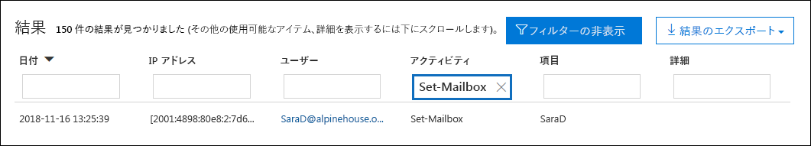
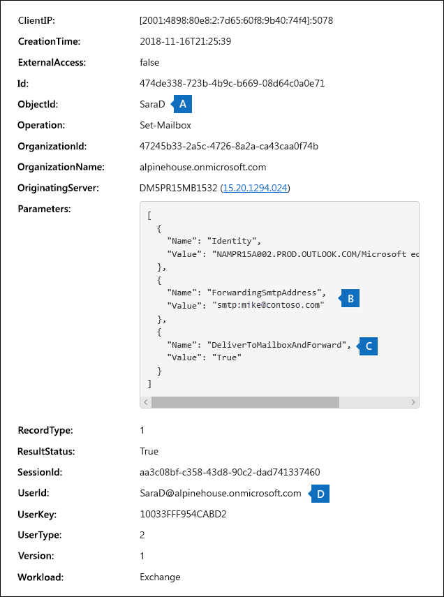
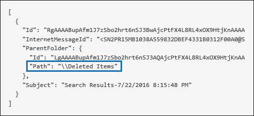
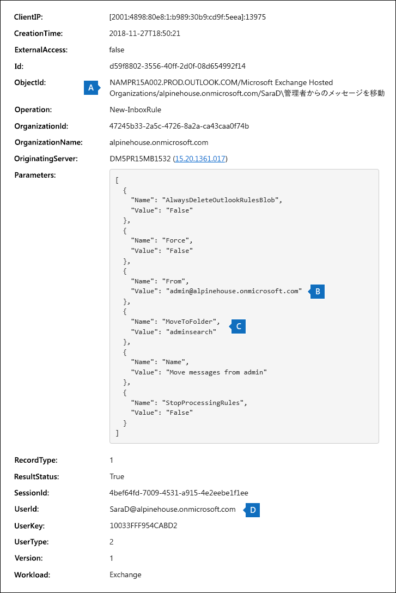

# <a name="search-the-office-365-audit-log-to-troubleshoot-common-scenarios"></a>Office 365 監査ログを検索して一般的なシナリオのトラブルシューティングを行う

この記事では、一般的なサポート シナリオのトラブルシューティングに役立つ Office 365 監査ログ検索ツールの使用方法をご紹介します。監査ログを使用して、以下のことが可能です。

- 侵害されたアカウントにアクセスするために使用されたコンピューターの IP アドレスを見つける
- 誰がメールボックスの電子メール転送を設定したかを判別する
- あるユーザーが自分のメールボックスのメール項目を削除したかどうかを判別する
- ユーザーが受信トレイ ルールを作成したかどうかを判別する

## <a name="using-the-office-365-audit-log-search-tool"></a>Office 365 監査ログ検索ツールを使用する

この記事に示すトラブルシューティングの各シナリオは、Office 365 セキュリティ/コンプライアンス センターの監査ログ検索ツールを使用する場合に基づいています。このセクションでは、監査ログを検索するのに必要なアクセス許可を示し、監査ログ検索機能にアクセスして実行する手順を示します。各シナリオのセクションでは、監査ログの検索クエリを構成する方法と、検索条件に一致した監査レコードの詳細情報の中から何を探すべきかについて具体的に示します。

### <a name="permissions-required-to-use-the-audit-log-search-tool"></a>監査ログ検索ツールを使用するために必要なアクセス許可

Office 365 監査ログを検索するには、Exchange Online で監査ログの役割、または監査ログ表示専用の役割を与えられている必要があります。既定で、これらの役割は Exchange 管理センターの [**アクセス許可**] ページで「コンプライアンス管理」および「組織の管理」役割グループに割り当てられます。詳しくは、「[Exchange Online の役割グループの管理](https://go.microsoft.com/fwlink/p/?LinkID=730688)」を参照してください。

### <a name="running-audit-log-searches"></a>監査ログ検索の実行

このセクションでは、監査ログの検索を作成して実行する基本的な方法を示します。この記事のそれぞれのトラブルシューティング シナリオでは、下記の手順に従って操作を開始してください。手順ごとの詳しい説明については、「[Office 365 のセキュリティ/コンプライアンス センターで監査ログを検索する](search-the-audit-log-in-security-and-compliance.md#step-1-run-an-audit-log-search)」を参照してください。

1. [https://protection.office.com](https://protection.office.com) に移動します。
  
2. 職場または学校のアカウントを使用して、Office 365 にサインインします。

3. セキュリティ センターとコンプライアンス センターの左側のウィンドウで、[**検索と調査**]  >  [**監査ログの検索**] の順にクリックします。
    
    [**監査ログの検索**] ページが表示されます。 
    
    ![条件を設定し、[検索] をクリックして検索を実行します](media/8639d09c-2843-44e4-8b4b-9f45974ff7f1.png)
  
4. 次の検索条件を構成できます。なお、この記事のそれぞれのトラブルシューティング シナリオでは、これらのフィールドの推奨設定を示しています。
    
    a. **アクティビティ** - ドロップダウン リストをクリックすると、検索可能なアクティビティが表示されます。検索の実行後、選択したアクティビティに関する監査レコードだけが表示されます。[**すべてのアクティビティの結果を表示**] を選択すると、その他の検索条件を満たすすべてのアクティビティに関する結果が表示されます。トラブルシューティング シナリオによっては、このフィールドを空白のままにすべき場合があります。
    
    b. **開始日**と**終了日**。特定の期間内に発生したイベントを表示するには、その日付と時刻の範囲を選択します。既定では過去 7 日間が選択されています。日付と時刻は、協定世界時 (UTC) 形式で指定します。指定できる最大の日付範囲は 90 日間です。

    c. **ユーザー**。このボックスをクリックして、検索結果を表示する対象の 1 人以上のユーザーを選択します。このボックスで選択したユーザーによって実行された、選択されたアクティビティの監査レコードが結果の一覧に表示されます。組織のすべてのユーザー (およびサービス アカウント) のエントリを返すには、このボックスを空白のままにします。
    
    d. **ファイル、フォルダー、サイトなど** - 特定のキーワードを含むファイルまたはフォルダーに関するアクティビティを検索するには、ファイルまたはフォルダー名の一部またはすべてを入力します。ファイルまたはフォルダーの URL を指定することもできます。URL を使用する場合、必ず全ての URL パスを入力してください。URL の一部だけを入力する場合は、特殊文字やスペースを含めることはできません。このボックスを空白のままにすると、組織のすべてのファイルとフォルダーに関する項目が返されます。なお、この記事のすべてのトラブルシューティング シナリオではこのフィールドを空白のままにします。
    
5. [**検索**] をクリックして、設定した検索条件で検索を実行します。 
    
    検索結果が読み込まれ、少し待つと [**監査ログの検索**] ページの [**結果**] の下に結果が表示されます。以下の各セクションでは、特定のトラブルシューティング シナリオでどんな情報を探すべきかを説明します。

    監査ログの検索結果の表示、フィルター処理、エクスポートに関する詳細は、以下を参照してください。

    - [検索結果を表示する](search-the-audit-log-in-security-and-compliance.md#step-2-view-the-search-results)
    - [検索結果をフィルター処理する](search-the-audit-log-in-security-and-compliance.md#step-3-filter-the-search-results)
    - [検索結果をエクスポートする](search-the-audit-log-in-security-and-compliance.md#step-4-export-the-search-results-to-a-file)

## <a name="finding-the-ip-address-of-the-computer-used-to-access-a-compromised-account"></a>侵害されたアカウントへのアクセスに使用されたコンピューターの IP アドレスを見つける

ほとんどの監査レコードには、任意のユーザーによって実行されたアクティビティに対応する IP アドレスが含まれています。また、使用されたクライアントについての情報も監査レコードにも含まれます。

このシナリオで監査ログの検索クエリを構成する方法は次のとおりです。

**アクティビティ** - 該当する場合は、検索対象となる具体的なアクティビティを選択します。侵害されたアカウントのトラブルシューティングの場合は、[**Exchange メールボックス アクティビティ**] の下の [**メールボックスへのユーザーのサインイン**] アクティビティを選択することを考慮してください。これにより、メールボックスへのサインインで使われた IP アドレスを含む監査レコードが返されます。あるいは、このフィールドを空白のままにすると、すべてのアクティビティに関するレコードが返されます。 

> [!TIP]
> このフィールドを空白のままにしたときに返される **UserLoggedIn** アクティビティは、誰かが Office 365 ユーザー アカウントにサインインしたことを示す Azure Active Directory アクティビティです。検索結果でフィルターを使用すると、**UserLoggedIn** 監査レコードを表示できます。

**開始日**と**終了日** - 調査の対象となる日付範囲を選択します。

**ユーザー** - 侵害されたアカウントを調査している場合は、アカウントが侵害されたユーザーを選択します。これにより、そのユーザー アカウントで実行されたアクティビティに関する監査レコードが返されます。

**ファイル、フォルダー、またはサイト** - このフィールドは空白のままにします。

検索の実行後、各アクティビティの IP アドレスが検索結果の [**IP アドレス**] 列に表示されます。検索結果の中のレコードをクリックすると、より詳細な情報がポップアップ ページに表示されます。

## <a name="determining-who-set-up-email-forwarding-for-a-mailbox"></a>メールボックスの電子メール転送を誰が設定したかを判別する

あるメールボックスの電子メール転送が構成されている場合、メールボックスに送られた電子メール メッセージは別のメールボックスに転送されます。組織の内部ユーザーと外部ユーザーのどちらにもメッセージが転送される可能性があります。メールボックスで電子メール転送が設定されると、基盤となる Exchange Online cmdlet の **Set-Mailbox** が使用されます。

このシナリオで監査ログの検索クエリを構成する方法は次のとおりです。

**アクティビティ** - このフィールドを空白のままにして、すべてのアクティビティの監査レコードが検索で返されるようにします。**Set-Mailbox** cmdlet に関連するすべての監査レコードを返すには、こうする必要があります。

**開始日**と**終了日** - 調査の対象となる日付範囲を選択します。

**ユーザー** - 特定の 1 ユーザーの電子メール転送の問題を調査している場合を除き、このフィールドは空白のままにします。これにより、いずれかのユーザーの電子メール転送が設定されたかどうか識別しやすくなります。

**ファイル、フォルダー、またはサイト** - このフィールドは空白のままにします。

検索の実行後、検索結果ページの [**結果をフィルター**] をクリックします。[**アクティビティ**] 列見出しの下のボックスで「**Set-Mailbox**」と入力すると、**Set-Mailbox** cmdlet に関連する監査レコードだけが表示されます。



この時点で、それぞれの監査レコードの詳細を調べて、そのアクティビティが電子メール転送に関連しているかどうか判別する必要があります。監査レコードをクリックして [**詳細**] ポップアップ ページを表示させ、[**詳細情報**] をクリックしてください。以下のスクリーン ショットと説明は、メールボックスで電子メール転送が設定されたことを示しています。



a. [**ObjectId**] フィールドに、電子メール転送が設定されたメールボックスのエイリアスが表示されます。また、このメールボックスは検索結果ページの [**項目**] 列にも表示されます。

b. [**パラメーター**] フィールドの値 *ForwardingSmtpAddress* は、メールボックスでメール転送が設定されていることを示します。この例では、alpinehouse.onmicrosoft.com 組織の外部にある mike@contoso.com というメール アドレスに電子メールが転送されています。

c. *DeliverToMailboxAndForward* パラメーターの値 *True* は、メッセージのコピーが sarad@alpinehouse.onmicrosoft.com に送信され、*しかも* *ForwardingSmtpAddress* パラメーターの電子メール アドレス (この例では mike@contoso.com) に転送されたことを示しています。*DeliverToMailboxAndForward* パラメーターの値が *False* に設定されている場合は、*ForwardingSmtpAddress* パラメーターのアドレスだけに電子メールが転送されます。つまり [**ObjectId**] フィールドで指定されたメールボックスには送信されません。

d. [**UserId**] フィールドは、[**ObjectId**] フィールドで指定されたメールボックスの電子メール転送を設定したユーザーを示します。また、このユーザーは検索結果ページの [**ユーザー**] 列にも表示されます。このケースの場合、メールボックス所有者が自分のメールボックスのメール転送を設定したようです。

メールボックスのメール転送を設定すべきでないと判断される場合は、Exchange Online PowerShell で次のコマンドを実行して、この設定を削除できます:

```
Set-Mailbox <mailbox alias> -ForwardingSmtpAddress $null 
```

電子メール転送に関連するパラメーターの詳細については、[Set-Mailbox](https://docs.microsoft.com/powershell/module/exchange/mailboxes/set-mailbox) に関する記事をご覧ください。

## <a name="determining-if-a-user-deleted-email-items"></a>ユーザーがメール項目を削除したかどうかを判別する

削除された電子メール項目についての監査ログ レコードを Office 365 監査ログに保存するには、その前に、組織の各ユーザー メールボックスに監査が有効になっている必要があります。さらに、メールボックス アクション SoftDelete と HardDelete の監査が有効になっている必要があります。その方法については、「[Office 365 でメールボックスの監査を有効にする](enable-mailbox-auditing.md)」を参照してください。ユーザーのメールボックスの監査がすでに有効になっている場合は、次の手順に従って、削除されたメール項目に関連するイベントを監査ログの中で探します。

このシナリオで監査ログの検索クエリを構成する方法は次のとおりです。

**アクティビティ** - [**Exchange メールボックスのアクティビティ**] の下で、次のアクティビティの 1 つまたは両方を選択します。

- **削除済みアイテム フォルダーから削除されたメッセージ** - このアクティビティは、メールボックス監査アクション **SoftDelete** に対応しています。また、ユーザーがメール項目を選び **Shift+Delete** を押して完全に削除した場合にも、このアクティビティがログに記録されます。項目が完全に削除された後、削除済み項目の保存期間が切れるまでは、ユーザーがそれを回復できます。

- **メールボックスからパージされたメッセージ** - このアクティビティは、メールボックス監査アクション **HardDelete** に対応しています。これは、「回復可能なアイテム」フォルダーからユーザーが項目をパージしたときにログに記録されます。削除済み項目の保持期間が切れるまで (またはユーザーのメールボックスが保留中の場合はそれより長い期間にわたり)、管理者は Office 365 セキュリティ/コンプライアンス センターのコンテンツ検索ツールを使用して、バージ済み項目を検索し、回復することができます。

**開始日**と**終了日** - 調査の対象となる日付範囲を選択します。

**ユーザー** - このフィールドでユーザーを選択した場合、監査ログ検索ツールは、そのユーザーによって削除 (SoftDeleted または HardDeleted) されたメール項目に関する監査レコードを返します。場合によっては、電子メールを削除したユーザーがメールボックス所有者でないこともあります。

**ファイル、フォルダー、またはサイト** - このフィールドは空白のままにします。

検索の実行後、検索結果をフィルター処理して、ソフト削除された項目またはハード削除された項目の監査レコードを表示できます。監査レコードをクリックすると [**詳細**] ポップアップ ページが表示され、さらに [**詳細情報**] をクリックできます。件名行、項目が削除されたときの場所など、削除済み項目に関する追加情報が [**AffectedItems**] フィールドに表示されます。次のスクリーン ショットは、ソフト削除された項目とハード削除された項目の [**AffectedItems**] フィールドの例を示しています。

**ソフト削除された項目の AffectedItems フィールドの例**



**ハード削除された項目の AffectedItems フィールドの例**


### <a name="recovering-deleted-email-items"></a>削除済み電子メール項目の回復

削除済みアイテムの保存期間の期限が切れていない場合、ユーザーは削除済みアイテムを回復できます。Exchange Online では、既定の削除済みアイテムの保存期間は14日ですが、管理者はこの設定を最大30日間に増やすことができます。削除済みアイテムを復元する手順については、「 [web 上の Outlook の削除済みアイテムまたは電子メールを復元する」](https://support.office.com/article/Recover-deleted-items-or-email-in-Outlook-Web-App-C3D8FC15-EEEF-4F1C-81DF-E27964B7EDD4)を参照してください。

すでに述べたように、削除済み項目の保持期間がまだ切れていない場合、またはメールボックスが保留中の場合に、管理者はハード削除された項目を回復できる可能性があります。後者の場合、保留期間が切れるまで項目が保持されます。コンテンツ検索を実行すると、「回復可能なアイテム」フォルダー内のソフト削除された項目とハード削除された項目が検索クエリに一致する場合、それらが検索結果に返されます。コンテンツ検索の実行の詳細については、「[Office 365 でのコンテンツ検索](content-search.md)」を参照してください。

> [!TIP]
> 削除済み電子メール項目を検索するには、監査レコードの [**AffectedItems**] フィールドに表示されている件名行の全体または一部を検索します。

## <a name="determining-if-a-user-created-an-inbox-rule"></a>ユーザーが受信トレイ ルールを作成したかどうかを判別する

ユーザーが自分の Exchange Online メールボックスの受信トレイ ルールを作成すると、それに対応する監査レコードが監査ログに保存されます。受信トレイ ルールの詳細については、次を参照してください:

- [Web 上の Outlook で受信トレイ ルールを使用する](https://support.office.com/article/use-inbox-rules-in-outlook-on-the-web-8400435c-f14e-4272-9004-1548bb1848f2)
- [Outlook でルールを使用してメール メッセージを管理する](https://support.office.com/article/Manage-email-messages-by-using-rules-C24F5DEA-9465-4DF4-AD17-A50704D66C59)

このシナリオで監査ログの検索クエリを構成する方法は次のとおりです。

**アクティビティ** - [**Exchange メールボックスのアクティビティ**] の下で、[**New-InboxRule 受信トレイ ルールの作成/変更/有効化/無効化**] を選択します。

**開始日**と**終了日** - 調査の対象となる日付範囲を選択します。

**ユーザー** - 特定の 1 ユーザーを調査している場合を除き、このフィールドは空白のままにします。これにより、いずれかのユーザーによって設定された新しい受信トレイ ルールを識別しやすくなります。

**ファイル、フォルダー、またはサイト** - このフィールドは空白のままにします。

検索の実行後、このアクティビティに関するすべての監査レコードが検索結果に表示されます。1 つの監査レコードをクリックすると [**詳細**] ポップアップ ページが表示され、さらに [**詳細情報**] をクリックできます。受信トレイ ルール設定に関する情報が [**パラメーター**] フィールドに表示されます。次のスクリーン ショットと説明は、受信トレイ ルールに関する情報を示しています。



a. [**ObjectId**] フィールドに受信トレイ ルールの完全な名前が表示されます。この名前には、ユーザーのメールボックスのエイリアス (たとえば SaraD) と受信トレイ ルールの名前 (たとえば「管理者からのメッセージを移動」) が含まれます。

b. [**パラメーター**] フィールドには受信トレイ ルールの条件が表示されます。この例では、[*送信者*] パラメーターによって条件が指定されます。[*送信者*] パラメーターに定義された値は、admin@alpinehouse.onmicrosoft.com から送られた電子メールを受信トレイ ルールで処理することを示しています。受信トレイ ルールの条件の定義に使用できるパラメーターの完全なリストについては、「[New-InboxRule](https://docs.microsoft.com/powershell/module/exchange/mailboxes/new-inboxrule)」の記事を参照してください。

c. [*MoveToFolder*] パラメーターは、受信トレイ ルールのアクションを指定します。この例では、admin@alpinehouse.onmicrosoft.com から受け取ったメッセージを *AdminSearch* というフォルダーに移動します。さらに、受信トレイ ルールのアクションの定義に使用できるパラメーターの完全なリストについては「[New-InboxRule](https://docs.microsoft.com/powershell/module/exchange/mailboxes/new-inboxrule)」の記事を参照してください。

d. [**UserId**] フィールドは、[**ObjectId**] フィールドで指定された受信トレイ ルールを作成したユーザーを示します。また、このユーザーは検索結果ページの [**ユーザー**] 列にも表示されます。