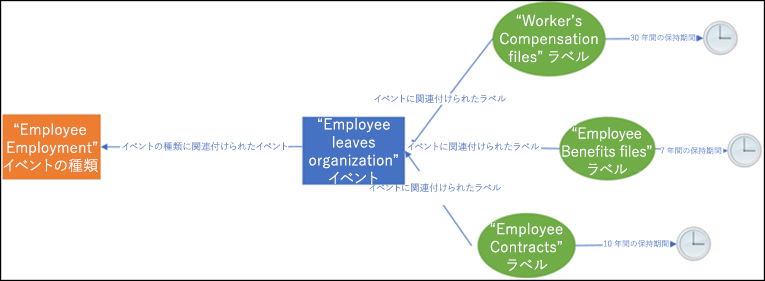
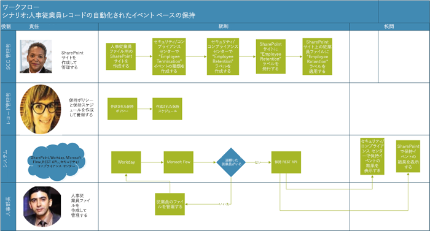
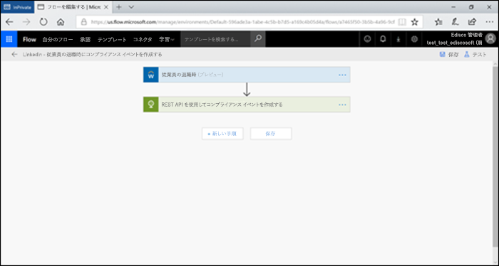
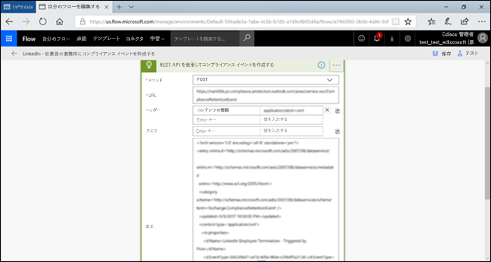
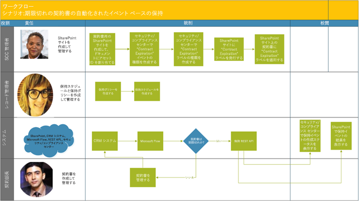
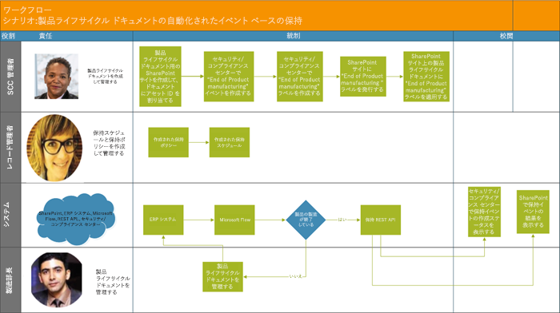

# イベント ベースの保持を自動化するAutomate event-based retention

組織内のコンテンツの急増や、コンテンツが ROT (冗長、古い、無駄) になる可能性はビジネスにとって重大です。法、ビジネス、規制に関するコンプライアンスの課題に継続的に対応するには、企業は重要な情報を保持して保護し、関連性をすばやく見い出す必要があります。ビジネスを成功させるには、重要かつ適切な情報のみを保持することが鍵となります。The explosion of content in organizations and how it can become ROT (redundant, obsolete, trivial) is serious business. To continue to meet legal, business, and regulatory compliance challenges, businesses must be able to keep and protect important information and quickly find what’s relevant. Retaining only important, pertinent information is key to a business’s success.

そのため、組織は Office 365 セキュリティ/コンプライアンス センターの保持ソリューションを活用できます。保持は、[保持ラベル](labels.md)を使用してトリガーできます。保持ラベルには、[特定のイベントに基づいて保持期間を設定する](event-driven-retention.md)オプションがあります。通常、保持期間は、コンテンツの作成日や最終変更日など既知の日付に基づきます。ただし、組織で、ある従業員が組織から離れてから 7 年後などの特定のイベントに基づいてコンテンツを破棄するという要件が生じることもあります。Hence organizations can take advantage of retention solutions in the Office 365 Security & Compliance Center. Retention can be triggered by using [retention labels](labels.md). A retention label has the option to [base the retention period on a specific event](event-driven-retention.md). Typically, the retention period is based on a known date, such as the creation date or last modified date for the content. However, organizations also have requirements to dispose of content based on the occurrence of an event, such as 7 years after an employee leaves an organization.

コンテンツの破棄に対応するには、イベントが生じた時期を把握することが不可欠です。コンテンツ量が急激に増えると、適切なタイミングで準拠した方法でコンテンツを保持したり破棄したりすることが課題となります。In order to ensure compliant disposal of content, it is imperative to know when an event takes place. With the volume of content increasing rapidly, it is becoming challenging to retain and dispose content in a timely and compliant manner.

イベント ベースの保持はこの問題を解決できます。このトピックでは、Microsoft 365 REST API を使用して、イベントによりビジネス プロセス フローの保持の自動化をセットアップする方法について説明します。Event-based retention solves this problem. This topic explains how to set up your business process flows to automate retention through events by using the Microsoft 365 REST API.

## イベント ベースの保持についてAbout event-based retention

組織の規模は小、中、大とさまざまです。日常的に作成および管理されるビジネス文書、法的文書、従業員のファイル、契約、製品文書は劇的に増えていきます。An organization can be small, medium, or large. The number of business documents, legal documents, employee files, contracts, and product documents that get created and managed on a day to day basis is increasing dramatically.

たとえば、数十、数百単位の従業員が入社したり退社したりします。人事部はビジネス要件に基づいて従業員関連の文書を継続的に作成、更新、削除します。このプロセスは、会社で規定されている各種保持ポリシーの対象となります。For example, each day, tens and hundreds of employees are joining and leaving organizations. The HR department continues to create, update, or delete employee-related documents as per business requirements. This process is subject to the different retention policies outlined for the business:

- **コンテンツの保持期間は既知の日付にすることことが可能です**。たとえば、コンテンツの作成日、最終変更日または最終ラベル設定日などです。文書を作成後 7 年間保持し、その後処分するなどが可能です。**The period of retention for content can be a known date** such as the date the content was created, last modified or labeled. For example, you might retain documents for seven years after they're created and then delete them.

- **またコンテンツの保持期間を不明な日付にすることもできます**。たとえば、保持ラベルを使用すると、従業員が組織を離れるなどの特定のイベントが生じる時点に基づいて保持期間を設定できます。**The period of retention of content can also be an unknown date**. For example, with retention labels, you can also base a retention period on when a specific type of event occurs, such as an employee leaving the organization.

イベントによって保持時間が開始され、対象種類のイベントに適用されるラベルが付いたすべてのコンテンツに、そのラベルの保持アクションが実行されます。これを、イベント ベースの保持と呼びます。詳しくは、[イベント適応型保持の概要](event-driven-retention.md)をご覧ください。The event triggers the start of the retention period, and all content with a label applied for that type of event get the label's retention actions enforced on them. This is called event-based retention - to learn more, see [Overview of event-driven retention](event-driven-retention.md).

## イベント ベースの保持をセットアップするSet up event-based retention

このセクションでは、コンテンツを保持する前に実行する必要がある事柄について取り上げます。This section describes what needs to be done prior to retaining content.

### 役割を特定するIdentify roles

ビジネス文書の有効かつ効率的な保持に関して責任を担うレコード管理タスクを実行する、組織内の各種役割を特定します。Identify the different roles in an organization that perform Record Management tasks that would be responsible for effective and efficient retention of business documents.

  | **ユーザー****Persona**| **役割****Role**|
  | - | - |
  | 管理者Admin | 保持イベントの種類、保持ラベル、レコード リポジトリを SharePoint で作成しますCreates Retention Event types, Retention labels and Record repositories in SharePoint |
  | レコード管理者Records Manager                                  | 保持ポリシー、保持スケジュール ガイダンス、コンプライアンスの詳細を提供しますProvides Retention Policies and Retention Schedules guidance and compliance details   |
  | システム管理者 (会社)System Admin (business)                          | Microsoft 365 を扱う外部システムをセットアップして管理しますSets up and manages external systems to work with Microsoft 365                       |
  | インフォメーション ワーカーInformation Worker                               | (人事、財務、IT など) ビジネス プロセスのライフ サイクルを管理しますManages the lifecycle of their business process (HR, Finance, IT etc)                 |

### セキュリティ/コンプライアンス センターをセットアップするSet up the Security & Compliance Center
  
1. コンプライアンス管理者がイベントタイプの作成を行います - 例えば、従業員の解雇、契約の有効期限、製品の製造終了など（[イベント適応型保持](https://docs.microsoft.com/ja-JP/office365/securitycompliance/event-driven-retention)の段階的プロセスを参照してください）Compliance admin creates an event type – for example, Employee Termination or Contract Expiration or End of Product Manufacturing (Please refer to step by step process in [Event-driven retention](https://docs.microsoft.com/en-us/office365/securitycompliance/event-driven-retention).
    
1. コンプライアンス管理者は、業務内容に基づいて保持ラベルを作成し、そのラベルをイベントタイプに関連付けます。Compliance admin creates a retention label based on an event and associates the label with an event type.
    
1. 保持ラベルをトリガーするには以下の 4 種類があります。There are 4 types of triggers for retention labels:
            
    1. 作成日Create date
                
    1. 最終更新日時Last modified
                
    1. ラベル日付 (コンテンツがラベル付けされた日)Label date (when the content was labeled)
                
    1. イベント ベースEvent-based
    
1. コンプライアンス管理者が保持ラベルを発行します。Compliance admin publishes the retention label.

### SharePoint をセットアップするSet up SharePoint
   
レコード リポジトリを作成するには、コンプライアンス管理者は次の操作を行います。To create a records repository, the compliance admin:

1. SharePoint サイトを作成します。Creates a SharePoint site.

1. 次のいずれかを実行します。Does one of the following:
        
    - SharePoint ライブラリを作成します。ライブラリ レベルでイベント ベースのラベルを設定します。詳しくは、[SharePoint ライブラリ、フォルダー、またはドキュメント セット内のすべてのコンテンツへの既定の保持ラベルの適用](labels.md#applying-a-default-retention-label-to-all-content-in-a-sharepoint-library-folder-or-document-set)をご覧ください。Creates a SharePoint library: Set event-based label at the library level. For more information, see [Applying a default retention label to all content in a SharePoint library, folder, or document set](labels.md#applying-a-default-retention-label-to-all-content-in-a-sharepoint-library-folder-or-document-set).
          
    - SharePoint でドキュメント セットをセットアップします。詳しくは、[ドキュメント セットの概要](https://support.office.com/ja-JP/article/Introduction-to-Document-Sets-3DBCD93E-0BED-46B7-B1BA-B31DE2BCD234)をご覧ください。Sets up a Document set in SharePoint. For more information, see [Introduction to document sets](https://support.office.com/en-us/article/Introduction-to-Document-Sets-3DBCD93E-0BED-46B7-B1BA-B31DE2BCD234).
      
1. 各従業員ドキュメント セットにアセット ID (アセット ID は組織が使用する製品名またはコードです。たとえば、従業員番号はアセット ID となります) を割り当てます。そのため、フォルダーにアセット ID を割り当て、そのフォルダー内のすべての項目が同じアセット ID を自動的に継承します。つまり、すべての項目に、同じイベントによってトリガーされた保持期間を設定できます。Assigns Asset Id (asset ID is a product name or code used by the organization, for example, Employee number can be an asset id) to each employee document set (By assigning the asset ID to the folder, every item in that folder automatically inherits the same asset ID. This means all the items can have their retention period triggered by the same event.

## イベント ベースの保持をトリガーする方法Ways to trigger event-based retention

イベント ベースの保持をトリガーするには 2 つの方法があります。There are two ways in which event-based retention can be triggered:

- **管理センターのUIを使用する**これは、一度に保存するコンテンツを少なくするために使用できるプロセスで、保持をトリガーする頻度は、月ごと、年ごとなど、あまりありません。この方法について詳しくは、[イベント適応型保持の概要](event-driven-retention.md)を参照してください。ただし、この方法で保持をトリガーすると、時間がかかり、エラーが発生しやすくなるため、拡張性が妨げられます。したがって、保持をトリガーするための自動化された一枚岩のソリューションは、データのセキュリティとコンプライアンスを強化することができます。**Using the admin center UI** This is a process that can be used to retain less content at a time or the frequency to trigger retention is not often, such as monthly or yearly. For more information on this method, see [Overview of event-driven retention](event-driven-retention.md). However, this way to trigger retention can be time-consuming and prone to error, thus stunting scalability. Therefore, an automated, seamless solution to trigger retention can enhance the security and compliance of data.

- **M365 REST API を使用する** このプロセスは、1 度に大量のコンテンツを保持したり、保持をトリガーする頻度が毎日や週ごとなど多い場合に使用できます。このフローによって基幹業務システムでイベントが生じたタイミングが検出され、セキュリティ/コンプライアンス センターで関連するイベントが自動的に作成されます。該当するイベントが生じるたびに UI でイベントを手動で作成する必要はありません。**Using a M365 REST API** This process can be used when large amounts of content are to be retained at a time and/or the frequency to trigger retention is often such as daily or weekly. The flow detects when an event occurs in your line-of-business system, and then automatically creates a related event in the Security & Compliance Center. You don't need to manually create an event in the UI each time one occurs.

REST API の使用に関して次の 2 つのオプションがあります。There are two options for using the REST API:

- **Microsoft Flow または同様のアプリケーション**を使用して、イベントを自動的にトリガーできます。Microsoft Flow は他のシステムとの接続のオーケストレーターです。Microsoft Flow の使用に際して、カスタム ソリューションは必要ありません。**Microsoft Flow or a similar application** can be used to trigger the occurrence of an event automatically. Microsoft Flow is an orchestrator for connecting to other systems. Using Microsoft Flow does not require a custom solution.

- **PowerShell または HTTP クライアントを使用して REST API を呼び出す** PowerShell (バージョン 6 以降) を使用して Microsoft 365 REST API を呼び出してイベントを作成します。**PowerShell or an HTTP client to call REST API** Using PowerShell (version 6 or higher) to call Microsoft 365 REST API to create events. 

Rest API は一連の HTTP 操作 (メソッド) をサポートするサービス エンドポイントで、サービスのリソースに対する作成/取得/更新/削除のアクセス権を提供します。詳しくは、[REST API 要求/応答のコンポーネント](https://docs.microsoft.com/ja-JP/rest/api/gettingstarted/#components-of-a-rest-api-requestresponse)をご覧ください。この場合、Microsoft 365 REST API を使用することにより、POST および GET 操作 (メソッド) を使用してイベントを作成および取得できます。A Rest API is a service endpoint that supports sets of HTTP operations (methods), which provide create/retrieve/update/delete access to the service's resources - for more information, see [Components of a REST API request/response](https://docs.microsoft.com/en-us/rest/api/gettingstarted/#components-of-a-rest-api-requestresponse). In this case, by using the Microsoft 365 REST API, events can be created and retrieved using operations (methods) POST and GET.

## シナリオ例Example scenarios

次のシナリオについて考えます。Let’s consider the following scenarios.

### シナリオ 1: 従業員が組織のメンバーでなくなるScenario 1: Employees leaving the organization 

ある組織は、従業員ごとに多数の従業員関連文書を作成し、保管しています。これらの文書は、各従業員の雇用期間中、管理および保持されます。ただし、従業員が組織のメンバーでなくなったり、従業員が退職したりすると、法的および会社の要件に基づいて、規定された期間、その従業員の文書を保持する義務が組織にはあります。An organization creates and stores numerous employee related documents per employee. These documents are managed and retained during the employment of each employee. However, when the employee leaves the organization or the employment is terminated, the organization is obligated by legal and business requirements to retain the documents of that employee for a stipulated period.

ここで、複数の従業員が毎日組織のメンバーでなくなるとすると、数千ではないものの数百もの文書の保持期間を毎日トリガーしなくてはなりません。Now if multiple employees leave the organization every day, the organization must trigger the retention clock of hundreds if not thousands of documents each day.

また、各従業員に関して保持期間を計算する必要もあります。従業員の退社日に、従業員レコードの種類に応じて、日、月、年数を加算します。たとえば、従業員の報酬に関する文書と同じ従業員の福利厚生申請書類では保持期間が異なる可能性があります。In addition to this, the retention period needs to be calculated for each of these employees as Employee termination date + number of days, months or years based on the type of the employee record. For example, worker’s compensation of the employee vs benefits filings of the same employee may need different retention.

次の図には、1 つのイベントに複数のラベルを関連付けられることを示しています。「従業員の報酬 (Worker’s compensation)」の下のすべてのファイルと、「従業員の福利厚生 (Employee benefits)」ラベルのすべてのファイルがどちらも、従業員が組織のメンバーでなくなるときの単一のイベントに関連付けられています。これら別々のファイルの保持期間は異なります。そのため、従業員が組織のメンバーでなくなると、各ラベルのファイルには異なる保持期間が適用されます。異なる種類のラベルまたは各従業員のラベルに対して異なる保持期間すべてをトリガーするのは、たいへん難しい作業となります。しかも複数の従業員に対してそうしなければなりません。The diagram below shows how there can be multiple labels that are associated with a single event. Here all the files under Worker’s compensation label and all the files under Employee benefits label are both associated with a single event which is the employee leaving the organization. Each of these different files have different retention clocks. So, when an employee leaves the organization, these files within each label experience a different retention period. To trigger all these different retention clocks for each file type or label for each employee is a very challenging task. Imagine doing this for multiple employees.

そのため、複数の従業員に対して異なる保持期間をトリガーするプロセスを自動化すると、時間の節約になり、エラーがなくなり、非常に効率的となります。Hence an automated process to trigger these different retention clocks for multiple employees will be time-saving, error-free and extremely efficient .

**このシナリオに関する自動化されたイベント ベースの保持を構成する:****Configuring Automated Event Based Retention for this scenario:**

  - 管理者は Jane Doe、John Smith などの文書セットに従業員フォルダーを作成します。Admin c reates employee folders to the Document set such as Jane Doe, John Smith.

  - 管理者は、福利厚生、給与、従業員報酬などの従業員ファイルを各従業員フォルダーに追加しますAdmin adds employee files such as Benefits, Payroll, Worker’s Compensation to each employee folder

  - 管理者は、各従業員フォルダーにアセット ID を割り当てます。Admin assigns Asset Id to each employee folder. 

  - SCC 管理者はSCC Admin l

  - セキュリティ＆コンプライアンスセンターにログインします。Logs into the Security & Compliance Center

  - SCC Adminは、「従業員解雇」、「従業員雇用」などの従業員関連のイベントタイプを作成します。SCC Admin creates employee related events types such as “Employee Termination”, “Employee Hire” events.

  - SCC Adminは、「従業員保持」ラベルを作成します。SCC Admin creates “Employee Retention” label.

  - この「従業員の保持」ラベルを SharePoint で公開し、従業員ファイルに手動または自動で適用します。This “Employee Retention” label is published and applied manually or automatically to the employee files in SharePoint

  - Workday などの人事管理システムを Microsoft Flow と連携させ、従業員ファイルの管理を定期的に実行できますHR Management System like Workday can work with Microsoft Flow to run periodically to manage employee files

  - 従業員が組織のメンバーではなくなると、Flow によって M365 イベント ベースの保持 REST API がトリガーされ、特定の従業員ファイルの保持期間が開始されます。If an employee has left the organization, the Flow will trigger the M365 Event Based Retention REST API that will begin the retention clock on the specific employee’s files.

#### Microsoft Flow の使用Using Microsoft Flow

手順 1 - Microsoft 365 REST API を使用してイベントを作成するフローを作成しますStep 1- Create a flow to create an event using the Microsoft 365 REST API

##### イベントを作成するCreate an event

REST API を呼び出すサンプル コードSample code to call the REST API

<table>
<thead>
<tr class="header">
<th>メソッドMethod</th>
<th>POSTPOST</th>
<th></th>
</tr>
</thead>
<tbody>
<tr class="odd">
<td>URLURL</td>
<td>https://ps.compliance.protection.outlook.com/psws/service.svc/ComplianceRetentionEvent)</td>
<td></td>
</tr>
<tr class="even">
<td>ヘッダーHeaders</td>
<td>Content-TypeContent-Type</td>
<td>application/atom+xmlapplication/atom+xml</td>
</tr>
<tr class="odd">
<td>本文Body</td>
<td>
&lt;?xml version='1.0' encoding='utf-8' standalone='yes'?&gt;&lt;?xml version='1.0' encoding='utf-8' standalone='yes'?&gt;

&lt;entry xmlns:d='http://schemas.microsoft.com/ado/2007/08/dataservices'&lt;entry xmlns:d='http://schemas.microsoft.com/ado/2007/08/dataservices'

xmlns:m='http://schemas.microsoft.com/ado/2007/08/dataservices/metadata'xmlns:m='http://schemas.microsoft.com/ado/2007/08/dataservices/metadata'

xmlns='http://www.w3.org/2005/Atom'&gt;xmlns='http://www.w3.org/2005/Atom'&gt;

&lt;category scheme='http://schemas.microsoft.com/ado/2007/08/dataservices/scheme' term='Exchange.ComplianceRetentionEvent' /&gt;&lt;category scheme='http://schemas.microsoft.com/ado/2007/08/dataservices/scheme' term='Exchange.ComplianceRetentionEvent' /&gt;

&lt;updated&gt;9/9/2017 10:50:00 PM&lt;/updated&gt;&lt;updated&gt;9/9/2017 10:50:00 PM&lt;/updated&gt;

&lt;content type='application/xml'&gt;&lt;content type='application/xml'&gt;

&lt;m:properties&gt;&lt;m:properties&gt;

&lt;d:Name&gt;Employee Termination &lt;/d:Name&gt;&lt;d:Name&gt;Employee Termination &lt;/d:Name&gt;

&lt;d:EventType&gt;99e0ae64-a4b8-40bb-82ed-645895610f56&lt;/d:EventType&gt;&lt;d:EventType&gt;99e0ae64-a4b8-40bb-82ed-645895610f56&lt;/d:EventType&gt;

&lt;d:SharePointAssetIdQuery&gt;1234&lt;/d:SharePointAssetIdQuery&gt;&lt;d:SharePointAssetIdQuery&gt;1234&lt;/d:SharePointAssetIdQuery&gt;

&lt;d:EventDateTime&gt;2018-12-01T00:00:00Z &lt;/d:EventDateTime&gt;&lt;d:EventDateTime&gt;2018-12-01T00:00:00Z &lt;/d:EventDateTime&gt;

&lt;/m:properties&gt;&lt;/m:properties&gt;

&lt;/content&gt;&lt;/content&gt;

&lt;/entry&gt;&lt;/entry&gt;
</td>
<td></td>
</tr>
<tr class="even">
<td>認証Authentication</td>
<td>基本Basic</td>
<td></td>
</tr>
<tr class="odd">
<td>ユーザー名Username</td>
<td>“Complianceuser”“Complianceuser”</td>
<td></td>
</tr>
<tr class="even">
<td>パスワードPassword</td>
<td>“Compliancepassword”“Compliancepassword”</td>
<td></td>
</tr>
</tbody>
</table>

##### 利用可能なパラメーターAvailable parameters

<table>
<thead>
<tr class="header">
<th><strong>パラメーター</strong><strong>Parameters</strong></th>
<th><strong>説明</strong><strong>Description</strong></th>
<th><strong>メモ</strong><strong>Notes</strong></th>
</tr>
</thead>
<tbody>
<tr class="odd">
<td>&lt;d:Name&gt;&lt;/d:Name&gt;&lt;d:Name&gt;&lt;/d:Name&gt;</td>
<td>イベントの一意の名前を入力します。Provide a unique name for the event,</td>
<td>末尾にスペースおよび以下の文字を含めることはできません: % \* \ &amp; &lt; &gt; | # ? , : ;Cannot contain trailing spaces, and the following characters: % \* \ &amp; &lt; &gt; | # ? , : ;</td>
</tr>
<tr class="even">
<td>&lt;d:EventType&gt;&lt;/d:EventType&gt;&lt;d:EventType&gt;&lt;/d:EventType&gt;</td>
<td>イベントの種類の名前 (または GUID) を入力します。Enter event type name (or Guid),</td>
<td>例: 「従業員の退職」というイベントの種類を保持ラベルに関連付ける必要があります。Example: “Employee termination”. Event type has to be associated with a retention label.</td>
</tr>
<tr class="odd">
<td>&lt;d:SharePointAssetIdQuery&gt;&lt;/d:SharePointAssetIdQuery&gt;&lt;d:SharePointAssetIdQuery&gt;&lt;/d:SharePointAssetIdQuery&gt;</td>
<td>“ComplianceAssetId:” と従業員 ID を入力しますEnter “ComplianceAssetId:” + employee Id</td>
<td>例: &quot;ComplianceAssetId:12345&quot;Example:&quot;ComplianceAssetId:12345&quot;</td>
</tr>
<tr class="even">
<td>&lt;d:EventDateTime&gt;&lt;/d:EventDateTime&gt;&lt;d:EventDateTime&gt;&lt;/d:EventDateTime&gt;</td>
<td>イベントの日時Event Date and Time</td>
<td>
形式: yyyy-MM-ddTHH:mm:ssZ。例:Format: yyyy-MM-ddTHH:mm:ssZ, Example:

2018-12-01T00:00:00Z2018-12-01T00:00:00Z
</td>
</tr>
</tbody>
</table>

##### 応答コードResponse codes

| **応答コード****Response Code** | **説明****Description**       |
| ----------------- | --------------------- |
| 302302               | リダイレクトRedirect              |
| 201201               | 作成済みCreated               |
| 403403               | 承認に失敗しましたAuthorization Failed  |
| 401401               | 認証に失敗しましたAuthentication Failed |

##### 時間範囲に基づいてイベントを取得するGet Events based on time range

<table>
<thead>
<tr class="header">
<th>メソッドMethod</th>
<th>GETGET</th>
<th></th>
</tr>
</thead>
<tbody>
<tr class="odd">
<td>URLURL</td>
<td><ol start="4" type="1">
<li>
https://ps.compliance.protection.outlook.com/psws/service.svc/ComplianceRetentionEvent?BeginDateTime=2019-01-11&amp;EndDateTime=2019-01-16https://ps.compliance.protection.outlook.com/psws/service.svc/ComplianceRetentionEvent?BeginDateTime=2019-01-11&amp;EndDateTime=2019-01-16
</li>
</ol></td>
<td></td>
</tr>
<tr class="even">
<td>ヘッダーHeaders</td>
<td>Content-TypeContent-Type</td>
<td>application/atom+xmlapplication/atom+xml</td>
</tr>
<tr class="odd">
<td></td>
<td></td>
<td></td>
</tr>
<tr class="even">
<td>認証Authentication</td>
<td>基本Basic</td>
<td></td>
</tr>
<tr class="odd">
<td>ユーザー名Username</td>
<td>“Complianceuser”“Complianceuser”</td>
<td></td>
</tr>
<tr class="even">
<td>パスワードPassword</td>
<td>“Compliancepassword”“Compliancepassword”</td>
<td></td>
</tr>
</tbody>
</table>

##### 応答コードResponse codes

| **応答コード****Response Code** | **説明****Description**                   |
| ----------------- | --------------------------------- |
| 200200               | 問題ありません。イベントの一覧は atom+ xml 形式ですOK, A list of events in atom+ xml |
| 404404               | 見つかりませんNot found                         |
| 302302               | リダイレクトRedirect                          |
| 401401               | 承認に失敗しましたAuthorization Failed              |
| 403403               | 認証に失敗しましたAuthentication Failed             |

##### ID でイベントを取得するGet an event by ID

| メソッドMethod         | GETGET   |                      |
| -------------- | ------------------------------------------------------------------------------------------------------------------------------------------------------------------------------------------------------------------------------------------------------------------ | -------------------- |
| URLURL            | [https://ps.compliance.protection.outlook.com/psws/service.svc/ComplianceRetentionEvent(‘174e9a86-74ff-4450-8666-7c11f7730f66’)](https://ps.compliance.protection.outlook.com/psws/service.svc/ComplianceRetentionEvent\('174e9a86-74ff-4450-8666-7c11f7730f66'\))[https://ps.compliance.protection.outlook.com/psws/service.svc/ComplianceRetentionEvent(‘174e9a86-74ff-4450-8666-7c11f7730f66’)](https://ps.compliance.protection.outlook.com/psws/service.svc/ComplianceRetentionEvent\('174e9a86-74ff-4450-8666-7c11f7730f66'\)) |                      |
| ヘッダーHeader         | Content-TypeContent-Type                                                                                                                                                                                                                                                       | application/atom+xmlapplication/atom+xml |
| 認証Authentication | 基本Basic                                                                                                                                                                                                                                                              |                      |
| ユーザー名Username       | “Complianceuser”“Complianceuser”                                                                                                                                                                                                                                                   |                      |
| パスワードPassword       | “Compliancepassword”“Compliancepassword”                                                                                                                                                                                                                                               |                      |

##### 応答コードResponse codes

| **応答コード****Response Code** | **説明****Description**                                      |
| ----------------- | ---------------------------------------------------- |
| 200200               | 問題ありません。応答本体に atom+xml 形式のイベントが含まれていますOK, The response body contains the event in atom+xml |
| 404404               | 見つかりませんNot found                                            |
| 302302               | リダイレクトRedirect                                             |
| 401401               | 承認に失敗しましたAuthorization Failed                                 |
| 403403               | 認証に失敗しましたAuthentication Failed                                |

##### 名前でイベントを取得するGet an event by name

| メソッドMethod         | GETGET       |                      |
| -------------- | -------------------------------------------------------------------------------------------------------------------------------------------- | -------------------- |
| URLURL            | <https://ps.compliance.protection.outlook.com/psws/service.svc/ComplianceRetentionEvent('EventByRESTPost-2226bfebcc2841a8968ba71f9516b763')> |                      |
| ヘッダーHeaders        | Content-TypeContent-Type                                                                                                                                 | application/atom+xmlapplication/atom+xml |
| 認証Authentication | 基本Basic                                                                                                                                        |                      |
| ユーザー名Username       | “Complianceuser”“Complianceuser”                                                                                                                             |                      |
| パスワードPassword       | “Compliancepassword”“Compliancepassword”                                                                                                                         |                      |

##### 応答コードResponse codes

| **応答コード****Response Code** | **説明****Description**                                      |
| ----------------- | ---------------------------------------------------- |
| 200200               | 問題ありません。応答本体に atom+xml 形式のイベントが含まれていますOK, The response body contains the event in atom+xml |
| 404404               | 見つかりませんNot found                                            |
| 302302               | リダイレクトRedirect                                             |
| 401401               | 承認に失敗しましたAuthorization Failed                                 |
| 403403               | 認証に失敗しましたAuthentication Failed                                |

#### PowerShell (ver.6 以降) または任意の HTTP クライアントの使用Using PowerShell (ver.6 or higher) or any HTTP client

手順 1: PowerShell に接続します。Step 1: Connect to PowerShell.

手順 2: 次のスクリプトを実行します。Step 2: Run the following script.

<table>
<tbody>
<tr class="odd">
<td>
param([string]$baseUri)param([string]$baseUri)

$userName = &quot;UserName&quot;$userName = &quot;UserName&quot;

$password = &quot;Password&quot;$password = &quot;Password&quot;

$securePassword = ConvertTo-SecureString $password -AsPlainText -Force$securePassword = ConvertTo-SecureString $password -AsPlainText -Force

$credentials = New-Object System.Management.Automation.PSCredential($userName, $securePassword)$credentials = New-Object System.Management.Automation.PSCredential($userName, $securePassword)

$EventName=&quot;EventByRESTPost-$(([Guid]::NewGuid()).ToString('N'))&quot;$EventName=&quot;EventByRESTPost-$(([Guid]::NewGuid()).ToString('N'))&quot;

Write-Host &quot;Start to create an event with name: $EventName&quot;Write-Host &quot;Start to create an event with name: $EventName&quot;

$body = &quot;&lt;?xml version='1.0' encoding='utf-8' standalone='yes'?&gt;$body = &quot;&lt;?xml version='1.0' encoding='utf-8' standalone='yes'?&gt;

&lt;entry xmlns:d='http://schemas.microsoft.com/ado/2007/08/dataservices'&lt;entry xmlns:d='http://schemas.microsoft.com/ado/2007/08/dataservices'

xmlns:m='http://schemas.microsoft.com/ado/2007/08/dataservices/metadata'xmlns:m='http://schemas.microsoft.com/ado/2007/08/dataservices/metadata'

xmlns='http://www.w3.org/2005/Atom'&gt;xmlns='http://www.w3.org/2005/Atom'&gt;

&lt;category scheme='http://schemas.microsoft.com/ado/2007/08/dataservices/scheme' term='Exchange.ComplianceRetentionEvent' /&gt;&lt;category scheme='http://schemas.microsoft.com/ado/2007/08/dataservices/scheme' term='Exchange.ComplianceRetentionEvent' /&gt;

&lt;updated&gt;7/14/2017 2:03:36 PM&lt;/updated&gt;&lt;updated&gt;7/14/2017 2:03:36 PM&lt;/updated&gt;

&lt;content type='application/xml'&gt;&lt;content type='application/xml'&gt;

&lt;m:properties&gt;&lt;m:properties&gt;

&lt;d:Name&gt;$EventName&lt;/d:Name&gt;&lt;d:Name&gt;$EventName&lt;/d:Name&gt;

&lt;d:EventType&gt;e823b782-9a07-4e30-8091-034fc01f9347&lt;/d:EventType&gt;&lt;d:EventType&gt;e823b782-9a07-4e30-8091-034fc01f9347&lt;/d:EventType&gt;

&lt;d:SharePointAssetIdQuery&gt;'ComplianceAssetId:123'&lt;/d:SharePointAssetIdQuery&gt;&lt;d:SharePointAssetIdQuery&gt;'ComplianceAssetId:123'&lt;/d:SharePointAssetIdQuery&gt;

&lt;/m:properties&gt;&lt;/m:properties&gt;

&lt;/content&gt;&lt;/content&gt;

&lt;/entry&gt;&quot;&lt;/entry&gt;&quot;

$event = $null$event = $null

trytry

{{

$event = Invoke-RestMethod -Body $body -Method 'POST' -Uri &quot;$baseUri/ComplianceRetentionEvent&quot; -ContentType &quot;application/atom+xml&quot; -Authentication Basic -Credential $credentials -MaximumRedirection 0$event = Invoke-RestMethod -Body $body -Method 'POST' -Uri &quot;$baseUri/ComplianceRetentionEvent&quot; -ContentType &quot;application/atom+xml&quot; -Authentication Basic -Credential $credentials -MaximumRedirection 0

}}

catchcatch

{{

$response = $_.Exception.Response$response = $_.Exception.Response

if($response.StatusCode -eq &quot;Redirect&quot;)if($response.StatusCode -eq &quot;Redirect&quot;)

{{

$url = $response.Headers.Location$url = $response.Headers.Location

Write-Host &quot;redirected to $url&quot;Write-Host &quot;redirected to $url&quot;

$event = Invoke-RestMethod -Body $body -Method 'POST' -Uri $url -ContentType &quot;application/atom+xml&quot; -Authentication Basic -Credential $credentials -MaximumRedirection 0$event = Invoke-RestMethod -Body $body -Method 'POST' -Uri $url -ContentType &quot;application/atom+xml&quot; -Authentication Basic -Credential $credentials -MaximumRedirection 0

}}

}}

$event | fl \*$event | fl \*
</td>
</tr>
</tbody>
</table>

#### 両方のオプションの結果を確認するVerify the outcome in both options

手順 1: セキュリティ/コンプライアンス センターに移動しますStep 1: Go to Security & Compliance Center

手順 2: [データ ガバナンス] の [イベント] をクリックしますStep 2: Click on Events under Data Governance

手順 3: イベントが作成されていることを確認します。Step 3: Verify Event has been created.

同様に、イベント ベースの保持を自動化する上記のオプションを以下のシナリオに使用することもできます。Similarly, the above options to automate event based retention can be used for the following scenarios as well.

### シナリオ 2: 契約の期限切れScenario 2: Contracts Expiring

組織には、顧客、ベンダー、パートナーとの単一の契約向けの複数のレコードが存在することがあります。こうした文書は、SharePoint などの文書ライブラリに格納できます。契約の終了は、対象の契約に関連付けられている文書の保持期間の開始時期に基づいて判別されます。たとえば、契約に関連するすべてのレコードは契約の有効期限後、5 年間は保持する必要があります。契約の期限切れは、5 年間の保持期間をトリガーするイベントとなります。An organization can have multiple records for a single contract with customers, vendors and partners. These documents can reside in a document library like SharePoint. The ending of a contract determines the start of the retention period of the documents associated with the contract. For example: all records related to contracts need to be retained for five years from the time the contract expires. The event that triggers the five-year retention period is the expiration of the contract.

顧客関係管理 (CRM) システムを Microsoft 365 と連携させ、契約文書の保持をトリガーできます。A Customer Relationship Management (CRM) system can work with Microsoft 365 and trigger retention of Contract documents

**このシナリオに関する自動化されたイベント ベースの保持を構成する:****Configuring Automated Event Based Retention for this scenario:**

  - 管理者は、契約の種類ごとにさまざまなフォルダーを含む SharePoint ライブラリを作成します。Admin creates a SharePoint library with various folders for each contract type.

  - 管理者は、ライセンス契約書、開発契約などの契約ファイル意を各契約フォルダーに追加しますAdmin adds contract files such as License Contracts, Development Contracts to each contract folder

  - 管理者は、各契約フォルダーにアセット ID を割り当てますAdmin assigns Asset Id to each contract folder

  - SCC 管理者がセキュリティ/コンプライアンス センターにログインしますSCC Admin logs into the Security & Compliance Center

  - SCC Adminは、 「契約締結」、 「契約解消」イベントなどの契約関連イベントタイプを作成します。SCC Admin creates contract related events types such as “Contract Creation”, “Contract Expiration” events.

  - SCC Adminは「契約解消」ラベルを作成します。SCC Admin creates “Contract Expiration” label.

  - この「契約の有効期限」ラベルを SharePoint で公開し、契約ファイルに手動または自動で適用しますThis “ Contract Expiration” label is published and applied manually or automatically to the contract files in SharePoint

  - 契約管理システムを Microsoft Flow または同様のアプリケーションと連携させ、契約ファイルの管理を定期的に実行できますContract Management System can work with Microsoft Flow or a similar application to run periodically to manage contract files

  - 契約の期限が切れると、Microsoft Flow によって M365 イベント ベースの保持 REST API がトリガーされ、特定の契約ファイルの保持期間が開始されます。If a contract expires, Microsoft Flow will trigger the M365 Event Based Retention REST API that will begin the retention clock on the specific contract’s files.

### シナリオ 3: 製品製造の終了Scenario 3: End of Product Manufacturing

さまざまな製品群を生み出す製造企業は、多数の製造仕様と価格に関する文書を作成します。製品が製造されなくなると、その製品にリンクされているすべての仕様と文書は、製品のライフサイクル後、特定に期間にわたり保持する必要があります。A manufacturing company that produces different lines of products creates many manufacturing specifications and pricing documents. When the product is no longer manufactured, all specifications and documents linked to this product need to be retained for a specific period after the end of the lifetime of the product.

エンタープライズ リソース プランニング (ERP) システムを Microsoft 365 および Microsoft Flow と連携させ、保持をトリガーできます。An Enterprise Resource Planning (ERP) system can work with Microsoft 365 and Microsoft Flow to trigger retention.

**このシナリオに関する自動化されたイベント ベースの保持を構成する:****Configuring Automated Event Based Retention for this scenario:**

  - 管理者は、製品 1、製品 2 などの製品フォルダーを文書セットに作成します。Admin creates product folders in the Document set such as Product 1, Product 2, etc.

  - 管理者は、「製造仕様」、「製品価格」、「製品ライセンス」などの製品ファイルを各製品フォルダーに追加しますAdmin adds product files such as Manufacturing Specifications, Product Pricing, Product licensing to each product folder

  - 管理者は、各製品フォルダーにアセット ID を割り当てます。Admin assigns Asset Id to each productfolder.

  - SCC 管理者がセキュリティ/コンプライアンス センターにログインしますSCC Admin logs into the Security & Compliance Center

  - SCC Adminは、「製造開始」、「製造終了」などの従業員関連のイベントタイプを作成します。SCC Admin creates employee related events types such as “Start of Product Manufacturing”, “End of Product Manufacturing” events.

  - SCC Adminは「製造終了」ラベルを作成します。SCC Admin creates “End of Product Manufacturing” label.

  - この「製品製造の終了」ラベルを SharePoint で公開し、製品ファイルに手動または自動で適用しますThis “ End of Product Manufacturing” label is published and applied manually or automatically to the product files in SharePoint

  - ERP システムを Microsoft Flow または同様のアプリケーションと連携させ、製品ファイルの管理を定期的に実行できますERP Systems can work with Microsoft Flow or similar applications to run periodically to manage product files

  - 製品製造が終了すると、Microsoft Flow によって M365 イベント ベースの保持 REST API がトリガーされ、特定の製品ファイルの保持期間が開始されます。If the manufacturing of a product ends, Microsoft Flow will trigger the M365 Event Based Retention REST API that will begin the retention clock on the specific product’s files.

## 付録Appendix

### リダイレクト 302 応答結果を使用して REST API を呼び出すUsing Redirect 302 response results to call the REST API

1.  REST API URL <https://ps.compliance.protection.outlook.com/psws/service.svc/ComplianceRetentionEvent> を使用して、POST 保持イベント呼び出しを実行します (全体管理者のアクセス許可が必要です)Invoke a POST retention event call using the REST API URL <https://ps.compliance.protection.outlook.com/psws/service.svc/ComplianceRetentionEvent> (Global Admin permissions are required)

2.  応答コードを確認し、302 の場合、応答ヘッダーの場所プロパティから、リダイレクトされた URL を取得しますCheck the response code. If it’s 302, then get the redirected URL from Location property of the response header

3.  リダイレクトされた URL を使用して、もう一度 POST 保持イベント呼び出しを実行します。Invoke the POST retention event call again using the redirected URL.

## 開発者情報Credits

このトピックの校閲者をご紹介します。This topic was reviewed by:

Antonio MaioAntonio Maio Microsoft Office アプリとサービスの MVPMicrosoft Office Apps and Services MVP  Antonio.Maio@Protiviti.comAntonio.Maio@Protiviti.com
