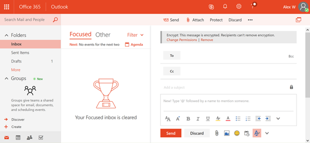

# <a name="protection-features-in-azure-information-protection-rolling-out-to-existing-office-365-tenants"></a><span data-ttu-id="0e657-105">既存の Office 365 テナントにロールアウト Azure の情報保護の保護機能</span><span class="sxs-lookup"><span data-stu-id="0e657-105">Protection features in Azure Information Protection rolling out to existing Office 365 tenants</span></span>

<span data-ttu-id="0e657-p102">2018年 7 月 Azure 情報の保護対象となるテナントのすべての開始、お客様の情報保護における最初のステップを支援するには、は Azure の情報保護の保護機能オンにして既定では。Azure の情報保護の保護機能はされた権限管理や Azure RMS として Office 365 で呼ばれていました。Office E3 のサービス プランやサービスの向上の計画がある場合は、これらの機能を展開すると、Azure の情報保護を使用して情報を保護することを簡単に開始を今すぐ表示されます。</span><span class="sxs-lookup"><span data-stu-id="0e657-p102">To help with the initial step in protecting your information, starting July 2018 all Azure Information Protection eligible tenants will have the protection features in Azure Information Protection turned on by default. The protection features in Azure Information Protection were formerly known in Office 365 as Rights Management or Azure RMS. If your organization has an Office E3 service plan or a higher service plan you will now get a head start protecting information through Azure Information Protection when we roll out these features.</span></span>
  
## <a name="changes-beginning-july-1-2018"></a><span data-ttu-id="0e657-109">開始、2018 年 7 月 1 日の変更</span><span class="sxs-lookup"><span data-stu-id="0e657-109">Changes beginning July 1, 2018</span></span>

<span data-ttu-id="0e657-110">開始 2018 年 7 月 1日マイクロソフトで有効に Azure の情報保護の保護機能購入プランを次のいずれかを持っているすべての Office 365 テナント。</span><span class="sxs-lookup"><span data-stu-id="0e657-110">Starting July 1, 2018, Microsoft will enable the protection capability in Azure Information Protection for all Office 365 tenants who have one of the following subscription plans:</span></span>
  
- <span data-ttu-id="0e657-p103">Office 365 Office 365 の E3 と E5、マイクロソフト E3 と E5、Office 365 の A1、A3、A5、および Office 365 の第 3 世代との G5 の一部としてメッセージの暗号化が提供されます。Azure 情報保護により、新しい保護機能を表示するのには追加のライセンスを使用する必要はありません。</span><span class="sxs-lookup"><span data-stu-id="0e657-p103">Office 365 Message Encryption is offered as part of Office 365 E3 and E5, Microsoft E3 and E5, Office 365 A1, A3, and A5, and Office 365 G3 and G5. You do not need additional licenses to receive the new protection capabilities powered by Azure Information Protection.</span></span> 
    
- <span data-ttu-id="0e657-113">Azure 情報保護計画する場合は 1 次が新しい Office 365 のメッセージの暗号化機能を受信する計画を追加することも: Exchange オンライン計画 1、Exchange オンライン計画 2、Office 365 の F1、Office 365 の業務に関する重要事項、Office 365 のビジネス プレミアム、またはOffice 365 エンタープライズ E1。</span><span class="sxs-lookup"><span data-stu-id="0e657-113">You can also add Azure Information Protection Plan 1 to the following plans to receive the new Office 365 Message Encryption capabilities: Exchange Online Plan 1, Exchange Online Plan 2, Office 365 F1, Office 365 Business Essentials, Office 365 Business Premium, or Office 365 Enterprise E1.</span></span>
    
- <span data-ttu-id="0e657-114">各ユーザーが Office 365 のメッセージの暗号化のメリットは、この機能によってカバーされるライセンスを取得する必要があります。</span><span class="sxs-lookup"><span data-stu-id="0e657-114">Each user benefiting from Office 365 Message Encryption needs to be licensed to be covered by the feature.</span></span>
    
- <span data-ttu-id="0e657-115">完全なリストについては、Office 365 のメッセージの暗号化の[Exchange Online のサービスの説明](https://technet.microsoft.com/library/exchange-online-service-description.aspx)を参照してください。</span><span class="sxs-lookup"><span data-stu-id="0e657-115">For the full list see the [Exchange Online service descriptions](https://technet.microsoft.com/library/exchange-online-service-description.aspx) for Office 365 Message Encryption.</span></span> 
    
<span data-ttu-id="0e657-116">テナント管理者は、Office 365 管理者ポータルでは、保護のステータスを確認できます。</span><span class="sxs-lookup"><span data-stu-id="0e657-116">Tenant administrators can check the protection status in the Office 365 administrator portal.</span></span> 
  

  
## <a name="why-are-we-making-this-change"></a><span data-ttu-id="0e657-118">この変更はなぜどうしているのでしょうか。</span><span class="sxs-lookup"><span data-stu-id="0e657-118">Why are we making this change?</span></span>

<span data-ttu-id="0e657-p104">Office 365 のメッセージの暗号化では、Azure の情報保護の保護機能を活用します。Office 365 のメッセージの暗号化に最新の機能強化およびマイクロソフトの 365 の情報保護をより広範な投資の中核となる、私たちは容易にすることをオンにし、従来、暗号化と私たちの保護機能を使用して組織のテクノロジを設定することが困難にされています。既定では、Azure の情報保護の保護機能をオンを迅速に開始、機密データを保護するために。</span><span class="sxs-lookup"><span data-stu-id="0e657-p104">Office 365 Message Encryption leverages the protection capabilities in Azure Information Protection. At the heart of the recent improvements to Office 365 Message Encryption and our broader investments to information protection in Microsoft 365, we are making it easier for organizations to turn on and use our protection capabilities, as historically, encryption technologies have been difficult to set up. By turning on the protection features in Azure Information Protection by default, you can quickly get started to protect your sensitive data.</span></span>
  
## <a name="does-this-impact-me"></a><span data-ttu-id="0e657-122">影響は私ですか。</span><span class="sxs-lookup"><span data-stu-id="0e657-122">Does this impact me?</span></span>

<span data-ttu-id="0e657-123">Office 365 の組織が対象となる Office 365 のライセンスを購入した場合、テナントはこの変更によって影響を受けるが。</span><span class="sxs-lookup"><span data-stu-id="0e657-123">If your Office 365 organization has purchased an eligible Office 365 license, then your tenant will be impacted by this change.</span></span>
  
 <span data-ttu-id="0e657-p105">**重要!** オンプレミス環境で Active Directory Rights Management サービス (AD RMS) を使用する場合を無効にこの変更の直後にか 30 日以内には、この変更を展開する前に、Azure の情報保護への移行です。脱退には、この資料の後半の「AD RMS を使用して、out? を選択する方法」を参照してください方法の詳細について。移行する場合を参照してください[AD RMS から Azure 情報保護への移行します](https://docs.microsoft.com/azure/information-protection/plan-design/migrate-from-ad-rms-to-azure-rms)。</span><span class="sxs-lookup"><span data-stu-id="0e657-p105">**IMPORTANT!** If you're using Active Directory Rights Management Services (AD RMS) in your on-premises environment, you must either opt-out of this change immediately or migrate to Azure Information Protection before we roll out this change within the next 30 days. For information on how to opt-out, see "I use AD RMS, how do I opt out?" later in this article. If you prefer to migrate, see [Migrating from AD RMS to Azure Information Protection.](https://docs.microsoft.com/azure/information-protection/plan-design/migrate-from-ad-rms-to-azure-rms)</span></span>
  
## <a name="can-i-use-azure-information-protection-with-active-directory-rights-management-services-ad-rms"></a><span data-ttu-id="0e657-129">Active Directory Rights Management サービス (AD RMS) と Azure の情報保護を使用できますか。</span><span class="sxs-lookup"><span data-stu-id="0e657-129">Can I use Azure Information Protection with Active Directory Rights Management Services (AD RMS)?</span></span>

<span data-ttu-id="0e657-p106">違います。サポートされている展開シナリオではありません。脱退の追加手順を行わなくては、一部のコンピューターは Azure の権限の管理サービスを使用するを自動的に開始および AD RMS クラスターに接続しても可能性があります。このシナリオでは、サポートされていないし、これらの新機能を展開する前に、次の 30 日以内には、この変更のオプションを選択することが重要ですので、信頼性の低い結果を持ちます。脱退には、この資料の後半の「AD RMS を使用して、out? を選択する方法」を参照してください方法の詳細について。移行する場合を参照してください[AD RMS から Azure 情報保護への移行します](https://docs.microsoft.com/azure/information-protection/plan-design/migrate-from-ad-rms-to-azure-rms)。</span><span class="sxs-lookup"><span data-stu-id="0e657-p106">No. This is not a supported deployment scenario. Without taking the additional opt-out steps, some computers might automatically start using the Azure Rights Management service and also connect to your AD RMS cluster. This scenario isn't supported and has unreliable results, so it's important that you opt out of this change within the next 30 days before we roll out these new features. For information on how to opt-out, see "I use AD RMS, how do I opt out?" later in this article. If you prefer to migrate, see [Migrating from AD RMS to Azure Information Protection.](https://docs.microsoft.com/azure/information-protection/plan-design/migrate-from-ad-rms-to-azure-rms)</span></span>
  
## <a name="how-do-i-know-if-im-using-ad-rms"></a><span data-ttu-id="0e657-137">かどうかは、AD RMS を使用して方法を教えてください。</span><span class="sxs-lookup"><span data-stu-id="0e657-137">How do I know if I'm using AD RMS?</span></span>

<span data-ttu-id="0e657-138">AD RMS を展開しているかどうかを確認するのにには、 [Azure アクセス権の管理と、Active Directory Rights Management サービス (AD RMS) のための環境を準備しています](https://docs.microsoft.com/azure/information-protection/deploy-use/prepare-environment-adrms)から、次の手順を使用します。</span><span class="sxs-lookup"><span data-stu-id="0e657-138">Use these instructions from [Preparing the environment for Azure Rights Management when you also have Active Directory Rights Management Services (AD RMS)](https://docs.microsoft.com/azure/information-protection/deploy-use/prepare-environment-adrms) to check if you have deployed AD RMS:</span></span> 
  
1. <span data-ttu-id="0e657-139">オプションですが、ほとんどの AD RMS の展開はドメイン コンピューターが AD RMS クラスターを検出できるように、Active Directory にサービス接続ポイント (SCP) を発行します。</span><span class="sxs-lookup"><span data-stu-id="0e657-139">Although optional, most AD RMS deployments publish the service connection point (SCP) to Active Directory so that domain computers can discover the AD RMS cluster.</span></span> 
  
<span data-ttu-id="0e657-140">ADSI Edit を使用して、SCP が Active Directory で公開されているがあるかどうかを参照してください: CN = 構成の [サーバー名] で、CN = サービス、CN = RightsManagementServices、CN = SCP</span><span class="sxs-lookup"><span data-stu-id="0e657-140">Use ADSI Edit to see whether you have an SCP published in Active Directory: CN=Configuration [server name], CN=Services, CN=RightsManagementServices, CN=SCP</span></span>
    
2. <span data-ttu-id="0e657-141">Windows レジストリを使用してクライアント側のサービスの検出またはライセンスのリダイレクトの AD RMS クラスターに接続している Windows コンピューターを構成する必要があります、SCP を使用していない場合: HKEY_LOCAL_MACHINE\SOFTWARE\Microsoft\MSIPC\ServiceLocation または HKEY_LOCAL_MACHINE\SOFTWARE\Wow6432Node\Microsoft\MSIPC\ServiceLocation</span><span class="sxs-lookup"><span data-stu-id="0e657-141">If you are not using an SCP, Windows computers that connect to an AD RMS cluster must be configured for client-side service discovery or licensing redirection by using the Windows registry: HKEY_LOCAL_MACHINE\SOFTWARE\Microsoft\MSIPC\ServiceLocation or HKEY_LOCAL_MACHINE\SOFTWARE\Wow6432Node\Microsoft\MSIPC\ServiceLocation</span></span> 
  
<span data-ttu-id="0e657-142">これらのレジストリの構成の詳細については、 [Windows レジストリを使用してクライアント側のサービス検出を有効にして](https://docs.microsoft.com/azure/information-protection/rms-client/client-deployment-notes#enabling-client-side-service-discovery-by-using-the-windows-registry)、[リダイレクトのライセンス サーバーのトラフィック](https://docs.microsoft.com/azure/information-protection/rms-client/client-deployment-notes#redirecting-licensing-server-traffic)を参照してください。</span><span class="sxs-lookup"><span data-stu-id="0e657-142">For more information about these registry configurations, see [Enabling client-side service discovery by using the Windows registry](https://docs.microsoft.com/azure/information-protection/rms-client/client-deployment-notes#enabling-client-side-service-discovery-by-using-the-windows-registry) and [Redirecting licensing server traffic](https://docs.microsoft.com/azure/information-protection/rms-client/client-deployment-notes#redirecting-licensing-server-traffic).</span></span>
    
## <a name="i-use-ad-rms-how-do-i-opt-out"></a><span data-ttu-id="0e657-143">使用して AD RMS では、どのように操作を行いますか脱退か。</span><span class="sxs-lookup"><span data-stu-id="0e657-143">I use AD RMS, how do I opt out?</span></span>

<span data-ttu-id="0e657-144">今後の変更を無効にするには、これらの操作を行います。</span><span class="sxs-lookup"><span data-stu-id="0e657-144">To opt out of the upcoming change, complete these steps:</span></span>
  
1. <span data-ttu-id="0e657-p107">大域管理者アクセス許可を持つ、Office 365 の組織で、職場、学校のアカウントを使用すると、Windows PowerShell セッションを開始し、Exchange Online に接続します。手順については、 [Exchange オンライン PowerShell への接続](https://docs.microsoft.com/powershell/exchange/exchange-online/connect-to-exchange-online-powershell/connect-to-exchange-online-powershell?view=exchange-ps)を参照してください。</span><span class="sxs-lookup"><span data-stu-id="0e657-p107">Using a work or school account that has global administrator permissions in your Office 365 organization, start a Windows PowerShell session and connect to Exchange Online. For instructions, see [Connect to Exchange Online PowerShell](https://docs.microsoft.com/powershell/exchange/exchange-online/connect-to-exchange-online-powershell/connect-to-exchange-online-powershell?view=exchange-ps).</span></span>
    
2. <span data-ttu-id="0e657-147">次の構文を使用してセット IRMConfiguration コマンドレットを実行します。</span><span class="sxs-lookup"><span data-stu-id="0e657-147">Run the Set-IRMConfiguration cmdlet using the following syntax:</span></span>
    
  ```
  Set-IRMConfiguration -AutomaticServiceUpdateEnabled $false 
  ```

## <a name="what-can-i-expect-after-this-change-has-been-made"></a><span data-ttu-id="0e657-148">どのようなことができますこの変更が行われた後に期待どおりですか。</span><span class="sxs-lookup"><span data-stu-id="0e657-148">What can I expect after this change has been made?</span></span>

<span data-ttu-id="0e657-149">新しいバージョンの[Microsoft の Ignite 2017](https://techcommunity.microsoft.com/t5/Security-Privacy-and-Compliance/Email-Encryption-and-Rights-Protection/ba-p/110801)で発表されました、Azure の情報の暗号化と保護機能を活用して Office 365 のメッセージの暗号化の使用を開始するにはこれが有効にすると、削除していない限り、保護します。</span><span class="sxs-lookup"><span data-stu-id="0e657-149">Once this is enabled, provided you haven't opted out, you can start using the new version of Office 365 Message Encryption which was announced at [Microsoft Ignite 2017](https://techcommunity.microsoft.com/t5/Security-Privacy-and-Compliance/Email-Encryption-and-Rights-Protection/ba-p/110801) and leverages the encryption and protection capabilities of Azure Information Protection.</span></span> 
  

  
<span data-ttu-id="0e657-151">新しい拡張機能の詳細については、 [Office 365 のメッセージの暗号化](ome.md)を参照してください。</span><span class="sxs-lookup"><span data-stu-id="0e657-151">For more information about the new enhancements, see [Office 365 Message Encryption](ome.md).</span></span>
  

