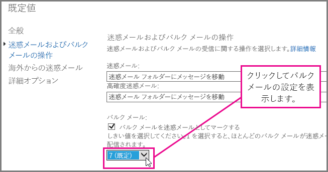
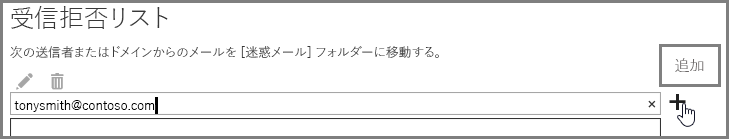

# <a name="block-email-spam-with-the-office-365-spam-filter-to-prevent-false-negative-issues"></a><span data-ttu-id="e2d26-103">検出漏れの問題を防止するために Office 365 のスパム フィルターを使用して迷惑メールをブロックする</span><span class="sxs-lookup"><span data-stu-id="e2d26-103">Block email spam with the Office 365 spam filter to prevent false negative issues</span></span>

<span data-ttu-id="e2d26-p101">Exchange Online Protection (EOP) は、クラウド ベースのメール フィルター サービスであり、スパムやマルウェアから組織を保護することができます。Office 365 のメールボックスを使用している場合、EOP によって既定で既に保護されています。</span><span class="sxs-lookup"><span data-stu-id="e2d26-p101">Exchange Online Protection (EOP) is a cloud-based email filtering service that helps protect your organization against spam and malware. If you have mailboxes in Office 365, they are already protected by default with EOP.</span></span> 
  
<span data-ttu-id="e2d26-p102">Office 365 のスパム フィルターを調整することにより、スパム メールや迷惑メッセージが確実にブロックされるようにすることができます。これにより、迷惑メールがユーザーの受信トレイに入ってしまうという検出漏れの問題を防ぐことができます。Exchange Online または EOP (Exchange Online Protection) の管理者として、次の手順を実行して Office 365 のスパム対策フィルターを調整し、ユーザーの受信ボックスに迷惑メールが配信されないようにします。</span><span class="sxs-lookup"><span data-stu-id="e2d26-p102">You can help to ensure spam and junk messages are blocked by adjusting your Office 365 spam filter. This helps to prevent the false negative issue, where email spam is allowed through to a user inbox. As an Exchange Online or Exchange Online Protection (EOP) administrator, use the following steps to adjust your Office 365 anti-spam filter and help prevent spam from being delivered to your user's inboxes.</span></span>
  
## <a name="customize-the-office-365-anti-spam-filter-with-these-settings"></a><span data-ttu-id="e2d26-109">以下の設定により Office 365 のスパム対策フィルターをカスタマイズする</span><span class="sxs-lookup"><span data-stu-id="e2d26-109">Customize the Office 365 anti-spam filter with these settings</span></span>

<span data-ttu-id="e2d26-p103">管理者は、いくつかの Office 365 スパム フィルターの設定を利用して、迷惑メールがユーザーの受信トレイに送信されないようにすることができます。この一覧のオプションを使用すると、Office 365 のスパム フィルターは、より適切に迷惑メールをブロックし、検出漏れのメッセージを防ぐことができるようになります。このコンテキストでは、検出漏れとは、ユーザーの受信トレイに送信されてしまうスパム メールや迷惑メッセージのことです。</span><span class="sxs-lookup"><span data-stu-id="e2d26-p103">An Admin can use several Office 365 spam filter settings to help prevent email spam from being sent to a user inbox. The Office 365 spam filter will become better able to block email spam and prevent false negative messages if you use the options listed here. In this context, a false negative refers to email spam or junk messages that are getting sent to a user inbox.</span></span>
  
### <a name="block-ip-addresses-with-a-connection-filter"></a><span data-ttu-id="e2d26-113">接続フィルターで IP アドレスをブロックする</span><span class="sxs-lookup"><span data-stu-id="e2d26-113">Block IP addresses with a connection filter</span></span>

<span data-ttu-id="e2d26-114">接続フィルター IP 禁止一覧に送信者の IP アドレスを追加して、Office 365 のスパム フィルターをカスタマイズします。</span><span class="sxs-lookup"><span data-stu-id="e2d26-114">Setup your Office 365 spam filter by adding the sender IP address to the connection filter IP Block list:</span></span>
  
1. <span data-ttu-id="e2d26-115">「[メッセージ ヘッダー アナライザー](https://go.microsoft.com/fwlink/p/?LinkId=306583)」で説明されているように、Outlook や Outlook Web App などのメール クライアントでブロックするメッセージのヘッダーを取得します。</span><span class="sxs-lookup"><span data-stu-id="e2d26-115">Obtain the headers for the message you want to block in your mail client such as Outlook or Outlook Web App, as described in [Message Header Analyzerhttp://go.microsoft.com/fwlink/p/?LinkId=306583](https://go.microsoft.com/fwlink/p/?LinkId=306583).</span></span>
    
2. <span data-ttu-id="e2d26-116">[メッセージ ヘッダー アナライザー](https://testconnectivity.microsoft.com/?tabid=mha)を使用するか、または手動で、X-Forefront-Antispam-Report ヘッダー内の CIP タグの後に続く IP アドレスを検索します。</span><span class="sxs-lookup"><span data-stu-id="e2d26-116">Search for the IP address following the CIP tag in the X-Forefront-Antispam-Report header using the [message header analyzerhttps://testconnectivity.microsoft.com/?tabid=mha](https://testconnectivity.microsoft.com/?tabid=mha) or manually.</span></span> 
    
3. <span data-ttu-id="e2d26-117">「[接続フィルター ポリシーを構成する](https://technet.microsoft.com/ja-JP/library/jj200718%28v=exchg.150%29.aspx)」の「EAC を使用して既定の接続フィルター ポリシーを編集する」に示された手順に従って、その IP アドレスを IP 禁止一覧に追加します。</span><span class="sxs-lookup"><span data-stu-id="e2d26-117">Add the IP address to the IP Block list by following the steps in “Use the EAC to edit the default connection filter policy” in [Configure the Connection Filter Policy](https://technet.microsoft.com/ja-JP/library/jj200718%28v=exchg.150%29.aspx).</span></span>
    
### <a name="block-bulk-mail-with-transport-rules-or-the-spam-filter"></a><span data-ttu-id="e2d26-118">トランスポート ルールまたはスパム フィルターでバルク メールをブロックする</span><span class="sxs-lookup"><span data-stu-id="e2d26-118">Block bulk mail with transport rules or the spam filter</span></span>

<span data-ttu-id="e2d26-p104">スパムは主に、ニュースレターやプロモーションなどのバルク メールでしょうか。[トランスポート ルールを使用してバルク メール メッセージを積極的にフィルタリングする](https://technet.microsoft.com/ja-JP/library/dn720438%28v=exchg.150%29.aspx)か、スパム フィルターの[高度なスパム フィルター処理オプション](https://technet.microsoft.com/ja-JP/library/jj200750%28v=exchg.150%29.aspx)で**バルク メール**設定をオンにすると、Office 365 でスパム フィルターをカスタマイズできます。Exchange 管理センターで、**[保護]** \> **[コンテンツ フィルター]** をクリックし、調整するフィルター ポリシーをダブルクリックして作業を開始します。ここで示すとおり、**[Spam and bulk mail actions (スパムおよびバルク メール操作)]** をクリックして設定を調整します。</span><span class="sxs-lookup"><span data-stu-id="e2d26-p104">Is the spam primarily bulk mail, for example, newsletters or promotions? You can customize the spam filter in Office 365 if you [Use transport rules to aggressively filter bulk email messages](https://technet.microsoft.com/ja-JP/library/dn720438%28v=exchg.150%29.aspx) or turn on the **Bulk mail** setting in your spam filter's [Advanced Spam Filtering Options](https://technet.microsoft.com/ja-JP/library/jj200750%28v=exchg.150%29.aspx). In the Exchange Admin center, get started by clicking **Protection** \> **Content filter** and then double click the filter policy you want to adjust. Click **Spam and bulk mail actions** to adjust the settings, as shown here.</span></span> 
  

  
### <a name="block-email-spam-using-spam-filter-block-lists"></a><span data-ttu-id="e2d26-124">スパム フィルター禁止一覧を使用して迷惑メールをブロックする</span><span class="sxs-lookup"><span data-stu-id="e2d26-124">Block email spam using spam filter block lists</span></span>

<span data-ttu-id="e2d26-p105">[スパム フィルター ポリシーを構成](https://technet.microsoft.com/ja-JP/library/jj200684%28v=exchg.150%29.aspx)して、スパム フィルターの送信者禁止一覧に送信者アドレスを追加するか、ドメイン禁止一覧にドメインを追加します。スパム フィルター禁止一覧に記載の送信者やドメインからのメールはスパムとしてマークされます。</span><span class="sxs-lookup"><span data-stu-id="e2d26-p105">[Configure your spam filter policies](https://technet.microsoft.com/ja-JP/library/jj200684%28v=exchg.150%29.aspx) to add the sender address to the sender block list or domain to the domain block list in the spam filter. Emails from a sender or domain on a spam filter block list will marked as spam.</span></span> 
  
### <a name="advanced-spam-filtering-options"></a><span data-ttu-id="e2d26-127">高度なスパム フィルター処理オプション</span><span class="sxs-lookup"><span data-stu-id="e2d26-127">Advanced Spam Filtering Options</span></span>

<span data-ttu-id="e2d26-128">[スパム フィルター ポリシーを構成](https://technet.microsoft.com/ja-JP/library/jj200684%28v=exchg.150%29.aspx)し、追加の[高度なスパム対策フィルター オプション](https://technet.microsoft.com/ja-JP/library/jj200750%28v=exchg.150%29.aspx)をオンにします。</span><span class="sxs-lookup"><span data-stu-id="e2d26-128">[Configure your content filter policies](https://technet.microsoft.com/ja-JP/library/jj200684%28v=exchg.150%29.aspx) and turn on additional [Advanced Spam Filtering Options](https://technet.microsoft.com/ja-JP/library/jj200750%28v=exchg.150%29.aspx).</span></span>
  
<span data-ttu-id="e2d26-p106">組織全体に適用される、より多くのスパム設定については、「[セーフリストまたは他の手法によってスパムとマークされるメール誤検知を防止する](prevent-email-from-being-marked-as-spam-0.md)」を参照してください。これは、管理者レベルの制御を持つ方で、誤検知を防止したい場合に役立ちます。</span><span class="sxs-lookup"><span data-stu-id="e2d26-p106">You can enable advanced spam filtering options if you want to pursue an aggressive approach to spam filtering. For general spam settings that apply to the whole organization, take a look at [Prevent false positive email marked as spam with a safelist or other techniques](prevent-email-from-being-marked-as-spam-0.md) or Block email spam with the Office 365 spam filter to prevent false negative issues. These are helpful if you have administrator-level control and you want to prevent false positives or false negatives.</span></span>
  
## <a name="email-users-can-also-help-ensure-that-false-negative-and-email-spam-is-blocked-with-office-365-spam-filter"></a><span data-ttu-id="e2d26-131">メール ユーザーは、Office 365 のスパム フィルターを使用して、確実に検出漏れおよびメール スパムをブロックすることもできます。</span><span class="sxs-lookup"><span data-stu-id="e2d26-131">Email users can also help ensure that false negative and email spam is blocked with Office 365 spam filter</span></span>

<span data-ttu-id="e2d26-p107">Office 365 のスパム対策を活用すれば、[Outlook](https://go.microsoft.com/fwlink/p/?LinkId=270065) または [Outlook Web App](https://go.microsoft.com/fwlink/p/?LinkId=294862) のスパム送信者一覧にスパム送信者アドレスを追加するようユーザーに指示した場合に、検出漏れや迷惑メールを防止することができます。Outlook Web App では、ここで示すとおり、**[設定]** \> **[オプション]** \> **[ブロックまたは許可]** をクリックして開始した後、**[ブロックする差出人]** 一覧にアドレスを追加します。</span><span class="sxs-lookup"><span data-stu-id="e2d26-p107">It will help your Office 365 anti-spam efforts to prevent false negatives and junk mail if you tell your users to add the spam sender address to their blocked sender list in [Outlook](https://go.microsoft.com/fwlink/p/?LinkId=270065) or [Outlook Web App](https://go.microsoft.com/fwlink/p/?LinkId=294862). In Outlook Web App, get started by clicking **Settings** \> **Options** \> **Block or allow**, and then adding the address to the **Blocked senders** list, as shown here.</span></span> 
  

  
> [!NOTE]
> <span data-ttu-id="e2d26-135">差出人セーフ リストについて詳しくは、「[差出人セーフ リストと受信拒否リストの FAQ](https://technet.microsoft.com/ja-JP/library/dn133608%28v=exchg.150%29.aspx)」を参照してください。</span><span class="sxs-lookup"><span data-stu-id="e2d26-135">For more detailed information about safe sender lists, see [Safe Sender and Blocked Sender Lists FAQ](https://technet.microsoft.com/ja-JP/library/dn133608%28v=exchg.150%29.aspx).</span></span> 
  
<span data-ttu-id="e2d26-p108">このサブセクションの前の段落は、EOP をサービスとして使用してオンプレミス メール システムを保護するお客様、またはハイブリッド メール展開の一環として使用するお客様のみに該当します。EOP の詳細については、[ Exchange Online Protection のホームページ](https://products.office.com/ja-JP/exchange/exchange-email-security-spam-protection)をご覧ください。</span><span class="sxs-lookup"><span data-stu-id="e2d26-p108">The previous paragraphs in this subsection applies only to customers who use EOP as service to protect on-premises email systems or as part of a hybrid email deployment. Learn more about EOP at the [Exchange Online Protection home page](https://products.office.com/ja-JP/exchange/exchange-email-security-spam-protection).</span></span>
  
## <a name="eop-only-customers-set-up-the-office-365-spam-filter-to-block-email-spam"></a><span data-ttu-id="e2d26-138">EOP のみのお客様: 迷惑メールをブロックするには Office 365 のスパム フィルターを設定する</span><span class="sxs-lookup"><span data-stu-id="e2d26-138">EOP-only customers: Set up the Office 365 spam filter to block email spam</span></span>

<span data-ttu-id="e2d26-p109">オンプレミスのメールボックスをご利用の EOP のみのお客様: スパム フィルターを既定のアクションである [メッセージを迷惑メール フォルダーに移動] に設定した場合は、「スパムが各ユーザーの [迷惑メール] フォルダーにルーティングされるようにする」で示される必要な手順に従ってください。この作業を容易に行えるよう、別のトピックに記載した Exchange管理シェル コマンドに加えて、シェルを開始する方法についての一般的な情報へのリンクを記載しています。</span><span class="sxs-lookup"><span data-stu-id="e2d26-p109">For EOP-only customers with on-premises mailboxes: If you setup a spam filter for the default action, Move message to Junk Email folder, follow the required steps provided in Ensure that spam is routed to each user's Junk Email folder. We've tried to make this easy by providing the Exchange Management Shell commands in a separate topic, as well as a link to more general information about how to get started with the shell.</span></span>
  
<span data-ttu-id="e2d26-p110">ディレクトリ同期を使用してユーザー設定をサービスと同期させ、ブロックする差出人が考慮されるようにすると、検出漏れの迷惑メールを回避するのに役立ちます。詳細については、EOP のメール ユーザー管理で「ディレクトリ同期を使用してメール ユーザーを管理する」を参照してください。</span><span class="sxs-lookup"><span data-stu-id="e2d26-p110">It will help you to avoid false negative email spam if you sync user settings with the service via directory synchronization to ensure that your blocked senders are respected. For more information, see "Use directory synchronization to manage mail users" in Manage mail users in EOP.</span></span>
  
## <a name="eop-only-customers-who-are-not-using-directory-synchronization"></a><span data-ttu-id="e2d26-143">ディレクトリ同期を使用していない EOP のみのお客様</span><span class="sxs-lookup"><span data-stu-id="e2d26-143">EOP-only customers who are not using directory synchronization</span></span>

<span data-ttu-id="e2d26-p111">EOP サービスは、情報がサービスと共有されている場合、ユーザーの安全な差出人とブロックする差出人を尊重するように設計されています。Outlook を使用している EOP のお客様で、ユーザーを Office 365 に同期させるようにディレクトリ同期を構成していない場合でも、ブロックする差出人を使用してユーザーの受信トレイにメッセージが配信されないようにできます。ただし、次の状況ではいくつかの Exchange メール フロー ルールを設定する必要があります。</span><span class="sxs-lookup"><span data-stu-id="e2d26-p111">The EOP service is designed to honor the user's safe and blocked senders, if the information has been shared with the service. If you are an EOP customer using Outlook, but do not have Directory Synchronization configured to sync your users to Office 365, you can still stop messages from being delivered to your users' inbox using blocked senders. However, you may have to set up some Exchange mail flow rules in the following situations:</span></span>
  
- <span data-ttu-id="e2d26-147">メッセージが EOP による通常のスパム フィルター処理を経てローカルのオンプレミス Exchange サーバーに配信され、EOP が SCL 1 から 4 (非スパム) のスパム判定を割り当てた場合、ユーザーのローカルの受信拒否リストが EOP スパム フィルターの判定をオーバーライドし、メッセージは迷惑メール フォルダーに配信されます。</span><span class="sxs-lookup"><span data-stu-id="e2d26-147">If a message goes through regular spam filtering through EOP and then is delivered to a local on-premises Exchange server, and EOP assigns a spam verdict of SCL 1-4 (non-spam), then your users' local blocked senders list will override the EOP spam filter verdict and deliver it to their junk email folder.</span></span>
    
- <span data-ttu-id="e2d26-p112">Exchange メール フロー ルールによって、または IP アドレスやドメインが許可一覧に含まれていることで、EOP のメッセージに SCL -1 が割り当てられている場合、SCL はコネクタを使用してオンプレミス Exchange サーバーに伝達されます。この場合、ユーザーの受信拒否リストは適用されません。この動作を変更するには、SCL を 0 に設定するローカルのメール フロー ルールを作成します。これにより、Outlook はユーザーのローカルの受信拒否リストを適用します。</span><span class="sxs-lookup"><span data-stu-id="e2d26-p112">If a message in EOP is assigned SCL -1 by an Exchange mail flow rule or because the IP address or domain is in your allow list, the SCL is propagated to the on-premise Exchange server using connectors. In this case, your user's blocked senders list will not be enforced. To change this, you can create a local mail flow rule that sets the SCL to 0. This will cause Outlook to enforce your user's local blocked senders list.</span></span>
    
<span data-ttu-id="e2d26-152">**受信拒否リストを使用してメッセージがユーザーの受信トレイに配信されないようにメール フロー ルールを設定するには**</span><span class="sxs-lookup"><span data-stu-id="e2d26-152">**To set up a mail flow rule to stop messages from being delivered to your users' inbox by using the blocked senders list**</span></span>
  
1. <span data-ttu-id="e2d26-p113">オンプレミス サーバーで Exchange 管理シェルを開きます。オンプレミスの Exchange 組織でシェルを開く方法については、「[Exchange 管理シェルを開く](https://technet.microsoft.com/library/dd638134%28v=exchg.160%29.aspx)」を参照してください。</span><span class="sxs-lookup"><span data-stu-id="e2d26-p113">Access the Exchange Management Shell for your on-premises Exchange server. To learn how to open the Exchange Management Shell in your on-premises Exchange organization, see [Open the Shell](https://technet.microsoft.com/library/dd638134%28v=exchg.160%29.aspx).</span></span>
    
2. <span data-ttu-id="e2d26-155">SCL -1 とマークされたすべてのメッセージで SCL を更新するには、次のコマンドを実行してコンテンツでフィルタリングされたスパム メッセージを迷惑メール フォルダーにルーティングします。</span><span class="sxs-lookup"><span data-stu-id="e2d26-155">Run the following command to route content-filtered spam messages to the Junk Email folder in order to update the SCL on every message that was marked with SCL -1:</span></span>
    
  ```
  New-TransportRule "NameForRule" -HeaderContainsMessageHeader "X-Forefront-Antispam-Report" -HeaderContainsWords "SCL:-1" -SetSCL 0
  ```

    <span data-ttu-id="e2d26-p114">SCL はオンプレミス Exchange サーバーでは 0 なので、非スパムはユーザーの受信トレイに配信されますが、ユーザーのローカルの受信拒否リストによって迷惑メール フォルダーに送信されことも可能です。EOP でスパム検疫を使用している場合も、ユーザーのセーフ リストに記載されている送信者がスパムとして識別され、検疫に送られる可能性があります。ただし、ローカルのメールボックスで迷惑メール フォルダーを使用している場合、この操作で、安全な送信者用の受信トレイへの配信が可能になります。</span><span class="sxs-lookup"><span data-stu-id="e2d26-p114">Because the SCL is 0 in your on-premises Exchange server, non-spam will be delivered to your users' inboxes but still allow for users' local blocked senders list to send them to junk email. If you are using spam quarantine in EOP, it is still possible that senders who are on your user's safe list will be identified as spam and sent to quarantine. If you are using the Junk Mail Folder in your local mailbox, however, this will allow delivery to the Inbox for safe senders.</span></span>

> [!WARNING]
> <span data-ttu-id="e2d26-p115">メール フロー ルールを使用して SCL 値を 0 (または -1 以外の値) に変更すると、すべての Outlook の迷惑メール オプションがメッセージに適用されます。これは、ブロック リストおよびセーフ リストが尊重されるようになることを意味しますが、ブロック リストやセーフ リストにアドレスが記載されていないメッセージは、クライアント側の迷惑メール フィルター処理によって迷惑メールとしてマークされる可能性があるということも意味します。Outlook にブロック リストとセーフ リストを処理させる必要があるものの、クライアント側の迷惑メール フィルターは使用したくない場合は、Outlook の迷惑メール オプションでオプションを「自動フィルター処理なし」に設定する必要があります。最新バージョンの Outlook では、「自動フィルター処理なし」が既定のオプションですが、クライアント側の迷惑メール フィルターがメッセージに適用されないようにするために、この設定になっていることを確認する必要があります。管理者は、「[Outlook: 迷惑メールの UI とフィルター処理機構を無効にするポリシー設定](https://support.microsoft.com/ja-JP/kb/2180568)」の手順に従って、Outlook の迷惑メール フィルター処理を無効にすることができます。</span><span class="sxs-lookup"><span data-stu-id="e2d26-p115">If you use a mail flow rule to change the SCL value to 0 (or any value other than -1), then all of the Outlook junk mail options will apply to the message. This means that blocked and safe lists will be honored, but also means that messages that do not have addresses from the blocked or safe lists will potentially be marked as junk by the client side junk mail filter processing. If you want to have Outlook process the blocked and safe lists, but not use the client side junk mail filter, you must set the option to "No Automatic Filtering" in Outlook Junk Mail Options. "No Automatic Filtering" is the default option in the latest versions of Outlook, but you should confirm that the this setting is in place to ensure the client side junk mail filter is not applied to the messages. As an administrator, you can enforce disabling the Outlook Junk Email filtering by following the instructions in [Outlook: Policy setting to disable the Junk E-mail UI and filtering mechanism](https://support.microsoft.com/ja-JP/kb/2180568).</span></span>
  
## <a name="see-also"></a><span data-ttu-id="e2d26-164">関連項目</span><span class="sxs-lookup"><span data-stu-id="e2d26-164">See Also</span></span>
<span data-ttu-id="e2d26-165"><a name="BKMK_please_comment"> </a></span><span class="sxs-lookup"><span data-stu-id="e2d26-165"></span></span>

[<span data-ttu-id="e2d26-166">Office 365 の電子メールのスパム対策保護</span><span class="sxs-lookup"><span data-stu-id="e2d26-166">Office 365 Email Anti-Spam Protection</span></span>](anti-spam-protection.md)
  
[<span data-ttu-id="e2d26-167">セーフリストまたはその他の手法で誤検知の電子メールがスパムとしてマークされないようにする</span><span class="sxs-lookup"><span data-stu-id="e2d26-167">Prevent false positive email marked as spam with a safelist or other techniques</span></span>](prevent-email-from-being-marked-as-spam-0.md)
  

