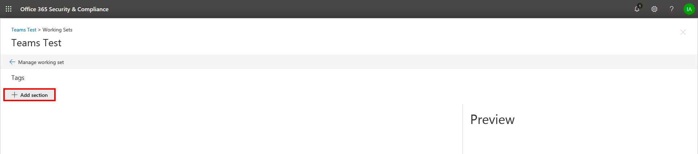

## タググループを作成するCreate tag groups

校閲セット内のドキュメントにタグを付けるには、その前にタグを作成する必要があります。Before you or other people can tag documents in a review set, the tags must be created. これを行うには、子タグを含むタググループを作成します。You can do this by creating tag groups that contain child tags. タグは、校閲セットのドキュメントを確認するときに、タグ付けパネルに表示されます。Tags are displayed in the tagging panel when reviewing documents in a review set.

タググループを作成するには、次のようにします。To create a tag group:

1.  作業セット内で、[ワーキングセットの管理] を選択します。Within the working set, select Manage Working Set.

> 

2.  [タグの管理] リンクを選択します。Then select the Manage tags link.

> 

タグ管理の内側で、ケースの要件を満たすタグを作成できます。Once inside the tag management, tags can be created to meet the requirements of your case.

> 最初に、タグセクションを作成します。Start by creating a tag section

1.  [セクションの追加] ボタンをクリックするClick the “Add section” button

> 

|                                                                                                                             |                                                                                                                                                                 |
| --------------------------------------------------------------------------------------------------------------------------- | --------------------------------------------------------------------------------------------------------------------------------------------------------------- |
| 部Tip | 保存するとプレビュー画面が更新されるので、タグの管理画面を閉じて作業セットに戻る必要なしに、タグパネルをプレビューできます。The preview screen will update when you save so you can preview the tag panel without having to close the tag management screen and go back to the working set. |

2.  タイトルとオプションの説明を入力します。Enter a title and optional description. そのセクション内にタグを作成するには、[new tag] セクションの省略記号をクリックして、その新しいセクションにタグを作成します。To create a tag within that section, click the ellipses on the new tag section to create tags in that new section.
    
    

|                                                                                                                             |                                                                                                                                         |
| --------------------------------------------------------------------------------------------------------------------------- | --------------------------------------------------------------------------------------------------------------------------------------- |
| 部Tip | Option タグを指定すると、ユーザーはタグのグループから1つのタグを選択するように強制されます。Option tags will force users to select one tag from a group of tags. チェックボックスタグを使用すると、ユーザーは任意のタグを任意に組み合わせて選択できます。Check box tags will allow users to select any combination of tags. |

## ネストされたタグNested tags

1.  タグをネストするには、**タグ**の省略記号をクリックして、追加する新しいタグを選択します。To nest tags, click the ellipses of a **tag** and select a new tag to add.
    
    

