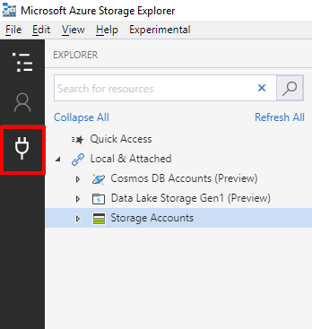
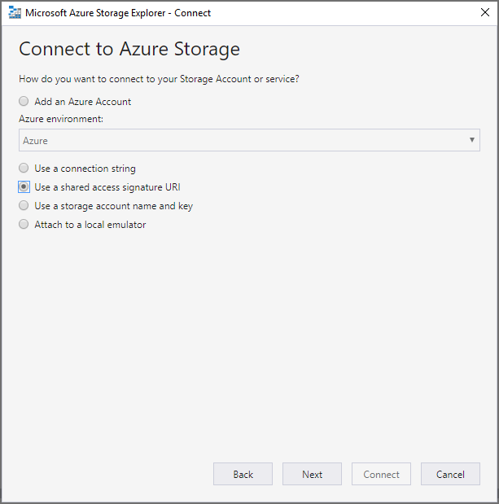

# エクスポート ジョブのダウンロードDownload export jobs

エクスポートされたすべてのデータは、Microsoft Azure blob に追加されます。All exported data is added to a Microsoft Azure blob. これにより、データ下流を処理するための複数のオプションが提供されます。This provides multiple options to handle the data downstream. Azure blob にアクセスするには、いくつかの方法があります。There are several ways to access an Azure blob. 1つの方法は、Azure ストレージエクスプローラーを使用する方法です。One method is to use Azure Storage Explorer. このメソッドは、簡単な接続、参照、ダウンロードをサポートします。This method supports simple connection, browsing and downloading. 詳細については、<https://docs.microsoft.com/en-us/azure/storage/blobs/storage-quickstart-blobs-storage-explorer>For more information, visit <https://docs.microsoft.com/en-us/azure/storage/blobs/storage-quickstart-blobs-storage-explorer>

1.  エクスポートジョブの完了後にコンテンツをダウンロードするには、[エクスポート] タブに移動して、エクスポートジョブを選択します。To download content after an export job is complete, go to the Exports tab and select an export job.

2.  フライアウトの [場所] セクションのテキストをコピーします。Copy the text in the “Locations” section of the flyout.

3.  Azure ストレージエクスプローラーを開いて、[接続] ボタンをクリックします。Open Azure Storage Explorer and click the “Connect” button

4.  [共有アクセス署名 URI を使用する] を選択し、[次へ] をクリックします。Select “Use a shared access signature URI” and click next

5.  [URI] テキストボックスに位置テキストを貼り付け、[次へ] をクリックします。Paste the Location text in the URI text box and click next

6.  [接続] をクリックします。Click Connect

これにより、ストレージアカウントのオブジェクトとしてエクスポートが追加されます。 SAS 接続サービス/Blob コンテナー。This will add the export as an object in Storage Accounts/SAS-Attached Services/Blob Containers. エクスポートを調べて、エクスポートのすべてまたは一部をダウンロードすることができます。You will be able to explore the export and download all or portions of the export.

