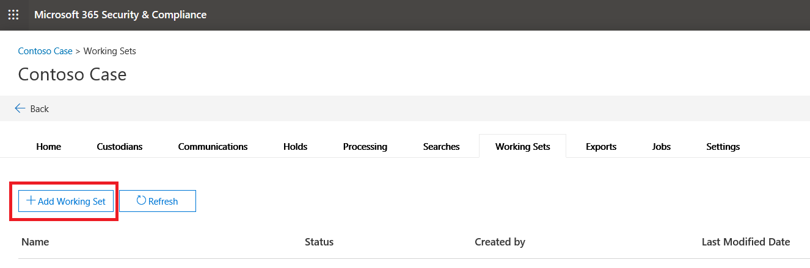

# 高度な電子情報開示でのレビューセットの管理Manage review sets in Advanced eDiscovery

Review sets は、データの分析、クエリ、表示、タグ付け、およびエクスポートを行うことができる、一連の静的なドキュメントです。Review sets are a static set of documents where you can analyze, query, view, tag, and export data in a case. これらのタスクの実行の詳細については、以下を参照してください。For more information about performing these tasks, see:

- [レビューセット内のデータを分析するAnalyze data in a review set](analyzing-data-in-review-set.md)

- [レビュー セット内のデータをクエリするQuery the data in a review set](review-set-search.md)

- [レビュー セット内のドキュメントを表示するView documents in a review set](view-documents-in-review-set.md)

- [レビュー セット内のドキュメントをタグ付けするTag documents in a review set](tagging-documents.md)

- [ケース データをエクスポートするExport case data](exporting-data-ediscover20.md)

## レビューセットを作成するCreate a review set

[レビューセット] タブで [ \*\*\*\* **+ レビューセットの追加**] をクリックして、レビューセットを作成できます。Review sets can be created on the **Review sets** tab by clicking **+ Add review set**.

[**レビュー設定の追加**] ページで、レビューセットの名前を入力し、[**保存**] をクリックします。On the **Add review set** flyout page, type a name for the review set and then click **Save**. 新しいレビューセットが [**確認セット**] タブの一覧に表示されます。The new review set is displayed in the list on the **Review sets** tab.

![[レビューセット] タブに新しいレビューセットが表示されている](../media/AeDnewreviewset.png)

高度な電子情報開示ケースのレビューセットにデータを追加するには、3種類の方法があります。There are three different ways to add data to a review set in an Advanced eDiscovery case.

1. [検索結果をレビュー セットに追加するAdd search results to a review set](add-data-to-review-set.md)

2. [レビュー セットに Office 365 以外のデータを読み込むLoad non-Office 365 data into a review set](load-non-office365-data.md)

3. [別のレビューセットからのレビューセットへのデータの追加Add data to a review set from another review set](add-data-to-review-set-from-another-review-set.md)
