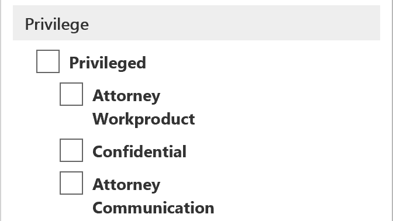

# ワーキング セット内のドキュメントにタグ付けする

作業セットのコンテンツを整理することは、電子情報開示プロセスでさまざまなワークフローを完了するために重要です。 これには以下が含まれます。

-  不要なコンテンツをカリングします。

- 関連するコンテンツを特定する。
 
-  専門家または弁護士が確認する必要があるコンテンツを識別する。

専門家、弁護士、または他のユーザーが作業セットのコンテンツをレビューする場合、コンテンツに関連する意見をタグを使用して取得できます。 たとえば、不要なコンテンツをカリングすることが目的の場合、ユーザーは "応答不可" などのタグを持つドキュメントにタグを付けます。 コンテンツをレビューしてタグ付けした後は、作業セット検索を作成して、"応答不可" としてタグ付けされたコンテンツを除外することができます。これにより、電子情報開示ワークフローの次のステップからこのコンテンツが削除されます。 タグパネルは、すべてのケースについてカスタマイズできます。そのため、タグが目的のレビューワークフローをサポートできるようになります。

## タグの種類

Advanced eDiscovery (プレビュー) では、次の2種類のタグが提供されます。

- **単一選択タグ**-ユーザーがグループ内の1つのタグを選択できるように制限します。 これは、ユーザーが "応答可能" や "応答不可" などの競合するタグを選択しないようにするのに便利です。 

- **複数選択タグ**-ユーザーがグループ内で複数のタグを選択できるようにします。

## タグ構造

タグの種類に加えて、タグパネルでタグを構成する方法の構造を使用すると、タグ付きドキュメントをより直観的に作成できます。 タグはセクションごとにグループ化されます。 作業セット検索は、タグとタグで検索する機能をサポートしています。 つまり、作業セット検索を作成して、セクション内のタグでタグ付けされたドキュメントを取得することができます。

タグは、セクション内にネストすることで、さらに整理することができます。 たとえば、権限のあるコンテンツを識別し、タグ付けすることを目的としている場合は、ネストを使用して、ユーザーがドキュメントを "特権付き" としてタグ設定し、適切なネストされたタグをチェックすることで特権の種類を選択できることを明確にすることができます。

## タグの適用

コンテンツにタグを適用するには、いくつかの方法があります。

### 1つのドキュメントにタグを付けます。

作業セット内のドキュメントを表示するときに、[**コーディングパネル]** をクリックすると、レビューで使用できるタグを表示できます。

![[タグパネル] をクリックして、タグパネルを表示します。](../media/Singledoctag.png)

これにより、ビューアーに表示されるドキュメントにタグを適用することができます。

### 一括タグ付け

一括タグ付けを行うには、結果グリッドで複数のファイルを選択し、1つのドキュメントにタグ付けするのと同じように、**コーディングパネル**のタグを使用します。 タグを2回選択することで一括でのタグの解除を行うことができます。最初のクリックでタグが適用され、2番目の選択によって、選択されているすべてのファイルのタグがクリアされます。

> [!NOTE]
> 一括タグ付けの場合、タグ付けパネルには、パネル内の各タグに対してタグ付けされたファイルの数が表示されます。

### 他のレビューパネルでのタグ付け

ドキュメントを確認するときは、他のレビューパネルを使用して、結果グリッド内のドキュメントの他の特性を確認できます。 これには、その他の関連ドキュメント、電子メールスレッド、ほぼ重複、ハッシュの重複の確認が含まれます。 たとえば、[**ドキュメントファミリ**レビュー] パネルを使用して関連ドキュメントをレビューしている場合は、関連するドキュメントを一括でタグ付けすることによってレビュー時間を大幅に短縮できます。 たとえば、電子メールメッセージに複数の添付ファイルがあり、ファミリー全体が一貫してタグ付けされるようにする場合などです。

たとえば、**ドキュメントファミリー**レビューパネルの使用時に**コーディングパネル**を表示する方法は次のとおりです。

1. 選択したドキュメントに対してレビューパネルを開き (たとえば、関連するコンテンツのリストを**ドキュメントファミリー**レビューパネルに表示する)、現在のレビューパネルの上部にある [**コードドキュメント**] をクリックします。

   コーディングパネルはポップアップウィンドウに表示されます。

2. 1つ以上のタグを選択して、選択したドキュメントを適用します。 

3. すべてのドキュメントにタグ付けするには、**ドキュメントファミリー**パネルで [すべてのドキュメント] を選択し、[**コードドキュメント**] をクリックして、ドキュメントのファミリー全体に適用するタグを選択します。

