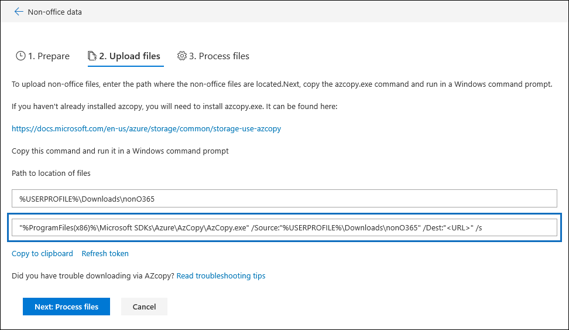

# Advanced eDiscovery での azcopy のトラブルシューティング (プレビュー)Troubleshoot AzCopy in Advanced eDiscovery (Preview)

高度な電子情報開示 (プレビュー) でエラーを修復するために Office 以外の365データまたはドキュメントを読み込む場合、ユーザーインターフェイスは、アップロードするファイルが保存されている場所と azure にパラメーターを含む azure azcopy コマンドを提供します。ファイルがアップロードされる保存場所。When loading non-Office 365 data or documents for error remediation in Advanced eDiscovery (Preview), the user interface supplies an Azure AzCopy command that contains parameters with the location of where the files that you want to upload are stored and the Azure storage location that the files will be uploaded to. ドキュメントをアップロードするには、このコマンドをコピーして、ローカルコンピューターのコマンドプロンプトで実行します。To upload your documents, you copy this command and then run it in a Command Prompt on your local computer.  次のスクリーンショットは、azcopy コマンドの例を示しています。The follow screenshot shows an example of an AzCopy command:

ほとんどの場合、提供されているコマンドは、実行時に機能します。In most cases, the command that's provided will work when you run it. ただし、表示されるコマンドが正常に実行されない場合もあります。However, there may be cases when the command that's displayed will not run successfully. 考えられるいくつかの理由を次に示します。Here's a few possible reasons.

## azcopy がローカルコンピューターにインストールされていないか、既定の場所にインストールされていませんAzCopy isn't installed on the local computer or it's not installed in the default location

azcopy がインストールされていない場合や、既定のインストール先 (つまり`%ProgramFiles(x86)%`) 以外の場所にインストールされている場合、azcopy コマンドを実行すると、次のエラーが表示されることがあります。If AzCopy isn't installed or it's installed in a location other than the default install location (which is `%ProgramFiles(x86)%`), you may receive the following error when you run the AzCopy command:

    The system cannot find the path specified.

azcopy がローカルコンピューターにインストールされていない場合は、ここからインストールできます (既定の場所にインストールする[https://docs.microsoft.com/azure/storage/common/storage-use-azcopy](https://docs.microsoft.com/azure/storage/common/storage-use-azcopy)必要があります)。If AzCopy isn't install on the local computer, you can install from here (being sure to install it in the default location): [https://docs.microsoft.com/azure/storage/common/storage-use-azcopy](https://docs.microsoft.com/azure/storage/common/storage-use-azcopy).

azcopy がインストールされていても、既定の場所とは別の場所にインストールされている場合は、コマンドをコピーしてテキストファイルに貼り付け、次に、azcopy が実際にインストールされている場所へのパスを変更することができます。If AzCopy is installed, but it's installed in a location different than the default location, you can copy the command, paste it to a text file, and then change the path to the location where AzCopy is actually installed. たとえば、azcopy がに`%ProgramFiles%`ある場合は、コマンドの最初の部分をから`%ProgramFiles(x86)%\Microsoft SDKs\Azure\AzCopy.exe`に`%ProgramFiles%\Microsoft SDKs\Azure\AzCopy`変更できます。For example, if Azcopy is located in `%ProgramFiles%`, then you can change the first part of the command from `%ProgramFiles(x86)%\Microsoft SDKs\Azure\AzCopy.exe` to `%ProgramFiles%\Microsoft SDKs\Azure\AzCopy`. この変更を行った後、テキストファイルからコピーし、コマンドプロンプトで実行します。After you make this change, copy it from the text file and then run it a Command Prompt.

> [!TIP]
> azcopy が既定のインストール先以外の場所にインストールされている場合は、それをアンインストールしてから、既定の場所に再インストールすることを検討してください。If AzCopy is installed in a location other then the default install location, consider uninstalling it and then re-installing it in the default location. これにより、今後この問題を回避することができます。This will help prevent this issue in the future.