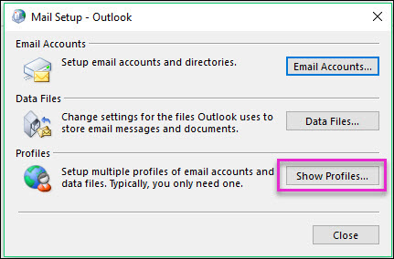

# <a name="configure-supervision-policies-for-your-organization"></a><span data-ttu-id="65e68-103">組織の監督ポリシーを設定する</span><span class="sxs-lookup"><span data-stu-id="65e68-103">Configure supervision policies for your organization</span></span>

<span data-ttu-id="65e68-104">監督ポリシーを使用して、内部または外部のレビューアーによる検査のために従業員の通信をキャプチャします。</span><span class="sxs-lookup"><span data-stu-id="65e68-104">Use supervision policies to capture employee communications for examination by internal or external reviewers.</span></span> <span data-ttu-id="65e68-105">監督ポリシーが組織内の通信を監視するのに役立つ方法の詳細については、「 [Office 365 の監督ポリシー](supervision-policies.md)」を参照してください。</span><span class="sxs-lookup"><span data-stu-id="65e68-105">For more information about how supervision policies can help you monitor communications in your organization, see [Supervision policies in Office 365](supervision-policies.md).</span></span>

> [!NOTE]
> <span data-ttu-id="65e68-106">監督ポリシーによって監視されるユーザーは、Microsoft 365 E5 コンプライアンスライセンス、Advanced コンプライアンスアドオンを備えた office 365 Enterprise E3 ライセンス、または office 365 Enterprise E5 サブスクリプションに含まれている必要があります。</span><span class="sxs-lookup"><span data-stu-id="65e68-106">Users monitored by supervision policies must have either a Microsoft 365 E5 Compliance license, an Office 365 Enterprise E3 license with the Advanced Compliance add-on, or be included in an Office 365 Enterprise E5 subscription.</span></span>
<span data-ttu-id="65e68-107">既存の Enterprise e5 プランを所有しておらず、監督を試みる場合は、 [Office 365 Enterprise E5 の試用版にサインアップ](https://go.microsoft.com/fwlink/p/?LinkID=698279)することができます。</span><span class="sxs-lookup"><span data-stu-id="65e68-107">If you don't have an existing Enterprise E5 plan and want to try supervision, you can [sign up for a trial of Office 365 Enterprise E5](https://go.microsoft.com/fwlink/p/?LinkID=698279).</span></span>
  
<span data-ttu-id="65e68-108">Office 365 組織の監督をセットアップして使用するには、次の手順を実行します。</span><span class="sxs-lookup"><span data-stu-id="65e68-108">Follow these steps to set up and use supervision in your Office 365 organization:</span></span>
  
- <span data-ttu-id="65e68-109">**手順 1 (省略可能)** - [監督のグループをセットアップする (オプション)](#step-1---set-up-groups-for-supervision-optional)</span><span class="sxs-lookup"><span data-stu-id="65e68-109">**Step 1 (optional)** - [Set up groups for Supervision (optional)](#step-1---set-up-groups-for-supervision-optional)</span></span>

    <span data-ttu-id="65e68-110">監督の使用を開始する前に、通信をレビューする必要があるユーザーとレビューを実行するユーザーを決定します。</span><span class="sxs-lookup"><span data-stu-id="65e68-110">Before you start using supervision, determine who needs communications reviewed and who will perform reviews.</span></span> <span data-ttu-id="65e68-111">監督がどのように機能するかを確認するために、少数のユーザーのみを使用して作業を開始する場合は、現時点ではグループの設定を省略できます。</span><span class="sxs-lookup"><span data-stu-id="65e68-111">If you want to get started with just a few users to see how supervision works, you can skip setting up groups for now.</span></span>

- <span data-ttu-id="65e68-112">**手順 2 (必須)** - [組織内で監督を利用できるようにする (必須)](#step-2---make-supervision-available-in-your-organization-required)</span><span class="sxs-lookup"><span data-stu-id="65e68-112">**Step 2 (required)** - [Make supervision available in your organization (required)](#step-2---make-supervision-available-in-your-organization-required)</span></span>

    <span data-ttu-id="65e68-113">ポリシーをセットアップできるように、自分を監督レビュー役割グループに追加します。</span><span class="sxs-lookup"><span data-stu-id="65e68-113">Add yourself to the Supervisory Review role group so you can set up policies.</span></span> <span data-ttu-id="65e68-114">この役割が割り当てられているすべてのユーザーは、コンプライアンスセンターの [**監督**] ページにアクセスできます。</span><span class="sxs-lookup"><span data-stu-id="65e68-114">Anyone who has this role assigned can access the **Supervision** page in the Compliance Center.</span></span> <span data-ttu-id="65e68-115">再表示可能な電子メールが exchange online でホストされている場合は、各レビュー担当者が[exchange online へのリモート PowerShell アクセス権](https://docs.microsoft.com/powershell/exchange/exchange-online/disable-access-to-exchange-online-powershell)を持っている必要があります。</span><span class="sxs-lookup"><span data-stu-id="65e68-115">If reviewable email is hosted on Exchange Online, each reviewer must have [remote PowerShell access to Exchange Online](https://docs.microsoft.com/powershell/exchange/exchange-online/disable-access-to-exchange-online-powershell).</span></span>

- <span data-ttu-id="65e68-116">**手順 3 (省略可能)** - [カスタムの機密情報の種類とカスタムキーワードディクショナリを作成する](#step-3---create-custom-sensitive-information-types-and-custom-keyword-dictionaries-optional)</span><span class="sxs-lookup"><span data-stu-id="65e68-116">**Step 3 (optional)** - [Create custom sensitive information types and custom keyword dictionaries](#step-3---create-custom-sensitive-information-types-and-custom-keyword-dictionaries-optional)</span></span>

    <span data-ttu-id="65e68-117">監督ポリシー用のカスタムの機密情報の種類またはカスタムキーワード辞書が必要な場合は、監督のウィザードを開始する前に、それを作成する必要があります。</span><span class="sxs-lookup"><span data-stu-id="65e68-117">If you need a custom sensitive info type or a custom keyword dictionary for your supervision policy, you need to create it before starting the supervision wizard.</span></span>

- <span data-ttu-id="65e68-118">**手順 4 (必須)** - [監督ポリシーをセットアップする](#step-4---set-up-a-supervision-policy-required)</span><span class="sxs-lookup"><span data-stu-id="65e68-118">**Step 4 (required)** - [Set up a supervision policy](#step-4---set-up-a-supervision-policy-required)</span></span>

    <span data-ttu-id="65e68-119">監督ポリシーは、コンプライアンスセンターで作成します。</span><span class="sxs-lookup"><span data-stu-id="65e68-119">You create supervision policies in the Compliance Center.</span></span> <span data-ttu-id="65e68-120">これらのポリシーでは、組織内で検討する対象となる通信を定義し、レビューを実行するユーザーを指定します。</span><span class="sxs-lookup"><span data-stu-id="65e68-120">These policies define which communications are subject to review in your organization and specifies who performs reviews.</span></span> <span data-ttu-id="65e68-121">コミュニケーションには、電子メールと Microsoft Teams の通信、およびサードパーティ製のプラットフォーム通信 (Facebook、Twitter など) が含まれます。</span><span class="sxs-lookup"><span data-stu-id="65e68-121">Communications include email and Microsoft Teams communications, and 3rd-party platform communications (such as Facebook, Twitter, etc.)</span></span>

- <span data-ttu-id="65e68-122">**手順 5-(省略可能)**[監督ポリシーをテストする](#step-5---test-your-supervision-policy-optional)</span><span class="sxs-lookup"><span data-stu-id="65e68-122">**Step 5 - (optional)** [Test your supervision policy](#step-5---test-your-supervision-policy-optional)</span></span>

    <span data-ttu-id="65e68-123">監督ポリシーをテストし、必要に応じて機能していることを確認します。</span><span class="sxs-lookup"><span data-stu-id="65e68-123">Test your supervision policy to make sure it functions as desired.</span></span> <span data-ttu-id="65e68-124">コンプライアンス戦略によって標準が達成されていることを確認することが重要です。</span><span class="sxs-lookup"><span data-stu-id="65e68-124">It is important to ensure that your compliance strategy is meeting your standards.</span></span>

- <span data-ttu-id="65e68-125">**手順 6-(省略可能)**[Office 365 監督ダッシュボードまたは web 上の outlook (以前の outlook web App) を使用しないで、監視された通信を確認するには、outlook を構成](#step-6---configure-outlook-for-reviewers-optional)します。</span><span class="sxs-lookup"><span data-stu-id="65e68-125">**Step 6 - (optional)** [Configure Outlook for reviewers who do not want to use Office 365 supervision dashboard or Outlook on the web (formerly known as Outlook Web App) to review supervised communications](#step-6---configure-outlook-for-reviewers-optional)</span></span>

    <span data-ttu-id="65e68-126">outlook を構成して、レビューアーが outlook クライアント内の監督機能にアクセスできるようにして、各アイテムを評価および分類できるようにします。</span><span class="sxs-lookup"><span data-stu-id="65e68-126">Configure Outlook to give reviewers access to the supervision functionality within the Outlook client so they can assess and categorize each item.</span></span>

## <a name="step-1---set-up-groups-for-supervision-optional"></a><span data-ttu-id="65e68-127">手順 1-監督のグループをセットアップする (オプション)</span><span class="sxs-lookup"><span data-stu-id="65e68-127">Step 1 - Set up groups for Supervision (optional)</span></span>

 <span data-ttu-id="65e68-128">監督ポリシーを作成するときに、通信をレビューしたユーザーとレビューを実行するユーザーを定義します。</span><span class="sxs-lookup"><span data-stu-id="65e68-128">When you create a supervision policy, you define who has their communications reviewed and who performs reviews.</span></span> <span data-ttu-id="65e68-129">このポリシーでは、電子メールアドレスを使用して個人またはユーザーのグループを識別します。</span><span class="sxs-lookup"><span data-stu-id="65e68-129">In the policy, you'll use email addresses to identify individuals or groups of people.</span></span> <span data-ttu-id="65e68-130">セットアップを簡単にするために、コミュニケーションをレビューしたユーザーのためのグループを作成できます。</span><span class="sxs-lookup"><span data-stu-id="65e68-130">To simplify your setup, you can create groups for people who have their communication reviewed and groups for people who review those communications.</span></span> <span data-ttu-id="65e68-131">グループを使用している場合は、複数のが必要になることがあります。</span><span class="sxs-lookup"><span data-stu-id="65e68-131">If you're using groups, you may need several.</span></span> <span data-ttu-id="65e68-132">たとえば、2つの異なるユーザーグループ間の通信を監視する場合、または、監視されないグループを指定する場合などです。</span><span class="sxs-lookup"><span data-stu-id="65e68-132">For example, you want to monitor communications between two distinct groups of people or if you want to specify a group that isn't going to be supervised.</span></span>

<span data-ttu-id="65e68-133">次の表を使用して、監督ポリシー用に組織内のグループを構成する方法について説明します。</span><span class="sxs-lookup"><span data-stu-id="65e68-133">Use the following chart to help you configure groups in your organization for supervision policies:</span></span>

| <span data-ttu-id="65e68-134">**ポリシーメンバー**</span><span class="sxs-lookup"><span data-stu-id="65e68-134">**Policy Member**</span></span> | <span data-ttu-id="65e68-135">**サポートされるグループ**</span><span class="sxs-lookup"><span data-stu-id="65e68-135">**Supported Groups**</span></span> | <span data-ttu-id="65e68-136">**サポートされないグループ**</span><span class="sxs-lookup"><span data-stu-id="65e68-136">**Unsupported Groups**</span></span> |
|:-----|:-----|:-----|
|<span data-ttu-id="65e68-137">ユーザーの監視</span><span class="sxs-lookup"><span data-stu-id="65e68-137">Supervised users</span></span> | <span data-ttu-id="65e68-138">配布グループ</span><span class="sxs-lookup"><span data-stu-id="65e68-138">Distribution groups</span></span> <br> <span data-ttu-id="65e68-139">Office 365 グループ</span><span class="sxs-lookup"><span data-stu-id="65e68-139">Office 365 groups</span></span> | <span data-ttu-id="65e68-140">動的配布グループ</span><span class="sxs-lookup"><span data-stu-id="65e68-140">Dynamic distribution groups</span></span> |
| <span data-ttu-id="65e68-141">Reviewers</span><span class="sxs-lookup"><span data-stu-id="65e68-141">Reviewers</span></span> | <span data-ttu-id="65e68-142">メールが有効なセキュリティ グループ</span><span class="sxs-lookup"><span data-stu-id="65e68-142">Mail-enabled security groups</span></span>  | <span data-ttu-id="65e68-143">配布グループ</span><span class="sxs-lookup"><span data-stu-id="65e68-143">Distribution groups</span></span> <br> <span data-ttu-id="65e68-144">動的配布グループ</span><span class="sxs-lookup"><span data-stu-id="65e68-144">Dynamic distribution groups</span></span> |
  
<span data-ttu-id="65e68-145">大規模なエンタープライズ組織での管理対象ユーザーを管理するには、大規模なグループのすべてのユーザーを監視する必要がある場合があります。</span><span class="sxs-lookup"><span data-stu-id="65e68-145">To manage supervised users in large enterprise organizations, you may need to monitor all users across large groups.</span></span> <span data-ttu-id="65e68-146">PowerShell を使用して、割り当てられたグループのグローバル監督ポリシーの配布グループを構成できます。</span><span class="sxs-lookup"><span data-stu-id="65e68-146">You can use PowerShell to configure a distribution group for a global supervision policy for the assigned group.</span></span> <span data-ttu-id="65e68-147">これにより、数千人のユーザーを1つのポリシーで監視し、新しい従業員が組織に参加したときに、監督ポリシーを更新したままにすることができます。</span><span class="sxs-lookup"><span data-stu-id="65e68-147">This enables you to monitor thousands of users with a single policy and keep the supervision policy updated as new employees join your organization.</span></span>

1. <span data-ttu-id="65e68-148">次のプロパティを使用して、グローバル監督ポリシー用の専用の[配布グループ](https://docs.microsoft.com/powershell/module/exchange/users-and-groups/new-distributiongroup?view=exchange-ps)を作成します。この配布グループは、他の目的や他の Office 365 サービスで使用されていないことを確認してください。</span><span class="sxs-lookup"><span data-stu-id="65e68-148">Create a dedicated [distribution group](https://docs.microsoft.com/powershell/module/exchange/users-and-groups/new-distributiongroup?view=exchange-ps) for your global supervision policy with the following properties: Make sure that this distribution group isn't used for other purposes or other Office 365 services.</span></span>

    - <span data-ttu-id="65e68-149">**MemberDepartRestriction = Closed**。</span><span class="sxs-lookup"><span data-stu-id="65e68-149">**MemberDepartRestriction = Closed**.</span></span> <span data-ttu-id="65e68-150">ユーザーが配布グループから自分自身を削除できないようにします。</span><span class="sxs-lookup"><span data-stu-id="65e68-150">Ensures that users cannot remove themselves from the distribution group.</span></span>
    - <span data-ttu-id="65e68-151">**memberjoinrestriction = Closed**。</span><span class="sxs-lookup"><span data-stu-id="65e68-151">**MemberJoinRestriction = Closed**.</span></span> <span data-ttu-id="65e68-152">ユーザーが自分を配布グループに追加できないようにします。</span><span class="sxs-lookup"><span data-stu-id="65e68-152">Ensures that users cannot add themselves to the distribution group.</span></span>
    - <span data-ttu-id="65e68-153">**ModerationEnabled = True**。</span><span class="sxs-lookup"><span data-stu-id="65e68-153">**ModerationEnabled = True**.</span></span> <span data-ttu-id="65e68-154">このグループに送信されるすべてのメッセージが承認され、監督ポリシー構成外との通信にグループが使用されていないことを確認します。</span><span class="sxs-lookup"><span data-stu-id="65e68-154">Ensures that all messages sent to this group are subject to approval and that the group is not being used to communicate outside of the supervision policy configuration.</span></span>

    ```
    New-DistributionGroup -Name <your group name> -Alias <your group alias> -MemberDepartRestriction 'Closed' -MemberJoinRestriction 'Closed' -ModerationEnabled $true
    ```
2. <span data-ttu-id="65e68-155">組織内の監督ポリシーに追加されたユーザーを追跡するには、未使用の[Exchange カスタム属性](https://docs.microsoft.com/Exchange/recipients/mailbox-custom-attributes?view=exchserver-2019&viewFallbackFrom=exchonline-ww)を選択します。</span><span class="sxs-lookup"><span data-stu-id="65e68-155">Select an unused [Exchange custom attribute](https://docs.microsoft.com/Exchange/recipients/mailbox-custom-attributes?view=exchserver-2019&viewFallbackFrom=exchonline-ww) to track users added to the supervision policy in your organization.</span></span>

3. <span data-ttu-id="65e68-156">次の PowerShell スクリプトを定期的なスケジュールで実行して、ユーザーを監督ポリシーに追加します。</span><span class="sxs-lookup"><span data-stu-id="65e68-156">Run the following PowerShell script on a recurring schedule to add users to the supervision policy:</span></span>

    ```
    $Mbx = (Get-Mailbox -RecipientTypeDetails UserMailbox -ResultSize Unlimited -Filter {CustomAttribute9 -eq $Null})
    $i = 0
    ForEach ($M in $Mbx) 
    {
      Write-Host "Adding" $M.DisplayName
      Add-DistributionGroupMember -Identity <your group name> -Member $M.DistinguishedName -ErrorAction SilentlyContinue
      Set-Mailbox -Identity $M.Alias -<your custom attribute name> SRAdded 
      $i++
    }
    Write-Host $i "Mailboxes added to supervisory review distribution group."
    ```

<span data-ttu-id="65e68-157">グループのセットアップの詳細については、以下を参照してください。</span><span class="sxs-lookup"><span data-stu-id="65e68-157">For more information about setting up groups, see:</span></span>
- [<span data-ttu-id="65e68-158">配布グループを作成および管理する</span><span class="sxs-lookup"><span data-stu-id="65e68-158">Create and manage distribution groups</span></span>](https://docs.microsoft.com/Exchange/recipients-in-exchange-online/manage-distribution-groups/manage-distribution-groups)
- [<span data-ttu-id="65e68-159">メールが有効なセキュリティ グループの管理</span><span class="sxs-lookup"><span data-stu-id="65e68-159">Manage mail-enabled security groups</span></span>](https://docs.microsoft.com/Exchange/recipients-in-exchange-online/manage-mail-enabled-security-groups)
- [<span data-ttu-id="65e68-160">Office 365 グループの概要</span><span class="sxs-lookup"><span data-stu-id="65e68-160">Overview of Office 365 Groups</span></span>](https://docs.microsoft.com/office365/admin/create-groups/office-365-groups?view=o365-worldwide)

## <a name="step-2---make-supervision-available-in-your-organization-required"></a><span data-ttu-id="65e68-161">手順 2-組織で監督を利用できるようにする (必須)</span><span class="sxs-lookup"><span data-stu-id="65e68-161">Step 2 - Make supervision available in your organization (required)</span></span>

<span data-ttu-id="65e68-162">コンプライアンスセンターで、**監督**をメニューオプションとして使用できるようにするには、監督レビュー管理者の役割が割り当てられている必要があります。</span><span class="sxs-lookup"><span data-stu-id="65e68-162">To make **Supervision** available as a menu option in the Compliance Center, you must be assigned the Supervisory Review Administrator role.</span></span>
  
<span data-ttu-id="65e68-163">これを行うには、自分を監督レビュー役割グループのメンバーとして追加するか、役割グループを作成することができます。</span><span class="sxs-lookup"><span data-stu-id="65e68-163">To do this, you can either add yourself as a member of the Supervisory Review role group, or you can create a role group.</span></span>
  
### <a name="add-members-to-the-supervisory-review-role-group"></a><span data-ttu-id="65e68-164">監督レビュー役割グループにメンバーを追加する</span><span class="sxs-lookup"><span data-stu-id="65e68-164">Add members to the Supervisory Review role group</span></span>

1. <span data-ttu-id="65e68-165">Office 365 [https://protection.office.com](https://protection.office.com)組織の管理者アカウントの資格情報を使用してサインインします。</span><span class="sxs-lookup"><span data-stu-id="65e68-165">Sign into [https://protection.office.com](https://protection.office.com) using credentials for an admin account in your Office 365 organization.</span></span>

2. <span data-ttu-id="65e68-166">[コンプライアンスセンター] で、[**アクセス許可**] に移動します。</span><span class="sxs-lookup"><span data-stu-id="65e68-166">In the Compliance Center, go to **Permissions**.</span></span>

3. <span data-ttu-id="65e68-167">[**監督レビュー** ] 役割グループを選択し、[編集] アイコンをクリックします。</span><span class="sxs-lookup"><span data-stu-id="65e68-167">Select the **Supervisory Review** role group and then click the Edit icon.</span></span>

4. <span data-ttu-id="65e68-168">[**メンバー** ] セクションで、組織の監督を管理するユーザーを追加します。</span><span class="sxs-lookup"><span data-stu-id="65e68-168">In the **Members** section, add the people who you want to manage supervision for your organization.</span></span>

### <a name="create-a-new-role-group"></a><span data-ttu-id="65e68-169">新しい役割グループを作成する</span><span class="sxs-lookup"><span data-stu-id="65e68-169">Create a new role group</span></span>

1. <span data-ttu-id="65e68-170">Office 365 [https://protection.office.com](https://protection.office.com)組織の管理者アカウントの資格情報を使用してサインインします。</span><span class="sxs-lookup"><span data-stu-id="65e68-170">Sign into [https://protection.office.com](https://protection.office.com) using credentials for an admin account in your Office 365 organization.</span></span>

2. <span data-ttu-id="65e68-171">[コンプライアンスセンター] で、[**アクセス許可**] に移動し**+**、[追加] () をクリックします。</span><span class="sxs-lookup"><span data-stu-id="65e68-171">In the Compliance Center, go to **Permissions** and then click Add (**+**).</span></span>

3. <span data-ttu-id="65e68-172">[**役割**] セクションで、[追加**+**] () をクリックし、[**監督レビュー管理者**] まで下にスクロールします。</span><span class="sxs-lookup"><span data-stu-id="65e68-172">In the **Roles** section, click Add (**+**) and scroll down to **Supervisory Review Administrator**.</span></span> <span data-ttu-id="65e68-173">この役割を役割グループに追加します。</span><span class="sxs-lookup"><span data-stu-id="65e68-173">Add this role to the role group.</span></span>

4. <span data-ttu-id="65e68-174">[**メンバー** ] セクションで、組織の監督を管理するユーザーを追加します。</span><span class="sxs-lookup"><span data-stu-id="65e68-174">In the **Members** section, add the people who you want to manage supervision for your organization.</span></span>

<span data-ttu-id="65e68-175">役割グループとアクセス許可の詳細については、「[コンプライアンスセンターのアクセス許可](permissions-in-the-security-and-compliance-center.md)」を参照してください。</span><span class="sxs-lookup"><span data-stu-id="65e68-175">For more information about role groups and permissions, see [Permissions in the Compliance Center](permissions-in-the-security-and-compliance-center.md).</span></span>

### <a name="enable-remote-powershell-access-for-reviewers-if-email-is-hosted-on-exchange-online"></a><span data-ttu-id="65e68-176">レビューアーのリモート PowerShell アクセスを有効にする (電子メールが Exchange Online でホストされている場合)</span><span class="sxs-lookup"><span data-stu-id="65e68-176">Enable remote PowerShell access for reviewers (if email is hosted on Exchange Online)</span></span>

1. <span data-ttu-id="65e68-177">「 [Exchange Online PowerShell へのアクセスを有効または無効](https://docs.microsoft.com/powershell/exchange/exchange-online/disable-access-to-exchange-online-powershell)にする」のガイダンスに従ってください。</span><span class="sxs-lookup"><span data-stu-id="65e68-177">Follow the guidance in [Enable or disable access to Exchange Online PowerShell](https://docs.microsoft.com/powershell/exchange/exchange-online/disable-access-to-exchange-online-powershell).</span></span>

## <a name="step-3---create-custom-sensitive-information-types-and-custom-keyword-dictionaries-optional"></a><span data-ttu-id="65e68-178">手順 3-カスタムの機密情報の種類とカスタムのキーワードディクショナリを作成する (オプション)</span><span class="sxs-lookup"><span data-stu-id="65e68-178">Step 3 - Create custom sensitive information types and custom keyword dictionaries (optional)</span></span>

<span data-ttu-id="65e68-179">監督ポリシーウィザードで既存のカスタムの機密情報の種類またはカスタムキーワードディクショナリから選択するには、最初に、必要に応じてこれらの項目を作成する必要があります。</span><span class="sxs-lookup"><span data-stu-id="65e68-179">In order to pick from existing custom sensitive information types or custom keyword dictionaries in the supervision policy wizard, you first need to create these items if needed.</span></span>

### <a name="create-custom-keyword-dictionarylexicon-optional"></a><span data-ttu-id="65e68-180">ユーザー設定のキーワード辞書/辞書を作成する (オプション)</span><span class="sxs-lookup"><span data-stu-id="65e68-180">Create custom keyword dictionary/lexicon (optional)</span></span>

<span data-ttu-id="65e68-181">メモ帳などのテキストエディターを使用して、監督ポリシーで監視するキーワード用語を含む新しいファイルを作成します。</span><span class="sxs-lookup"><span data-stu-id="65e68-181">Use a text editor (like Notepad), to create a new file that includes the keyword terms you'd like to monitor in a supervision policy.</span></span> <span data-ttu-id="65e68-182">各用語が別々の行にあることを確認し、 **Unicode/utf-16 (リトルエンディアン)** 形式でファイルを保存します。</span><span class="sxs-lookup"><span data-stu-id="65e68-182">Make sure that each term is on a separate line and save the file in the **Unicode/UTF-16 (Little Endian)** format.</span></span>

### <a name="create-custom-sensitive-information-types"></a><span data-ttu-id="65e68-183">カスタムの機密情報の種類を作成する</span><span class="sxs-lookup"><span data-stu-id="65e68-183">Create custom sensitive information types</span></span>

1. <span data-ttu-id="65e68-184">新しい機密情報の種類を作成し、Office 365 セキュリティ & コンプライアンスセンターでユーザー辞書を追加します。</span><span class="sxs-lookup"><span data-stu-id="65e68-184">Create a new sensitive information type and add your custom dictionary in the Office 365 Security & Compliance Center.</span></span> <span data-ttu-id="65e68-185">[**分類** \> **機密情報の種類**] に移動し、**新しい機密情報の種類ウィザード**の手順に従います。</span><span class="sxs-lookup"><span data-stu-id="65e68-185">Navigate to **Classifications** \> **Sensitive info types** and follow the steps in the **New sensitive info type wizard**.</span></span> <span data-ttu-id="65e68-186">ここでは、次の操作を行います。</span><span class="sxs-lookup"><span data-stu-id="65e68-186">Here you will:</span></span>

    - <span data-ttu-id="65e68-187">機密情報の種類の名前と説明を定義する</span><span class="sxs-lookup"><span data-stu-id="65e68-187">Define a name and description for the sensitive info type</span></span>
    - <span data-ttu-id="65e68-188">近接、信頼度、およびプライマリパターン要素を定義する</span><span class="sxs-lookup"><span data-stu-id="65e68-188">Define the proximity, confidence level, and primary pattern elements</span></span>
    - <span data-ttu-id="65e68-189">ユーザー辞書を一致要素の要件としてインポートする</span><span class="sxs-lookup"><span data-stu-id="65e68-189">Import your custom dictionary as a requirement for the matching element</span></span>
    - <span data-ttu-id="65e68-190">選択内容を確認し、機密情報の種類を作成する</span><span class="sxs-lookup"><span data-stu-id="65e68-190">Review your selections and create the sensitive info type</span></span>

    <span data-ttu-id="65e68-191">詳細については、「[カスタムの機密情報の種類を作成する](create-a-custom-sensitive-information-type.md)」および「[キーワードディクショナリを作成](create-a-keyword-dictionary.md)する」を参照してください。</span><span class="sxs-lookup"><span data-stu-id="65e68-191">For more detailed information, see [Create a custom sensitive information type](create-a-custom-sensitive-information-type.md) and [Create a keyword dictionary](create-a-keyword-dictionary.md)</span></span>

    <span data-ttu-id="65e68-192">ユーザー辞書または辞書を作成した後、 [get-dlpkeyworddictionary](https://docs.microsoft.com/powershell/module/exchange/policy-and-compliance-dlp/get-dlpkeyworddictionary)コマンドレットで構成済みのキーワードを表示したり、 [get-dlpkeyworddictionary](https://docs.microsoft.com/powershell/module/exchange/policy-and-compliance-dlp/set-dlpkeyworddictionary)コマンドレットを使用して用語を追加および削除したりすることができます。</span><span class="sxs-lookup"><span data-stu-id="65e68-192">After the custom dictionary/lexicon is created, you can view the configured keywords with the [Get-DlpKeywordDictionary](https://docs.microsoft.com/powershell/module/exchange/policy-and-compliance-dlp/get-dlpkeyworddictionary) cmdlet or add and remove terms using the [Set-DlpKeywordDictionary](https://docs.microsoft.com/powershell/module/exchange/policy-and-compliance-dlp/set-dlpkeyworddictionary) cmdlet.</span></span>

## <a name="step-4---set-up-a-supervision-policy-required"></a><span data-ttu-id="65e68-193">手順 4-監督ポリシーを設定する (必須)</span><span class="sxs-lookup"><span data-stu-id="65e68-193">Step 4 - Set up a supervision policy (required)</span></span>
  
1. <span data-ttu-id="65e68-194">Office 365 [https://protection.office.com](https://protection.office.com)組織の管理者アカウントの資格情報を使用してサインインします。</span><span class="sxs-lookup"><span data-stu-id="65e68-194">Sign into [https://protection.office.com](https://protection.office.com) using credentials for an admin account in your Office 365 organization.</span></span>

2. <span data-ttu-id="65e68-195">[コンプライアンスセンター] で、[**監督**] を選択します。</span><span class="sxs-lookup"><span data-stu-id="65e68-195">In the Compliance Center, select **Supervision**.</span></span>
  
3. <span data-ttu-id="65e68-196">[**作成**] を選択し、ウィザードの指示に従って、ポリシーの次のページを設定します。</span><span class="sxs-lookup"><span data-stu-id="65e68-196">Select **Create** and then follow the wizard to set up the following pages of the policy.</span></span> <span data-ttu-id="65e68-197">ウィザードを使用すると、次のことを行うことができます。</span><span class="sxs-lookup"><span data-stu-id="65e68-197">Using the wizard, you will:</span></span>

    - <span data-ttu-id="65e68-198">ポリシーに名前と説明を指定します。</span><span class="sxs-lookup"><span data-stu-id="65e68-198">Give the policy a name and description.</span></span>
    - <span data-ttu-id="65e68-199">監督するユーザーまたはグループを選択します。これには、除外するユーザーまたはグループを選択することも含まれます。</span><span class="sxs-lookup"><span data-stu-id="65e68-199">Choose the users or groups to supervise, including choosing users or groups you'd like to exclude.</span></span>
    - <span data-ttu-id="65e68-200">監督ポリシー条件を定義します。</span><span class="sxs-lookup"><span data-stu-id="65e68-200">Define the supervision policy conditions.</span></span>
    - <span data-ttu-id="65e68-201">機密情報の種類を含めるかどうかを選択します。</span><span class="sxs-lookup"><span data-stu-id="65e68-201">Choose if you'd like to include sensitive information types.</span></span> <span data-ttu-id="65e68-202">ここでは、既定およびカスタムの機密情報の種類を選択できます。</span><span class="sxs-lookup"><span data-stu-id="65e68-202">This is where you can select default and custom sensitive info types.</span></span>
    - <span data-ttu-id="65e68-203">レビューする通信の割合を定義します。</span><span class="sxs-lookup"><span data-stu-id="65e68-203">Define the percentage of communications to review.</span></span>
    - <span data-ttu-id="65e68-204">ポリシーのレビュー担当者を選択します。</span><span class="sxs-lookup"><span data-stu-id="65e68-204">Choose the reviewers for the policy.</span></span> <span data-ttu-id="65e68-205">レビュー担当者は、個々のユーザーまたは[メールが有効なセキュリティグループに](https://docs.microsoft.com/Exchange/recipients-in-exchange-online/manage-mail-enabled-security-groups#create-a-mail-enabled-security-group)することができます。</span><span class="sxs-lookup"><span data-stu-id="65e68-205">Reviewers can be individual users or [mail-enabled security groups](https://docs.microsoft.com/Exchange/recipients-in-exchange-online/manage-mail-enabled-security-groups#create-a-mail-enabled-security-group).</span></span> <span data-ttu-id="65e68-206">すべての校閲者が Exchange Online でホストされたメールボックスを持っている必要があります。</span><span class="sxs-lookup"><span data-stu-id="65e68-206">All reviewers must have mailboxes hosted on Exchange Online.</span></span>
    - <span data-ttu-id="65e68-207">ポリシーの選択を確認し、ポリシーを作成します。</span><span class="sxs-lookup"><span data-stu-id="65e68-207">Review your policy selections and create the policy.</span></span>

## <a name="step-5---test-your-supervision-policy-optional"></a><span data-ttu-id="65e68-208">手順 5-監督ポリシーをテストする (オプション)</span><span class="sxs-lookup"><span data-stu-id="65e68-208">Step 5 - Test your supervision policy (optional)</span></span>

<span data-ttu-id="65e68-209">監督ポリシーを作成したら、定義した条件がポリシーによって適切に適用されているかどうかをテストすることをお勧めします。</span><span class="sxs-lookup"><span data-stu-id="65e68-209">After you create a supervision policy, it's a good idea to test to make sure that the conditions you defined are being properly enforced by the policy.</span></span> <span data-ttu-id="65e68-210">監督ポリシーに機密情報の種類が含まれている場合は、[データ損失防止 (DLP) ポリシーをテスト](create-test-tune-dlp-policy.md)することもできます。</span><span class="sxs-lookup"><span data-stu-id="65e68-210">You may also want to [test your data loss prevention (DLP) policies](create-test-tune-dlp-policy.md) if your supervision policies include sensitive information types.</span></span> <span data-ttu-id="65e68-211">監督ポリシーをテストするには、次の手順を実行します。</span><span class="sxs-lookup"><span data-stu-id="65e68-211">Follow these steps to test your supervision policy:</span></span>

1. <span data-ttu-id="65e68-212">テストするポリシーで定義された、監視対象のユーザーとしてログインした電子メールクライアントまたは Microsoft Teams を開きます。</span><span class="sxs-lookup"><span data-stu-id="65e68-212">Open an email client or Microsoft Teams logged in as a supervised user defined in the policy you want to test.</span></span>
2. <span data-ttu-id="65e68-213">監督ポリシーで定義した条件を満たすメールまたは Microsoft Teams のチャットを送信します。</span><span class="sxs-lookup"><span data-stu-id="65e68-213">Send an email or Microsoft Teams chat that meets the criteria you've defined in the supervision policy.</span></span> <span data-ttu-id="65e68-214">これには、キーワード、添付ファイルのサイズ、ドメインなどを指定できます。ポリシーに構成された条件設定が制限を超えているか、厳しすぎるかを確認してください。</span><span class="sxs-lookup"><span data-stu-id="65e68-214">This can be a keyword, attachment size, domain, etc. Make sure you determine if your configured conditional settings in the policy are too restrictive or too lenient.</span></span>

    > [!Note]
    > <span data-ttu-id="65e68-215">定義されたポリシーの対象となるメールは、ほぼリアルタイムで処理され、ポリシーの構成後すぐにテストできます。</span><span class="sxs-lookup"><span data-stu-id="65e68-215">Emails subject to defined policies are processed in near real-time and can be tested immediately after the policy is configured.</span></span> <span data-ttu-id="65e68-216">Microsoft Teams でのチャットは、ポリシー内で完全に処理されるまでに最大24時間かかる場合があります。</span><span class="sxs-lookup"><span data-stu-id="65e68-216">Chats in Microsoft Teams can take up to 24 hours to fully process in a policy.</span></span> 

3. <span data-ttu-id="65e68-217">監督ポリシーに指定されたレビュー担当者として Office 365 テナントにログインします。</span><span class="sxs-lookup"><span data-stu-id="65e68-217">Log into your Office 365 tenant as a reviewer designated in the supervision policy.</span></span> <span data-ttu-id="65e68-218">[*カスタムポリシー* > \*\*\*\* の**監視** > ] に移動して、ポリシーのレポートを表示します。</span><span class="sxs-lookup"><span data-stu-id="65e68-218">Navigate to **Supervision** > *Your Custom Policy* > **Open** to view the report for the policy.</span></span>

## <a name="step-6---configure-outlook-for-reviewers-optional"></a><span data-ttu-id="65e68-219">手順 6-レビュー担当者用に Outlook を構成する (オプション)</span><span class="sxs-lookup"><span data-stu-id="65e68-219">Step 6 - Configure Outlook for reviewers (optional)</span></span>

<span data-ttu-id="65e68-220">Office 365 の監督ダッシュボードではなく outlook を使用して通信を確認するためには、outlook クライアントを構成する必要があります。</span><span class="sxs-lookup"><span data-stu-id="65e68-220">Reviewers that want to use Outlook instead of the Supervision dashboard in Office 365 to review communications must configure their Outlook client.</span></span>

### <a name="step-1-copy-the-address-for-the-supervision-mailbox"></a><span data-ttu-id="65e68-221">手順 1: 監督メールボックスのアドレスをコピーする</span><span class="sxs-lookup"><span data-stu-id="65e68-221">Step 1: Copy the address for the supervision mailbox</span></span>

<span data-ttu-id="65e68-222">outlook デスクトップまたは web 用の outlook の確認を構成するには、監督ポリシーのセットアップの一部として作成された監督メールボックスのアドレスが必要です。</span><span class="sxs-lookup"><span data-stu-id="65e68-222">To configure review for Outlook desktop or Outlook for the web, you need the address for the supervision mailbox created as part of the supervision policy setup.</span></span>
  
> [!NOTE]
> <span data-ttu-id="65e68-223">他のユーザーがポリシーを作成した場合は、そのポリシーからこのアドレスを取得してアドインをインストールする必要があります。</span><span class="sxs-lookup"><span data-stu-id="65e68-223">If someone else created the policy, you need to get this address from them to install the add-in.</span></span>

 <span data-ttu-id="65e68-224">**監督メールボックスのアドレスを検索するには**</span><span class="sxs-lookup"><span data-stu-id="65e68-224">**To find the supervision mailbox address**</span></span>
  
1. <span data-ttu-id="65e68-225">組織内の管理者アカウントの資格情報を使用して、[コンプライアンスセンター](https://compliance.microsoft.com)にサインインします。</span><span class="sxs-lookup"><span data-stu-id="65e68-225">Sign into the [Compliance Center](https://compliance.microsoft.com) using credentials for an admin account in your organization.</span></span>

2. <span data-ttu-id="65e68-226">[**監督**] に移動します。</span><span class="sxs-lookup"><span data-stu-id="65e68-226">Go to **Supervision**.</span></span>

3. <span data-ttu-id="65e68-227">確認する通信の監督ポリシーを選択します。</span><span class="sxs-lookup"><span data-stu-id="65e68-227">Select a supervision policy for the communications you want to review.</span></span>

4. <span data-ttu-id="65e68-228">[ポリシーの詳細] ポップアップの [**監督メールボックス**] で、アドレスをコピーします。</span><span class="sxs-lookup"><span data-stu-id="65e68-228">In the policy details flyout, under **Supervision mailbox**, copy the address.</span></span><br/><span data-ttu-id="65e68-229">![強調表示されている監督ポリシーの詳細ポップアップの [監督メールボックス] セクション](media/71779d0e-4f01-4dd3-8234-5f9c30eeb067.jpg)</span><span class="sxs-lookup"><span data-stu-id="65e68-229"></span></span>
  
### <a name="step-2-configure-the-supervision-mailbox-for-outlook-access"></a><span data-ttu-id="65e68-230">手順 2: Outlook アクセス用に監督メールボックスを構成する</span><span class="sxs-lookup"><span data-stu-id="65e68-230">Step 2: Configure the supervision mailbox for Outlook access</span></span>

<span data-ttu-id="65e68-231">次に、レビューアーが Outlook を監督メールボックスに接続できるように、Exchange Online の PowerShell コマンドをいくつか実行する必要があります。</span><span class="sxs-lookup"><span data-stu-id="65e68-231">Next, reviewers need to run a couple Exchange Online PowerShell commands so they can connect Outlook to the supervision mailbox.</span></span>
  
1. <span data-ttu-id="65e68-232">Exchange Online PowerShell への接続。</span><span class="sxs-lookup"><span data-stu-id="65e68-232">Connect to Exchange Online PowerShell.</span></span> [<span data-ttu-id="65e68-233">タスクの実行方法</span><span class="sxs-lookup"><span data-stu-id="65e68-233">How do I do this?</span></span>](https://docs.microsoft.com/powershell/exchange/exchange-online/connect-to-exchange-online-powershell/connect-to-exchange-online-powershell)

2. <span data-ttu-id="65e68-234">次のコマンドを実行し*ます。ここで、SupervisoryReview {GUID} @domain*は上記の手順1でコピーしたアドレスで、 *User*は、手順3で監督メールボックスに接続するレビュー担当者の名前になります。</span><span class="sxs-lookup"><span data-stu-id="65e68-234">Run the following commands, where  *SupervisoryReview{GUID}@domain.onmicrosoft.com*  is the address you copied in Step 1 above, and  *User*  is the name of the reviewer who will connect to the supervision mailbox in Step 3.</span></span>

    ```Add-MailboxPermission "SupervisoryReview{GUID}@domain.onmicrosoft.com" -User <alias or email address of the account that has reviewer permissions to the supervision mailbox> -AccessRights FullAccess```

    ```Set-Mailbox "<SupervisoryReview{GUID}@domain.onmicrosoft.com>" -HiddenFromAddressListsEnabled: $false```

3. <span data-ttu-id="65e68-235">手順3に進む前に、少なくとも1時間待機してください。</span><span class="sxs-lookup"><span data-stu-id="65e68-235">Wait at least an hour before moving on to Step 3.</span></span>

### <a name="step-3-create-an-outlook-profile-to-connect-to-the-supervision-mailbox"></a><span data-ttu-id="65e68-236">手順 3: 監督メールボックスに接続するための Outlook プロファイルを作成する</span><span class="sxs-lookup"><span data-stu-id="65e68-236">Step 3: Create an Outlook profile to connect to the supervision mailbox</span></span>

<span data-ttu-id="65e68-237">最後の手順として、レビュー担当者は、監督メールボックスに接続するための Outlook プロファイルを作成する必要があります。</span><span class="sxs-lookup"><span data-stu-id="65e68-237">For the final step, reviewers need to create an Outlook profile to connect to the supervision mailbox.</span></span>

> [!NOTE]
> <span data-ttu-id="65e68-238">新しい Outlook プロファイルを作成するには、Windows のコントロールパネルの [メール] 設定を使用します。</span><span class="sxs-lookup"><span data-stu-id="65e68-238">To create a new Outlook profile, you'll use the Mail settings in the Windows Control Panel.</span></span> <span data-ttu-id="65e68-239">これらの設定にアクセスするために必要なパスは、使用している windows オペレーティングシステム (windows 7、windows 8、または windows 10)、およびインストールされている Outlook のバージョンによって異なる場合があります。</span><span class="sxs-lookup"><span data-stu-id="65e68-239">The path you take to get to these settings might depend on which Windows operating system (Windows 7, Windows 8, or Windows 10) you're using, and which version of Outlook is installed.</span></span>
  
1. <span data-ttu-id="65e68-240">コントロールパネルを開きます。</span><span class="sxs-lookup"><span data-stu-id="65e68-240">Open the Control Panel.</span></span> <span data-ttu-id="65e68-241">ウィンドウの上部にある**検索**ボックスに、「 **Mail**」と入力します。</span><span class="sxs-lookup"><span data-stu-id="65e68-241">In the **Search** box at the top of the window, type **Mail**.</span></span><br/><span data-ttu-id="65e68-242">(コントロールパネルへのアクセス方法がわからない場合はどうすればよいですか?</span><span class="sxs-lookup"><span data-stu-id="65e68-242">(Not sure how to get to the Control Panel?</span></span> <span data-ttu-id="65e68-243">[[コントロールパネルの場所] を](https://support.microsoft.com/help/13764/windows-where-is-control-panel)参照)</span><span class="sxs-lookup"><span data-stu-id="65e68-243">See [Where is Control Panel?](https://support.microsoft.com/help/13764/windows-where-is-control-panel))</span></span>
  
2. <span data-ttu-id="65e68-244">**メール**アプリを開きます。</span><span class="sxs-lookup"><span data-stu-id="65e68-244">Open the **Mail** app.</span></span>

3. <span data-ttu-id="65e68-245">[**メールの設定-Outlook**] で、[**プロファイルの表示**] をクリックします。</span><span class="sxs-lookup"><span data-stu-id="65e68-245">In **Mail Setup - Outlook**, click **Show Profiles**.</span></span><br/><span data-ttu-id="65e68-246">![[プロファイルの表示] ボタンが強調表示されている [メールの設定-Outlook] ダイアログボックス](media/28b5dae9-d10c-4f2b-926a-294c857d555c.jpg)</span><span class="sxs-lookup"><span data-stu-id="65e68-246"></span></span>
  
4. <span data-ttu-id="65e68-247">[**メール**] で、[**追加**] をクリックします。</span><span class="sxs-lookup"><span data-stu-id="65e68-247">In **Mail**, click **Add**.</span></span> <span data-ttu-id="65e68-248">次に、[**新しいプロファイル**] で、監督メールボックスの名前 (「**監督**」など) を入力します。</span><span class="sxs-lookup"><span data-stu-id="65e68-248">Then, in **New Profile**, enter a name for the supervision mailbox (such as **Supervision**).</span></span><br/><span data-ttu-id="65e68-249">![[プロファイル名] ボックスに "監督" という名前が表示されている [新しいプロファイル] ダイアログ](media/d02ae181-b541-4ec6-8f51-698f30033204.jpg)</span><span class="sxs-lookup"><span data-stu-id="65e68-249"></span></span>
  
5. <span data-ttu-id="65e68-250">[ **Outlook を Office 365 に接続**する] で、[**別のアカウントに接続する**] をクリックします。</span><span class="sxs-lookup"><span data-stu-id="65e68-250">In **Connect Outlook to Office 365**, click **Connect to a different account**.</span></span><br/><span data-ttu-id="65e68-251">![[別のアカウントへの接続] リンクが強調表示されている [Outlook から Office への接続 365] メッセージ](media/fac49ff8-a7f0-4e82-a271-9ec045a95de1.jpg)</span><span class="sxs-lookup"><span data-stu-id="65e68-251"></span></span>
  
6. <span data-ttu-id="65e68-252">[**自動アカウントセットアップ**] で、[**手動セットアップ] または [サーバーの種類の追加**] を選択し、[**次へ**] をクリックします。</span><span class="sxs-lookup"><span data-stu-id="65e68-252">In **Auto Account Setup**, choose **Manual setup or additional server types**, and then click **Next**.</span></span>

7. <span data-ttu-id="65e68-253">[**アカウントの種類を選択して**ください] で、[ **Office 365**] を選択します。</span><span class="sxs-lookup"><span data-stu-id="65e68-253">In **Choose Your Account Type**, choose **Office 365**.</span></span> <span data-ttu-id="65e68-254">その後、[**電子メールアドレス**] ボックスに、先ほどコピーした監督メールボックスのアドレスを入力します。</span><span class="sxs-lookup"><span data-stu-id="65e68-254">Then, in the **Email Address** box, enter the address of the supervision mailbox you copied previously.</span></span><br/><span data-ttu-id="65e68-255">![Outlook の [アカウントの種類の追加] ページで、[メールアドレス] ボックスが強調表示されています。](media/4f601236-9f69-4cf6-a58c-0b91204aa8cb.jpg)</span><span class="sxs-lookup"><span data-stu-id="65e68-255"></span></span>
  
8. <span data-ttu-id="65e68-256">メッセージが表示されたら、Office 365 資格情報を入力します。</span><span class="sxs-lookup"><span data-stu-id="65e68-256">When prompted, enter your Office 365 credentials.</span></span>

9. <span data-ttu-id="65e68-257">成功した場合は、[**監督] \<— [\>ポリシー名**] フォルダーが Outlook のフォルダー一覧ビューに一覧表示されます。</span><span class="sxs-lookup"><span data-stu-id="65e68-257">If successful, you'll see the **Supervision — \<policy name\>** folder listed in the Folder List view in Outlook.</span></span>

## <a name="powershell-reference"></a><span data-ttu-id="65e68-258">PowerShell リファレンス</span><span class="sxs-lookup"><span data-stu-id="65e68-258">PowerShell reference</span></span>

<span data-ttu-id="65e68-259">必要に応じて、次の PowerShell コマンドレットを使用して監督ポリシーを作成および管理できます。</span><span class="sxs-lookup"><span data-stu-id="65e68-259">If needed, you can create and manage supervision policies with the following PowerShell cmdlets:</span></span>

- [<span data-ttu-id="65e68-260">SupervisoryReviewPolicyV2</span><span class="sxs-lookup"><span data-stu-id="65e68-260">New-SupervisoryReviewPolicyV2</span></span>](https://docs.microsoft.com/powershell/module/exchange/policy-and-compliance/new-supervisoryreviewpolicyv2?view=exchange-ps)
- [<span data-ttu-id="65e68-261">SupervisoryReviewPolicyV2</span><span class="sxs-lookup"><span data-stu-id="65e68-261">Get-SupervisoryReviewPolicyV2</span></span>](https://docs.microsoft.com/powershell/module/exchange/policy-and-compliance/get-supervisoryreviewpolicyv2?view=exchange-ps)
- [<span data-ttu-id="65e68-262">SupervisoryReviewPolicyV2</span><span class="sxs-lookup"><span data-stu-id="65e68-262">Set-SupervisoryReviewPolicyV2</span></span>](https://docs.microsoft.com/powershell/module/exchange/policy-and-compliance/set-supervisoryreviewpolicyv2?view=exchange-ps)
- [<span data-ttu-id="65e68-263">SupervisoryReviewPolicyV2</span><span class="sxs-lookup"><span data-stu-id="65e68-263">Remove-SupervisoryReviewPolicyV2</span></span>](https://docs.microsoft.com/powershell/module/exchange/policy-and-compliance/remove-supervisoryreviewpolicyv2?view=exchange-ps)
- [<span data-ttu-id="65e68-264">SupervisoryReviewRule</span><span class="sxs-lookup"><span data-stu-id="65e68-264">New-SupervisoryReviewRule</span></span>](https://docs.microsoft.com/powershell/module/exchange/policy-and-compliance/new-supervisoryreviewrule?view=exchange-ps)
- [<span data-ttu-id="65e68-265">SupervisoryReviewRule</span><span class="sxs-lookup"><span data-stu-id="65e68-265">Set-SupervisoryReviewRule</span></span>](https://docs.microsoft.com/powershell/module/exchange/policy-and-compliance/set-supervisoryreviewrule?view=exchange-ps)
- [<span data-ttu-id="65e68-266">SupervisoryReviewActivity</span><span class="sxs-lookup"><span data-stu-id="65e68-266">Get-SupervisoryReviewActivity</span></span>](https://docs.microsoft.com/powershell/module/exchange/reporting/get-supervisoryreviewactivity)
- [<span data-ttu-id="65e68-267">SupervisoryReviewOverallProgressReport</span><span class="sxs-lookup"><span data-stu-id="65e68-267">Get-SupervisoryReviewOverallProgressReport</span></span>](https://docs.microsoft.com/powershell/module/exchange/reporting/get-supervisoryreviewoverallprogressreport)
- [<span data-ttu-id="65e68-268">SupervisoryReviewTopCasesReport</span><span class="sxs-lookup"><span data-stu-id="65e68-268">Get-SupervisoryReviewTopCasesReport</span></span>](https://docs.microsoft.com/powershell/module/exchange/reporting/get-supervisoryreviewtopcasesreport)