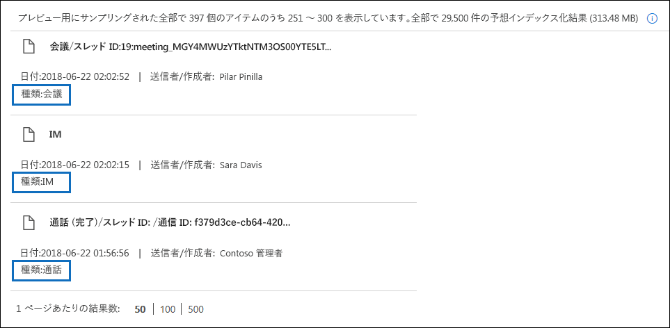

# <a name="content-search-in-office-365"></a>Office 365 のコンテンツ検索

Office 365 または Microsoft 365 のコンプライアンス センターのコンテンツ検索電子情報開示ツールを使用して、Office 365 組織の電子メール、文書、インスタント メッセージングの会話などのインプレース アイテムを検索できます。このツールを使用すると、以下の Office 365 サービス内のアイテムを検索できます。
  
- Exchange Online メールボックスとパブリック フォルダー
    
- SharePoint Online サイトと OneDrive for Business アカウント
    
- Skype for Business の会話
    
- Microsoft Teams 
    
- Office 365 グループ
    
コンテンツ検索を実行すると、コンテンツの場所の数と予想される検索結果の数が検索プロファイルに表示されます。検索クエリと一致するアイテムが最も多いコンテンツの場所など、統計情報をすばやく表示することもできます。検索を実行した後、結果をプレビューしたり、ローカルコンピューターにエクスポートしたりすることができます。

## <a name="create-a-search"></a>検索を作成する

検索を実行して検索結果をプレビューおよびエクスポートするために [**コンテンツ検索**] ページにアクセスするには、管理者、コンプライアンス責任者、または電子情報開示マネージャーが、セキュリティ/コンプライアンス センターの電子情報開示マネージャーの役割グループのメンバーである必要があります。詳細については、「[電子情報開示のアクセス許可を割り当てる](assign-ediscovery-permissions.md)」を参照してください。
  
1. [https://protection.office.com](https://protection.office.com) にアクセスし、Office 365 の電子メール アドレスとパスワードを使用してサインインします。
    
2. [**検索**] \> [**コンテンツ検索**] をクリックします。
    
3. **[検索]** ページで、 **新しい検索]** の横にある矢印をクリックします。 
    
    
  
    以下のいずれかのオプションを選択できます。
    
    - [**誘導検索**]: このオプションを選択すると、検索を作成するための手順を案内するウィザードが起動します。 コンテンツの場所を選択して検索クエリを作成するためのユーザー インターフェイスは、[**新しい検索**] オプションと同じです。 
    
    - [**新しい検索**]: 検索を作成するために更新されたユーザー インターフェイスが表示されます。 これは、[**新しい検索**] をクリックした場合の既定のオプションです。
    
    - [**ID のリストで検索**]: このオプションでは、Exchange ID のリストを使用して特定の電子メール メッセージやその他のメールボックス アイテムを検索できます。 ID リスト検索 (以前は対象指定検索と呼ばれていました) を作成するには、検索する特定のメールボックス アイテムを識別するコンマ区切り値 (CSV) ファイルを送信します。 手順については、「[Office 365 で ID リスト コンテンツ検索の CSV ファイルを準備する](csv-file-for-an-id-list-content-search.md)」を参照してください。
    
    この手順の残りの部分は、既定の新しい検索ワークフローに従います。
    
4. ドロップダウン リストで [**新しい検索**] をクリックします。 
    
5. [**検索クエリ**] で、次の項目を指定します。
    
    
  
   - **検索するキーワード**: [**キーワード**] ボックスに検索クエリを入力します。 キーワード、送信日や受信日などのメッセージ プロパティ、またはファイル名や文書の最終更新日などのドキュメント プロパティを指定できます。 **AND**、**OR**、**NOT**、**NEAR** などのブール演算子を使用するより複雑なクエリを使用できます。 また、ドキュメント内の機密情報 (社会保障番号など) を検索したり、外部共有されているドキュメントを検索したりできます。 このキーワード ボックスを空のままにすると、指定したコンテンツの場所にあるすべてのコンテンツが検索結果に入ります。
    
      また、[**キーワード リストの表示**] チェック ボックスをオンにして、各行にキーワードを入力することもできます。 この場合、作成される検索クエリでは、各行のキーワードは **OR** 演算子の機能に似た論理演算子 (**c:s**) によって接続されます。 
    
      キーワード リストを使用するのはなぜですか。各キーワードと一致するアイテム数を示す統計情報を取得することができます。これは、最も有効な (および最も有効でない) キーワードをすばやく識別するのに役立ちます。行で (かっこで囲まれた) キーワード フレーズを使用することもできます。検索統計の詳細については、「[コンテンツ検索結果のキーワード統計の表示](view-keyword-statistics-for-content-search.md)」を参照してください。

     > [!NOTE]
     > 大規模なキーワード リストによって生じる問題を軽減するため、キーワード リストの行は最大 20 行に設定されています。
    
    - [**条件**]: 検索クエリに条件を追加して、検索を絞り込み、さらに絞り込まれた結果のセットを返すようにできます。 各条件によって、作成された検索クエリに句が追加され、ユーザーが検索を開始するとそのクエリが実行されます。 条件は、 **AND** 演算子の機能に似た論理演算子 (**c:c**) によってキーワードのクエリ (キーワード ボックスで指定される) と論理的に接続されます。 つまり、検索結果に含まれるためには、アイテムはキーワード クエリと 1 つまたは複数の条件の両方を満たす必要があります。 このように、条件を使用して結果を絞り込むことができます。 検索クエリで使用できる条件のリストと説明については、「[コンテンツ検索のキーワード クエリと検索条件](keyword-queries-and-search-conditions.md#search-conditions)」の「検索条件」セクションを参照してください。
    
       - **場所**: 検索するコンテンツの場所を選択します。
    
      - [**すべての場所**]: 組織内のすべてのコンテンツの場所を検索するには、このオプションを選択します。 これには、すべての Exchange メールボックス (非アクティブなすべてのメールボックス、すべての Office 365 グループのメールボックス、すべての Microsoft Teams のメールボックスなど)、すべての Skype for Business の会話、すべての SharePoint および OneDrive for Business サイト (すべての Office 365 グループと Microsoft Teams のサイトなど) 内の電子メール、およびすべての Exchange パブリック フォルダー内のアイテムが含まれます。
    
      - [**特定の場所**]: 特定のコンテンツの場所を検索するには、このオプションを使用します。 特定の Office 365 サービスのすべてのコンテンツの場所を検索できます (すべての Exchange メールボックスを検索したり、すべての SharePoint サイトを検索したりするなど)。または、表示されている Office 365 サービスの特定の場所を検索することができます。 
    
        
  
         検索する Exchange メールボックスのリストに配布グループを追加することもできます。 配布グループの場合、グループ メンバーのメールボックスが検索されます。 動的配布グループはサポートされていません。
    
       > [!NOTE]
       > すべてのメールボックスを検索する場合も、特定のメールボックスだけを検索する場合も、コンテンツ検索の結果をエクスポートする際に、ユーザー メールボックスに保存されている他の Office 365 アプリケーションのデータが含まれます。 このデータは、予想される検索結果には含まれず、プレビューも行えません。 このデータは、検索結果をエクスポートおよびダウンロードする際には含まれます。 詳細については、「[Content stored in Exchange Online mailboxes (Exchange Online のメールボックスに格納されているコンテンツ)](what-is-stored-in-exo-mailbox.md)」を参照してください。

    
6. 検索クエリを設定したら、[**保存と実行**] をクリックします。
    
7. [**検索の保存**] ページで、検索の名前と、検索を識別するための説明 (省略可能) を入力します。検索の名前は、組織内で一意である必要があります。 
    
8. **[保存]** をクリックして検索を開始します。 
    
    検索を保存して実行すると、検索によって返された結果が結果ウィンドウに表示されます。プレビュー設定の構成方法によっては、検索結果が表示されるか、**[結果のプレビュー]** をクリックして表示する必要があります。詳細については、次のセクションを参照してください。 
    
このコンテンツ検索に再度アクセスするか、**コンテンツ検索**ページにリストされている他のコンテンツ検索にアクセスするには、検索を選択し、**[開く]** をクリックします。 
  
結果をクリアするか、新しい検索を作成するには、[] [**新しい検索**] をクリックします。 

  
## <a name="preview-search-results"></a>検索結果のプレビュー

検索結果のプレビューには、2 つの構成設定があります。新しい検索を実行するか、既存の検索を開いた後、[個々の結果] をクリックして、次のプレビュー設定を表示します。 
  

  
1. [**自動的に結果をプレビュー**]: この設定は、検索を実行した後に検索結果を表示します。
    
2. [**手動で結果をプレビュー**]: この設定を使用すると、[検索結果] ウィンドウにプレースホルダーが表示され、検索結果を表示するためにクリックする必要がある [**結果のプレビュー**] ボタンが表示されます。これは既定の設定で、既存の検索を開いたときに検索結果が自動的に表示されないため、検索のパフォーマンスが向上します。 
    
プレビューできるアイテムの数に関連する制限があります。 詳細については、「[検索の制限](limits-for-content-search.md)」を参照してください。 
  
プレビューできるサポートされているファイルの種類のリストについては、「コンテンツ検索に関する詳細情報」セクションの「[検索結果のプレビュー](#previewing-search-results)」を参照してください。プレビューがサポートされないファイルの種類の場合、またはドキュメントのコピーをダウンロードする場合は、**[元のファイルのダウンロード]** をクリックしてローカル コンピューターにダウンロードします。.aspx Web ページの場合、ページの URL が含まれていても、ページへのアクセス許可を持っていないことがあります。 
  
また、インデックスのないアイテムはプレビューできないことにも注意してください。
  
## <a name="view-information-and-statistics-about-a-search"></a>検索に関する情報と統計情報を表示する

コンテンツ検索を作成して実行した後は、予想される検索結果の統計情報を表示できます。 これには、検索結果の概要、アイテムが検索クエリと一致したコンテンツの場所の数などのクエリ統計情報、最も多くのアイテムが一致したコンテンツの場所の名前が含まれます。 1 つまたは複数のコンテンツ検索に対して統計情報を表示できます。 これにより、複数の検索の結果を簡単に比較して、検索クエリの有効性を判断できます。
  
また、検索の統計情報とキーワードの統計情報を CSV ファイルにダウンロードできます。これにより、Excel のフィルター機能や並べ替え機能を使用して結果を比較し、検索結果のレポートを準備できます。
  
検索の統計情報を表示するには
  
1. [**コンテンツ検索**] ページで [**開く**] をクリックし、統計情報を表示する対象の検索をクリックします。 
    
2. [ポップアップ] ページで、[**クエリを開く**] をクリックします。 
    
3. **[個々の結果]** ドロップダウン リストで、**[検索プロファイル]** をクリックします。
    
4. **[種類]** ドロップダウン リストで、表示する検索統計に応じて、次のいずれかのオプションをクリックします。 
    
  - [**概要**]; 検索したコンテンツの場所の種類ごとに統計情報を表示します。 統計情報には、検索クエリに一致したアイテムが含まれているコンテンツの場所の数と、検索結果のアイテムの合計数とサイズが含まれます。 これは、既定の設定です。
    
  - [**クエリ**]: 検索クエリに関する統計情報を表示します。 これには、クエリの統計情報が該当するコンテンツの場所の種類、統計情報が該当する検索クエリの一部 (**プライマリ**は検索クエリ全体を示します)、検索クエリと一致したアイテムが含まれるコンテンツの場所の数、および検索クエリに一致する (指定されたコンテンツの場所で) 検出されたアイテムの合計数とサイズが含まれます。 インデックスのないアイテム (*部分的にインデックスが作成されたアイテム*とも呼ばれます) の統計も表示されます。 ただし、統計情報には、メールボックスの部分的にインデックスが作成されたアイテムのみが含まれています。 SharePoint および OneDrive からの部分的にインデックスが作成されたアイテムは統計情報に含まれません。
    
  - [**上位の場所**]: 各コンテンツの場所で検索クエリに一致したアイテムの数に関する統計情報を表示します。 上位 1,000 の場所が表示されます。
    
検索統計の詳細については、「[コンテンツ検索結果のキーワード統計の表示](view-keyword-statistics-for-content-search.md)」を参照してください。
  
  
## <a name="export-search-results"></a>検索結果をエクスポートする

検索が正常に実行されると、検索結果をローカル コンピューターにエクスポートできます。 メールの結果をエクスポートする場合は、PST ファイルまたは個々のメッセージ (.msg ファイル) としてコンピューターにダウンロードできます。 SharePoint と OneDrive のサイトからコンテンツをエクスポートする場合は、ネイティブの Office ドキュメントがエクスポートされます。 エクスポートされた検索結果には、上記以外のドキュメントやレポートも含まれます。 実際のアイテムではなく、検索結果レポートをエクスポートすることもできます。
  
検索結果をエクスポートする方法。
  
1. [**コンテンツ検索**] ページで、検索結果をエクスポートする対象の検索をクリックします。 
    
2. ポップアップ ページで、 [**詳細**] をクリックしてから、[**結果のエクスポート**] をクリックします。 検索結果レポートをエクスポートすることもできます。
    
3. **[結果のエクスポート]** ポップアップ ページの各セクションに入力します。スクロール バーを使用して、すべてのエクスポート オプションを確認してください。 
    
詳細な手順とトラブルシューティングのヒントについては、以下を参照してください。
  
- [コンテンツ検索の結果をエクスポートする](export-search-results.md)
    
- [コンテンツ検索のレポートをエクスポートする](export-a-content-search-report.md)
    
  
## <a name="more-information-about-content-search"></a>コンテンツ検索に関する詳細情報

コンテンツ検索の詳細については、以下のセクションを参照してください。
  
[コンテンツ検索の制限](#content-search-limits)
  
[検索クエリの作成](#building-a-search-query)
  
[OneDrive アカウントの検索](#searching-onedrive-accounts)
  
[Microsoft Teams と Office 365 グループの検索](#searching-microsoft-teams-and-office-365-groups)
  
[非アクティブなメールボックスの検索](#searching-inactive-mailboxes)
  
[切断された、またはライセンスを解除されたメールボックスを検索する](#searching-disconnected-or-de-licensed-mailboxes)

[検索結果のプレビュー](#previewing-search-results)
  
[部分的にインデックスが作成されたアイテム](#partially-indexed-items)
  
### <a name="content-search-limits"></a>コンテンツ検索の制限

- コンテンツ検索機能に適用される制限については、「[コンテンツ検索の制限](limits-for-content-search.md)」を参照してください。
    
- すべての Office 365 組織が実行するコンテンツ検索について、Microsoft はパフォーマンス情報を収集しています。検索クエリが複雑になると、検索時間が長くなる可能性がありますが、検索時間が長くなる最も大きな要因は、検索するメールボックス数です。Microsoft は検索時間についてサービス レベル アグリーメントを提供していませんが、検索に含まれるメールボックス数に基づくコンテンツ検索の平均検索時間を次の表に示します。
    
|**メールボックスの数**|**検索平均時間**|
|:-----|:-----|
|100  <br/> |30 秒  <br/> |
|1,000  <br/> |45 秒  <br/> |
|10,000  <br/> |4 分  <br/> |
|25,000  <br/> |10 分  <br/> |
|50,000  <br/> |20 分  <br/> |
|100,000  <br/> |25 分  <br/> |
  
### <a name="building-a-search-query"></a>検索クエリの作成

検索クエリの作成、ブール検索演算子と検索条件の使用、組織外のユーザーと共有する機密情報の種類とコンテンツの検索の詳細については、「[コンテンツ検索のキーワード クエリと検索条件](keyword-queries-and-search-conditions.md)」を参照してください。
  
キーワード リストを使用して検索クエリを作成する場合は、次の点に注意してください。
  
- [**キーワード リストの表示**] チェック ボックスをオンにしてから、キーワードをそれぞれ別の行に入力し、各行のキーワード (またはキーワード フレーズ) が **OR** 演算子でつながれる検索クエリを作成する必要があります。 キーワード ボックスにキーワードのリストを貼り付けるか、キーワードを入力してから **Enter** キーを押すと、**OR** 演算子でつながれません。 キーワードのリストを追加する方法の正しくない例と正しい例を以下に示します。 
    
    **正しくない例**
    
    
  
    **正しい例**
    
    
  
- Excel ファイルまたはテキスト形式ファイルでキーワードまたはキーワード フレーズのリストを準備してから、キーワード リストに自分のリストをコピーして貼り付けることもできます。 これを行うには、[**キーワード リストの表示**] チェック ボックスをオンにする必要があります。 次に、キーワード リストの最初の行をクリックして、リストを貼り付けます。 Excel またはテキスト ファイルの行はそれぞれ、キーワード リストの別の行に貼り付けられます。 
    
- キーワード リストを使用してクエリを作成したら、検索クエリが意図したものであることを確認することをお勧めします。詳細ウィンドウの **[クエリ]** の下に表示される検索クエリでは、キーワードは **(c:s)** というテキストで区切られます。これは、キーワードが **OR** 演算子と機能的に同様の論理演算子で接続されていることを示します。同様に、検索クエリに条件が含まれている場合、キーワードと条件は **(c:c)** というテキストで区切られます。これは、キーワードが **AND** 演算子と機能的に同様の論理演算子で条件に接続されていることを示します。キーワード リストと条件を使用した場合の結果として (詳細ウィンドウに) 表示される検索クエリの例を以下に示します。 
    
    
  
- コンテンツ検索を実行すると、Office 365 はサポートされていない文字と、大文字にできないブール演算子を検索クエリで自動的にチェックします。 サポートされていない文字は非表示になっていることがよくあり、通常、検索エラーを発生させたり、意図しない結果を返したりする原因になります。 確認されているサポートされていない文字の詳細については、「[[コンテンツ検索] クエリでエラーを確認する](check-your-content-search-query-for-errors.md)」を参照してください。
    
- 英語以外の文字 (中国語の文字など) のキーワードを含む検索クエリがある場合は、[**クエリ言語-国/地域**] をクリックし、言語-国の文化コード値を選択して検索できます。 デフォルトの言語/地域はニュートラルです。 コンテンツ検索の言語設定を変更する必要があるかどうかをどのように確認できますか。 特定のコンテンツの場所に検索対象の英語以外の文字が含まれているにも関わらず検索で結果が返されない場合は、言語設定が原因である可能性があります。 
  
### <a name="searching-onedrive-accounts"></a>OneDrive アカウントの検索

- 組織内の OneDrive サイトの URL のリストを収集するには、「[Create a list of all OneDrive locations in your organization (組織内のすべてのOneDriveロケーションのリストを作成する)](https://support.office.com/article/8e200cb2-c768-49cb-88ec-53493e8ad80a)」を参照してください。 この記事内のスクリプトは、すべての OneDrive サイトのリストを含むテキスト ファイルを作成します。 このスクリプトを実行するには、SharePoint Online 管理シェルをインストールして使用する必要があります。 検索する各 OneDrive サイトに組織の個人用サイト ドメインの URL を必ず追加してください。 これは、すべての OneDrive を含むドメインです。例: `https://contoso-my.sharepoint.com` ユーザーの OneDrive サイトの URL の例は次のとおりです。`https://contoso-my.sharepoint.com/personal/sarad_contoso_onmicrosoft.com`
    
    ユーザーのプリンシパル名 (UPN) が変更される稀なケースにおいては、OneDrive の場所のURLが変更され、新しい UPN が組み込まれます。 このような場合は、ユーザーの新しい OneDrive の URL を追加し古い OneDrive の URL を削除して、コンテンツ検索を変更する必要があります。
  
### <a name="searching-microsoft-teams-and-office-365-groups"></a>Microsoft Teams と Office 365 グループの検索

Office 365 グループまたは Microsoft Teams に関連付けられているメールボックスを検索することもできます。 Microsoft Teams は Office 365 グループ上に構築されているため、それらの検索も同様です。 いずれの場合も、グループまたはチーム メールボックスのみが検索されます。 グループまたはチーム メンバーのメールボックスは検索されません。 検索するには、検索に明示的に追加する必要があります。
  
Microsoft Teams と Office 365 グループのコンテンツを検索する場合は、次の点に注意してください。
  
- Teams と Office 365 グループにあるコンテンツを検索するには、チームまたはグループに関連付けられているメールボックスと SharePoint サイトを指定する必要があります。
    
- チームまたは Office 365 グループのプロパティを表示するには、Exchange Online で **set-unifiedgroup** コマンドレットを実行します。 これは、チームまたはグループに関連付けられているサイトの URL を取得するのに適した方法です。 たとえば、次のコマンドは、上級管理職チームという名前の Office 365 グループの選択されたプロパティを表示します。 
    
  ```
  Get-UnifiedGroup "Senior Leadership Team" | FL DisplayName,Alias,PrimarySmtpAddress,SharePointSiteUrl
  DisplayName            : Senior Leadership Team
  Alias                  : seniorleadershipteam
  PrimarySmtpAddress     : seniorleadershipteam@contoso.onmicrosoft.com
  SharePointSiteUrl      : https://contoso.sharepoint.com/sites/seniorleadershipteam
  
  ```

    > [!NOTE]
    > **Get-UnifiedGroup** コマンドレットを実行するには、Exchange Online で View-Only Recipients という役割が割り当てられているか、View-Only Recipients という役割が割り当てられている役割グループに属している必要があります。 
  
- ユーザーのメールボックスを検索すると、ユーザーがメンバーとなっているチームまたは Office 365 グループは検索されません。 同様に、チームまたは Office 365 グループを検索するときは、指定したグループ メールボックスとグループ サイトのみが検索されます。 グループ メンバーのメールボックスと OneDrive for Business アカウントは、検索に明示的に追加しない限り検索されません。
    
- チームまたは Office 365 グループのメンバーの一覧を取得するには、Microsoft 365 管理センターの **[ホーム] \> [グループ]** ページでプロパティを表示できます。 または、Exchange Online PowerShell で次のコマンドを実行できます。 
    
  ```
  Get-UnifiedGroupLinks <group or team name> -LinkType Members | FL DisplayName,PrimarySmtpAddress 
  ```

    > [!NOTE]
    > **Get-UnifiedGroupLinks** コマンドレットを実行するには、Exchange Online で View-Only Recipients という役割が割り当てられているか、View-Only Recipients という役割が割り当てられている役割グループに属している必要があります。 
  
- Teams チャネルに含まれる会話は、チームに関連付けられているメールボックスに保存されます。 同様に、メンバーがチャネルで共有するファイルは、チームの SharePoint サイトに保存されます。 そのため、チャネルの会話やファイルを検索するには、チームのメールボックスと SharePoint サイトをコンテンツの場所として追加する必要があります。
    
- または、Teams のチャット リストに含まれる会話は、チャットに参加するユーザーの Exchange Online メールボックスに保存されます。 チャットの会話でユーザーが共有するファイルは、ファイルを共有するユーザーの OneDrive for Business アカウントに保存されます。 そのため、チャット リストの会話やファイルを検索するには、個々のユーザーのメールボックスと OneDrive for Business アカウントをコンテンツの場所として追加する必要があります。
    
    > [!NOTE]
    > Exchange ハイブリッド展開では、オンプレミスのメールボックスを持つユーザーは、Teams のチャット リストの一部である会話に参加する場合があります。 この場合も、これらの会話のコンテンツは、オンプレミスのメールボックスを持つユーザーのためにクラウドベースの記憶域 (*オンプレミス ユーザーのクラウドベースのメールボックス*と呼ばれます) に保存されるため、検索可能です。 詳細については、「[Office 365 でのオンプレミス ユーザーのクラウドベースのメールボックスの検索](search-cloud-based-mailboxes-for-on-premises-users.md)」を参照してください。
  
- 各 チームまたはチーム チャネルには、メモと共同作業用の Wiki が含まれています。 Wiki コンテンツは、.mht 形式のファイルに自動的に保存されます。 このファイルは、チームの SharePoint サイトの Teams Wiki データ ドキュメント ライブラリに保存されます。 検索するコンテンツの場所としてチームの SharePoint サイトを指定すると、コンテンツ検索ツールを使用して Wiki を検索することができます。 
    
    > [!NOTE]
    > (チームの SharePoint サイトを検索する際に) チームまたはチャネルについて Wiki を検索する機能は、2017 年 6 月 22 日にリリースされました。 その日付以降に保存または更新された Wiki ページは検索可能です。 その日付より前に保存または更新された Wiki ページは、検索できません。 
 
- Teams チャネルでの会議と通話の概要情報は、会議または通話にダイヤルしたユーザーのメールボックスにも保存されます。 つまり、コンテンツ検索を使用してこれらの概要レコードを検索することができます。 概要情報には次が含まれます。 
  
  - 会議または通話の日付、開始時刻、終了時刻、および継続時間

  - 各参加者の会議または通話の参加日時と退出日時

  - ボイスメールに送信された通話

  - 不在着信

  - 2 つの個別の通話として表される呼び出し転送

  会議と通話の概要レコードが検索できるようになるまで最大 8 時間かかる場合があります。

  検索結果では、会議の概要は "**種類**" フィールドで [**会議**] として識別されます。通話の概要は [**通話**] として識別されます。 また、Teams チャネルと 1xN チャットに含まれる会話は、"**種類**" フィールドで [**IM**] として識別されます。
  
  

- "**Kind**" 電子メール プロパティまたは "**メッセージの種類**" 検索条件を使用すると、Teams のコンテンツのみを検索できます。 
  
  - キーワード検索クエリの一部として **Kind** プロパティを使用するには、検索クエリの **[キーワード]** ボックスに `kind:microsoftteams` と入力します。

    ![[キーワード] ボックスで kind:microsoftteams を使用する](media/O365-ContentSearch-Teams-Keywords.png)
  
  - 検索条件を使用するには、**[メッセージの種類]** 条件を追加し、値 `microsoftteams` を使用します。 

    ![値 microsoftteams で [メッセージの種類] 条件を使用します。](media/O365-ContentSearch-Teams-MessageKindCondition.png)

条件は **AND** 演算子によってキーワード クエリに論理的に関連付けられます。 つまり、アイテムは検索結果として返されるためにキーワード クエリと検索条件の両方に一致する必要があります。 詳細については、「[コンテンツ検索のキーワード クエリと検索条件](keyword-queries-and-search-conditions.md#guidelines-for-using-conditions)」の "条件を使用するためのガイドライン" セクションを参照してください。
  
### <a name="searching-inactive-mailboxes"></a>非アクティブなメールボックスの検索

コンテンツ検索で非アクティブなメールボックスを検索できます。 組織内の非アクティブなメールボックスのリストを取得するには、Exchange Online PowerShell でコマンド `Get-Mailbox -InactiveMailboxOnly` を実行します。 または、セキュリティ/コンプライアンス センターの [**データガバナンス**] \> [**保持**] に移動して、[**詳細**]  \> [**非アクティブなメールボックス**] をクリックすることもできます。
  
非アクティブなメールボックスを検索するときの留意点を以下に示します。

- 既存のコンテンツ検索にユーザー メールボックスが含まれ、そのメールボックスが非アクティブになった場合、非アクティブになった後に検索を再実行すると、コンテンツ検索は非アクティブなメールボックスの検索を続行します。
    
- ユーザーが所有するアクティブなメールボックスと非アクティブなメールボックスの SMTP アドレスが同じ場合があります。 この場合、コンテンツ検索の場所として選択した特定のメールボックスのみが検索されます。 つまり、検索にユーザーのメールボックスを追加する場合に、アクティブなメールボックスと非アクティブなメールボックスの両方が検索されるとは限りません。 検索に明示的に追加したメールボックスのみが検索されます。
    
- Security＆Compliance Center PowerShell を使用してコンテンツ検索を作成し、非アクティブなメールボックスを検索できます。 これを行うには、ピリオド (.) を事前に追加する必要があります。 非アクティブなメールボックスのメール アドレスに。 たとえば次のコマンドは、メール アドレス pavelb@contoso.onmicrosoft.com を含む非アクティブなメールボックスを検索するコンテンツ検索を作成します。

   ``` 
   New-ComplianceSearch -name InactiveMailboxSearch -ExchangeLocation .pavelb@contoso.onmicrosoft.com -AllowNotFoundExchangeLocationsEnabled $true
   ```

- 同じ SMTP アドレスを持つアクティブなメールボックスと非アクティブなメールボックスを所有しないようにすることを強くお勧めします。 非アクティブなメールボックスに割り当てられている SMTP アドレスを再使用する必要がある場合は、非アクティブなメールボックスを復元するか、非アクティブなメールボックスのコンテンツをアクティブなメールボックス (またはアクティブなメールボックスのアーカイブ) に復元して、非アクティブなメールボックスを削除することをお勧めします。 詳細については、以下のいずれかのトピックを参照してください。
    
  - [Office 365 で非アクティブなメールボックスを回復する](recover-an-inactive-mailbox.md)
    
  - [Office 365 の非アクティブなメールボックスを復元する](restore-an-inactive-mailbox.md)
    
  - [Office 365 の非アクティブなメールボックスを削除する](delete-an-inactive-mailbox.md)

### <a name="searching-disconnected-or-de-licensed-mailboxes"></a>切断された、またはライセンスを解除されたメールボックスを検索する

Exchange Online ライセンス (または Office 365 ライセンス全体) が Office 365 または Azure Active Directory のユーザー アカウントから削除されると、ユーザーのメールボックスは*切断されたメールボックス*になります。 これは、このメールボックスがユーザー アカウントに関連付けられていないことを意味します。 切断されたメールボックスを検索すると、次のようになります。

- ライセンスがメールボックスから削除されている場合は、メールボックスを検索できなくなります。 

- 既存のコンテンツ検索にライセンスが削除されたメールボックスが含まれている場合は、コンテンツ検索を再実行すると切断されたメールボックスの検索結果が一切返されなくなります。

- 検索するための Exchange コンテンツの場所として、コンテンツ検索を作成して切断されたメールボックスを指定するのに **New-ComplianceSearch** コマンドレットを使用する場合は、コンテンツ検索からは切断されたメールボックスの検索結果が一切返されません。

検索できるように切断されたメールボックスにデータを保持する必要がある場合は、ライセンスを削除する前に、メールボックスに保留を適用する必要があります。 これによりデータが保持され、保留が削除されるまで、切断されたメールボックスを検索できます。 保留に関する詳細情報については、[Exchange Online メールボックスに適用されている保留の種類を特定する方法](identify-a-hold-on-an-exchange-online-mailbox.md)をご確認ください。

### <a name="previewing-search-results"></a>検索結果のプレビュー

サポートされているファイルの種類は、プレビュー ウィンドウでプレビューできます。 サポートされていないファイルの種類の場合は、ファイルのコピーをローカル コンピューターにダウンロードして表示する必要があります。 次のファイルの種類はサポートされており、検索結果ウィンドウでプレビューできます。
  
- .txt、.html、.mhtml
    
- .eml
    
- .doc、.docx、.docm
    
- .pptm、.pptx
    
- .pdf
    
また、次のファイル コンテナーの種類もサポートされています。 コンテナー内のファイルの一覧は、プレビュー ウィンドウで表示できます。
  
- .zip
    
- .gzip
    
### <a name="partially-indexed-items"></a>部分的にインデックスが作成されたアイテム

- 前述のとおり、予想される検索結果には、メールボックス内の部分的にインデックスが作成されたアイテムが含まれます。 SharePoint と OneDrive からの部分的にインデックスが作成されたアイテムは、予想される検索結果に含まれません。 
    
- (メッセージまたはドキュメントの他のプロパティが検索条件と一致するため) 部分的にインデックスが作成されたアイテムが検索クエリと一致する場合、そのアイテムはインデックスなしアイテムの推定数には含まれません。 部分的にインデックスが作成されたアイテムが検索条件によって除外された場合は、そのアイテムはインデックスなしアイテムの推定数には含まれません。 詳細については、「[Office 365 のコンテンツ検索で部分的にインデックスが作成されたアイテム](partially-indexed-items-in-content-search.md)」を参照してください。
