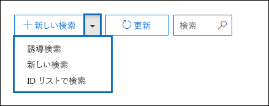
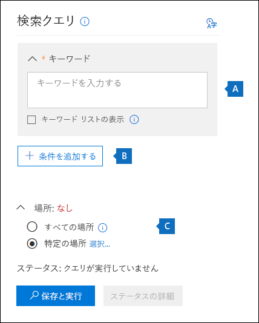
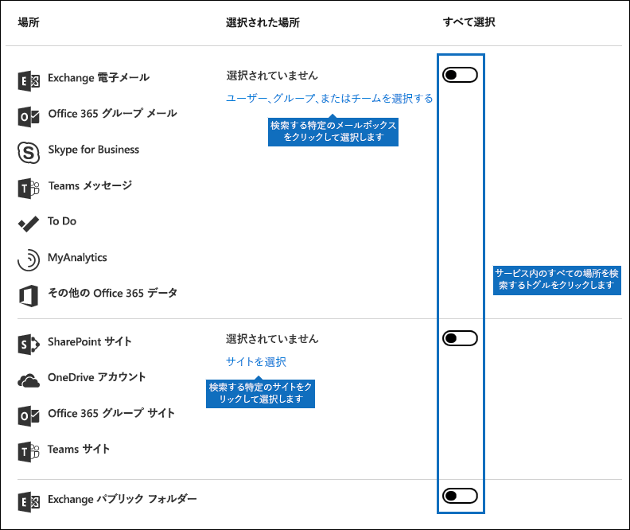
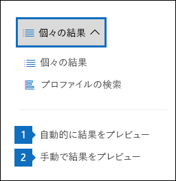
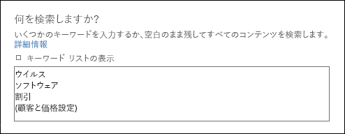
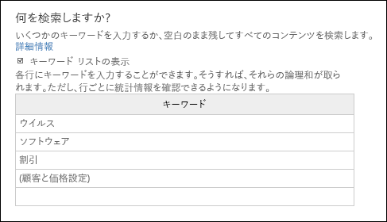

# <a name="content-search-in-office-365"></a>Office 365 のコンテンツ検索

Office 365 セキュリティ/コンプライアンス センターのコンテンツ検索電子情報開示ツールを使用して、Office 365 組織の電子メール、文書、インスタント メッセージングの会話などのインプレース アイテムを検索できます。このツールを使用して、これらの Office 365 サービス内のアイテムを検索します。
  
- Exchange Online メールボックスとパブリック フォルダー
    
- SharePoint Online サイトと OneDrive for Business アカウント
    
- Skype for Business の会話
    
- Microsoft Teams 
    
- Office 365 グループ
    
コンテンツ検索を実行すると、コンテンツの場所の数と予想される検索結果の数が検索プロファイルに表示されます。検索クエリと一致するアイテムが最も多いコンテンツの場所など、統計情報をすばやく表示することもできます。検索を実行した後、結果をプレビューしたり、ローカルコンピューターにエクスポートしたりすることができます。


## <a name="create-a-new-search"></a>新しい検索を作成する

検索を実行して検索結果をプレビューおよびエクスポートするために **[コンテンツ検索]** ページにアクセスするには、管理者、コンプライアンス責任者、または電子情報開示マネージャーが、セキュリティ/コンプライアンス センターの電子情報開示マネージャーの役割グループのメンバーである必要があります。詳細については、「[Office 365 セキュリティ/コンプライアンス センターで電子情報開示のアクセス許可を割り当てる](assign-ediscovery-permissions.md)」を参照してください。
  
1. [https://protection.office.com](https://protection.office.com) に移動します。
    
2. Office 365 の電子メール アドレスとパスワードを使用してサインインします。 
    
3. セキュリティ/コンプライアンス センターで、**[検索と調査]** \> **[コンテンツ検索]** をクリックします。
    
4. **[検索]** ページで、 **新しい検索]** の横にある矢印をクリックします。 
    
    
  
    以下のいずれかのオプションを選択できます。
    
  - **[ガイド付き検索]** - このオプションを選択すると、検索を作成するための手順が示されたウィザードが起動します。コンテンツの場所を選択して検索クエリを作成するためのユーザー インターフェイスは、**[新しい検索]** オプションと同じです。 
    
  - **[新しい検索]** - このオプションを選択すると、新しい検索を作成するために更新されたユーザー インターフェイスが表示されます。これは、**[新しい検索]** をクリックした場合の既定のオプションです。
    
  - **[ID リストによる検索]** - このオプションでは、Exchange ID のリストを使用して特定の電子メール メッセージやその他のメールボックス アイテムを検索できます。ID リスト検索 (正式には対象指定検索と呼ばれます) を作成するには、検索する特定のメールボックス アイテムを識別するコンマ区切り値 (CSV) ファイルを送信します。手順については、「[Office 365 で ID リスト コンテンツ検索の CSV ファイルを準備する](csv-file-for-an-id-list-content-search.md)」を参照してください。
    
    この手順の残りの部分は、既定の新しい検索ワークフローに従います。
    
5. ドロップダウン リストで **[新しい検索]** をクリックします。 
    
6. **[検索クエリ]** で、次の項目を指定します。
    
    
  
- **検索するキーワード** - **[キーワード]** ボックスに検索クエリを入力します。キーワード、メッセージ プロパティ (送信日時や受信日時など)、またはファイル名、ドキュメントが最後に変更された日付などのドキュメント プロパティを指定できます。**AND**、**OR**、**NOT**、**NEAR** などのブール演算子を使用するより複雑なクエリを使用することができます。また、ドキュメント内の機密情報 (社会保障番号など) を検索したり、外部で共有されているドキュメントを検索したりすることもできます。[キーワード] ボックスを空のままにすると、指定したコンテンツの場所にあるすべてのコンテンツが検索結果に含まれます。
    
    または、**[キーワード リストの表示]** チェックボックスをオンにして、各行にキーワードを入力することもできます。このようにすると、各行のキーワードは、作成された検索クエリの **OR** 演算子の機能に似た論理演算子 (**c:s**) によって接続されます。 
    
    キーワード リストを使用するのはなぜですか。各キーワードと一致するアイテム数を示す統計情報を取得することができます。これは、最も有効な (および最も有効でない) キーワードをすばやく識別するのに役立ちます。行で (かっこで囲まれた) キーワード フレーズを使用することもできます。検索統計の詳細については、「[コンテンツ検索結果のキーワード統計の表示](view-keyword-statistics-for-content-search.md)」を参照してください。

    [!NOTE] 大規模なキーワード リストによって生じる問題を軽減するため、キーワード リストの行は最大 20 行に設定されています。
    
- **条件** - 検索条件を追加して、検索結果を絞り込んだり、より洗練された結果セットを返すことができます。各条件は、検索を開始するときに作成され、実行される句を検索クエリに追加します。条件は、論理演算子 (**c:c**) によって論理的に (キーワード ボックスで指定された) キーワード クエリに関連付けられています。これは、**AND** 演算子と機能が似ています。つまり、アイテムは、キーワード クエリと、結果に含まれる 1 つ以上の条件を満たす必要があることを意味します。このようにすると、条件によって結果を絞り込むことができます。検索クエリで使用できる条件のリストと説明については、「[コンテンツ検索のキーワード クエリと検索条件](keyword-queries-and-search-conditions.md#search-conditions)」の「検索条件」セクションを参照してください。
    
- **場所** - 検索するコンテンツの場所を選択します。
    
  - **すべての場所** - 組織内のすべてのコンテンツの場所を検索するには、このオプションを使用します。これには、すべての Exchange メールボックス (非アクティブなすべてのメールボックス、すべての Office 365 グループのメールボックス、すべての Microsoft Teams のメールボックスなど)、すべての Skype for Business の会話、すべての SharePoint および OneDrive for Business サイト (すべての Office 365 グループと Microsoft Teams のサイトなど) 内の電子メール、およびすべての Exchange パブリック フォルダー内のアイテムが含まれます。
    
  - **特定の場所** - 特定のコンテンツの場所を検索するには、このオプションを使用します。特定の Office 365 サービスのすべてのコンテンツの場所を検索できます (すべての Exchange メールボックスを検索したり、すべての SharePoint サイトを検索したりするなど)。または、表示されている Office 365 サービスの特定の場所を検索することができます。 
    
    
  
    また、検索する Exchange メールボックスのリストに配布グループを追加することもできます。配布グループの場合、グループ メンバーのメールボックスが検索されます。動的配布グループはサポートされていないことに注意してください。
    
    **重要:** すべてのメールボックスの場所または特定のメールボックスだけを検索すると、コンテンツ検索の結果をエクスポートするときに、MyAnalytics と、ユーザーのメールボックスに保存されている他の Office 365 アプリケーションのデータが含まれます。このデータは、予想される検索結果には含まれません。また、プレビューでも使用できません。これは、検索結果をエクスポートおよびダウンロードするときにのみ含まれます。「コンテンツ検索に関する詳細情報」セクションの「[MyAnalytics およびその他の Office 365 アプリケーションからのデータのエクスポート](#exporting-data-from-myanalytics-and-other-office-365-applications)」を参照してください。 
    
7. 検索クエリを設定したら、**[保存と実行]** をクリックします。
    
8. **[検索の保存]** ページで、検索の名前と、検索を識別するために使用できる説明 (オプション) を入力します。検索の名前は、組織内で一意である必要があることに注意してください。 
    
9. **[保存]** をクリックして検索を開始します。 
    
    検索を保存して実行すると、検索によって返された結果が結果ウィンドウに表示されます。プレビュー設定の構成方法によっては、検索結果が表示されるか、**[結果のプレビュー]** をクリックして表示する必要があります。詳細については、次のセクションを参照してください。 
    
このコンテンツ検索に再度アクセスするか、**コンテンツ検索**ページにリストされている他のコンテンツ検索にアクセスするには、検索を選択し、**[開く]** をクリックします。 
  
結果をクリアするか、新しい検索を作成するには、 **新しい検索]** をクリックします。 

  
## <a name="preview-search-results"></a>検索結果のプレビュー

検索結果のプレビューには、2 つの構成設定があります。新しい検索を実行するか、既存の検索を開いた後、[個別の結果] をクリックして、次のプレビュー設定を表示します。 
  

  
1. **[結果を自動的にプレビューする]** - この設定は、検索を実行した後に検索結果を表示します。
    
2. **[結果を手動でプレビューする]** - この設定を使用すると、[検索結果] ウィンドウにプレースホルダーが表示され、検索結果を表示するためにクリックする必要がある **[結果のプレビュー]** ボタンが表示されます。これは既定の設定で、既存の検索を開いたときに検索結果が自動的に表示されないため、検索のパフォーマンスが向上します。 
    
プレビューできるアイテムの数に関連する制限があります。詳細については、「[Office 365 セキュリティ/コンプライアンス センターでの検索の制限](limits-for-content-search.md)」を参照してください。 
  
プレビューできるサポートされているファイルの種類のリストについては、「コンテンツ検索に関する詳細情報」セクションの「[検索結果のプレビュー](#previewing-search-results)」を参照してください。プレビューがサポートされないファイルの種類の場合、またはドキュメントのコピーをダウンロードする場合は、**[元のファイルのダウンロード]** をクリックしてローカル コンピューターにダウンロードします。.aspx Web ページの場合、ページの URL が含まれていても、ページへのアクセス許可を持っていないことがあります。 
  
また、インデックスのないアイテムはプレビューできないことにも注意してください。
  
## <a name="view-information-and-statistics-about-a-search"></a>検索に関する情報と統計情報を表示する

コンテンツ検索を作成して実行した後は、予想される検索結果の統計情報を表示できます。これには、検索結果の概要、アイテムが検索クエリと一致したコンテンツの場所の数などのクエリ統計情報、最も多くのアイテムが一致したコンテンツの場所の名前が含まれます。1 つまたは複数のコンテンツ検索に対して統計情報を表示できます。これにより、複数の検索の結果を簡単に比較して、検索クエリの有効性を判断できます。
  
また、検索の統計情報とキーワードの統計情報を CSV ファイルにダウンロードできます。これにより、Excel のフィルター機能や並べ替え機能を使用して結果を比較し、検索結果のレポートを準備できます。
  
検索の統計情報を表示するには
  
1. セキュリティ&amp;コンプライアンス センターの **[コンテンツ検索]** ページで、**[開く]** をクリックし、統計情報を表示する対象の検索をクリックします。 
    
2. [ポップアップ] ページで、**[クエリを開く]** をクリックします。 
    
3. **[個々の結果]** ドロップダウン リストで、**[検索プロファイル]** をクリックします。
    
4. **[種類]** ドロップダウン リストで、表示する検索統計に応じて、次のいずれかのオプションをクリックします。 
    
  - **[概要]** - 検索したコンテンツの場所の種類ごとに統計情報を表示します。ここには検索クエリに一致したアイテムが含まれているコンテンツの場所の数と、検索結果のアイテムの合計数とサイズが表示されます。これは既定の設定です。
    
  - **[クエリ]** - 検索クエリについての統計情報を表示します。これには、クエリの統計情報が適用されるコンテンツの場所の種類、統計情報を適用できる検索クエリの一部 (**プライマリ**は検索クエリ全体を示すことに注意してください)、検索クエリと一致したアイテムが含まれるコンテンツの場所の数、および検索クエリに一致する (指定されたコンテンツの場所で) 検出されたアイテムの合計数とサイズが含まれます。インデックスのないアイテム (部分的にインデックスが作成されたアイテムとも呼ばれます) の統計も表示されることに注意してください。ただし、統計情報には、メールボックスの部分的にインデックスが作成されたアイテムのみが含まれています。SharePoint および OneDrive からの部分的にインデックスが作成されたアイテムは統計情報に含まれません。
    
  - **[上位の場所]** - 検索された各コンテンツの場所で検索クエリに一致したアイテムの数に関する統計情報が表示されます。上位の 1,000 の場所が表示されます。
    
検索統計の詳細については、「[コンテンツ検索結果のキーワード統計の表示](view-keyword-statistics-for-content-search.md)」を参照してください。
  
  
## <a name="export-search-results"></a>検索結果をエクスポートする

検索が正常に実行されたら、検索結果をローカル コンピューターにエクスポートできます。電子メールの結果をエクスポートする場合は、PST ファイルとして、または個別のメッセージ (.msg ファイル) としてコンピューターにダウンロードされます。SharePoint および OneDrive のサイトからコンテンツをエクスポートする場合は、ネイティブの Office ドキュメントのコピーがエクスポートされます。また、エクスポートされた検索結果には追加のドキュメントとレポートも含まれています。実際のアイテムではなく、単に検索結果レポートをエクスポートすることもできます。
  
検索結果をエクスポートするには
  
1. セキュリティ/コンプライアンス センターの **[コンテンツ検索]** ページで、**[開く]** をクリックし、検索結果をエクスポートする対象の検索をクリックします。 
    
2. [ポップアップ] ページで、 **[詳細]**、**[結果のエクスポート]** の順にクリックします。検索結果レポートのエクスポートも可能です。
    
3. **[結果のエクスポート]** ポップアップ ページの各セクションに入力します。スクロール バーを使用して、すべてのエクスポート オプションを確認してください。 
    
詳細な手順とトラブルシューティングのヒントについては、以下を参照してください。
  
- [Office 365 セキュリティ/コンプライアンス センターから検索結果をエクスポートする](export-search-results.md)
    
- [コンテンツ検索のレポートをエクスポートする](export-a-content-search-report.md)
    

  
## <a name="more-information-about-content-search"></a>コンテンツ検索に関する詳細情報

コンテンツ検索の詳細については、以下のセクションを参照してください。
  
[コンテンツ検索の制限](#content-search-limits)
  
[検索クエリの作成](#building-a-search-query)
  
[OneDrive アカウントの検索](#searching-onedrive-accounts)
  
[Microsoft Teams と Office 365 グループの検索](#searching-microsoft-teams-and-office-365-groups)
  
[非アクティブなメールボックスの検索](#searching-inactive-mailboxes)
  
[検索結果のプレビュー](#previewing-search-results)
  
[部分的にインデックスが作成されたアイテム](#partially-indexed-items)
  
[MyAnalytics およびその他の Office 365 アプリケーションからのデータのエクスポート](#exporting-data-from-myanalytics-and-other-office-365-applications)
  
### <a name="content-search-limits"></a>コンテンツ検索の制限

- コンテンツ検索機能に適用される制限の説明については、「[Office 365 セキュリティ/コンプライアンス センターでの検索の制限](limits-for-content-search.md)」を参照してください。
    
- すべての Office 365 組織が実行するコンテンツ検索について、Microsoft はパフォーマンス情報を収集しています。検索クエリが複雑になると、検索時間が長くなる可能性がありますが、検索時間が長くなる最も大きな要因は、検索するメールボックス数です。Microsoft は検索時間についてサービス レベル アグリーメントを提供していませんが、検索に含まれるメールボックス数に基づくコンテンツ検索の平均検索時間を次の表に示します。
    
|**メールボックスの数**|**検索平均時間**|
|:-----|:-----|
|100  <br/> |30 秒  <br/> |
|1,000  <br/> |45 秒  <br/> |
|10,000  <br/> |4 分  <br/> |
|25,000  <br/> |10 分  <br/> |
|50,000  <br/> |20 分  <br/> |
|100,000  <br/> |25 分  <br/> |
  
### <a name="building-a-search-query"></a>検索クエリの作成

検索クエリの作成、ブール検索演算子と検索条件の使用、組織外のユーザーと共有する機密情報の種類とコンテンツの検索の詳細については、「[コンテンツ検索のキーワード クエリと検索条件](keyword-queries-and-search-conditions.md)」を参照してください。
  
キーワード リストを使用して検索クエリを作成する場合は、次の点に注意してください。
  
- **[キーワード リストの表示]** チェックボックスをオンにしてから、キーワードをそれぞれ別の行に入力し、各行のキーワード (またはキーワード フレーズ) が **OR** 演算子でつながれる検索クエリを作成する必要があります。単にキーワード ボックスにキーワードのリストを貼り付けるか、キーワードを入力してから **Enter** キーを押すと、**OR** 演算子でつながれません。キーワードのリストを追加する場合の正しくない例と正しい例を以下に示します。 
    
    **正しくない例**
    
    
  
    **正しい例**
    
    
  
- Excel ファイルまたはテキスト形式ファイルでキーワードまたはキーワード フレーズのリストを準備してから、キーワード リストに自分のリストをコピーして貼り付けることもできます。これを行うには、**[キーワード リストの表示]** チェックボックスをオンにする必要があります。次に、キーワード リストの最初の行をクリックして、リストを貼り付けます。Excel またはテキスト ファイルの行はそれぞれ、キーワード リストの別の行に貼り付けられます。 
    
- キーワード リストを使用してクエリを作成したら、検索クエリが意図したものであることを確認することをお勧めします。詳細ウィンドウの **[クエリ]** の下に表示される検索クエリでは、キーワードは **(c:s)** というテキストで区切られます。これは、キーワードが **OR** 演算子と機能的に同様の論理演算子で接続されていることを示します。同様に、検索クエリに条件が含まれている場合、キーワードと条件は **(c:c)** というテキストで区切られます。これは、キーワードが **AND** 演算子と機能的に同様の論理演算子で条件に接続されていることを示します。キーワード リストと条件を使用した場合の結果として (詳細ウィンドウに) 表示される検索クエリの例を以下に示します。 
    
    
  
- コンテンツ検索を実行すると、サポートされていない文字および大文字に変換されない可能性のあるブール演算子について、Office 365 によって検索クエリが自動的にチェックされます。サポートされていない文字は非表示になっていることがよくあり、通常、検索エラーを発生させたり、意図しない結果を返したりする原因になります。確認されているサポートされていない文字の詳細については、「[コンテンツ検索クエリでエラーを確認する](check-your-content-search-query-for-errors.md)」を参照してください。
    
- 英語以外の文字 (中国語の文字など) のキーワードが含まれている検索クエリがある場合は、![[クエリ検索] の**クエリ言語-国/地域アイコン **[クエリ言語-国/地域]](media/8d4b60c8-e1f1-40f9-88ae-ee2a7eca0886.png) をクリックし、検索対象の言語-国のカルチャ コード値を選択します。既定の言語/地域はニュートラルであることに注意してください。コンテンツ検索の言語設定を変更する必要があるかどうかを判断するには、どうすればよいのでしょうか。コンテンツの場所に検索対象の英語以外の文字が含まれていても検索結果が返されないことが確認された場合は、言語設定が原因である可能性があります。 
  
### <a name="searching-onedrive-accounts"></a>OneDrive アカウントの検索

- 組織内にある OneDrive サイトの URL リストの収集については、「[組織内にあるすべての OneDrive の場所のリストを作成する](https://support.office.com/article/8e200cb2-c768-49cb-88ec-53493e8ad80a)」を参照してください。この記事のこのスクリプトでは、すべての OneDrive サイトのリストを含むテキスト ファイルが作成されます。このスクリプトを実行するには、SharePoint Online 管理シェルをインストールして使用する必要があります。必ず、検索する各 OneDrive サイトに、組織の MySite ドメインの URL を追加してください。これは、すべての OneDrive を含むドメインです。たとえば、`https://contoso-my.sharepoint.com` のようになります。以下に、ユーザーの OneDrive サイトの URL 例を示します。`https://contoso-my.sharepoint.com/personal/sarad_contoso_onmicrosoft.com`。
    
    ユーザーのユーザー プリンパル名 (UPN) が変更されるまれなケースでは、その OneDrive の場所の URL も新しい UPN を組み込むために変更されます。このような場合は、ユーザーの新しい OneDrive URL を追加し、古いものを削除して、コンテンツ検索を変更する必要があります。
  
### <a name="searching-microsoft-teams-and-office-365-groups"></a>Microsoft Teams と Office 365 グループの検索

Office 365 グループまたは Microsoft チームに関連付けられているメールボックスを検索することができます。Microsoft Teams は Office 365 グループ上に構築されているため、検索方法がよく似ています。どちらの場合も、グループまたはチームのメールボックスのみが検索されます。グループ メンバーまたはチーム メンバーのメールボックスは検索されません。検索するには、検索に明示的に追加する必要があります。
  
Microsoft Teams と Office 365 グループのコンテンツを検索する場合は、次の点に注意してください。
  
- Microsoft Teams と Office 365 グループにあるコンテンツを検索するには、チームまたはグループに関連付けられているメールボックスと SharePoint サイトを指定する必要があります。
    
- Microsoft チームまたは Office 365 グループのプロパティを表示するには、Exchange Online で **Get-UnifiedGroup** コマンドレットを実行します。これは、チームまたはグループ関連付けられているサイトの URL を取得するのに適した方法です。たとえば、次のコマンドを実行すると、Senior Leadership Team という Office 365 グループの選択したプロパティが表示されます。 
    
  ```
  Get-UnifiedGroup "Senior Leadership Team" | FL DisplayName,Alias,PrimarySmtpAddress,SharePointSiteUrl
  DisplayName            : Senior Leadership Team
  Alias                  : seniorleadershipteam
  PrimarySmtpAddress     : seniorleadershipteam@contoso.onmicrosoft.com
  SharePointSiteUrl      : https://contoso.sharepoint.com/sites/seniorleadershipteam
  
  ```

    > [!NOTE]
    > **Get-UnifiedGroup** コマンドレットを実行するには、Exchange Online で View-Only Recipients という役割が割り当てられているか、View-Only Recipients という役割が割り当てられているロール グループに属している必要があります。 
  
- ユーザーのメールボックスを検索すると、ユーザーが属している Microsoft チームまたは Office 365 グループは検索されません。同様に、Microsoft チームまたは Office 365 グループを検索する場合は、指定したグループ メールボックスとグループ サイトのみが検索されます。検索に明示的に追加しない限り、グループ メンバーのメールボックスと OneDrive for Business アカウントは検索されません。
    
- Microsoft チームまたは Office 365 グループのメンバーのリストを取得する場合は、Office 365 管理センターの **[ホーム] \> [グループ]** ページでプロパティを表示できます。または、Exchange Online PowerShell で次のコマンドを実行できます。 
    
  ```
  Get-UnifiedGroupLinks <group or team name> -LinkType Members | FL DisplayName,PrimarySmtpAddress 
  ```

    > [!NOTE]
    > **Get-UnifiedGroupLinks** コマンドレットを実行するには、Exchange Online で View-Only Recipients という役割が割り当てられているか、View-Only Recipients という役割が割り当てられているロール グループに属している必要があります。 
  
- Microsoft Teams チャネルに含まれる会話は、Microsoft チームに関連付けられているメールボックスに保存されます。同様に、チャネルでチーム メンバーが共有するファイルはチームの SharePoint サイトに保存されます。そのため、チャネル内の会話とファイルを検索するには、コンテンツの場所として Microsoft チーム メールボックスと SharePoint サイトを追加する必要があります。
    
- または、Microsoft Teams のチャット リストに含まれる会話はチャットに参加したユーザーの Exchange Online メールボックスに保存されます。チャットの会話でユーザーが共有するファイルは、ファイルを共有するユーザーの OneDrive for Business アカウントに保存されます。そのため、チャット リストの会話やファイルを検索するには、コンテンツの場所として個々のユーザーのメールボックスと OneDrive for Business アカウントを追加する必要があります。
    
    > [!NOTE]
    > Exchange ハイブリッド展開では、オンプレミスのメールボックスを使用しているユーザーは、Microsoft Teams のチャットリストに含まれる会話に参加できます。この場合、これらの会話のコンテンツは、オンプレミスのメールボックスを持つユーザーのためにクラウドベースの記憶域 (*オンプレミス ユーザーのクラウドベースのメールボックス*と呼ばれます) に保存されるため、検索することもできます。詳細については、「[Office 365 でのオンプレミス ユーザーのクラウドベースのメールボックスの検索](search-cloud-based-mailboxes-for-on-premises-users.md)」を参照してください。
  
- 各 Microsoft チームまたはチーム チャネルには、メモと共同作業用の Wiki が含まれています。Wiki コンテンツは、.mht 形式のファイルに自動的に保存されます。このファイルは、チームの SharePoint サイトの Teams Wiki データ ドキュメント ライブラリに保存されます。検索するコンテンツの場所としてチームの SharePoint サイトを指定すると、コンテンツ検索ツールを使用して Wiki を検索することができます。 
    
    > [!NOTE]
    > Wiki で Microsoft チームまたはチャネル (チームの SharePoint サイトを検索する場合) を検索する機能は、2017 年 6 月 22 日にリリースされました。その日付以降に保存または更新された Wiki ページは検索できるようになります。その日付より前に保存または更新された Wiki ページは、検索には使用できません。 
 
- Microsoft Teams チャネルでの会議と通話の概要情報は、会議または通話にダイヤルしたユーザーのメールボックスにも保存されます。つまり、コンテンツ検索を使用してこれらの概要レコードを検索することができます。概要情報は次のとおりです。 
  - 会議または通話の日付、開始時刻、終了時刻、および継続時間

  - 各参加者の会議または通話の参加日時と退出日時

  - ボイスメールに送信された通話

  - 不在着信

  - 2 つの個別の通話として表される呼び出し転送

  会議と通話の概要レコードが検索できるようになるまで最大 8 時間かかる場合がありますので、ご注意ください。

  検索結果では、会議の概要は **[種類]** フィールドで **[会議]** として識別されます。通話の概要は **[通話]** として識別されます。また、Teams チャネルと 1xN チャットに含まれる会話は、**[種類]** フィールドで **IM** として識別されます。
  
  ![Teams の会議、通話および 1xN チャットは [種類] フィールドで識別されます。](media/O365-ContentSearch-Teams-MessageKind.png)

- **Kind** 電子メール プロパティまたは **[メッセージの種類]** 検索条件を使用して、Microsoft Teams のコンテンツを具体的に検索することができます。 
  - キーワード検索クエリの一部として **Kind** プロパティを使用するには、検索クエリの **[キーワード]** ボックスに `kind:microsoftteams` と入力します。

    ![[キーワード] ボックスで kind:microsoftteams を使用する](media/O365-ContentSearch-Teams-Keywords.png)
  
  - 検索条件を使用するには、**[メッセージの種類]** 条件を追加し、値 `microsoftteams` を使用します。 

    ![値 microsoftteams で [メッセージの種類] 条件を使用します。](media/O365-ContentSearch-Teams-MessageKindCondition.png)

条件が **AND** 演算子によってキーワード クエリに論理的に接続されていることに注意してください。つまり、アイテムは検索結果で返されるキーワード クエリと検索条件の両方に一致する必要があります。詳細については、「[コンテンツ検索のキーワード クエリと検索条件](keyword-queries-and-search-conditions.md#guidelines-for-using-conditions)」の「条件を使用するためのガイドライン」セクションを参照してください。

  
### <a name="searching-inactive-mailboxes"></a>非アクティブなメールボックスの検索

コンテンツ検索で非アクティブなメールボックスを検索できます。組織内の非アクティブなメールボックスのリストを取得するには、Exchange Online PowerShell でコマンド `Get-Mailbox -InactiveMailboxOnly` を実行します。または、セキュリティ/コンプライアンス センターの **[データガバナンス]** \> **[保持]** に移動して、**[詳細]**  \> **[非アクティブなメールボックス]** をクリックすることもできます。
  
次に示しているのは、非アクティブなメールボックスを検索するときの留意点です。
  
- コンテンツ検索にユーザー メールボックスを含めた後に、そのメールボックスが非アクティブになった場合、非アクティブになってから検索を再実行すると、コンテンツ検索は非アクティブなメールボックスの検索を続行します。
    
- 場合によっては、ユーザーは同じ SMTP アドレスを持つアクティブなメールボックスおよび非アクティブなメールボックスを所有している可能性があります。この場合、コンテンツ検索の場所として選択した特定のメールボックスのみが検索されます。つまり、検索にユーザーのメールボックスを追加する場合に、アクティブなメールボックスと非アクティブなメールボックスの両方が検索されることは想定できません。検索に明示的に追加したメールボックスのみが検索されます。
    
- 同じ SMTP アドレスを持つアクティブなメールボックスと非アクティブなメールボックスを所有しないようにすることを強くお勧めします。非アクティブなメールボックスに現在割り当てられている SMTP アドレスを再使用する場合は、非アクティブなメールボックスを復元するか、非アクティブなメールボックスのコンテンツをアクティブなメールボックス (またはアクティブなメールボックスのアーカイブ) に復元して、非アクティブなメールボックスを削除することをお勧めします。詳細については、以下のいずれかのトピックを参照してください。
    
  - [Office 365 で非アクティブなメールボックスを回復する](recover-an-inactive-mailbox.md)
    
  - [Office 365 の非アクティブなメールボックスを復元する](restore-an-inactive-mailbox.md)
    
  - [Office 365 の非アクティブなメールボックスを削除する](delete-an-inactive-mailbox.md)

  
### <a name="previewing-search-results"></a>検索結果のプレビュー

プレビュー ウィンドウでは、サポートされるファイルの種類をプレビューできます。サポートされていないファイルの種類の場合は、ファイルのコピーをローカル コンピューターにダウンロードして表示する必要があります。次のファイルの種類はサポートされており、[検索結果] ウィンドウでプレビューできます。
  
- .txt、.html、.mhtml
    
- .eml
    
- .doc、.docx、.docm
    
- .pptm、.pptx
    
- .pdf
    
また、次のファイル コンテナーの種類もサポートされています。プレビュー ウィンドウでは、コンテナー内のファイルの一覧を表示できます。
  
- .zip
    
- .gzip
    
### <a name="partially-indexed-items"></a>部分的にインデックスが作成されたアイテム

- 前述のように、メールボックス内の一部のインデックス付きアイテムは、予想される検索結果に含まれます。SharePoint および OneDrive のサイトからの部分的にインデックスが作成されたアイテムは、予想される検索結果には含まれません。 
    
- 部分的にインデックスが作成されたアイテムが検索クエリに一致していても (他のメッセージまたはドキュメントのプロパティが検索条件を満たしているため)、インデックスがないアイテムの推定数には含まれません。部分的にインデックスが作成されたアイテムが検索条件によって除外されている場合は、部分的にインデックスが作成されたアイテムの推定数にも含まれません。詳細については、「[Office 365 のコンテンツ検索で部分的にインデックスが作成されたアイテム](partially-indexed-items-in-content-search.md)」を参照してください。
    
### <a name="exporting-data-from-myanalytics-and-other-office-365-applications"></a>MyAnalytics およびその他の Office 365 アプリケーションからのデータのエクスポート

- MyAnalytics からのデータ (メールボックス内のメールおよび予定表のデータに基づくユーザーの時間の使用方法に関する洞察など)、および他の Office 365 アプリケーションからのデータは、ユーザーのクラウドベースのメールボックスにある (IPM 以外のサブツリー内の) 非表示の場所に保存されます。コンテンツ検索を実行した後は、このデータは予想される検索結果、クエリ統計情報には含まれず、プレビューでは使用できません。ただし、このデータは検索結果をエクスポートするときにエクスポートされます。
    
- MyAnalytics データと他の Office 365 アプリケーションからのデータは、"その他の Office 365 データ" という名前のフォルダーにエクスポートされます。このフォルダーには、各ユーザーのサブフォルダーが含まれています。
  
