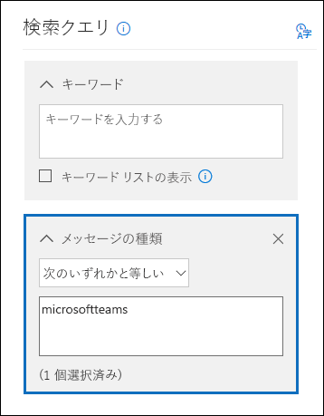

# <a name="content-search-in-office-365"></a>Office 365 でのコンテンツ検索

office 365 セキュリティ&amp;コンプライアンスセンターのコンテンツ検索電子情報開示ツールを使用して、office 365 組織の電子メール、ドキュメント、インスタントメッセージの会話など、インプレースアイテムを検索することができます。このツールを使用して、これらの Office 365 サービスのアイテムを検索します。
  
- Exchange Online メールボックスとパブリックフォルダー
    
- SharePoint Online サイトと OneDrive for business アカウント
    
- Skype for business の会話
    
- Microsoft Teams 
    
- Office 365 グループ
    
コンテンツ検索を実行すると、コンテンツの場所の数と予想される検索結果の数が検索プロファイルに表示されます。検索クエリと一致するアイテムが最も多いコンテンツの場所など、統計情報をすばやく表示することもできます。検索を実行した後、結果をプレビューしたり、ローカルコンピューターにエクスポートしたりすることができます。


## <a name="create-a-new-search"></a>新しい検索を作成する

検索を実行して検索結果をプレビューおよびエクスポートするために**コンテンツ検索**ページにアクセスするには、管理者、コンプライアンス責任者、または電子情報開示マネージャーが、セキュリティ&amp;コンプライアンスセンターの電子情報開示マネージャーの役割グループのメンバーである必要があります。詳細については、「 [Office 365 セキュリティ&amp;コンプライアンスセンターで電子情報開示のアクセス許可を割り当てる](assign-ediscovery-permissions.md)」を参照してください。
  
1. [https://protection.office.com](https://protection.office.com) に移動します。
    
2. Office 365 メールアドレスとパスワードを使用してサインインします。 
    
3. セキュリティ&amp; /コンプライアンスセンターで、[**検索&amp;調査** \> **コンテンツ検索**] をクリックします。
    
4. [**検索**] ページで、[追加] アイコン **新しい検索**] の横にある矢印をクリックします。 
    
    
  
    以下のいずれかのオプションを選択できます。
    
  - [**ガイド付き検索**]-このオプションを選択すると、検索を作成するための手順が示されたウィザードが起動します。コンテンツの場所を選択して検索クエリを作成するためのユーザーインターフェイスは、**新しい検索**オプションと同じです。 
    
  - [**新しい検索**]-新しい検索を作成するために更新されたユーザーインターフェイスが表示されます。これは、[**新しい検索**] をクリックした場合の既定のオプションです。
    
  - **ID リストによる検索**-このオプションでは、Exchange id のリストを使用して特定の電子メールメッセージやその他のメールボックスアイテムを検索できます。ID リスト検索 (正式には対象化検索と呼ばれていました) を作成するには、検索する特定のメールボックスアイテムを識別するコンマ区切り値 (CSV) ファイルを送信します。手順については、「 [Office 365 で ID リストコンテンツ検索の CSV ファイルを準備する](csv-file-for-an-id-list-content-search.md)」を参照してください。
    
    この手順の残りの手順は、既定の新しい検索ワークフローに従います。
    
5. ドロップダウンリストで [**新しい検索**] をクリックします。 
    
6. [**検索クエリ**] で、次の項目を指定します。
    
    
  
- **検索するキーワード**-[**キーワード**] ボックスに検索クエリを入力します。キーワード、メッセージプロパティ (送信日時や受信日時など)、またはファイル名、ドキュメントが最後に変更された日付などのドキュメントプロパティを指定できます。**and**、 **OR**、 **NOT**、 **NEAR**などのブール演算子を使用するより複雑なクエリを使用することができます。また、ドキュメント内の機密情報 (社会保障番号など) を検索したり、外部で共有されているドキュメントを検索したりすることもできます。[キーワード] ボックスを空のままにすると、指定したコンテンツの場所にあるすべてのコンテンツが検索結果に含まれます。
    
    または、[**キーワードリストを表示**する] チェックボックスをオンにして、各行にキーワードを入力することもできます。このようにすると、各行のキーワードは、作成された検索クエリの**or**演算子の機能に似た論理演算子 ( **c:s**) によって接続されます。 
    
    キーワードリストを使用する理由各キーワードに一致するアイテムの数を示す統計情報を取得することができます。これにより、どのキーワードが最もよく (かつ最も少ない) 有効であるかをすばやく識別することができます。また、行内のキーワード句 (かっこで囲む) を使用することもできます。検索統計の詳細については、「[コンテンツ検索結果のキーワード統計情報を表示](view-keyword-statistics-for-content-search.md)する」を参照してください。

    [!NOTE] 大きなキーワードリストによって発生する問題を減らすために、キーワード一覧では最大20行に制限されています。
    
- **条件**-検索条件を追加して、検索結果を絞り込んだり、より洗練された結果セットを返すことができます。各条件は、検索を開始するときに作成され、実行される句を検索クエリに追加します。条件は、論理演算子 ( **c:c**) によって論理的に (キーワードボックスで指定された) キーワードクエリに関連付けられています。これは、 **and 演算子と**機能が似ています。つまり、アイテムは、キーワードクエリと、結果に含まれる1つ以上の条件を満たす必要があることを意味します。このようにすると、条件によって結果を絞り込むことができます。検索クエリで使用できる条件の一覧と説明については、「[コンテンツ検索のキーワードクエリと検索条件](keyword-queries-and-search-conditions.md#search-conditions)」の「検索条件」セクションを参照してください。
    
- **場所**-検索するコンテンツの場所を選択します。
    
  - [**すべての場所**] 組織内のすべてのコンテンツの場所を検索するには、このオプションを使用します。これには、すべての Exchange メールボックス (非アクティブなすべてのメールボックス、すべての Office 365 グループのメールボックス、すべての Microsoft Teams のメールボックスなど)、すべての Skype for business の会話、すべての SharePoint および OneDrive for business サイト (サイトを含む) などのメールが含まれます。すべての Office 365 グループと Microsoft Teams)、およびすべての Exchange パブリックフォルダー内のアイテム。
    
  - **特定の場所**-特定のコンテンツの場所を検索するには、このオプションを使用します。特定の office 365 サービスのすべてのコンテンツの場所を検索できます (すべての Exchange メールボックスを検索したり、すべての SharePoint サイトを検索したりするなど)。または、表示されている office 365 サービスの特定の場所を検索することができます。 
    
    
  
    また、検索する Exchange メールボックスの一覧に配布グループを追加することもできます。配布グループの場合、グループメンバーのメールボックスが検索されます。動的配布グループはサポートされていないことに注意してください。
    
    **重要:** すべてのメールボックスの場所または特定のメールボックスだけを検索すると、コンテンツ検索の結果をエクスポートするときに、myanalytics と、ユーザーのメールボックスに保存されている他の Office 365 アプリケーションのデータが含まれます。このデータは、推定検索結果には含まれません。プレビューでは使用できません。これは、検索結果をエクスポートおよびダウンロードするときにのみ含まれます。「コンテンツ検索に関する詳細情報」の「 [myanalytics およびその他の Office 365 アプリケーションからのデータのエクスポート](#exporting-data-from-myanalytics-and-other-office-365-applications)」を参照してください。 
    
7. 検索クエリを設定したら、[ **Save &amp; run**] をクリックします。
    
8. [**検索の保存**] ページで、検索の名前と、検索を識別するために使用できる説明 (オプション) を入力します。検索の名前は、組織内で一意である必要があることに注意してください。 
    
9. [**保存**] をクリックして検索を開始します。 
    
    検索を保存して実行すると、検索によって返された結果が結果ウィンドウに表示されます。プレビュー設定の構成方法によっては、検索結果が表示されるか、[**結果のプレビュー** ] をクリックして表示する必要があります。詳細については、次のセクションを参照してください。 
    
このコンテンツ検索に再度アクセスするか、**コンテンツ検索**ページにリストされている他のコンテンツ検索にアクセスするには、検索を選択し、[**開く**] をクリックします。 
  
結果をクリアするか、新しい検索を作成する 、[追加] アイコン [**新しい検索**] をクリックします。 

  
## <a name="preview-search-results"></a>検索結果のプレビュー

検索結果をプレビューするには、2つの構成設定を行います。新しい検索を実行するか、既存の検索を開いた後、* * 個別の結果 * * をクリックして、次のプレビュー設定を表示します。 
  

  
1. [**結果を自動的にプレビュー**する]-この設定は、検索を実行した後に検索結果を表示します。
    
2. [**結果を手動でプレビュー**する]-この設定を使用すると、[検索結果] ウィンドウにプレースホルダーが表示され、検索結果を表示するためにクリックする必要がある [結果の**プレビュー** ] ボタンが表示されます。これは既定の設定です。既存の検索を開いたときに検索結果が自動的に表示されないため、検索のパフォーマンスが向上します。 
    
プレビューできるアイテムの数に関連する制限があります。詳細については、「 [Office 365 セキュリティ&amp;コンプライアンスセンターでの検索の制限](limits-for-content-search.md)」を参照してください。 
  
プレビューできるサポートされているファイルの種類の一覧については、「コンテンツ検索に関する詳細情報」の「[検索結果のプレビュー](#previewing-search-results) 」を参照してください。ファイルの種類がプレビューでサポートされていない場合や、ドキュメントのコピーをダウンロードする場合は、[**元のファイルをダウンロード**] をクリックして、ローカルコンピューターにダウンロードします。.aspx Web ページの場合は、ページの URL が含まれますが、ページにアクセスするアクセス許可を持っていない可能性があります。 
  
また、インデックスを持たないアイテムはプレビューできないことにも注意してください。
  
## <a name="view-information-and-statistics-about-a-search"></a>検索に関する情報と統計情報を表示する

コンテンツ検索を作成して実行すると、予想される検索結果に関する統計情報を表示できます。これには、検索結果の概要、検索クエリと一致するアイテムが含まれるコンテンツの場所の数、最も一致するアイテムを含むコンテンツの場所の名前などが含まれます。1つまたは複数のコンテンツ検索の統計を表示できます。これにより、複数の検索の結果をすばやく比較し、検索クエリの有効性を判断することができます。
  
また、検索の統計情報とキーワードの統計情報を CSV ファイルにダウンロードできます。これにより、Excel のフィルター機能や並べ替え機能を使用して結果を比較し、検索結果のレポートを準備できます。
  
検索の統計情報を表示するには
  
1. セキュリティ&amp; /コンプライアンスセンターの [**コンテンツ検索**] ページで、[**開く**] をクリックし、統計情報を表示する検索をクリックします。 
    
2. [フライアウト] ページで、[**クエリを開く**] をクリックします。 
    
3. [**個々の結果**] ドロップダウンリストで、[**検索プロファイル**] をクリックします。
    
4. [**種類**] ドロップダウンリストで、表示する検索統計に応じて、次のいずれかのオプションをクリックします。 
    
  - **Summary** -検索したコンテンツの場所の種類ごとに統計情報を表示します。このコンテンツには、検索クエリに一致したアイテムが含まれているコンテンツの場所の数と、検索結果のアイテムの合計数とサイズが表示されます。これは既定の設定です。
    
  - **クエリ**-検索クエリについての統計を表示します。これには、クエリの統計が適用されるコンテンツの場所の種類、統計を適用できる検索クエリの一部 (**プライマリ**は検索クエリ全体を示すことに注意してください)、アイテムが含まれるコンテンツの場所の数が含まれます。検索クエリと一致し、検索クエリに一致する合計数とサイズ、および検出されたアイテムの総数 (指定されたコンテンツの場所)。インデックスが設定されていないアイテム (部分的にインデックスが付いているアイテム) の統計も表示されることに注意してください。ただし、統計情報には、メールボックスの一部のインデックス付きアイテムのみが含まれています。SharePoint および OneDrive からの部分的にインデックスが作成されたアイテムは統計に含まれません。
    
  - [**上位の場所**-検索された各コンテンツの場所の検索クエリと一致するアイテムの数に関する統計を表示します。上位の1000の場所が表示されます。
    
検索統計の詳細については、「[コンテンツ検索結果のキーワード統計](view-keyword-statistics-for-content-search.md)情報を表示する」を参照してください。
  
  
## <a name="export-search-results"></a>検索結果をエクスポートする

検索が正常に実行されたら、検索結果をローカルコンピューターにエクスポートできます。電子メールの結果をエクスポートする場合は、PST ファイルとして、または個別のメッセージ (.msg ファイル) としてコンピューターにダウンロードできます。SharePoint および OneDrive サイトからコンテンツをエクスポートすると、ネイティブの Office ドキュメントのコピーがエクスポートされます。エクスポートされた検索結果には、追加のドキュメントとレポートも含まれています。実際のアイテムではなく、検索結果レポートをエクスポートするだけでもかまいません。
  
検索結果をエクスポートするには
  
1. セキュリティ&amp; /コンプライアンスセンターの [**コンテンツ検索**] ページで、[**開く**] をクリックし、検索結果をエクスポートする検索をクリックします。 
    
2. [フライアウト] ページで、  **** のエクスポート] をクリックし、[**結果のエクスポート**] をクリックします。なお、検索結果レポートをエクスポートすることもできます。
    
3. **[結果のエクスポート]** ポップアップ ページの各セクションに入力します。スクロール バーを使用して、すべてのエクスポート オプションを確認してください。 
    
詳細な手順とトラブルシューティングのヒントについては、以下を参照してください。
  
- [Office 365 セキュリティ&amp;コンプライアンスセンターから検索結果をエクスポートする](export-search-results.md)
    
- [コンテンツ検索のレポートをエクスポートする](export-a-content-search-report.md)
    

  
## <a name="more-information-about-content-search"></a>コンテンツ検索の詳細情報

コンテンツ検索の詳細については、以下のセクションを参照してください。
  
[コンテンツ検索の制限](#content-search-limits)
  
[検索クエリを作成する](#building-a-search-query)
  
[OneDrive アカウントの検索](#searching-onedrive-accounts)
  
[Microsoft Teams と Office 365 グループの検索](#searching-microsoft-teams-and-office-365-groups)
  
[非アクティブなメールボックスの検索](#searching-inactive-mailboxes)
  
[検索結果のプレビュー](#previewing-search-results)
  
[部分的にインデックスが作成されたアイテム](#partially-indexed-items)
  
[myanalytics およびその他の Office 365 アプリケーションからのデータのエクスポート](#exporting-data-from-myanalytics-and-other-office-365-applications)
  
### <a name="content-search-limits"></a>コンテンツ検索の制限

- コンテンツ検索機能に適用される制限の説明については、「 [Office 365 セキュリティ&amp;コンプライアンスセンターでの検索の制限](limits-for-content-search.md)」を参照してください。
    
- Microsoft は、すべての Office 365 組織で実行されるコンテンツ検索のパフォーマンス情報を収集します。検索クエリの複雑さは検索時間に影響する場合がありますが、検索時間に影響を与える最大要因は、検索するメールボックスの数です。Microsoft は検索時間のサービスレベル契約を提供していませんが、次の表に、検索に含まれるメールボックスの数に基づいて、コンテンツ検索の平均検索時間を示します。
    
|**メールボックスの数**|**平均検索時間**|
|:-----|:-----|
|100  <br/> |30 秒  <br/> |
|1,000  <br/> |45秒  <br/> |
|10,000  <br/> |4 分  <br/> |
|25000  <br/> |10 分  <br/> |
|5万  <br/> |20 分  <br/> |
|100,000  <br/> |25 分  <br/> |
  
### <a name="building-a-search-query"></a>検索クエリを作成する

検索クエリの作成、ブール検索演算子と検索条件の使用、組織外のユーザーと共有する機密情報の種類とコンテンツの検索の詳細については、「[キーワードクエリと検索条件」を参照してください。コンテンツ検索の場合](keyword-queries-and-search-conditions.md)。
  
キーワードリストを使用して検索クエリを作成する場合は、次の点に注意してください。
  
- [**キーワードリストを表示**する] チェックボックスをオンにしてから、それぞれの行に各キーワードを入力して検索クエリを作成し、各行のキーワード (またはキーワードフレーズ) が**or**演算子で接続されていることを確認する必要があります。キーワードの一覧をキーワードボックスに貼り付けるだけの場合、またはキーワードを入力した後に**enter**キーを押した場合、 **or**演算子によって接続されることはありません。以下に、キーワードの一覧を追加する間違った正しい例を示します。 
    
    **不正確**
    
    ![キーワードリストを書式設定する方法が正しくありません ([キーワード] ボックスにリストを貼り付けます)。](media/fb54e3df-232a-439a-b3d7-27a60ec76a4c.png)
  
    **そうです**
    
    
  
- また、Excel ファイルまたはプレーンテキストファイル内のキーワードやキーワード語句の一覧を準備し、そのリストをキーワードリストにコピーして貼り付けることもできます。これを行うには、[**キーワードリストを表示**する] チェックボックスをオンにする必要があります。次に、[キーワード] ボックスの最初の行をクリックし、リストを貼り付けます。Excel またはテキストファイルの各行は、キーワードリストの別の行に貼り付けられます。 
    
- キーワードリストを使用してクエリを作成した後は、検索クエリの構文を確認して検索クエリを実行することをお勧めします。詳細ウィンドウの [**クエリ**] の下に表示される検索クエリでは、キーワードはテキスト **(c:s)** で区切られています。これは、キーワードが論理演算子によって接続されていることを示します。この値**は、or**演算子との機能のようになります。同様に、検索クエリに条件が含まれている場合、キーワードと条件はテキスト **(c:c)** によって区切られます。これは、キーワードが**と**の機能と同様に、論理演算子を使用して条件に接続されていることを示します。演算子.キーワードリストと条件を使用した場合に発生する検索クエリ (詳細ウィンドウに表示される) の例を次に示します。 
    
    
  
- コンテンツ検索を実行すると、Office 365 は、サポートされていない文字および大文字にならないブール演算子について、検索クエリを自動的にチェックします。サポートされていない文字は通常は非表示になり、通常は検索エラーが発生するか、予期しない結果が返されます。チェックされているサポートされていない文字の詳細については、「[コンテンツ検索クエリでエラーをチェック](check-your-content-search-query-for-errors.md)する」を参照してください。
    
- 英語以外の文字 (中国語文字など) のキーワードが含まれている検索クエリがある場合は、[**クエリ言語-国/地域**![クエリ言語] をクリックし、[コンテンツ検索](media/8d4b60c8-e1f1-40f9-88ae-ee2a7eca0886.png) ] の国/地域アイコンを選択して、検索の言語-国のカルチャコード値。既定の言語/地域はニュートラルであることに注意してください。コンテンツ検索の言語設定を変更する必要があるかどうかを判断するには、どうすればよいですか。特定のコンテンツの場所に英語以外の文字が含まれていて、検索結果が返されない場合は、言語設定が原因である可能性があります。 
  
### <a name="searching-onedrive-accounts"></a>OneDrive アカウントの検索

- 組織内の onedrive サイトの url の一覧を収集するには、「[組織内のすべての onedrive の場所の一覧を作成](https://support.office.com/article/8e200cb2-c768-49cb-88ec-53493e8ad80a)する」を参照してください。この記事のこのスクリプトでは、すべての OneDrive サイトの一覧を含むテキストファイルを作成します。このスクリプトを実行するには、SharePoint Online 管理シェルをインストールして使用する必要があります。検索する各 OneDrive サイトに、組織の個人用サイトドメインの URL を追加してください。これは、すべての OneDrive を含むドメインです。たとえば、 `https://contoso-my.sharepoint.com`のようになります。ユーザーの OneDrive サイト`https://contoso-my.sharepoint.com/personal/sarad_contoso_onmicrosoft.com`の URL の例を次に示します。
    
    ユーザープリンシパル名 (UPN) が変更された場合、そのユーザーの OneDrive の場所の URL も新しい upn を組み込むように変更されます。このような場合は、ユーザーの新しい OneDrive URL を追加して古いバージョンを削除することによって、コンテンツ検索を変更する必要があります。
  
### <a name="searching-microsoft-teams-and-office-365-groups"></a>Microsoft Teams と Office 365 グループの検索

Office 365 グループまたは Microsoft チームに関連付けられているメールボックスを検索できます。Microsoft Teams は Office 365 グループ上に構築されているため、それらを検索するのは非常によく似ています。どちらの場合も、グループまたはチームのメールボックスのみが検索されます。グループまたはチームメンバーのメールボックスは検索されません。検索するには、それらを検索に明示的に追加する必要があります。
  
Microsoft Teams と Office 365 グループのコンテンツを検索する場合は、次の点に注意してください。
  
- Microsoft Teams および Office 365 グループにあるコンテンツを検索するには、チームまたはグループに関連付けられているメールボックスと SharePoint サイトを指定する必要があります。
    
- Microsoft teams または Office 365 グループのプロパティを表示するには、Exchange Online で**set-unifiedgroup**コマンドレットを実行します。チームまたはグループに関連付けられているサイトの URL を取得するには、この方法を使用することをお勧めします。たとえば、次のコマンドを実行すると、シニアリーダーシップチームという名前の Office 365 グループに対して選択されたプロパティが表示されます。 
    
  ```
  Get-UnifiedGroup "Senior Leadership Team" | FL DisplayName,Alias,PrimarySmtpAddress,SharePointSiteUrl
  DisplayName            : Senior Leadership Team
  Alias                  : seniorleadershipteam
  PrimarySmtpAddress     : seniorleadershipteam@contoso.onmicrosoft.com
  SharePointSiteUrl      : https://contoso.sharepoint.com/sites/seniorleadershipteam
  
  ```

    > [!NOTE]
    > **set-unifiedgroup**コマンドレットを実行するには、Exchange Online で表示専用受信者の役割が割り当てられているか、または表示専用の受信者の役割が割り当てられている役割グループのメンバーである必要があります。 
  
- ユーザーのメールボックスを検索すると、そのユーザーがメンバーになっている Microsoft teams または Office 365 グループは検索されません。同様に、Microsoft teams または Office 365 グループを検索すると、指定したグループメールボックスとグループサイトのみが検索されます。グループメンバーのメールボックスと OneDrive for business アカウントは、検索に明示的に追加しない限り、検索されません。
    
- Microsoft teams または office 365 グループのメンバーの一覧を取得するには、office 365 管理センターの [**ホーム\>グループ**] ページでプロパティを表示します。または、Exchange Online PowerShell で次のコマンドを実行することもできます。 
    
  ```
  Get-UnifiedGroupLinks <group or team name> -LinkType Members | FL DisplayName,PrimarySmtpAddress 
  ```

    > [!NOTE]
    > **UnifiedGroupLinks**コマンドレットを実行するには、Exchange Online で表示専用受信者の役割が割り当てられているか、または表示専用の受信者の役割が割り当てられている役割グループのメンバーである必要があります。 
  
- microsoft Teams チャネルの一部である会話は、microsoft Teams に関連付けられているメールボックスに保存されます。同様に、チームメンバーがチャネルで共有するファイルは、チームの SharePoint サイトに格納されます。そのため、チャネル内の会話やファイルを検索するには、コンテンツの場所として Microsoft teams メールボックスと SharePoint サイトを追加する必要があります。
    
- または、Microsoft Teams のチャットリストに含まれる会話が、チャットに参加しているユーザーの Exchange Online メールボックスに保存されます。また、ユーザーがチャット会話で共有しているファイルは、そのファイルを共有しているユーザーの OneDrive for business アカウントに保存されます。そのため、会話やファイルを検索するためのコンテンツの場所として、個々のユーザーのメールボックスと OneDrive for business のアカウントを、チャットリストに追加する必要があります。
    
    > [!NOTE]
    > Exchange ハイブリッド展開では、オンプレミスのメールボックスを使用しているユーザーは、Microsoft Teams のチャットリストの一部である会話に参加できます。この場合、オンプレミスのメールボックスを持つユーザーのために、これらの会話のコンテンツは、クラウドベースのストレージ領域 (*オンプレミスユーザーのクラウドベースのメールボックス*と呼ばれます) に保存されるため、検索可能になります。詳細については、「 [Office 365 でのオンプレミスユーザーのクラウドベースのメールボックスの検索](search-cloud-based-mailboxes-for-on-premises-users.md)」を参照してください。
  
- Microsoft のすべてのチームまたはチームのチャネルには、メモを取り、共同作業のための Wiki が含まれています。Wiki コンテンツは、.mht 形式のファイルに自動的に保存されます。このファイルは、チームの SharePoint サイト上の Teams Wiki データドキュメントライブラリに格納されます。コンテンツ検索ツールを使用して Wiki を検索するには、検索するコンテンツの場所としてチームの SharePoint サイトを指定します。 
    
    > [!NOTE]
    > Wiki で Microsoft teams または Channel (チームの SharePoint サイトを検索する場合) を検索する機能は、2017年6月22日にリリースされました。その日付またはそれ以降に保存または更新された Wiki ページは検索できるようになります。その日付以前に保存または更新された Wiki ページは、検索には使用できません。 
 
- Microsoft Teams チャネルでの会議と通話の概要情報は、会議または通話にダイヤルしたユーザーのメールボックスにも保存されます。これは、コンテンツ検索を使用してこれらの要約レコードを検索できることを意味します。概要情報は次のとおりです。 
  - 日付、開始時刻、終了時刻、および会議または通話の期間

  - 各参加者が会議または電話会議に参加または退出した日時

  - ボイスメールに送信された通話

  - 不在着信または不在着信

  - 2つの個別の通話として表される通話転送

  会議と通話のサマリーレコードが検索できるようになるまで最大8時間かかる場合があることに注意してください。

  検索結果では、[**種類] フィールド**で会議の概要が**会議**として識別されます。通話の概要は、**通話**として識別されます。また、Teams チャネルと1xn チャットの一部である会話は、[**種類**] フィールドで**IM**として識別されます。
  
  ![Teams の会議、通話、および1xn のチャットは、[種類] フィールドで特定されます。](media/O365-ContentSearch-Teams-MessageKind.png)

- **Kind** email プロパティまたは**Message kind**検索条件を使用して、Microsoft Teams のコンテンツを検索することができます。 
  - キーワード検索クエリの一部として**Kind**プロパティを使用するには、検索クエリの [**キーワード**] ボックス`kind:microsoftteams`に「」と入力します。

    ![[キーワード] ボックスに次のような種類を使用します。](media/O365-ContentSearch-Teams-Keywords.png)
  
  - 検索条件を使用するには、**メッセージの種類**の条件を追加`microsoftteams`し、値を使用します。 

    

条件は、 **and**演算子によってキーワードクエリに論理的に接続されていることに注意してください。これは、アイテムが検索結果で返されるように、キーワードクエリと検索条件の両方に一致する必要があることを意味します。詳細については、「[コンテンツ検索のキーワードクエリと検索条件](keyword-queries-and-search-conditions.md#guidelines-for-using-conditions)」の「条件を使用するためのガイドライン」セクションを参照してください。

  
### <a name="searching-inactive-mailboxes"></a>非アクティブなメールボックスの検索

コンテンツ検索で非アクティブなメールボックスを検索できます。組織内の非アクティブなメールボックスの一覧を取得するには`Get-Mailbox -InactiveMailboxOnly` 、Exchange Online PowerShell でコマンドを実行します。または\> 、セキュリティ&amp;コンプライアンスセンターの [**データガバナンス** \> **の保持**] に移動して、 **[その他**ナビゲーションバーの**非アクティブなメールボックス**] をクリックすることもできます。
  
非アクティブなメールボックスを検索する場合は、次の点に注意してください。
  
- コンテンツ検索にユーザーのメールボックスが含まれていて、そのメールボックスが非アクティブになっている場合、コンテンツ検索は、非アクティブになった後に検索を再実行すると、非アクティブなメールボックスの検索を続行します。
    
- 場合によっては、ユーザーが同じ SMTP アドレスを持つアクティブなメールボックスと非アクティブなメールボックスを持っている場合があります。この場合、コンテンツ検索の場所として指定した特定のメールボックスのみが検索されます。言い換えると、ユーザーのメールボックスを検索に追加した場合、アクティブなメールボックスと非アクティブなメールボックスの両方が検索されるとは限りません。検索に明示的に追加したメールボックスのみが検索されます。
    
- 同じ SMTP アドレスを持つアクティブなメールボックスと非アクティブなメールボックスを使用しないことを強くお勧めします。非アクティブなメールボックスに現在割り当てられている SMTP アドレスを再利用する必要がある場合は、非アクティブなメールボックスを回復するか、非アクティブなメールボックスのコンテンツをアクティブなメールボックス (またはアクティブなメールボックスのアーカイブ) に復元することをお勧めします。非アクティブなメールボックス。詳細については、以下のいずれかのトピックを参照してください。
    
  - [Office 365 で非アクティブなメールボックスを回復する](recover-an-inactive-mailbox.md)
    
  - [Office 365 で非アクティブなメールボックスを復元する](restore-an-inactive-mailbox.md)
    
  - [Office 365 で非アクティブなメールボックスを削除する](delete-an-inactive-mailbox.md)

  
### <a name="previewing-search-results"></a>検索結果のプレビュー

サポートされているファイルの種類は、プレビューウィンドウでプレビューできます。ファイルの種類がサポートされていない場合は、ファイルのコピーをローカルコンピューターにダウンロードして表示する必要があります。次のファイルの種類がサポートされており、[検索結果] ウィンドウでプレビューできます。
  
- .txt、.html、mhtml
    
- .eml
    
- .doc、.docx、.docm
    
- . pptm、.pptx
    
- .pdf
    
さらに、次のファイルコンテナーの種類がサポートされています。[プレビュー] ウィンドウで、コンテナー内のファイルの一覧を表示できます。
  
- .zip
    
- gzip
    
### <a name="partially-indexed-items"></a>部分的にインデックスが作成されたアイテム

- 前述のように、メールボックス内の一部のインデックス付きアイテムは、推定される検索結果に含まれています。SharePoint と OneDrive からの部分的にインデックスが作成されたアイテムは、推定検索結果には含まれません。 
    
- 部分的なアイテムが検索クエリに一致した場合 (他のメッセージまたはドキュメントのプロパティが検索条件を満たしているため)、インデックスが設定されていないアイテムの推定数に含まれません。部分的なアイテムが検索条件によって除外されても、部分的にインデックスが作成されたアイテムの推定数に含まれません。詳細については、「 [Office 365 のコンテンツ検索での一部のインデックス付きアイテム](partially-indexed-items-in-content-search.md)」を参照してください。
    
### <a name="exporting-data-from-myanalytics-and-other-office-365-applications"></a>myanalytics およびその他の Office 365 アプリケーションからのデータのエクスポート

- myanalytics からのデータ (ユーザーが自分のメールボックス内のメールおよび予定表のデータに基づいてどのように時間を費やしているかについての洞察など)、および他の Office 365 アプリケーションからのデータは、ユーザーのクラウドベースのメールボックスの非表示の場所 (IPM サブツリー内) に保存されます。コンテンツ検索を実行した後は、このデータは推定検索結果、クエリ統計情報には含まれず、プレビューでは使用できません。ただし、このデータは、検索の結果をエクスポートするときにエクスポートされます。
    
- myanalytics データと他の office 365 アプリケーションからのデータは、"その他の office 365 データ" という名前のフォルダーにエクスポートされます。このフォルダーには、各ユーザーのサブフォルダーが含まれています。
  
