# <a name="create-a-custom-sensitive-information-type-in-office-365-security--compliance-center-powershell"></a><span data-ttu-id="215bf-103">Office 365 セキュリティ/コンプライアンス センターの PowerShell でカスタムの機密情報の種類を作成する</span><span class="sxs-lookup"><span data-stu-id="215bf-103">Create a custom sensitive information type in Office 365 Security & Compliance Center PowerShell</span></span>

<span data-ttu-id="215bf-p101">Office 365 のデータ損失防止 (DLP) には、[機密情報の種類](what-the-sensitive-information-types-look-for.md)が多数含まれており、DLP ポリシーで使用するための準備が整っています。これらの組み込みの種類は、クレジット カード番号、銀行口座番号、パスポート番号などの特定と保護に役立ちます。</span><span class="sxs-lookup"><span data-stu-id="215bf-p101">Data loss prevention (DLP) in Office 365 includes many [sensitive information types](what-the-sensitive-information-types-look-for.md) that are ready for you to use in your DLP policies. These built-in types can help identify and protect credit card numbers, bank account numbers, passport numbers, and more.</span></span> 
  
<span data-ttu-id="215bf-p102">ただし、組織に固有の形式を使用する従業員 ID など、さまざまな種類の機密情報を特定して保護する必要がある場合は、カスタムの機密情報の種類を作成することができます。機密情報の種類は、_ルール パッケージ_と呼ばれる XML ファイルで定義されます。</span><span class="sxs-lookup"><span data-stu-id="215bf-p102">But if you need to identify and protect a different type of sensitive information - for example, an employee ID that uses a format specific to your organization - you can create a custom sensitive information type. A sensitive information type is defined in an XML file called a rule package.</span></span>
  
<span data-ttu-id="215bf-p103">このトピックでは、独自のカスタムの機密情報の種類を定義した XML ファイルを作成する方法を示します。正規表現の作成方法を理解している必要があります。たとえば、このトピックでは、従業員 ID を特定するカスタムの機密情報の種類を作成します。この XML 例を基に、独自の XML ファイルを作成できます。</span><span class="sxs-lookup"><span data-stu-id="215bf-p103">This topic shows you how to create an XML file that defines your own custom sensitive information type. You need to know how to create a regular expression. As an example, this topic creates a custom sensitive information type that identifies an employee ID. You can use this example XML as a starting point for your own XML file.</span></span>
  
<span data-ttu-id="215bf-p104">整形式の XML ファイルを作成したら、Office 365 の PowerShell を使用して Office 365 にアップロードできます。これで DLP ポリシーでカスタムの機密情報の種類を使用する準備ができたので、意図したとおりに機密情報が検出されることをテストします。</span><span class="sxs-lookup"><span data-stu-id="215bf-p104">After you've created a well-formed XML file, you can upload it to Office 365 by using PowerShell. Then you're ready to use your custom sensitive information type in your DLP policies and test that it's detecting the sensitive information as you intended.</span></span>

> [!NOTE]
> <span data-ttu-id="215bf-p105">より単純なカスタムの機密情報の種類をセキュリティ/コンプライアンス センターの UI で作成することもできます。詳細については、「[カスタムの機密情報の種類を作成する](create-a-custom-sensitive-information-type.md)」を参照してください。</span><span class="sxs-lookup"><span data-stu-id="215bf-p105">You can also create less complex custom sensitive information types in the Security & Compliance Center UI. For more information, see [Create a custom sensitive information type](create-a-custom-sensitive-information-type.md).</span></span>

## <a name="important-disclaimer"></a><span data-ttu-id="215bf-116">重要な免責事項</span><span class="sxs-lookup"><span data-stu-id="215bf-116">Important disclaimer</span></span>

<span data-ttu-id="215bf-p106">お客様の環境やコンテンツ マッチの要件はさまざまに異なるため、Microsoft サポートは、カスタム分類や正規表現 (別名: RegEx) パターンを定義するなど、カスタムのコンテンツ マッチング定義を提供することの支援は行えません。カスタムのコンテンツ マッチングの開発、テスト、デバッグについては、Office 365 のお客様は、内部の IT リソースを利用するか、Microsoft コンサルティング サービス (MCS) などの外部のコンサルティング リソースを利用する必要があります。サポート エンジニアは、機能の制限付きサポートを提供することはできますが、カスタムのコンテンツ マッチング開発がお客様の要件や義務を満たすことの保証はできません。提供できるサポートの種類の例として、テスト目的の正規表現パターンのサンプルが挙げられます。また、サポートは、特定の単一コンテンツにおいて期待通りに動作していない既存の RegEx パターンのトラブルシューティングを支援できます。</span><span class="sxs-lookup"><span data-stu-id="215bf-p106">Due to the variances in customer environments and content match requirements, Microsoft Support cannot assist in providing custom content-matching definitions – e.g. defining custom classifications or regular expression patterns (“RegEx”). For custom content-matching development, testing, and debugging, Office 365 customers will need to rely upon internal IT resources, or use an external consulting resource such as Microsoft Consulting Services (MCS).  Support engineers can provide limited support for the feature, but cannot provide assurances that any custom content-matching development will fulfill the customer’s requirements or obligations.  As an example of the type of support which can be provided, sample regular expression patterns may be provided for testing purposes. Or support can assist with troubleshooting an existing RegEx pattern which is not triggering as expected with a single specific content example.</span></span>

 <span data-ttu-id="215bf-122">テキストの処理に使用される .NET RegEx エンジンの詳細については、「[.NET の正規表現](https://docs.microsoft.com/dotnet/standard/base-types/regular-expressions)」を参照してください。</span><span class="sxs-lookup"><span data-stu-id="215bf-122">For additional information on the .NET regex engine that's used for processing the text, see the documentaiton on [Regular Expressions in .NET](https://docs.microsoft.com/dotnet/standard/base-types/regular-expressions).</span></span>
    
## <a name="sample-xml-of-a-rule-package"></a><span data-ttu-id="215bf-123">ルール パッケージのサンプル XML</span><span class="sxs-lookup"><span data-stu-id="215bf-123">Sample XML of a rule package</span></span>

<span data-ttu-id="215bf-p107">このトピックで作成するルール パッケージのサンプル XML を示します。要素と属性については、以降のセクションで説明します。</span><span class="sxs-lookup"><span data-stu-id="215bf-p107">Here's the sample XML of the rule package that we'll create in this topic. Elements and attributes are explained in the sections below.</span></span>
  
```
<?xml version="1.0" encoding="UTF-16"?>
<RulePackage xmlns="http://schemas.microsoft.com/office/2011/mce">
<RulePack id="DAD86A92-AB18-43BB-AB35-96F7C594ADAA">
    <Version build="0" major="1" minor="0" revision="0"/>
    <Publisher id="619DD8C3-7B80-4998-A312-4DF0402BAC04"/>
    <Details defaultLangCode="en-us">
        <LocalizedDetails langcode="en-us">
            <PublisherName>Contoso</PublisherName>
            <Name>Employee ID Custom Rule Pack</Name>
            <Description>
            This rule package contains the custom Employee ID entity.
            </Description>
        </LocalizedDetails>
    </Details>
</RulePack>
<Rules>
<!-- Employee ID -->
    <Entity id="E1CC861E-3FE9-4A58-82DF-4BD259EAB378" patternsProximity="300" recommendedConfidence="70">
        <Pattern confidenceLevel="60">
            <IdMatch idRef="Regex_employee_id"/>
        </Pattern>
        <Pattern confidenceLevel="70">
            <IdMatch idRef="Regex_employee_id"/>
            <Match idRef="Func_us_date"/>
        </Pattern>
        <Pattern confidenceLevel="80">
            <IdMatch idRef="Regex_employee_id"/>
            <Match idRef="Func_us_date"/>
            <Any minMatches="1">
                <Match idRef="Keyword_badge" minCount="2"/>
                <Match idRef="Keyword_employee"/>
            </Any>
            <Any minMatches="0" maxMatches="0">
                <Match idRef="Keyword_false_positives_local"/>
                <Match idRef="Keyword_false_positives_intl"/>
            </Any>
        </Pattern>
    </Entity>
    <Regex id="Regex_employee_id">(\s)(\d{9})(\s)</Regex>
    <Keyword id="Keyword_employee">
        <Group matchStyle="word">
            <Term>Identification</Term>
            <Term>Contoso Employee</Term>
        </Group>
    </Keyword>
    <Keyword id="Keyword_badge">
        <Group matchStyle="string">
            <Term>card</Term>
            <Term>badge</Term>
            <Term caseSensitive="true">ID</Term>
        </Group>
    </Keyword>
    <Keyword id="Keyword_false_positives_local">
        <Group matchStyle="word">
            <Term>credit card</Term>
            <Term>national ID</Term>
        </Group>
    </Keyword>
    <Keyword id="Keyword_false_positives_intl">
        <Group matchStyle="word">
            <Term>identity card</Term>
            <Term>national ID</Term>
            <Term>EU debit card</Term>
        </Group>
    </Keyword>
    <LocalizedStrings>
        <Resource idRef="E1CC861E-3FE9-4A58-82DF-4BD259EAB378">
            <Name default="true" langcode="en-us">Employee ID</Name>
            <Description default="true" langcode="en-us">
            A custom classification for detecting Employee IDs.
            </Description>
            <Name default="true" langcode="de-de">Name for German locale</Name>
            <Description default="true" langcode="de-de">
            Description for German locale.
            </Description>
        </Resource>
    </LocalizedStrings>
</Rules>
</RulePackage>
```

## <a name="what-are-your-key-requirements-rule-entity-pattern-elements"></a><span data-ttu-id="215bf-p108">主な要件 [Rule、Entity、Pattern 要素]</span><span class="sxs-lookup"><span data-stu-id="215bf-p108">What are your key requirements? [Rule, Entity, Pattern elements]</span></span>

<span data-ttu-id="215bf-128">作業を開始する前に、ルールの XML スキーマの基本構造と、その構造を使用してカスタムの機密情報の種類を定義し、適切なコンテンツを特定できるようにする方法を理解しておくことをお勧めします。</span><span class="sxs-lookup"><span data-stu-id="215bf-128">Before you get started, it's helpful to understand the basic structure of the XML schema for a rule, and how you can use this structure to define your custom sensitive information type so that it will identify the right content.</span></span>
  
<span data-ttu-id="215bf-p109">1 つのルールによって 1 つまたは複数のエンティティ (機密情報の種類) が定義され、各エンティティによって 1 つまたは複数のパターンが定義されています。パターンとは、メールやドキュメントなどのコンテンツを評価するときに DLP が検索する内容です。</span><span class="sxs-lookup"><span data-stu-id="215bf-p109">A rule defines one or more entities (sensitive information types), and each entity defines one or more patterns. A pattern is what DLP looks for when it evaluates content such as email and documents.</span></span>
  
<span data-ttu-id="215bf-p110">(用語に関する注意: DLP ポリシーを使い慣れている方は、複数の条件とアクションから構成される 1 つまたは複数のルールが 1 つのポリシーに含まれていることをご存知でしょう。しかしながら、このトピックでは、XML マークアップが、エンティティ (機密情報の種類とも呼びます) を定義するパターンとして、ルールを使用しています。そのため、このトピックに出てくる "ルール" は、条件やアクションではなく、エンティティまたは機密情報の種類と考えてください)。</span><span class="sxs-lookup"><span data-stu-id="215bf-p110">(A quick note on terminology - if you're familiar with DLP policies, you know that a policy contains one or more rules comprised of conditions and actions. However, in this topic, the XML markup uses rule to mean the patterns that define an entity, also known as a sensitive information type. So in this topic, when you see rule, think entity or sensitive information type, not conditions and actions.)</span></span>
  
### <a name="simplest-scenario-entity-with-one-pattern"></a><span data-ttu-id="215bf-134">最もシンプルなシナリオ: パターンが 1 つのエンティティ</span><span class="sxs-lookup"><span data-stu-id="215bf-134">Simplest scenario: entity with one pattern</span></span>

<span data-ttu-id="215bf-p111">ここでは、最もシンプルなシナリオについて説明します。この例では、組織の従業員 ID を含むコンテンツを特定する DLP ポリシーが必要です。ID の書式は 9 桁の数値です。この場合のパターンは、9 桁の数値を識別するルールに含まれる正規表現を示します。9 桁の数値を含むすべてのコンテンツはこのパターンを満たします。</span><span class="sxs-lookup"><span data-stu-id="215bf-p111">Here's the simplest scenario. You want your DLP policy to identify content that contains your organization's employee ID, which is formatted as a nine-digit number. So the pattern refers to a regular expression contained in the rule that identifies nine-digit numbers. Any content containing a nine-digit number satisfies the pattern.</span></span>
  
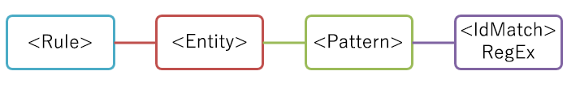
  
<span data-ttu-id="215bf-140">このパターンはシンプルですが、従業員 ID ではない可能性がある 9 桁の数値を含むコンテンツと一致するため、誤検知が多数特定される可能性があります。</span><span class="sxs-lookup"><span data-stu-id="215bf-140">However, while simple, this pattern may identify many false positives by matching content that contains any nine-digit number that is not necessarily an employee ID.</span></span>
  
### <a name="more-common-scenario-entity-with-multiple-patterns"></a><span data-ttu-id="215bf-141">より一般的なシナリオ: パターンが複数あるエンティティ</span><span class="sxs-lookup"><span data-stu-id="215bf-141">More common scenario: entity with multiple patterns</span></span>

<span data-ttu-id="215bf-142">この理由から、複数のパターンを使用してエンティティを定義し、エンティティ (9 桁の数値など) だけでなく、それらのパターンで補強証拠 (キーワードや日付など) を特定する方が一般的です。</span><span class="sxs-lookup"><span data-stu-id="215bf-142">For this reason, it's more common to define an entity by using more than one pattern, where the patterns identify supporting evidence (such as a keyword or date) in addition to the entity (such as a nine-digit number).</span></span>
  
<span data-ttu-id="215bf-143">たとえば、従業員 ID を含むコンテンツを特定する可能性を高めるために、9 桁の数値に加え、雇用日も特定する別のパターンを定義することができます。雇用日とキーワード ("従業員 ID" など) の両方を特定する別のパターンを定義することもできます。</span><span class="sxs-lookup"><span data-stu-id="215bf-143">For example, to increase the likelihood of identifying content that contains an employee ID, you can define another pattern that also identifies a hire date, and define yet another pattern that identifies both a hire date and a keyword (such as "employee ID"), in addition to the nine-digit number.</span></span>
  
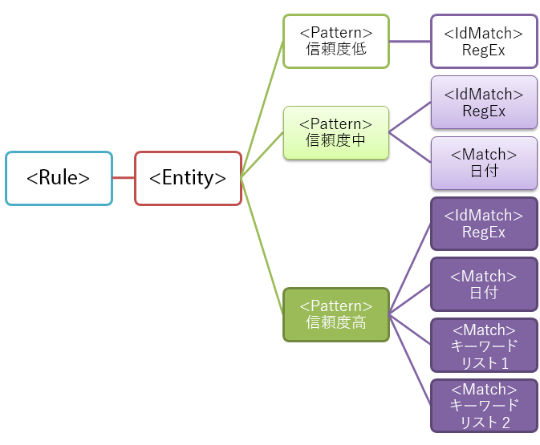
  
<span data-ttu-id="215bf-145">この構造の重要な側面について一部を説明します。</span><span class="sxs-lookup"><span data-stu-id="215bf-145">Note a couple of important aspects of this structure:</span></span>
  
- <span data-ttu-id="215bf-p112">より多くの証拠が必要なパターンの方が信頼度が高くなります。この機密情報の種類を後で DLP ポリシーにおいて使用する場合、より信頼度の高い一致に対してのみ制限の多いアクション (コンテンツのブロックなど) を使用し、信頼度の低い一致には制限の少ないアクション (通知の送信など) を使用できるので便利です。</span><span class="sxs-lookup"><span data-stu-id="215bf-p112">Patterns that require more evidence have a higher confidence level. This is useful because when you later use this sensitive information type in a DLP policy, you can use more restrictive actions (such as block content) with only the higher-confidence matches, and you can use less restrictive actions (such as send notification) with the lower-confidence matches.</span></span>
    
- <span data-ttu-id="215bf-p113">サポートされる IdMatch 要素と Match 要素は、Pattern ではなく Rule 要素の子である正規表現とキーワードを参照します。これらのサポートされる要素は、Pattern から参照されますが、Rule に含まれています。つまり、サポートされる要素の 1 つの定義 (正規表現やキーワード一覧など) は、複数のエンティティとパターンで参照できます。</span><span class="sxs-lookup"><span data-stu-id="215bf-p113">The supporting IdMatch and Match elements reference regexes and keywords that are actually children of the Rule element, not the Pattern. These supporting elements are referenced by the Pattern but included in the Rule. This means that a single definition of a supporting element, like a regular expression or a keyword list, can be referenced by multiple entities and patterns.</span></span>
    
## <a name="what-entity-do-you-need-to-identify-entity-element-id-attribute"></a><span data-ttu-id="215bf-p114">特定する必要があるエンティティ [Entity 要素、id 属性]</span><span class="sxs-lookup"><span data-stu-id="215bf-p114">What entity do you need to identify? [Entity element, id attribute]</span></span>

<span data-ttu-id="215bf-p115">エンティティは、明確に定義されたパターンを持つ、クレジットカード番号などの機密情報の種類です。各エンティティは、ID として一意の GUID を持っています。</span><span class="sxs-lookup"><span data-stu-id="215bf-p115">An entity is a sensitive information type, such as a credit card number, that has a well-defined pattern. Each entity has a unique GUID as its ID.</span></span>
  
### <a name="name-the-entity-and-generate-its-guid"></a><span data-ttu-id="215bf-155">エンティティに名前を付けて GUID を生成する</span><span class="sxs-lookup"><span data-stu-id="215bf-155">Name the entity and generate its GUID</span></span>

<span data-ttu-id="215bf-p116">Rules および Entity 要素を追加します。次に、カスタムのエンティティ名 (この例では Employee ID) を含むコメントを追加します。後で、ローカライズされた文字列セクションにこのエンティティ名を追加します。この名前は、DLP ポリシーを作成するときに UI に表示されます。</span><span class="sxs-lookup"><span data-stu-id="215bf-p116">Add the Rules and Entity elements. Then add a comment that contains the name of your custom entity - in this example, Employee ID. Later, you'll add the entity name to the localized strings section, and that name is what appears in the UI when you create a DLP policy.</span></span>
  
<span data-ttu-id="215bf-p117">次に、エンティティの GUID を生成します。GUID を生成するにはいくつかの方法がありますが、PowerShell で [guid]::NewGuid() と入力することで簡単に生成できます。このエンティティ GUID も、ローカライズされた文字列セクションに後で追加します。</span><span class="sxs-lookup"><span data-stu-id="215bf-p117">Next, generate a GUID for your entity. There are several ways to generate GUIDs, but you can do it easily in PowerShell by typing [guid]::NewGuid(). Later, you'll also add the entity GUID to the localized strings section.</span></span>
  
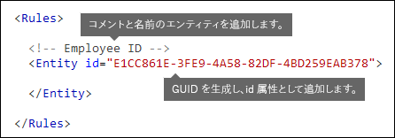
  
## <a name="what-pattern-do-you-want-to-match-pattern-element-idmatch-element-regex-element"></a><span data-ttu-id="215bf-p118">マッチングするパターン [Pattern 要素、IdMatch 要素、Regex 要素]</span><span class="sxs-lookup"><span data-stu-id="215bf-p118">What pattern do you want to match? [Pattern element, IdMatch element, Regex element]</span></span>

<span data-ttu-id="215bf-p119">パターンには、機密情報の種類が検索している内容の一覧が含まれています。この一覧には、正規表現、キーワード、組み込み関数 (正規表現を実行して日付や住所を検索するなどのタスクを実行する関数) を含めることができます。機密情報の種類には、固有の信頼度を持つ複数のパターンが含まれます。</span><span class="sxs-lookup"><span data-stu-id="215bf-p119">The pattern contains the list of what the sensitive information type is looking for. This can include regexes, keywords, and built-in functions (which perform tasks like running regexes to find dates or addresses). Sensitive information types can have multiple patterns with unique confidences.</span></span>
  
<span data-ttu-id="215bf-p120">以下のすべてのパターンで共通している点は、すべてが同じ正規表現を参照していることです。この正規表現では、空白 (\s) … (\s) で囲まれた 9 桁の数値 (\d{9}) を検索しています。この正規表現は IdMatch 要素から参照されます。また、この正規表現は従業員 ID エンティティを検索するすべてのパターンに共通する要件です。IdMatch は、パターンがマッチングしようとしている識別子 (従業員 ID、クレジット カード番号、社会保障番号など) です。1 つの Pattern 要素には、1 つの IdMatch 要素のみがあります。</span><span class="sxs-lookup"><span data-stu-id="215bf-p120">What all of the below patterns have in common is that they all reference the same regular expression, which looks for a nine-digit number (\d{9}) surrounded by white space (\s) … (\s). This regular expression is referenced by the IdMatch element and is the common requirement for all patterns that look for the Employee ID entity. IdMatch is the identifier that the pattern is to trying to match, such as Employee ID or credit card number or social security number. A Pattern element must have exactly one IdMatch element.</span></span>
  
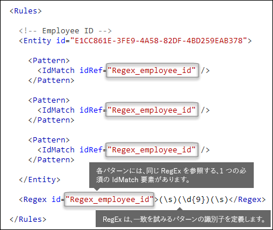
  
<span data-ttu-id="215bf-p121">パターンを満たす場合は、数と信頼度が返され、DLP ポリシーの条件に使用できます。機密情報の種類を検出する条件を DLP ポリシーに追加する場合、次のように数と信頼度を編集できます。信頼度 (一致精度とも呼ばれます) については、このトピックで後述します。</span><span class="sxs-lookup"><span data-stu-id="215bf-p121">When satisfied, a pattern returns a count and confidence level, which you can use in the conditions in your DLP policy. When you add a condition for detecting a sensitive information type to a DLP policy, you can edit the count and confidence level as shown here. Confidence level (also called match accuracy) is explained later in this topic.</span></span>
  

  
<span data-ttu-id="215bf-p122">正規表現を作成するときは、潜在的な問題があることに注意してください。たとえば、特定されるコンテンツ数が多すぎる正規表現を作成し、アップロードすると、パフォーマンスに影響する可能性があります。このような潜在的な問題の詳細については、後述の「[注意する必要がある潜在的な検証の問題](#potential-validation-issues-to-be-aware-of)」を参照してください。</span><span class="sxs-lookup"><span data-stu-id="215bf-p122">When you create your regular expression, keep in mind that there are potential issues to be aware of. For example, if you write and upload a regex that identifies too much content, this can impact performance. To learn more about these potential issues, see the later section [Potential validation issues to be aware of](#potential-validation-issues-to-be-aware-of).</span></span>
  
## <a name="do-you-want-to-require-additional-evidence-match-element-mincount-attribute"></a><span data-ttu-id="215bf-p123">追加の証拠が必要な場合 [Match 要素、minCount 属性]</span><span class="sxs-lookup"><span data-stu-id="215bf-p123">Do you want to require additional evidence? [Match element, minCount attribute]</span></span>

<span data-ttu-id="215bf-183">パターンでは、IdMatch だけでなく、Match 要素を使用して、キーワード、正規表現、日付、住所など、追加の補強証拠を必須にすることができます。</span><span class="sxs-lookup"><span data-stu-id="215bf-183">In addition to the IdMatch, a pattern can use the Match element to require additional supporting evidence, such as a keyword, regex, date, or address.</span></span>
  
<span data-ttu-id="215bf-p124">1 つのパターンには複数の Match 要素を含めることができます。Pattern 要素に直接含めるか、Any 要素を使用して組み合わせることができます。複数の Match 要素の場合は、暗黙的な AND 演算子で結合されます。パターンが一致するには、すべての Match 要素を満たす必要があります。Any 要素を使用して、AND 演算子または OR 演算子を導入することもできます (詳細については後述します)。</span><span class="sxs-lookup"><span data-stu-id="215bf-p124">A Pattern can include multiple Match elements; they can be included directly in the Pattern element or combined by using the Any element. Match elements are joined by an implicit AND operator; all Match elements must be satisfied for the pattern to be matched. You can use the Any element to introduce AND or OR operators (more on that in a later section).</span></span>
  
<span data-ttu-id="215bf-p125">省略可能な minCount 属性を使用して、各 Match 要素で検出する必要のある一致のインスタンス数を指定できます。たとえば、キーワード一覧の少なくとも 2 つのキーワードが検出された場合にのみ、パターンを満たすものと指定することができます。</span><span class="sxs-lookup"><span data-stu-id="215bf-p125">You can use the optional minCount attribute to specify how many instances of a match need to be found for each of the Match elements. For example, you can specify that a pattern is satisfied only when at least two keywords from a keyword list are found.</span></span>
  
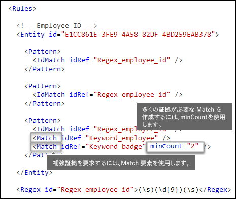
  
### <a name="keywords-keyword-group-and-term-elements-matchstyle-and-casesensitive-attributes"></a><span data-ttu-id="215bf-190">キーワード [Keyword 要素、Group 要素、Term 要素、matchStyle 属性、caseSensitive 属性]</span><span class="sxs-lookup"><span data-stu-id="215bf-190">Keywords [Keyword, Group, and Term elements, matchStyle and caseSensitive attributes]</span></span>

<span data-ttu-id="215bf-p126">従業員 ID などの機密情報を特定するときに、多くの場合、補強証拠としてキーワードが必要になります。たとえば、9 桁の数値と一致するだけでなく、"カード"、"バッジ"、"ID" などの単語を検索することがあります。このような場合に Keyword 要素を使用します。Keyword 要素には id 属性があり、複数のパターンまたはエンティティの複数の Match 要素から参照できます。</span><span class="sxs-lookup"><span data-stu-id="215bf-p126">When you identify sensitive information, like an employee ID, you often want to require keywords as corroborative evidence. For example, in addition to matching a nine-digit number, you may want to look for words like "card", "badge", or "ID". To do this, you use the Keyword element. The Keyword element has an id attribute that can be referenced by multiple Match elements in multiple patterns or entities.</span></span>
  
<span data-ttu-id="215bf-p127">キーワードは、Group 要素の Term 要素の一覧として含まれます。Group 要素には、2 つの有効値を持つ matchStyle 属性があります。</span><span class="sxs-lookup"><span data-stu-id="215bf-p127">Keywords are included as a list of Term elements in a Group element. The Group element has a matchStyle attribute with two possible values:</span></span>
  
- <span data-ttu-id="215bf-p128">**matchStyle="word"** word の一致は、空白または他の区切り文字で囲まれた複数の単語全体を特定します。複数の単語の一部に一致させる場合、またはアジア言語の単語と一致させる場合を除き、常に word を使用することをお勧めします。</span><span class="sxs-lookup"><span data-stu-id="215bf-p128">**matchStyle="word"** Word match identifies whole words surrounded by white space or other delimiters. You should always use word unless you need to match parts of words or match words in Asian languages.</span></span> 
    
- <span data-ttu-id="215bf-p129">**matchStyle="string"** string の一致は、囲んでいる文字にかかわらず、文字列を特定します。たとえば、"id" は "bid" と "idea" と一致します。アジア言語と一致させる必要がある場合、またはキーワードが他の文字列の一部に含まれる可能性がある場合にのみ、string を使用してください。</span><span class="sxs-lookup"><span data-stu-id="215bf-p129">**matchStyle="string"** String match identifies strings no matter what they're surrounded by. For example, "id" will match "bid" and "idea". Use string only when you need to match Asian words or if your keyword may be included as part of other strings.</span></span> 
    
<span data-ttu-id="215bf-202">最後に、Term 要素の caseSensitive 属性を使用して、大文字と小文字を含め、コンテンツがキーワードと完全に一致する必要があることを指定できます。</span><span class="sxs-lookup"><span data-stu-id="215bf-202">Finally, you can use the caseSensitive attribute of the Term element to specify that the content must match the keyword exactly, including lower- and upper-case letters.</span></span>
  
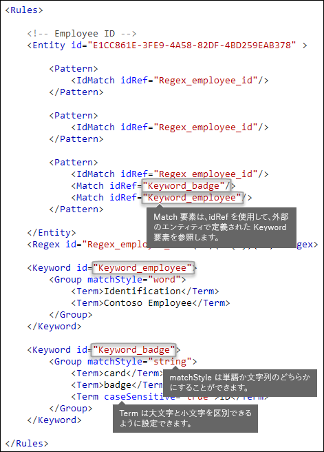
  
### <a name="regular-expressions-regex-element"></a><span data-ttu-id="215bf-204">正規表現 [Regex 要素]</span><span class="sxs-lookup"><span data-stu-id="215bf-204">Regular expressions [Regex element]</span></span>

<span data-ttu-id="215bf-p130">この例の従業員 ID エンティティは、既に IdMatch 要素を使用して、空白で囲まれた 9 桁の数値というパターンの正規表現を参照しています。さらに、パターンに Match 要素を使用して追加の Regex 要素を参照し、米国の郵便番号の書式である 5 桁または 9 桁の数値など、補強証拠を特定することができます。</span><span class="sxs-lookup"><span data-stu-id="215bf-p130">In this example, the employee ID entity already uses the IdMatch element to reference a regex for the pattern - a nine-digit number surrounded by whitespace. In addition, a pattern can use a Match element to reference an additional Regex element to identify corroborative evidence, such as a five- or nine-digit number in the format of a US zip code.</span></span>
  
### <a name="additional-patterns-such-as-dates-or-addresses-built-in-functions"></a><span data-ttu-id="215bf-207">日付や住所などのその他のパターン [組み込み関数]</span><span class="sxs-lookup"><span data-stu-id="215bf-207">Additional patterns such as dates or addresses [built-in functions]</span></span>

<span data-ttu-id="215bf-p131">DLP には、組み込みの機密情報の種類だけでなく、米国の日付、EU の日付、有効期限の日付、または米国の住所など、補強証拠を特定できる組み込み関数も含まれています。DLP は独自のカスタム関数のアップロードをサポートしていませんが、カスタムの機密情報の種類を作成した場合は、エンティティから組み込み関数を参照できます。</span><span class="sxs-lookup"><span data-stu-id="215bf-p131">In addition to the built-in sensitive information types, DLP also includes built-in functions that can identify corroborative evidence such as a US date, EU date, expiration date, or US address. DLP does not support uploading your own custom functions, but when you create a custom sensitive information type, your entity can reference the built-in functions.</span></span>
  
<span data-ttu-id="215bf-210">たとえば、従業員 ID バッジには雇用日が記載されているので、このカスタム エンティティで組み込み関数 `Func_us_date` を使用して、米国で一般的に使用されている形式の日付を特定できます。</span><span class="sxs-lookup"><span data-stu-id="215bf-210">For example, an employee ID badge has a hire date on it, so this custom entity can use the built-in function  `Func_us_date` to identify a date in the format commonly used in the US.</span></span> 
  
<span data-ttu-id="215bf-211">詳細は、「[DLP 関数で探索する内容](what-the-dlp-functions-look-for.md)」を参照してください。</span><span class="sxs-lookup"><span data-stu-id="215bf-211">For more information, see [What the DLP functions look for](what-the-dlp-functions-look-for.md).</span></span>
  
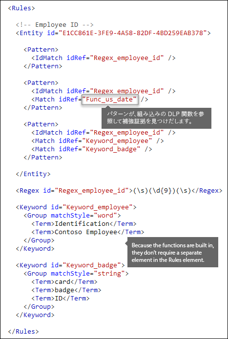
  
## <a name="different-combinations-of-evidence-any-element-minmatches-and-maxmatches-attributes"></a><span data-ttu-id="215bf-213">証拠のさまざまな組み合わせ [Any 要素、minMatches 属性、maxMatches 属性]</span><span class="sxs-lookup"><span data-stu-id="215bf-213">Different combinations of evidence [Any element, minMatches and maxMatches attributes]</span></span>

<span data-ttu-id="215bf-p132">Pattern 要素内のすべての IdMatch 要素と Match 要素は暗黙的な AND 演算子で結合されます。パターンを満たすには、すべての一致を満たしている必要があります。ただし、Any 要素を使用して複数の Match 要素をグループ化することで、より柔軟なマッチング ロジックを作成できます。たとえば、Any 要素を使用して、子 Match 要素のすべて一致、一致なし、完全サブセットの一致を表すことができます。</span><span class="sxs-lookup"><span data-stu-id="215bf-p132">In a Pattern element, all IdMatch and Match elements are joined by an implicit AND operator - all of the matches must be satisfied before the pattern can be satisfied. However, you can create more flexible matching logic by using the Any element to group Match elements. For example, you can use the Any element to match all, none, or an exact subset of its children Match elements.</span></span>
  
<span data-ttu-id="215bf-p133">Any 要素には省略可能な minMatches 属性と maxMatches 属性があります。これらの属性を使用して、パターンが一致する前に満たす必要がある子 Match 要素数を定義できます。これらの属性では、一致が検出された証拠のインスタンス数ではなく、満たす必要がある Match 要素数を定義する点に注意してください。特定の一致について最小のインスタンス数を定義するには (たとえば、一覧の 2 つのキーワードなど)、Match 要素に minCount 属性を使用します (上記を参照してください)。</span><span class="sxs-lookup"><span data-stu-id="215bf-p133">The Any element has optional minMatches and maxMatches attributes that you can use to define how many of the children Match elements must be satisfied before the pattern is matched. Note that these attributes define the number of Match elements that must be satisfied, not the number of instances of evidence found for the matches. To define a minimum number of instances for a specific match, such as two keywords from a list, use the minCount attribute for a Match element (see above).</span></span>
  
### <a name="match-at-least-one-child-match-element"></a><span data-ttu-id="215bf-220">少なくとも 1 つの子 Match 要素に一致する</span><span class="sxs-lookup"><span data-stu-id="215bf-220">Match at least one child Match element</span></span>

<span data-ttu-id="215bf-p134">最小数の Match 要素のみを満たすことを必須にするには、minMatches 属性を使用できます。実質的に、これらの Match 要素は暗黙的な OR 演算子で結合されています。この Any 要素は、米国形式の日付またはいずれかのリストのキーワードが見つかった場合に満たされます。</span><span class="sxs-lookup"><span data-stu-id="215bf-p134">If you want to require that only a minimum number of Match elements must be met, you can use the minMatches attribute. In effect, these Match elements are joined by an implicit OR operator. This Any element is satisfied if a US-formatted date or a keyword from either list is found.</span></span>
  
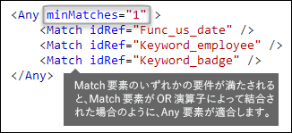
  
### <a name="match-an-exact-subset-of-any-children-match-elements"></a><span data-ttu-id="215bf-225">任意の子 Match 要素の完全サブセットと一致する</span><span class="sxs-lookup"><span data-stu-id="215bf-225">Match an exact subset of any children Match elements</span></span>

<span data-ttu-id="215bf-p135">特定の数の Match 要素を満たすことを必須にするには、minMatches と maxMatches を同じ値に設定できます。この Any 要素は、完全に一致する日付またはキーワードが見つかった場合にのみ満たされます。また、パターンはマッチングされません。</span><span class="sxs-lookup"><span data-stu-id="215bf-p135">If you want to require that an exact number of Match elements must be met, you can set minMatches and maxMatches to the same value. This Any element is satisfied only if exactly one date or keyword is found - any more than that, and the pattern won't be matched.</span></span>
  
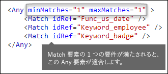
  
### <a name="match-none-of-children-match-elements"></a><span data-ttu-id="215bf-229">子 Match 要素のいずれとも一致しない</span><span class="sxs-lookup"><span data-stu-id="215bf-229">Match none of children Match elements</span></span>

<span data-ttu-id="215bf-p136">パターンを満たすための特定の証拠がないことを必須にするには、minMatches と maxMatches の両方を 0 に設定できます。この方法は、誤検知を示す可能性が高いキーワード一覧やその他の証拠がある場合に便利です。</span><span class="sxs-lookup"><span data-stu-id="215bf-p136">If you want to require the absence of specific evidence for a pattern to be satisfied, you can set both minMatches and maxMatches to 0. This can be useful if you have a keyword list or other evidence that are likely to indicate a false positive.</span></span>
  
<span data-ttu-id="215bf-p137">たとえば、従業員 ID エンティティは "ID カード" を指している可能性があるため、キーワード "カード" を探しているとします。ただし、カードという単語が "クレジット カード" という語句内にのみ出現する場合、このコンテンツの "カード" が "ID カード" を示す可能性はあまりありません。そのため、パターンを満たす単語から除外する単語の一覧にキーワードとして "クレジット カード" を追加できます。</span><span class="sxs-lookup"><span data-stu-id="215bf-p137">For example, the employee ID entity looks for the keyword "card" because it might refer to an "ID card". However, if card appears only in the phrase "credit card", "card" in this content is unlikely to mean "ID card". So you can add "credit card" as a keyword to a list of terms that you want to exclude from satisfying the pattern.</span></span>
  
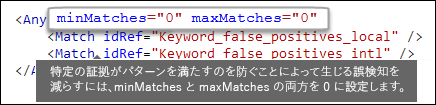
  
## <a name="how-close-to-the-entity-must-the-other-evidence-be-patternsproximity-attribute"></a><span data-ttu-id="215bf-p138">エンティティと他の証拠との近接度 [patternsProximity 属性]</span><span class="sxs-lookup"><span data-stu-id="215bf-p138">How close to the entity must the other evidence be? [patternsProximity attribute]</span></span>

<span data-ttu-id="215bf-p139">機密情報の種類で従業員 ID を表すパターンを検索していて、そのパターンの一部として、"ID" などのキーワードのような補強証拠も検索する場合があります。この証拠が互いに近くにあるほど、パターンが実際の従業員 ID になる可能性が高くなります。パターン内の他の証拠とエンティティの近接度を判断するには、Entity 要素の必須の patternsProximity 属性を使用します。</span><span class="sxs-lookup"><span data-stu-id="215bf-p139">Your sensitive information type is looking for a pattern that represents an employee ID, and as part of that pattern it's also looking for corroborative evidence like a keyword such as "ID". It makes sense that the closer together this evidence is, the more likely the pattern is to be an actual employee ID. You can determine how close other evidence in the pattern must be to the entity by using the required patternsProximity attribute of the Entity element.</span></span>
  
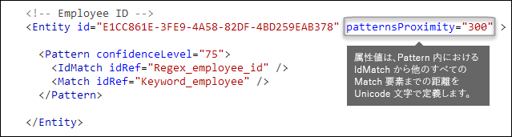
  
<span data-ttu-id="215bf-p140">エンティティ内の各パターンに対し、そのパターンに対して指定されたすべての他の一致について、patternsProximity 属性値で IdMatch の場所からの距離 (Unicode 文字) を定義します。近接ウィンドウは、IdMatch の場所によってアンカーされ、IdMatch の左側と右側にウィンドウが展開されます。</span><span class="sxs-lookup"><span data-stu-id="215bf-p140">For each pattern in the entity, the patternsProximity attribute value defines the distance (in Unicode characters) from the IdMatch location for all other Matches specified for that Pattern. The proximity window is anchored by the IdMatch location, with the window extending to the left and right of the IdMatch.</span></span>
  
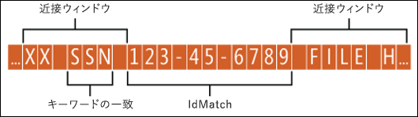
  
<span data-ttu-id="215bf-p141">以下の例は、従業員 ID のカスタム エンティティの IdMatch 要素で、キーワードまたは日付の少なくとも 1 つの補完的な一致を必要とするパターン マッチングに対して、近接ウィンドウがどのように影響するかを示しています。ID2 と ID3 の場合、近接ウィンドウ内に補強証拠がまったくないか、部分的にしかないため、ID1 のみが一致します。</span><span class="sxs-lookup"><span data-stu-id="215bf-p141">The example below illustrates how the proximity window affects the pattern matching where IdMatch element for the employee ID custom entity requires at least one corroborating match of keyword or date. Only ID1 matches because for ID2 and ID3, either no or only partial corroborating evidence is found within the proximity window.</span></span>
  

  
<span data-ttu-id="215bf-p142">メールの場合、メッセージ本文と各添付ファイルは、別のアイテムとして扱われる点に注意してください。つまり、近接ウィンドウは、これらの各アイテムの終端を超えて延長されないということです。各アイテム (添付ファイルまたは本文) に、idMatch と補強証拠の両方が存在している必要があります。</span><span class="sxs-lookup"><span data-stu-id="215bf-p142">Note that for email, the message body and each attachment are treated as separate items. This means that the proximity window does not extend beyond the end of each of these items. For each item (attachment or body), both the idMatch and corroborative evidence needs to reside in that item.</span></span>
  
## <a name="what-are-the-right-confidence-levels-for-different-patterns-confidencelevel-attribute-recommendedconfidence-attribute"></a><span data-ttu-id="215bf-p143">パターンごとの適切な信頼度 [confidenceLevel 属性、recommendedConfidence 属性]</span><span class="sxs-lookup"><span data-stu-id="215bf-p143">What are the right confidence levels for different patterns? [confidenceLevel attribute, recommendedConfidence attribute]</span></span>

<span data-ttu-id="215bf-p144">パターンに必要な証拠が多くなるほど、パターンが一致したときに実際のエンティティ (従業員 ID など) が特定される信頼度が高くなります。たとえば、9 桁の ID 番号、雇用日、近接度の高いキーワードが必要なパターンの場合、9 桁の ID 番号のみが必要なパターンよりも信頼度が高くなります。</span><span class="sxs-lookup"><span data-stu-id="215bf-p144">The more evidence that a pattern requires, the more confidence you have that an actual entity (such as employee ID) has been identified when the pattern is matched. For example, you have more confidence in a pattern that requires a nine-digit ID number, hire date, and keyword in close proximity, than you do in a pattern that requires only a nine-digit ID number.</span></span>
  
<span data-ttu-id="215bf-p145">Pattern 要素には必須の confidenceLevel 属性があります。confidenceLevel の値 (1 から 100 の整数) は、エンティティに含まれる各パターンの一意の ID と考えることができます。エンティティのパターンには、異なる信頼度を割り当てる必要があります。この整数を細かく指定することにあまり大きな意味はありません。社内のコンプライアンス チームにとって意味のある数値を選択してください。カスタムの機密情報の種類をアップロードし、DLP ポリシーを作成したら、作成するルールの条件でその信頼度を参照できます。</span><span class="sxs-lookup"><span data-stu-id="215bf-p145">The Pattern element has a required confidenceLevel attribute. You can think of the value of confidenceLevel (an integer between 1 and 100) as a unique ID for each pattern in an entity - the patterns in an entity must have different confidence levels that you assign. The precise value of the integer doesn't matter - simply pick numbers that make sense to your compliance team. After you upload your custom sensitive information type and then create a DLP policy, you can reference these confidence levels in the conditions of the rules that you create.</span></span>
  
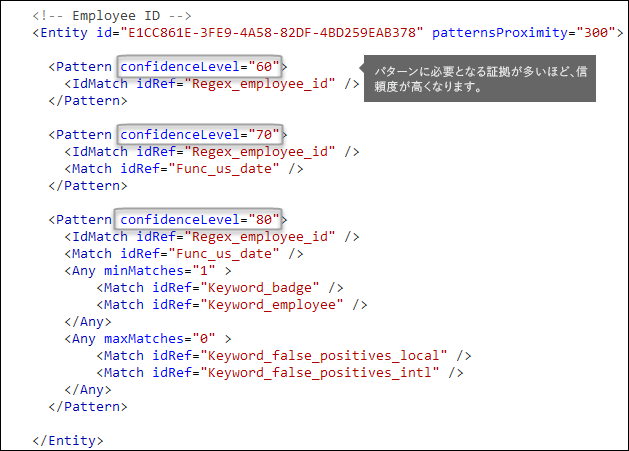
  
<span data-ttu-id="215bf-p146">エンティティには各 Pattern の confidenceLevel に加え、recommendedConfidence 属性があります。推奨される信頼度の属性は、ルールの既定の信頼度と考えることができます。DLP ポリシーにルールを作成するときに、使用するルールの信頼度を指定しない場合、そのエンティティの推奨される信頼度に基づいてルールのマッチングが行われます。</span><span class="sxs-lookup"><span data-stu-id="215bf-p146">In addition to confidenceLevel for each Pattern, the Entity has a recommendedConfidence attribute. The recommended confidence attribute can be thought of as the default confidence level for the rule. When you create a rule in a DLP policy, if you don't specify a confidence level for the rule to use, that rule will match based on the recommended confidence level for the entity.</span></span>
  
## <a name="do-you-want-to-support-other-languages-in-the-ui-of-the-security-amp-compliance-center-localizedstrings-element"></a><span data-ttu-id="215bf-p147">セキュリティ/コンプライアンス センターの UI で他の言語をサポートする場合 [LocalizedStrings 要素]</span><span class="sxs-lookup"><span data-stu-id="215bf-p147">Do you want to support other languages in the UI of the Security &amp; Compliance Center? [LocalizedStrings element]</span></span>

<span data-ttu-id="215bf-p148">コンプライアンス チームが Office 365 セキュリティ/コンプライアンス センターを使用して異なるロケールと異なる言語で DLP ポリシーを作成する場合、カスタムの機密情報の種類の名前と説明について、ローカライズされたバージョンを提供することができます。コンプライアンス チームがサポートしている言語で Office 365 を使用すると、ローカライズされた名前が UI に表示されます。</span><span class="sxs-lookup"><span data-stu-id="215bf-p148">If your compliance team uses the Office 365 Security &amp; Compliance Center to create DLP policies in different locales and in different languages, you can provide localized versions of the name and description of your custom sensitive information type. When your compliance team uses Office 365 in a language that you support, they'll see the localized name in the UI.</span></span>
  

  
<span data-ttu-id="215bf-p149">Rules 要素には、LocalizedStrings 要素を含める必要があります。LocalizedStrings 要素には、カスタム エンティティの GUID を参照する Resource 要素が含まれています。また、各 Resource 要素には、1 つまたは複数の Name 要素と Description 要素が含まれており、それぞれが langcode 属性を使用して特定の言語のローカライズされた文字列を提供します。</span><span class="sxs-lookup"><span data-stu-id="215bf-p149">The Rules element must contain a LocalizedStrings element, which contains a Resource element that references the GUID of your custom entity. In turn, each Resource element contains one or more Name and Description elements that each use the langcode attribute to provide a localized string for a specific language.</span></span>
  
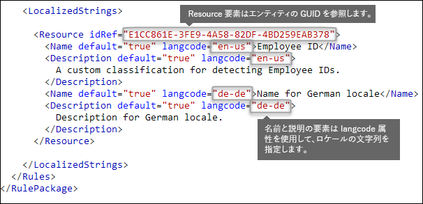
  
<span data-ttu-id="215bf-p150">ローカライズされた文字列は、カスタムの機密情報の種類がセキュリティ/コンプライアンス センターの UI でどのように表示されるかを指定するためにのみ使用できることに注意してください。ローカライズされた文字列を使用して、キーワード リストまたは正規表現の異なるローカライズ バージョンを提供することはできません。</span><span class="sxs-lookup"><span data-stu-id="215bf-p150">Note that you use localized strings only for how your custom sensitive information type appears in the UI of the Security &amp; Compliance Center. You can't use localized strings to provide different localized versions of a keyword list or regular expression.</span></span>
  
## <a name="other-rule-package-markup-rulepack-guid"></a><span data-ttu-id="215bf-273">その他のルール パッケージ マークアップ [RulePack GUID]</span><span class="sxs-lookup"><span data-stu-id="215bf-273">Other rule package markup [RulePack GUID]</span></span>

<span data-ttu-id="215bf-p151">最後に、各 RulePackage の先頭には、入力する必要のある一般的な情報が含まれています。次のマークアップをテンプレートとして使用し、「. . .」プレースホルダーを自分の情報に置き換えることができます。</span><span class="sxs-lookup"><span data-stu-id="215bf-p151">Finally, the beginning of each RulePackage contains some general information that you need to fill in. You can use the following markup as a template and replace the ". . ." placeholders with your own info.</span></span>
  
<span data-ttu-id="215bf-p152">最も重要な点は、RulePack の GUID を生成する必要があることです。これまでにエンティティの GUID を生成しましたが、これは RulePack の 2 つ目の GUID です。GUID を生成するにはいくつかの方法がありますが、PowerShell では [guid]::NewGuid() と入力することで簡単に行うことができます。</span><span class="sxs-lookup"><span data-stu-id="215bf-p152">Most importantly, you'll need to generate a GUID for the RulePack. Above, you generated a GUID for the entity; this is a second GUID for the RulePack. There are several ways to generate GUIDs, but you can do it easily in PowerShell by typing [guid]::NewGuid().</span></span>
  
<span data-ttu-id="215bf-p153">Version 要素も重要です。ルール パッケージを初めてアップロードすると、Office 365 はバージョン番号を記録します。後でルール パッケージを更新して新しいバージョンをアップロードする場合は、バージョン番号を必ず更新してください。更新しないと、Office 365 で新しいルール パッケージが展開されません。</span><span class="sxs-lookup"><span data-stu-id="215bf-p153">The Version element is also important. When you upload your rule package for the first time, Office 365 notes the version number. Later, if you update the rule package and upload a new version, make sure to update the version number or Office 365 won't deploy the rule package.</span></span>
  
```
<?xml version="1.0" encoding="utf-16"?>
<RulePackage xmlns="http://schemas.microsoft.com/office/2011/mce">
  <RulePack id=". . .">
    <Version major="1" minor="0" build="0" revision="0" />
    <Publisher id=". . ." /> 
    <Details defaultLangCode=". . .">
      <LocalizedDetails langcode=" . . . ">
         <PublisherName>. . .</PublisherName>
         <Name>. . .</Name>
         <Description>. . .</Description>
      </LocalizedDetails>
    </Details>
  </RulePack>
  
 <Rules>
    . . .
 </Rules>
</RulePackage>

```

<span data-ttu-id="215bf-285">完了すると、RulePack 要素は次のようになります。</span><span class="sxs-lookup"><span data-stu-id="215bf-285">When complete, your RulePack element should look like this.</span></span>
  
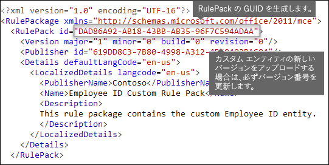
  
## <a name="changes-for-exchange-online"></a><span data-ttu-id="215bf-287">Exchange Online の変更</span><span class="sxs-lookup"><span data-stu-id="215bf-287">Changes for Exchange Online</span></span>

<span data-ttu-id="215bf-p154">以前は、DLP 用にカスタムの機密情報の種類をインポートするために Exchange Online PowerShell を使用することがありました。現在は、カスタムの機密情報の種類を Exchange 管理センターとセキュリティ/コンプライアンス センターの両方で使用できるようになりました。この改善の一環で、カスタムの機密情報の種類をインポートする場合、セキュリティ/コンプライアンス センター PowerShell の使用が必須になりました。Exchange PowerShell からはインポートできません。カスタムの機密情報の種類は以前と同様に使用できますが、セキュリティ/コンプライアンス センターでカスタムの機密情報の種類を変更した場合、Exchange 管理センターに表示されるまでに最大 1 時間かかる場合があります。</span><span class="sxs-lookup"><span data-stu-id="215bf-p154">Previously, you might have used Exchange Online PowerShell to import your custom sensitive information types for DLP. Now your custom sensitive information types can be used in both the Exchange Admin Center and the Security &amp; Compliance Center. As part of this improvement, you should use Security &amp; Compliance Center PowerShell to import your custom sensitive information types - you can't import them from the Exchange PowerShell anymore. Your custom sensitive information types will continue to work just like before; however, it may take up to one hour for changes made to custom sensitive information types in the Security &amp; Compliance Center to appear in the Exchange Admin Center.</span></span>
  
<span data-ttu-id="215bf-p155">セキュリティ/コンプライアンス センターでは、`DlpSensitiveInformationTypeRulePackage` コマンドレットを使用してルール パッケージをアップロードします。これまでは、Exchange 管理センターで `ClassificationRuleCollection` コマンドレットを使用していました。</span><span class="sxs-lookup"><span data-stu-id="215bf-p155">Note that in the Security &amp; Compliance Center, you use the  `DlpSensitiveInformationTypeRulePackage` cmdlet to upload a rule package. Previously, in the Exchange Admin Center, you used the  `ClassificationRuleCollection` cmdlet.</span></span> 
  
## <a name="upload-your-rule-package"></a><span data-ttu-id="215bf-294">ルール パッケージをアップロードする</span><span class="sxs-lookup"><span data-stu-id="215bf-294">Upload your rule package</span></span>

<span data-ttu-id="215bf-295">ルール パッケージをアップロードするには、次の手順を実行します。</span><span class="sxs-lookup"><span data-stu-id="215bf-295">To upload your rule package, do the following.</span></span>
  
1. <span data-ttu-id="215bf-296">ルールを Unicode エンコードで .xml ファイルとして保存します。</span><span class="sxs-lookup"><span data-stu-id="215bf-296">Save it as an .xml file with Unicode encoding.</span></span>
    
2. [<span data-ttu-id="215bf-297">Office 365 セキュリティ/コンプライアンス センター PowerShell への接続</span><span class="sxs-lookup"><span data-stu-id="215bf-297">Connect to Office 365 Security &amp; Compliance Center PowerShell</span></span>](http://go.microsoft.com/fwlink/p/?LinkID=799771)
    
3. <span data-ttu-id="215bf-298">次の構文を使用してください。</span><span class="sxs-lookup"><span data-stu-id="215bf-298">Use the following syntax:</span></span>

    ```
    New-DlpSensitiveInformationTypeRulePackage -FileData (Get-Content -Path "PathToUnicodeXMLFile" -Encoding Byte)
    ```

    <span data-ttu-id="215bf-299">この例では、MyNewRulePack.xml という名前の Unicode XML ファイルを C:\My Documents からアップロードします。</span><span class="sxs-lookup"><span data-stu-id="215bf-299">This example uploads the Unicode XML file named MyNewRulePack.xml from C:\My Documents.</span></span>

    ```
    New-DlpSensitiveInformationTypeRulePackage -FileData (Get-Content -Path "C:\My Documents\MyNewRulePack.xml" -Encoding Byte)
    ```

    <span data-ttu-id="215bf-300">構文とパラメーターの詳細情報については、[New-dlpsensitiveinformationtyperulepackage](https://docs.microsoft.com/powershell/module/exchange/policy-and-compliance-dlp/new-dlpsensitiveinformationtyperulepackage) をご覧ください。</span><span class="sxs-lookup"><span data-stu-id="215bf-300">For detailed syntax and parameter information, see [New-OrganizationRelationship](https://docs.microsoft.com/powershell/module/exchange/policy-and-compliance-dlp/new-dlpsensitiveinformationtyperulepackage).</span></span>

5. <span data-ttu-id="215bf-301">新しい機密情報の種類が正常に作成されたことを確認するには、次に示す手順のいずれかを実行します。</span><span class="sxs-lookup"><span data-stu-id="215bf-301">To verify that you've successfully created a new sensitive information type, do any of the following steps:</span></span>

  - <span data-ttu-id="215bf-302">次のコマンドを実行して、新しいルール パッケージが一覧表示されていることを確認します。</span><span class="sxs-lookup"><span data-stu-id="215bf-302">Run the following command and verify the new rule package is listed:</span></span>

    ```
    Get-DlpSensitiveInformationTypeRulePackage
    ``` 

  - <span data-ttu-id="215bf-303">次のコマンドを実行して、機密情報の種類が一覧表示されていることを確認します。</span><span class="sxs-lookup"><span data-stu-id="215bf-303">Run the following command and verify the sensitive information type is listed:</span></span>

    ```
    Get-DlpSensitiveInformationType
    ``` 

    <span data-ttu-id="215bf-304">カスタムの機密情報の種類の場合、Publisher プロパティ値を Microsoft Corporation 以外に設定します。</span><span class="sxs-lookup"><span data-stu-id="215bf-304">For custom sensitive information types, the Publisher property value will be something other than Microsoft Corporation.</span></span>

  - <span data-ttu-id="215bf-305">\<Name\> を機密情報タイプの名前値 (たとえば、従業員 ID) に置き換えて、次のコマンドを実行します。</span><span class="sxs-lookup"><span data-stu-id="215bf-305">Replace \<Name\> with the Name value of the sensitive information type (for example, Employee ID) and run the following command:</span></span>

    ```
    Get-DlpSensitiveInformationType -Identity "<Name>"
    ```
    
## <a name="potential-validation-issues-to-be-aware-of"></a><span data-ttu-id="215bf-306">注意する必要がある潜在的な検証の問題</span><span class="sxs-lookup"><span data-stu-id="215bf-306">Potential validation issues to be aware of</span></span>

<span data-ttu-id="215bf-p156">ルール パッケージの XML ファイルをアップロードすると、システムで XML が検証され、既知の不適切なパターンや明らかなパフォーマンスの問題が確認されます。検証で確認される既知の正規表現に関する問題について一部を紹介します。</span><span class="sxs-lookup"><span data-stu-id="215bf-p156">When you upload your rule package XML file, the system validates the XML and checks for known bad patterns and obvious performance issues. Here are some known issues that the validation checks for — a regular expression:</span></span>
  
- <span data-ttu-id="215bf-309">先頭または末尾に縦棒 "|" を指定することはできません。これは、空の一致とみなされるため、あらゆるものと一致します。</span><span class="sxs-lookup"><span data-stu-id="215bf-309">Cannot begin or end with alternator "|", which matches everything because it's considered an empty match.</span></span>
    
    <span data-ttu-id="215bf-310">たとえば、"|a" や "b|" では検証に合格しません。</span><span class="sxs-lookup"><span data-stu-id="215bf-310">For example, "|a" or "b|" will not pass validation.</span></span>
    
- <span data-ttu-id="215bf-311">先頭または末尾に ".{0,m}" パターンを指定することはできません。これは機能的な目的がなく、単にパフォーマンスが低下します。</span><span class="sxs-lookup"><span data-stu-id="215bf-311">Cannot begin or end with a ".{0,m}" pattern, which has no functional purpose and only impairs performance.</span></span>
    
    <span data-ttu-id="215bf-312">たとえば、".{0,50}ASDF" や "ASDF.{0,50}" では検証に合格しません。</span><span class="sxs-lookup"><span data-stu-id="215bf-312">For example, ".{0,50}ASDF" or "ASDF.{0,50}" will not pass validation.</span></span>
    
- <span data-ttu-id="215bf-313">".{0,m}" や ".{1,m}" をグループに含めることはできません。また、".\*" や ".+" をグループに含めることはできません。</span><span class="sxs-lookup"><span data-stu-id="215bf-313">Cannot have ".{0,m}" or ".{1,m}" in groups, and cannot have ".\*" or ".+" in groups.</span></span>
    
    <span data-ttu-id="215bf-314">たとえば、"(.{0,50000})" では検証に合格しません。</span><span class="sxs-lookup"><span data-stu-id="215bf-314">For example, "(.{0,50000})" will not pass validation.</span></span>
    
- <span data-ttu-id="215bf-315">"{0,m}" または "{1,m}" リピーターを含む文字はグループ内に含めることができません。</span><span class="sxs-lookup"><span data-stu-id="215bf-315">Cannot have any character with "{0,m}" or "{1,m}" repeaters in groups.</span></span>
    
    <span data-ttu-id="215bf-316">たとえば、"(a\*)" では検証に合格しません。</span><span class="sxs-lookup"><span data-stu-id="215bf-316">For example, "(a\*)" will not pass validation.</span></span>
    
- <span data-ttu-id="215bf-317">先頭または末尾に ".{1,m}" を指定することはできません。代わりに、"." のみを使用してください。</span><span class="sxs-lookup"><span data-stu-id="215bf-317">Cannot begin or end with ".{1,m}"; instead, use just "."</span></span>
    
    <span data-ttu-id="215bf-318">たとえば、".{1,m}asdf" では検証に合格しません。代わりに、".asdf" のみを使用してください。</span><span class="sxs-lookup"><span data-stu-id="215bf-318">For example, ".{1,m}asdf" will not pass validation; instead, use just ".asdf".</span></span>
    
- <span data-ttu-id="215bf-319">グループに無制限のリピーター (「\*」や「+」など) を含めることはできません。</span><span class="sxs-lookup"><span data-stu-id="215bf-319">Cannot have an unbounded repeater (such as "\*" or "+") on a group.</span></span>
    
    <span data-ttu-id="215bf-320">たとえば、"(xx)\*" や "(xx)+" では検証に合格しません。</span><span class="sxs-lookup"><span data-stu-id="215bf-320">For example, "(xx)\*" and "(xx)+" will not pass validation.</span></span>
    
<span data-ttu-id="215bf-321">パフォーマンスに影響する可能性のある問題がカスタムの機密情報の種類に含まれている場合は、アップロードされず、次のいずれかのエラー メッセージが表示されることがあります。</span><span class="sxs-lookup"><span data-stu-id="215bf-321">If a custom sensitive information type contains an issue that may affect performance, it won't be uploaded and you may see one of these error messages:</span></span>
  
- <span data-ttu-id="215bf-322">**予想よりも多くのコンテンツに一致する汎用的な限定詞 (‘+’、‘\*’ など)**</span><span class="sxs-lookup"><span data-stu-id="215bf-322">**Generic quantifiers which match more content than expected (e.g., '+', '\*')**</span></span>
    
- <span data-ttu-id="215bf-323">**ルックアラウンド アサーション**</span><span class="sxs-lookup"><span data-stu-id="215bf-323">**Lookaround assertions**</span></span>
    
- <span data-ttu-id="215bf-324">**複雑なグループ化と汎用的な限定詞の併用**</span><span class="sxs-lookup"><span data-stu-id="215bf-324">**Complex grouping in conjunction with general quantifiers**</span></span>
    
## <a name="recrawl-your-content-to-identify-the-sensitive-information"></a><span data-ttu-id="215bf-325">コンテンツを再クロールして機密情報を特定する</span><span class="sxs-lookup"><span data-stu-id="215bf-325">Recrawl your content to identify the sensitive information</span></span>

<span data-ttu-id="215bf-p157">DLP は、検索クローラーを使用して、サイト コンテンツ内の機密情報を特定し、分類しています。SharePoint Online サイトと OneDrive for Business サイトのコンテンツが更新されると、自動的に再クロールされます。ただし、既存のすべてのコンテンツで新しいカスタムの機密情報の種類を特定するには、そのコンテンツを再クロールする必要があります。</span><span class="sxs-lookup"><span data-stu-id="215bf-p157">DLP uses the search crawler to identify and classify sensitive information in site content. Content in SharePoint Online and OneDrive for Business sites is recrawled automatically whenever it's updated. But to identify your new custom type of sensitive information in all existing content, that content must be recrawled.</span></span>
  
<span data-ttu-id="215bf-329">Office 365 でテナント全体の再クロールを手動で要求することはできませんが、サイト コレクション、リスト、またはライブラリに対して再クロールすることはできます。詳細については、「[サイト、ライブラリ、またはリストのクロールとインデックス再作成を手動で要求する](https://support.office.com/article/9afa977d-39de-4321-b4ca-8c7c7e6d264e)」を参照してください。</span><span class="sxs-lookup"><span data-stu-id="215bf-329">In Office 365, you can't manually request a recrawl of an entire tenant, but you can do this for a site collection, list, or library - see [Manually request crawling and re-indexing of a site, a library or a list](https://support.office.com/article/9afa977d-39de-4321-b4ca-8c7c7e6d264e).</span></span>
  
## <a name="remove-a-custom-sensitive-information-type"></a><span data-ttu-id="215bf-330">カスタムの機密情報の種類を削除する</span><span class="sxs-lookup"><span data-stu-id="215bf-330">Remove a custom sensitive information type</span></span>

<span data-ttu-id="215bf-331">**注**: カスタムの機密情報の種類を削除する前に、その機密情報の種類を参照している DLP ポリシーまたは Exchange メール フロー ルール (別名: トランスポート ルール) がないことを確認してください。</span><span class="sxs-lookup"><span data-stu-id="215bf-331">**Note**: Before your remove a custom sensitive information type, verify that no DLP policies or Exchange mail flow rules (also known as transport rules) still reference the sensitive information type.</span></span>

<span data-ttu-id="215bf-332">セキュリティ/コンプライアンス センターの PowerShell では、カスタムの機密情報の種類を削除する 2 つの方法があります。</span><span class="sxs-lookup"><span data-stu-id="215bf-332">In Security & Compliance Center PowerShell, there are two methods to remove custom sensitive information types:</span></span>

- <span data-ttu-id="215bf-p158">**個々のカスタムの機密情報の種類を削除する**: 「[カスタムの機密情報の種類を変更する](#modify-a-custom-sensitive-information-type)」に記載されている方法を使用します。カスタムの機密情報の種類を含むカスタム ルール パッケージをエクスポートし、XML ファイルから機密情報の種類を削除して、更新された XML ファイルを既存のカスタム ルール パッケージにインポートします。</span><span class="sxs-lookup"><span data-stu-id="215bf-p158">**Remove individual custom sensitive information types**: Use the method documented in [Modify a custom sensitive information type](#modify-a-custom-sensitive-information-type). You export the custom rule package that contains the custom sensitive information type, remove the sensitive information type from the XML file, and import the updated XML file back into the existing custom rule package.</span></span>

- <span data-ttu-id="215bf-335">**カスタム ルール パッケージとそれに含まれるすべてのカスタムの機密情報の種類を削除する**: この方法は、このセクションに記載されています。</span><span class="sxs-lookup"><span data-stu-id="215bf-335">**Remove a custom rule package and all custom sensitive information types that it contains**: This method is documented in this section.</span></span>

1. [<span data-ttu-id="215bf-336">Office 365 セキュリティ/コンプライアンス センター PowerShell への接続</span><span class="sxs-lookup"><span data-stu-id="215bf-336">Connect to Office 365 Security &amp; Compliance Center PowerShell</span></span>](http://go.microsoft.com/fwlink/p/?LinkID=799771)

2. <span data-ttu-id="215bf-337">カスタム ルール パッケージを削除するには、次の構文を使用します。</span><span class="sxs-lookup"><span data-stu-id="215bf-337">To remove a custom rule package, use the following syntax:</span></span>

    ```
    Remove-DlpSensitiveInformationTypeRulePackage -Identity "RulePackageIdentity"
    ```

    <span data-ttu-id="215bf-338">Name 値 (任意の言語) または `RulePack id` (GUID) 値を使用して、ルール パッケージを識別します。</span><span class="sxs-lookup"><span data-stu-id="215bf-338">You can use the Name value (for any language) or the `RulePack id` (GUID) value to identify the rule package.</span></span>

    <span data-ttu-id="215bf-339">この例では、"Employee ID Custom Rule Pack" (従業員 ID カスタム ルール パック) という名前のルール パッケージを削除します。</span><span class="sxs-lookup"><span data-stu-id="215bf-339">This example removes the rule package named "Employee ID Custom Rule Pack".</span></span>

    ```
       Remove-DlpSensitiveInformationTypeRulePackage -Identity "Employee ID Custom Rule Pack"
    ```

    <span data-ttu-id="215bf-340">構文とパラメーターの詳細情報については、[Remove-dlpsensitiveinformationtyperulepackage](https://docs.microsoft.com/powershell/module/exchange/policy-and-compliance-dlp/remove-dlpsensitiveinformationtyperulepackage) をご覧ください。</span><span class="sxs-lookup"><span data-stu-id="215bf-340">For detailed syntax and parameter information, see [Remove-OrganizationRelationship](https://docs.microsoft.com/powershell/module/exchange/policy-and-compliance-dlp/remove-dlpsensitiveinformationtyperulepackage).</span></span>

3. <span data-ttu-id="215bf-341">カスタムの機密情報の種類が正常に削除されたことを確認するには、次に示す手順のいずれかを実行します。</span><span class="sxs-lookup"><span data-stu-id="215bf-341">To verify that you've successfully removed a custom sensitive information type, do any of the following steps:</span></span>

  - <span data-ttu-id="215bf-342">次のコマンドを実行して、ルール パッケージが一覧表示されなくなったことを確認します。</span><span class="sxs-lookup"><span data-stu-id="215bf-342">From the exsdkExMSH, run the following command and verify that the rule you remove is no longer listed:</span></span>

    ```
    Get-DlpSensitiveInformationTypeRulePackage
    ``` 

  - <span data-ttu-id="215bf-343">次のコマンドを実行し、削除されたルール パッケージで機密情報の種類が一覧表示されなくなったことを確認します。</span><span class="sxs-lookup"><span data-stu-id="215bf-343">Run the following command and verify the sensitive information types in the removed rule package are no longer listed:</span></span>

    ```
    Get-DlpSensitiveInformationType
    ``` 

    <span data-ttu-id="215bf-344">カスタムの機密情報の種類の場合、Publisher プロパティ値を Microsoft Corporation 以外に設定します。</span><span class="sxs-lookup"><span data-stu-id="215bf-344">For custom sensitive information types, the Publisher property value will be something other than Microsoft Corporation.</span></span>

  - <span data-ttu-id="215bf-345">\<Name\> を機密情報タイプの名前値 (たとえば、従業員 ID) に置き換えて、次のコマンドを実行し、機密情報の種類が一覧表示されなくなったことを確認します。</span><span class="sxs-lookup"><span data-stu-id="215bf-345">Replace \<Name\> with the Name value of the sensitive information type (for example, Employee ID) and run the following command to verify the sensitive information type is no longer listed:</span></span>

    ```
    Get-DlpSensitiveInformationType -Identity "<Name>"
    ```

## <a name="modify-a-custom-sensitive-information-type"></a><span data-ttu-id="215bf-346">カスタムの機密情報の種類を変更する</span><span class="sxs-lookup"><span data-stu-id="215bf-346">Remove a custom sensitive information type</span></span>

<span data-ttu-id="215bf-347">セキュリティ/コンプライアンス センターの PowerShell でカスタムの機密情報の種類を変更するには、次のようにする必要があります。</span><span class="sxs-lookup"><span data-stu-id="215bf-347">In Security & Compliance Center PowerShell, modifying a custom sensitive information type requires you to:</span></span>

1. <span data-ttu-id="215bf-348">カスタムの機密情報の種類が含まれている既存のルール パッケージを XML ファイル (または、ある場合は既存の XML ファイル) にエクスポートします。</span><span class="sxs-lookup"><span data-stu-id="215bf-348">Export the existing rule package that contains the custom sensitive information type to an XML file (or use the existing XML file if you have it).</span></span> 

2. <span data-ttu-id="215bf-349">エクスポートした XML ファイルで、カスタムの機密情報の種類を変更します。</span><span class="sxs-lookup"><span data-stu-id="215bf-349">Modify the custom sensitive information type in the exported XML file.</span></span>

3. <span data-ttu-id="215bf-350">更新した XML ファイルを既存のルール パッケージにインポートします。</span><span class="sxs-lookup"><span data-stu-id="215bf-350">Import the updated XML file back into the existing rule package.</span></span>

<span data-ttu-id="215bf-351">セキュリティ/コンプライアンス センターの PowerShell に接続するには、「[Office 365 セキュリティ/コンプライアンス センター PowerShell への接続](http://go.microsoft.com/fwlink/p/?LinkID=799771)」を参照してください。</span><span class="sxs-lookup"><span data-stu-id="215bf-351">To connect to Security & Compliance Center PowerShell, see [Connect to Office 365 Security & Compliance Center PowerShell](http://go.microsoft.com/fwlink/p/?LinkID=799771).</span></span>

#### <a name="step-1-export-the-existing-rule-package-to-an-xml-file"></a><span data-ttu-id="215bf-352">手順 1: 既存のルール パッケージを XML ファイルにエクスポートします</span><span class="sxs-lookup"><span data-stu-id="215bf-352">Step 1: Export the existing rule package to an XML file</span></span>

<span data-ttu-id="215bf-353">**注**: XML ファイルのコピーがある場合 (たとえば、先ほど作成してインポートした場合)、次の手順に進んで、XML ファイルを変更することができます。</span><span class="sxs-lookup"><span data-stu-id="215bf-353">**Note**: If you have a copy of the XML file (for example, you just created and imported it), you can skip to the next step to modify the XML file.</span></span>

1. <span data-ttu-id="215bf-354">カスタム ルール パッケージの名前を知らない場合、次のコマンドを実行して確認します。</span><span class="sxs-lookup"><span data-stu-id="215bf-354">If you don't already know it, run the following command to find the name of the custom rule package:</span></span>

    ```
    Get-DlpSensitiveInformationTypeRulePackage
    ```

    <span data-ttu-id="215bf-p159">**注**: 組み込みの機密情報の種類が含まれる組み込みのルール パッケージは、Microsoft Rule Package と呼ばれます。セキュリティ/コンプライアンス センターの UI で作成したカスタムの機密情報の種類が含まれるルール パッケージは Microsoft.SCCManaged.CustomRulePack と呼ばれます。</span><span class="sxs-lookup"><span data-stu-id="215bf-p159">**Note**: The built-in rule package that contains the built-in sensitive information types is named Microsoft Rule Package. The rule package that contains the custom sensitive information types that you created in the Security & Compliance Center UI is named Microsoft.SCCManaged.CustomRulePack.</span></span>

2. <span data-ttu-id="215bf-357">カスタム ルール パッケージを変数に格納するには、次の構文を使用します。</span><span class="sxs-lookup"><span data-stu-id="215bf-357">Use the following syntax to store the custom rule package to a variable:</span></span>

    ```
    $rulepak = Get-DlpSensitiveInformationTypeRulePackage -Identity "RulePackageName"
    ```

   <span data-ttu-id="215bf-358">たとえば、ルール パッケージの名前が "Employee ID Custom Rule Pack" (従業員 ID カスタム ルール パック) の場合、次のコマンドを実行します。</span><span class="sxs-lookup"><span data-stu-id="215bf-358">For example, if the name of the rule package is "Employee ID Custom Rule Pack", run the following command:</span></span>

    ```
    $rulepak = Get-DlpSensitiveInformationTypeRulePackage -Identity "Employee ID Custom Rule Pack"
    ```

3. <span data-ttu-id="215bf-359">カスタム ルール パッケージを XML ファイルにエクスポートするには、次の構文を使用します。</span><span class="sxs-lookup"><span data-stu-id="215bf-359">Use the following syntax to export the custom rule package to an XML file:</span></span>

    ```
    Set-Content -Path "XMLFileAndPath" -Encoding Byte -Value $rulepak.SerializedClassificationRuleCollection
    ```

    <span data-ttu-id="215bf-360">この例では、ルール パッケージを C:\My Documents フォルダーの ExportedRulePackage.xml という名前のファイルにエクスポートします。</span><span class="sxs-lookup"><span data-stu-id="215bf-360">This example export the rule package to the file named ExportedRulePackage.xml in the C:\My Documents folder.</span></span>

    ```
    Set-Content -Path "C:\My Documents\ExportedRulePackage.xml" -Encoding Byte -Value $rulepak.SerializedClassificationRuleCollection
    ```

#### <a name="step-2-modify-the-sensitive-information-type-in-the-exported-xml-file"></a><span data-ttu-id="215bf-361">手順 2: エクスポートした XML ファイルでカスタムの機密情報の種類を変更します</span><span class="sxs-lookup"><span data-stu-id="215bf-361">Step 2: Modify the sensitive information type in the exported XML file</span></span>

<span data-ttu-id="215bf-362">XML ファイル内の機密情報の種類、およびファイル内の他の要素については、このトピックで前述されています。</span><span class="sxs-lookup"><span data-stu-id="215bf-362">Sensitive information types in the XML file and other elements in the file are described earlier in this topic.</span></span>

#### <a name="step-3-import-the-updated-xml-file-back-into-the-existing-rule-package"></a><span data-ttu-id="215bf-363">手順 3: 更新した XML ファイルを既存のルール パッケージにインポートします</span><span class="sxs-lookup"><span data-stu-id="215bf-363">Step 3: Import the updated XML file back into the existing rule package</span></span>

<span data-ttu-id="215bf-364">更新した XML ファイルを既存のルール パッケージにインポートするには、次の構文を使用します。</span><span class="sxs-lookup"><span data-stu-id="215bf-364">To import the updated XML back into the existing rule package, use the following syntax:</span></span>

```
Set-DlpSensitiveInformationTypeRulePackage -Identity "RulePackageIdentity" -FileData (Get-Content -Path "PathToUnicodeXMLFile" -Encoding Byte)
```

<span data-ttu-id="215bf-365">Name 値または `RulePack id` (GUID) 値を使用して、ルール パッケージを識別します。</span><span class="sxs-lookup"><span data-stu-id="215bf-365">You can use the Name value or the `RulePack id` (GUID) value to identify the rule package.</span></span>

<span data-ttu-id="215bf-366">この例では、MyUpdatedRulePack.xml という名前の更新した Unicode XML ファイルを、C:\My Documents から "Employee ID Custom Rule Pack" (従業員 ID カスタム ルール パック) という名前の既存のルール パッケージにアップロードします。</span><span class="sxs-lookup"><span data-stu-id="215bf-366">This example uploads the updated Unicode XML file named MyUpdatedRulePack.xml from C:\My Documents into the existing rule package named "Employee ID Custom Rule Pack".</span></span>

```
Set-DlpSensitiveInformationTypeRulePackage -Identity "Employee ID Custom Rule Pack" -FileData (Get-Content -Path "C:\My Documents\MyUpdatedRulePack.xml" -Encoding Byte)
```

<span data-ttu-id="215bf-367">構文とパラメーターの詳細情報については、[Set-DlpSensitiveInformationTypeRulePackage](https://docs.microsoft.com/powershell/module/exchange/policy-and-compliance-dlp/set-dlpsensitiveinformationtyperulepackage) をご覧ください。</span><span class="sxs-lookup"><span data-stu-id="215bf-367">For detailed syntax and parameter information, see [Set-PublicFolderMigrationRequest](https://docs.microsoft.com/powershell/module/exchange/policy-and-compliance-dlp/set-dlpsensitiveinformationtyperulepackage) and Resume-PublicFolderMigrationRequest.</span></span>

## <a name="reference-rule-package-xml-schema-definition"></a><span data-ttu-id="215bf-368">リファレンス: ルール パッケージ XML スキーマの定義</span><span class="sxs-lookup"><span data-stu-id="215bf-368">Reference: Rule package XML schema definition</span></span>

<span data-ttu-id="215bf-369">このマークアップをコピーし、XSD ファイルとして保存して、ルール パッケージの XML ファイルの検証に使用できます。</span><span class="sxs-lookup"><span data-stu-id="215bf-369">You can copy this markup, save it as an XSD file, and use it to validate your rule package XML file.</span></span>
  
```
<?xml version="1.0" encoding="utf-8"?>
<xs:schema xmlns:mce="http://schemas.microsoft.com/office/2011/mce"
           targetNamespace="http://schemas.microsoft.com/office/2011/mce" 
           xmlns:xs="http://www.w3.org/2001/XMLSchema"
           elementFormDefault="qualified"
           attributeFormDefault="unqualified"
           id="RulePackageSchema">
  <!-- Use include if this schema has the same target namespace as the schema being referenced, otherwise use import -->
  <xs:element name="RulePackage" type="mce:RulePackageType"/>
  <xs:simpleType name="LangType">
    <xs:union memberTypes="xs:language">
      <xs:simpleType>
        <xs:restriction base="xs:string">
          <xs:enumeration value=""/>
        </xs:restriction>
      </xs:simpleType>
    </xs:union>
  </xs:simpleType>
  <xs:simpleType name="GuidType" final="#all">
    <xs:restriction base="xs:token">
      <xs:pattern value="[0-9a-fA-F]{8}\-([0-9a-fA-F]{4}\-){3}[0-9a-fA-F]{12}"/>
    </xs:restriction>
  </xs:simpleType>
  <xs:complexType name="RulePackageType">
    <xs:sequence>
      <xs:element name="RulePack" type="mce:RulePackType"/>
      <xs:element name="Rules" type="mce:RulesType">
        <xs:key name="UniqueRuleId">
          <xs:selector xpath="mce:Entity|mce:Affinity|mce:Version/mce:Entity|mce:Version/mce:Affinity"/>
          <xs:field xpath="@id"/>
        </xs:key>
        <xs:key name="UniqueProcessorId">
          <xs:selector xpath="mce:Regex|mce:Keyword|mce:Fingerprint"></xs:selector>
          <xs:field xpath="@id"/>
        </xs:key>
        <xs:key name="UniqueResourceIdRef">
          <xs:selector xpath="mce:LocalizedStrings/mce:Resource"/>
          <xs:field xpath="@idRef"/>
        </xs:key>        
        <xs:keyref name="ReferencedRuleMustExist" refer="mce:UniqueRuleId">
          <xs:selector xpath="mce:LocalizedStrings/mce:Resource"/>
          <xs:field xpath="@idRef"/>
        </xs:keyref>
        <xs:keyref name="RuleMustHaveResource" refer="mce:UniqueResourceIdRef">
          <xs:selector xpath="mce:Entity|mce:Affinity|mce:Version/mce:Entity|mce:Version/mce:Affinity"/>
          <xs:field xpath="@id"/>
        </xs:keyref>
      </xs:element>
    </xs:sequence>
  </xs:complexType>
  <xs:complexType name="RulePackType">
    <xs:sequence>
      <xs:element name="Version" type="mce:VersionType"/>
      <xs:element name="Publisher" type="mce:PublisherType"/>
      <xs:element name="Details" type="mce:DetailsType">
        <xs:key name="UniqueLangCodeInLocalizedDetails">
          <xs:selector xpath="mce:LocalizedDetails"/>
          <xs:field xpath="@langcode"/>
        </xs:key>
        <xs:keyref name="DefaultLangCodeMustExist" refer="mce:UniqueLangCodeInLocalizedDetails">
          <xs:selector xpath="."/>
          <xs:field xpath="@defaultLangCode"/>
        </xs:keyref>
      </xs:element>
      <xs:element name="Encryption" type="mce:EncryptionType" minOccurs="0" maxOccurs="1"/>
    </xs:sequence>
    <xs:attribute name="id" type="mce:GuidType" use="required"/>
  </xs:complexType>
  <xs:complexType name="VersionType">
    <xs:attribute name="major" type="xs:unsignedShort" use="required"/>
    <xs:attribute name="minor" type="xs:unsignedShort" use="required"/>
    <xs:attribute name="build" type="xs:unsignedShort" use="required"/>
    <xs:attribute name="revision" type="xs:unsignedShort" use="required"/>
  </xs:complexType>
  <xs:complexType name="PublisherType">
    <xs:attribute name="id" type="mce:GuidType" use="required"/>
  </xs:complexType>
  <xs:complexType name="LocalizedDetailsType">
    <xs:sequence>
      <xs:element name="PublisherName" type="mce:NameType"/>
      <xs:element name="Name" type="mce:RulePackNameType"/>
      <xs:element name="Description" type="mce:OptionalNameType"/>
    </xs:sequence>
    <xs:attribute name="langcode" type="mce:LangType" use="required"/>
  </xs:complexType>
  <xs:complexType name="DetailsType">
    <xs:sequence>
      <xs:element name="LocalizedDetails" type="mce:LocalizedDetailsType" maxOccurs="unbounded"/>
    </xs:sequence>
    <xs:attribute name="defaultLangCode" type="mce:LangType" use="required"/>
  </xs:complexType>
  <xs:complexType name="EncryptionType">
    <xs:sequence>
      <xs:element name="Key" type="xs:normalizedString"/>
      <xs:element name="IV" type="xs:normalizedString"/>
    </xs:sequence>
  </xs:complexType>
  <xs:simpleType name="RulePackNameType">
    <xs:restriction base="xs:token">
      <xs:minLength value="1"/>
      <xs:maxLength value="64"/>
    </xs:restriction>
  </xs:simpleType>
  <xs:simpleType name="NameType">
    <xs:restriction base="xs:normalizedString">
      <xs:minLength value="1"/>
      <xs:maxLength value="256"/>
    </xs:restriction>
  </xs:simpleType>
  <xs:simpleType name="OptionalNameType">
    <xs:restriction base="xs:normalizedString">
      <xs:minLength value="0"/>
      <xs:maxLength value="256"/>
    </xs:restriction>
  </xs:simpleType>
  <xs:simpleType name="RestrictedTermType">
    <xs:restriction base="xs:string">
      <xs:minLength value="1"/>
      <xs:maxLength value="100"/>
    </xs:restriction>
  </xs:simpleType>
  <xs:complexType name="RulesType">
    <xs:sequence>
      <xs:choice maxOccurs="unbounded">
        <xs:element name="Entity" type="mce:EntityType"/>
        <xs:element name="Affinity" type="mce:AffinityType"/>
        <xs:element name="Version" type="mce:VersionedRuleType"/>
      </xs:choice>
      <xs:choice minOccurs="0" maxOccurs="unbounded">
        <xs:element name="Regex" type="mce:RegexType"/>
        <xs:element name="Keyword" type="mce:KeywordType"/>
        <xs:element name="Fingerprint" type="mce:FingerprintType"/>
        <xs:element name="ExtendedKeyword" type="mce:ExtendedKeywordType"/>
      </xs:choice>
      <xs:element name="LocalizedStrings" type="mce:LocalizedStringsType"/>
    </xs:sequence>
  </xs:complexType>
  <xs:complexType name="EntityType">
    <xs:sequence>
      <xs:element name="Pattern" type="mce:PatternType" maxOccurs="unbounded"/>
      <xs:element name="Version" type="mce:VersionedPatternType" minOccurs="0" maxOccurs="unbounded" />
    </xs:sequence>
    <xs:attribute name="id" type="mce:GuidType" use="required"/>
    <xs:attribute name="patternsProximity" type="mce:ProximityType" use="required"/>
    <xs:attribute name="recommendedConfidence" type="mce:ProbabilityType"/>
    <xs:attribute name="workload" type="mce:WorkloadType"/>
  </xs:complexType>
  <xs:complexType name="PatternType">
    <xs:sequence>
      <xs:element name="IdMatch" type="mce:IdMatchType"/>
      <xs:choice minOccurs="0" maxOccurs="unbounded">
        <xs:element name="Match" type="mce:MatchType"/>
        <xs:element name="Any" type="mce:AnyType"/>
      </xs:choice>
    </xs:sequence>
    <xs:attribute name="confidenceLevel" type="mce:ProbabilityType" use="required"/>
  </xs:complexType>
  <xs:complexType name="AffinityType">
    <xs:sequence>
      <xs:element name="Evidence" type="mce:EvidenceType" maxOccurs="unbounded"/>
      <xs:element name="Version" type="mce:VersionedEvidenceType" minOccurs="0" maxOccurs="unbounded" />
    </xs:sequence>
    <xs:attribute name="id" type="mce:GuidType" use="required"/>
    <xs:attribute name="evidencesProximity" type="mce:ProximityType" use="required"/>
    <xs:attribute name="thresholdConfidenceLevel" type="mce:ProbabilityType" use="required"/>
    <xs:attribute name="workload" type="mce:WorkloadType"/>
  </xs:complexType>
  <xs:complexType name="EvidenceType">
    <xs:sequence>
      <xs:choice maxOccurs="unbounded">
        <xs:element name="Match" type="mce:MatchType"/>
        <xs:element name="Any" type="mce:AnyType"/>
      </xs:choice>
    </xs:sequence>
    <xs:attribute name="confidenceLevel" type="mce:ProbabilityType" use="required"/>
  </xs:complexType>
  <xs:complexType name="IdMatchType">
    <xs:attribute name="idRef" type="xs:string" use="required"/>
  </xs:complexType>
  <xs:complexType name="MatchType">
    <xs:attribute name="idRef" type="xs:string" use="required"/>
    <xs:attribute name="minCount" type="xs:positiveInteger" use="optional"/>
    <xs:attribute name="uniqueResults" type="xs:boolean" use="optional"/>
  </xs:complexType>
  <xs:complexType name="AnyType">
    <xs:sequence>
      <xs:choice maxOccurs="unbounded">
        <xs:element name="Match" type="mce:MatchType"/>
        <xs:element name="Any" type="mce:AnyType"/>
      </xs:choice>
    </xs:sequence>
    <xs:attribute name="minMatches" type="xs:nonNegativeInteger" default="1"/>
    <xs:attribute name="maxMatches" type="xs:nonNegativeInteger" use="optional"/>
  </xs:complexType>
  <xs:simpleType name="ProximityType">
    <xs:union>
      <xs:simpleType>
        <xs:restriction base='xs:string'>
          <xs:enumeration value="unlimited"/>
        </xs:restriction>
      </xs:simpleType>
      <xs:simpleType>
        <xs:restriction base="xs:positiveInteger">
          <xs:minInclusive value="1"/>
        </xs:restriction>
      </xs:simpleType>
    </xs:union>
  </xs:simpleType>
  <xs:simpleType name="ProbabilityType">
    <xs:restriction base="xs:integer">
      <xs:minInclusive value="1"/>
      <xs:maxInclusive value="100"/>
    </xs:restriction>
  </xs:simpleType>
  <xs:simpleType name="WorkloadType">
    <xs:restriction base="xs:string">
      <xs:enumeration value="Exchange"/>
      <xs:enumeration value="Outlook"/>
    </xs:restriction>
  </xs:simpleType>
  <xs:simpleType name="EngineVersionType">
    <xs:restriction base="xs:token">
      <xs:pattern value="^\d{2}\.01?\.\d{3,4}\.\d{1,3}$"/>
    </xs:restriction>
  </xs:simpleType>
  <xs:complexType name="VersionedRuleType">
    <xs:choice maxOccurs="unbounded">
      <xs:element name="Entity" type="mce:EntityType"/>
      <xs:element name="Affinity" type="mce:AffinityType"/>
    </xs:choice>
    <xs:attribute name="minEngineVersion" type="mce:EngineVersionType" use="required" />
  </xs:complexType>
  <xs:complexType name="VersionedPatternType">
    <xs:sequence>
      <xs:element name="Pattern" type="mce:PatternType" maxOccurs="unbounded"/>
    </xs:sequence>
    <xs:attribute name="minEngineVersion" type="mce:EngineVersionType" use="required" />
  </xs:complexType>
  <xs:complexType name="VersionedEvidenceType">
    <xs:sequence>
      <xs:element name="Evidence" type="mce:EvidenceType" maxOccurs="unbounded"/>
    </xs:sequence>
    <xs:attribute name="minEngineVersion" type="mce:EngineVersionType" use="required" />
  </xs:complexType>
  <xs:simpleType name="FingerprintValueType">
    <xs:restriction base="xs:string">
      <xs:minLength value="2732"/>
      <xs:maxLength value="2732"/>
    </xs:restriction>
  </xs:simpleType>
  <xs:complexType name="FingerprintType">
    <xs:simpleContent>
      <xs:extension base="mce:FingerprintValueType">
        <xs:attribute name="id" type="xs:token" use="required"/>
        <xs:attribute name="threshold" type="mce:ProbabilityType" use="required"/>
        <xs:attribute name="shingleCount" type="xs:positiveInteger" use="required"/>
        <xs:attribute name="description" type="xs:string" use="optional"/>
      </xs:extension>
    </xs:simpleContent>
  </xs:complexType>
  <xs:complexType name="RegexType">
    <xs:simpleContent>
      <xs:extension base="xs:string">
        <xs:attribute name="id" type="xs:token" use="required"/>
      </xs:extension>
    </xs:simpleContent>
  </xs:complexType>
  <xs:complexType name="KeywordType">
    <xs:sequence>
      <xs:element name="Group" type="mce:GroupType" maxOccurs="unbounded"/>
    </xs:sequence>
    <xs:attribute name="id" type="xs:token" use="required"/>
  </xs:complexType>
  <xs:complexType name="GroupType">
    <xs:sequence>
      <xs:choice>
        <xs:element name="Term" type="mce:TermType" maxOccurs="unbounded"/>
      </xs:choice>
    </xs:sequence>
    <xs:attribute name="matchStyle" default="word">
      <xs:simpleType>
        <xs:restriction base="xs:NMTOKEN">
          <xs:enumeration value="word"/>
          <xs:enumeration value="string"/>
        </xs:restriction>
      </xs:simpleType>
    </xs:attribute>
  </xs:complexType>
  <xs:complexType name="TermType">
    <xs:simpleContent>
      <xs:extension base="mce:RestrictedTermType">
        <xs:attribute name="caseSensitive" type="xs:boolean" default="false"/>
      </xs:extension>
    </xs:simpleContent>
  </xs:complexType>
  <xs:complexType name="ExtendedKeywordType">
    <xs:simpleContent>
      <xs:extension base="xs:string">
        <xs:attribute name="id" type="xs:token" use="required"/>
      </xs:extension>
    </xs:simpleContent>
  </xs:complexType>
  <xs:complexType name="LocalizedStringsType">
    <xs:sequence>
      <xs:element name="Resource" type="mce:ResourceType" maxOccurs="unbounded">
      <xs:key name="UniqueLangCodeUsedInNamePerResource">
        <xs:selector xpath="mce:Name"/>
        <xs:field xpath="@langcode"/>
      </xs:key>
      <xs:key name="UniqueLangCodeUsedInDescriptionPerResource">
        <xs:selector xpath="mce:Description"/>
        <xs:field xpath="@langcode"/>
      </xs:key>
    </xs:element>
    </xs:sequence>
  </xs:complexType>
  <xs:complexType name="ResourceType">
    <xs:sequence>
      <xs:element name="Name" type="mce:ResourceNameType" maxOccurs="unbounded"/>
      <xs:element name="Description" type="mce:DescriptionType" minOccurs="0" maxOccurs="unbounded"/>
    </xs:sequence>
    <xs:attribute name="idRef" type="mce:GuidType" use="required"/>
  </xs:complexType>
  <xs:complexType name="ResourceNameType">
    <xs:simpleContent>
      <xs:extension base="xs:string">
        <xs:attribute name="default" type="xs:boolean" default="false"/>
        <xs:attribute name="langcode" type="mce:LangType" use="required"/>
      </xs:extension>
    </xs:simpleContent>
  </xs:complexType>
  <xs:complexType name="DescriptionType">
    <xs:simpleContent>
      <xs:extension base="xs:string">
        <xs:attribute name="default" type="xs:boolean" default="false"/>
        <xs:attribute name="langcode" type="mce:LangType" use="required"/>
      </xs:extension>
    </xs:simpleContent>
  </xs:complexType>
</xs:schema>

```

## <a name="more-information"></a><span data-ttu-id="215bf-370">詳細情報</span><span class="sxs-lookup"><span data-stu-id="215bf-370">More information</span></span>

- [<span data-ttu-id="215bf-371">データ損失防止ポリシーの概要</span><span class="sxs-lookup"><span data-stu-id="215bf-371">Overview of data loss prevention policies</span></span>](data-loss-prevention-policies.md)
    
- [<span data-ttu-id="215bf-372">機密情報の種類で検索される情報</span><span class="sxs-lookup"><span data-stu-id="215bf-372">What the sensitive information types look for</span></span>](what-the-sensitive-information-types-look-for.md)
    
- [<span data-ttu-id="215bf-373">DLP 関数で探索する内容</span><span class="sxs-lookup"><span data-stu-id="215bf-373">What the DLP functions look for</span></span>](what-the-dlp-functions-look-for.md)
    

