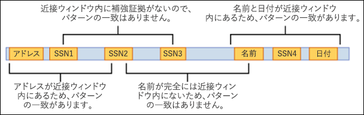
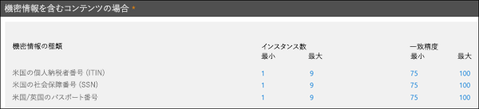
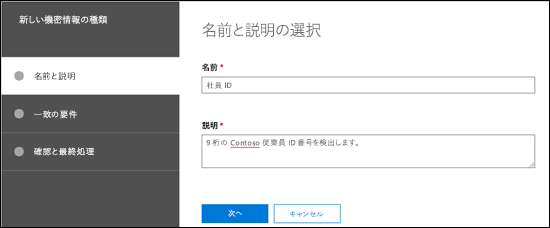
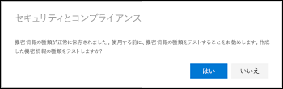
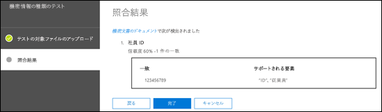

# カスタムの機密情報の種類を作成するCreate a custom sensitive information type

Office 365 のデータ損失防止 (DLP) には、DLP ポリシーですぐに使用できる組み込みの[機密情報の種類](what-the-sensitive-information-types-look-for.md)が多数含まれています。これらの組み込みの種類は、クレジット カード番号、銀行口座番号、パスポート番号などの特定と保護に役立ちます。Data loss prevention (DLP) in Office 365 includes many built-in [sensitive information types](what-the-sensitive-information-types-look-for.md) that are ready for you to use in your DLP policies. These built-in types can help identify and protect credit card numbers, bank account numbers, passport numbers, and more. 

ただし、組織に固有の形式を使用する従業員 ID やプロジェクト番号など、さまざまな種類の機密情報を特定して保護する必要がある場合は、カスタムの機密情報の種類を作成することができます。But if you need to identify and protect a different type of sensitive information (for example, employee IDs or project numbers that uses a format specific to your organization) you can create a custom sensitive information type.

カスタムの機密情報の種類の基本的な部分は次のとおりです。The fundamental parts of a custom sensitive information type are:

- **プライマリ パターン**: 従業員 ID 番号、プロジェクト番号など。これは通常、正規表現 (RegEx) によって識別されますが、キーワード リストにもできます。**Primary pattern**: employee ID numbers, project numbers, etc. This is typically identified by a regular expression (RegEx), but it can also be a list of keywords.

- **追加の証拠**: 9 桁の従業員 ID 番号を探していると仮定します。9 桁の数字がすべて従業員 ID 番号ではないので、「従業員」、「社員証」、「ID」などのキーワードや追加の正規表現を基にして、別のテキスト パターンを検索できます。この補強証拠 (_補強_または_裏付け_証拠とも呼ばれる) は、コンテンツに含まれる 9 桁の数字が実際に従業員 ID 番号である可能性を高めます。**Additional evidence**: Suppose you're looking for a nine-digit employee ID number. Not all nine-digit numbers are employee ID numbers, so you can look for additional text: keywords like "employee", "badge", "ID", or other text patterns based on additional regular expressions. This supporting evidence (also known as _supporting_ or _corroborative_ evidence) increases the likelihood that nine-digit number found in content is really an employee ID number.

- **文字の近接**: プライマリ パターンと補強証拠が互いに近いほど、検出されたコンテンツが探しているものになる可能性が高くなります。次の図に示すように、プライマリ パターンと補強証拠との文字の距離 (_近接ウィンドウ_とも呼ばれる) を指定できます。**Character proximity**: It makes sense that the closer the primary pattern and the supporting evidence are to each other, the more likely the detected content is going to be what you're looking for. You can specify the character distance between the primary pattern and the supporting evidence (also known as the _proximity window_) as shown in the following diagram:

    

- **信頼レベル**: 持っている補強証拠が多ければ多いほど、探している機密情報と一致する可能性が高くなります。より多くの証拠を使用して検出された一致には、より高いレベルの信頼を割り当てることができます。**Confidence level**: The more supporting evidence you have, the higher the likelihood that a match contains the sensitive information you're looking for. You can assign higher levels of confidence for matches that are detected by using more evidence.

  パターンを満たす場合は、数と信頼度が返され、DLP ポリシーの条件に使用できます。機密情報の種類を検出する条件を DLP ポリシーに追加する場合、次の図に示すように、数と信頼度を編集できます。When satisfied, a pattern returns a count and confidence level, which you can use in the conditions in your DLP policies. When you add a condition for detecting a sensitive information type to a DLP policy, you can edit the count and confidence level as shown in the following diagram:

    

次のオプションを使用して、Office 365 セキュリティ/コンプライアンス センターでカスタムの機密情報の種類を作成できます。To create custom sensitive information types in the Office 365 Security & Compliance Center, you have the following options:

- **UI を使用**: この方法は簡単で高速ですが、PowerShell よりも構成オプションが少なくなります。このトピックの残りの部分では、これらの手順について説明します。**Use the UI**: This method is easier and faster, but you have less configuration options than PowerShell. The rest of this topic describes these procedures.

- **PowerShell を使用**: この方法では、まず機密情報の種類を 1 つ以上含む XML ファイル (_ルール パッケージ_と呼ばれる) を作成し、次に、PowerShell を使用してルール パッケージをインポートします (ルール パッケージのインポートは、ルール パッケージの作成と比べて簡単です)。この方法は UI より格段複雑ですが、より多くの構成オプションを使用できます。手順については、「[Office 365 セキュリティ/コンプライアンス センターの PowerShell でカスタムの機密情報の種類を作成する](create-a-custom-sensitive-information-type-in-scc-powershell.md)」を参照してください。**Use PowerShell**: This method requires that you first create an XML file (called a _rule package_) that contains one or more sensitive information types, and then you use PowerShell to import the rule package (importing the rule package is trivial compared to creating the rule package. This method is much more complex than the UI, but you have more configuration options. For instructions, see [Create a custom sensitive information type in Office 365 Security & Compliance Center PowerShell](create-a-custom-sensitive-information-type-in-scc-powershell.md).

次の表で主な違いについて説明します。The key differences are described in the following table:

|**UI でのカスタムの機密情報の種類****Custom sensitive information types in the UI**|**PowerShell でのカスタムの機密情報の種類****Custom sensitive information types in PowerShell**|
|:-----|:-----|
|名前と説明は 1 つの言語。Name and Description are in one language.|名前と説明は複数の言語をサポート。Supports multiple languages for Name and Description.|
|1 つのパターンをサポート。Supports one pattern.|複数のパターンをサポート。Supports multiple patterns.|
|補強証拠は次のものにできます。Supporting evidence can be:  • 正規表現• Regular expressions  • キーワード• Keywords  • キーワード辞書• Keyword dictionaries|補強証拠は次のものにできます。Supporting evidence can be:  • 正規表現• Regular expressions  • キーワード• Keywords  • キーワード辞書• Keyword dictionaries  • [組み込み DLP 関数](what-the-dlp-functions-look-for.md)• [Built-in DLP functions](what-the-dlp-functions-look-for.md)|
|カスタムの機密情報の種類が Microsoft.SCCManaged.CustomRulePack という名前のルール パッケージに追加されます。Custom sensitive information types are added to the rule package named Microsoft.SCCManaged.CustomRulePack|カスタムの機密情報の種類を含む最大 10 個のルール パッケージを作成することができます。You can create up to 10 rule packages that contain custom sensitive information types.|
|パターンの一致には、プライマリ パターンとすべての補強証拠 (暗黙の AND 演算子を使用) の検出が必要です。Pattern match requires the detection of the primary pattern and all supporting evidence (the implicit AND operator is used).|パターンの一致には、プライマリ パターンと構成可能な補強証拠の量 (暗黙の AND および OR 演算子が使用可能) の検出が必要です。Pattern match requires the detection of the primary pattern and a configurable amount of supporting evidence (implicit AND and OR operators can be used).|

## はじめに把握しておくべき情報What do you need to know before you begin?

- セキュリティ/コンプライアンス センターを開くには、「[Office 365 のセキュリティ センターとコンプライアンス センターに移動する](go-to-the-securitycompliance-center.md)」を参照してください。To open the Security & Compliance Center, see [Go to the Office 365 Security & Compliance Center](go-to-the-securitycompliance-center.md).

- カスタムの機密情報の種類では、正規表現 (RegEx) に精通している必要があります。テキストの処理に使用される Boost.RegEx (旧称 RegEx++) エンジンの詳細については、「[Boost.Regex 5.1.3](https://www.boost.org/doc/libs/1_68_0/libs/regex/doc/html/)」を参照してください。Custom sensitive information types require familiarity with regular expressions (RegEx). For more information about the Boost.RegEx (formerly known as RegEx++) engine that's used for processing the text, see [Boost.Regex 5.1.3](https://www.boost.org/doc/libs/1_68_0/libs/regex/doc/html/).

  Microsoft カスタマー サービス & サポートは、カスタムのコンテンツ一致定義 (カスタムの分類や正規表現パターンの作成) の提供を支援できません。サポート エンジニアは、機能の制限付きサポート (たとえば、テスト目的でサンプルの正規表現パターンを提供したり、期待どおりにトリガーされない既存の正規表現パターンのトラブルシューティングを支援するなど) は提供できますが、カスタムのコンテンツ一致の開発がユーザーの要件を満たしたり、義務を果たすことを確約できるわけではありません。Microsoft Customer Service & Support can't assist with providing custom content-matching definitions (creating custom classifications or regular expression patterns). Support engineers can provide limited support for the feature (for example, providing sample regular expression patterns for testing purposes, or assisting with troubleshooting an existing regular expression pattern that's not triggering as expected), but can't provide assurances that any custom content-matching development will fulfill your requirements or obligations.

- DLP は検索クローラーを使用して、SharePoint Online サイトと OneDrive for Business サイトの機密情報を識別および分類します。既存のコンテンツで新しいカスタムの機密情報の種類を特定するには、コンテンツを再クロールする必要があります。コンテンツはスケジュールに基づいて再クロールされますが、サイト コレクション、リスト、またはライブラリのコンテンツは手動で再クロールできます。詳細については、「[サイト、ライブラリ、またはリストのクロールとインデックス再作成を手動で要求する](https://docs.microsoft.com/sharepoint/crawl-site-content)」を参照してください。DLP uses the search crawler to identify and classify sensitive information in SharePoint Online and OneDrive for Business sites. To identify your new custom sensitive information type in existing content, the content must be recrawled. Content is recrawled based on a schedule, but you can manually recrawl content for a site collection, list, or library. For more information, see [Manually request crawling and re-indexing of a site, a library or a list](https://docs.microsoft.com/sharepoint/crawl-site-content).

## セキュリティ/コンプライアンス センターでカスタムの機密情報の種類を作成するCreate custom sensitive information types in the Security & Compliance Center

セキュリティ/コンプライアンス センターで、**[分類]** \> **[機密情報の種類]** に移動して **[作成]** をクリックします。In the Security & Compliance Center, go to **Classifications** \> **Sensitive info types** and click **Create**.

各設定については説明するまでもありませんが、ウィザードの関連ページには説明が記載されています。The settings are fairly self-evident, and are explained on the associate page of the wizard:

- **[名前]****Name**

- **[説明]****Description**

- **[近接性]****Proximity**

- **[信頼度]****Confidence level**

- **[プライマリ パターン要素]** (キーワード、正規表現、またはディクショナリ)**Primary pattern element** (keywords, regular expression, or dictionary)

- オプションの **[補強パターン要素]** (キーワード、正規表現、またはディクショナリ) および対応する **[最小コスト]** 値。Optional **Supporting pattern elements** (keywords, regular expression, or dictionary) and a corresponding **Minimum cost** value.

この例のシナリオ: キーワードの「従業員」、「ID」および「社員証」と共に、コンテンツに含まれる 9 桁の従業員番号を検出するために、カスタムの機密情報の種類が必要になりました。このカスタムの機密情報の種類を作成するには、次の手順を実行します。Here's a scenario: You want a custom sensitive information type that detects 9-digit employee numbers in content, along with the keywords "employee" "ID" and "badge". To create this custom sensitive information type, do the following steps:

1. セキュリティ/コンプライアンス センターで、**[分類]** \> **[機密情報の種類]** に移動して **[作成]** をクリックします。In the Security & Compliance Center, go to **Classifications** \> **Sensitive info types** and click **Create**.

    ![機密情報の種類と [作成] ボタンの場所](media/scc-cust-sens-info-type-new.png)

2. **[名前と説明の選択]** ページが開いたら、次の値を入力します。In the **Choose a name and description** page that opens, enter the following values:

  - **[名前]**: 従業員 ID。**Name**: Employee ID.

  - **[説明]**: 9 桁の Contoso 従業員 ID 番号を検出します。**Description** Detect nine-digit Contoso employee ID numbers.

    

    完了したら、**[次へ]** をクリックします。When you're finished, click **Next**.

3. **[一致の要件]** ページが開いたら、**[要素の追加]** をクリックして、次の設定を構成します。In the **Requirements for matching** page that opens, click **Add an element** configure the following settings:

    - **次を含むコンテンツを検出する**:**Detect content containing**:
 
      a. **[これらのいずれか]** をクリックして、**[正規表現]** を選択します。a. Click **Any of these** and select **Regular expression**.

      b. 正規表現ボックスに、`(\s)(\d{9})(\s)` (空白文字で囲まれた 9 桁の数字) を入力します。b. In the regular expression box, enter `(\s)(\d{9})(\s)` (nine-digit numbers surrounded by white space).
  
    - **[補強要素]**: **[補強要素の追加]** をクリックして、**[このキーワード リストを含める]** を選択します。**Supporting elements**: Click **Add supporting elements** and select **Contains this keyword list**.

    - **[このキーワード リストを含める]** 領域が表示されたら、次の設定を構成します。In the **Contains this keyword list** area that appears, configure the following settings:

      - **[キーワード リスト]**: 次の値を入力します: 従業員、ID、社員証。**Keyword list**: Enter the following value: employee,ID,badge.

      - **[最低数]**: 既定値 1 のままにします。**Minimum count**: Leave the default value 1.

    - 既定の **[信頼度]** 値 60 のままにします。Leave the default **Confidence level** value 60. 

    - 既定の **[文字の近接]** 値 300 のままにします。Leave the default **Character proximity** value 300.

    ![[一致の要件] ページ](media/scc-cust-sens-info-type-new-reqs.png)

    完了したら、**[次へ]** をクリックします。When you're finished, click **Next**.

4. **[確認と最終処理]** ページが開いたら、設定を確認して **[完了]** をクリックします。On the **Review and finalize** page that opens, review the settings and click **Finish**.

    ![[確認と最終処理] ページ](media/scc-cust-sens-info-type-new-review.png)

5. 次のページでは、[**はい**] をクリックして新しいカスタムの機密情報の種類をテストするように促されます。詳細については、「[セキュリティ/コンプライアンス センターでカスタムの機密情報の種類をテストする](#test-custom-sensitive-information-types-in-the-security--compliance-center)」を参照してください。ルールのテストを後で行うには、[**いいえ**] をクリックします。The next page encourages you to test the new custom sensitive information type. For more information, see Test custom sensitive information types in the Security & Compliance Center. Otherwise, click Cancel.

    

### 正常な動作を確認する方法How do you know this worked?

新しい機密情報の種類が正常に作成されたことを確認するには、次に示す手順のいずれかを実行します。To verify that you've successfully created a new sensitive information type, do any of the following steps:

  - **[分類]** \> **[機密情報の種類]** に移動して、新しいカスタムの機密情報の種類が一覧に表示されていることを確認します。Go to **Classifications** \> **Sensitive info types** and verify the new custom sensitive information type is listed.

  - 新しいカスタムの機密情報の種類をテストします。詳細については、「[セキュリティ/コンプライアンス センターでカスタムの機密情報の種類をテストする](#test-custom-sensitive-information-types-in-the-security--compliance-center)」を参照してください。Test the new custom sensitive information type. For more information, see [Test custom sensitive information types in the Security & Compliance Center](#test-custom-sensitive-information-types-in-the-security--compliance-center).

## セキュリティ/コンプライアンス センターでカスタムの機密情報の種類を変更するModify custom sensitive information types in the Security & Compliance Center

**注**:**Notes**:

- カスタムの機密情報の種類のみを変更できます。組み込みの機密情報の種類は変更できません。ただし、PowerShell を使用して組み込みの機密情報の種類をエクスポートし、エクスポートしたものをカスタムの機密情報の種類としてインポートすることができます。詳細については、「[組み込みの機密情報の種類をカスタマイズする](customize-a-built-in-sensitive-information-type.md)」を参照してください。Note: You can only modify custom sensitive information types; you can't modify built-in sensitive information types. But you can use PowerShell to export built-in custom sensitive information types, customize them, and import them as custom sensitive information types. For more information, see [Customize a built-in sensitive information type](customize-a-built-in-sensitive-information-type.md).

- 変更できるのは、UI で作成したカスタムの機密情報の種類のみです。カスタムの機密情報の種類のルール パッケージをインポートするのに [PowerShell プロシージャ](create-a-custom-sensitive-information-type-in-scc-powershell.md)を使用した場合、エラーが表示されます。You can only modify custom sensitive information types that you created in the UI. If you used the [PowerShell procedure](create-a-custom-sensitive-information-type-in-scc-powershell.md) to import a custom sensitive information type rule package, you'll get an error.

セキュリティ/コンプライアンス センターで、**[分類]** \> **[機密情報の種類]** に移動して、変更するカスタムの機密情報の種類を選択し、[**編集**] をクリックします。In the Security & Compliance Center, go to **Classifications** \> **Sensitive info types** and select the custom sensitive information type that you want to modify.

  ![機密情報の種類と [編集] ボタンの場所](media/scc-cust-sens-info-type-edit.png)

ここでは、セキュリティ/コンプライアンス センターでカスタムの機密情報の種類を作成したときと同じオプションを選択できます。詳細については、「[セキュリティ/コンプライアンス センターでカスタムの機密情報の種類を作成する](#create-custom-sensitive-information-types-in-the-security--compliance-center)」を参照してください。The same options are available here as when you created the custom sensitive information type in the Security & Compliance Center. For more information, see [Create custom sensitive information types in the Security & Compliance Center](#create-custom-sensitive-information-types-in-the-security--compliance-center).

### 正常な動作を確認する方法How do you know this worked?

機密情報の種類が正常に変更されたことを確認するには、次に示す手順のいずれかを実行します。To verify that you've successfully modified a sensitive information type, do any of the following steps:

  - **[分類]** \> **[機密情報の種類]** に移動して、変更したカスタムの機密情報の種類のプロパティを確認します。Go to **Classifications** \> **Sensitive info types** to verify the properties of the modified custom sensitive information type. 

  - 変更したカスタムの機密情報の種類をテストします。詳細については、「[セキュリティ/コンプライアンス センターでカスタムの機密情報の種類をテストする](#test-custom-sensitive-information-types-in-the-security--compliance-center)」を参照してください。Test the modified custom sensitive information type. For more information, see [Test custom sensitive information types in the Security & Compliance Center](#test-custom-sensitive-information-types-in-the-security--compliance-center).

## セキュリティ/コンプライアンス センターでカスタムの機密情報の種類を削除するRemove custom sensitive information types in the Security & Compliance Center 

**注**:**Notes**:

- カスタムの機密情報の種類のみを削除できます。組み込みの機密情報の種類は削除できません。You can only remove custom sensitive information types; you can't remove built-in sensitive information types.

- カスタムの機密情報の種類を削除する前に、その機密情報の種類を参照している DLP ポリシーまたは Exchange メール フロー ルール (別名: トランスポート ルール) がないことを確認してください。Before your remove a custom sensitive information type, verify that no DLP policies or Exchange mail flow rules (also known as transport rules) still reference the sensitive information type.

1. セキュリティ/コンプライアンス センターで、**[分類]** \> **[機密情報の種類]** に移動して、削除するカスタムの機密情報の種類を 1 つ以上選択します。In the Security & Compliance Center, go to **Classifications** \> **Sensitive info types** and select one or more custom sensitive information types that you want to remove.

2. ポップアップが開いたら、**[削除]** (複数選択した場合は **[機密情報の種類の削除]**) をクリックします。In the fly-out that opens, click **Delete** (or **Delete sensitive info types** if you selected more than one).

    ![機密情報の種類と [削除] ボタンの場所](media/scc-cust-sens-info-type-delete.png)

3. 警告メッセージが表示されたら、**[はい]** をクリックします。In the warning message that appears, click **Yes**.

### 正常な動作を確認する方法How do you know this worked?

カスタムの機密情報の種類が正常に削除されたことを確認するには、**[分類]** \> **[機密情報の種類]** に移動して、そのカスタムの機密情報の種類が一覧に表示されていないことを確認します。To verify that you've successfully removed a custom sensitive information type, go to **Classifications** \> **Sensitive info types** to verify the custom sensitive information type is no longer listed.

## セキュリティ/コンプライアンス センターでカスタムの機密情報の種類をテストするTest custom sensitive information types in the Security & Compliance Center

1. セキュリティ/コンプライアンス センターで、**[分類]** \> **[機密情報の種類]** に移動します。In the Security & Compliance Center, go to **Classifications** \> **Sensitive info types**.

2. テストするカスタムの機密情報の種類を 1 つ以上選択します。ポップアップが開いたら、**[種類のテスト]** (複数選択した場合は **[機密情報の種類のテスト]**) をクリックします。Select one or more custom sensitive information types to test. In the fly-out that opens, click **Test type** (or **Test sensitive info types** if you selected more than one).

    ![機密情報の種類と [種類のテスト] ボタンの場所](media/scc-cust-sens-info-type-test.png)

3. [**テストの対象ファイルのアップロード**] ページが開いたら、ファイルをドラッグ アンド ドロップするか、または [**参照**] をクリックしてファイルを選択し、テストの対象ドキュメントをアップロードします。On the page that opens, upload a document to test by dragging and dropping a file or by clicking **Browse** and selecting a file.

    ![[テストの対象ファイルのアップロード] ページ](media/scc-cust-sens-info-type-test-upload.png)

4. **[テスト]** ボタンをクリックして、ファイル内のパターン マッチについてドキュメントをテストします。Click the **Test** button to test the document for pattern matches in the file.

5. [**照合結果**] ページで、[**完了**] をクリックします。On the **Completing** page, click **Finish**.

    