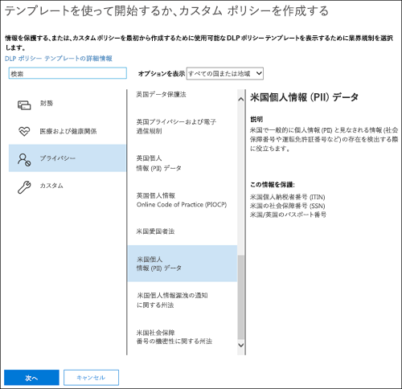
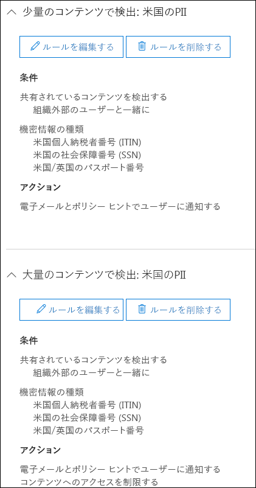
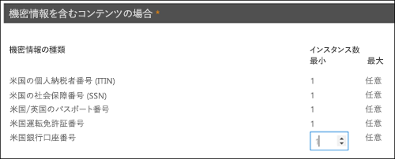

# テンプレートから DLP ポリシーを作成する

DLP ポリシーの使用を開始するにあたり、最も簡単かつ一般的な方法は、Office 365 に含まれているいずれかのテンプレートを使用することです。それらのテンプレートをそのまま使用することもできますし、組織の特定のコンプライアンス要件に合うようにルールをカスタマイズすることも可能です。
  
Office 365 には 40 を超えるすぐに使用可能なテンプレートが備わっていて、広範囲におよぶ一般的な規定やビジネス ポリシーのニーズに対応できます。たとえば、以下を対象とした DLP ポリシー テンプレートがあります。
  
- グラム リーチ ブライリー法 (GLBA)
    
- クレジットカード業界のデータ セキュリティ スタンダード (PCI-DSS)
    
- 米国の個人を特定できる情報 (米国 PII)
    
- 米国の医療保険法 (HIPAA)
    
既存のルールのいずれかを変更したり新しいルールを追加したりして、テンプレートを細かく調整することができます。たとえば、新しい種類の機密情報をルールに追加する、トリガーしにくくするまたはトリガーしやすくするためにルール内のカウントを変更する、業務上の正当な理由を提供することでルール内のアクションをユーザーが無効にできるようにする、または通知およびインシデント レポートの送信先を変更することができます。DLP ポリシー テンプレートは、多くの一般的なコンプライアンス シナリオにとって柔軟性の高い開始点です。
  
カスタム テンプレートを選択することもできます。カスタム テンプレートには既定のルールがなく、組織の特定のコンプライアンス要件を満たすようにゼロから DLP ポリシーを構成します。
  
## 例: すべての OneDrive for Business サイトにある機密情報を識別し、組織外のユーザー用によるアクセスを制限する

OneDrive for Business アカウントを使用すると、組織内のユーザーがドキュメントに関して共同作業を行ったり共有したりすることが簡単になります。ただし、コンプライアンス担当者は一般に、OneDrive for Business アカウントに格納されている機密情報が組織外のユーザーと誤って共有される事態について心配します。DLP ポリシーは、このリスクの軽減に役立ちます。
  
この例では、個人納税者識別番号 (ITIN)、社会保障番号、および米国のパスポート番号が含まれている米国の個人情報データを識別する DLP ポリシーを作成します。テンプレートを使用して開始して、組織のコンプライアンス要件を満たすようにテンプレートを変更します。具体的には、以下の作業を行います。
  
- 2 種類の機密情報 (米国の銀行口座番号および米国の運転免許番号) を追加し、DLP ポリシーがさらに多くの機密データを保護できるようにします。
    
- ポリシーの機密性をさらに高めて、機密情報が一度でも発生したら、外部ユーザーのアクセスを制限するようにします。
    
- 業務上の理由を提供したり、誤検知のレポートを作成したりすることによって、ユーザーがアクションを上書きできるようにします。これにより、DLP ポリシーが作業の邪魔になり組織内のユーザーを妨害することがないようになります。その場合、ユーザーは機密情報を共有するための正当な業務上の理由を提供します。
    
### テンプレートから DLP ポリシーを作成する

1. [https://protection.office.com](https://protection.office.com) に移動します。
    
2. 職場または学校のアカウントを使用して、Office 365 にサインインします。これで、Office 365 セキュリティ/コンプライアンス センターに移動します。
    
3. セキュリティ/コンプライアンス センターの左側のナビゲーションで、**[データ損失防止]** \> **[ポリシー]** \> **[+ ポリシーの作成]** の順に移動します。
    
    ![[ポリシーの作成] ボタン](media/b1e48a08-92e2-47ca-abdc-4341694ddc7c.png)
  
4. 必要な種類の機密情報を保護する DLP ポリシー テンプレートを選び、**[次へ]** を選択します。
    
    この例では、**[プライバシー]** \> **[米国の個人情報 (PII) データ]** と選択します。このテンプレートには、保護対象の機密情報のほとんどの種類が既に含まれており、後ほど 2 つだけ追加します。 
    
    テンプレートを選択するときに、右側の説明を読んで、テンプレートが保護する機密情報の種類を確認できます。
    
    
  
5. ポリシーの名前を設定し、**[次へ]** を選びます。
    
6. DLP ポリシーで保護する場所を選ぶには、次のいずれかを行います。
    
  - **[Office 365 のすべての場所]** \> **[次へ]** と選びます。
    
  - **[自分で特定の場所を選択する]** \> **[次へ]** と選びます。この例では、これを選びます。
    
    すべての Exchange メールやすべての OneDrive アカウントなど、特定の場所全体を含めたり除外したりするには、その場所の **[状態]** をオンまたはオフに切り替えます。 
    
    特定の SharePoint サイトまたは OneDrive for Business アカウントだけを含めるには、**[状態]** をオンに切り替えた後、**[含める]** の下のリンクをクリックして、特定のサイトまたはアカウントを選びます。ポリシーをサイトに適用すると、そのポリシーに構成されたルールがそのサイトのすべてのサブサイトに自動的に適用されます。 
    
    
  
    この例では、すべての OneDrive for Business アカウントに保存されている機密情報を保護するために、**Exchange メール**と **SharePoint サイト**の両方の **[状態]** をオフにし、**OneDrive アカウント**の **[状態]** はそのままにします。
    
7. **[詳細設定を使う]** \> **[次へ]** の順に選びます。
    
8. DLP ポリシー テンプレートには、条件付きの定義済みルールと、特定の種類の機密情報を検出して適用するアクションが含まれています。既存のルールのいずれかを編集、削除、またはオフにするか、新しいルールを追加できます。完了したら、**[次へ]** をクリックします。
    
    
  
    この例の場合、米国 PII データ テンプレートには、次の 2 つの定義済みルールが含まれています。
    
  - **少量のコンテンツを検出 - 米国の PII**: このルールは、3 種類の機密情報 (ITIN、SSN、米国のパスポート番号) の発生回数がそれぞれ 1 回から 10 回のファイルを検索し、ファイルが組織外の人と共有されている場所を検索します。検出されると、ルールに従って、プライマリ サイト コレクション管理者、ドキュメントの所有者、ドキュメントを最後に変更したユーザーにメール通知が送信されます。 
    
  - **大量のコンテンツで検出: 米国の PII**: このルールは、同じ 3 種類の機密情報の発生回数がそれぞれ 10 回を超えるファイルを検索し、ファイルが組織外の人と共有されている場所を検索します。検出されると、この場合もメール通知が送信され、さらに、ファイルへのアクセスが制限されます。OneDrive for Business アカウントのコンテンツの場合、これは、プライマリ サイト コレクション管理者、ドキュメントの所有者、ドキュメントを最後に変更したユーザーを除くすべてのユーザーについて、ドキュメントへのアクセス許可が制限されることを意味します。 
    
    組織の要件によっては、ルールが簡単にトリガーされるようにし、機密情報が一度出現するだけで外部ユーザーからのアクセスをブロックするようにできます。こうしたルールを調べた後、高カウントおよび低カウントのルールが不要で、必要となるのは、いずれかの機密情報が検出された場合にアクセスをブロックするというルール 1 つだけであることがわかる場合もあります。
    
    したがって、**[少量のコンテンツを検出 - 米国の PII]** という名前のルールを展開して、**[ルールの削除]** を選びます。
    
    ![[ルールの削除] ボタン](media/bc36f7d2-0fae-4af1-92e8-95ba51077b12.png)
  
9. この例では、2 種類の機密情報 (米国の銀行口座番号と米国の運転免許証番号) を追加して、ユーザーがルールを無効にして、カウントを任意の発生回数に変更できるようにします。これは 1 つのルールを編集することですべて行えます。したがって、**[大量のコンテンツを検出 - 米国の PII]** \> **[ルールの編集]** の順に選びます。
    
    ![[ルールの編集] ボタン](media/eaf54067-4945-4c98-8dd6-fb2c5d6de075.png)
  
10. 機密情報の種類を追加するには、**[条件]** セクションで **[種類の追加または変更]** を選びます。次に、**[種類の追加または変更]** で、**[追加]**、**[米国の銀行口座番号]**、**[米国の運転免許番号]**、**[追加]**、**[完了]** の順に選びます。
    
    ![[種類の追加または変更] のオプション](media/c6c3ae86-f7db-40a8-a6e4-db11692024be.png)
  
    ![[種類の追加または変更] ウィンドウ](media/fdbb96af-b914-4a6c-a97b-bbd014689965.png)
  
11. カウント (ルールのトリガーに必要な機密情報のインスタンスの数) を変更するには、**[インスタンス数]** で、各種類に対して**最小**値を選び、1 を入力します。最小カウントを空にすることはできません。最大カウントは空でもかまいません。空の**最大**値は**すべて**に変換されます。
    
    完了すると、すべての種類の機密情報の最小カウントが **1** になり、最大カウントが**すべて**になるはずです。つまり、この種類の機密情報が発生すると、この条件が満たされます。
    
    
  
12. 最終的なカスタマイズとして、ユーザーに業務上の正当な理由があるか、誤検知である場合に、DLP ポリシーがこれらのユーザーの業務の妨げにならないようにするには、ユーザー通知にブロック アクションを無効にするオプションを含めることができます。
    
    **[ユーザー通知]** セクションでは、テンプレートのこのルールに対して、メール通知とポリシー ヒントが既定でオンになっていることがわかります。 
    
    **[ユーザーによる上書き]** セクションでは、業務上の正当な理由に対して上書きはオンになっていますが、誤検知の報告に対しては上書きがオンになっていません。**[誤検知として報告された場合にルールを自動的に上書きします]** を選びます。
    
    ![[ユーザー通知] セクションと [ユーザーによる上書き] セクション](media/62720e7a-a939-4c03-b414-67748f3d64a0.png)
  
13. ルール エディターの上部にあるこのルールの名前を既定の **[大量のコンテンツを検出 - 米国の PII]** から **[任意のコンテンツで検出: 米国の PII]** に変更します。これは、機密情報の種類が発生すればルールがトリガーされるようになったためです。 
    
14. ルール エディターの下部にある **[保存]** をクリックします。
    
15. このルールの条件とアクションを確認して、**[次へ]** をクリックします。
    
    右側のルールの **[状態]** の切り替えに注意してください。ポリシー全体をオフにすると、そのポリシーに含まれるすべてのルールもオフになります。しかしここでは、ポリシー全体をオフにすることなく、特定のルールをオフにできます。これは多数の誤検知を生成するルールを調査する必要がある場合に便利です。 
    
16. 次のページでは、以下の内容を読み、理解したうえで、ルールをオンにするか、最初にテストするかを選んで **[次へ]** をクリックします。
    
     DLP ポリシーを作成する前に、段階的にロールアウトして、影響を評価して有効性をテストしてから、完全に適用することを検討してください。たとえば、ユーザーが業務を行うのに必要な数千のドキュメントへのアクセスを、新しい DLP ポリシーで意図せずブロックすることは望まないはずです。 
    
    大きな影響を与える可能性が高い DLP ポリシーを作成しているときは、次の順序に従うことをお勧めします。
    
17. ポリシー ヒントなしのテスト モードで開始した後、DLP レポートを使用して影響を評価します。DLP レポートを使用すると、ポリシー一致の回数、場所、種類、および重要度を把握できます。その結果に基づいて、必要に応じてルールを細かく調整できます。テスト モードの DLP ポリシーは、組織の従業員の生産性に影響を与えません。 
    
18. 通知とポリシー ヒントを有効にしたテスト モードに移行し、コンプライアンス ポリシーについてのユーザーのトレーニングと、適用される予定のルールへの対応準備を開始できるようにします。この段階では、ルールをさらに適切にできるように、誤検知の報告をユーザーに要求できます。
    
19. ポリシーを有効にし、ルールが適用されてコンテンツが保護されるようにします。DLP レポート、インシデント レポート、通知を引き続き監視して、結果が意図したとおりであるか確認します。 
    
    
  
20. このポリシーの設定を確認して、**[作成]** を選びます。
    
DLP ポリシーを作成して有効にした後、SharePoint Online サイトや OneDrive for Business アカウントなどのコンテンツ ソースに展開すると、ポリシーによって対象コンテンツへのルールの適用が自動的に開始されます。
  
## DLP ポリシーの状態を表示する

セキュリティ/コンプライアンス センターの **[ポリシー]** ページの **[データ損失防止]** セクションでいつでも DLP ポリシーの状態を見ることができます。ここでは、ポリシーが正常に有効化または無効化されたかどうか、またはポリシーがテスト モードかどうかといった、重要な情報を確認できます。 
  
以下に、さまざまな状態とその意味を示します。
  
|**状態**|**説明**|
|:-----|:-----|
|**オンにしています...**   |ポリシーは、それに含まれるコンテンツ ソースに展開されています。ポリシーは、すべてのソースでまだ適用されていません。    |
|**テスト中、通知あり**   |ポリシーはテスト モードです。ルール内のアクションは適用されませんが、ポリシーの一致は収集され、DLP レポートを使用して表示することができます。ポリシーの一致についての通知は、指定した受信者に送信されます。    |
|**テスト中、通知なし**   |ポリシーはテスト モードです。ルール内のアクションは適用されませんが、ポリシーの一致は収集され、DLP レポートを使用して表示することができます。ポリシーの一致についての通知は、指定した受信者に送信されません。    |
|**オン**   |ポリシーはアクティブであり、適用されています。ポリシーは、すべてのコンテンツ ソースに正常に展開されました。    |
|**オフにしています...**   |ポリシーは、それに含まれるコンテンツ ソースから削除されています。一部のソースでは、ポリシーがまだアクティブで適用されている可能性があります。ポリシーをオフにするには、最高 45 分かかる場合があります。    |
|**オフ**   |ポリシーはアクティブではなく、適用されていません。ポリシーの設定 (ソース、キーワード、期間など) は保存されています。    |
|**削除しています...**   |ポリシーは削除処理中です。ポリシーはアクティブではなく、適用されていません。    |
   
## DLP ポリシーをオフにする

いつでも DLP ポリシーを編集してオフにすることができます。ポリシーをオフにすると、ポリシーのすべてのルールが無効になります。
  
DLP ポリシーを編集またはオフにするには、**[ポリシー]** ページでポリシーを選び、**[ポリシーの編集]** を選びます。
  
![[ポリシーの編集] ボタン](media/ce319e92-0519-44fe-9507-45a409eaefe4.png)
  
さらに、前述したように、ポリシーを編集してから、そのルールの **[状態]** をオフに切り替えることで、各ルールを個別にオフにできます。 
  
## 詳細情報

- [データ損失防止ポリシーの概要](data-loss-prevention-policies.md)
    
- [通知を送信して、DLP ポリシーのポリシーのヒントを表示する](use-notifications-and-policy-tips.md)
    
- [FCI または他のプロパティを含むドキュメントを保護するために DLP ポリシーを作成する](protect-documents-that-have-fci-or-other-properties.md)
    
- [DLP ポリシー テンプレートに含まれるもの](what-the-dlp-policy-templates-include.md)
    
- [機密情報の種類インベントリ](what-the-sensitive-information-types-look-for.md)
    

