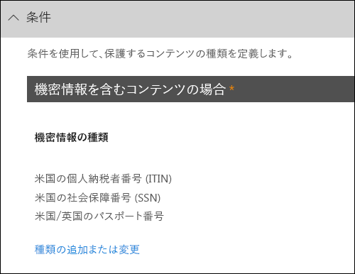

# テンプレートからの DLP ポリシーの作成

DLP ポリシーを開始する最も簡単で最も一般的な方法では、Office 365 に含まれているテンプレートのいずれかを使用します。同様に、これらのテンプレートのいずれかを使用したり、組織の特定のコンプライアンス要件を満たすためにルールをカスタマイズできます。
  
Office 365 には 40 を超えるすぐに使用可能なテンプレートが備わっていて、広範囲におよぶ一般的な規定やビジネス ポリシーのニーズに対応できます。たとえば、以下を対象とした DLP ポリシー テンプレートがあります。
  
- グラム リーチ ブライリー法 (GLBA)
    
- クレジット カード業界データ セキュリティ基準 (PCI DSS)
    
- 米国の個人情報 (U.S. PII)
    
- 米国の医療保険法 (HIPAA)
    
既存のルールを変更したり、新しいルールを追加したりして、テンプレートを調整できます。たとえば、ルールに新しい種類の機密情報を追加したり、トリガーの難度を変更するためにルール内のカウントを変えたり、業務上の理由を提供することによってルールのアクションをユーザーが上書きできるようにしたり、通知とインシデント レポートの通知先を変更したりできます。DLP ポリシー テンプレートは、多くの一般的なコンプライアンス シナリオの柔軟な開始点となります。
  
カスタム テンプレートを選択することもできます。カスタム テンプレートには既定のルールがなく、組織の特定のコンプライアンス要件を満たすようにゼロから DLP ポリシーを構成します。
  
## 例: ビジネス サイトのすべての OneDrive の間で機密情報を識別し、組織外のユーザーのアクセスを制限します。

ビジネス アカウント用の OneDrive やすく人の共同作業し、ドキュメントを共有する組織全体にわたって。コンプライアンス担当役員の一般的な懸念事項は、ビジネス アカウントを OneDrive に保存された機密情報を誤って、組織外のユーザーと共有可能性があります。DLP ポリシーは、このリスクを軽減できます。
  
この例では、米国の個人情報データは、個々 の納税者識別番号 (ITIN)、社会保障番号、および米国のパスポート番号が含まれていますを識別する DLP ポリシーを作成します。テンプレートを使用して開始することし、組織のコンプライアンス要件に対応するテンプレートを変更してみましょう-具体的には、ことがわかります。
  
- いくつかの重要な information—U.S です。 銀行口座番号と u. s. 運転免許証番号の種類を追加: DLP ポリシーは、機密性の高いデータのさらに多くを保護できるようにします。
    
- ようにポリシー、重要度の高い機密情報の 1 回の発生は、外部ユーザーのアクセスを制限するのには十分です。
    
- ビジネス ・ ジャスティフィケーションを提供することや、誤検出を報告して動作をオーバーライドできるようにします。この方法では、DLP ポリシーは、機密情報を共有するための有効なビジネスの理由であれば、作業を完了するには、組織内のユーザーを防ぐためはありません。
    
### テンプレートからの DLP ポリシーの作成

1. [https://protection.office.com](https://protection.office.com)。
    
2. 職場、学校のアカウントを使用して Office 365 にサインインします。Office 365 のセキュリティの&amp;コンプライアンス センターです。
    
3. セキュリティ&amp;コンプライアンス センター\>左側のナビゲーション\>**データの損失防止** \> **ポリシー** \> **+ ポリシーの作成**。
    
    ![[ポリシー] のボタンを作成します。](media/b1e48a08-92e2-47ca-abdc-4341694ddc7c.png)
  
4. DLP ポリシー テンプレートを保護する必要のある機密性の高い情報の種類を選択して\>**次**です。
    
    この例では、**プライバシー**を選択します\> **u. s. 個人を特定できる情報 (PII) データ**を保護する重要な情報の種類のほとんどが既に含まれているため、いくつかを後で追加します。 
    
    テンプレートを選択するときは、機密情報、テンプレートの種類の保護については、右側の説明を読み取ることができます。
    
    
  
5. ポリシーの名前\>**次**です。
    
6. DLP ポリシーで保護するための場所を選択するには、次のいずれかの操作を行います。
    
  - **Office 365 内のすべての場所**を選択して\>**次**です。
    
  - **自分で特定の場所を選択**を選択して\>**次**です。この例では、次のコマンドを選択します。
    
    オン/オフなど、すべての Exchange 電子メールまたは OneDrive のすべてのアカウントは、全体の場所を含めたり除外したり、その場所の**状態**を切り替えます。 
    
    ビジネス アカウントの特定の SharePoint サイトまたは OneDrive は、スイッチ**の状態**と特定のサイトまたはアカウントを選択するのに**含める**] で [リンク] をクリックします。サイト ポリシーは自動的にそのサイトのすべてのサブサイトに適用するという点で構成した規則にポリシーを適用するとします。 
    
    
  
    この例では、ビジネス アカウントのすべての OneDrive に格納される機密情報を保護するには、 **Exchange メール**と**SharePoint サイト**の両方**の状態**をオフし、の**OneDrive のアカウント**の**状態**のままにします。
    
7. 選択の**詳細設定を使用する** \> **次**です。
    
8. DLP ポリシー テンプレートには、条件とアクションを検出し、特定の種類の機密情報を操作する定義済みの規則が含まれています。編集して削除、または、既存のルールのいずれかをオフにするか、または新しいものを追加できます。終了したら、**次へ**をクリックします。
    
    
  
    この例では、u. s. 個人情報のデータ テンプレートには、2 つの定義済みルールが含まれています。
    
  - **コンテンツ量が少ない米国の個人情報を検出します。** このルールは、1 と 10 に出現する 3 種類の機密情報 (節でこれ、SSN、u. s. パスポート番号)、組織外のユーザーとファイルを共有する場所の間を含むファイルを検索します。見つかると、ルールに送信電子メール通知、プライマリ サイト コレクション管理者は、ドキュメントの所有者と、最後のユーザーがドキュメントを変更します。 
    
  - **大量コンテンツの米国の個人情報を検出します。** このルールは、組織外のユーザーとファイルを共有する場所に同じ 3 つの機密情報の種類のそれぞれの 10 個以上の出現を含むファイルを検索します。場合は検出されると、この操作も送信電子メール通知、さらにファイルへのアクセスを制限します。ビジネス アカウントは、OneDrive 内のコンテンツ、ドキュメントに対するアクセス許可のプライマリ サイト コレクション管理者、ドキュメントの所有者、およびドキュメントの最終更新者以外の全員が制限されていることを意味します。 
    
    組織の特定の要件を満たすためには、可能性がありますようにしますか、トリガーに規則を簡単に機密情報の 1 回の発生は、外部ユーザーのアクセスをブロックするのに十分な。低、高のカウントのルールが必要があることを理解するこれらの規則を見た後、出現するすべての機密情報が見つかった場合は、アクセスをブロックする 1 つのルールだけを作成する必要があります。
    
    という名前の**コンテンツ量が少ない米国の個人情報を検出する**ルールを展開するように\>**ルールを削除**します。
    
    ![ルール] ボタンを削除します。](media/bc36f7d2-0fae-4af1-92e8-95ba51077b12.png)
  
9. ここで、この例では、必要がある 2 つの機密性の高い情報の種類 (米国の銀行口座番号、米国の運転免許証番号) を追加するのには、ルールを上書きできるようにして出現した回数の変更します。1 つのルールを編集することでは、**コンテンツ量の多い米国の個人情報を検出する**を選択することができます\>**の規則を編集**します。
    
    ![ルール] ボタンを編集します。](media/eaf54067-4945-4c98-8dd6-fb2c5d6de075.png)
  
10. **条件**セクションで、機密性の高い情報の種類を追加するのには\>**を追加または変更の種類**です。その後、[**追加と変更の種類** \> **追加**」を選択\>**米国の銀行口座番号**と**u. s. 運転免許証番号**を選択して\>**追加** \> **行われます**。
    
    
  
    ![追加または変更の種類] ペイン](media/fdbb96af-b914-4a6c-a97b-bbd014689965.png)
  
11. **インスタンス数**のカウント (機密性の高い情報、ルールをトリガーするために必要なインスタンスの数) を変更するのには\>の種類ごとに**最小**値を選択して\>1 を入力します。最小発生数を空にすることはできません。カウントの最大値は、空です。空**最大**の値は、**任意**に変換します。
    
    完了したら、すべての機密情報の種類の最小数は**1**をする必要があり、最大数にする必要があります****。つまり、この種の機密情報の検索では、この条件を満たすが。
    
    
  
12. 最後のカスタマイズでは、DLP ポリシー ユーザーの有効な業務の妥当性であったり、ブロック操作を上書きするオプションを含める、ユーザーへの通知をするため、誤検知が発生したときの処理をブロックする必要はありません。
    
    [**ユーザー通知**] セクションで、電子メールによる通知とポリシーのヒントが入っているテンプレートでは、このルールの既定を確認できます。 
    
    **ユーザーのオーバーライド**] セクションで、業務の妥当性の上書きが有効になっているが、誤検出を報告するように上書きしていないことを確認できます。**誤検知として報告する場合に自動的にルールを上書き**を選択します。
    
    ![ユーザーの通知] セクションと [ユーザー] セクションをオーバーライドします。](media/62720e7a-a939-4c03-b414-67748f3d64a0.png)
  
13. 規則エディターの上部には、この規則の名前デフォルトから変更**コンテンツ量の多い米国の個人情報を検出する****米国の個人情報で検出されたすべてのコンテンツ**に出現するすべての機密情報の種類のによって実行されるようになりましたので。 
    
14. 規則エディターの下部にある\>**を保存**します。
    
15. 条件とアクションを確認\>**次**です。
    
    右側の [ルールのスイッチ**の状態**を確認します。全体にポリシーを無効にした場合、ポリシーに含まれるすべての規則もオフになります。ただし、ここでオフにできます、特定のルール全体のポリシーを無効にすることがなく。これは、多数の誤検知を生成するルールを調査する必要がある場合に役立ちます。 
    
16. 次のページでは、読み取りと、次を理解し、ルールを有効にするか、それを最初にテストするかどうかを選択し、 \> **次**です。
    
     DLP ポリシーを作成する前に、徐々 に展開の影響を評価し、これらの有効性を完全に実施する前にテストをお勧めします。たとえば、意図せずに何千もの人がその作業を行うために必要なドキュメントへのアクセスをブロックする新しい DLP ポリシーたくないです。 
    
    かどうかは、大規模な潜在的な影響を持つ DLP ポリシーを作成する、お勧めしますこの順序に従います。
    
17. ポリシー ヒントなしのテスト モードで開始し、DLP レポートを使用して、影響を評価します。DLP レポートを使用して、番号、場所、種類、およびポリシー一致の重要度を確認することができます。この結果に基づき、必要に応じてルールを詳細に調整できます。テスト モードでは、DLP ポリシーは組織で業務に取り組んでいるユーザーの生産性に影響を与えることはありません。 
    
18. 通知とポリシー ヒントを利用するテスト モードに移行して、コンプライアンス ポリシーについてユーザーを教育し、適用されるルールに対して準備できるようにします。この段階で、ルールをさらに精緻化できるように、ユーザーに誤検知を報告するよう依頼することもできます。
    
19. 有効にするポリシー ルールが適用され、コンテンツの保護するため。DLP のレポートおよびインシデント レポートや、結果が意図したものかどうかを確認する通知の監視を続けます。 
    
    
  
20. このポリシーの設定を確認\>**の作成**を選択します。
    
作成し、DLP ポリシーを有効にした後、コンテンツ ソースに含まれている SharePoint Online サイトなどのビジネス アカウントでは、OneDrive ポリシーが自動的にそのコンテンツには、その規則の適用を開始する位置に配置されます。
  
## DLP ポリシーの状態を表示する

セキュリティの**データ損失の防止**] セクションの [**ポリシー** ] ページで、DLP ポリシーのステータスを表示する、いつでも&amp;コンプライアンス センターです。ここでは、ポリシーが正常に有効または無効にすると、かどうかどうかテスト モードでは、ポリシーなどの重要な情報が表示されます。 
  
以下に、さまざまな状態とその意味を示します。
  
|**状態**|**説明**|
|:-----|:-----|
|**有効にしています...**   |対象のコンテンツ ソースにポリシーを展開中です。ポリシーは、まだすべてのソースに適用されていません。    |
|**テスト中 (通知あり)**   |ポリシーはテスト モードです。ルールのアクションが適用されていませんが、ポリシー一致が収集され、DLP レポートで確認できます。ポリシーの一致に関する通知は、指定した受信者に送信されます。    |
|**テスト中 (通知なし)**   |ポリシーはテスト モードです。ルールのアクションが適用されていませんが、ポリシー一致が収集され、DLP レポートで確認できます。ポリシーの一致に関する通知は、指定した受信者に送信されません。    |
|**有効**   |ポリシーは有効であり、適用されています。ポリシーがすべてのコンテンツ ソースに正常に展開されました。    |
|**無効にしています...**   |対象となるコンテンツ ソースからポリシーを削除しています。一部のソースではポリシーが引き続き有効であり、適用されている可能性があります。ポリシーを無効にするには、最大で 45 分かかる場合があります。    |
|**無効**   |ポリシーは有効ではなく、適用されていません。ポリシーの設定 (ソース、キーワード、期間など) は保存されています。    |
|**削除しています...**   |ポリシーを削除中です。ポリシーは有効ではなく、適用されていません。    |
   
## DLP ポリシーを無効にする

編集したり、いつでも DLP ポリシーを無効にすることができます。ポリシーを無効にするには、ポリシー内の規則をすべて無効になります。
  
編集または**ポリシー**のページで、DLP ポリシーを無効にする\>ポリシーを選択して\>**のポリシーを編集**します。
  
![[ポリシー] ボタンを編集します。](media/ce319e92-0519-44fe-9507-45a409eaefe4.png)
  
さらに、ことができますオフにする各ルール、個別にポリシーを編集して、そのルールの**状態**をオフの切り替え、上記のように。 
  
## 詳細情報

- [データ損失防止ポリシーの概要](data-loss-prevention-policies.md)
    
- [DLP ポリシーに関する通知を送信してポリシー ヒントを表示する](use-notifications-and-policy-tips.md)
    
- [FCI または他のプロパティが使用されているドキュメントを保護する DLP ポリシーを作成する](protect-documents-that-have-fci-or-other-properties.md)
    
- [DLP ポリシー テンプレートに含まれるもの](what-the-dlp-policy-templates-include.md)
    
- [機密情報の種類のインベントリ](what-the-sensitive-information-types-look-for.md)
    

