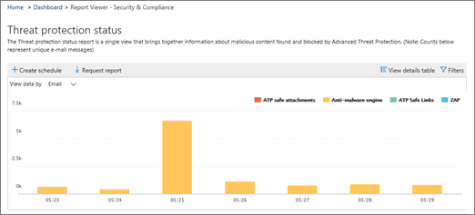

# セキュリティ&amp; /コンプライアンスセンターでレポートのスケジュールを作成するCreate a schedule for a report in the Security &amp; Compliance Center

セキュリティ&amp; /コンプライアンスセンターでは、組織のセキュリティチームが組織に対する脅威を軽減して対処するのに役立つ、いくつかの[レポートと分析](reports-and-insights-in-security-and-compliance.md)情報が提供されています。組織のセキュリティチームのメンバーである場合は、レポートのスケジュールを作成できます。作成したスケジュールには、組織に合わせてカスタムの日付範囲を含めることができます。In the Security &amp; Compliance Center, several [reports and insights](reports-and-insights-in-security-and-compliance.md) are available to help your organization's security team mitigate and address threats to your organization. If you're a member of your organization's security team, you can create a schedule for a report. The schedule you create can include a custom date ranges to suit your organization. 
  
## レポートのスケジュールを作成するCreate a schedule for a report

> [!IMPORTANT]
> このタスクを実行するために必要なアクセス許可を持っていることを確認してください。一般に、Office 365 の全体管理者、セキュリティ管理者、およびセキュリティ閲覧者は、 &amp;セキュリティ/コンプライアンスセンターのレポートにアクセスできます。アクセス許可の詳細については、「 [Office 365 セキュリティ&amp;コンプライアンスセンターのアクセス許可](permissions-in-the-security-and-compliance-center.md)」を参照してください。Make sure that you have the necessary permissions to perform this task. In general, Office 365 global administrators, security administrators, and security readers can access reports in the Security &amp; Compliance Center. To learn more about permissions, see [Permissions in the Office 365 Security &amp; Compliance Center](permissions-in-the-security-and-compliance-center.md).
  
1. [セキュリティ&amp; /コンプライアンスセンター](https://protection.office.com)で、[**レポート** \> **ダッシュボード**] に移動します。In the [Security &amp; Compliance Center](https://protection.office.com), go to **Reports** \> **Dashboard**.
    
2. レポートを選択します。この例では、[脅威保護の状態レポート] を選択します。Choose a report. For this example, we'll choose the Threat Protection Status report.
    
3. レポートの左上隅で、[ **+ スケジュールの作成**] を選択します。In the upper left corner of the report, choose **+ Create schedule**.
    
    
  
    [**スケジュールの作成**] ダイアログボックスが表示されます。The **Create schedule** dialog box opens. 
    
4. 既定の設定のままにして、[**スケジュールの作成**] を選択するか、[**スケジュールのカスタマイズ**] を選択します。Keep the default settings and choose **Create schedule**, or choose **Customize schedule**.
    
    
  
    レポートスケジュールのカスタマイズを選択する場合は、レポートの頻度、送信者の電子メールアドレス、および受信者の電子メールアドレスを指定できます。If you choose to customize your report schedule, you can specify the report's frequency, a sender's email address, and a recipient's email address. 
    
レポートのスケジュールを作成すると、そのレポートは電子メールによって受信者の電子メールアドレスに自動的に配信されます。Once you have created a schedule for a report, that report will be delivered via email to recipients' email addresses automatically. 
  
## 関連項目Related topics

[Office 365 セキュリティ&amp; /コンプライアンスセンターのレポートと分析情報Reports and insights in the Office 365 Security &amp; Compliance Center](reports-and-insights-in-security-and-compliance.md)
  
[セキュリティ&amp; /コンプライアンスセンターでレポートのスケジュールを管理するManage schedules for reports in the Security &amp; Compliance Center](manage-schedules-for-multiple-reports.md)
  
[セキュリティ&amp; /コンプライアンスセンターで既存のレポートをダウンロードするDownload existing reports in the Security &amp; Compliance Center](download-existing-reports.md)
  
[セキュリティ&amp; /コンプライアンスセンターでカスタムレポートをダウンロードするDownload a custom report in the Security &amp; Compliance Center](set-up-and-download-a-custom-report.md)
  

