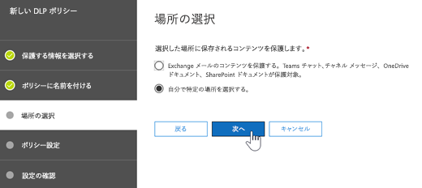
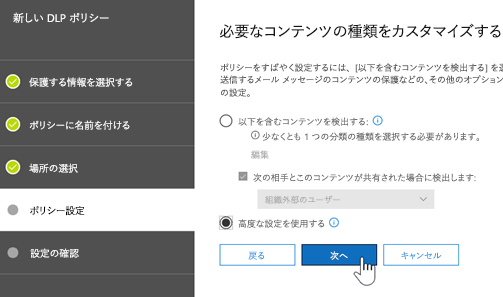
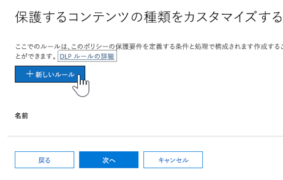
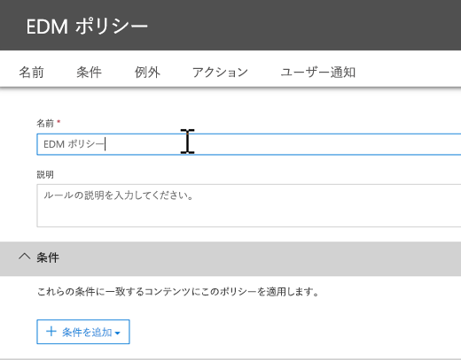
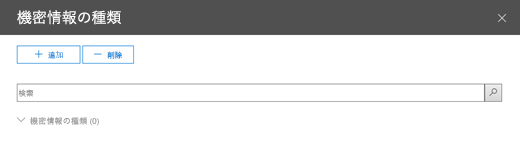

# <a name="create-custom-sensitive-information-types-with-exact-data-match-based-classification-preview"></a>Exact Data Match に基づく分類によりカスタムの機密情報の種類を作成する (プレビュー)

## <a name="overview"></a>概要

[カスタムの機密情報の種類](custom-sensitive-info-types.md)は、機密情報の不注意または不適切な共有を防ぐために使用されます。 管理者は[セキュリティ/コンプライアンス センター](create-a-custom-sensitive-information-type.md)または [PowerShell](create-a-custom-sensitive-information-type-in-scc-powershell.md) を使用して、パターン、証拠 (*従業員*、*バッジ*、*ID* などのキーワード)、文字の近接性 (特定のパターンの文字に証拠がどれほど近接しているか)、および信頼レベルに基づいてカスタムの機密情報の種類を定義できます。 このようなカスタムの機密情報の種類は、多くの組織のビジネス ニーズを満たします。

しかし、パターンや近接性の代わりに正確なデータ値を使用するカスタムの機密情報の種類が必要な場合はどうなるでしょうか。 Exact Data Match (EDM) ベースの分類では、次の目的で設計されたカスタムの機密情報の種類を作成できます。
- 動的で更新可能なものにする。
- 拡張性の高いものにする。
- 結果的に誤検知数を減らす。
- 構造化された機密データを操作する。
- 機密情報をより安全に処理する。
- さまざまな Microsoft クラウド サービスで使用する。


EDM ベースの分類を使用すると、機密情報のデータベース内の正確な値を参照する、カスタムの機密情報の種類を作成できます。 データベースは毎日、または毎週更新できます。また、最大 1000 万行のデータを格納できます。 そのため、従業員、患者、または顧客の出入りに合わせてレコードが変更されても、カスタムの機密情報の種類は最新の状態が維持され、適用も可能です。 また、EDM ベースの分類は、[データ損失防止ポリシー](data-loss-prevention-policies.md) (DLP) や [Microsoft Cloud App Security ファイル ポリシー](https://docs.microsoft.com/cloud-app-security/data-protection-policies)などのポリシーと共に使用できます。

## <a name="required-licenses-and-permissions"></a>必要なライセンスとアクセス許可

- この記事で説明されているタスクを実行するには、全体管理者、コンプライアンス管理者、または Exchange Online 管理者である必要があります。 DLP アクセス許可の詳細については、「[アクセス許可](data-loss-prevention-policies.md#permissions)」を参照してください。

- 一般公開されると、EDM ベースの分類は次のサブスクリプションに含まれます。
    - Office 365 E5
    - Microsoft 365 E5
    - Microsoft 365 Information Protection and Compliance
    - Office 365 Advanced Compliance

> [!NOTE]
> **EDM ベースの分類は、現在プレビューです。** 対象は [Office 365 での DLP](data-loss-prevention-policies.md) (Exchange Online および Microsoft Teams) と [Cloud App Security](https://docs.microsoft.com/cloud-app-security) です。 組織に [DLP 機能](https://docs.microsoft.com/office365/servicedescriptions/exchange-online-protection-service-description/messaging-policy-and-compliance-servicedesc#data-loss-prevention-dlp)がある場合は、EDM ベースの分類を試行できます。 まだプレビューに参加していない場合は、作業を開始するために [Microsoft へ問い合わせてください](https://resources.office.com/us-landing-spe-contactus.html?LCID=EN-US)。 

## <a name="the-work-flow-at-a-glance"></a>ワークフローの概要

|フェーズ  |前提条件  |
|---------|---------|
|[パート 1: EDM ベースの分類をセットアップする](#part-1-set-up-edm-based-classification)<br/><br/>(適宜)<br/>- [データベーススキーマを編集する](#editing-the-schema-for-edm-based-classification) <br/>- [スキーマを削除する](#removing-the-schema-for-edm-based-classification) |- 機密データへの読み取りアクセス<br/>- .xml 形式のデータベース スキーマ (例を提供)<br/>- .xml 形式のルールパッケージ (例を提供)<br/>- セキュリティ/コンプライアンス センターへの管理者権限 (PowerShell を使用) |
|[パート 2: 機密データのインデックスを作成しアップロードする](#part-2-index-and-upload-the-sensitive-data)<br/><br/>(適宜)<br/>[データを更新する](#refreshing-your-sensitive-information-database) |- カスタムのセキュリティ グループとユーザー アカウント<br/>- EDM アップロード エージェントを使用するコンピューターへのローカル管理者アクセス<br/>- 機密データへの読み取りアクセス<br/>- データ更新のプロセスとスケジュール|
|[パート 3: Microsoft クラウド サービスで EDM ベースの分類を使用する](#part-3-use-edm-based-classification-with-your-microsoft-cloud-services) |- DLP を使用する Office 365 サブスクリプション<br/>- 有効化された EDM ベースの分類機能 (プレビュー) |

## <a name="part-1-set-up-edm-based-classification"></a>パート 1: EDM ベースの分類をセットアップする

EDM ベースの分類をセットアップおよび構成するには、機密データを .csv 形式で保存し、機密情報のデータベースのスキーマを定義して、ルール パッケージを作成し、スキーマとルール パッケージをアップロードします。

### <a name="define-the-schema-for-your-database-of-sensitive-information"></a>機密情報のデータベースのスキーマを定義する

1. 使用する機密情報を特定します。 データを Microsoft Excel などのアプリにエクスポートし、ファイルを .csv 形式で保存します。 データ ファイルには、次のものを含めることができます。

    - 最大 1000 万行の機密データ
    - データ ソースごとに最大 32 列 (フィールド)

2. EDM ベースの分類に使用されるフィールドの名前が 1 行目に含まれるように、.csv ファイル内の機密データを構成します。 .csv ファイルには、"ssn"、"birthdate"、"firstname"、"lastname" などのフィールド名があります。 たとえば、使用する .csv ファイルの名前を *PatientRecords.csv*、列には *PatientID*、*MRN*、*lastname*、*FirstName*、*SSN* などを含めます。

3. 機密情報のデータベースのスキーマを .xml 形式で定義します (次の例と同様)。 このスキーマ ファイルの名前を `edm.xml` にして、データベースの各列に対して構文 `<Field name="" unique="" searchable=""/>` を使用する行があるように構成します。 

    - *Field name* の値に列名を使用します。
    - 一意の値 (社会保障番号、ID 番号など) を含むフィールドには *unique="true"* を使用します。それ以外の場合は *unique="false"* を使用します。
    - 検索可能にするフィールドには *searchable="true"* を使用します。 検索可能なフィールドは、データベースごとに 5 つ以上指定しないでください。 それ以外は、すべて *searchable="false"* にする必要があります。  

    たとえば、次の .xml ファイルは患者レコードのデータベースのスキーマを定義します。検索可能として指定された 5 つのフィールドは、*PatientID*、*MRN*、*SSN*、*Phone*、*DOB* です。 
    
    (この例は、コピー、変更、使用が可能です)。
    
    ```<?xml version="1.0" encoding="utf-8"?> <EdmSchema xmlns="http://schemas.microsoft.com/office/2018/edm">
        <DataStore name="PatientRecords" description="患者レコードのスキーマ" version="1">
            <Field name="PatientID" unique="false" searchable="true" /> <Field name="MRN" unique="false" searchable="true" />
            <Field name="FirstName" unique="false" searchable="false" />
            <Field name="LastName" unique="false" searchable="false" />
            <Field name="SSN" unique="false" searchable="true" />
            <Field name="Phone" unique="false" searchable="true" />
            <Field name="DOB" unique="false" searchable="true" />
            <Field name="Gender" unique="false" searchable="false" />
            <Field name="Address" unique="false" searchable="false" />
        </DataStore>
    </EdmSchema>
    ```

4. [Connect to Office 365 Security & Compliance Center PowerShell](https://docs.microsoft.com/powershell/exchange/office-365-scc/connect-to-scc-powershell/connect-to-scc-powershell?view=exchange-ps).

5. To upload the database schema, run the following cmdlets, one at a time:

    `$edmSchemaXml=Get-Content .\edm.xml -Encoding Byte -ReadCount 0`

    `New-DlpEdmSchema -FileData $edmSchemaXml -Confirm:$true`

    You will be prompted to confirm, as follows:

       Confirm
       Are you sure you want to perform this action?
       New EDM Schema for the data store 'patientrecords' will be imported.
       [Y] Yes  [A] Yes to All  [N] No  [L] No to All  [?] Help (default is "Y"):

    > [!TIP]
    > If you want your changes to occur without confirmation, in Step 5, use this cmdlet instead: `New-DlpEdmSchema -FileData $edmSchemaXml`
    
Now that the schema for your database of sensitive information is defined, the next step is to set up a rule package. Proceed to the section [Set up a rule package](#set-up-a-rule-package).

#### Editing the schema for EDM-based classification 

(As needed) If you want to make changes to your edm.xml file, such as changing which fields are used for EDM-based classification, follow these steps:

1. Edit your edm.mxl file (this is the file discussed in the [Define the schema](#define-the-schema-for-your-database-of-sensitive-information) section of this article).

2. [Connect to Office 365 Security & Compliance Center PowerShell](https://docs.microsoft.com/powershell/exchange/office-365-scc/connect-to-scc-powershell/connect-to-scc-powershell?view=exchange-ps).

3. To update your database schema, run the following cmdlets, one at a time:

    `$edmSchemaXml=Get-Content .\edm.xml -Encoding Byte -ReadCount 0`

    `Set-DlpEdmSchema -FileData $edmSchemaXml -Confirm:$true`

    You will be prompted to confirm, as follows:

       Confirm
       Are you sure you want to perform this action?
       EDM Schema for the data store 'patientrecords' will be updated.
       [Y] Yes  [A] Yes to All  [N] No  [L] No to All  [?] Help (default is "Y"):

    > [!TIP]
    > If you want your changes to occur without confirmation, in Step 3, use this cmdlet instead: `Set-DlpEdmSchema -FileData $edmSchemaXml`

#### Removing the schema for EDM-based classification

(As needed) If you want to remove the schema you're using for EDM-based classification, follow these steps:

1. [Connect to Office 365 Security & Compliance Center PowerShell](https://docs.microsoft.com/powershell/exchange/office-365-scc/connect-to-scc-powershell/connect-to-scc-powershell?view=exchange-ps).

2. Run the following PowerShell cmdlet, substituting the data store name of "patientrecords" with the one you want to remove:

    `Remove-DlpEdmSchema -Identity patientrecords`

     You will be prompted to confirm, as follows:
    
       Confirm
       Are you sure you want to perform this action?
       EDM Schema for the data store 'patientrecords' will be removed.
       [Y] Yes  [A] Yes to All  [N] No  [L] No to All  [?] Help (default is "Y"):
    
    > [!TIP]
    > If you want your changes to occur without confirmation, in Step 2, use this cmdlet instead: `Remove-DlpEdmSchema -Identity patientrecords -Confirm:$false`

### Set up a rule package

1. Create a rule package in .xml format (with Unicode encoding), similar to the following example. (You can copy, modify, and use our example.) 

   Recall from the previous procedure that our PatientRecords schema defines five fields as searchable: *PatientID*, *MRN*, *SSN*, *Phone*, and *DOB*. Our example rule package includes those fields and references the database schema file (edm.xml), with one *ExactMatch* items per searchable field. Consider the following ExactMatch item:

   ```
    <ExactMatch id = "E1CC861E-3FE9-4A58-82DF-4BD259EAB371" patternsProximity = "300" dataStore ="PatientRecords" recommendedConfidence = "65" > <Pattern confidenceLevel="65"> <idMatch matches = "SSN" classification = "U.S. Social Security Number (SSN)" /> </Pattern> </ExactMatch>
   ```

    In this example, note the following:

    - The dataStore name references the .csv file we created earlier: **dataStore = "PatientRecords"**.
    - The idMatch value references a searchable field that is listed in the database schema file: **idMatch matches = "SSN"**.
    - The classification value references an existing or custom sensitive information type: **classification = "U.S. Social Security Number (SSN)"**. (In this case, we use the existing sensitive information type of U.S. Social Security Number.)

    When you set up your rule package, make sure to correctly reference your .csv file and edm.xml file. (You can copy, modify, and use our example.) 

    ```<?xml version="1.0" encoding="utf-8"?>
    <RulePackage xmlns="http://schemas.microsoft.com/office/2018/edm">
      <RulePack id="fd098e03-1796-41a5-8ab6-198c93c62b11">
        <Version build="0" major="2" minor="0" revision="0" />
        <Publisher id="eb553734-8306-44b4-9ad5-c388ad970528" />
        <Details defaultLangCode="en-us">
          <LocalizedDetails langcode="en-us">
            <PublisherName>IP DLP</PublisherName>
            <Name>Health Care EDM Rulepack</Name>
            <Description>This rule package contains the EDM sensitive type for health care sensitive types.</Description>
          </LocalizedDetails>
        </Details>
      </RulePack>
      <Rules>
        <ExactMatch id = "E1CC861E-3FE9-4A58-82DF-4BD259EAB371" patternsProximity = "300" dataStore ="PatientRecords" recommendedConfidence = "65" >
          <Pattern confidenceLevel="65">
            <idMatch matches = "SSN" classification = "U.S. Social Security Number (SSN)" />
          </Pattern>
          <Pattern confidenceLevel="75">
            <idMatch matches = "SSN" classification = "U.S. Social Security Number (SSN)" />
            <Any minMatches ="3" maxMatches ="100">
              <match matches="PatientID" />
              <match matches="MRN"/>
              <match matches="FirstName"/>
              <match matches="LastName"/>
              <match matches="Phone"/>
              <match matches="DOB"/>
            </Any>
          </Pattern>
        </ExactMatch>
        <LocalizedStrings>
          <Resource idRef="E1CC861E-3FE9-4A58-82DF-4BD259EAB371">
            <Name default="true" langcode="en-us">Patient SSN Exact Match.</Name>
            <Description default="true" langcode="en-us">EDM Sensitive type for detecting Patient SSN.</Description>
          </Resource>
        </LocalizedStrings>
      </Rules>
    </RulePackage>
    ```
    
2. 次の PowerShell コマンドレットを 1 つずつ実行して、ルール パッケージをアップロードします。

    `$rulepack=Get-Content .\rulepack.xml -Encoding Byte -ReadCount 0`

    `New-DlpSensitiveInformationTypeRulePackage -FileData $rulepack`

この時点で、EDM ベースの分類がセットアップされています。 次の手順では、機密データにインデックスを付け、インデックス付きのデータをアップロードします。 

## <a name="part-2-index-and-upload-the-sensitive-data"></a>パート 2: 機密データのインデックスを作成しアップロードする

このフェーズでは、カスタムのセキュリティ グループとユーザー アカウントをセットアップし、EDM Upload Agent ツールをセットアップします。 次に、このツールを使用して機密データにインデックスを作成し、インデックス付きのデータをアップロードします。

### <a name="set-up-the-security-group-and-user-account"></a>セキュリティ グループとユーザー アカウントをセットアップする

1. 全体管理者として、管理センター ([https://admin.microsoft.com](https://admin.microsoft.com)) に移動し、`EDM_DataUploaders` という名前の[セキュリティ グループを作成します](https://docs.microsoft.com/office365/admin/email/create-edit-or-delete-a-security-group?view=o365-worldwide)。 

2. *EDM_DataUploaders* セキュリティ グループに、1 人以上のユーザーを追加します。 (これらのユーザーは機密情報のデータベースを管理します)。

3. 機密データを管理している各ユーザーが、EDM アップロード エージェントに使用されるコンピューターのローカル管理者であることを確認してください。

### <a name="set-up-the-edm-upload-agent"></a>EDM アップロード エージェントをセットアップする

> [!NOTE]
> この手順を開始する前に、自分が *EDM_DataUploaders* セキュリティ グループのメンバーであり、コンピューターのローカル管理者であることを確認します。

1. [https://go.microsoft.com/fwlink/?linkid=2088639](https://go.microsoft.com/fwlink/?linkid=2088639) から EDM アップロード エージェントをダウンロードしてインストールします。 既定では、インストールする場所は `C:\Program Files\Microsoft\EdmUploadAgent` です。 

2. EDM アップロード エージェントを承認するには、管理者として Windows コマンド プロンプトを開き、次のコマンドを実行します。

    `EdmUploadAgent.exe /Authorize`

3. 職場または学校の Office 365 アカウントでサインインします。

次の手順では、EDM アップロード エージェントを使用して機密データにインデックスを付け、インデックス付きのデータをアップロードします。

### <a name="index-and-upload-the-sensitive-data"></a>機密データのインデックスを作成しアップロードする

1. 機密データ ファイル (この例では *PatientRecords.csv*) をコンピューターのローカル ドライブに保存します。 (この例の *PatientRecords.csv* ファイルは `C:\Edm\Data` に保存してあります)。

2. 機密データにインデックスを付けるには、Windows コマンド プロンプトで次のコマンドを実行します。

    `EdmUploadAgent.exe /CreateHash /DataStoreName <DataStoreName> /DataFile <DataFilePath> /HashLocation <HashedFileLocation>`

    例: **EdmUploadAgent.exe /CreateHash /DataStoreName PatientRecords /DataFile C:\Edm\Data\PatientRecords.csv /HashLocation C:\Edm\Hash** 

3. インデックス付きのデータをアップロードするには、Windows コマンド プロンプトで次のコマンドを実行します。

    `EdmUploadAgent.exe /UploadHash /DataStoreName <DataStoreName> /HashFile <HashedSourceFilePath>`

    例: **EdmUploadAgent.exe /UploadHash /DataStoreName PatientRecords /HashFile C:\Edm\Hash\PatientRecords.EdmHash** 

4. 機密データがアップロードされたことを確認するには、Windows コマンド プロンプトで次のコマンドを実行します。

    `EdmUploadAgent.exe /GetDataStore`

    データ ストアのリストが表示されます。最終更新時には、次のようになります。 <br/>

5. [機密情報データベースを更新する](#refreshing-your-sensitive-information-database)ためのプロセスとスケジュールのセットアップを進めます。

この時点で、Microsoft クラウド サービスで EDM ベースの分類を使用する準備が整いました。 たとえば、[EDM ベースの分類を使用して DLP ポリシーを設定](#to-create-a-dlp-policy-with-edm)できます。 

### <a name="refreshing-your-sensitive-information-database"></a>機密情報データベースを更新する

機密情報データベースは毎日または毎週更新できます。また、EDM アップロード ツールを使用して機密データのインデックスを再作成し、インデックス付きデータを再アップロードできます。 

1. 機密情報のデータベースを更新するためのプロセスと頻度 (毎日または毎週) を決定します。

2. 機密情報データを Microsoft Excel などのアプリに再度エクスポートし、ファイルを .csv 形式で保存します。 「[機密データのインデックスを作成しアップロードする](#index-and-upload-the-sensitive-data)」で説明した手順の実行時に使用したファイル名と場所と同じものを使用してください。

    > [!NOTE]
    > .csv ファイルの構造 (フィールド名) に変更がない場合は、データを更新する際に、データベース スキーマ ファイルを変更する必要はありません。 ただし、変更が必要な場合は、必要に応じて[データベース スキーマ](#editing-the-schema-for-edm-based-classification)と[ルール パッケージ](#set-up-a-rule-package)を編集してください。        

3. 「[機密データのインデックスを作成しアップロードする](#index-and-upload-the-sensitive-data)」の手順の、手順 2 と 3 を自動化するには、[タスク スケジューラ](https://docs.microsoft.com/windows/desktop/TaskSchd/task-scheduler-start-page)を使用します。 タスクはいくつかの方法でスケジュールできます。
    
    |メソッド  |操作  |
    |---------|---------|
    |Windows PowerShell     |[ScheduledTasks](https://docs.microsoft.com/powershell/module/scheduledtasks/?view=win10-ps) のドキュメントと、この記事の [PowerShell スクリプトの例](#example-powershell-script-for-task-scheduler)を参照してください。|
    |タスク スケジューラ API |[Task Scheduler](https://docs.microsoft.com/windows/desktop/TaskSchd/using-the-task-scheduler) のドキュメントを参照してください。 |
    |Windows のユーザー インターフェイス     |Windows で、**[スタート]** をクリックし `Task Scheduler` を入力します。 次に、結果のリストで **[タスク スケジューラ]** を右クリックし、**[管理者として実行]** を選択します。          |

#### <a name="example-powershell-script-for-task-scheduler"></a>タスク スケジューラの PowerShell スクリプトの例

このセクションには、データのインデックスを作成したり、インデックス付きのデータをアップロードするタスクのスケジュールに使用できる PowerShell スクリプトの例が含まれています。

```powershell
param([string]$dataStoreName,[string]$fileLocation)
# Assuming current user is also the user context to run the task
$user = "$env:USERDOMAIN\$env:USERNAME"
$edminstallpath = 'C:\Program Files\Microsoft\EdmUploadAgent\'
$edmuploader = $edminstallpath + 'EdmUploadAgent.exe'
$csvext = '.csv'
$edmext = '.EdmHash'
# Assuming CSV file name is same as data store name
$dataFile = "$fileLocation\$dataStoreName$csvext"
$hashFile = "$fileLocation\$dataStoreName$edmext"
# Assuming location to store hash file is same as the location of csv file
$hashLocation = $fileLocation
$createHashArgs = '/CreateHash /DataStoreName ' + $dataStoreName + ' /DataFile ' + $dataFile + ' /HashLocation ' + $hashLocation
$uploadHashArgs = '/UploadHash /DataStoreName ' + $dataStoreName + ' /HashFile ' + $hashFile
# Set up actions associated with the task
$actions = @()
$actions += New-ScheduledTaskAction -Execute $edmuploader -Argument $createHashArgs -WorkingDirectory $edminstallpath
$actions += New-ScheduledTaskAction -Execute $edmuploader -Argument $uploadHashArgs -WorkingDirectory $edminstallpath
# Set up trigger for the task
$trigger = New-ScheduledTaskTrigger -Weekly -DaysOfWeek Sunday -At 2am
# Set up task settings
$principal = New-ScheduledTaskPrincipal -UserId $user -LogonType S4U -RunLevel Highest
$settings = New-ScheduledTaskSettingsSet -RunOnlyIfNetworkAvailable -StartWhenAvailable -WakeToRun
# Create the scheduled task
$scheduledTask = New-ScheduledTask -Action $actions -Principal $principal -Trigger $trigger -Settings $settings
# Get credentials to run the task
$creds = Get-Credential -UserName $user -Message "Enter credentials to run the task"
$password=[Runtime.InteropServices.Marshal]::PtrToStringAuto([Runtime.InteropServices.Marshal]::SecureStringToBSTR($creds.Password))
# Register the scheduled task
$taskName = 'EDMUpload_' + $dataStoreName
Register-ScheduledTask -TaskName $taskName -InputObject $scheduledTask -User $user -Password $password
```
## <a name="part-3-use-edm-based-classification-with-your-microsoft-cloud-services"></a>パート 3: Microsoft クラウド サービスで EDM ベースの分類を使用する

EDM ベースの分類は、[Office 365 DLP ポリシー](data-loss-prevention-policies.md)および [Microsoft Cloud App Security ファイル ポリシー](https://docs.microsoft.com/cloud-app-security/data-protection-policies)などの情報保護機能で使用できます。 次の手順では、Office 365 セキュリティ/コンプライアンス センターで作成された DLP ポリシーで EDM を使用する方法について説明します。

### <a name="to-create-a-dlp-policy-with-edm"></a>EDM を使用して DLP ポリシーを作成する

1. セキュリティ/コンプライアンス センターに移動します ([https://protection.office.com](https://protection.office.com))。

2. **[データ損失防止]** > **[ポリシー]** を選択します。

3. **[ポリシーの作成]** > **[カスタム]** > **[次へ]** の順に選択します。

4. **[ポリシーの名前を設定]** タブで名前と説明を指定し、**[次へ]** を選択します。

5. **[場所の選択]** タブで **[特定の場所を選択]** を選択し、**[次へ]** を選択します。<br/><br/>

6. **[状態]** 列で **[Exchange メール]** のみを選択し、**[次へ]** を選択します。 <br/><br/>

7. **[ポリシーの設定]** タブで **[詳細な設定を使用]** を選択し、**[次へ]** を選択します。<br/><br/>

8. **[+ 新しいルール]** を選択します。<br/><br/>

9. **[名前]** セクションで、ルールの名前と説明を指定します。<br/><br/>

10. **[条件]** セクションの **[+ 条件の追加]** リストで、**[コンテンツに含まれている場合] の [機密情報の種類]** を選択します。<br/>![[コンテンツに含まれている場合] の [機密情報の種類]](media/edm-dlp-newrule-conditions.png)<br/>

11. ルール パッケージのセットアップ時に作成した機密情報の種類を検索し、**[+ 追加]** を選択します。<br/><br/>次に、**[完了]** を選択します。

12. ルールのオプション (**[ユーザー通知]**、**[ユーザーによる上書き]**、**[インシデント レポート]** など) の選択を終了し、**[保存]** を選択します。

13. **[ポリシーの設定]** タブでルールを確認し、**[次へ]** を選択します。

14. ポリシーをすぐに有効にするか、テストするか、無効にするかを指定します。 **[次へ]** を選択します。

15. **[設定を確認]** タブで、ポリシーを確認します。 必要な変更を行います。 準備ができたら **[作成]** を選択します。

    > [!NOTE]
    > 新しい DLP ポリシーがデータ センターを通過するまでに、約 1 時間かかります。

## <a name="related-articles"></a>関連記事

[組み込みの機密情報の種類とその検索対象](what-the-sensitive-information-types-look-for.md)

[カスタムの機密情報の種類](custom-sensitive-info-types.md)

[DLP ポリシーの概要](data-loss-prevention-policies.md)

[Microsoft Cloud App Security](https://docs.microsoft.com/cloud-app-security)
