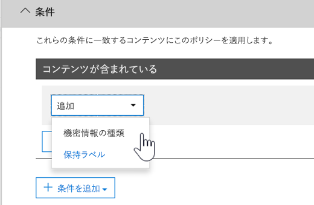

# <a name="create-custom-sensitive-information-types-with-exact-data-match-based-classification-preview"></a><span data-ttu-id="5cda6-103">Exact Data Match に基づく分類によりカスタムの機密情報の種類を作成する (プレビュー)</span><span class="sxs-lookup"><span data-stu-id="5cda6-103">See Create a custom sensitive information type with Exact Data Match based classification (Preview).</span></span>

## <a name="overview"></a><span data-ttu-id="5cda6-104">概要</span><span class="sxs-lookup"><span data-stu-id="5cda6-104">Overview</span></span>

<span data-ttu-id="5cda6-105">[カスタムの機密情報の種類](custom-sensitive-info-types.md)は、機密情報の不注意または不適切な共有を防ぐために使用されます。</span><span class="sxs-lookup"><span data-stu-id="5cda6-105">[Custom sensitive information types](custom-sensitive-info-types.md) are used to help prevent inadvertent or inappropriate sharing of sensitive information.</span></span> <span data-ttu-id="5cda6-106">管理者は[セキュリティ/コンプライアンス センター](create-a-custom-sensitive-information-type.md)または [PowerShell](create-a-custom-sensitive-information-type-in-scc-powershell.md) を使用して、パターン、証拠 (*従業員*、*バッジ*、*ID* などのキーワード)、文字の近接性 (特定のパターンの文字に証拠がどれほど近接しているか)、および信頼レベルに基づいてカスタムの機密情報の種類を定義できます。</span><span class="sxs-lookup"><span data-stu-id="5cda6-106">As an administrator, you can use the [Security & Compliance Center](create-a-custom-sensitive-information-type.md) or [PowerShell](create-a-custom-sensitive-information-type-in-scc-powershell.md) to define a custom sensitive information type based on patterns, evidence (keywords such as *employee*, *badge*, *ID*, and so on), character proximity (how close evidence is to characters in a particular pattern), and confidence levels.</span></span> <span data-ttu-id="5cda6-107">このようなカスタムの機密情報の種類は、多くの組織のビジネス ニーズを満たします。</span><span class="sxs-lookup"><span data-stu-id="5cda6-107">Such custom sensitive information types meet business needs for many organizations.</span></span>

<span data-ttu-id="5cda6-108">しかし、パターンや近接性の代わりに正確なデータ値を使用するカスタムの機密情報の種類が必要な場合はどうなるでしょうか。</span><span class="sxs-lookup"><span data-stu-id="5cda6-108">But what if you wanted a custom sensitive information type that uses exact data values, instead of patterns and proximity?</span></span> <span data-ttu-id="5cda6-109">Exact Data Match (EDM) ベースの分類では、次の目的で設計されたカスタムの機密情報の種類を作成できます。</span><span class="sxs-lookup"><span data-stu-id="5cda6-109">With Exact Data Match (EDM)-based classification, you can create a custom sensitive information type that is designed to:</span></span>
- <span data-ttu-id="5cda6-110">動的で更新可能なものにする。</span><span class="sxs-lookup"><span data-stu-id="5cda6-110">be dynamic and refreshable;</span></span>
- <span data-ttu-id="5cda6-111">拡張性の高いものにする。</span><span class="sxs-lookup"><span data-stu-id="5cda6-111">be more scalable;</span></span>
- <span data-ttu-id="5cda6-112">結果的に誤検知数を減らす。</span><span class="sxs-lookup"><span data-stu-id="5cda6-112">result in fewer false-positives;</span></span>
- <span data-ttu-id="5cda6-113">構造化された機密データを操作する。</span><span class="sxs-lookup"><span data-stu-id="5cda6-113">work with structured sensitive data;</span></span>
- <span data-ttu-id="5cda6-114">機密情報をより安全に処理する。</span><span class="sxs-lookup"><span data-stu-id="5cda6-114">handle sensitive information more securely; and</span></span>
- <span data-ttu-id="5cda6-115">さまざまな Microsoft クラウド サービスで使用する。</span><span class="sxs-lookup"><span data-stu-id="5cda6-115">be used with several Microsoft cloud services.</span></span>


<span data-ttu-id="5cda6-117">EDM ベースの分類を使用すると、機密情報のデータベース内の正確な値を参照する、カスタムの機密情報の種類を作成できます。</span><span class="sxs-lookup"><span data-stu-id="5cda6-117">EDM-based classification enables you to create custom sensitive information types that refer to exact values in a database of sensitive information.</span></span> <span data-ttu-id="5cda6-118">データベースは毎日、または毎週更新できます。また、最大 1000 万行のデータを格納できます。</span><span class="sxs-lookup"><span data-stu-id="5cda6-118">The database can be refreshed daily or weekly, and it can contain up to 10 million rows of data.</span></span> <span data-ttu-id="5cda6-119">そのため、従業員、患者、または顧客の出入りに合わせてレコードが変更されても、カスタムの機密情報の種類は最新の状態が維持され、適用も可能です。</span><span class="sxs-lookup"><span data-stu-id="5cda6-119">So as employees, patients, or clients come and go, and records change, your custom sensitive information types remain current and applicable.</span></span> <span data-ttu-id="5cda6-120">また、EDM ベースの分類は、[データ損失防止ポリシー](data-loss-prevention-policies.md) (DLP) や [Microsoft Cloud App Security ファイル ポリシー](https://docs.microsoft.com/cloud-app-security/data-protection-policies)などのポリシーと共に使用できます。</span><span class="sxs-lookup"><span data-stu-id="5cda6-120">And, you can use EDM-based classification with policies, such as [data loss prevention policies](data-loss-prevention-policies.md) (DLP) or [Microsoft Cloud App Security file policies](https://docs.microsoft.com/cloud-app-security/data-protection-policies).</span></span>

## <a name="required-licenses-and-permissions"></a><span data-ttu-id="5cda6-121">必要なライセンスとアクセス許可</span><span class="sxs-lookup"><span data-stu-id="5cda6-121">Required licenses and permissions</span></span>

- <span data-ttu-id="5cda6-122">この記事で説明されているタスクを実行するには、全体管理者、コンプライアンス管理者、または Exchange Online 管理者である必要があります。</span><span class="sxs-lookup"><span data-stu-id="5cda6-122">You must be a global admin, compliance administrator, or Exchange Online administrator to perform the tasks described in this article.</span></span> <span data-ttu-id="5cda6-123">DLP アクセス許可の詳細については、「[アクセス許可](data-loss-prevention-policies.md#permissions)」を参照してください。</span><span class="sxs-lookup"><span data-stu-id="5cda6-123">To learn more about DLP permissions, see [Permissions](data-loss-prevention-policies.md#permissions).</span></span>

- <span data-ttu-id="5cda6-124">一般公開されると、EDM ベースの分類は次のサブスクリプションに含まれます。</span><span class="sxs-lookup"><span data-stu-id="5cda6-124">When generally available, EDM-based classification will be included in the following subscriptions:</span></span>
    - <span data-ttu-id="5cda6-125">Office 365 E5</span><span class="sxs-lookup"><span data-stu-id="5cda6-125">Office 365 Enterprise E5</span></span>
    - <span data-ttu-id="5cda6-126">Microsoft 365 E5</span><span class="sxs-lookup"><span data-stu-id="5cda6-126">Microsoft 365 E5</span></span>
    - <span data-ttu-id="5cda6-127">Microsoft 365 Information Protection and Compliance</span><span class="sxs-lookup"><span data-stu-id="5cda6-127">Microsoft 365 Information Protection and Compliance</span></span>
    - <span data-ttu-id="5cda6-128">Office 365 Advanced Compliance</span><span class="sxs-lookup"><span data-stu-id="5cda6-128">Office 365 Advanced Compliance</span></span>

> [!NOTE]
> <span data-ttu-id="5cda6-129">**EDM ベースの分類は、現在プレビューです。** 対象は [Office 365 での DLP](data-loss-prevention-policies.md) (Exchange Online および Microsoft Teams) と [Cloud App Security](https://docs.microsoft.com/cloud-app-security) です。</span><span class="sxs-lookup"><span data-stu-id="5cda6-129">**EDM-based classification is currently in preview** for [DLP in Office 365](data-loss-prevention-policies.md) (with Exchange Online and Microsoft Teams) and [Cloud App Security](https://docs.microsoft.com/cloud-app-security).</span></span> <span data-ttu-id="5cda6-130">組織に [DLP 機能](https://docs.microsoft.com/office365/servicedescriptions/exchange-online-protection-service-description/messaging-policy-and-compliance-servicedesc#data-loss-prevention-dlp)がある場合は、EDM ベースの分類を試行できます。</span><span class="sxs-lookup"><span data-stu-id="5cda6-130">If your organization has [DLP capabilities](https://docs.microsoft.com/office365/servicedescriptions/exchange-online-protection-service-description/messaging-policy-and-compliance-servicedesc#data-loss-prevention-dlp), you can try EDM-based classification.</span></span> <span data-ttu-id="5cda6-131">まだプレビューに参加していない場合は、作業を開始するために [Microsoft へ問い合わせてください](https://resources.office.com/us-landing-spe-contactus.html?LCID=EN-US)。</span><span class="sxs-lookup"><span data-stu-id="5cda6-131">If you are not already participating in the preview, [contact Microsoft](https://resources.office.com/us-landing-spe-contactus.html?LCID=EN-US) to get started.</span></span> 

## <a name="the-work-flow-at-a-glance"></a><span data-ttu-id="5cda6-132">ワークフローの概要</span><span class="sxs-lookup"><span data-stu-id="5cda6-132">The work flow at a glance</span></span>

|<span data-ttu-id="5cda6-133">フェーズ</span><span class="sxs-lookup"><span data-stu-id="5cda6-133">Phase</span></span>  |<span data-ttu-id="5cda6-134">前提条件</span><span class="sxs-lookup"><span data-stu-id="5cda6-134">What's needed</span></span>  |
|---------|---------|
|[<span data-ttu-id="5cda6-135">パート 1: EDM ベースの分類をセットアップする</span><span class="sxs-lookup"><span data-stu-id="5cda6-135">Part 1: Set up EDM-based classification</span></span>](#part-1-set-up-edm-based-classification)<br/><br/><span data-ttu-id="5cda6-136">(適宜)</span><span class="sxs-lookup"><span data-stu-id="5cda6-136">(As needed)</span></span><br/><span data-ttu-id="5cda6-137">- [データベーススキーマを編集する](#editing-the-schema-for-edm-based-classification)</span><span class="sxs-lookup"><span data-stu-id="5cda6-137">- [Edit the database schema](#editing-the-schema-for-edm-based-classification)</span></span> <br/><span data-ttu-id="5cda6-138">- [スキーマを削除する](#removing-the-schema-for-edm-based-classification)</span><span class="sxs-lookup"><span data-stu-id="5cda6-138">- [Remove the schema](#removing-the-schema-for-edm-based-classification)</span></span> |<span data-ttu-id="5cda6-139">- 機密データへの読み取りアクセス</span><span class="sxs-lookup"><span data-stu-id="5cda6-139">- Read access to the sensitive data</span></span><br/><span data-ttu-id="5cda6-140">- .xml 形式のデータベース スキーマ (例を提供)</span><span class="sxs-lookup"><span data-stu-id="5cda6-140">- Database schema in .xml format (example provided)</span></span><br/><span data-ttu-id="5cda6-141">- .xml 形式のルールパッケージ (例を提供)</span><span class="sxs-lookup"><span data-stu-id="5cda6-141">- Rule package in .xml format (example provided)</span></span><br/><span data-ttu-id="5cda6-142">- セキュリティ/コンプライアンス センターへの管理者権限 (PowerShell を使用)</span><span class="sxs-lookup"><span data-stu-id="5cda6-142">- Admin permissions to the Security & Compliance Center (using PowerShell)</span></span> |
|[<span data-ttu-id="5cda6-143">パート 2: 機密データのインデックスを作成しアップロードする</span><span class="sxs-lookup"><span data-stu-id="5cda6-143">Part 2: Index and upload the sensitive data</span></span>](#part-2-index-and-upload-the-sensitive-data)<br/><br/><span data-ttu-id="5cda6-144">(適宜)</span><span class="sxs-lookup"><span data-stu-id="5cda6-144">(As needed)</span></span><br/>[<span data-ttu-id="5cda6-145">データを更新する</span><span class="sxs-lookup"><span data-stu-id="5cda6-145">Refresh the data</span></span>](#refreshing-your-sensitive-information-database) |<span data-ttu-id="5cda6-146">- カスタムのセキュリティ グループとユーザー アカウント</span><span class="sxs-lookup"><span data-stu-id="5cda6-146">- Custom security group and user account</span></span><br/><span data-ttu-id="5cda6-147">- EDM アップロード エージェントを使用するコンピューターへのローカル管理者アクセス</span><span class="sxs-lookup"><span data-stu-id="5cda6-147">- Local admin access to machine with EDM Upload Agent</span></span><br/><span data-ttu-id="5cda6-148">- 機密データへの読み取りアクセス</span><span class="sxs-lookup"><span data-stu-id="5cda6-148">- Read access to the sensitive data</span></span><br/><span data-ttu-id="5cda6-149">- データ更新のプロセスとスケジュール</span><span class="sxs-lookup"><span data-stu-id="5cda6-149">- Process and schedule for refreshing the data</span></span>|
|[<span data-ttu-id="5cda6-150">パート 3: Microsoft クラウド サービスで EDM ベースの分類を使用する</span><span class="sxs-lookup"><span data-stu-id="5cda6-150">Part 3: Use EDM-based classification with your Microsoft cloud services</span></span>](#part-3-use-edm-based-classification-with-your-microsoft-cloud-services) |<span data-ttu-id="5cda6-151">- DLP を使用する Office 365 サブスクリプション</span><span class="sxs-lookup"><span data-stu-id="5cda6-151">- Office 365 subscription with DLP</span></span><br/><span data-ttu-id="5cda6-152">- 有効化された EDM ベースの分類機能 (プレビュー)</span><span class="sxs-lookup"><span data-stu-id="5cda6-152">- EDM-based classification feature enabled (in preview)</span></span> |

## <a name="part-1-set-up-edm-based-classification"></a><span data-ttu-id="5cda6-153">パート 1: EDM ベースの分類をセットアップする</span><span class="sxs-lookup"><span data-stu-id="5cda6-153">Part 1: Set up EDM-based classification</span></span>

<span data-ttu-id="5cda6-154">EDM ベースの分類をセットアップおよび構成するには、機密データを .csv 形式で保存し、機密情報のデータベースのスキーマを定義して、ルール パッケージを作成し、スキーマとルール パッケージをアップロードします。</span><span class="sxs-lookup"><span data-stu-id="5cda6-154">Setting up and configuring EDM-based classification involves saving sensitive data in .csv format, defining a schema for your database of sensitive information, creating a rule package, and then uploading the schema and rule package.</span></span>

### <a name="define-the-schema-for-your-database-of-sensitive-information"></a><span data-ttu-id="5cda6-155">機密情報のデータベースのスキーマを定義する</span><span class="sxs-lookup"><span data-stu-id="5cda6-155">Define the schema for your database of sensitive information</span></span>

1. <span data-ttu-id="5cda6-156">使用する機密情報を特定します。</span><span class="sxs-lookup"><span data-stu-id="5cda6-156">Identify the KPIs that you want to use.</span></span> <span data-ttu-id="5cda6-157">データを Microsoft Excel などのアプリにエクスポートし、ファイルを .csv 形式で保存します。</span><span class="sxs-lookup"><span data-stu-id="5cda6-157">Export the data to an app, such as Microsoft Excel, and save the file in .csv format.</span></span> <span data-ttu-id="5cda6-158">データ ファイルには、次のものを含めることができます。</span><span class="sxs-lookup"><span data-stu-id="5cda6-158">The data file can include:</span></span>

    - <span data-ttu-id="5cda6-159">最大 1000 万行の機密データ</span><span class="sxs-lookup"><span data-stu-id="5cda6-159">Up to 10 million rows of sensitive data</span></span>
    - <span data-ttu-id="5cda6-160">データ ソースごとに最大 32 列 (フィールド)</span><span class="sxs-lookup"><span data-stu-id="5cda6-160">Up to 32 columns (fields) per data source</span></span>

2. <span data-ttu-id="5cda6-161">EDM ベースの分類に使用されるフィールドの名前が 1 行目に含まれるように、.csv ファイル内の機密データを構成します。</span><span class="sxs-lookup"><span data-stu-id="5cda6-161">Structure the sensitive data in the .csv file such that the first row includes the names of the fields used for EDM-based classification.</span></span> <span data-ttu-id="5cda6-162">.csv ファイルには、"ssn"、"birthdate"、"firstname"、"lastname" などのフィールド名があります。</span><span class="sxs-lookup"><span data-stu-id="5cda6-162">In your .csv file, you might have field names, such as "ssn", "birthdate", "firstname", "lastname", and so on.</span></span> <span data-ttu-id="5cda6-163">たとえば、使用する .csv ファイルの名前を *PatientRecords.csv*、列には *PatientID*、*MRN*、*lastname*、*FirstName*、*SSN* などを含めます。</span><span class="sxs-lookup"><span data-stu-id="5cda6-163">As an example, our .csv file is called *PatientRecords.csv*, and its columns include *PatientID*, *MRN*, *lastname*, *FirstName*, *SSN* and more.</span></span>

3. <span data-ttu-id="5cda6-164">機密情報のデータベースのスキーマを .xml 形式で定義します (次の例と同様)。</span><span class="sxs-lookup"><span data-stu-id="5cda6-164">Define the schema for the database of sensitive information in .xml format (similar to our example below).</span></span> <span data-ttu-id="5cda6-165">このスキーマ ファイルの名前を `edm.xml` にして、データベースの各列に対して構文 `<Field name="" unique="" searchable=""/>` を使用する行があるように構成します。</span><span class="sxs-lookup"><span data-stu-id="5cda6-165">Name this schema file `edm.xml`, and configure it such that for each column in the database, there is a line that uses the syntax `<Field name="" unique="" searchable=""/>`.</span></span> 

    - <span data-ttu-id="5cda6-166">*Field name* の値に列名を使用します。</span><span class="sxs-lookup"><span data-stu-id="5cda6-166">Use column names for *Field name* values.</span></span>
    - <span data-ttu-id="5cda6-167">一意の値 (社会保障番号、ID 番号など) を含むフィールドには *unique="true"* を使用します。それ以外の場合は *unique="false"* を使用します。</span><span class="sxs-lookup"><span data-stu-id="5cda6-167">Use *unique="true"* for the fields that contain unique values (Social Security numbers, identification numbers, etc.); otherwise, use *unique="false"*.</span></span>
    - <span data-ttu-id="5cda6-168">検索可能にするフィールドには *searchable="true"* を使用します。</span><span class="sxs-lookup"><span data-stu-id="5cda6-168">Use *searchable="true"* for the fields that you want to be searchable.</span></span> <span data-ttu-id="5cda6-169">検索可能なフィールドは、データベースごとに 5 つ以上指定しないでください。</span><span class="sxs-lookup"><span data-stu-id="5cda6-169">Do not specify more than five fields per database to be searchable.</span></span> <span data-ttu-id="5cda6-170">それ以外は、すべて *searchable="false"* にする必要があります。</span><span class="sxs-lookup"><span data-stu-id="5cda6-170">All the rest should have *searchable="false"*.</span></span>  

    <span data-ttu-id="5cda6-171">たとえば、次の .xml ファイルは患者レコードのデータベースのスキーマを定義します。検索可能として指定された 5 つのフィールドは、*PatientID*、*MRN*、*SSN*、*Phone*、*DOB* です。</span><span class="sxs-lookup"><span data-stu-id="5cda6-171">As an example, the following .xml file defines the schema for a patient records database, with five fields specified as searchable: *PatientID*, *MRN*, *SSN*, *Phone*, and *DOB*.</span></span> 
    
    <span data-ttu-id="5cda6-172">(この例は、コピー、変更、使用が可能です)。</span><span class="sxs-lookup"><span data-stu-id="5cda6-172">(You can copy, modify, and use our example.)</span></span>
    
    <span data-ttu-id="5cda6-173">\`\`\`<?xml version="1.0" encoding="utf-8"?> <EdmSchema xmlns="http://schemas.microsoft.com/office/2018/edm"></span><span class="sxs-lookup"><span data-stu-id="5cda6-173"></span></span>
        <span data-ttu-id="5cda6-174"><DataStore name="PatientRecords" description="患者レコードのスキーマ</span><span class="sxs-lookup"><span data-stu-id="5cda6-174"><DataStore name="PatientRecords" description="Schema for patient records</span></span>" version="1">
            <span data-ttu-id="5cda6-175"><Field name="PatientID" unique="false" searchable="true" /> <Field name="MRN" unique="false" searchable="true" /></span><span class="sxs-lookup"><span data-stu-id="5cda6-175"></span></span>
            <Field name="FirstName" unique="false" searchable="false" />
            <Field name="LastName" unique="false" searchable="false" />
            <Field name="SSN" unique="false" searchable="true" />
            <Field name="Phone" unique="false" searchable="true" />
            <Field name="DOB" unique="false" searchable="true" />
            <Field name="Gender" unique="false" searchable="false" />
            <Field name="Address" unique="false" searchable="false" />
        </DataStore>
    </EdmSchema>
    ```

4. [Connect to Office 365 Security & Compliance Center PowerShell](https://docs.microsoft.com/powershell/exchange/office-365-scc/connect-to-scc-powershell/connect-to-scc-powershell?view=exchange-ps).

5. To upload the database schema, run the following cmdlets, one at a time:

    `$edmSchemaXml=Get-Content .\edm.xml -Encoding Byte -ReadCount 0`

    `New-DlpEdmSchema -FileData $edmSchemaXml -Confirm:$true`

    You will be prompted to confirm, as follows:

       Confirm
       Are you sure you want to perform this action?
       New EDM Schema for the data store 'patientrecords' will be imported.
       [Y] Yes  [A] Yes to All  [N] No  [L] No to All  [?] Help (default is "Y"):

    > [!TIP]
    > If you want your changes to occur without confirmation, in Step 5, use this cmdlet instead: `New-DlpEdmSchema -FileData $edmSchemaXml`
    
Now that the schema for your database of sensitive information is defined, the next step is to set up a rule package. Proceed to the section [Set up a rule package](#set-up-a-rule-package).

#### Editing the schema for EDM-based classification 

(As needed) If you want to make changes to your edm.xml file, such as changing which fields are used for EDM-based classification, follow these steps:

1. Edit your edm.mxl file (this is the file discussed in the [Define the schema](#define-the-schema-for-your-database-of-sensitive-information) section of this article).

2. [Connect to Office 365 Security & Compliance Center PowerShell](https://docs.microsoft.com/powershell/exchange/office-365-scc/connect-to-scc-powershell/connect-to-scc-powershell?view=exchange-ps).

3. To update your database schema, run the following cmdlets, one at a time:

    `$edmSchemaXml=Get-Content .\edm.xml -Encoding Byte -ReadCount 0`

    `Set-DlpEdmSchema -FileData $edmSchemaXml -Confirm:$true`

    You will be prompted to confirm, as follows:

       Confirm
       Are you sure you want to perform this action?
       EDM Schema for the data store 'patientrecords' will be updated.
       [Y] Yes  [A] Yes to All  [N] No  [L] No to All  [?] Help (default is "Y"):

    > [!TIP]
    > If you want your changes to occur without confirmation, in Step 3, use this cmdlet instead: `Set-DlpEdmSchema -FileData $edmSchemaXml`

#### Removing the schema for EDM-based classification

(As needed) If you want to remove the schema you're using for EDM-based classification, follow these steps:

1. [Connect to Office 365 Security & Compliance Center PowerShell](https://docs.microsoft.com/powershell/exchange/office-365-scc/connect-to-scc-powershell/connect-to-scc-powershell?view=exchange-ps).

2. Run the following PowerShell cmdlet, substituting the data store name of "patientrecords" with the one you want to remove:

    `Remove-DlpEdmSchema -Identity patientrecords`

     You will be prompted to confirm, as follows:
    
       Confirm
       Are you sure you want to perform this action?
       EDM Schema for the data store 'patientrecords' will be removed.
       [Y] Yes  [A] Yes to All  [N] No  [L] No to All  [?] Help (default is "Y"):
    
    > [!TIP]
    > If you want your changes to occur without confirmation, in Step 2, use this cmdlet instead: `Remove-DlpEdmSchema -Identity patientrecords -Confirm:$false`

### Set up a rule package

1. Create a rule package in .xml format (with Unicode encoding), similar to the following example. (You can copy, modify, and use our example.) 

   Recall from the previous procedure that our PatientRecords schema defines five fields as searchable: *PatientID*, *MRN*, *SSN*, *Phone*, and *DOB*. Our example rule package includes those fields and references the database schema file (edm.xml), with one *ExactMatch* items per searchable field. Consider the following ExactMatch item:

   ```
    <span data-ttu-id="5cda6-176"><ExactMatch id = "E1CC861E-3FE9-4A58-82DF-4BD259EAB371" patternsProximity = "300" dataStore ="PatientRecords" recommendedConfidence = "65" > <Pattern confidenceLevel="65"> <idMatch matches = "SSN" classification = "U.S. Social Security Number (SSN)" /> </Pattern> </ExactMatch></span><span class="sxs-lookup"><span data-stu-id="5cda6-176"></span></span>
   ```

    In this example, note the following:

    - The dataStore name references the .csv file we created earlier: **dataStore = "PatientRecords"**.
    - The idMatch value references a searchable field that is listed in the database schema file: **idMatch matches = "SSN"**.
    - The classification value references an existing or custom sensitive information type: **classification = "U.S. Social Security Number (SSN)"**. (In this case, we use the existing sensitive information type of U.S. Social Security Number.)

    When you set up your rule package, make sure to correctly reference your .csv file and edm.xml file. (You can copy, modify, and use our example.) 

    ```<?xml version="1.0" encoding="utf-8"?>
    <RulePackage xmlns="http://schemas.microsoft.com/office/2018/edm">
      <RulePack id="fd098e03-1796-41a5-8ab6-198c93c62b11">
        <Version build="0" major="2" minor="0" revision="0" />
        <Publisher id="eb553734-8306-44b4-9ad5-c388ad970528" />
        <Details defaultLangCode="en-us">
          <LocalizedDetails langcode="en-us">
            <PublisherName>IP DLP</PublisherName>
            <Name>Health Care EDM Rulepack</Name>
            <Description>This rule package contains the EDM sensitive type for health care sensitive types.</Description>
          </LocalizedDetails>
        </Details>
      </RulePack>
      <Rules>
        <ExactMatch id = "E1CC861E-3FE9-4A58-82DF-4BD259EAB371" patternsProximity = "300" dataStore ="PatientRecords" recommendedConfidence = "65" >
          <Pattern confidenceLevel="65">
            <idMatch matches = "SSN" classification = "U.S. Social Security Number (SSN)" />
          </Pattern>
          <Pattern confidenceLevel="75">
            <idMatch matches = "SSN" classification = "U.S. Social Security Number (SSN)" />
            <Any minMatches ="3" maxMatches ="100">
              <match matches="PatientID" />
              <match matches="MRN"/>
              <match matches="FirstName"/>
              <match matches="LastName"/>
              <match matches="Phone"/>
              <match matches="DOB"/>
            </Any>
          </Pattern>
        </ExactMatch>
        <LocalizedStrings>
          <Resource idRef="E1CC861E-3FE9-4A58-82DF-4BD259EAB371">
            <Name default="true" langcode="en-us">Patient SSN Exact Match.</Name>
            <Description default="true" langcode="en-us">EDM Sensitive type for detecting Patient SSN.</Description>
          </Resource>
        </LocalizedStrings>
      </Rules>
    </RulePackage>
    ```
    
2. <span data-ttu-id="5cda6-177">次の PowerShell コマンドレットを 1 つずつ実行して、ルール パッケージをアップロードします。</span><span class="sxs-lookup"><span data-stu-id="5cda6-177">Upload the rule package by running the following PowerShell cmdlets, one at a time:</span></span>

    `$rulepack=Get-Content .\rulepack.xml -Encoding Byte -ReadCount 0`

    `New-DlpSensitiveInformationTypeRulePackage -FileData $rulepack`

<span data-ttu-id="5cda6-178">この時点で、EDM ベースの分類がセットアップされています。</span><span class="sxs-lookup"><span data-stu-id="5cda6-178">At this point, you have set up EDM-based classification.</span></span> <span data-ttu-id="5cda6-179">次の手順では、機密データにインデックスを付け、インデックス付きのデータをアップロードします。</span><span class="sxs-lookup"><span data-stu-id="5cda6-179">The next step is to index the sensitive data, and then upload the indexed data.</span></span> 

## <a name="part-2-index-and-upload-the-sensitive-data"></a><span data-ttu-id="5cda6-180">パート 2: 機密データのインデックスを作成しアップロードする</span><span class="sxs-lookup"><span data-stu-id="5cda6-180">Part 2: Index and upload the sensitive data</span></span>

<span data-ttu-id="5cda6-181">このフェーズでは、カスタムのセキュリティ グループとユーザー アカウントをセットアップし、EDM Upload Agent ツールをセットアップします。</span><span class="sxs-lookup"><span data-stu-id="5cda6-181">During this phase, you set up a custom security group and user account, and set up the EDM Upload Agent tool.</span></span> <span data-ttu-id="5cda6-182">次に、このツールを使用して機密データにインデックスを作成し、インデックス付きのデータをアップロードします。</span><span class="sxs-lookup"><span data-stu-id="5cda6-182">Then, you use the tool to index the sensitive data, and upload the indexed data.</span></span>

### <a name="set-up-the-security-group-and-user-account"></a><span data-ttu-id="5cda6-183">セキュリティ グループとユーザー アカウントをセットアップする</span><span class="sxs-lookup"><span data-stu-id="5cda6-183">Set up the security group and user account</span></span>

1. <span data-ttu-id="5cda6-184">全体管理者として、管理センター ([https://admin.microsoft.com](https://admin.microsoft.com)) に移動し、`EDM_DataUploaders` という名前の[セキュリティ グループを作成します](https://docs.microsoft.com/office365/admin/email/create-edit-or-delete-a-security-group?view=o365-worldwide)。</span><span class="sxs-lookup"><span data-stu-id="5cda6-184">As a global administrator, go to the admin center ([https://admin.microsoft.com](https://admin.microsoft.com)) and [create a security group](https://docs.microsoft.com/office365/admin/email/create-edit-or-delete-a-security-group?view=o365-worldwide) called `EDM_DataUploaders`.</span></span> 

2. <span data-ttu-id="5cda6-185">*EDM_DataUploaders* セキュリティ グループに、1 人以上のユーザーを追加します。</span><span class="sxs-lookup"><span data-stu-id="5cda6-185">Add one or more users to the *EDM_DataUploaders* security group.</span></span> <span data-ttu-id="5cda6-186">(これらのユーザーは機密情報のデータベースを管理します)。</span><span class="sxs-lookup"><span data-stu-id="5cda6-186">(These users will manage the database of sensitive information.)</span></span>

3. <span data-ttu-id="5cda6-187">機密データを管理している各ユーザーが、EDM アップロード エージェントに使用されるコンピューターのローカル管理者であることを確認してください。</span><span class="sxs-lookup"><span data-stu-id="5cda6-187">Make sure each user who is managing the sensitive data is a local admin on the machine used for the EDM Upload Agent.</span></span>

### <a name="set-up-the-edm-upload-agent"></a><span data-ttu-id="5cda6-188">EDM アップロード エージェントをセットアップする</span><span class="sxs-lookup"><span data-stu-id="5cda6-188">Set up the EDM Upload Agent</span></span>

> [!NOTE]
> <span data-ttu-id="5cda6-189">この手順を開始する前に、自分が *EDM_DataUploaders* セキュリティ グループのメンバーであり、コンピューターのローカル管理者であることを確認します。</span><span class="sxs-lookup"><span data-stu-id="5cda6-189">Before you begin this procedure, make sure that you are a member of the *EDM_DataUploaders* security group and a local admin on your machine.</span></span>

1. <span data-ttu-id="5cda6-190">[https://go.microsoft.com/fwlink/?linkid=2088639](https://go.microsoft.com/fwlink/?linkid=2088639) から EDM アップロード エージェントをダウンロードしてインストールします。</span><span class="sxs-lookup"><span data-stu-id="5cda6-190">Download and install the EDM Upload Agent at [https://go.microsoft.com/fwlink/?linkid=2088639](https://go.microsoft.com/fwlink/?linkid=2088639).</span></span> <span data-ttu-id="5cda6-191">既定では、インストールする場所は `C:\Program Files\Microsoft\EdmUploadAgent` です。</span><span class="sxs-lookup"><span data-stu-id="5cda6-191">By default, the installation location should be `C:\Program Files\Microsoft\EdmUploadAgent`.</span></span> 

2. <span data-ttu-id="5cda6-192">EDM アップロード エージェントを承認するには、管理者として Windows コマンド プロンプトを開き、次のコマンドを実行します。</span><span class="sxs-lookup"><span data-stu-id="5cda6-192">To authorize the EDM Upload Agent, open Windows Command Prompt (as an administrator), and then run the following command:</span></span>

    `EdmUploadAgent.exe /Authorize`

3. <span data-ttu-id="5cda6-193">職場または学校の Office 365 アカウントでサインインします。</span><span class="sxs-lookup"><span data-stu-id="5cda6-193">Sign in with your Office 365 work or school account.</span></span>

<span data-ttu-id="5cda6-194">次の手順では、EDM アップロード エージェントを使用して機密データにインデックスを付け、インデックス付きのデータをアップロードします。</span><span class="sxs-lookup"><span data-stu-id="5cda6-194">The next step is to use the EDM Upload Agent to index the sensitive data, and then upload the indexed data.</span></span>

### <a name="index-and-upload-the-sensitive-data"></a><span data-ttu-id="5cda6-195">機密データのインデックスを作成しアップロードする</span><span class="sxs-lookup"><span data-stu-id="5cda6-195">Index and upload the sensitive data</span></span>

1. <span data-ttu-id="5cda6-196">機密データ ファイル (この例では *PatientRecords.csv*) をコンピューターのローカル ドライブに保存します。</span><span class="sxs-lookup"><span data-stu-id="5cda6-196">Save the sensitive data file (recall our example is *PatientRecords.csv*) to the local drive on the machine.</span></span> <span data-ttu-id="5cda6-197">(この例の *PatientRecords.csv* ファイルは `C:\Edm\Data` に保存してあります)。</span><span class="sxs-lookup"><span data-stu-id="5cda6-197">(We saved our example *PatientRecords.csv* file to `C:\Edm\Data`.)</span></span>

2. <span data-ttu-id="5cda6-198">機密データにインデックスを付けるには、Windows コマンド プロンプトで次のコマンドを実行します。</span><span class="sxs-lookup"><span data-stu-id="5cda6-198">To index the sensitive data, run the following command in Windows Command Prompt:</span></span>

    `EdmUploadAgent.exe /CreateHash /DataStoreName <DataStoreName> /DataFile <DataFilePath> /HashLocation <HashedFileLocation>`

    <span data-ttu-id="5cda6-199">例: **EdmUploadAgent.exe /CreateHash /DataStoreName PatientRecords /DataFile C:\Edm\Data\PatientRecords.csv /HashLocation C:\Edm\Hash**</span><span class="sxs-lookup"><span data-stu-id="5cda6-199">Example: **EdmUploadAgent.exe /CreateHash /DataStoreName PatientRecords /DataFile C:\Edm\Data\PatientRecords.csv /HashLocation C:\Edm\Hash**</span></span> 

3. <span data-ttu-id="5cda6-200">インデックス付きのデータをアップロードするには、Windows コマンド プロンプトで次のコマンドを実行します。</span><span class="sxs-lookup"><span data-stu-id="5cda6-200">To upload the indexed data, run the following command in Windows Command Prompt:</span></span>

    `EdmUploadAgent.exe /UploadHash /DataStoreName <DataStoreName> /HashFile <HashedSourceFilePath>`

    <span data-ttu-id="5cda6-201">例: **EdmUploadAgent.exe /UploadHash /DataStoreName PatientRecords /HashFile C:\Edm\Hash\PatientRecords.EdmHash**</span><span class="sxs-lookup"><span data-stu-id="5cda6-201">Example: **EdmUploadAgent.exe /UploadHash /DataStoreName PatientRecords /HashFile C:\Edm\Hash\PatientRecords.EdmHash**</span></span> 

4. <span data-ttu-id="5cda6-202">機密データがアップロードされたことを確認するには、Windows コマンド プロンプトで次のコマンドを実行します。</span><span class="sxs-lookup"><span data-stu-id="5cda6-202">To verify your sensitive data has been uploaded, run the following command in Windows Command Prompt:</span></span>

    `EdmUploadAgent.exe /GetDataStore`

    <span data-ttu-id="5cda6-203">データ ストアのリストが表示されます。最終更新時には、次のようになります。</span><span class="sxs-lookup"><span data-stu-id="5cda6-203">You'll see a list of data stores and when they were last updated, similar to the following:</span></span> <br/>

5. <span data-ttu-id="5cda6-205">[機密情報データベースを更新する](#refreshing-your-sensitive-information-database)ためのプロセスとスケジュールのセットアップを進めます。</span><span class="sxs-lookup"><span data-stu-id="5cda6-205">Proceed to set up your process and schedule for [Refreshing your sensitive information database](#refreshing-your-sensitive-information-database).</span></span>

<span data-ttu-id="5cda6-206">この時点で、Microsoft クラウド サービスで EDM ベースの分類を使用する準備が整いました。</span><span class="sxs-lookup"><span data-stu-id="5cda6-206">At this point, you are ready to use EDM-based classification with your Microsoft cloud services.</span></span> <span data-ttu-id="5cda6-207">たとえば、[EDM ベースの分類を使用して DLP ポリシーを設定](#to-create-a-dlp-policy-with-edm)できます。</span><span class="sxs-lookup"><span data-stu-id="5cda6-207">For example, you can [set up a DLP policy using EDM-based classification](#to-create-a-dlp-policy-with-edm).</span></span> 

### <a name="refreshing-your-sensitive-information-database"></a><span data-ttu-id="5cda6-208">機密情報データベースを更新する</span><span class="sxs-lookup"><span data-stu-id="5cda6-208">Refreshing your sensitive information database</span></span>

<span data-ttu-id="5cda6-209">機密情報データベースは毎日または毎週更新できます。また、EDM アップロード ツールを使用して機密データのインデックスを再作成し、インデックス付きデータを再アップロードできます。</span><span class="sxs-lookup"><span data-stu-id="5cda6-209">You can refresh your sensitive information database daily or weekly, and the EDM Upload Tool can reindex the sensitive data and then reupload the indexed data.</span></span> 

1. <span data-ttu-id="5cda6-210">機密情報のデータベースを更新するためのプロセスと頻度 (毎日または毎週) を決定します。</span><span class="sxs-lookup"><span data-stu-id="5cda6-210">Determine your process and frequency (daily or weekly) for refreshing the database of sensitive information.</span></span>

2. <span data-ttu-id="5cda6-211">機密情報データを Microsoft Excel などのアプリに再度エクスポートし、ファイルを .csv 形式で保存します。</span><span class="sxs-lookup"><span data-stu-id="5cda6-211">Re-export the sensitive data to an app, such as Microsoft Excel, and save the file in .csv format.</span></span> <span data-ttu-id="5cda6-212">「[機密データのインデックスを作成しアップロードする](#index-and-upload-the-sensitive-data)」で説明した手順の実行時に使用したファイル名と場所と同じものを使用してください。</span><span class="sxs-lookup"><span data-stu-id="5cda6-212">Keep the same file name and location you used when you followed the steps described in [Index and upload the sensitive data](#index-and-upload-the-sensitive-data).</span></span>

    > [!NOTE]
    > <span data-ttu-id="5cda6-213">.csv ファイルの構造 (フィールド名) に変更がない場合は、データを更新する際に、データベース スキーマ ファイルを変更する必要はありません。</span><span class="sxs-lookup"><span data-stu-id="5cda6-213">If there are no changes to the structure (field names) of the .csv file, you won't need to make any changes to your database schema file when you refresh the data.</span></span> <span data-ttu-id="5cda6-214">ただし、変更が必要な場合は、必要に応じて[データベース スキーマ](#editing-the-schema-for-edm-based-classification)と[ルール パッケージ](#set-up-a-rule-package)を編集してください。</span><span class="sxs-lookup"><span data-stu-id="5cda6-214">But if you must make changes, make sure to edit the [database schema](#editing-the-schema-for-edm-based-classification) and your [rule package](#set-up-a-rule-package) accordingly.</span></span>        

3. <span data-ttu-id="5cda6-215">「[機密データのインデックスを作成しアップロードする](#index-and-upload-the-sensitive-data)」の手順の、手順 2 と 3 を自動化するには、[タスク スケジューラ](https://docs.microsoft.com/windows/desktop/TaskSchd/task-scheduler-start-page)を使用します。</span><span class="sxs-lookup"><span data-stu-id="5cda6-215">Use [Task Scheduler](https://docs.microsoft.com/windows/desktop/TaskSchd/task-scheduler-start-page) to automate steps 2 and 3 in the [Index and upload the sensitive data](#index-and-upload-the-sensitive-data) procedure.</span></span> <span data-ttu-id="5cda6-216">タスクはいくつかの方法でスケジュールできます。</span><span class="sxs-lookup"><span data-stu-id="5cda6-216">You can schedule tasks using several methods:</span></span>
    
    |<span data-ttu-id="5cda6-217">メソッド</span><span class="sxs-lookup"><span data-stu-id="5cda6-217">Method</span></span>  |<span data-ttu-id="5cda6-218">操作</span><span class="sxs-lookup"><span data-stu-id="5cda6-218">What to do</span></span>  |
    |---------|---------|
    |<span data-ttu-id="5cda6-219">Windows PowerShell</span><span class="sxs-lookup"><span data-stu-id="5cda6-219">Windows PowerShell</span></span>     |<span data-ttu-id="5cda6-220">[ScheduledTasks](https://docs.microsoft.com/powershell/module/scheduledtasks/?view=win10-ps) のドキュメントと、この記事の [PowerShell スクリプトの例](#example-powershell-script-for-task-scheduler)を参照してください。</span><span class="sxs-lookup"><span data-stu-id="5cda6-220">See the [ScheduledTasks](https://docs.microsoft.com/powershell/module/scheduledtasks/?view=win10-ps) documentation and the [example PowerShell script](#example-powershell-script-for-task-scheduler) in this article</span></span>|
    |<span data-ttu-id="5cda6-221">タスク スケジューラ API</span><span class="sxs-lookup"><span data-stu-id="5cda6-221">Task Scheduler API</span></span> |<span data-ttu-id="5cda6-222">[Task Scheduler](https://docs.microsoft.com/windows/desktop/TaskSchd/using-the-task-scheduler) のドキュメントを参照してください。</span><span class="sxs-lookup"><span data-stu-id="5cda6-222">See the [Task Scheduler](https://docs.microsoft.com/windows/desktop/TaskSchd/using-the-task-scheduler) documentation</span></span> |
    |<span data-ttu-id="5cda6-223">Windows のユーザー インターフェイス</span><span class="sxs-lookup"><span data-stu-id="5cda6-223">Windows user interface</span></span>     |<span data-ttu-id="5cda6-224">Windows で、**[スタート]** をクリックし `Task Scheduler` を入力します。</span><span class="sxs-lookup"><span data-stu-id="5cda6-224">In Windows, click **Start**, and type `Task Scheduler`.</span></span> <span data-ttu-id="5cda6-225">次に、結果のリストで **[タスク スケジューラ]** を右クリックし、**[管理者として実行]** を選択します。</span><span class="sxs-lookup"><span data-stu-id="5cda6-225">Then, in the list of results, right-click **Task Scheduler**, and choose **Run as administrator**.</span></span>          |

#### <a name="example-powershell-script-for-task-scheduler"></a><span data-ttu-id="5cda6-226">タスク スケジューラの PowerShell スクリプトの例</span><span class="sxs-lookup"><span data-stu-id="5cda6-226">Example PowerShell script for Task Scheduler</span></span>

<span data-ttu-id="5cda6-227">このセクションには、データのインデックスを作成したり、インデックス付きのデータをアップロードするタスクのスケジュールに使用できる PowerShell スクリプトの例が含まれています。</span><span class="sxs-lookup"><span data-stu-id="5cda6-227">This section includes an example PowerShell script you can use to schedule your tasks for indexing data and uploading the indexed data:</span></span>

```powershell
param([string]$dataStoreName,[string]$fileLocation)
# Assuming current user is also the user context to run the task
$user = "$env:USERDOMAIN\$env:USERNAME"
$edminstallpath = 'C:\Program Files\Microsoft\EdmUploadAgent\'
$edmuploader = $edminstallpath + 'EdmUploadAgent.exe'
$csvext = '.csv'
$edmext = '.EdmHash'
# Assuming CSV file name is same as data store name
$dataFile = "$fileLocation\$dataStoreName$csvext"
$hashFile = "$fileLocation\$dataStoreName$edmext"
# Assuming location to store hash file is same as the location of csv file
$hashLocation = $fileLocation
$createHashArgs = '/CreateHash /DataStoreName ' + $dataStoreName + ' /DataFile ' + $dataFile + ' /HashLocation ' + $hashLocation
$uploadHashArgs = '/UploadHash /DataStoreName ' + $dataStoreName + ' /HashFile ' + $hashFile
# Set up actions associated with the task
$actions = @()
$actions += New-ScheduledTaskAction -Execute $edmuploader -Argument $createHashArgs -WorkingDirectory $edminstallpath
$actions += New-ScheduledTaskAction -Execute $edmuploader -Argument $uploadHashArgs -WorkingDirectory $edminstallpath
# Set up trigger for the task
$trigger = New-ScheduledTaskTrigger -Weekly -DaysOfWeek Sunday -At 2am
# Set up task settings
$principal = New-ScheduledTaskPrincipal -UserId $user -LogonType S4U -RunLevel Highest
$settings = New-ScheduledTaskSettingsSet -RunOnlyIfNetworkAvailable -StartWhenAvailable -WakeToRun
# Create the scheduled task
$scheduledTask = New-ScheduledTask -Action $actions -Principal $principal -Trigger $trigger -Settings $settings
# Get credentials to run the task
$creds = Get-Credential -UserName $user -Message "Enter credentials to run the task"
$password=[Runtime.InteropServices.Marshal]::PtrToStringAuto([Runtime.InteropServices.Marshal]::SecureStringToBSTR($creds.Password))
# Register the scheduled task
$taskName = 'EDMUpload_' + $dataStoreName
Register-ScheduledTask -TaskName $taskName -InputObject $scheduledTask -User $user -Password $password
```
## <a name="part-3-use-edm-based-classification-with-your-microsoft-cloud-services"></a><span data-ttu-id="5cda6-228">パート 3: Microsoft クラウド サービスで EDM ベースの分類を使用する</span><span class="sxs-lookup"><span data-stu-id="5cda6-228">Part 3: Use EDM-based classification with your Microsoft cloud services</span></span>

<span data-ttu-id="5cda6-229">EDM ベースの分類は、[Office 365 DLP ポリシー](data-loss-prevention-policies.md)および [Microsoft Cloud App Security ファイル ポリシー](https://docs.microsoft.com/cloud-app-security/data-protection-policies)などの情報保護機能で使用できます。</span><span class="sxs-lookup"><span data-stu-id="5cda6-229">You can use EDM-based classification with information protection features, such as [Office 365 DLP policies](data-loss-prevention-policies.md) and [Microsoft Cloud App Security file policies](https://docs.microsoft.com/cloud-app-security/data-protection-policies).</span></span> <span data-ttu-id="5cda6-230">次の手順では、Office 365 セキュリティ/コンプライアンス センターで作成された DLP ポリシーで EDM を使用する方法について説明します。</span><span class="sxs-lookup"><span data-stu-id="5cda6-230">The following procedure describes how to use EDM with a DLP policy that is created in the Office 365 Security & Compliance Center.</span></span>

### <a name="to-create-a-dlp-policy-with-edm"></a><span data-ttu-id="5cda6-231">EDM を使用して DLP ポリシーを作成する</span><span class="sxs-lookup"><span data-stu-id="5cda6-231">To create a DLP policy with EDM</span></span>

1. <span data-ttu-id="5cda6-232">セキュリティ/コンプライアンス センターに移動します ([https://protection.office.com](https://protection.office.com))。</span><span class="sxs-lookup"><span data-stu-id="5cda6-232">Go to the Security & Compliance Center</span></span>

2. <span data-ttu-id="5cda6-233">**[データ損失防止]** > **[ポリシー]** を選択します。</span><span class="sxs-lookup"><span data-stu-id="5cda6-233">Click **Data loss prevention** > **Policy**.</span></span>

3. <span data-ttu-id="5cda6-234">**[ポリシーの作成]** > **[カスタム]** > **[次へ]** の順に選択します。</span><span class="sxs-lookup"><span data-stu-id="5cda6-234">Choose **Create a policy** > **Custom** > **Next**.</span></span>

4. <span data-ttu-id="5cda6-235">**[ポリシーの名前を設定]** タブで名前と説明を指定し、**[次へ]** を選択します。</span><span class="sxs-lookup"><span data-stu-id="5cda6-235">On the **Name your policy** tab, specify a name and description, and then choose **Next**.</span></span>

5. <span data-ttu-id="5cda6-236">**[場所の選択]** タブで **[特定の場所を選択]** を選択し、**[次へ]** を選択します。</span><span class="sxs-lookup"><span data-stu-id="5cda6-236">On the **Choose locations** tab, select **Let me choose specific locations**, and then choose **Next**.</span></span><br/><span data-ttu-id="5cda6-237"></span><span class="sxs-lookup"><span data-stu-id="5cda6-237"></span></span><br/>

6. <span data-ttu-id="5cda6-238">**[状態]** 列で **[Exchange メール]** のみを選択し、**[次へ]** を選択します。</span><span class="sxs-lookup"><span data-stu-id="5cda6-238">In the **Status** column, select **Exchange email** only, and then choose **Next**.</span></span> <br/><span data-ttu-id="5cda6-239"></span><span class="sxs-lookup"><span data-stu-id="5cda6-239"></span></span><br/>

7. <span data-ttu-id="5cda6-240">**[ポリシーの設定]** タブで **[詳細な設定を使用]** を選択し、**[次へ]** を選択します。</span><span class="sxs-lookup"><span data-stu-id="5cda6-240">On the **Policy settings** tab, choose **Use advanced settings**, and then choose **Next**.</span></span><br/><span data-ttu-id="5cda6-241"></span><span class="sxs-lookup"><span data-stu-id="5cda6-241">Choose .</span></span><br/>

8. <span data-ttu-id="5cda6-242">**[+ 新しいルール]** を選択します。</span><span class="sxs-lookup"><span data-stu-id="5cda6-242">Choose **+ New rule**.</span></span><br/><span data-ttu-id="5cda6-243"></span><span class="sxs-lookup"><span data-stu-id="5cda6-243">![Create a crawl rule</span></span><br/>

9. <span data-ttu-id="5cda6-244">**[名前]** セクションで、ルールの名前と説明を指定します。</span><span class="sxs-lookup"><span data-stu-id="5cda6-244">Use the **Name and Description** section to specify a name and description for the category.</span></span><br/><span data-ttu-id="5cda6-245"></span><span class="sxs-lookup"><span data-stu-id="5cda6-245"></span></span><br/>

10. <span data-ttu-id="5cda6-246">**[条件]** セクションの **[+ 条件の追加]** リストで、**[コンテンツに含まれている場合] の [機密情報の種類]** を選択します。</span><span class="sxs-lookup"><span data-stu-id="5cda6-246">In the **Conditions** section, in the **+ Add a condition** list, choose **Content contains sensitive type**.</span></span><br/><span data-ttu-id="5cda6-247">![[コンテンツに含まれている場合] の [機密情報の種類]](media/edm-dlp-newrule-conditions.png)</span><span class="sxs-lookup"><span data-stu-id="5cda6-247"></span></span><br/>

11. <span data-ttu-id="5cda6-248">ルール パッケージのセットアップ時に作成した機密情報の種類を検索し、**[+ 追加]** を選択します。</span><span class="sxs-lookup"><span data-stu-id="5cda6-248">Search for the sensitive information type you created when you set up your rule package, and then choose **+ Add**.</span></span><br/><span data-ttu-id="5cda6-249"></span><span class="sxs-lookup"><span data-stu-id="5cda6-249"></span></span><br/><span data-ttu-id="5cda6-250">次に、**[完了]** を選択します。</span><span class="sxs-lookup"><span data-stu-id="5cda6-250">Then choose **Done**.</span></span>

12. <span data-ttu-id="5cda6-251">ルールのオプション (**[ユーザー通知]**、**[ユーザーによる上書き]**、**[インシデント レポート]** など) の選択を終了し、**[保存]** を選択します。</span><span class="sxs-lookup"><span data-stu-id="5cda6-251">Finish selecting options for your rule, such as **User notifications**, **User overrides**, **Incident reports**, and so on, and then choose **Save**.</span></span>

13. <span data-ttu-id="5cda6-252">**[ポリシーの設定]** タブでルールを確認し、**[次へ]** を選択します。</span><span class="sxs-lookup"><span data-stu-id="5cda6-252">On the **Policy settings** tab, review your rules, and then choose **Next**.</span></span>

14. <span data-ttu-id="5cda6-253">ポリシーをすぐに有効にするか、テストするか、無効にするかを指定します。</span><span class="sxs-lookup"><span data-stu-id="5cda6-253">Specify whether to turn on the policy right away, test it out, or keep it turned off.</span></span> <span data-ttu-id="5cda6-254">**[次へ]** を選択します。</span><span class="sxs-lookup"><span data-stu-id="5cda6-254">Then choose **Next**.</span></span>

15. <span data-ttu-id="5cda6-255">**[設定を確認]** タブで、ポリシーを確認します。</span><span class="sxs-lookup"><span data-stu-id="5cda6-255">On the **Review your settings** tab, review your policy.</span></span> <span data-ttu-id="5cda6-256">必要な変更を行います。</span><span class="sxs-lookup"><span data-stu-id="5cda6-256">Make any needed modifications.</span></span> <span data-ttu-id="5cda6-257">準備ができたら **[作成]** を選択します。</span><span class="sxs-lookup"><span data-stu-id="5cda6-257">When you're ready, choose **Create**.</span></span>

    > [!NOTE]
    > <span data-ttu-id="5cda6-258">新しい DLP ポリシーがデータ センターを通過するまでに、約 1 時間かかります。</span><span class="sxs-lookup"><span data-stu-id="5cda6-258">Allow approximately one hour for your new DLP policy to work its way through your data center.</span></span>

## <a name="related-articles"></a><span data-ttu-id="5cda6-259">関連記事</span><span class="sxs-lookup"><span data-stu-id="5cda6-259">Related articles</span></span>

[<span data-ttu-id="5cda6-260">組み込みの機密情報の種類とその検索対象</span><span class="sxs-lookup"><span data-stu-id="5cda6-260">Built-in sensitive information types and what they look for</span></span>](what-the-sensitive-information-types-look-for.md)

[<span data-ttu-id="5cda6-261">カスタムの機密情報の種類</span><span class="sxs-lookup"><span data-stu-id="5cda6-261">Custom sensitive information types</span></span>](custom-sensitive-info-types.md)

[<span data-ttu-id="5cda6-262">DLP ポリシーの概要</span><span class="sxs-lookup"><span data-stu-id="5cda6-262">Overview of DLP policies</span></span>](data-loss-prevention-policies.md)

[<span data-ttu-id="5cda6-263">Microsoft Cloud App Security</span><span class="sxs-lookup"><span data-stu-id="5cda6-263">Microsoft Cloud App Security</span></span>](https://docs.microsoft.com/cloud-app-security)
