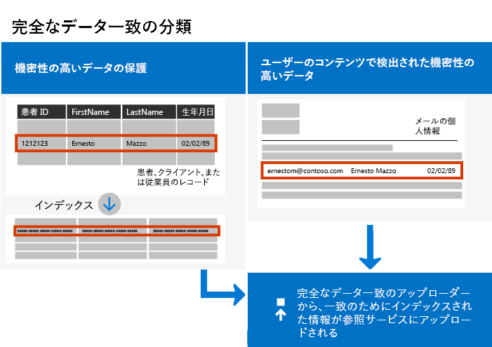

# <a name="create-custom-sensitive-information-types-with-exact-data-match-based-classification"></a>Exact Data Match に基づく分類で、カスタムの機密情報の種類を作成する

## <a name="overview"></a>概要

[カスタムの機密情報の種類](https://docs.microsoft.com/ja-JP/office365/securitycompliance/custom-sensitive-info-types) は、機密情報の不注意または不適切な共有を防ぐために使用されます。 管理者は  [セキュリティー/コンプライアンス センター](https://docs.microsoft.com/ja-JP/office365/securitycompliance/create-a-custom-sensitive-information-type) または [PowerShell](https://docs.microsoft.com/ja-JP/office365/securitycompliance/create-a-custom-sensitive-information-type-in-scc-powershell)  を使用して、パターン、証拠 ( *従業員*、 *バッジ*、 *ID*などのキーワード)、文字の近接性 (特定のパターンの文字に証拠がどれほど近接しているか)、および信頼レベルに基づいてカスタムの機密情報の種類を定義できます。 このようなカスタムの機密情報の種類は、多くの組織のビジネス ニーズを満たします。

しかし、汎用的なパターンのみを使用するのではなく、正確なデータ値を使用するカスタムの機密情報の種類が必要な場合はどうでしょう。 Exact Data Match (EDM) ベースの分類では、次の目的で設計されたカスタムの機密情報の種類を作成できます。

- 動的で更新可能なものにする。
- 拡張性の高いものにする。
- 結果的に誤検知数を減らす。
- 構造化された機密データを操作する。
- 機密情報をより安全に処理する。
- さまざまな Microsoft クラウド サービスで使用する。



EDM ベースの分類を使用すると、機密情報のデータベース内の正確な値を参照する、カスタムの機密情報の種類を作成できます。 データベースは毎日、または毎週更新できます。また、最大 1000 万行のデータを格納できます。 そのため、従業員、患者、または顧客の出入りに合わせて記録が変更されても、カスタムの機密情報の種類は最新の状態が維持されます。 また、EDM ベースの分類は、 [データ損失防止ポリシー](https://docs.microsoft.com/ja-JP/office365/securitycompliance/data-loss-prevention-policies) (DLP) や [Microsoft Cloud App Security ファイル ポリシー](https://docs.microsoft.com/cloud-app-security/data-protection-policies) などのポリシーと共に使用できます。

## <a name="required-licenses-and-permissions"></a>必要なライセンスとアクセス許可

この記事で説明されているタスクを実行するには、全体管理者、コンプライアンス管理者、または Exchange Online の管理者である必要があります。 DLP アクセス許可の詳細については、「 [アクセス許可](https://docs.microsoft.com/ja-JP/office365/securitycompliance/data-loss-prevention-policies#permissions)」を参照してください。

一般公開されると、EDM ベースの分類は次のサブスクリプションに含まれます。

- Office 365 E5
- Microsoft 365 E5
- Microsoft 365 Information Protection and Compliance
- Office 365 Advanced Compliance

## <a name="the-work-flow-at-a-glance"></a>ワークフローの概要

|フェーズ  |前提条件  |
|---------|---------|
|[パート 1: EDM ベースの分類をセットアップする](#part-1-set-up-edm-based-classification)<br/><br/>(適宜)<br/>- [データベーススキーマを編集する](#editing-the-schema-for-edm-based-classification) <br/>- [スキーマを削除する](#removing-the-schema-for-edm-based-classification) |- 機密データへの読み取りアクセス<br/>- .xml 形式のデータベース スキーマ (例を提供)<br/>- .xml 形式のルールパッケージ (例を提供)<br/>- セキュリティ/コンプライアンス センターへの管理者権限 (PowerShell を使用) |
|[パート 2: 機密データのインデックスを作成しアップロードする](#part-2-index-and-upload-the-sensitive-data)<br/><br/>(適宜)<br/>[データを更新する](#refreshing-your-sensitive-information-database) |- カスタムのセキュリティ グループとユーザー アカウント<br/>- EDM アップロード エージェントを使用するコンピューターへのローカル管理者アクセス<br/>- 機密データへの読み取りアクセス<br/>- データ更新のプロセスとスケジュール|
|[パート 3: Microsoft クラウド サービスで EDM ベースの分類を使用する](#part-3-use-edm-based-classification-with-your-microsoft-cloud-services) |- DLP を使用する Office 365 サブスクリプション<br/>- 有効化された EDM ベースの分類機能 |

### <a name="part-1-set-up-edm-based-classification"></a>パート 1: EDM ベースの分類をセットアップする

EDM ベースの分類をセットアップおよび構成するには、機密データを .csv 形式で保存し、機密情報のデータベースのスキーマを定義して、ルール パッケージを作成し、スキーマとルール パッケージをアップロードします。

#### <a name="define-the-schema-for-your-database-of-sensitive-information"></a>機密情報のデータベースのスキーマを定義する

1. 使用する機密情報を特定します。 データを Microsoft Excel などのアプリにエクスポートし、ファイルを .csv 形式で保存します。 データ ファイルには、次のデータを含めることができます。
      - 最大 1,000 万行の機密データ
      - データ ソースごとに最大 32 列 (フィールド)
      - 検索可能としてマークされた列 (フィールド) を最大 5 列

2. EDM ベースの分類に使用されるフィールドの名前が 1 行目に含まれるように、.csv ファイル内の機密データを構成します。 .csv ファイルには、"ssn"、"birthdate"、"firstname"、"lastname" などのフィールド名があります。 たとえば、使用する .csv ファイルの名前を  *PatientRecords.csv*、列には  *PatientID*、 *MRN*、 *LastName*、 *FirstName*、 *SSN*  などを含めます。

3. 機密情報のデータベースのスキーマを .xml 形式で定義します (次の例と同様)。 このスキーマ ファイルの名前を付けて、データベースの各列に対して構文 \<Field name="" searchable=""/\> を使用する行があるように構成します。

      -  *Field name*  の値に列名を使用します。
      -  *searchable="true"*  を使用して、最大 5 つのフィールドで検索可能にします。 少なくとも 1 つのフィールドを検索可能に指定する必要があります。

たとえば、次の .xml ファイルは患者の記録のデータベースのスキーマを定義します。検索可能として指定された 5 つのフィールドは、 *PatientID*、 *MRN*、 *SSN*、 *Phone*、 *DOB* です。

(この例は、コピー、変更、使用することができます。)

 ```xml
<EdmSchema xmlns="http://schemas.microsoft.com/office/2018/edm">
      <DataStore name="PatientRecords" description="Schema for patient records" version="1">
            <Field name="PatientID" searchable="true" />
            <Field name="MRN" searchable="true" />
            <Field name="FirstName" />
            <Field name="LastName" />
            <Field name="SSN" searchable="true" />
            <Field name="Phone" searchable="true" />
            <Field name="DOB" searchable="true" />
            <Field name="Gender" />
            <Field name="Address" />
      </DataStore>
</EdmSchema>
```

4. [Office 365 セキュリティ/コンプライアンス センター PowerShell へ接続する](https://docs.microsoft.com/powershell/exchange/office-365-scc/connect-to-scc-powershell/connect-to-scc-powershell?view=exchange-ps)。

5. データベース スキーマをアップロードするには、次のコマンドレットを 1 つずつ実行します。

```powershell
$edmSchemaXml=Get-Content .\\edm.xml -Encoding Byte -ReadCount 0
New-DlpEdmSchema -FileData $edmSchemaXml -Confirm:$true
```

次のように、確認を求められます。

> 確認
>
> この操作を実行しますか?
>
> データストア ' patientrecords ' の新しい EDM スキーマがインポートされます。
>
> \[Y\] Yes \[A\] すべて Yes \[N\] No \[L\] すべて No \[?\] ヘルプ (規定値は "Y"):

> [!TIP]
> 確認なしで変更を行う場合は、手順 5 で次のコマンドレットを代わりに使用します: New-DlpEdmSchema -FileData $edmSchemaXml

> [!NOTE]
> 追加機能を使用して EDMSchema を更新するには、10 から 60 分かかることがあります。 追加機能を使用する手順を実行する前に、更新プログラムを完了する必要があります。

機密情報のデータベースのスキーマが定義されたので、次はルール パッケージをセットアップします。 セクション「 [ルール パッケージのセットアップ](#set-up-a-rule-package)」に進みます。

#### <a name="editing-the-schema-for-edm-based-classification"></a>EDM ベースの分類のスキーマを編集する

EDM ベースの分類に使用するフィールドの変更など、edm.xml ファイルを変更する場合は、次の手順に従います:

1. edm.mxl ファイルを編集します (これは、この記事の「 [スキーマを定義する](#define-the-schema-for-your-database-of-sensitive-information) 」セクションで説明したファイルです)。

2. [Office 365 セキュリティ/コンプライアンス センター PowerShell へ接続する](https://docs.microsoft.com/powershell/exchange/office-365-scc/connect-to-scc-powershell/connect-to-scc-powershell?view=exchange-ps)。

3. データベース スキーマを更新するには、次のコマンドレットを 1 つずつ実行します。

```powershell
$edmSchemaXml=Get-Content .\\edm.xml -Encoding Byte -ReadCount 0
Set-DlpEdmSchema -FileData $edmSchemaXml -Confirm:$true
```

次のように、確認を求められます。

> 確認
>
> この操作を実行しますか?
>
> データストア ' patientrecords ' の EDM スキーマが更新されます。
>
> \[Y\] Yes \[A\] すべて Yes \[N\] No \[L\] すべて No \[?\] ヘルプ (規定値は "Y"):

> [!TIP]
> 確認なしで変更を行う場合は、手順 3 で次のコマンドレットを代わりに使用します: Set-DlpEdmSchema -FileData $edmSchemaXml

> [!NOTE]
> 追加機能を使用して EDMSchema を更新するには、10 から 60 分かかることがあります。 追加機能を使用する手順を実行する前に、更新プログラムを完了する必要があります。

## <a name="removing-the-schema-for-edm-based-classification"></a>EDM ベースの分類のスキーマを削除する

(必要に応じて) EDM ベースの分類に使用しているスキーマを削除するには、次の手順に従います:

1. [Office 365 セキュリティ/コンプライアンス センター PowerShell へ接続する](https://docs.microsoft.com/powershell/exchange/office-365-scc/connect-to-scc-powershell/connect-to-scc-powershell?view=exchange-ps)。

2. 次の PowerShell コマンドレットを実行して、「patientrecords」のデータ ストア名を削除するものに置き換えます。

```powershell
Remove-DlpEdmSchema -Identity patientrecords
```

次のように、確認を求められます。

> 確認
>
> この操作を実行しますか?
>
> データストア ' patientrecords ' の EDM スキーマが削除されます。
>
> \[Y\] Yes \[A\] すべて Yes \[N\] No \[L\] すべて No \[?\] ヘルプ (規定値は "Y"):

> [!TIP]
>  確認なしで変更を行う場合は、手順 2 で次のコマンドレットを代わりに使用します: Remove-DlpEdmSchema -Identity patientrecords -Confirm:$false

### <a name="set-up-a-rule-package"></a>ルール パッケージを設定する

1. 次の例のように、.xml 形式 (Unicode エンコード) でルール パッケージを作成します。 (この例は、コピー、変更、使用することができます。)

ルール パッケージをセットアップするときに、.csv ファイルと edm .xml ファイルを正しく参照してください。 この例は、コピー、変更、使用が可能です。 このサンプル xml では、EDM の機密情報の種類を作成するために、次のフィールドをカスタマイズする必要があります。

- **RulePack id & ExactMatch id**:  [New-GUID](https://docs.microsoft.com/ja-JP/powershell/module/microsoft.powershell.utility/new-guid?view=powershell-6)  を使用して GUID を作成します。

- **Datastore**: このフィールドは、使用する EDM ルックアップデータストアを指定します。 設定済みの EDM スキーマのデータソース名を指定します。

- **idMatch**: このフィールドは、EDM の主要素を示します。
  - 検索結果: ルックアップで使用するフィールドを指定します。 データストアの EDM スキーマで検索可能なフィールド名を指定します。
  - 分類: このフィールドでは、EDM ルックアップをトリガーする、機密情報の種類を指定します。 既存の組み込みまたはカスタム分類の名前または GUID を指定できます。

- **Match:** このフィールドは、近接 idMatch で見つかった追加の証拠を示します。
  - Matches: データストアの EDM スキーマで検索可能なフィールド名を指定します。
- **リソース:** このセクションでは、複数のローカルでの機密情報の種類の名前と説明を指定します。
  - idRef: ExactMatch id の GUID を指定します。
  - スキーマの名前と説明を編集する: 必要に応じてカスタマイズします。

```xml
<RulePackage xmlns="http://schemas.microsoft.com/office/2018/edm">
  <RulePack id="fd098e03-1796-41a5-8ab6-198c93c62b11">
    <Version build="0" major="2" minor="0" revision="0" />
    <Publisher id="eb553734-8306-44b4-9ad5-c388ad970528" />
    <Details defaultLangCode="en-us">
      <LocalizedDetails langcode="en-us">
        <PublisherName>IP DLP</PublisherName>
        <Name>Health Care EDM Rulepack</Name>
        <Description>This rule package contains the EDM sensitive type for health care sensitive types.</Description>
      </LocalizedDetails>
    </Details>
  </RulePack>
  <Rules>
    <ExactMatch id = "E1CC861E-3FE9-4A58-82DF-4BD259EAB371" patternsProximity = "300" dataStore ="PatientRecords" recommendedConfidence = "65" >
      <Pattern confidenceLevel="65">
        <idMatch matches = "SSN" classification = "U.S. Social Security Number (SSN)" />
      </Pattern>
      <Pattern confidenceLevel="75">
        <idMatch matches = "SSN" classification = "U.S. Social Security Number (SSN)" />
        <Any minMatches ="3" maxMatches ="100">
          <match matches="PatientID" />
          <match matches="MRN"/>
          <match matches="FirstName"/>
          <match matches="LastName"/>
          <match matches="Phone"/>
          <match matches="DOB"/>
        </Any>
      </Pattern>
    </ExactMatch>
    <LocalizedStrings>
      <Resource idRef="E1CC861E-3FE9-4A58-82DF-4BD259EAB371">
        <Name default="true" langcode="en-us">Patient SSN Exact Match.</Name>
        <Description default="true" langcode="en-us">EDM Sensitive type for detecting Patient SSN.</Description>
      </Resource>
    </LocalizedStrings>
  </Rules>
</RulePackage>
```

1. 次の PowerShell コマンドレットを 1 つずつ実行して、ルール パッケージをアップロードします。

```powershell
$rulepack=Get-Content .\\rulepack.xml -Encoding Byte -ReadCount 0
New-DlpSensitiveInformationTypeRulePackage -FileData $rulepack
```

この時点で、EDM ベースの分類がセットアップされています。 次の手順では、機密データにインデックスを付け、インデックス付きのデータをアップロードします。

前の手順から PatientRecords スキーマが次の 5 つのフィールドを検索可能として定義していることに注意してください:  *PatientID*、 *MRN*、 *SSN*、 *Phone*、 *DOB*。 ルール パッケージの例には、これらのフィールドが含まれ、検索可能なフィールドごとに 1 つの  *ExactMatch*  アイテムを含むデータベース スキーマ ファイル (edm.xml) を参照します。 次の ExactMatch アイテムを検討してください。

```xml
<ExactMatch id = "E1CC861E-3FE9-4A58-82DF-4BD259EAB371" patternsProximity = "300" dataStore ="PatientRecords" recommendedConfidence = "65" >
      <Pattern confidenceLevel="65">
        <idMatch matches = "SSN" classification = "U.S. Social Security Number (SSN)" />
      </Pattern>
      <Pattern confidenceLevel="75">
        <idMatch matches = "SSN" classification = "U.S. Social Security Number (SSN)" />
        <Any minMatches ="3" maxMatches ="100">
          <match matches="PatientID" />
          <match matches="MRN"/>
          <match matches="FirstName"/>
          <match matches="LastName"/>
          <match matches="Phone"/>
          <match matches="DOB"/>
        </Any>
      </Pattern>
    </ExactMatch>
```

この例では、次の点に注意してください。

- データストア名は、以前に作成した .csv ファイルを参照します ( **datastore = "PatientRecords"**)。

- idMatch 値は、データベース スキーマ ファイルに一覧表示されている検索可能なフィールドを参照します ( **idMatch matches = "SSN"**)。

- 分類の値は、既存またはカスタムの機密情報の種類を参照します ( **分類 = "米国社会保障番号 (SSN)"**)。 (この場合は、既存の機密情報の種類の米国社会保障番号を使用します。)

> [!NOTE]
> 追加機能を使用して EDMSchema を更新するには、10 から 60 分かかることがあります。 追加機能を使用する手順を実行する前に、更新プログラムを完了する必要があります。

### <a name="part-2-index-and-upload-the-sensitive-data"></a>パート 2: 機密データのインデックスを作成しアップロードする

このフェーズでは、カスタムのセキュリティ グループとユーザー アカウントをセットアップし、EDM Upload Agent ツールをセットアップします。 次に、このツールを使用して機密データにインデックスを作成し、インデックス付きのデータをアップロードします。

#### <a name="set-up-the-security-group-and-user-account"></a>セキュリティ グループとユーザー アカウントをセットアップする

1. 全体管理者として、管理センター ([https://admin.microsoft.com](https://admin.microsoft.com/)) へ移動し、EDM \_DataUploaders という  [セキュリティー グループを作成](https://docs.microsoft.com/office365/admin/email/create-edit-or-delete-a-security-group?view=o365-worldwide)  します。

2.  *EDM\_DataUploaders*  セキュリティ グループに、1 人以上のユーザーを追加します。 (これらのユーザーは機密情報のデータベースを管理します)。

3. 機密データを管理している各ユーザーが、EDM アップロード エージェントに使用されるコンピューターのローカル管理者であることを確認してください。

#### <a name="set-up-the-edm-upload-agent"></a>EDM アップロード エージェントをセットアップする

>[!NOTE]
> この手順を開始する前に、自分が  *EDM\_DataUploaders*  セキュリティ グループのメンバーであり、コンピューターのローカル管理者であることを確認します。

1. [EDM アップロード エージェント](https://go.microsoft.com/fwlink/?linkid=2088639)をダウンロードしてインストールします。 既定では、インストール場所は、[C:\\Program Files\\Microsoft\\EdmUploadAgent] になります。

2. EDM アップロード エージェントを承認するには、管理者として Windows コマンド プロンプトを開き、次のコマンドを実行します。

    `EdmUploadAgent.exe /Authorize`

3. 職場または学校の Office 365 アカウントでサインインします。

次の手順では、EDM アップロード エージェントを使用して機密データにインデックスを付け、インデックス付きのデータをアップロードします。

#### <a name="index-and-upload-the-sensitive-data"></a>機密データのインデックスを作成しアップロードする

機密データ ファイル (この例では  *PatientRecords.csv*) をコンピューターのローカル ドライブに保存します。 (例の  *PatientRecords.csv* file を C:\\Edm\\データに保存しました)。

機密データにインデックスを付けてアップロートするには、Windows コマンド プロンプトで次のコマンドを実行します。

`EdmUploadAgent.exe /UploadData /DataStoreName \<DataStoreName\> /DataFile \<DataFilePath\> /HashLocation \<HashedFileLocation\>`

例: **EdmUploadAgent.exe /UploadData /DataStoreName PatientRecords /DataFile C:\\Edm\\Hash\\PatientRecords.csv /HashLocation C:\\Edm\\Hash**

分離された環境で機密データのインデックスを作成して実行するには、インデックスを実行し、手順を個別にアップロードします。

機密データにインデックスを付けるには、Windows コマンド プロンプトで次のコマンドを実行します。

`EdmUploadAgent.exe /CreateHash /DataFile \<DataFilePath\> /HashLocation \<HashedFileLocation\>`

例: **EdmUploadAgent.exe /CreateHash /DataFile C:\\Edm\\Data\\PatientRecords.csv /HashLocation C:\\Edm\\Hash**

インデックス付きのデータをアップロードするには、Windows コマンド プロンプトで次のコマンドを実行します。

`EdmUploadAgent.exe /UploadHash /DataStoreName \<DataStoreName\> /HashFile \<HashedSourceFilePath\>`

例: **EdmUploadAgent.exe /UploadHash /DataStoreName PatientRecords /HashFile C:\\Edm\\Hash\\PatientRecords.EdmHash**

機密データがアップロードされたことを確認するには、Windows コマンド プロンプトで次のコマンドを実行します。

`EdmUploadAgent.exe /GetDataStore`

データ ストアのリストと、それらが最後に更新された日時が表示されます。

 [機密情報データベースを更新する](#refreshing-your-sensitive-information-database)ためのプロセスとスケジュールのセットアップを進めます。

この時点で、Microsoft クラウド サービスで EDM ベースの分類を使用する準備が整いました。 たとえば、 [EDM ベースの分類を使用して DLP ポリシーを設定](#to-create-a-dlp-policy-with-edm)できます。

#### <a name="refreshing-your-sensitive-information-database"></a>機密情報データベースを更新する

機密情報データベースは毎日または毎週更新できます。また、EDM アップロード ツールを使用して機密データのインデックスを再作成し、インデックス付きデータを再アップロードできます。

1. 機密情報のデータベースを更新するためのプロセスと頻度 (毎日または毎週) を決定します。

2. 機密情報データを Microsoft Excel などのアプリに再度エクスポートし、ファイルを .csv 形式で保存します。 「 [機密データのインデックスを作成しアップロードする](#index-and-upload-the-sensitive-data)」で説明した手順の実行時に使用したファイル名と場所と同じものを使用してください。

> [!NOTE]
> .csv ファイルの構造 (フィールド名) に変更がない場合は、データを更新する際に、データベース スキーマ ファイルを変更する必要はありません。 ただし、変更が必要な場合は、必要に応じてデータベース スキーマとルール パッケージを編集してください。

3.  [タスク スケジューラ](https://docs.microsoft.com/windows/desktop/TaskSchd/task-scheduler-start-page) を使用して、 [機密データのインデックスを作成しアップロードする](#index-and-upload-the-sensitive-data)  手順の、手順 2 と 3 を自動化します。 タスクのスケジュールを設定するにはいくつかの方法があります。

| **方法**             | **操作**                                                                                                                                                                                                                                                                                                                                                                                                                     |
| ---------------------- | ---------------------------------------------------------------------------------------------------------------------------------------------------------------------------------------------------------------------------------------------------------------------------------------------------------------------------------------------------------------------------------------------------------------------------------- |
| Windows PowerShell     |  [ScheduledTasks](https://docs.microsoft.com/powershell/module/scheduledtasks/?view=win10-ps) のドキュメントと、この記事の  [PowerShell スクリプトの例](#example-powershell-script-for-task-scheduler) を参照してください。 |
| タスク スケジューラ API     |  [タスク スケジューラ](https://docs.microsoft.com/windows/desktop/TaskSchd/using-the-task-scheduler) ドキュメントを参照してください                                                                                                                                                                                                                                                                                |
| Windows のユーザー インターフェイス | Windows の場合、 **[スタート]** をクリックし、「タスクスケジューラ」と入力します。 次に、結果のリストで  **[タスク スケジューラ]** を右クリックし、 **[管理者として実行]** を選択します。                                                                                                                                                                                                                                                                           |

#### <a name="example-powershell-script-for-task-scheduler"></a>タスク スケジューラの PowerShell スクリプトの例

このセクションには、データのインデックスを作成したり、インデックス付きのデータをアップロードするタスクのスケジュールに使用できる PowerShell スクリプトの例が含まれています。

##### <a name="to-schedule-index-and-upload-in-a-combined-step"></a>インデックスのスケジュールを設定して、結合されたステップでアップロードするには

```powershell
param(\[string\]$dataStoreName,\[string\]$fileLocation)
\# Assuming current user is also the user context to run the task
$user = "$env:USERDOMAIN\\$env:USERNAME"
$edminstallpath = 'C:\\Program Files\\Microsoft\\EdmUploadAgent\\'
$edmuploader = $edminstallpath + 'EdmUploadAgent.exe'
$csvext = '.csv'
\# Assuming CSV file name is same as data store name
$dataFile = "$fileLocation\\$dataStoreName$csvext"
\# Assuming location to store hash file is same as the location of csv file
$hashLocation = $fileLocation
$uploadDataArgs = '/UploadData /DataStoreName ' + $dataStoreName + ' /DataFile ' + $dataFile + ‘ /HashLocation’ + $hashLocation
\# Set up actions associated with the task
$actions = @()
$actions += New-ScheduledTaskAction -Execute $edmuploader -Argument $uploadDataArgs -WorkingDirectory $edminstallpath
\# Set up trigger for the task
$trigger = New-ScheduledTaskTrigger -Weekly -DaysOfWeek Sunday -At 2am
\# Set up task settings
$principal = New-ScheduledTaskPrincipal -UserId $user -LogonType S4U -RunLevel Highest
$settings = New-ScheduledTaskSettingsSet -RunOnlyIfNetworkAvailable -StartWhenAvailable -WakeToRun
\# Create the scheduled task
$scheduledTask = New-ScheduledTask -Action $actions -Principal $principal -Trigger $trigger -Settings $settings
\# Get credentials to run the task
$creds = Get-Credential -UserName $user -Message "Enter credentials to run the task"
$password=\[Runtime.InteropServices.Marshal\]::PtrToStringAuto(\[Runtime.InteropServices.Marshal\]::SecureStringToBSTR($creds.Password))
\# Register the scheduled task
$taskName = 'EDMUpload\_' + $dataStoreName
Register-ScheduledTask -TaskName $taskName -InputObject $scheduledTask -User $user -Password $password
```

#### <a name="to-schedule-index-and-upload-as-separate-steps"></a>インデックスのスケジュールを設定して、個別のステップでアップロードするには

```powershell
param(\[string\]$dataStoreName,\[string\]$fileLocation)
\# Assuming current user is also the user context to run the task
$user = "$env:USERDOMAIN\\$env:USERNAME"
$edminstallpath = 'C:\\Program Files\\Microsoft\\EdmUploadAgent\\'
$edmuploader = $edminstallpath + 'EdmUploadAgent.exe'
$csvext = '.csv'
$edmext = '.EdmHash'
\# Assuming CSV file name is same as data store name
$dataFile = "$fileLocation\\$dataStoreName$csvext"
$hashFile = "$fileLocation\\$dataStoreName$edmext"
\# Assuming location to store hash file is same as the location of csv file
$hashLocation = $fileLocation
$createHashArgs = '/CreateHash' + ' /DataFile ' + $dataFile + ' /HashLocation ' + $hashLocation
$uploadHashArgs = '/UploadHash /DataStoreName ' + $dataStoreName + ' /HashFile ' + $hashFile
\# Set up actions associated with the task
$actions = @()
$actions += New-ScheduledTaskAction -Execute $edmuploader -Argument $createHashArgs -WorkingDirectory $edminstallpath
$actions += New-ScheduledTaskAction -Execute $edmuploader -Argument $uploadHashArgs -WorkingDirectory $edminstallpath
\# Set up trigger for the task
$trigger = New-ScheduledTaskTrigger -Weekly -DaysOfWeek Sunday -At 2am
\# Set up task settings
$principal = New-ScheduledTaskPrincipal -UserId $user -LogonType S4U -RunLevel Highest
$settings = New-ScheduledTaskSettingsSet -RunOnlyIfNetworkAvailable -StartWhenAvailable -WakeToRun
\# Create the scheduled task
$scheduledTask = New-ScheduledTask -Action $actions -Principal $principal -Trigger $trigger -Settings $settings
\# Get credentials to run the task
$creds = Get-Credential -UserName $user -Message "Enter credentials to run the task"
$password=\[Runtime.InteropServices.Marshal\]::PtrToStringAuto(\[Runtime.InteropServices.Marshal\]::SecureStringToBSTR($creds.Password))
\# Register the scheduled task
$taskName = 'EDMUpload\_' + $dataStoreName
Register-ScheduledTask -TaskName $taskName -InputObject $scheduledTask -User $user -Password $password
```

### <a name="part-3-use-edm-based-classification-with-your-microsoft-cloud-services"></a>パート 3: Microsoft クラウド サービスで EDM ベースの分類を使用する

Office 365 DLP for Exchange Online (メール)、OneDrive for Business (ファイル)、Microsoft Teams (会話)、Microsoft Cloud App Security DLP ポリシーは、EDM の機密情報の種類をサポートします。

次のシナリオでは、EDM の機密情報の種類は現在開発中で、まだご利用いただけません。

- Office 365 DLP for SharePoint (ファイル)
- 機密度ラベルと保持ラベルの自動分類

#### <a name="to-create-a-dlp-policy-with-edm"></a>EDM を使用して DLP ポリシーを作成する

1. セキュリティ/コンプライアンス センターに移動します ([https://protection.office.com](https://protection.office.com/))。

2.  **[データ損失防止]** \> **[ポリシー]** を選択します。

3.  **[ポリシーの作成]** \> **[カスタム]** \> **[次へ]** の順に選択します。

4.  **[ポリシーの名前を設定]**  タブで名前と説明を指定し、 **[次へ]** を選択します。

5.  **[場所の選択]**  タブで、 **[特定の場所を選択]** し、 **[次へ]** を選択します。

6.  **[状態]** の列で、 **Exchange メール、OneDrive アカウント、Teams チャット、チャネル メッセージ** を選択し、 **[次へ]** を選択します。 (注: 現在、EDM は SharePoint サイトでサポートされていないため、DLP ポリシーは Sharepoint for EDM でファイルを検出できません)

7.  **[ポリシーの設定]**  タブで、 **[詳細設定を使用]** を選択し、 **[次へ]** を選択します。

8.  **[+ 新しいルール]** を選択します。

9.  **[名前]**  セクションで、ルールの名前と説明を指定します。

10.  **[条件]**  セクションの、 **[+ 条件の追加]**  リストで、 **[機密情報の種類を含むコンテンツ]** を選択します。<br/>![[機密情報の種類を含むコンテンツ]](media/edm-dlp-newrule-conditions.png)<br/>

11. ルール パッケージのセットアップ時に作成した機密情 報の種類を検索し、 **[+ 追加]** を選択します。  
     **[完了]** を選択します。

12. ルールのオプション ( **[ユーザー通知]**、 **[ユーザーによる上書き]**、 **[インシデント レポート]** など) の選択を終了し、 **[保存]** を選択します。

13.  **[ポリシーの設定]**  タブでルールを確認し、 **[次へ]** を選択します。

14. ポリシーをすぐに有効にするか、テストするか、無効にするかを指定します。  **[次へ]** を選択します。

15.  **[設定を確認]**  タブで、ポリシーを確認します。 必要な変更を行います。 準備ができたら  **[作成]** を選択します。

> [!NOTE]
> 新しい DLP ポリシーがデータ センターを通過するまでに、約 1 時間かかります。

## <a name="related-articles"></a>関連記事

[組み込みの機密情報の種類とその検索対象](https://docs.microsoft.com/ja-JP/office365/securitycompliance/what-the-sensitive-information-types-look-for)

[カスタムの機密情報の種類](https://docs.microsoft.com/ja-JP/office365/securitycompliance/custom-sensitive-info-types)

[DLP ポリシーの概要](https://docs.microsoft.com/ja-JP/office365/securitycompliance/data-loss-prevention-policies)

[Microsoft Cloud App Security](https://docs.microsoft.com/cloud-app-security)

[New-DlpEdmSchema](https://docs.microsoft.com/ja-JP/powershell/module/exchange/policy-and-compliance-dlp/new-dlpedmschema?view=exchange-ps)

## <a name="feedback"></a>フィードバック
GitHub フィードバックは有効になっていますが、懸案事項の追加は、公開サイトでのみ行うことができます。
