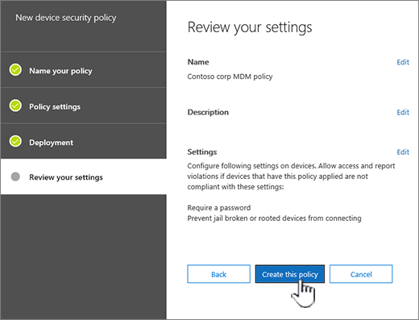

# デバイス セキュリティ ポリシーを作成して展開する

Office 365 でモバイル デバイスの管理を使用するには Office 365 の組織の情報を不正アクセスから保護するセキュリティ ポリシーを作成します。デバイスのユーザーが Office 365 のライセンスが適用され、Office 365 の MDM のデバイスを登録するには、組織内で任意のモバイル デバイスにポリシーを適用できます。
  
## はじめに

- デバイス、モバイル デバイスのアプリケーション、および Office 365 の MDM をサポートするセキュリティ設定について説明します。[Office 365 でモバイル デバイス管理の機能](capabilities-of-mobile-device-management.md)を参照してください。
    
- ポリシーを適用する Office 365 のユーザーを含むセキュリティ グループを作成し、ユーザーの Office 365 へのアクセスをブロックから除外する場合します。新しいポリシーを組織に展開する前にテストすること、ポリシーで少数のユーザーに展開することをお勧めします。作成し、自分自身または小さい番号 Office 365 ユーザーのポリシーをテストすることをだけを含むセキュリティ グループを使用できます。セキュリティ グループの詳細については、[作成、編集、またはセキュリティ グループを削除する](https://go.microsoft.com/fwlink/p/?LinkId=518555)を参照してください。
    
- **重要な:** モバイル デバイスのポリシーを作成するには、アクティブにし、Office 365 の MDM を設定する必要があります。[Office 365 でモバイル デバイス管理の概要](overview-of-mdm.md)を参照してください。
    
- 作成し、Office 365 でモバイル デバイス管理のポリシーを展開、Office 365 のグローバル管理者にする必要があります。参照してください[では、Office 365 のセキュリティ アクセス許可&amp;コンプライアンス センター](https://support.office.com/article/d10608af-7934-490a-818e-e68f17d0e9c1)です。
    
- ポリシーを展開する前に、組織が Office 365 を MDM のデバイスを登録することの潜在的な影響を知ることができます。によってどのようにポリシーを設定すると、準拠していないデバイスは、Office 365 へのアクセスがブロックされることが、インストールされているアプリケーション、写真、および、登録されているデバイスでの個人情報を含むデータを削除することができます。
    
> [!NOTE]
> ポリシーおよび Office 365 の MDM で作成したアクセス ルールは、Exchange ActiveSync モバイル デバイス メールボックス ポリシーと Exchange 管理センターで作成されたデバイス アクセスのルールをオーバーライドします。デバイスが Exchange ActiveSync モバイル デバイス メールボックス ポリシーを使用すると、Office 365 の MDM に登録されているか、デバイスに適用するデバイス アクセス ルールは無視されます。Exchange ActiveSync の詳細については、 [Exchange のオンラインでの Exchange ActiveSync](https://go.microsoft.com/fwlink/p/?LinkId=524380)を参照してください。 
  
## 手順 1: セキュリティ ポリシーを作成し、テスト グループに展開

を起動する前にアクティブにしている Office 365 の MDM を設定を確認します。手順については、[概要のモバイル デバイスの管理](overview-of-mdm.md)を参照してください。 
  
1. セキュリティで、Office 365 の&amp;コンプライアンス部門、**データ損失の防止**に\>**デバイスのセキュリティ ポリシー**です。
    
    > [!NOTE]
    > **デバイス セキュリティ ポリシー**は、モバイル デバイスの管理を有効にした後にのみ、メニューに表示されます。 
  
2. **+ ポリシーの作成**を選択します。
    
    ![デバイス セキュリティ ポリシー] の下の MDN デバイス ポリシーを作成します。](media/fbcdbecd-0016-42f1-81a9-9fbad610da90.png)
  
3. 新しいポリシーの**名前**と**説明**を指定し、し、[**次**] を選択します。
    
    
  
4. **デバイスに必要な要件は何ですか?** ページで、組織内のモバイル デバイスに適用要件を指定し、[**次**] を選択します。
    
    ![デバイスのセキュリティ ポリシーの設定] ページ](media/186b3bd5-5e3d-4059-978f-94113111a8ca.png)
  
5. **たい項目を構成する?** ページで、組織内のモバイル デバイスに適用する追加要件を指定し、[**次**] を選択します。
    
6. **今すぐこのポリシーを適用するか?** ページ、 **[はい]** をクリックし選択 **+ 追加**。 
    
    
  
7. 組織に展開し、[**追加**する前にポリシーをテストするグループを選択します。
    
8. [ **次へ**] を選択します。
    
9. 新しいデバイス ポリシーの詳細を確認して、**このポリシーの作成**を選択します。
    
    
  
10. **[閉じる]** をクリックします。
    
ポリシーを適用する各ユーザーは、次に、モバイル デバイスを使用して Office 365 にサインインするときにそのデバイスにプッシュするポリシーがあります。ユーザーにポリシーが適用する前に携帯電話がなかった場合、ポリシーを展開した後が表示されます通知[登録し、Office 365 の MDM をアクティブにする手順](https://go.microsoft.com/fwlink/?LinkId=615272)にはが含まれますデバイスにします。登録を完了するまで電子メールへのアクセス、OneDrive、およびその他のサービスとなります。Intune 会社のポータル アプリケーションを使用して登録を完了した後は、サービスを使用して行うことができるし、ポリシーは、そのデバイスに適用されます。
  
## 手順 2: は、ポリシーの動作を確認します。

セキュリティ ポリシーを作成したら、ポリシーが組織に展開する前に期待どおりに動作するかを確認する必要があります。
  
1. Office 365 に移動**セキュリティ&amp;コンプライアンス センター** \> **データの損失防止** \> **デバイスの管理**です。
    
2. **Office 365 でモバイル デバイスの管理**] ページで、ポリシーが適用されているユーザー デバイスの状態を確認してください。フィルターまたは並べ替えすることができます**すべて**を表示するすべてのデバイス、またはブロックされたデバイスを表示するのには**ブロック**しています。 
    
    
  
3. フル] または [選択したデバイスのワイプを行うことができます。手順については、 [Office 365 でモバイル デバイスをワイプする](wipe-a-mobile-device.md)を参照してください。
    
## ステップ 3: 組織にポリシーを展開します。

モバイル デバイスのポリシーを作成し、期待どおりに動作することを確認、したらは、組織に展開します。
  
1. Office 365 に移動**セキュリティ&amp;コンプライアンス センター** \> **データの損失防止**\> **デバイスのセキュリティ ポリシー**です。
    
2. 、配置するポリシーを選択し、[**ポリシーの編集**」を選択、 \<_ポリシー名_\>パネルです。  
    
3. **[展開]** タブを選択します。 
    
4. [**配置**] タブで **[はい]** の上に**1 つまたは複数のセキュリティ グループにこのポリシーを適用するユーザーを含む**、**追加**を選択します。
    
  - [**グループの選択**] パネルを追加するグループを検索することができます、エイリアスまたは表示名のいずれかにフィルターを適用することができます。**グループ**] ボックスの一覧から既存のグループを追加することもできます。 
    
    ポリシーを適用するのには複数のグループを追加することができます。
    
    パネルの下部に**追加**」を選択します。 
    
5. [**展開**] タブには、**保存**を選択します。 
    
    
  
ポリシーを適用する各ユーザーは、次に、モバイル デバイスから Office 365 にサインインするときにそのデバイスにプッシュするポリシーがあります。ユーザーに、モバイル デバイスに適用されるポリシーがなかった場合は、[デバイスに通知を受け取る](https://go.microsoft.com/fwlink/?LinkId=615272)を登録し、Office 365 の MDM のアクティブ化の手順を実行、します。登録を完了すると、ポリシーは、デバイスに適用されます。 
  
## 手順 4: サポートされていないデバイスの電子メール アクセスをブロック

保護するには、組織の情報を遮断する Office 365 の電子メールを Office 365 の MDM によってサポートされていないモバイル デバイス用のアプリケーション アクセス。サポートされているデバイスの一覧については、 [Office 365 でモバイル デバイス管理の機能](capabilities-of-mobile-device-management.md)を参照してください。これを行うには。 
  
1. セキュリティに&amp;コンプライアンス センター\> **データの損失防止**\> **デバイスのセキュリティ ポリシー**です。
    
2. **組織全体のデバイス アクセス設定の管理**を選択します。
    
    ![コンプライアンス センターを参照して\>デバイスと、デバイスのアクセス設定の管理] リンクをクリックします。](media/b9f4da3c-dfa5-4913-8482-42a077cb4f56.png)
  
3. サポートされていないデバイスをブロックするには、下にある**場合は、Office 365 の MDM によってデバイスがサポートされていないかを許可またはブロックすることから、組織の電子メールにアクセスするのには Exchange アカウントを使用して****ブロック**を選択して\>**を保存**します。
  
## 手順 5:条件付きのアクセス チェックから除外するセキュリティ グループを選択する

モバイル デバイスに対する条件付きアクセス チェックから一部のユーザーを除外しようとして、それらのユーザー用に 1 つ以上のセキュリティ グループを作成した場合は、この手順でそのセキュリティ グループを追加します。これらのグループ内のユーザーには、サポートされているモバイル デバイスに関するポリシーが適用されません。
  
1. セキュリティに&amp;コンプライアンス センター\> **データの損失防止**\> **デバイスのセキュリティ ポリシー**です。
    
2. **組織全体のデバイス アクセス設定の管理**を選択します。
    
    ![コンプライアンス センターを参照して\>デバイスと、デバイスのアクセス設定の管理] リンクをクリックします。](media/b9f4da3c-dfa5-4913-8482-42a077cb4f56.png)
  
3. Office 365 へのアクセスをブロックする対象から除外したいユーザーを持つセキュリティ グループを追加するのには**追加**を選択します。ユーザーは、このリストに追加されましたが、サポートされていないデバイスを使用すると Office 365 の電子メールにアクセスできるようにします。 
    
4. **グループの選択**] パネルで使用するセキュリティ グループを選択します。 
    
5. 名、および、**追加**を選択して\>**を保存**します。
    
6. [**組織全体のデバイス アクセス設定**] パネルには、**保存**を選択します。
  
## セキュリティ ポリシーは他のデバイスの種類にどのような影響を与えますか。

ユーザーのデバイスにポリシーを適用する場合、各デバイスへの影響はさまざまなデバイスの種類間でいくらか異なります。さまざまなデバイスにおけるポリシーの影響の例については、次の表を参照してください。
  

|**セキュリティ ポリシー**|**Windows Phone 8.1 +**|**Android 4 以降**|**Samsung 連盟ノックス ・**|**IOS 6 +**|**メモ**|
|:-----|:-----|:-----|:-----|:-----|:-----|
|暗号化されたバックアップが必要    |✖    |✖    |✔    |✔    |iOS の暗号化バックアップが必要です。    |
|クラウド バックアップの禁止    |✖    |✔    |✔    |✔    |Android での Google バックアップが禁止され (淡色表示)、iOS でのクラウド バックアップが禁止されます。    |
|ドキュメントの同期の禁止    |✖    |✖    |✖    |✔    |iOS:クラウド内のドキュメントがブロックされます。    |
|写真の同期の禁止    |✖    |✖    |✖    |✔    |iOS (ネイティブ):写真ストリームがブロックされます。    |
|画面キャプチャの禁止    |✔    |X    |✔    |✔    |実行時にブロックされます。    |
|ビデオ会議のブロック    |✖    |✖    |✖    |✔    |iOS では FaceTime が禁止されます。Skype などは禁止されません。    |
|診断データの送信の禁止    |✖    |X    |✔    |✔    |Android における Google のクラッシュ レポートの送信が禁止されます。    |
|アプリ ストアへのアクセスの禁止    |✔    |X    |✔    |✔    |[アプリ ストア] アイコンが、Android ではホーム ページに表示されません。Windows では無効になります。iOS では表示されません。    |
|アプリ ストアにパスワードが必要    |✖    |✖    |✖    |✔    |iOS:iTunes の購入にパスワードが必要です。    |
|リムーバブル記憶域への接続の禁止    |✔    |X    |✔    |該当なし    |Android:SD カードは設定で淡色表示され、Windows からユーザーに通知され、ここにインストールされたアプリは使用できません    |
|Bluetooth 接続の禁止    |✔    |\*\*\*    |\*\*\*    |✖    |\*\*\*Android の設定として BlueTooth を無効にできません。BlueTooth を必要とするすべてのトランザクションを無効にして代わりに、: 高度なオーディオ配信、オーディオ/ビデオ リモート コントロール、ハンズフリー デバイス、ヘッドセット、電話帳へのアクセスとシリアル ポートです。次のいずれかを使用する場合は、ページの下部にある小さなトースト メッセージが表示されます。    |
   
## ポリシーを削除した場合やポリシーからユーザーを削除した場合に行われる処理

ポリシーを削除した場合、またはポリシーの配置する先のグループからユーザーを削除すると、ユーザーのデバイスからポリシーの設定、Office 365 の電子メール プロファイルとキャッシュされた e メールを削除する場合があります。別のデバイスの種類の削除は、内容を確認するのには次の表を参照してください。
  
|**削除される内容**|**Windows Phone 8.1 +**|**iOS 6 +**|**Android 4 + (Samsung 連盟ノックス ・を含む)**|
|:-----|:-----|:-----|:-----|
|マネージ電子メール プロファイル\*    |✖    |✔    |✖    |
|ポリシー設定    |✔              ただし、**[デバイスからの診断データ送信の禁止]** は除きます。   |✔    |✖    |
   
> [!NOTE]
> \*オプションを使用して、ポリシーが配置されている場合**電子メールのプロファイルを管理**し、管理対象の電子メール プロファイルを選択したし、キャッシュされ、e メールのプロファイルがユーザーのデバイスから削除されます。 
  
削除されたポリシーに適用する各ユーザーは、次回のモバイル デバイスを Office 365 の MDM を使用して確認、デバイスから削除するポリシーがあります。これらのユーザーのデバイスに適用する新しいポリシーを展開する場合は、Office 365 は、MDM に再登録する求めします。
  
[デバイスをワイプ](wipe-a-mobile-device.md)することも、いずれかの方法を完全に、または選択的にワイプ、デバイスから組織の情報です。
  
## 関連項目

[Office 365 用のモバイル デバイス管理の概要](overview-of-mdm.md)
  
[Office 365 用のモバイル デバイス管理の機能](capabilities-of-mobile-device-management.md)
  

