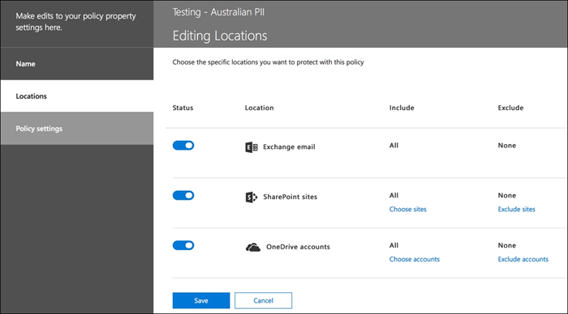
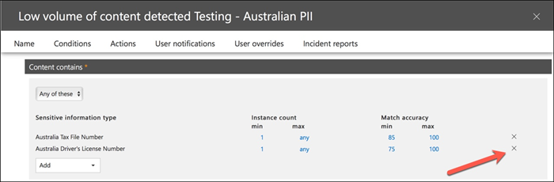

# DLP ポリシーの作成、テスト、調整Create, test, and tune a DLP policy

**プリンシパルの作成者****Principal author**  
Paul Cunningham、Microsoft MVPPaul Cunningham, Microsoft MVP  
[実際的な365Practical 365](https://practical365.com/)  
[@Practical365@Practical365](https://twitter.com/practical365) 
__________________________________________________

データ損失防止とは、Office 365 のコンプライアンス機能で、組織が不要な機密情報を意図的または偶発的に危険にさらすことを防ぐために設計されています。Data loss prevention is a compliance feature of Office 365 that is designed to help your organization prevent the intentional or accidental exposure of sensitive information to unwanted parties. DLP は、exchange Server と exchange Online ではルートがあり、SharePoint Online と OneDrive for business にも適用されます。DLP has its roots in Exchange Server and Exchange Online, and is also applicable in SharePoint Online and OneDrive for Business.

DLP では、コンテンツ分析エンジンを使用して、電子メールメッセージとファイルの内容を調べ、クレジットカード番号や個人を特定できる情報 (PII) などの機密情報を検索します。DLP uses a content analysis engine to examine the contents of email messages and files, looking for sensitive information such as credit card numbers and personally identifiable information (PII). 機密情報は、電子メールメッセージやファイルの暗号化などの追加の手順を行わずに、電子メールで送信したり、ドキュメントに含めたりする必要はありません。Sensitive information should typically not be sent in email, or included in documents, without taking additional steps such as encrypting the email message or files. DLP を使用すると、機密情報を検出し、次のような処理を実行できます。Using DLP you can detect sensitive information, and take action such as:

- 監査目的でイベントをログに記録するLog the event for auditing purposes
- エンドユーザーに電子メールを送信しているかファイルを共有していることを示す警告を表示するDisplay a warning to the end user who is sending the email or sharing the file
- メールまたはファイル共有が行われないようにアクティブにブロックするActively block the email or file sharing from taking place

場合によっては、保護する必要があるデータの種類が自分にとって考慮されないため、DLP を破棄することがあります。Sometimes customers dismiss DLP because they don't consider themselves to have the type of data that needs protecting. 医療記録や財務情報などの機密データは、健康保険やオンラインストアを実行している会社にのみ存在するという前提があります。The assumption is that sensitive data, such as medical records or financial information, only exists for industries like health care or for companies that run online stores. しかし、機密情報を認識していない場合でも、企業は定期的に機密情報を処理することができます。But any business can handle sensitive information on a regular basis, even if they don't realize it. 従業員名と誕生日の日付のスプレッドシートは、顧客名とクレジットカードの詳細のスプレッドシートと同じくらい重要です。A spreadsheet of employee names and dates of birth is just as sensitive as a spreadsheet of customer names and credit card details. この種の情報は、従業員が日常的なタスクを静かに実行するため、システムから CSV ファイルをエクスポートしたり、ユーザーにメールを送信したりすることはありません。And this type of information tends to float around more than you might expect, as employees quietly go about their day to day tasks, thinking nothing of export a CSV file from a system and emailing it to someone. その結果を考慮せずに、クレジットカードまたは銀行口座の詳細が含まれるメールを送信する頻度は意外になるかもしれません。You might also be surprised how often employees send emails containing credit card or banking details without considering the consequences.

## DLP による機密情報の検出方法How sensitive information is detected by DLP

機密情報は、一致パターンに対する特定のキーワードの近接度など、他のインジケーターと組み合わせて、正規表現 (RegEx) パターンマッチングで識別されます。Sensitive information is identified by regular expression (RegEx) pattern matching, in combination with with other indicators such as the proximity of certain keywords to the matching patterns. この例は、クレジットカード番号です。An example of this is credit card numbers. VISA クレジットカード番号には16桁の数字があります。A VISA credit card number has 16 digits. ただし、これらの数字は、1111-1111-1111-1111、1111 1111 1111 1111、1111111111111111などのさまざまな方法で記述することができます。However, those digits can be written in different ways, such as 1111-1111-1111-1111, 1111 1111 1111 1111, or 1111111111111111.

16桁の文字列は必ずしもクレジットカード番号ではなく、ヘルプデスクシステムからのチケット番号、またはハードウェアの一部のシリアル番号でもかまいません。Any 16 digit string is not necessarily a credit card number, it could be a ticket number from a help desk system, or a serial number of a piece of hardware. クレジットカード番号と無害な16桁の文字列との違いを伝えるために、数値がさまざまなクレジットカードブランドの既知のパターンと一致することを確認するために、計算が実行されます (チェックサム)。To tell the difference between a credit card number and a harmless 16-digit string, a calculation is performed (checksum) to confirm that the numbers match a known pattern from the various credit card brands.

さらに、"VISA" や "AMEX" などのキーワードと、クレジットカードの有効期限が切れる日付の間の類似性は、データがクレジットカード番号であるかどうかを決定することも検討しています。Furthermore, the proximity of keywords such as “VISA” or “AMEX”, along with the proximity to date values that might be the credit card expiry date, is also considered to make a decision about whether the data is a credit card number or not.

言い換えると、DLP は通常、電子メールの次の2つのテキストの違いを認識するのに十分なものです。In other words, DLP is usually smart enough to recognize the difference between these two texts in an email:

- "新しいラップトップをご注文いただくことができます。“Can you order me a new laptop. VISA カード1111-1111-1111-1111、有効期限11/22、および自分が所有しているときに送信する予定の日付を送信するUse my VISA number 1111-1111-1111-1111, expiry 11/22, and send me the estimated delivery date when you have it.”
- "My ラップトップのシリアル番号は2222-2222-2222-2222 で、11/2010 で購入されました。“My laptop serial number is 2222-2222-2222-2222 and it was purchased on 11/2010. ところで、旅行 visa は承認されていますか?By the way, is my travel visa approved yet?”

ブックマークを保持するための適切な参照情報は、[機密情報の種類に](what-the-sensitive-information-types-look-for.md)ついて、各情報の種類がどのように検出されるかを説明するトピックです。A good reference to keep bookmarked is this [topic on sensitive information types](what-the-sensitive-information-types-look-for.md) that explains how each information type is detected.

## データ損失防止の開始点Where to start with data loss prevention

データ漏洩のリスクがまったくわからない場合は、DLP を実装することから始めなければならないことを十分に理解することは困難です。When the risks of data leakage aren't entirely obvious, it's difficult to work out where exactly you should start with implementing DLP. さいわい、DLP ポリシーを "テストモード" で実行して、有効にする前に、その実効性と正確性を測定できます。Fortunately, DLP policies can be run in “test mode”, allowing you to gauge their effectiveness and accuracy before you turn them on.

exchange Online の DLP ポリシーは、exchange 管理センターを使用して管理できます。DLP policies for Exchange Online can be managed through the Exchange admin center. しかし、セキュリティ & コンプライアンスセンターを使用して、すべてのワークロードに対して DLP ポリシーを構成することができます。このため、この記事のデモで使用していることがわかります。But you can configure DLP policies for all workloads through the Security & Compliance Center, so that's what I'll use for demonstrations in this article. Security & コンプライアンスセンターでは、**データ損失防止** > **ポリシー**の下に DLP ポリシーが見つかります。In the Security & Compliance Center you'll find the DLP policies under **Data loss prevention** > **Policy**. [**ポリシーの作成**] をクリックして開始します。Click on **Create a policy** to start.

Office 365 には、dlp ポリシーの作成に使用できる一連の[dlp ポリシーテンプレート](what-the-dlp-policy-templates-include.md)が用意されています。Office 365 provides a range of [DLP policy templates](what-the-dlp-policy-templates-include.md) you can use to create DLP policies. オーストラリアのビジネスであるとします。Let's say that you're an Australian business. ポリシーテンプレートをフィルター処理して、オーストラリアに関連するものだけを表示することができます。これは、財務、医療、健康、およびプライバシーの一般的なカテゴリに分類されます。You can filter the policy templates to display only those that are relevant to Australia, which fall into the general categories of Financial, Medical and Health, and Privacy.

このデモでは、オーストラリアの納税者情報 (PII) データを選択します。このデータには、オーストラリアの税ファイル番号 (tfn) と運転免許証番号の情報の種類が含まれます。For this demonstration I'll choose Australian Personally Identifiable Information (PII) Data, which includes the information types of Australian Tax File Number (TFN) and Driver's License Number.

新しい DLP ポリシーに名前を付けます。Give your new DLP policy a name. 既定の名前は DLP ポリシーテンプレートと一致しますが、同じテンプレートから複数のポリシーを作成できるので、よりわかりやすい名前を選択する必要があります。The default name will match the DLP policy template, but you should choose a more descriptive name of your own, because multiple policies can be created from the same template.

ポリシーが適用される場所を選択します。Choose the locations that the policy will apply to. DLP ポリシーは、Exchange online、SharePoint Online、OneDrive for business に適用できます。DLP policies can apply to Exchange Online, SharePoint Online, and OneDrive for Business. このポリシーは、すべての場所に適用するように構成したままにします。I am going to leave this policy configured to apply to all locations.

最初の [**ポリシーの設定**] の手順では、既定値をそのまま使用します。At the first **Policy Settings** step just accept the defaults for now. DLP ポリシーでは、多くのカスタマイズを行うことができますが、既定の設定で作業を開始するのが適切です。There is quite a lot of customization you can do in DLP policies, but the defaults are a fine place to start.

[**次へ**] をクリックすると、追加の**ポリシー設定**ページが表示され、その他のカスタマイズオプションが表示されます。After clicking **Next** you'll be presented with an additional **Policy Settings** page with more customization options. テストするだけのポリシーの場合は、次のようにして調整を開始できます。For a policy that you are just testing, here's where you can start to make some adjustments.

- 今のところ、ポリシーヒントをオフにしています。これは、ユーザーに対して何らかの結果を表示しないようにする場合に実行するのに適した手順です。I've turned off policy tips for now, which is a reasonable step to take if you're just testing things out and don't want to display anything to users yet. ポリシーヒントでは、ユーザーが DLP ポリシーに違反しようとしていることを示す警告が表示されます。Policy tips display warnings to users that they're about to violate a DLP policy. たとえば、添付したファイルにクレジットカード番号が含まれていて、電子メールが拒否されるという警告が Outlook ユーザーに表示されます。For example, an Outlook user will see a warning that the file they've attached contains credit card numbers and will cause their email to be rejected. ポリシーヒントの目的は、準拠していない動作が発生する前に、それを停止することです。The goal of policy tips is to stop the non-compliant behaviour before it happens.
- また、このポリシーでは、データを大量に共有するだけでなく、オーストラリアの PII データの共有を検出することができます。I've also decreased the number of instances from 10 to 1, so that this policy will detect any sharing of Australian PII data, not just bulk sharing of the data.
- インシデントレポートの電子メールに別の受信者も追加しました。I've also added another recipient to the incident report email.

最後に、このポリシーを最初にテストモードで実行するように構成しました。Finally, I've configured this policy to run in test mode initially. テストモードでは、ポリシーヒントを無効にするためのオプションもあります。Notice there's also an option here to disable policy tips while in test mode. これにより、ポリシー内でポリシーヒントを有効にすることができますが、テスト中にそれらを表示または抑制するかどうかを決定します。This gives you the flexibility to have policy tips enabled in the policy, but then decide whether to show or suppress them during your testing.

最終確認画面で、[**作成**] をクリックしてポリシーの作成を完了します。On the final review screen click **Create** to finish creating the policy.

## DLP ポリシーをテストするTest a DLP policy

新しい DLP ポリシーが約1時間以内に有効になります。Your new DLP policy will begin to take effect within about 1 hour. 通常のユーザーアクティビティでトリガーされるようになるか、自分でトリガーしてみることができます。You can sit and wait for it to be triggered by normal user activity, or you can try to trigger it yourself. 以前は、[機密情報の種類に](what-the-sensitive-information-types-look-for.md)ついてこのトピックにリンクしていました。これにより、DLP 一致をトリガーする方法についての情報が提供されます。Earlier I linked to this [topic on sensitive information types](what-the-sensitive-information-types-look-for.md), which provides you with information about how to trigger DLP matches.

例として、この記事に対して作成した DLP ポリシーはオーストラリアの税ファイル番号 (tfn) を検出します。As an example, the DLP policy I created for this article will detect Australian tax file numbers (TFN). ドキュメントによれば、一致は次の条件に基づいています。According to the documentation, the match is based on the following criteria.

 
blunt のように、tfn の検出をデモンストレーションするために、"税ファイル番号" という単語を持つ電子メールと、近接している9桁の文字列は、問題を発生させることなく sail ます。To demonstrate TFN detection in a rather blunt manner, an email with the words “Tax file number” and a 9 digit string in close proximity will sail through without any issues. DLP ポリシーをトリガーしない理由は、この9桁の文字列が、無害な番号の文字列だけでなく、有効な tfn であることを示すチェックサムを渡す必要があるためです。The reason it does not trigger the DLP policy is that the 9-digit string must pass the checksum that indicates it is a valid TFN and not just a harmless string of numbers.

これに対して、"税ファイル番号" という語句を持つ電子メールと、チェックサムを渡す有効な tfn がポリシーをトリガーします。In comparison, an email with the words “Tax file number” and a valid TFN that passes the checksum will trigger the policy. ここでは、を使用している tfn I を使用しているのは、有効な (正規の) tfns を生成する web サイトから取得されたものです。For the record here, the TFN I'm using was taken from a website that generates valid, but not genuine, TFNs. [有効だが、偽装されたクレジットカード番号](http://www.fakecreditcardgenerator.net/)を生成する類似のサイトがあります。There are similar sites that generate [valid but fake credit card numbers](http://www.fakecreditcardgenerator.net/). DLP ポリシーをテストする際の最も一般的な間違いの1つは、無効で、チェックサムを渡さない (したがってポリシーをトリガーしない) ため、このようなサイトが非常に役立ちます。Such sites are very useful because one of the most common mistakes when testing a DLP policy is using a fake number that's not valid and won't pass the checksum (and therefore won't trigger the policy).

インシデントレポートの電子メールには、検出された機密情報の種類、検出されたインスタンス数、および検出の信頼レベルが含まれています。The incident report email includes the type of sensitive information that was detected, how many instances were detected, and the confidence level of the detection.

dlp ポリシーをテストモードのままにして、インシデントレポートの電子メールを分析する場合は、dlp ポリシーの精度と、それが実施されたときにどの程度有効になるかについての感じを始めることができます。If you leave your DLP policy in test mode and analyze the incident report emails, you can start to get a feel for the accuracy of the DLP policy and how effective it will be when it is enforced. インシデントレポートに加えて、 [DLP レポートを使用](view-the-dlp-reports.md)して、テナント全体のポリシー一致の集約されたビューを表示できます。In addition to the incident reports, you can [use the DLP reports](view-the-dlp-reports.md) to see an aggregated view of policy matches across your tenant.

## DLP ポリシーを調整するTune a DLP policy

ポリシーヒットを分析する際に、ポリシーの動作についていくらか調整する必要があるかもしれません。As you analyze your policy hits you might want to make some adjustments to how the policies behave. 簡単な例として、電子メール内の1つの tfn が問題ではないと判断する場合があります (デモのためにそのままにしておきましょう)。ただし、2つ以上のインスタンスが問題であると考えられます。As a simple example, you might determine that one TFN in email is not a problem (I think it still is, but let's go with it for the sake of demonstration), but two or more instances is a problem. 複数のインスタンスは、たとえば外部の会計サービスなど、従業員が HR データベースから外部の関係者に対して CSV エクスポートを送信するなど、危険なシナリオになる可能性があります。Multiple instances could be a risky scenario such as an employee emailing a CSV export from the HR database to an external party, for example an external accounting service. 間違いなく、検出してブロックすることをお勧めします。Definitely something you would prefer to detect and block.

セキュリティ & コンプライアンスセンターでは、既存のポリシーを編集して動作を調整することができます。In the Security & Compliance Center you can edit an existing policy to adjust the behaviour.

 
特定のワークロードのみ、または特定のサイトやアカウントに対してのみポリシーが適用されるように、場所の設定を調整することができます。You can adjust the location settings so that the policy is applied only to specific workloads, or to specific sites and accounts.

また、ポリシー設定を調整し、必要に応じてルールを編集することもできます。You can also adjust the policy settings and edit the rules to better suit your needs.

DLP ポリシー内のルールを編集する場合は、次のように変更できます。When editing a rule within a DLP policy you can change:

- 条件 (ルールをトリガーする機密データのインスタンスの種類と数を含む)。The conditions, including the type and number of instances of sensitive data that will trigger the rule.
- コンテンツへのアクセスを制限するなど、実行されるアクション。The actions that are taken, such as restricting access to the content.
- ユーザー通知。これは、電子メールクライアントまたは web ブラウザーでユーザーに表示されるポリシーヒントです。User notifications, which are policy tips that are displayed to the user in their email client or web browser.
- ユーザーによる上書き。ユーザーが自分の電子メールまたはファイル共有を続行するかどうかを指定します。User overrides, which determines whether users can choose to proceed with their email or file sharing anyway.
- インシデントレポート。管理者に通知します。Incident reports, to notify administrators.

このデモでは、ユーザーによる通知をポリシーに追加しています (十分なユーザー認識トレーニングを行わずにこれを行うことに注意してください)。また、ユーザーは、ビジネス上の理由でポリシーを上書きするか、誤検知としてフラグを設定することができました。For this demonstration I've added user notifications to the policy (be careful of doing this without adequate user awareness training), and allowed users to override the policy with a business justification or by flagging it as a false positive. 組織のポリシーに関する追加情報を含める場合、またはユーザーに質問がある場合にサポートに連絡するようにユーザーに求める場合は、電子メールとポリシーのヒントテキストをカスタマイズすることもできます。Note that you can also customize the email and policy tip text if you want to include any additional information about your organization's policies, or prompt users to contact support if they have questions.

このポリシーには、ボリュームの大容量と低音量の処理に関する2つのルールが含まれているため、必要なアクションを使用して両方を編集してください。The policy contains two rules for handling of high volume and low volume, so be sure to edit both with the actions that you want. そのような場合は、特性に応じて異なるケースを扱うことができます。This is an opportunity to treat cases differently depending on their characteristics. たとえば、音量違反が少ない場合に上書きを許可し、高ボリューム違反に対する上書きを許可することができます。For example, you might allow overrides for low volume violations, but not allow overrides for high volume violations.

また、ポリシーに違反するコンテンツへのアクセスを実際にブロックまたは制限する場合は、ルールに対してアクションを構成する必要があります。Also, if you want to actually block or restrict access to content that is in violation of policy, you need to configure an action on the rule to do so.

これらの変更をポリシー設定に保存した後、ポリシーの [メイン設定] ページに戻り、ポリシーがテストモードのときにユーザーにポリシーヒントを表示するオプションを有効にする必要もあります。After saving those changes to the policy settings, I also need to return to the main settings page for the policy and enable the option to show policy tips to users while the policy is in test mode. これは、エンドユーザーに DLP ポリシーを導入するための効果的な方法であり、ユーザーの認識トレーニングを行うことで、生産性に影響を与える誤検知の数が多くなりすぎないようにすることができます。This is an effective way to introduce DLP policies to your end users, and do user awareness training, without risking too many false positives that impact their productivity.

サーバー側 (またはクラウド側) では、さまざまな処理間隔によって、変更が直ちに反映されない場合があります。On the server side (or cloud side if you prefer), the change may not take effect immediately, due to various processing intervals. ユーザーに新しいポリシーヒントが表示されるように DLP ポリシーを変更する場合、変更内容が Outlook クライアントに直ちに反映されることはありません。これは、24時間ごとにポリシーの変更をチェックします。If you're making a DLP policy change that will display new policy tips to a user, the user may not see the changes take effect immediately in their Outlook client, which checks for policy changes every 24 hours. テストのための処理を高速化する必要がある場合は、このレジストリ修正を使用して、 [PolicyNudges キーから最新のダウンロードタイムスタンプを消去](https://support.microsoft.com/en-au/help/2823261/changes-to-a-data-loss-prevention-policy-don-t-take-effect-in-outlook?__hstc=18650278.46377037dc0a82baa8a30f0ef07a7b2f.1538687978676.1538693509953.1540315763430.3&__hssc=18650278.1.1540315763430&__hsfp=3446956451)することができます。If you want to speed things up for testing, you can use this registry fix to [clear the last download time stamp from the PolicyNudges key](https://support.microsoft.com/en-au/help/2823261/changes-to-a-data-loss-prevention-policy-don-t-take-effect-in-outlook?__hstc=18650278.46377037dc0a82baa8a30f0ef07a7b2f.1538687978676.1538693509953.1540315763430.3&__hssc=18650278.1.1540315763430&__hsfp=3446956451). Outlook は、次回再起動したときに最新のポリシー情報をダウンロードし、電子メールメッセージの作成を開始します。Outlook will download the latest policy information the next time you restart it and begin composing an email message.

ポリシーヒントを有効にしている場合は、Outlook のヒントが表示され、ユーザーが発生したときに誤検知を報告することができます。If you have policy tips enabled, the user will begin to see the tips in Outlook, and can report false positives to you when they occur.

## 誤検知を調査するInvestigate false positives

DLP ポリシーテンプレートは、すぐには完全なものではありません。DLP policy templates are not perfect straight out of the box. お客様の環境で誤検知が発生している可能性があります。これは、DLP の展開を容易にし、ポリシーを適切にテストして調整するための重要な理由です。It's likely that you'll find some false positives occurring in your environment, which is why it's so important to ease your way into a DLP deployment, taking the time to adequately test and tune your policies.

誤検知の例を次に示します。Here's an example of a false positive. この電子メールは、非常に無害です。This email is quite harmless. ユーザーは、自分の携帯電話番号をユーザーに提供し、電子メール署名も含めます。The user is providing their mobile phone number to someone, and including their email signature.

 
ただし、電子メールに機密情報が含まれていることを警告するポリシーヒントがユーザーに表示されます。特に、オーストラリアの運転免許証番号です。But the user sees a policy tip warning them that the email contains sensitive information, specifically, an Australian driver's license number.

ユーザーは誤検知を報告することができ、管理者はこのエラーが発生した理由を調べることができます。The user can report the false positive, and the administrator can look into why it has occurred. インシデントレポートの電子メールでは、電子メールは誤検知としてフラグが付けられます。In the incident report email, the email is flagged as a false positive.

このドライバーのライセンスケースは、を掘り下げていくのに適した例です。This driver's license case is a good example to dig into. この誤検知が発生した理由は、"オーストラリアのドライバーのライセンス" の種類が、キーワード "シドニー nsw" (大文字と小文字を区別しない) の300文字以内の9桁の文字列でトリガーされるためです。The reason this false positive has occurred is that the “Australian Driver's License” type will be triggered by any 9-digit string (even one that is part of a 10-digit string), within 300 characters proximity to the keywords “sydney nsw” (not case sensitive). そのため、電話番号とメール署名によってトリガーされるのは、ユーザーがシドニーにいる場合のみです。So it's triggered by the phone number and email signature, only because the user happens to be in Sydney.

興味深いことに、"シドニー, NSW" にコンマがある場合、DLP ポリシーはトリガーされません。Interestingly, if “Sydney, NSW” has a comma, the DLP policy is not triggered. ここでコンマを使用して、オーストラリアの他の都市や州がオーストラリアのドライバーのライセンス情報の種類のキーワードに含まれていない理由についてはわかりません。I have no idea why a comma makes any difference here, nor why other cities and states in Australia aren't included in the keywords for the Australian driver's license information type, but there you go. そのためには、どうすればよいでしょうか。So, what can we do about it? いくつかのオプションがあります。There's a couple of options.

1つのオプションは、オーストラリアドライバーのライセンス情報の種類をポリシーから削除することです。One option is to remove the Australian driver's license information type from the policy. これは、DLP ポリシーテンプレートの一部であるため、そこに含まれていますが、これを使用することは強制されません。It's in there because it's part of the DLP policy template, but we're not forced to use it. 課税対象のファイル番号だけでなく、ドライバーのライセンスを必要としない場合は、削除するだけでかまいません。If you're only interested in Tax File Numbers and not driver's licenses, you can just remove it. たとえば、ポリシーの低ボリュームルールから削除しても、複数のドライバーライセンスの一覧が検出されるように、高ボリュームルールのままにしておくこともできます。For example, you can remove it from the low volume rule in the policy, but leave it in the high volume rule so that lists of multiple drivers licenses are still detected.

 
別の方法として、インスタンス数を増やすだけで、複数のインスタンスが存在する場合にのみドライバーのライセンスの少ないボリュームが検出されるようにすることができます。Another option is to simply increase the instance count, so that a low volume of driver's licenses is only detected when there are multiple instances.

インスタンス数の変更に加えて、一致精度 (または信頼度) を調整することもできます。In addition to changing the instance count, you can also adjust the match accuracy (or confidence level). 機密情報の種類に複数のパターンが含まれている場合は、ルールの一致精度を調整して、ルールが特定のパターンのみに一致するようにすることができます。If your sensitive information type has multiple patterns, you can adjust the match accuracy in your rule, so that your rule matches only specific patterns. たとえば、誤検知を減らすために、最も信頼度の高いパターンに一致するようにルールの一致精度を設定することができます。For example, to help reduce false positives, you can set the match accuracy of your rule so that it matches only the pattern with the highest confidence level. 信頼レベルがどのように計算されるかを理解することは少し複雑ですが (この投稿の範囲を超えて)、[信頼度を使用してルールを調整する方法](https://docs.microsoft.com/en-us/office365/securitycompliance/data-loss-prevention-policies#match-accuracy)を説明します。Understanding how confidence level is calculated is a bit tricky (and beyond the scope of this post), but here's a good explanation of [how to use confidence level to tune your rules](https://docs.microsoft.com/en-us/office365/securitycompliance/data-loss-prevention-policies#match-accuracy).

さらに高度な機能を利用する場合は、機密情報の種類をカスタマイズすることができます。たとえば、[オーストラリアのドライバーのライセンス](https://docs.microsoft.com/en-us/office365/securitycompliance/what-the-sensitive-information-types-look-for#australia-drivers-license-number)のキーワードリストから "シドニー NSW" を削除して、上記の誤検知を排除することができます。Finally, if you want to get even a bit more advanced, you can customize any sensitive information type -- for example, you can remove "Sydney NSW" from the list of keywords for [Australian Driver's License](https://docs.microsoft.com/en-us/office365/securitycompliance/what-the-sensitive-information-types-look-for#australia-drivers-license-number), to eliminate the false positive triggered above. XML と PowerShell を使用してこれを行う方法については、このトピックの「[組み込みの機密情報の種類をカスタマイズ](customize-a-built-in-sensitive-information-type.md)する」を参照してください。To learn how to do this by using XML and PowerShell, see this topic on [customizing a built-in sensitive information type](customize-a-built-in-sensitive-information-type.md).

## DLP ポリシーをオフにするTurn off a DLP policy

DLP ポリシーが正確かつ効果的に機密情報の種類を検出していることを確認し、エンドユーザーが適切にポリシーを処理できる状態になっている場合は、ポリシーを有効にすることができます。When you're happy that your DLP policy is accurately and effectively detecting sensitive information types, and that your end users are ready to deal with the policies being in place, then you can enable the policy.

 
ポリシーが有効になるかどうかを確認するには、 [Office 365 Security & コンプライアンスセンター PowerShell に接続](https://docs.microsoft.com/en-us/powershell/exchange/office-365-scc/connect-to-scc-powershell/connect-to-scc-powershell?view=exchange-ps)し、 [DlpCompliancePolicy コマンドレット](https://docs.microsoft.com/en-us/powershell/module/exchange/policy-and-compliance-dlp/get-dlpcompliancepolicy?view=exchange-ps)を実行して、ランの状態を確認します。If you're waiting to see when the policy will take effect, [Connect to Office 365 Security & Compliance Center PowerShell](https://docs.microsoft.com/en-us/powershell/exchange/office-365-scc/connect-to-scc-powershell/connect-to-scc-powershell?view=exchange-ps) and run the [Get-DlpCompliancePolicy cmdlet](https://docs.microsoft.com/en-us/powershell/module/exchange/policy-and-compliance-dlp/get-dlpcompliancepolicy?view=exchange-ps) to see the DistributionStatus.

DLP ポリシーを有効にした後、独自の最終的なテストを実行して、予期されるポリシーアクションが発生していることを確認する必要があります。After turning on the DLP policy, you should run some final tests of your own to make sure that the expected policy actions are occurring. クレジットカードデータなどをテストしようとしている場合は、オンラインの web サイトがあります。サンプルクレジットカードまたはチェックサムを渡してポリシーをトリガーする個人情報を生成する方法についての情報が表示されます。If you're trying to test things like credit card data, there are websites online with information on how to generate sample credit card or other personal information that will pass checksums and trigger your policies.

ユーザーによる上書きを許可するポリシーでは、ポリシーヒントの一部としてそのオプションがユーザーに表示されます。Policies that allow user overrides will present that option to the user as part of the policy tip.

コンテンツを制限するポリシーは、ポリシーヒントの一部としてユーザーに警告を表示し、電子メールを送信できないようにします。Policies that restrict content will present the warning to the user as part of the policy tip, and prevent them from sending the email.

## 概要Summary

データ損失防止ポリシーは、すべての種類の組織に適しています。Data loss prevention policies are useful for organizations of all types. 一部の DLP ポリシーのテストは、ポリシーヒント、エンドユーザーによる上書き、インシデントレポートなどの制御によって、リスクの低い課題となります。Testing some DLP policies is a low risk exercise due to the control you have over things like policy tips, end user overrides, and incident reports. 一部の DLP ポリシーを自動的にテストして、組織内で既に発生している違反の種類を確認してから、誤検知率の低いポリシーを作成し、許可されたものと許可されていないものについてユーザーを教育し、dlp ポリシーをに展開することができます。機関.You can quietly test some DLP policies to see what type of violations are already occurring in your organization, and then craft policies with low false positive rates, educate your users on what is allowed and not allowed, and then roll out your DLP policies to the organization.
