# データ損失防止ポリシーの概要

ビジネスの標準や業界の規制に準拠するために、組織は機密情報を保護し、不注意による情報漏えいを防ぐ必要があります。 組織外への漏えいを防止する機密情報の例としては、財務データ、また個人情報 (PII) (クレジット カード番号、社会保障番号、健康記録など) があります。 office 365 セキュリティ&amp;コンプライアンスセンターのデータ損失防止 (DLP) ポリシーを使用すると、office 365 全体で機密情報を識別、監視、および自動保護することができます。
  
DLP ポリシーを使用すると、以下のことが可能になります。
  
- **Exchange online、SharePoint Online、OneDrive for business、Microsoft Teams など、さまざまな場所の機密情報を特定します。**
    
    たとえば、任意の onedrive for business サイトに保存されているクレジットカード番号を含むドキュメントを特定したり、特定のユーザーの onedrive サイトのみを監視したりすることができます。
    
- **機密情報を誤って共有することを防ぎます**。 
    
    たとえば、組織外のユーザーと共有している正常性レコードが含まれているドキュメントまたは電子メールを特定し、そのドキュメントへのアクセスを自動的にブロックしたり、電子メールの送信をブロックしたりすることができます。
    
- **デスクトップバージョンの Excel、PowerPoint、および Word の機密情報を監視して保護します。**
    
    Exchange online、SharePoint Online、OneDrive for business の場合と同様に、これらの Office デスクトッププログラムには、機密情報を識別し、DLP ポリシーを適用するための同じ機能が含まれています。 DLP は、ユーザーがこれらの Office プログラムでコンテンツを共有するときの継続的な監視を提供します。
    
- **ユーザーがワークフローを中断せずに、コンプライアンスを準拠しつづける方法を学ぶよう支援します。**
    
    ユーザーに対して、DLP ポリシーについての教育を行い、作業をブロックすることなく、準拠を維持することができます。 たとえば、機密情報を含むドキュメントをユーザーが共有しようとすると、DLP ポリシーによって電子メール通知が送信されます。また、ビジネスがある場合にポリシーを上書きすることができるように、ドキュメントライブラリのコンテキストでポリシーヒントを表示することができます。位置. outlook on the web、outlook、Excel、PowerPoint、Word にも同じポリシーヒントが表示されます。
    
- **組織の dlp ポリシーに一致するコンテンツを示す DLP レポートを表示します。**
    
    組織がどの程度 DLP ポリシーに準拠しているかを評価するため、長期間にわたる、各ポリシーとルールの一致項目数を確認できます。 DLP ポリシーを使用して、ユーザーがポリシーヒントを上書きし、誤検知を報告できる場合は、ユーザーが報告した情報を表示することもできます。
    
Office 365 セキュリティ&amp;コンプライアンスセンターの [データ損失防止] ページで DLP ポリシーを作成して管理します。
  
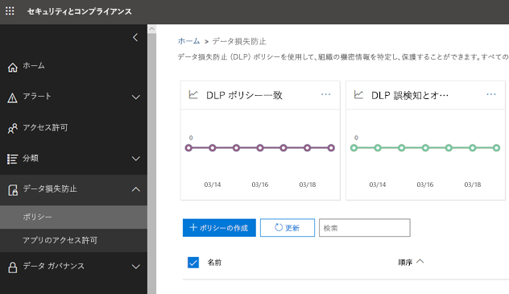
  
## DLP ポリシーの内容

DLP ポリシーにはいくつかの基本的な内容が含まれます。
  
- コンテンツを保護する場所: Exchange Online、SharePoint online、OneDrive for business サイトなどの**場所**、および Microsoft Teams のチャットとチャネル。 
    
- **ルール**を適用してコンテンツを保護するタイミングと方法。ルールは次の要素で構成されます。 
    
  - ルールを適用する前にコンテンツが一致している必要がある**条件**。 たとえば、組織外の人と共有されている社会保障番号を含むコンテンツのみを検索するようにルールを構成することができます。 
    
  - 条件に一致するコンテンツが見つかったときにルールが自動的に実行する**アクション**。 たとえば、ドキュメントへのアクセスをブロックし、ユーザーとコンプライアンス責任者の両方に電子メール通知を送信するようにルールを構成することができます。 
    
ルールを使用して特定の保護要件を満たし、その後共通の保護要件 (たとえば、特定の規定に準拠することが必要なすべてのルール) をグループ化するために 1 つの DLP ポリシーを使用します。
  
たとえば、Health Insurance Portability and Accountability Act (HIPAA) の対象となる情報の存在を検出する際に役立つ DLP ポリシーがあるとします。 この DLP ポリシーにより、組織外のユーザーと共有している機密情報を含むドキュメントを検索することによって、すべての SharePoint Online サイトとすべての OneDrive for business サイト (where) で HIPAA データを保護することができます (条件) を行い、ドキュメントへのアクセスをブロックし、通知を送信します (アクション)。 こうした要件は、個々のルールとして格納し、1 つの DLP ポリシーとしてグループ化することによって、管理とレポート作成を簡単に行えるようにします。
  
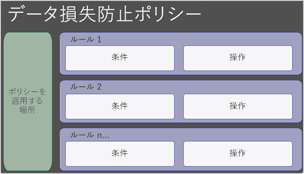
  
### 位置

DLP ポリシーは、Exchange online、SharePoint Online、OneDrive for business、または Microsoft Teams に情報があるかどうかにかかわらず、Office 365 全体の機密情報を検索して保護することができます。 Exchange 電子メール、Microsoft Teams のチャットおよびチャネル、すべての SharePoint または OneDrive ライブラリのコンテンツを保護するか、ポリシーの特定の場所を選択するかを選択できます。
  
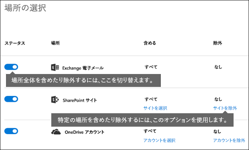
  
特定の SharePoint サイトまたは OneDrive アカウントを含めるか除外するかを選択すると、DLP ポリシーに含めることができるのは、そのような包含と除外を100以内にする必要があることに注意してください。 この制限は存在しますが、組織全体のポリシーまたは場所全体に適用されるポリシーのいずれかを適用することによって、この制限を超えることができることを理解しておいてください。
  
### ルール

ルールは、組織のコンテンツに対するビジネス要件を強制します。 ポリシーには 1 つ以上のルールが含まれ、各ルールには、条件とアクションが含まれます。 ルールごとに、条件を満たすとアクションが自動的に実行されます。 ルールは、各ポリシーの優先度の高いルールから順に実行されます。
  
また、ルールによって、コンテンツがルールに一致したことをユーザーに通知するオプション (ポリシーヒントと電子メール通知を含む) と管理者 (電子メールインシデントレポート付き) も表示されます。
  
以下に説明するルールのコンポーネントを次に示します。
  
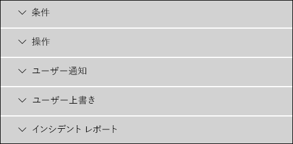
  
#### 条件

条件は、探している情報の種類と、アクションを実行するタイミングを決定するので重要です。 たとえば、コンテンツに10を超える番号が含まれておらず、組織外のユーザーと共有されている場合を除き、パスポート番号を含むコンテンツを無視することができます。
  
条件は、検索している機密情報の種類や、ドキュメントの共有者など、**コンテンツ**に焦点**** を当てています。 条件を使用して、さまざまなアクションをさまざまなリスクレベルに割り当てることができます。たとえば、内部的に共有されている機密コンテンツはリスクが低く、組織外のユーザーと共有する機密コンテンツよりも少ないアクションを必要とする場合があります。 
  
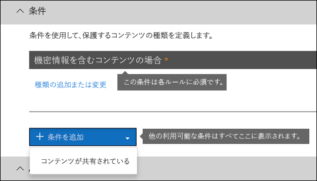
  
以下の内容を判断できる条件が使用可能になっています。
  
- コンテンツには、種類の機密情報が含まれています。
    
- コンテンツにはラベルが含まれています。 詳細については、「 [DLP ポリシーの条件としてラベルを使用する](#using-a-label-as-a-condition-in-a-dlp-policy)」セクションを参照してください。
    
- コンテンツが組織の内または外のユーザーと共有されている。
    
#### 機密情報の種類

DLP ポリシーは、機密情報の**種類**として定義された機密情報を保護するのに役立ちます。 Office 365 には、クレジット カード番号、銀行口座番号、国民 ID 番号、パスポート番号など、さまざまな地域ですぐに利用できる多数の一般的な機密情報の種類の定義が含まれています。 
  
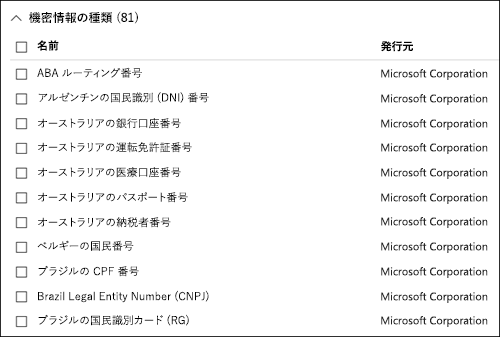
  
DLP ポリシーは、クレジットカード番号などの機密情報の種類を検索するときに、単に16桁の数字を検索するだけではありません。 機密情報のそれぞれの種類が定義され、以下の組み合わせを使用して検出されます。
  
- キーワード
    
- 内部関数。チェックサムや構成を検証します。
    
- パターン一致を検索するための正規表現の評価
    
- その他のコンテンツの検査
    
これにより、DLP 検出によって高い精度が得られますが、これによって、人々の作業を中断できる誤検知の数が減少します。
  
#### アクション

コンテンツがルールの条件に一致する場合、コンテンツを自動的に保護するアクションを適用できます。
  
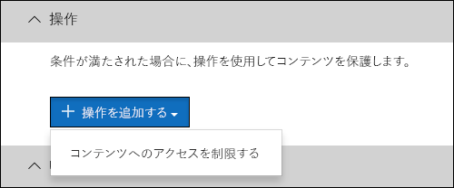
  
アクションを使用できるようになったので、次の操作を実行できます。
  
- **コンテンツへのアクセスを制限する**サイトコンテンツの場合、サイトコレクションの管理者、ドキュメントの所有者、およびドキュメントを最後に変更したユーザーを除くすべてのユーザーに対して、ドキュメントのアクセス許可が制限されていることを意味します。 これらの特別なユーザーの場合は、ドキュメントから機密情報を削除したり、他の是正措置を実行したりできます。 ドキュメントがコンプライアンスを遵守した状態になった場合、元のアクセス許可が自動的に復元されます。 ドキュメントへのアクセスがブロックされると、そのサイト上のライブラリで特別なポリシー ヒントのアイコンがドキュメントに表示されます。 
    
    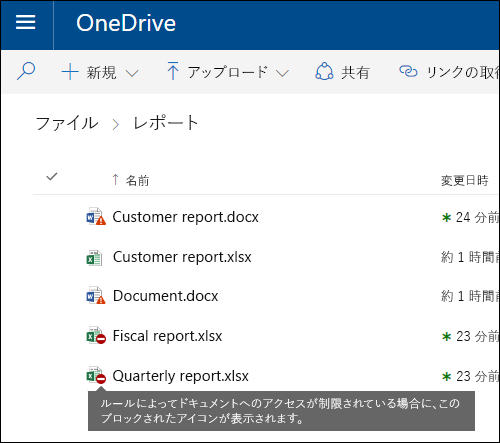
  
    電子メールコンテンツの場合、このアクションはメッセージの送信をブロックします。 DLP ルールの構成方法に応じて、送信者には NDR が表示されるか、または (ルールが通知を使用している場合は) ポリシーヒントや電子メール通知を表示します。
    
    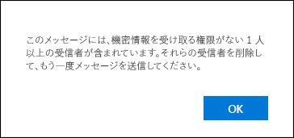
  
#### ユーザー通知とユーザーの優先

通知と上書きを使用して、ユーザーに DLP ポリシーについての教育を行い、作業をブロックすることなく準拠したままにすることができます。 たとえば、機密情報を含むドキュメントをユーザーが共有しようとすると、DLP ポリシーによって電子メール通知が送信されます。また、ビジネスがある場合にポリシーを上書きすることができるように、ドキュメントライブラリのコンテキストでポリシーヒントを表示することができます。位置.
  
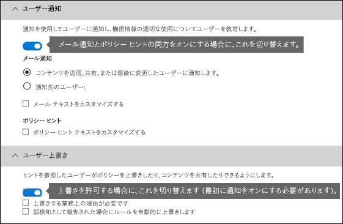
  
電子メールは、コンテンツを送信、共有、または最終変更したユーザー、サイトコンテンツ、サイトコレクション管理者、およびドキュメント所有者に通知することができます。 また、電子メール通知から選択したものを追加または削除することができます。
  
電子メール通知の送信に加えて、ユーザー通知にはポリシーヒントが表示されます。
  
- outlook および outlook on the web。
    
- SharePoint Online または OneDrive for business サイト上のドキュメントの場合。
    
- Excel、PowerPoint、および Word で、ドキュメントが DLP ポリシーに含まれるサイトに格納されている場合。
    
電子メール通知とポリシーヒントは、コンテンツが DLP ポリシーと競合する理由について説明します。 選択した場合、電子メール通知とポリシーヒントを使用すると、ユーザーが誤検知を報告してルールを上書きしたり、業務上の理由を提供したりすることができます。 これにより、ユーザーに DLP ポリシーについての教育を行い、ユーザーの作業を妨げることなくそれらを適用することができます。 コンプライアンス担当者が定期的に情報をレビューできるように、上書きおよび誤検知に関する情報もレポート (DLP レポートを参照) およびインシデントレポート (次のセクション) に含まれています。
  
OneDrive for business アカウントのポリシーヒントは次のようになります。
  
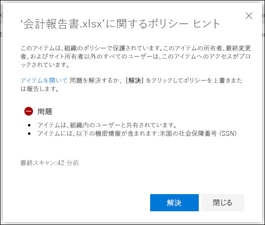
  
#### インシデント レポート

ルールが一致する場合は、イベントの詳細を使用して、コンプライアンス責任者 (または任意のユーザー) にインシデントレポートを送信できます。 このレポートには、一致したアイテムに関する情報、ルールに一致した実際のコンテンツ、およびコンテンツを最後に変更したユーザーの名前が含まれます。 電子メールメッセージの場合、このレポートには、DLP ポリシーに一致する元のメッセージも添付ファイルとして含まれます。
  
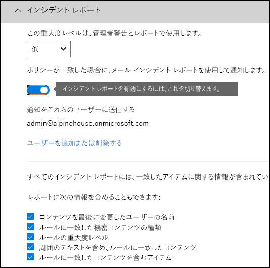
  
## グループ化演算子と論理演算子

多くの場合、DLP ポリシーには、米国の社会保障番号を含むすべてのコンテンツを特定するなどの簡単な要件があります。 ただし、その他のシナリオでは、DLP ポリシーにより、より緩やかに定義されたデータを識別する必要がある場合があります。
  
たとえば、米国の医療保険法 (HIPAA) の対象となるコンテンツを特定するには、次の情報を検索する必要があります。
  
- 米国の社会保障番号や薬品執行機関 (dea) 番号など、特定の種類の機密情報が含まれるコンテンツ。
    
    AND
    
- 患者の治療や、提供された医療サービスの説明など、識別が困難なコンテンツ。 このコンテンツを特定するには、Diseases の国際分類 (icd-9-cm または icd-10 cm) のような非常に大きなキーワードリストのキーワードを一致させる必要があります。
    
グループ化と論理演算子 (and、OR) を使用して、このような緩やかに定義されたデータを簡単に特定できます。 DLP ポリシーを作成すると、次のことができます。
  
- グループ機密情報の種類。
    
- グループ内の機密情報の種類とグループの間の論理演算子を選択します。
    
### グループ内での演算子の選択

グループ内では、ルールに一致するコンテンツについて、そのグループ内のすべての条件を満たす必要があるかどうかを選択できます。
  
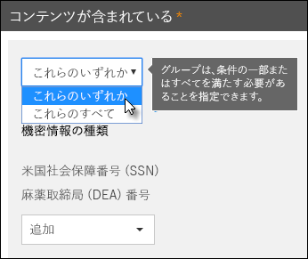
  
### グループを追加する

グループを簡単に追加できます。グループには、そのグループ内に独自の条件と演算子を含めることができます。
  
![[グループの追加] ボタン](media/5f72f292-d1f3-4f11-a911-a9f71e10abf6.png)
  
### グループ間でのオペレーターの選択

グループ間では、ルールに一致するコンテンツについて、1つのグループまたはすべてのグループの条件を満たす必要があるかどうかを選択できます。
  
たとえば、組み込みの**米国 HIPAA**ポリシーには、次のものを含むコンテンツを識別するためにグループ間で**and**演算子を使用するルールがあります。 
  
- グループ**PII 識別子**(少なくとも1つの SSN 番号**または**dea の番号) 
    
    **AND**
    
- グループ**医学条項**(少なくとも1つの ICD-9-センチキーワード**または**icd-10-センチキーワード) 
    

  
## ルールが処理される優先度

ポリシーでルールを作成する場合、各ルールには、作成された順序で優先度が割り当てられます。つまり、最初に作成されたルールの優先度、2番目に作成したルールの優先度が2番目になります。 
  
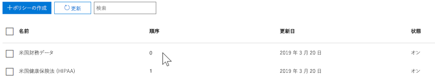
  
複数の DLP ポリシーを設定した後で、1つまたは複数のポリシーの優先度を変更できます。 そのためには、ポリシーを選択し、[**ポリシーの編集**] を選択し、[**優先度**] の一覧を使用して優先度を指定します。

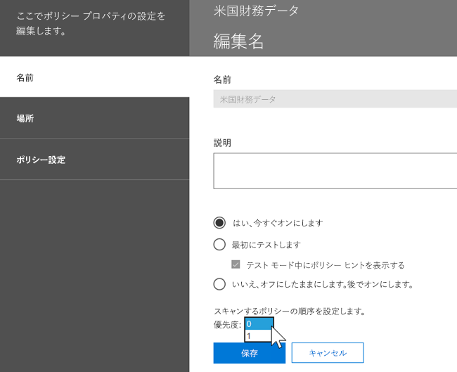

コンテンツがルールに対して評価されない場合、ルールは優先順位に従って処理されます。 コンテンツが複数のルールと一致する場合、ルールは優先順位に従って処理され、最も制限の厳しいアクションが適用されます。 たとえば、コンテンツが次のすべてのルールに一致する場合は、ルール3が最も優先度の高いルールであるため、ルール3が適用されます。
  
- ルール 1: ユーザーにのみ通知します。
    
- ルール 2: ユーザーに通知し、アクセスを制限し、ユーザーによる上書きを許可する
    
- ルール 3: ユーザーに対して通知を行い、アクセスを制限し、ユーザーによる上書きを許可しません。
    
- ルール 4: ユーザーにのみ通知する
    
- ルール 5: アクセスを制限する
    
- ルール 6: ユーザーに対して通知を行い、アクセスを制限し、ユーザーによる上書きを許可しません。
    
この例では、最も制限の厳しいルールのみが適用されていても、すべてのルールの一致が監査ログに記録され、DLP レポートに表示されることに注意してください。
  
ポリシーヒントに関しては、次の点に注意してください。
  
- 最も高い優先度のポリシーヒントのみが表示されます。 たとえば、コンテンツへのアクセスをブロックするルールに基づくポリシー ヒントは、単に通知を送信するだけのルールのポリシー ヒントよりも優先されて表示されます。 これによって、ユーザーにポリシー ヒントが多数表示されるという事態を避けられます。
    
- 	最も制限の厳しいルールでユーザーにルールを上書きすることを許可している場合は、このルールを上書きすることで、コンテンツに一致した他のルールもすべて上書きされます。
    
## 調整ルールを使用して、より簡単に、またはより簡単に一致するようにする

ユーザーが DLP ポリシーを作成して有効にした後は、次のような問題が発生することがあります。
  
- 機密情報の**ないコンテンツが**多すぎると、ルールに一致します。つまり、誤検知が多すぎます。 
    
- 機密情報がルールに一致するコンテンツ**が**少なすぎます。 つまり、保護アクションが機密情報に対して適用されることはありません。 
    
これらの問題に対処するには、インスタンス数と一致精度を調整して、コンテンツがルールと一致するようにすることで、ルールを調整できます。 ルールで使用される機密情報の種類ごとに、インスタンス数と一致精度の両方があります。
  
### インスタンス数

インスタンス数は、特定の種類の機密情報がルールと一致するようにコンテンツを表示する必要があることを意味します。 たとえば、1から9の固有の米国または英国の場合、コンテンツは以下のルールに一致します。 パスポート番号は識別されます。
  
インスタンス数には、機密情報の種類とキーワードに**固有**の一致のみが含まれていることに注意してください。 たとえば、電子メールに同じクレジットカード番号の10個のオカレンスが含まれている場合、その10回はクレジットカード番号の1つのインスタンスとしてカウントされます。 
  
インスタンス数を使用してルールを調整するには、次のガイダンスがわかりやすくなります。
  
- ルールをより簡単に一致させるには、**最小**数を減らすか、**最大**数を増やします。 また、数値を削除することによって、 **max**を**任意**の値に設定することもできます。 
    
- ルールが一致しにくくなるようにするには、**最小**数を増やします。 
    
通常は、低いインスタンス数 (たとえば、1-9) のルールでユーザー通知を送信するなど、制限の少ないアクションを使用します。 また、より多くの制限付きアクション (ユーザーによる上書きを許可せずにコンテンツへのアクセスを制限するなど) を使用すると、より高いレベルのインスタンス数を持つルール (たとえば、10個など) になります。
  
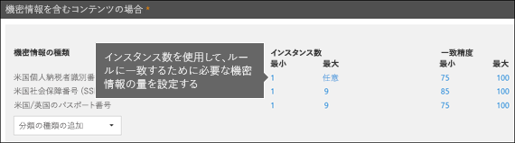
  
### 正確一致

前述したように、機密情報の種類はさまざまな種類の証拠の組み合わせを使用して定義および検出されます。 通常、機密情報の種類は、パターンと呼ばれる複数の組み合わせによって定義されます。 より少ない証拠を必要とするパターンは、一致精度 (または信頼度) が低く、より多くの証拠が必要となるパターンの精度 (または信頼度が高い) になります。 機密情報の種類ごとに使用される実際のパターンと信頼度の詳細については、「[機密情報の種類](what-the-sensitive-information-types-look-for.md)を調べる」を参照してください。
  
たとえば、"クレジットカード番号" という名前の機密情報の種類は、次の2つのパターンで定義されます。
  
- 65% の信頼度が必要なパターン。
    
  - クレジットカード番号の形式の番号。
    
  - チェックサムを渡す数値。
    
- 85% の信頼度が必要なパターン。
    
  - クレジットカード番号の形式の番号。
    
  - チェックサムを渡す数値。
    
  - 適切な形式のキーワードまたは有効期限の日付。
    
ルールでは、これらの信頼レベル (または正確一致) を使用できます。 通常は、一致精度の低いルールでユーザー通知を送信するなど、制限の少ないアクションを使用します。 また、より正確に一致するルールを使用して、ユーザーによる上書きを許可することなくコンテンツへのアクセスを制限するなど、より制限の多いアクションを使用します。
  
クレジットカード番号などの特定の種類の機密情報がコンテンツで識別されると、1つの信頼レベルのみが返されることを理解しておくことが重要です。
  
- すべての一致が1つのパターンに一致する場合は、そのパターンの信頼レベルが返されます。
    
- 複数のパターンに一致するものがある場合 (つまり、2つの異なる信頼度レベルに一致するものがある場合)、1つのパターンだけを超える信頼レベルが返されます。 これは厄介な部分です。 たとえば、クレジットカードの場合、65% と 85% の両方のパターンが一致した場合は、その機密情報の種類に対して返される信頼度が 90% を超えているため、より多くの証拠がより信頼度が高くなります。
    
そのため、クレジットカードに対して2つの相互排他的なルールを作成したい場合は、その精度は 65%、精度は 85% と一致しますが、精度の範囲は次のようになります。 最初のルールでは、65% パターンに一致するものが1つだけ抽出されます。 2番目のルールは、**少なくとも1つ**の 85% 一致に一致するものを取得し、信頼度の低い他の一致を**持つ可能性が**あります。 
  
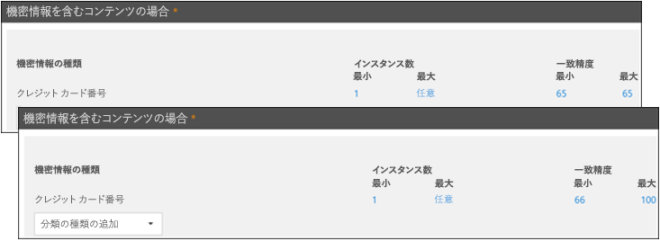
  
このような理由により、異なる一致 accuracies を持つルールを作成するためのガイダンスは、次のとおりです。
  
- 通常、最小の信頼レベルは、 **min**および**max** (範囲ではない) に対して同じ値を使用します。 
    
- 最高度の信頼度は、通常、信頼度の低いものから100までの範囲です。
    
- 通常、信頼レベルは、信頼度の低いものから、信頼度の高いレベルのすぐ下までの範囲です。
    
## DLP ポリシーでの条件としてのラベルの使用

ラベルを作成して、次のようにすることができます。
  
- これを**公開**して、エンドユーザーがラベルをコンテンツに表示したり、手動で適用したりできるようにします。 
    
- 選択した条件に一致するコンテンツに**自動適用**します。 
    
ラベルの詳細については、「[保持ラベルの概要](labels.md)」を参照してください。
  
ラベルを作成した後、そのラベルを DLP ポリシーの条件として使用できます。 たとえば、次のような理由が考えられることがあります。
  
- **機密**という名前のラベルを発行したので、組織内のユーザーは機密の電子メールやドキュメントにラベルを手動で適用することができます。 このラベルを DLP ポリシーの条件として使用することにより、 **Confidential**というラベルが付けられたコンテンツを組織外のユーザーと共有することを制限できます。 
    
- その名前のプロジェクト用に**Alpine House**という名前のラベルを作成し、そのラベルを "alpine house" というキーワードを含むコンテンツに自動的に適用しました。 このラベルを DLP ポリシーの条件として使用すると、このコンテンツを組織外のユーザーと共有しようとしているときに、エンドユーザーにポリシーヒントを表示することができます。 
    
- **Tax record**という名前のラベルを発行したので、レコード管理者は、レコードとして分類する必要があるコンテンツにラベルを手動で適用することができます。 このラベルを DLP ポリシーの条件として使用することにより、このラベルを持つコンテンツを、itins や ssns などの他の種類の機密情報と共に検索できます。"**税レコード**" というラベルの付いたコンテンツに保護アクションを適用します。dlp レポートおよび監査ログデータから dlp ポリシーに関する詳細なアクティビティレポートを取得します。 
    
- **エグゼクティブリーダーチーム**という名前のラベルを、重役グループの Exchange メールボックスと OneDrive アカウントに公開しました。 このラベルを DLP ポリシーの条件として使用することにより、コンテンツとユーザーの同じサブセットに対して保存と保護の操作の両方を適用できます。 
    
DLP ルールの条件としてラベルを使用することで、コンテンツ、場所、ユーザーの特定のセットに対して、保護アクションを選択的に適用できます。
  
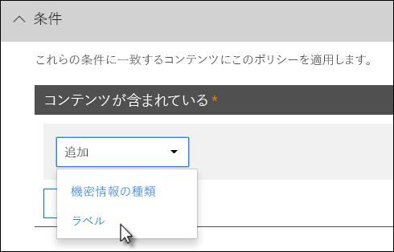

### 機密ラベルのサポートが予定されています

現在、保持ラベルは、[機密ラベル](sensitivity-labels.md)ではなく、条件としてのみ使用できることに注意してください。 この条件では、現在、機密ラベルを使用するためのサポートが稼働しています。
  
### この機能と他の機能との関係

機密情報が含まれるコンテンツには、いくつかの機能を適用できます。
  
- 保持[ラベル](labels.md#applying-a-retention-label-automatically-based-on-conditions)と[アイテム保持ポリシー](retention-policies.md)の両方で、このコンテンツに**保持**アクションを適用できます。 
    
- DLP ポリシーは、このコンテンツに対して**保護**アクションを強制できます。 これらの操作を実行する前に、DLP ポリシーでは、ラベルを含むコンテンツに加えて、他の条件を満たす必要があります。 
    
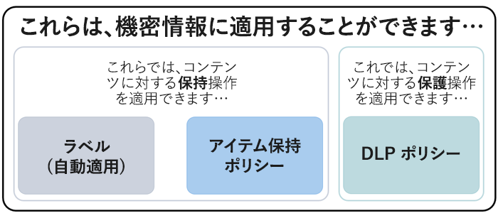
  
DLP ポリシーは、機密情報に適用されるラベルまたはアイテム保持ポリシーよりも豊富な検出機能を備えていることに注意してください。 DLP ポリシーは、機密情報が含まれるコンテンツに対する保護アクションを強制でき、機密情報がコンテンツから削除されると、その保護アクションはコンテンツの次回のスキャン時に取り消されます。 ただし、機密情報が含まれるコンテンツにアイテム保持ポリシーまたはラベルを適用すると、機密情報が削除されても、1回限りの操作が取り消されます。
  
DLP ポリシー内の条件としてラベルを使用することにより、そのラベルを持つコンテンツに対してアイテム保持と保護アクションの両方を適用できます。 機密情報が含まれているコンテンツと同じように、ラベルと機密情報の種類の両方がコンテンツを分類するために使用するプロパティであると考えることができます。これにより、そのコンテンツにアクションを適用することができます。
  
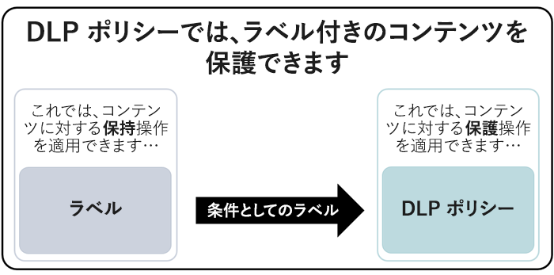
  
## 簡易設定と詳細設定

DLP ポリシーを作成する場合は、[簡易] または [詳細設定] のどちらかを選択します。
  
- **簡易設定**を使用すると、ルールエディタを使用してルールを作成または変更しなくても、最も一般的な種類の DLP ポリシーを簡単に作成できます。 
    
- **[詳細設定**] ルールエディターを使用して、DLP ポリシーのすべての設定を完全に制御できます。 
    
このトピックでは、単純な設定と高度な設定がまったく同じように動作しますが、条件とアクションで構成されるルールを適用することによって、ルールエディターは表示されません。 DLP ポリシーを簡単に作成する方法です。
  
### 簡易設定

最も一般的な DLP シナリオは、機密情報を含むコンテンツを組織外のユーザーと共有したり、コンテンツにアクセスできるユーザーを制限するなどの自動的な修復操作を実行したりするためのポリシーを作成することです。エンドユーザーまたは管理者の通知を送信し、イベントを後で調査するために監査します。 ユーザーは、DLP を使用して機密情報を不用意に公開しないようにすることができます。
  
この目標を実現するには、DLP ポリシーを作成するときに [**簡易設定を使用**する] を選択します。 これらの設定により、ルールエディターに移行せずに、最も一般的な DLP ポリシーを実装するために必要なものすべてが提供されます。
  
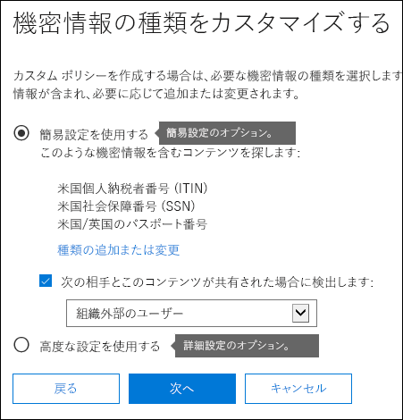
  
### 詳細設定

カスタマイズした DLP ポリシーをさらに作成する必要がある場合は、[**詳細設定を使用**] を選択できます。
  
詳細設定では、各ルールのインスタンス数と一致精度 (信頼度) を含む、すべての可能なオプションを完全に制御できるルールエディターが表示されます。
  
セクションにすばやく移動するには、ルールエディターのトップナビゲーションにある項目をクリックして、以下のセクションに移動します。
  
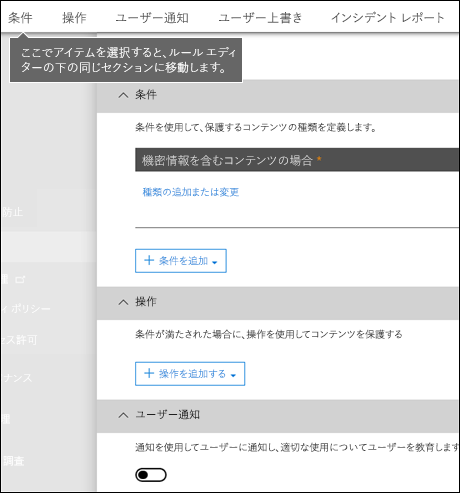
  
## DLP ポリシー テンプレート

DLP ポリシーを作成する最初の手順は、保護する情報を選択することです。 DLP テンプレートから開始することで、新しいルールセットを最初から作成する作業を保存し、既定でどのような種類の情報を含める必要があるかを判断できます。 その後、これらの要件を追加または変更して、組織の特定の要件を満たすようにルールを微調整することができます。
  
構成済みの DLP ポリシーテンプレートを使用すると、HIPAA データ、PCI DSS データ、グラムリーチブライ-なる Act データ、またはロケール固有の個人情報 (P.I.) など、特定の種類の機密情報を検出するのに役立ちます。 一般的な種類の機密情報を簡単に検出して保護するため、Office 365 に既に含まれているポリシー テンプレートには、開始にあたって必要となる最も一般的な種類の機密情報が含まれています。
  
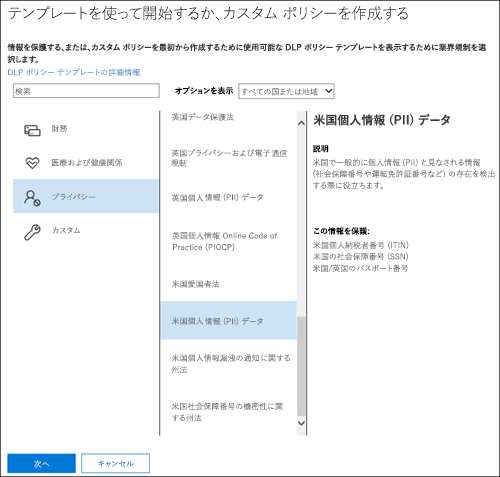
  
組織に固有の要件がある場合もあります。その場合は、[**カスタムポリシー** ] オプションを選択することにより、最初から DLP ポリシーを作成できます。 カスタムポリシーは空であり、premade ルールは含まれていません。 
  
## DLP ポリシーをテスト モードで段階的にロールアウトする

DLP ポリシーを作成する際、段階的にロールアウトして、影響を評価して有効性をテストしてから、完全に適用することを検討してください。 たとえば、新しい DLP ポリシーを使用して、ユーザーが作業を完了するためにアクセスする必要がある数千のドキュメントへのアクセスを誤ってブロックすることはありません。
  
大きな影響を与える可能性が高い DLP ポリシーを作成しているときは、次の順序に従うことをお勧めします。
  
1. **ポリシーヒントを使用せずにテストモードで開始**してから、DLP レポートとインシデントレポートを使用して影響を評価します。 DLP レポートを使用して、番号、場所、種類、およびポリシー一致の重要度を確認することができます。 この結果に基づき、必要に応じてルールを詳細に調整できます。 テスト モードでは、DLP ポリシーは組織で業務に取り組んでいるユーザーの生産性に影響を与えることはありません。 
    
2. **通知とポリシー ヒントを利用するテスト モードに移行**して、コンプライアンス ポリシーについてユーザーを教育し、適用されるルールに対して準備できるようにします。この段階で、ルールをさらに精緻化できるように、ユーザーに誤検知を報告するよう依頼することもできます。 
    
3. ルールのアクションが適用され、コンテンツが保護されるように、**ポリシーに対して完全な強制を開始**します。 DLP レポート、インシデント レポート、通知を引き続き監視して、結果が意図したとおりであるか確認します。 
    
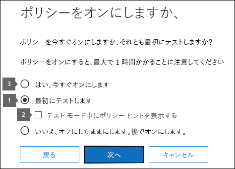
  
DLP ポリシーは、ポリシー内のすべてのルールに影響を与える任意の時点でオフにすることができます。 ただし、ルールエディターで状態を切り替えることによって、各ルールを個別に無効にすることもできます。
  
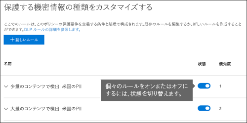

ポリシー内の複数のルールの優先度を変更することもできます。 これを行うには、ポリシーを開いて編集します。 ルールの行で、省略記号 ([.**..**]) を選択してから、[**下へ移動**] や [**最後へ**移動] などのオプションを選択します。

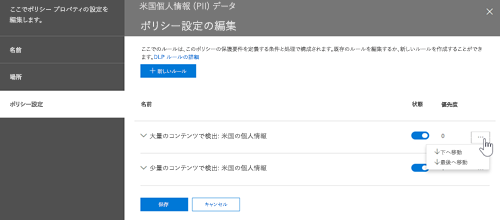
  
## DLP レポート

DLP ポリシーを作成して有効にした後、意図したとおりに動作していることを確認し、準拠した状態を維持することができます。 DLP レポートを使用すると、長期間にわたる、一致する DLP ポリシーとルールの数や、誤検知と上書きの数をすぐに表示できます。 各レポートでは、それらの一致項目を場所、期間でフィルター処理したり、特定のポリシー、ルール、アクションに絞り込んだりすることも可能です。
  
DLP レポートによって、ビジネス上の洞察を得ることができ、同時に以下のことを行えます。
  
- 特定の期間に絞り込み、スパイクや傾向の理由を理解します。
    
- 組織のコンプライアンスポリシーに違反するビジネスプロセスを検出します。
    
- DLP ポリシーのビジネスに及ぼす影響を理解します。
    
さらに、DLP レポートを使用すると、DLP ポリシーの実行時にそれらのポリシーを調整できます。
  
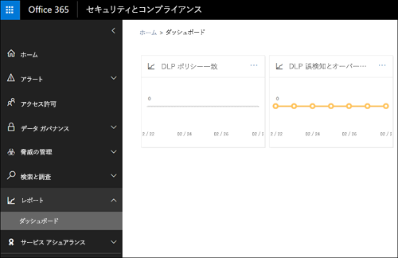
  
## DLP ポリシーのしくみ

DLP は、(単純なテキスト スキャンだけでなく) 詳細なコンテンツ分析を使用して、機密情報を検出します。この詳細なコンテンツ分析は、キーワード一致、辞書一致、正規表現の評価、内部関数などの方式を使用して、DLP ポリシーに一致するコンテンツを検出します。使用しているデータのうち、ごくわずかな割合のデータのみが機密性が高いと見なされる可能性があります。DLP ポリシーは、他のコンテンツを使用した作業を妨害したり影響を与えたりすることなく、対象データのみを識別、監視し、自動的に保護できます。
  
### ポリシーの同期

セキュリティ&amp; /コンプライアンスセンターで DLP ポリシーを作成すると、そのポリシーは中央ポリシーストアに格納され、次のようにさまざまなコンテンツソースと同期されます。
  
- Exchange Online、outlook on the web、outlook
    
- OneDrive for Business サイト
    
- SharePoint Online サイト
    
- Office デスクトッププログラム (Excel、PowerPoint、および Word)

- Microsoft Teams チャンネルおよびチャット
    
ポリシーが正しい場所に同期されると、コンテンツの評価とアクションの適用が開始されます。
  
### OneDrive for Business サイトと SharePoint Online サイトのポリシー評価

SharePoint Online サイトと OneDrive for business サイトのすべてにおいて、ドキュメントは常に変更されています。これにより、継続的に作成、編集、共有などが行われます。 つまり、ドキュメントが DLP ポリシーに矛盾したり、準拠したりといったことがいつでも発生します。 たとえば、ユーザーがチーム サイトに機密情報が含まれていないドキュメントをアップロードし、後で別の人がそのドキュメントを編集して機密情報を追加することがあります。
  
このため、DLP ポリシーは、バックグラウンドでポリシーに一致しているかどうか頻繁にドキュメントを確認します。 これを、非同期のポリシー評価と考えることができます。
  
#### しくみ
 
ユーザーがサイトでドキュメントを追加または変更すると、検索エンジンによってコンテンツがスキャンされ、後で検索できるようになります。 これが発生していますが、機密情報のためにコンテンツもスキャンされ、共有されているかどうかが確認されます。 検出された機密情報は検索インデックスに安全に格納されるため、コンプライアンスチームのみがアクセスできますが、一般的なユーザーにはアクセスできません。 オンにした各 DLP ポリシーはバックグラウンドで実行され (非同期)、ポリシーに一致するコンテンツについては検索頻度がよくチェックされ、不注意によるリークから保護するアクションを適用します。
  
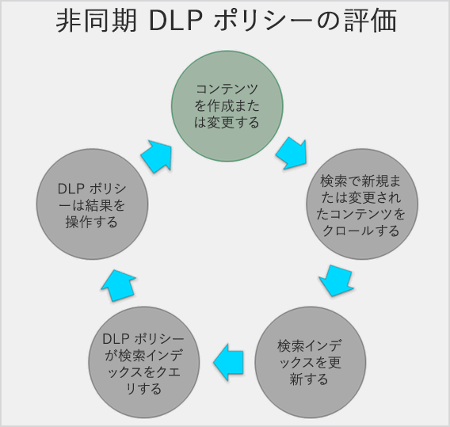
  
最後に、ドキュメントが DLP ポリシーに矛盾し、その後 DLP ポリシーに準拠するようになることがあります。たとえば、ユーザーがドキュメントにクレジット カード番号を追加する場合、DLP ポリシーによってドキュメントへのアクセスが自動的にブロックされる可能性があります。しかしユーザーが後で機密情報を削除すると、次にドキュメントが対象ポリシーに対して再び評価されるときに、アクション (この例ではブロック) が自動的に取り消されます。
  
DLP は、インデックス処理が可能なすべてのコンテンツを評価します。 既定でクロールされるファイルの種類の詳細については、「既定のクロールされた[ファイル名拡張子」および「解析されたファイルの種類 (SharePoint Server](https://docs.microsoft.com/SharePoint/technical-reference/default-crawled-file-name-extensions-and-parsed-file-types))」を参照してください。
  
### Exchange Online、outlook、outlook on the web でのポリシー評価

exchange online を場所として含む DLP ポリシーを作成すると、ポリシーは Office 365 セキュリティ&amp;コンプライアンスセンターから exchange online に同期され、次に exchange online から web 上の outlook および outlook 上の outlook に同期されます。
  
メッセージが Outlook で構成されている場合、ユーザーは作成されたコンテンツが DLP ポリシーに照らして評価されるときに、ポリシーヒントを表示できます。 メッセージが送信されると、exchange メールフロールール (トランスポートルールとも呼ばれる) と exchange 管理センターで作成された dlp ポリシーと共に、電子メールフローの通常の一部として DLP ポリシーに対して評価されます。 DLP ポリシーは、メッセージと添付ファイルの両方をスキャンします。
  
### Office デスクトッププログラムでのポリシー評価

Excel、PowerPoint、および Word には、機密情報を識別し、DLP ポリシーを SharePoint Online と OneDrive for business として適用するのと同じ機能が含まれています。 これらの Office プログラムは、自分の dlp ポリシーを中央ポリシーストアから直接同期し、dlp ポリシーに含まれているサイトから開いたドキュメントをユーザーが操作するときに、dlp ポリシーに対してコンテンツを継続的に評価します。
  
Office での DLP ポリシーの評価は、プログラムのパフォーマンスや、コンテンツを扱うユーザーの生産性に影響を与えないように設計されています。 大きなドキュメントで作業している場合や、ユーザーのコンピューターがビジー状態になっている場合は、ポリシーヒントが表示されるまで数秒かかる場合があります。

### Microsoft Teams でのポリシー評価
 
場所として Microsoft Teams を含む DLP ポリシーを作成すると、Office 365 セキュリティ&amp;コンプライアンスセンターからユーザーアカウントおよび Microsoft teams のチャネルとチャットにポリシーが同期されます。 DLP ポリシーの構成方法によっては、Microsoft Teams のチャットやチャネルで機密情報を共有しようとすると、メッセージをブロックまたは取り消すことができます。 また、機密情報が含まれていて、ゲスト (外部ユーザー) と共有されているドキュメントは、それらのユーザーに対しては開きません。

たとえば、他のユーザーが Teams のチャットまたはチャネル内の機密情報を外部ユーザーと共有しようとしたとします。 これを防ぐために定義された DLP ポリシーがあるとします。 保護を適用すると、外部ユーザーに送信される機密情報を含むメッセージが削除されます。 これは数秒で行われ、DLP ポリシーの構成方法に従って自動的に発生します。

ポリシーヒントは、メッセージがブロックされた、または取り消された理由について送信者に通知します。 たとえば、送信者には、すべてのユーザーとの共有が許可されていない個人情報 (pii) が含まれていることや、pii を含むドキュメントを組織外のユーザーと共有できないことが通知されることがあります。 送信者は、DLP ポリシーに準拠するようにメッセージを編集できます。
 
## アクセス許可

DLP ポリシーを作成するコンプライアンスチームのメンバーは、セキュリティ&amp;コンプライアンスセンターに対するアクセス許可が必要です。 既定では、テナント管理者は、この場所にアクセスできるようになり、テナント管理者や他の&amp;ユーザーには、テナント管理者のすべてのアクセス許可を付与することなく、セキュリティコンプライアンスセンターへのアクセス権を付与することができます。そのためには、次のことを行うことをお勧めします。
  
1. Office 365 でグループを作成し、コンプライアンス担当者をそのグループに追加します。
    
2. セキュリティ&amp; /コンプライアンスセンターの [**アクセス許可**] ページで役割グループを作成します。 
    
3. Office 365 グループをその役割グループに追加します。
    
詳細については、「[Give users access to the Office 365 Compliance Center](grant-access-to-the-security-and-compliance-center.md)」を参照してください。
  
DLP ポリシーを作成して適用するときにのみ、これらのアクセス許可が必要になります。 ポリシーを適用する場合に、コンテンツへのアクセスは必要ありません。
  
## DLP コマンドレットを検索する

セキュリティ&amp; /コンプライアンスセンターのほとんどのコマンドレットを使用するには、次のことを行う必要があります。
  
1. [リモート PowerShell を使用して Office 365 セキュリティ/コンプライアンス センターに接続する](https://docs.microsoft.com/powershell/exchange/office-365-scc/connect-to-scc-powershell/connect-to-scc-powershell?view=exchange-ps)
    
2. これらの[ポリシーおよびコンプライアンス-dlp のコマンドレット](https://docs.microsoft.com/powershell/module/exchange/policy-and-compliance-dlp/export-dlppolicycollection?view=exchange-ps)を使用する
    
ただし、DLP レポートには、Exchange Online などの Office 365 間でデータをプルする必要があります。 このため、 **DLP レポートのコマンドレットは Exchange Online powershell で使用できます (セキュリティ&amp;コンプライアンスセンターの powershell に**は含まれません)。 そのため、DLP レポートのコマンドレットを使用するには、次のことを行う必要があります。
  
1. [リモート PowerShell による Exchange への接続](https://docs.microsoft.com/powershell/exchange/exchange-online/connect-to-exchange-online-powershell/connect-to-exchange-online-powershell?view=exchange-ps)
    
2. 次のいずれかのコマンドレットを DLP レポートに使用します。
    
  - [get-dlpdetectionsreport](https://docs.microsoft.com/powershell/module/exchange/policy-and-compliance-dlp/Get-DlpDetectionsReport?view=exchange-ps)
    
  - [取得-dlpのレポート](https://docs.microsoft.com/powershell/module/exchange/policy-and-compliance-dlp/Get-DlpDetailReport?view=exchange-ps)
    
## 詳細情報

- [テンプレートから DLP ポリシーを作成する](create-a-dlp-policy-from-a-template.md)
    
- [DLP ポリシーに関する通知を送信してポリシー ヒントを表示する](use-notifications-and-policy-tips.md)
    
- [FCI または他のプロパティを使用したドキュメントを保護する DLP ポリシーを作成する](protect-documents-that-have-fci-or-other-properties.md)
    
- [DLP ポリシー テンプレートに含まれるもの](what-the-dlp-policy-templates-include.md)
    
- [機密情報の種類の検索基準](what-the-sensitive-information-types-look-for.md)
    
- [DLP 関数の検索対象](what-the-dlp-functions-look-for.md)
    
- [カスタムの機密情報の種類を作成する](create-a-custom-sensitive-information-type.md)
    

