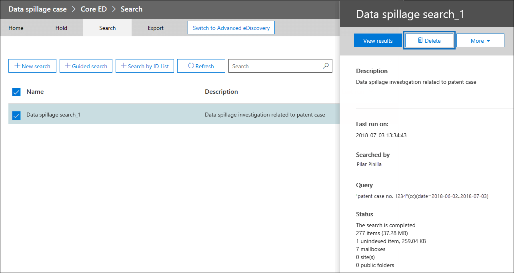

# <a name="ediscovery-solution-series-data-spillage-scenario---search-and-purge"></a>電子的証拠開示ソリューション シリーズ: データこぼしたシナリオの検索と削除

 **データこぼしたとはなぜ重要なのですか?** こぼしたのデータは、機密性の高いドキュメントが信頼されていない環境にリリースされたときです。データこぼしたのインシデントが検出されると、することが重要、こぼしたの場所とサイズを迅速に評価、囲み、ユーザー アクティビティを確認してシステムからこぼれたデータを完全に削除します。 
  
## <a name="data-spillage-scenario"></a>こぼしたシナリオのデータ

Contoso の潜在顧客の情報セキュリティ責任者がいます。従業員知らずに共有されている機密性の高いドキュメント電子メールを通じて複数のユーザーとデータのこぼした状況が通知されます。このドキュメントの内部と外部の受信者を迅速に評価する必要があります。識別されると、その他の調査官の確認、および Office 365 のデータを完全に削除するとケースの結果を共有したいと思います。調査が完了した後の将来の参照を完全に削除し、他のケースの詳細の証拠を使用してレポートを生成します。
  
### <a name="scope-of-this-article"></a>この資料の範囲

このドキュメントでは、アクセスまたは回復可能ではないように、Office 365 からメッセージを完全に削除する方法の手順の一覧を提供します。メッセージを削除する、それを回復可能な削除済みアイテムの保存期間が終了するまで、[検索して Office 365 の組織内の電子メール メッセージを削除](search-for-and-delete-messages-in-your-organization.md)を参照してください。
  
## <a name="workflow-for-managing-data-spillage-incidents"></a>こぼしたインシデントのデータを管理するためのワークフロー

データのこぼしたインシデントを管理します。


  
[(省略可能)手順 1: 大文字と小文字をアクセスし、コンプライアンスの境界を設定したを管理します。](#optional-step-1-manage-who-can-access-the-case-and-set-compliance-boundaries)<br/>
[電子的証拠開示のサポート案件を作成する手順 2。](#step-2-create-an-ediscovery-case)<br/>
[こぼれたデータの手順 3: 検索](#step-3-search-for-the-spilled-data)<br/>
[手順 4: を確認し、ケースの調査結果を検証します。](#step-4-review-and-validate-case-findings)<br/>
[こぼれたがどのようにデータを確認するトレース ログの共有メッセージを使用して、手順 5。](#step-5-use-message-trace-log-to-check-how-spilled-data-was-shared)<br/>
[手順 6: メールボックスを準備します。](#step-6-prepare-the-mailboxes)<br/>
[こぼれたデータを完全に削除する手順 7。](#step-7-permanently-delete-the-spilled-data)<br/>
[手順 8: ことを確認、削除、テストを行うし、監査](#step-8-verify-provide-a-proof-of-deletion-and-audit)<br/>

## <a name="things-to-know-before-you-start"></a>開始する前に知っておく

- 保留中のメールボックスがある場合、削除済みのメッセージは、保存期間の期限が切れるか、保留を解除するまで、回復可能なアイテム] フォルダーに残ります。[手順 6](#step-6-prepare-the-mailboxes)では、メールボックスから保持を削除する方法について説明します。保留リストを削除する前に、レコード管理または法務部門に確認してください。上にメールボックスを保持するかどうかを定義するポリシーを持つ組織もあります。 またはデータのこぼしたインシデントが優先します。 
    
- どのユーザーのメールボックスを管理するには、データのこぼした調査官で検索し、大文字と小文字にアクセスできるユーザーを管理、コンプライアンスの境界を設定し、[手順 1](#optional-step-1-manage-who-can-access-the-case-and-set-compliance-boundaries)で説明するカスタムの役割グループを作成できます。これを行うには、組織の管理役割グループのメンバーであるか、役割の管理役割を割り当てる必要があります。場合、または、コンプライアンスの境界のセットが既に組織内の管理者に、手順 1 を省略することができます。
    
- サポート案件を作成するには、電子的証拠開示マネージャーの役割グループのメンバーであるか、ケース管理の役割が割り当てられているカスタムの役割グループのメンバーであるください。メンバーでない場合は[、電子的証拠開示マネージャーのロール グループを追加](assign-ediscovery-permissions.md)するのには、Office 365 の管理者に問い合わせてください。
    
- 組織にコピーされているデータを削除するには、Exchange オンライン PowerShell で[検索メールボックス DeleteContent](https://docs.microsoft.com/powershell/module/exchange/mailboxes/Search-Mailbox?view=exchange-ps)コマンドを使用する必要があります。また、 *DeleteContent*パラメーターを使用するをもする必要がある Exchange Online のメールボックスのインポート エクスポートの役割が割り当てられている役割グループのメンバーであります。[役割グループの管理](https://technet.microsoft.com/library/jj657480%28v=exchg.150%29.aspx)の「ロール グループにロールを追加する」セクションを参照してください。
    
- Office 365 の監査ログの電子的証拠開示活動を検索するには手順 8 で、監査する必要がありますオンにする組織。過去 90 日以内に実行された活動を検索できます。有効にして、監査を使用する方法の詳細については、手順 8[データこぼした調査プロセスを監査](#auditing-the-data-spillage-investigation-process)する」を参照してください。 
    
## <a name="optional-step-1-manage-who-can-access-the-case-and-set-compliance-boundaries"></a>(省略可能)手順 1: 大文字と小文字をアクセスし、コンプライアンスの境界を設定したを管理します。

実習、組織によっては、データこぼしたのインシデントを調査し、コンプライアンスの境界を設定するために使用する電子的証拠開示の場合にアクセスできるユーザーを制御する必要があります。これを行う最も簡単な方法では、調査官を Office 365 のセキュリティとコンプライアンス センター内の既存の役割グループのメンバーとして追加し、電子的証拠開示の場合のメンバーとしての役割グループに追加します。組み込みの電子的証拠開示の役割グループと、電子的証拠開示の場合にメンバーを追加する方法についてを参照してください[Office 365 のセキュリティ、電子的証拠開示のアクセス許可を割り当てる&amp;コンプライアンス センター](assign-ediscovery-permissions.md)です。
  
組織のニーズに合わせて新しい役割グループを作成することもできます。などのデータにアクセスし、共同作業を行うすべてのデータのこぼした場合に組織内のこぼした調査官のグループをする可能性があります。「データこぼした調査官」の役割グループを作成する、(エクスポート RMS の復号化レビュー プレビュー、コンプライアンス検索、およびサポート案件の管理) は、適切なロールを割り当て、グループに追加するデータのこぼした調査官、ロール、追加し、でこれを行う、データこぼした電子的証拠開示のサポート案件のメンバーとしての役割のグループです。これを行う方法についての詳細な[電子的証拠開示の調査では、Office 365 のコンプライアンスの境界の設定](set-up-compliance-boundaries.md)を参照してください。 
  
## <a name="step-2-create-an-ediscovery-case"></a>電子的証拠開示のサポート案件を作成する手順 2。

電子的証拠開示のサポート案件には、こぼした調査データを管理する効果的な方法が用意されています。手順 1 で作成した役割グループにメンバーを追加、新しい電子的証拠開示の場合のメンバーとしての役割グループを追加するこぼれたデータを検索、共有、ケースの状態を追跡するレポートをエクスポートするのには反復的な検索を実行して、c の詳細を参照ase が必要な場合です。データこぼしたのインシデントを使用する電子的証拠開示の場合に名前付け規則を確立することを検討し、場合に大文字の名前と説明を検索しを参照してください、将来的に必要な場合は、できるだけ多くの情報を提供します。
  
新しいサポート案件を作成するに、セキュリティで電子的証拠開示を使用することができます&amp;コンプライアンス センターです。[電子的証拠開示の場合](ediscovery-cases.md#step-2-create-a-new-case)で「新しいケースを作成する」を参照してください。
  
## <a name="step-3-search-for-the-spilled-data"></a>こぼれたデータの手順 3: 検索

ケースと管理アクセスを作成したら、これでこぼれたデータを検索し、こぼれたデータが含まれているメールボックスを識別する繰り返しを検索する、大文字と小文字を使用できます。[手順 7](#step-7-permanently-delete-the-spilled-data)で同じメッセージを削除するのには電子メール メッセージを検索するために使用するのと同じ検索クエリを使用します。
  
検索をコンテンツを作成するのには、電子的証拠開示のサポート案件に関連付けられている、[電子的証拠開示の場合](ediscovery-cases.md#step-5-create-and-run-a-content-search-associated-with-a-case)の「の作成とコンテンツの検索サポート案件に関連付けられている実行」を参照してください。
  
 **重要な:** 検索クエリで使用するキーワードの検索を実行している実際のこぼれたデータがあります。などのキーワードを検索すると、it を使用し、社会保障番号を含むドキュメントを検索する場合は、さらにこぼしたを回避するには、後でクエリを削除してください。手順 8 で[検索クエリを削除する](#deleting-the-search-query)を参照してください。 
  
## <a name="step-4-review-and-validate-case-findings"></a>手順 4: を確認し、ケースの調査結果を検証します。

コンテンツの検索を作成した後は、確認し、検索が結果を削除する必要がある電子メール メッセージのだけで構成されることを確認であることを検証する必要があります。コンテンツの検索、データこぼしたを防ぐために検索結果をエクスポートすることがなく 1,000 個の電子メール メッセージのランダムなサンプリングをプレビューできます。詳細を参照することでプレビュー制限の[コンテンツの検索では、Office 365 のセキュリティの制限&amp;コンプライアンス センター](limits-for-content-search.md)。
  
あれば 1,000 を超えるメールボックスまたは電子メール メッセージを 100 個を超えるメールボックスを確認するのにあたり、複数の検索キーワードを追加または日付の範囲または送信者と受信者などの条件を使用して最初の検索に分割して各検索の結果を確認個別にします。[手順 7](#step-7-permanently-delete-the-spilled-data)でメッセージを削除するときに使用するすべての検索クエリを確認してください。

管理者やエンドユーザーが Office 36 E5 のライセンスを割り当てられている場合は、電子的証拠開示の Office 365 の詳細設定を使用して、一度に最大 10000 個までの検索結果を調べることができます。確認するのには、1万人以上の電子メール メッセージがある場合は、日付の範囲で検索クエリを分割し、検索の結果は日付順に並べ替えられます。 として個別にそれぞれの結果を確認できます。高度な電子的証拠開示は、プレビュー パネルで**ラベルとして**の機能を使用して検索結果にタグ付けし、ラベルをタグで検索結果をフィルター処理できます。セカンダリの校閲者と共同作業をする場合に便利です。高度な電子的証拠開示、光学式文字認識、電子メールのスレッド、および予測のコーディングなどの他の分析ツールを使用して、迅速に処理し、何千ものメッセージを確認してさらなるレビューのタグを付ける。[Office 365 の高度な証拠開示のためのクイック セットアップ](quick-setup-for-advanced-ediscovery.md)を参照してください。

こぼれたデータを含む電子メール メッセージを検索するときは、外部で共有したかどうかを確認するメッセージの受信者を確認してください。さらにトレースをメッセージを収集できます送信者情報と日付の範囲[手順 5](#step-5-use-message-trace-log-to-check-how-spilled-data-was-shared)で説明しますが、メッセージのトレース ログを使用できるようにします。

検索結果を確認するが、第 2 のレビューのため、他のユーザーと、結果を共有する場合します。手順 1 で大文字と小文字を割り当てられているユーザーでは、電子的証拠開示と高度な電子的証拠開示の両方でサポート ・ リクエストの内容を確認でき、サポート ・ リクエストの結果を承認することができます。実際のコンテンツをエクスポートすることがなくレポートを生成することもできます。この同じレポートは、[手順 8](#step-8-verify-provide-a-proof-of-deletion-and-audit)で説明しますが、削除の証明としても使えます。
  
 **統計レポートを生成します。**
  
1. 電子的証拠開示の場合、[**検索**] ページに移動し、レポートを生成する検索] をクリックします。 
    
2. [ポップアップ] ページをクリックして**より > レポートをエクスポートする**です。
 
      レポートのエクスポート] ページが表示されます。

    ![検索を選択し、[詳細] をクリックして > [ポップアップ] ページで、レポートをエクスポートします。](media/O365-eDiscoverySolutions-DataSpillage-ExportReport1.png)
    
3. **認識できない形式があるものなど、すべてのアイテムが暗号化されているか他の理由によりインデックスが作成されませんでした**を選択し、**レポートの生成**] をクリックします。

4. 電子的証拠開示の場合、**エクスポート**するエクスポート ジョブの一覧を表示をクリックします。**更新**を作成したエクスポート ジョブを表示するリストを更新する] をクリックする必要があります。

5. エクスポート ジョブをクリックし、[ポップアップ] ページで、レポートの**ダウンロード**] をクリックします。
 
    ![[エクスポート] ページで [エクスポート] をクリックし、[レポートのダウンロード] をクリックし、](media/O365-eDiscoverySolutions-DataSpillage-ExportReport2.png)

**エクスポートの概要**レポートには、見つかった結果および検索結果のサイズと位置の数が含まれています。削除後に生成されたレポートと比較し、削除の証拠として提供するには、これを使用します。**結果**レポートには、件名、送信者、受信者の電子メールが読み取られた場合、日付、および各メッセージのサイズを含む、検索結果の詳細な概要が含まれています。こぼれたデータを実際にこのレポートの詳細のいずれかの場合は、必ず調査が完了したときに、Results.csv ファイルを完全に削除してください。

レポートをエクスポートする方法の詳細については、[コンテンツの検索レポートをエクスポートする](export-a-content-search-report.md)を参照してください。
    
## <a name="step-5-use-message-trace-log-to-check-how-spilled-data-was-shared"></a>こぼれたがどのようにデータを確認するトレース ログの共有メッセージを使用して、手順 5。

さらに調査するにはこぼれたデータを電子メールで共有されていた場合は、必要に応じて送信者情報と手順 4 で収集した日付の範囲の情報を持つメッセージのトレース ログを照会できます。メッセージ トレースの保存期間はリアルタイム データと履歴データの 90 日の 30 日間であることに注意してください。
  
コマンドレットを使用して、対応する Exchange オンライン PowerShell またはメッセージのトレースを使用して、セキュリティとコンプライアンスの中心にできます。メッセージ トレースは返されるデータの完全性を完全に保証を提供していることに注意する必要があります。メッセージ トレースの使用に関する詳細についてを参照してください。 
  
- [メッセージ トレースには、Office 365 のセキュリティ&amp;コンプライアンス センター](https://support.office.com/article/3e64f99d-ac33-4aba-91c5-9cb4ca476803.aspx)
    
- [Office 365 のセキュリティでは、新しいメッセージ トレース&amp;コンプライアンス センター](https://blogs.technet.microsoft.com/exchange/2018/05/02/new-message-trace-in-office-365-security-compliance-center/)
    
## <a name="step-6-prepare-the-mailboxes"></a>手順 6: メールボックスを準備します。

確認し、メッセージだけを削除する必要がありますが、検索結果に含まれていることを検証した後は、**検索メールボックス DeleteContent**コマンドを実行すると、手順 7 で使用するのには影響を受けるメールボックスの電子メール アドレスの一覧を収集する必要があります。こぼれたデータが含まれているかの場合はこれらのメールボックスのいずれかのメールボックスで単一アイテムの回復を有効にするかどうかによって、電子メール メッセージを完全に削除する前にメールボックスを準備することもあります。
  
### <a name="get-a-list-of-addresses-of-mailboxes-with-spilled-data"></a>こぼれたデータを持つメールボックスのアドレスの一覧を取得します。

こぼれたデータを持つメールボックスの電子メール アドレスの一覧を収集するための 2 つの方法があります。

**オプション 1: こぼれたデータを持つメールボックスのアドレスの一覧を取得します。**

1. 電子的証拠開示のサポート案件を開く、**検索**ページに移動し、適切なコンテンツの検索を選択します。 
    
2. フライアウト] ページで、[**結果の表示**をクリックします。
    
3. **個々 の結果**」ドロップ ダウン リストで、**検索の統計情報**をクリックします。
    
4. **種類**ドロップダウン リストの**一番上の場所**をクリックします。
    
    ![上の場所] ページで、検索の統計情報の検索結果が含まれているメールボックスの一覧を取得します。](media/O365-eDiscoverySolutions-DataSpillage-TopLocations.png)

    検索結果が含まれているメールボックスの一覧が表示されます。検索クエリに一致する各メールボックス内のアイテムの数も表示されます。
    
5. リストに情報をコピーして、ファイルに保存または**ダウンロード**情報を CSV ファイルにダウンロードする] をクリックします。 
    
**オプション 2: レポートをエクスポートからメールボックスの場所を取得します。**

[手順 4](#step-4-review-and-validate-case-findings)でダウンロードしたエクスポートの概要レポートを開きます。レポートの最初の列で、[**所在地**] で各メールボックスの電子メール アドレスが一覧表示されます。
  
### <a name="prepare-the-mailboxes-so-you-can-delete-the-spilled-data"></a>こぼれたデータを削除することができますので、メールボックスを準備します。

単一アイテムの回復が有効になっている場合、または保留中のメールボックスが配置されている場合は、完全に削除 (パージ) メッセージは回復可能なアイテム] フォルダーに保持されます。こぼれたデータを削除することができます、前に、既存のメールボックスの構成を確認して 1 つのアイテムの復元を無効にして、保留中または Office 365 の保持ポリシーを削除する必要があります。一度に 1 つのメールボックスを準備して、別のメールボックスに同じコマンドを実行したり、同時に複数のメールボックスを準備する PowerShell スクリプトを作成するに留意してください。

- 参照してください"ステップ 1: メールボックスに関する情報を収集」で[クラウド ベースのメールボックスのフォルダーを保持する回復可能な項目で項目の削除](delete-items-in-the-recoverable-items-folder-of-mailboxes-on-hold.md#step-1-collect-information-about-the-mailbox)を単一アイテムの回復が有効になっているに、メールボックスを配置するかどうかやかに割り当てられるを確認する方法については、リテンション ・ ポリシーです。 
    
- 参照してください"ステップ 2: メールボックスを準備する」で[クラウド ベースのメールボックスのフォルダーを保持する回復可能な項目で項目を削除](delete-items-in-the-recoverable-items-folder-of-mailboxes-on-hold.md#step-2-prepare-the-mailbox)を 1 つのアイテムの復元を無効にする方法について。 
    
- 参照してください"ステップ 3: メールボックスからすべての保留を削除」で[クラウド ベースのメールボックスのフォルダーを保持する回復可能な項目で項目を削除](delete-items-in-the-recoverable-items-folder-of-mailboxes-on-hold.md#step-3-remove-all-holds-from-the-mailbox)を保持または保持ポリシーをメールボックスから削除する方法について。 

- 参照してください"ステップ 4: 遅延時間は、メールボックスから保持を削除」で[クラウド ベースのメールボックスのフォルダーを保持する回復可能な項目で項目の削除](delete-items-in-the-recoverable-items-folder-of-mailboxes-on-hold.md#step-4-remove-the-delay-hold-from-the-mailbox)を保留中の任意の種類を削除した後に、メールボックスに配置されている遅延保持を削除する方法について。
    
 **重要な:** 保持または保持ポリシーを削除する前に、レコード管理または法務部門に確認してください。組織にメールボックスを保持するかどうかを定義するポリシーがありますか、データのこぼしたインシデントの優先します。 
  
こぼれたデータが完全に削除されたことを確認した後、以前の構成のためのメールボックスを元に戻すことを確認します。詳細については、[手順 7](#step-7-permanently-delete-the-spilled-data)を参照してください。

## <a name="step-7-permanently-delete-the-spilled-data"></a>こぼれたデータを完全に削除する手順 7。

収集され、ステップ 6 で作成され、こぼれたデータを含む電子メール メッセージを検索する手順 3 で改良された検索クエリを準備するメールボックスの場所を使用すると、これで完全にデータを削除できます、こぼれた。説明したようには、メールボックスのインポート エクスポートの役割を割り当てる Exchange オンライン、次の手順を使用してメッセージを削除するのにする必要があります。
  
1. [Exchange Online PowerShell に接続します](https://go.microsoft.com/fwlink/?linkid=396554)。
    
2. 次のコマンドを実行します。
    
    ```
    Search-Mailbox -Identity <mailbox identity> -SearchDumpster -DeleteContent $true -SearchQuery <search query>
    ```
  
3. データを含む、こぼれた、Identity パラメーターの値に置き換えることによって各メールボックスの前のコマンドを再実行します。例えば：

    ```
    Search-Mailbox -Identity sarad@contoso.onmicrosoft.com -SearchQuery <search query> -DeleteContent
    ```

    ```
    Search-Mailbox -Identity janets@contoso.onmicrosoft.com -SearchQuery <search query> -DeleteContent
    ```

   ```
   Search-Mailbox -Identity pilarp@contoso.onmicrosoft.com -SearchQuery <search query> -DeleteContent
   ```
  
前述したように、また[powershell スクリプト](https://docs.microsoft.com/powershell/scripting/powershell-scripting?view=powershell-6)を作成し、スクリプトは、各メールボックスのこぼれたデータを削除するためのメールボックスの一覧に対して実行できます。
  
## <a name="step-8-verify-provide-a-proof-of-deletion-and-audit"></a>手順 8: ことを確認、削除、テストを行うし、監査

データこぼしたのインシデントを管理するワークフローの最後のステップは、こぼれたデータ完全にから削除されたこと、メールボックス、電子的証拠開示の場合に移動し、結果 ar はないことを確認するには、そのデータを削除するために使用されたのと同じ検索クエリを再実行することを確認するにはe が返されます。こぼれたデータを完全に削除を確認したら、レポートをエクスポートし、(元のレポートでは) および削除の証明として含めることできます。[閉じる場合](ediscovery-cases.md#optional-step-9-close-a-case)、再度ファイルを開いて参照する場合があること、将来的にすることがあることができます。さらに、戻すことができますもメールボックスを使用して、こぼれたデータを検索し、データこぼしたインシデントを管理するときに実行される監査タスクのレコードを検索する検索クエリを削除前の状態にします。 
  
### <a name="reverting-the-mailboxes-to-their-previous-state"></a>メールボックスが元の状態を元に戻す

こぼれたデータが削除される前に、メールボックスを準備するのには手順 6 で、メールボックスの構成を変更した場合は、以前の状態に戻したりする必要があります。参照してください"手順 6: 以前の状態のためのメールボックスを元に戻す」で[クラウド ベースのメールボックスのフォルダーを保持する回復可能な項目で項目を削除](delete-items-in-the-recoverable-items-folder-of-mailboxes-on-hold.md#step-6-revert-the-mailbox-to-its-previous-state)します。
  
### <a name="deleting-the-search-query"></a>検索クエリの削除

こぼれたの実際のデータのすべてのいくつか作成し、手順 3 で使用した検索クエリにキーワードが含まれる場合は、データのこぼしたを回避するために検索クエリを削除してください。
  
1. セキュリティ/コンプライアンス ・ センターで、電子的証拠開示のサポート案件をオープン、[**検索**] ページに移動し、適切なコンテンツの検索を選択します。
    
2. [ポップアップ] ページで、[**削除**] をクリックします。

    
    
### <a name="auditing-the-data-spillage-investigation-process"></a>データこぼした調査プロセスの監査

調査中に実行された電子的証拠開示活動の Office 365 の監査ログを検索することができます。こぼれたデータを削除するのには**検索メールボックス DeleteContent**コマンドを実行したときに作成された監査レコードを取得するのには監査ログを検索することもできます。詳細についてを参照してください。

- &amp;

- [Office 365 の監査ログに電子的証拠開示活動を検索します。](search-for-ediscovery-activities-in-the-audit-log.md)

- Exchange Online のコマンドレットを実行しているに関連する監査レコードを検索する方法に関するガイダンスについては[監査ログが Office 365 のセキュリティとコンプライアンス ・ センターの検索](search-the-audit-log-in-security-and-compliance.md#audited-activities)で「Exchange 管理者の監査ログのアクティビティを監査する」セクションを参照してください。
  

