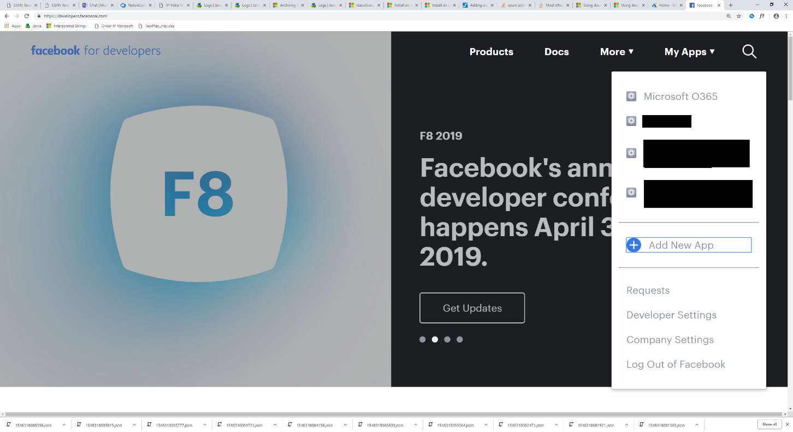
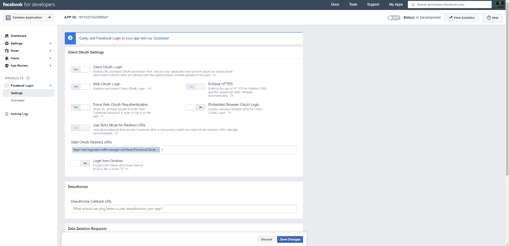
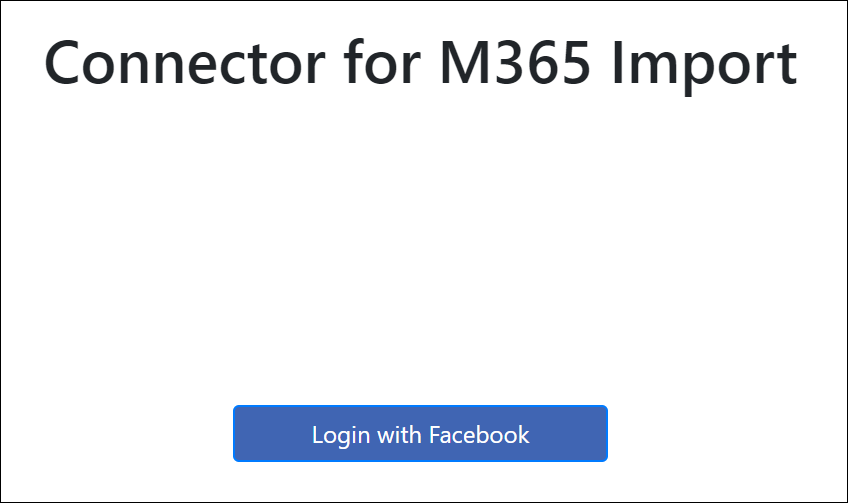
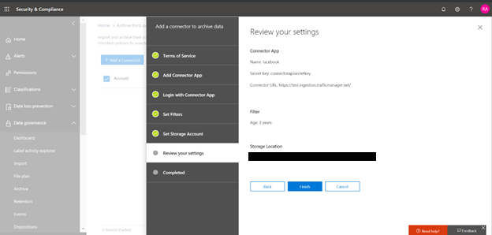

# Office 365 で Facebook データをアーカイブするためのコネクタの展開

この記事では、Office 365 インポートサービスを使用して Facebook のビジネスページから Office 365 にデータをインポートするコネクタを展開するための段階的なプロセスについて説明します。 このプロセスの概要と、Facebook コネクタを展開するために必要な前提条件の一覧については、「[サンプルコネクタを使用して Office 365 で facebook データをアーカイブする (プレビュー)](archive-facebook-data-with-sample-connector.md)」を参照してください。 

## 手順 1: パッケージをダウンロードする

にある GitHub リポジトリのリリースセクションから、あらかじめ構築された<https://github.com/Microsoft/m365-sample-connector-csharp-aspnet/releases>パッケージをダウンロードします。 最新リリースの下で、 **SampleConnector**という名前の zip ファイルをダウンロードします。 この zip ファイルは、手順4で Azure にアップロードします。

## 手順 2: Azure Active Directory でアプリを作成する

1. に<https://portal.azure.com>移動し、Office 365 グローバル管理者アカウントの資格情報を使用してサインインします。

    

2. 左側のナビゲーションウィンドウで、[ **Azure Active Directory**] をクリックします。

    

3. 左側のナビゲーションウィンドウで、[**アプリの登録 (プレビュー)** ] をクリックし、[**新しい登録**] をクリックします。

    

4. アプリケーションを登録します。 [リダイレクト URI] で、[アプリケーションの種類] ドロップダウンリストから<https://portal.azure.com> [Web] を選択し、URI のボックスに入力します。

   

5. **アプリケーション (クライアント) id**と**ディレクトリ (テナント) id**をコピーし、それをテキストファイルまたは他の安全な場所に保存します。 これらの Id は、後の手順で使用します。

   

6. **新しいアプリの [証明書 & シークレット] に移動します。**

   

7. [**新しいクライアントシークレット**] をクリックします。

   

8. 新しいシークレットを作成します。 [説明] ボックスに、シークレットを入力し、有効期限を選択します。 

    

9. シークレットの値をコピーして、テキストファイルまたは他の保存場所に保存します。 これは、後の手順で使用する AAD アプリケーションシークレットです。

   

10. **マニフェスト**に移動し、次のスクリーンショットで強調表示されているように、identifieruris (AAD アプリケーション Uri とも呼ばれる) をコピーします。 AAD アプリケーション Uri をテキストファイルまたは他の保存場所にコピーします。 手順6で使用します。

   

## 手順 3: Azure storage アカウントを作成する

1. 組織の Azure ホームページに移動します。

    

2. [**リソースの作成**] をクリックし、検索ボックスに「**ストレージアカウント**」と入力します。

    

3. [**記憶域**] をクリックし、[**ストレージアカウント**] をクリックします。

    

4. [**ストレージアカウントの作成**] ページの [サブスクリプション] ボックスで、使用している Azure サブスクリプションの種類に応じて、[**購入時に支払う**] または [**無料試用版**] を選択します。 次に、リソースグループを選択または作成します。

    

5. ストレージアカウントの名前を入力します。

    

6. 確認してから [**作成**] をクリックして、ストレージアカウントを作成します。

    

7. しばらくしてから、[**更新**] をクリックし、[**リソースに移動**] をクリックして、ストレージアカウントに移動します。

    

8. 左側のナビゲーションウィンドウで [**アクセスキー** ] をクリックします。

    

9. **接続文字列**をコピーし、テキストファイルまたは他の保存場所に保存します。 これは、web アプリケーションリソースを作成するときに使用します。

    

## 手順 4: Azure で新しい web app リソースを作成する

1. Azure portal の**ホーム**ページで、[**リソース\>すべて\>の Web アプリの作成**] をクリックします。 [ **Web アプリ**] ページで、[**作成**] をクリックします。 

   

2. 詳細を入力し (次の図を参照)、Web アプリを作成します。 [**アプリ名**] ボックスに入力した名前が Azure APP service URL の作成に使用されることに注意してください。たとえば、fbconnector.azurewebsites.net のようになります。

   

3. 新しく作成した web app リソースに移動し、左側のナビゲーションウィンドウで [**アプリケーション設定**] をクリックします。 [アプリケーションの設定] で、[新しい設定の追加] をクリックし、次の3つの設定を追加します。 前の手順で入力したテキストファイルにコピーした値を使用します。 

    - **APISecretKey** –任意の値をシークレットとして入力できます。 これは、手順7でコネクタ web アプリにアクセスするために使用されます。

    - **Storageaccountconnectionstring** –手順3で Azure storage アカウントを作成した後にコピーした接続文字列 Uri。

    - **tenantId** –手順2で Azure Active Directory で Facebook connector アプリを作成した後にコピーした Office 365 組織のテナント ID。

    

4. [**全般設定**] で、[**常にオン**] の横にある [**オン**] をクリックします。 ページの上部にある [**保存**] をクリックして、アプリケーションの設定を保存します。

   

5. 最後の手順では、手順1でダウンロードしたコネクタアプリソースコードを Azure にアップロードします。 Web ブラウザーで、https://<AzureAppResourceName>に移動します。 たとえば、Azure app リソース (このセクションの手順2で名前を付けた) の名前が**fbconnector**の場合は、にhttps://fbconnector.scm.azurewebsites.net/ZipDeployUi移動します。 

6. 手順1でダウンロードした SampleConnector をドラッグアンドドロップして、このページに移動します。 ファイルがアップロードされ、展開が正常に完了すると、次のスクリーンショットのようなページが表示されます。

   

## 手順 5: Facebook アプリを登録する

1. に<https://developers.facebook.com>移動して、組織の Facebook ビジネスページのアカウントの資格情報を使用してログインし、[**新しいアプリの追加**] をクリックします。

   

2. 新しいアプリ ID を作成します。

   

3. 左側のナビゲーションウィンドウで、[**製品の追加**] をクリックし、 **Facebook ログイン**タイルで [**設定**] をクリックします。

   

4. [Facebook ログインの統合] ページで、[ **Web**] をクリックします。

   

5. Azure app service の URL を追加します。例https://fbconnector.azurewebsites.netを示します。

   

6. Facebook ログインセットアップのクイックスタートセクションを完了します。

   

7. [ **Facebook ログイン**] の左側のナビゲーションウィンドウで、[**設定**] をクリックし、[**有効な oauth リダイレクト**URI] ボックスに oauth リダイレクト uri を追加します。** \<connectorserviceuri>/Views/FacebookOAuth**の形式を使用します。ここで、コネクタの値は組織の Azure app service の URL です。例https://fbconnector.azurewebsites.netを示します。

   

8. 左側のナビゲーションウィンドウで、[**製品の追加**] をクリックし、[webhooks] をクリックし**ます。** **ページ**のプルダウンメニューで、[**ページ**] をクリックします。 

   

9. Webhooks コールバック URL を追加し、検証トークンを追加します。 コールバック URL の形式。 ** <connectorserviceuri>/api/fbpagewebhook**の形式を使用します。ここで、コネクタサービス uri の値は、組織の Azure app service URL になります。例https://fbconnector.azurewebsites.netを示します。 

    Verify トークンは、強力なパスワードと類似している必要があります。 検証トークンをテキストファイルまたは他の保存場所にコピーします。

     

10. フィードのエンドポイントをテストし、サブスクライブします。

    

11. プライバシー URL、アプリアイコン、およびビジネス用途を追加します。 また、アプリケーション ID とアプリシークレットをテキストファイルまたは他の保存場所にコピーします。

    

12. アプリを公開します。

    

13. 管理者またはテスト担当者の役割にユーザーを追加します。

    

14. ページの**パブリックコンテンツのアクセス**許可を追加します。

    

15. [ページの管理] アクセス許可を追加します。

    

16. Facebook によって確認されたアプリケーションを取得します。

    

## 手順 6: コネクタ web アプリを構成する

1. Https://\<AzureAppResourceName> (AzureAppResourceName は、手順4で名前を付けた Azure app リソースの名前) に移動します。たとえば、名前が**fbconnector**の場合は、にhttps://fbconnector.azurewebsites.net移動します。 アプリのホームページは、次のスクリーンショットのようになります。

   

2. [**構成**] をクリックして、サインインページを表示します。
 
   

3. [テナント Id] ボックスに、テナント Id を入力するか貼り付けます (手順2で取得したもの)。 [パスワード] ボックスに、APISecretKey (手順2で取得した) を入力するか貼り付け、[**構成設定の設定**] をクリックして**構成の詳細**ページを表示します。

    

4. [**構成の詳細**] で、次の構成設定を入力します。 

   - **Facebook アプリケーション id** -手順5で取得した facebook アプリケーションのアプリ id。
   - **Facebook アプリケーションシークレット**-手順5で取得した facebook アプリケーションのアプリシークレット。
   - **Facebook webhook 検証トークン**-手順5で作成した検証トークン。
   - **AAD アプリケーション id** -手順2で作成した Azure Active Directory アプリのアプリケーション id。
   - **AAD アプリケーションシークレット**-手順4で作成した APISecretKey シークレットの値。
   - **Aad アプリケーション uri** -手順2で取得した Aad アプリケーション uri。たとえば、 https://microsoft.onmicrosoft.com/2688yu6n-12q3-23we-e3ee-121111123213のようになります。
   - **App insights インストルメンテーションキー** -このボックスは空白のままにします。

5. [**保存**] をクリックしてコネクタの設定を保存します。

## 手順 7: セキュリティ & コンプライアンスセンターでカスタムコネクタをセットアップする

1. に移動<https://protection.office.com>して、[**データ\>ガバナンス\> ] [サードパーティデータのインポート**] をクリックします。

   

2.  [**コネクタの追加**] をクリックし、[ **Facebook のページ**] をクリックします。

    

3.  [**コネクタアプリの追加**] ページで、次の情報を入力し、[**コネクタの検証**] をクリックします。

    - 最初のボックスに、 **Facebook**などのコネクタの名前を入力します。
    - 2番目のボックスに、手順4で追加した APISecretKey の値を入力するか貼り付けます。
    - 3番目のボックスに、Azure app service の URL を入力するか、貼り付けます。例**https://fbconnector.azurewebsites.net**を示します。
 
    コネクタの検証が正常に完了したら、[**次へ**] をクリックします。
    
    

4.  [**コネクタアプリを使用してログイン] を**クリックします。

    

5. APISecretKey をもう一度入力するか貼り付け、[**コネクタサービスにログイン] を**クリックします。

   

6. [ **Facebook でログイン] をクリックします。**

   

7. [ **Facebook へのログイン**] ページで、組織の facebook ビジネスページのアカウントの資格情報を使用してログインします。 ログインした Facebook アカウントに、組織の Facebook ビジネスページの管理者の役割が割り当てられていることを確認してください。

   

8. [**ページの選択**] をクリックして、Office 365 でアーカイブする組織のビジネスページを選択します。

   

9. ログインした Facebook アカウントによって管理されるビジネスページの一覧が表示されます。 アーカイブするページを選択し、[**保存**] をクリックします。

    

10. [**完了**] をクリックして、connector service アプリのセットアップを終了します。

    

11. [**フィルターの設定**] ページでは、特定の年齢のアイテムをインポート (およびアーカイブ) するためのフィルターを適用できます。 **[次へ]** をクリックします。

    

12. [**ストレージアカウントの設定**] ページで、以前に選択した Facebook ビジネスページのアイテムがインポートされる Office 365 メールボックスを選択します。

    

13. 設定を確認し、[**完了**] をクリックして、セキュリティ _AMP_ コンプライアンスセンターでコネクタの設定を完了します。

    

14. [**サードパーティのデータをアーカイブ**する] ページに移動して、インポートプロセスの進行状況を表示します。

    
