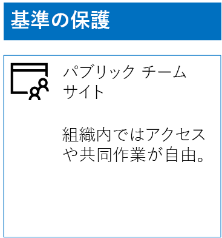
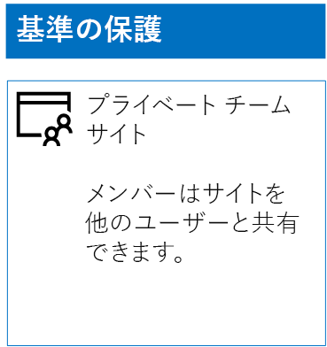
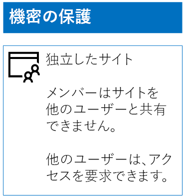
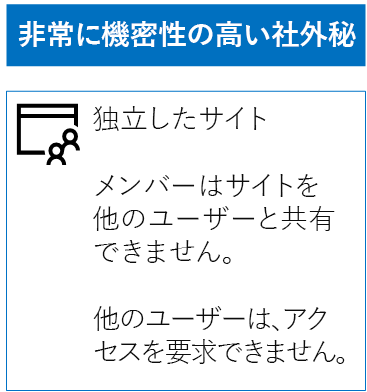

# 3 層の保護用に SharePoint Online サイトを展開する

 **概要:** SharePoint Online チーム サイトを作成し、さまざまなレベルの情報保護用に構成します。
  
ベースライン、機密、および非常に機密性の高い社外秘の SharePoint Online チーム サイトを設計および展開するには、この記事の手順を実行してください。 これらの 3 層の保護の詳細については、「[Secure SharePoint Online sites and files](secure-sharepoint-online-sites-and-files.md)」(SharePoint Online サイトとファイルのセキュリティ保護) を参照してください。
  
## ベースラインの SharePoint Online チーム サイト

ベースラインの保護には、パブリックおよびプライベートのチーム サイトが含まれます。 パブリック チーム サイトは、組織内の全ユーザーが検出し、アクセスすることができます。 プライベート サイトは、チーム サイトに関連付けられている Office 365 グループのメンバーのみが検出し、アクセスすることができます。 いずれの種類のチーム サイトも、メンバーがサイトを他のユーザーと共有することを許可しています。
  
### 公開

パブリック アクセスとアクセス許可を使用するベースライン SharePoint Online チーム サイトを作成するには、次の手順を実行します。
  
1. SharePoint Online チーム サイト (SharePoint Online 管理者) の管理にも使用されるアカウントを使用して、管理センターにサインインします。 詳細については、「[一般法人向け Office 365 にサインインする場所](https://support.office.com/Article/Where-to-sign-in-to-Office-365-e9eb7d51-5430-4929-91ab-6157c5a050b4)」を参照してください。
    
2. タイルの一覧で、**[SharePoint]** をクリックします。
    
3. ブラウザーの新しい **SharePoint** タブで、**[+ サイトの作成]** をクリックします。
    
4. **[サイトの作成]** ページで、 **[チーム サイト]** をクリックします。
    
5. **[サイト名]** にパブリック チーム サイト名を入力します。 
    
6. **[Team site description]\(チーム サイトの説明\)** に、サイトの目的の説明を入力します。
    
7. **[プライバシー設定]** で、**[パブリック - 組織の全ユーザーがこのサイトにアクセス可能]** を選択して **[次へ]** をクリックします。
    
8. **[誰を追加しますか]** ウィンドウで、**[完了]** をクリックします。
    
最終的な構成をここに示します。
  

  
### Private

プライベート アクセスとアクセス許可を使用するベースライン SharePoint Online チーム サイトを作成するには、次の手順を実行します。
  
1. SharePoint Online チーム サイト (SharePoint Online 管理者) の管理にも使用されるアカウントを使用して、管理センターにサインインします。 詳細については、「[一般法人向け Office 365 にサインインする場所](https://support.office.com/Article/Where-to-sign-in-to-Office-365-e9eb7d51-5430-4929-91ab-6157c5a050b4)」を参照してください。
    
2. タイルの一覧で、**[SharePoint]** をクリックします。
    
3. ブラウザーの新しい **SharePoint** タブで、**[+ サイトの作成]** をクリックします。
    
4. **[サイトの作成]** ページで、 **[チーム サイト]** をクリックします。
    
5. **[サイト名]** にプライベート チーム サイト名を入力します。 
    
6. **[チーム サイトの説明]** で、サイトの目的の説明を入力します。
    
7. **[プライバシー設定]** で、**[プライベート - メンバーのみがこのサイトにアクセス可能**」を選択して **[次へ]** をクリックします。
    
8. **[Who do you want to add?]\(追加するユーザー\)** ウィンドウの **[メンバーの追加]** に、このプライベート チーム サイトにアクセスできるユーザー アカウント名を入力します。
    
9. 初期の一連のメンバーをサイトに追加し、**[完了]** をクリックします。
    
最終的な構成をここに示します。
  

  
## 機密 SharePoint Online チーム サイト

機密 SharePoint Online チーム サイトは、独立したチーム サイトです。つまり、アクセス許可は、チーム サイトに関連付けられている Office 365 グループのメンバーシップではなく、SharePoint グループのメンバーシップを介して制御されます。
  
独立したチーム サイトを作成するには、2 つの主な手順があります。
  
### 手順 1: 分離されたサイトを設計する

分離されたチーム サイトを設計するには、以下を決定する必要があります。
  
- SharePoint グループとアクセス許可レベル。
    
- SharePoint グループのメンバーにするアクセス グループのセット。
    
     推奨されるアクセス グループのセットは、サイト メンバー用、サイト閲覧者用、およびサイト管理者用です。
    
- アクセス グループ内で入れ子のグループを使用するかどうか。
    
たとえば、次のような推奨されるグループ構造とアクセス レベルです。
  
|**SharePoint グループ**|**アクセス許可レベル**|**アクセス グループ (例)**|
|:-----|:-----|:-----|
|[サイト名] のメンバー    |編集    |[サイト名] のメンバー    |
|[サイト名] の閲覧者    |読み取り    |[サイト名] の閲覧者    |
|[サイト名] の所有者    |フル コントロール    |[サイト名] の管理者    |
   
チーム サイトの既定で、SharePoint グループとアクセス許可レベルが作成されます。 アクセス グループの名前を決定する必要があります。
  
設計プロセスの詳細については、「[分離した SharePoint Online チーム サイトの設計](design-an-isolated-sharepoint-online-team-site.md)」を参照してください。
  
### 手順 2: 分離されたサイトを展開する

分離されたサイトを展開するには、まず以下を実行する必要があります。
  
- 各アクセス グループに追加するユーザー アカウントとグループを決定します。
    
- アクセス グループを作成し、ユーザーとグループ メンバーを追加します。
    
詳細な手順については、「[分離した SharePoint Online チーム サイトの展開](deploy-an-isolated-sharepoint-online-team-site.md)」の「**フェーズ 1**」を参照してください。
  
次に、次の手順で SharePoint Online チーム サイトを作成します。
  
1. SharePoint Online チーム サイト (SharePoint Online 管理者) の管理にも使用されるアカウントを使用して、管理センターにサインインします。 詳細については、「[一般法人向け Office 365 にサインインする場所](https://support.office.com/Article/Where-to-sign-in-to-Office-365-e9eb7d51-5430-4929-91ab-6157c5a050b4)」を参照してください。
    
2. タイルのリストで、**[SharePoint]** をクリックします。
    
3. ブラウザーの新しい **[SharePoint]** タブで、 **[+ サイトの作成]** をクリックします。
    
4. **[サイトの作成]** ページで、**[チーム サイト]** をクリックします。
    
5. **[サイト名]** にプライベート チーム サイト名を入力します。
    
6. **[チーム サイトの説明]** に任意の説明を入力します。
    
7. **[プライバシー設定]** で、**[プライベート - メンバーのみがこのサイトにアクセス可能**」を選択して **[次へ]** をクリックします。
    
8. **[誰を追加しますか]** ウィンドウで、**[完了]** をクリックします。
    
次に、新しい SharePoint Online チーム サイトから、これらの手順を使用してアクセス許可を構成します。
  
1. サイトへのアクセス要求への対応を担当する IT 管理者または他のユーザーのユーザー プリンシパル名 (UPN) を決定します (belindan@contoso.com は、UPN の一例です)。 
    
2. ツールバーで、設定アイコンをクリックしてから、**[サイトの権限]** をクリックします。
    
3. **[サイトの権限]** ウィンドウで、 **[高度な権限の設定]** をクリックします。
    
4. ブラウザーの新しい **[権限]** タブで、**[アクセス要求の設定]** をクリックします。
    
5. **[アクセス要求の設定]** ダイアログ ボックスで次のようにします。
    
  - **[サイトと個別のファイルおよびフォルダーの共有をメンバーに許可します]** および **[メンバーが、他のユーザーをサイト メンバー グループ <グループ名> に招待することを許可します]** チェック ボックスをオフにします。
    
  - **[すべてのアクセス権要求を以下の電子メール アドレスに送信する]** に手順 1 の IT 管理者の UPN を入力します。
    
  - **[OK]** をクリックします。
    
6. ブラウザーの **[権限]** タブで、一覧の **[[サイト名] のメンバー]** をクリックします。
    
7. **[ユーザーとグループ]** の **[新規]** をクリックします。
    
8. **[共有]** ダイアログ ボックスに、このサイトのサイト メンバー アクセス グループの名前を入力し、選択して **[共有]** をクリックします。
    
9. ブラウザーの戻るボタンをクリックします。
    
10. リスト内の **[[サイト名] の所有者]** をクリックします。
    
11. **[ユーザーとグループ]** で、**[新規]** をクリックします。
    
12. **[共有]** ダイアログ ボックスに、このサイトのサイト管理者アクセス グループの名前を入力し、選択して **[共有]** をクリックします。
    
13. ブラウザーの戻るボタンをクリックします。
    
14. リスト内の **[[サイト名] の閲覧者]** をクリックします。
    
15. **[ユーザーとグループ]** で、**[新規]** をクリックします。
    
16. **[共有]** ダイアログ ボックスに、このサイトのサイト閲覧者アクセス グループの名前を入力し、選択して **[共有]** をクリックします。
    
17. ブラウザーの **[アクセス権]** タブを閉じます。
    
これらのアクセス権の設定の結果は次のとおりです。
  
- **[[サイト名] の所有者]** SharePoint グループには、サイト管理者アクセス グループが含まれます。このアクセス グループのすべてのメンバーは**フル コントロール** アクセス許可レベルを持っています。
    
- **[[site name] Members]\([サイト名] のメンバー\)** SharePoint グループには、サイト メンバー アクセス グループが含まれ、このアクセス グループのすべてのメンバーは**編集**アクセス許可レベルを持っています。
    
- **[[サイト名] の閲覧者]** SharePoint グループには、サイト閲覧者アクセス グループが含まれ、このアクセス グループのすべてのメンバーは**読み取り**アクセス許可レベルを持っています。
    
- メンバーが他のメンバーを招待する機能は無効にされています。
    
- メンバー以外がアクセスを要求する機能は有効にされています。
    
最終的な構成をここに示します。
  

  
サイトのメンバーは、いずれかのアクセス グループのグループ メンバーシップを使用して、サイトのリソースについて安全に共同作業できるようになりました。
  
## 非常に機密性の高い社外秘 SharePoint Online チーム サイト

非常に機密性の高い社外秘 SharePoint Online チーム サイトは、分離されたチーム サイトです。つまり、チーム サイトに関連付けられた Office 365 グループのメンバーシップではなく、SharePoint グループのメンバーシップを使用してアクセス許可を制御しています。
  
非常に機密性の高い社外秘情報とコラボレーション用の分離されたチーム サイトを作成するには、主に 2 つの手順があります。
  
### 手順 1: 分離されたサイトを設計する

分離されたチーム サイトを設計するには、以下を決定する必要があります。
  
- SharePoint グループとアクセス許可レベル。
    
- SharePoint グループのメンバーにするアクセス グループのセット。
    
     推奨されるアクセス グループのセットは、サイト メンバー用、サイト閲覧者用、およびサイト管理者用です。
    
- アクセス グループ内で入れ子のグループを使用するかどうか。
    
たとえば、次のような推奨されるグループ構造とアクセス レベルです。
  
|**SharePoint グループ**|**アクセス許可レベル**|**アクセス グループ (例)**|
|:-----|:-----|:-----|
|[サイト名] のメンバー    |編集    |[サイト名] のメンバー    |
|[サイト名] の閲覧者    |読み取り    |[サイト名] の閲覧者    |
|[サイト名] の所有者    |フル コントロール    |[サイト名] の管理者    |
   
チーム サイトの既定で、SharePoint グループとアクセス許可レベルが作成されます。 アクセス グループの名前を決定する必要があります。
  
設計プロセスの詳細については、「[分離した SharePoint Online チーム サイトの設計](design-an-isolated-sharepoint-online-team-site.md)」を参照してください。
  
### 手順 2: 分離されたサイトを展開する

分離されたサイトを展開するには、まず以下を実行する必要があります。
  
- それぞれのアクセス グループに追加するユーザーとグループ メンバーを決定する
    
- アクセス グループを作成し、ユーザーおよびグループ メンバーを追加する
    
- アクセス グループを使用する独立したチーム サイトを作成する
    
詳細な手順については、「[分離した SharePoint Online チーム サイトの展開](deploy-an-isolated-sharepoint-online-team-site.md)」を参照してください。
  
このアクセス権の設定の結果は次のとおりです。
  
- **[[サイト名] の所有者]** SharePoint グループには、サイト管理者アクセス グループが含まれます。このアクセス グループのすべてのメンバーは**フル コントロール** アクセス許可レベルを持っています。
    
- **[[site name] Members]\([サイト名] のメンバー\)** SharePoint グループには、サイト メンバー アクセス グループが含まれ、このアクセス グループのすべてのメンバーは**編集**アクセス許可レベルを持っています。
    
- **[[サイト名] の閲覧者]** SharePoint グループには、サイト閲覧者アクセス グループが含まれ、このアクセス グループのすべてのメンバーは**読み取り**アクセス許可レベルを持っています。
    
- メンバーが他のメンバーを招待する機能は無効にされています。
    
- メンバー以外がアクセスを要求する機能は無効にされています。
    
最終的な構成をここに示します。
  

  
サイトのメンバーは、いずれかのアクセス グループのグループ メンバーシップを使用して、サイトのリソースについて安全に共同作業できるようになりました。
  
## 次の手順

[Office 365 ラベルと DLP による SharePoint ファイルの保護](protect-sharepoint-online-files-with-office-365-labels-and-dlp.md)

## 関連項目

[SharePoint Online サイトとファイルをセキュリティで保護する](secure-sharepoint-online-sites-and-files.md)
  
[選挙運動、非営利組織、およびその他のアジャイル組織のための Microsoft Security ガイダンス](microsoft-security-guidance-for-political-campaigns-nonprofits-and-other-agile-o.md)
  
[クラウド導入およびハイブリッド ソリューション](https://docs.microsoft.com/office365/enterprise/cloud-adoption-and-hybrid-solutions)
