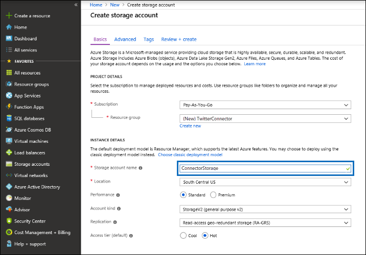
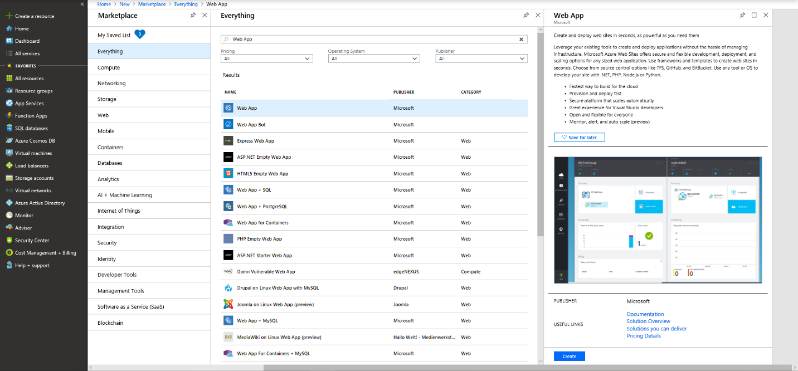
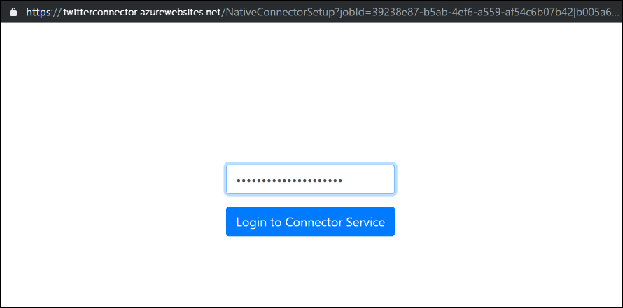
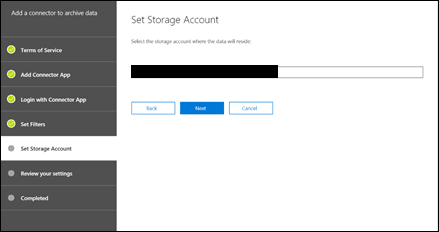

# Office 365 でアーカイブ Twitter データにコネクタを展開するDeploy a connector to archive Twitter data in Office 365

この記事では、Office 365 インポートサービスを使用して組織の Twitter アカウントから Office 365 にデータをインポートするコネクタを展開するための段階的なプロセスについて説明します。This article contains the step-by-step process to deploy a connector that uses the Office 365 Import service to import data from your organization's Twitter account to Office 365. このプロセスの概要と、Twitter コネクタを展開するために必要な前提条件の一覧については、「[サンプルコネクタを使用して Office 365 の Twitter データをアーカイブする (プレビュー)](archive-twitter-data-with-sample-connector.md)」を参照してください。For a high-level overview of this process and a list of prerequisites required to deploy a Twitter connector, see [Use a sample connector to archive Twitter data in Office 365 (Preview)](archive-twitter-data-with-sample-connector.md). 

## 手順 1: パッケージをダウンロードするStep 1: Download the package

の GitHub リポジトリのリリースセクションから、構築済みパッケージをダウンロード[https://github.com/microsoft/m365-sample-twitter-connector-csharp-aspnet/releases](https://github.com/microsoft/m365-sample-twitter-connector-csharp-aspnet/releases)します。Download the prebuilt package from the Release section in the GitHub repository at [https://github.com/microsoft/m365-sample-twitter-connector-csharp-aspnet/releases](https://github.com/microsoft/m365-sample-twitter-connector-csharp-aspnet/releases). 最新リリースの下で、 **SampleConnector**という名前の zip ファイルをダウンロードします。Under the latest release, download the zip file named **SampleConnector.zip**. この zip ファイルは、手順4で Azure にアップロードします。You will upload this zip file to Azure in Step 4.

## 手順 2: Azure Active Directory でアプリを作成するStep 2: Create an app in Azure Active Directory

1. に<https://portal.azure.com>移動し、Office 365 グローバル管理者アカウントの資格情報を使用してサインインします。Go to <https://portal.azure.com> and sign in using the credentials of an Office 365 global admin account.

   

2. 左側のナビゲーションウィンドウで、[ **Azure Active Directory**] をクリックします。In the left navigation pane, click **Azure Active Directory**.

   

3. 左側のナビゲーションウィンドウで、[**アプリの登録 (プレビュー)** ] をクリックし、[**新しい登録**] をクリックします。In the left navigation pane, click **App registrations (Preview)** and then click **New registration**.

   

4. アプリケーションを登録します。Register the application. [**リダイレクト URI (オプション)**] で、[アプリケーションの種類] ドロップダウンリストから<https://portal.azure.com> [Web] を選択し、URI のボックスに入力します。Under **Redirect URI (optional)**, select Web in the application type dropdown list and then type <https://portal.azure.com> in the box for the URI.

   

5. **アプリケーション (クライアント) id**と**ディレクトリ (テナント) id**をコピーし、それをテキストファイルまたは他の安全な場所に保存します。Copy the **Application (client) ID** and **Directory (tenant) ID** and save them to a text file or other safe location. これらの Id は、後の手順で使用します。You’ll use these IDs in later steps.

    

6. [**証明書 &] [新しいアプリ**] および [**クライアントシークレット**] の下で、[**新しいクライアントシークレット**] をクリックします。Go to **Certificates & secrets for the new app** and under **Client secrets** click **New client secret**.

   

7. 新しいシークレットを作成します。Create a new secret. [説明] ボックスに、シークレットを入力し、有効期限を選択します。In the description box, type the secret and then choose an expiration period. 

   

8. シークレットの値をコピーして、テキストファイルまたは他の保存場所に保存します。Copy the value of the secret and save it to a text file or other storage location. これは、後の手順で使用する AAD アプリケーションシークレットです。This is the AAD application secret that you will use in later steps.

   

9. **マニフェスト**に移動し、次のスクリーンショットで強調表示されているように、identifieruris (AAD アプリケーション Uri とも呼ばれる) をコピーします。Go to **Manifest** and copy the identifierUris (which is also called the AAD application Uri) as highlighted in the following screenshot. AAD アプリケーション Uri をテキストファイルまたは他の保存場所にコピーします。Copy the AAD application Uri to a text file or other storage location. 手順6で使用します。You’ll use it in Step 6.

    

## 手順 3: Azure storage アカウントを作成するStep 3: Create an Azure storage account

1.  組織の Azure ホームページに移動します。Go to the Azure home page for your organization.

    

2. [**リソースの作成**] をクリックし、検索ボックスに「**ストレージアカウント**」と入力します。Click **Create a resource** and they type **storage account** in the search box.

   

3. [**記憶域**] をクリックし、[**ストレージアカウント**] をクリックします。Click **Storage**, and then click **Storage account**.

   

4. [**ストレージアカウントの作成**] ページの [サブスクリプション] ボックスで、使用している Azure サブスクリプションの種類に応じて、[**購入時に支払う**] または [**無料試用版**] を選択します。On the **Create storage account** page, in the Subscription box, select **Pay-As-You-Go** or **Free Trial** depending on which type of Azure subscription you have. 

   

5. リソースグループを選択または作成します。Select or create a resource group.

   

6. ストレージアカウントの名前を入力します。Type a name for the storage account.

   

7. 確認してから [**作成**] をクリックして、ストレージアカウントを作成します。Review and then click **Create** to create the storage account.

   

8. しばらくしてから、[**更新**] をクリックし、[**リソースに移動**] をクリックして、ストレージアカウントに移動します。After a few moments, click **Refresh** and then click **Go to resource** to navigate to the storage account.

   

9. 左側のナビゲーションウィンドウで [**アクセスキー** ] をクリックします。Click **Access keys** in the left navigation pane.

   

10. **接続文字列**をコピーし、テキストファイルまたは他の保存場所に保存します。Copy a **Connection string** and save it to a text file or other storage location. この操作は、手順4で web app リソースを作成するときに使用します。You’ll use this when creating a web app resource in Step 4.

    

## 手順 4: Azure で新しい web app リソースを作成するStep 4: Create a new web app resource in Azure

1. Azure portal の**ホーム**ページで、[**リソース\>すべて\>の Web アプリの作成**] をクリックします。On the **Home** page in the Azure portal, click **Create a resource \> Everything \> Web app**. [ **Web アプリ**] ページで、[**作成**] をクリックします。On the **Web app** page, click **Create**.

   

2. 詳細を入力し (次の図を参照)、Web アプリを作成します。Fill in the details (as shown below) and then create the Web app. [**アプリ名**] ボックスに入力した名前が Azure APP service URL の作成に使用されることに注意してください。たとえば、twitterconnector.azurewebsites.net のようになります。Note that the name that you enter in the **App name** box will be used to create the Azure app service URL; for example twitterconnector.azurewebsites.net.

   

3. 新しく作成した web app リソースに移動し、左側のナビゲーションウィンドウで [**アプリケーション設定**] をクリックします。Go to the newly created web app resource, click **Application Settings** in the left navigation pane. [**アプリケーションの設定**] で、[**新しい設定の追加**] をクリックし、次の3つの設定を追加します。Under **Application settings**, click **Add new setting** and add the following three settings. 前の手順で入力したテキストファイルにコピーした値を使用します。Use the values (that you copied to the text file from the previous steps): 

    - **APISecretKey** –任意の値をシークレットとして入力できます。**APISecretKey** – You can type any value as the secret. これは、手順7でコネクタ web アプリにアクセスするために使用されます。This will be used to access the connector web app in Step 7.

    - **Storageaccountconnectionstring** –手順3で Azure storage アカウントを作成した後にコピーした接続文字列 Uri。**StorageAccountConnectionString** – The connection string Uri that you copied after creating the Azure storage account in Step 3.

    - **tenantId** –手順2で、Azure Active Directory で Twitter connector アプリを作成した後にコピーした Office 365 組織のテナント ID。**tenantId** – The tenant ID of your Office 365 organization that you copied after creating the Twitter connector app in Azure Active Directory in Step 2.

    

4. [**全般設定**] で、[**常にオン**] の横にある [**オン**] をクリックします。Under **General settings**, click **On** next to the **Always On**. ページの上部にある [**保存**] をクリックして、アプリケーションの設定を保存します。Click **Save** at the top of the page to save the application settings.

   

5. 最後の手順では、手順1でダウンロードしたコネクタアプリソースコードを Azure にアップロードします。The final step is to upload the connector app source code to Azure that you downloaded in Step 1. Web ブラウザーで、https://<AzureAppResourceName>に移動します。In a web browser, go to https://<AzureAppResourceName>.scm.azurewebsites.net/ZipDeployUi. たとえば、このセクションの手順2で指定した Azure app リソースの名前が**twitterconnector**の場合は、にhttps://twitterconnector.scm.azurewebsites.net/ZipDeployUi移動します。For example, if the name of your Azure app resource (which you named in step 2 in this section) is **twitterconnector**, then you would go to https://twitterconnector.scm.azurewebsites.net/ZipDeployUi.

6. 手順1でダウンロードした SampleConnector をドラッグアンドドロップして、このページに移動します。Drag and drop the SampleConnector.zip (that you downloaded in Step 1) to this page. ファイルがアップロードされ、展開が正常に完了すると、次のスクリーンショットのようなページが表示されます。After the files are uploaded and the deployment is successful, the page will look similar to the following screenshot.

   

## 手順 5: Twitter アプリを作成するStep 5: Create the Twitter app

1. にhttps://developer.twitter.com移動して、組織の開発者アカウントの資格情報を使用してログインし、[**アプリ**] をクリックします。Go to https://developer.twitter.com, log in using the credentials for the developer account for your organization, and then click **Apps**.

   
2. [**アプリの作成**] をクリックします。Click **Create an app**.
   
   

3. [**アプリの詳細**] で、アプリケーションに関する情報を追加します。Under **App details**, add information about the application.

   

4. Twitter 開発者ダッシュボードで、作成したばかりのアプリを選択し、表示されたアプリ ID をコピーして、テキストファイルまたはその他の保存場所に保存します。On the Twitter developer dashboard, select the app that you just created and copy the App ID that's displayed  and save it to a text file or other storage location. [**詳細**] をクリックします。Then click **Details**.
   
   

5. [**キーとトークン**] タブの [**コンシューマー api キー** ] で、api シークレットキーをコピーして、テキストファイルまたは他の保存場所に保存します。On the **Keys and tokens** tab, under **Consumer API keys** copy the API secret key and save it to a text file or other storage location. 次に、[**作成**] をクリックしてアクセストークンとアクセストークンシークレットを生成し、それをテキストファイルまたは他の保存場所にコピーします。Then click **Create** to generate an access token and an access token secret, and copy these to a text file or other storage location.
   
   

   次に、[**作成**] をクリックしてアクセストークンとアクセストークンシークレットを生成し、それをテキストファイルまたは他の保存場所にコピーします。Then click **Create** to generate an access token and an access token secret, and copy these to a text file or other storage location.

6. [**アクセス許可**] タブをクリックし、次のスクリーンショットに示されているようにアクセス許可を構成します。Click the **Permissions** tab and configure the permissions as shown in the following screenshot:

   

7. アクセス許可の設定を保存した後、[**アプリの詳細**] タブをクリックし、[**編集 > 編集の詳細**] をクリックします。After you save the permission settings, click the **App details** tab, and then click **Edit > Edit details**.

   

8. 次のタスクを実行します。Do the following tasks:

   - チェックボックスをオンにして、コネクタアプリが Twitter にサインインできるようにします。Select the checkbox to allow the connector app to sign in to Twitter.
   
   - 次の形式を使用して OAuth リダイレクト Uri を追加します: \*\* \<connectorserviceuri>/Views/TwitterOAuth\**。この場合は、*コネクタサービス Uri\*の値が組織の Azure app service URL になります。例https://twitterconnector.azurewebsites.net/Views/TwitterOAuthを示します。Add the OAuth redirect Uri using the following format: **\<connectorserviceuri>/Views/TwitterOAuth**, where the value of *connectorserviceuri* is the Azure app service URL for your organization; for example https://twitterconnector.azurewebsites.net/Views/TwitterOAuth.

   

Twitter 開発者アプリを使用する準備ができました。The Twitter developer app is now ready to use.

## 手順 6: コネクタ web アプリを構成するStep 6: Configure the connector web app 

1. Https://\<AzureAppResourceName> に移動します (ここで、 **AzureAppResourceName**は手順4で名前を付けた Azure app リソースの名前です)。たとえば、名前が**twitterconnector**の場合は、にhttps://twitterconnector.azurewebsites.net移動します。Go to https://\<AzureAppResourceName>.azurewebsites.net (where **AzureAppResourceName** is the name of your Azure app resource that you named in Step 4) For example, if the name is **twitterconnector**, go to https://twitterconnector.azurewebsites.net. アプリのホームページは、次のスクリーンショットのようになります。The home page of the app will look like the following screenshot.

   

2. [**構成**] をクリックして、サインインページを表示します。Click **Configure** to display a sign in page.

   

3. [テナント Id] ボックスに、テナント Id を入力するか貼り付けます (手順2で取得したもの)。In the Tenant Id box, type or paste your tenant Id (that you obtained in Step 2). [パスワード] ボックスに、APISecretKey (手順2で取得した) を入力するか貼り付け、[**構成設定の設定**] をクリックして**構成の詳細**ページを表示します。In the password box, type or paste the APISecretKey (that you obtained in Step 2), and then click **Set Configuration Settings** to display the **Configuration Details** page.

   

4. [**構成の詳細**] で、次の構成設定を入力します。Under **Configuration Details**, enter the following configuration settings 

   - **Twitter アプリケーション id** -手順5で作成した twitter アプリケーションのアプリ id。**Twitter application ID** - The app ID for the Twitter application that you created in Step 5.
   - **Twitter アプリケーションシークレット**-手順5で作成した twitter アプリケーションの API シークレットキー。**Twitter application secret** - The API secret key for the Twitter application that you created in Step 5.
   - **Twitter クライアントトークン**-手順5で作成したアクセストークン。**Twitter client token** - The access token that you created in Step 5.
   - **Twitter クライアントトークンシークレット**-手順5で作成したアクセストークンシークレット。**Twitter client token secret** - The access token secret that you created in Step 5.
   - **AAD アプリケーション id** -手順2で作成した Azure Active Directory アプリのアプリケーション id**AAD application ID** - The application ID for the Azure Active Directory app that you created in Step 2
   - **AAD アプリケーションシークレット**-手順4で作成した APISecretKey シークレットの値。**AAD application secret** - The value for the APISecretKey secret that you created in Step 4.
   - **Aad アプリケーション uri** -手順2で取得した Aad アプリケーション uri。たとえば、 https://microsoft.onmicrosoft.com/2688yu6n-12q3-23we-e3ee-121111123213のようになります。**AAD application Uri** - The AAD application Uri obtained in Step 2; for example, https://microsoft.onmicrosoft.com/2688yu6n-12q3-23we-e3ee-121111123213.
   - **App insights インストルメンテーションキー** -このボックスは空白のままにします。**App insights instrumentation key** - Leave this box blank.

5. [**保存**] をクリックしてコネクタの設定を保存します。Click **Save** to save the connector settings.

## 手順 7: セキュリティ/コンプライアンスセンターでカスタムコネクタをセットアップするStep 7: Set up a custom connector in the security and compliance center

1.  に移動<https://protection.office.com>して、[**データ\>ガバナンス\> ] [サードパーティデータのインポート**] をクリックします。Go to <https://protection.office.com> and then click **Data governance \> Import \> Archive third-party data**.

    

2. [**コネクタの追加**] をクリックし、[ **Twitter**] をクリックします。Click **Add a connector** and then click **Twitter**.

   

3. [**コネクタアプリの追加**] ページで、次の情報を入力し、[**コネクタの検証**] をクリックします。On the **Add Connector App** page, enter the following information and then click **Validate connector**.

    - 最初のボックスに、 **Twitter**などのコネクタの名前を入力します。In the first box, type a name for the connector, such as **Twitter**.
    - 2番目のボックスに、手順4で追加した APISecretKey の値を入力するか貼り付けます。In the second box, type or paste the value of the APISecretKey that you added in Step 4.
    - 3番目のボックスに、Azure app service の URL を入力するか、貼り付けます。例**https://twitterconnector.azurewebsites.net**を示します。In the third box, type or paste the Azure app service URL; for example **https://twitterconnector.azurewebsites.net**.

   コネクタの検証が正常に完了したら、[**次へ**] をクリックします。After the connector is successfully validated, click **Next**.

   

4. [**コネクタアプリを使用してログイン] を**クリックします。Click **Login with Connector App**.

   

5. APISecretKey をもう一度入力するか貼り付け、[**コネクタサービスにログイン] を**クリックします。Type or paste the APISecretKey again and then click  **Login to Connector Service**.

   

6. [ **Twitter で続行] を**クリックします。Click **Continue with Twitter**.

7. [Twitter サインイン] ページで、組織の Twitter アカウントのアカウントの資格情報を使用してサインインします。On the Twitter sign in page, sign in using the credentials for the account for your organization’s Twitter account.

   

   サインインした後、Twitter ページに次のメッセージが表示されます。 "Twitter Connector ジョブは正常にセットアップされました。"After you sign in, the Twitter page will display the following message, "Twitter Connector Job Successfully set up."

8. [**完了**] をクリックして、Twitter connector の設定を完了します。Click **Finish** to complete setting up the Twitter connector.

9. [**フィルターの設定**] ページでは、特定の年齢のアイテムをインポート (およびアーカイブ) するためのフィルターを適用できます。On the **Set Filters** page, you can apply a filter to import (and archive) items that are a certain age. **[次へ]** をクリックします。Click **Next**.

   

10. [**ストレージアカウントの設定**] ページで、Twitter アイテムがインポートされる Office 365 メールボックスを選択します。On the **Set Storage Account** page, select the Office 365 mailbox that the Twitter items will be imported to.

    

11. 設定を確認し、[**完了**] をクリックして、セキュリティ _AMP_ コンプライアンスセンターでコネクタの設定を完了します。Review your settings and then click **Finish** to complete the connector setup in the Security & Compliance Center.

    

    

12. [**サードパーティのデータをアーカイブ**する] ページに移動して、インポートプロセスの進行状況を表示します。Go to the **Archive third-party data** page to see the progress of the import process.

    
