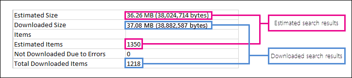

# Office 365 での見積もりおよび実際の電子情報開示の検索結果の相違点Differences between estimated and actual eDiscovery search results in Office 365

このトピックは、次のいずれかの Microsoft eDiscovery ツールを使用して実行できる検索に適用されます。This topic applies to searches that you can run using one of the following Microsoft eDiscovery tools: 

- セキュリティ & コンプライアンスセンターでのコンテンツ検索Content Search in the Security & Compliance Center     
- Exchange 管理センター (EAC) のインプレース電子情報開示In-Place eDiscovery in the Exchange admin center (EAC)     
- SharePoint Online の電子情報開示センターThe eDiscovery Center in SharePoint Online    
   
電子情報開示検索を実行すると、使用しているツールは、検索条件を満たすアイテム数 (およびその合計サイズ) の推定値を返します。When you run an eDiscovery search, the tool you're using will return an estimate of the number of items (and their total size) that meet the search criteria. たとえば、セキュリティ & コンプライアンスセンターで検索を実行すると、予想される検索結果が、選択した検索の詳細ウィンドウに表示されます。For example, when you run a search in the Security & Compliance Center, the estimated search results are displayed in the details pane for the selected search.
  

  
これは、結果をローカルコンピューターにエクスポートし、検索結果と共にダウンロードされたエクスポート概要レポートで、電子情報開示エクスポートツールで表示されるアイテムの合計サイズと同じ推定数です。This is the same estimate of total size and number of items that is displayed in the eDiscovery Export Tool when you export results to a local computer and in the Export Summary report that's downloaded with the search results.
  
**電子情報開示エクスポートツールの予想結果****Estimated results in the eDiscovery Export Tool**

  
**エクスポート概要レポートの予想結果****Estimated results in Export Summary report**

  
ただし、エクスポート概要レポートの前のスクリーンショットでわかるように、実際にダウンロードされる実際の検索結果のサイズと数は、推定される検索結果のサイズと数とは異なります。However, as you'll notice in the previous screenshot of the Export Summary report, the size and number of actual search results that are actually downloaded are different than the size and number of estimated search results. 
  

  
これらの違いのいくつかの理由を次に示します。Here are some reasons for these differences:
  
- \*\*\*\* 検索結果の推定値は、検索クエリの条件を満たすアイテムの推定値 (実際の数ではありません) であることを示しています。**The way results are estimated** - An estimate of the search results are just that, an estimate (and not an actual count) of the items that meet the search query criteria. exchange アイテムの推定値をコンパイルするために、検索条件を満たすメッセージ id のリストが、使用している電子情報開示ツールによって exchange データベースから要求されます。To compile the estimate of Exchange items, a list of the message IDs that meet the search criteria is requested from the Exchange database by the eDiscovery tool you're using. しかし、検索結果をエクスポートすると、検索が再実行され、実際のメッセージが Exchange データベースから取得されます。But when you export the search results, the search is re-run and the actual messages are retrieved from the Exchange database. そのため、アイテムの推定数と実際の数が決定されるため、これらの違いが生じる可能性があります。So these differences might result because of how the estimated number of items and the actual number of items are determined. 
    
- **検索結果の推定およびエクスポート時に行われる変更**-検索結果をエクスポートすると、検索インデックス内で検索条件に一致する最新のアイテムを収集するために検索が再起動されます。**Changes that happen between the time when estimating and exporting search results** - When you export search results, the search is re-started to collect that most recent items in the search index that meet the search criteria. 予想される検索結果が収集されてから、検索結果がエクスポートされてから、検索条件を満たす追加アイテムが作成、送信、または受信された可能性があります。It's possible there are additional items were created, sent, or received that meet the search criteria in the time between when the estimated search results were collected and when the search results were exported. 検索結果がエクスポートされる前にコンテンツの場所から削除されていたために、検索結果が予想されたときに検索インデックスに含まれていたアイテムが存在しなくなった可能性もあります。It's also possible that items that were in the search index when the search results were estimated are no longer there because they were purged from the content location before the search results are exported. この問題を軽減する方法の1つは、電子情報開示検索の日付範囲を指定することです。One way to mitigate this issue is to specify a date range for an eDiscovery search. もう1つの方法は、アイテムが保持され、削除できないように、コンテンツの場所を保持することです。Another way is to place a hold on content locations so that items are preserved and can't be purged. 
    
- **インデックス**のないアイテム-検索対象にインデックスを持たないアイテムは、推定結果と実際の検索結果の相違を発生させることがあります。**Unindexed items** - Items that are unindexed for search can cause differences between estimated and actual search results. たとえば、Exchange のインプレース電子情報開示、および SharePoint の電子情報開示センターでは、検索を実行して検索結果を見積もるときに、インデックスが作成されていないアイテム (検索条件を満たしていない) は含まれません。For example, In-Place eDiscovery in Exchange and the eDiscovery Center in SharePoint don't include unindexed items (that don't meet the search criteria) when you run a search to estimate the search results. ただし、検索結果をエクスポートする場合は、インデックスのないアイテムを含めることができます。But you can include unindexed items when you export the search results. 検索結果をエクスポートするときにインデックスのないアイテムを含めると、エクスポートされるアイテムの数が多くなることがあります。If you include unindexed items when exporting search results, there might be more items that are exported. これにより、推定およびエクスポートされた検索結果が異なります。This will cause a difference between the estimated and exported search results. 
    
    セキュリティ & コンプライアンスセンターでコンテンツ検索ツールを使用する場合は、検索の推定にインデックスのないアイテムを含めるオプションがあります。When using the Content Search tool in the Security & Compliance Center, you have the option to include unindexed items in the search estimate. 検索によって返されるインデックス付けされていないアイテムの数は、その他の予測される検索結果と共に詳細ウィンドウに表示されます。The number of unindexed items returned by the search is listed in the details pane together with the other estimated search results. インデックスが設定されていないアイテムは、推定検索結果の合計サイズにも含まれます。Any unindexed items would also be included in the total size of the estimated search results. 検索結果をエクスポートする場合は、インデックスのないアイテムを含めるか非表示にするかを選択できます。When you export search results, you have the option to include or not include unindexed items. これらのオプションをどのように構成するかによって、予想される結果と実際の検索結果との間で相違が生じることがあります。How you configure these options might result in differences between estimated and the actual search results that are downloaded. 
    
- **すべてのコンテンツの場所を含むコンテンツ検索の結果をエクスポート**する-結果のエクスポート元の検索が組織内のすべてのコンテンツの場所の検索であった場合、次の内容を含むインデックス位置からのインデックスがないアイテムのみ検索条件に一致するアイテムはエクスポートされます。**Exporting the results of a Content Search that includes all content locations** - If the search that you're exporting results from was a search of all content locations in your organization, then only the unindexed items from content locations that contain items that match the search criteria will be exported. In other words, if no search results are found in a mailbox or site, then any unindexed items in that mailbox or site won't be exported.In other words, if no search results are found in a mailbox or site, then any unindexed items in that mailbox or site won't be exported. ただし、すべてのコンテンツの場所 (検索クエリに一致するアイテムが含まれていないものも含む) のインデックスが設定されていないアイテムは、推定検索結果に含まれます。However, unindexed items from all content locations (even those that don't contain items that match the search query) will be included in the estimated search results. 
    
    または、エクスポートした検索結果に特定のコンテンツの場所が含まれている場合、検索で指定されたすべてのコンテンツの場所からインデックスが設定されていないアイテム (検索条件によって除外されていない) はエクスポートされます。Alternatively, if the search that you're exporting results from included specific content locations, then unindexed items (that aren't excluded by the search criteria) from all the content locations specified in the search will be exported. この例では、インデックスが設定されていないアイテムの推定数と、実際にエクスポートされたインデックスのないアイテムの数は同じである必要があります。In this case, the estimated number of unindexed items and the number of unindexed items actually exported should be the same.
    
    インデックスのないアイテムを組織内のすべての場所からエクスポートしない理由は、エクスポートエラーが発生する可能性が高くなり、検索結果のエクスポートとダウンロードにかかる時間が長くなる可能性があるためです。The reason for not exporting unindexed items from every location in the organization is because it might increase the likelihood of export errors and increase the time it takes to export and download the search results.
    
- **raw ファイル形式とエクスポートファイル形式**-exchange アイテムの場合、検索結果の推定サイズは、生の exchange メッセージサイズを使用して計算されます。**Raw file formats versus exported file formats** - For Exchange items, the estimated size of the search results is calculated by using the raw Exchange message sizes. ただし、電子メールメッセージは PST ファイルまたは個別のメッセージ (EML ファイルとして書式設定されている) でエクスポートされます。However, email messages are exported in a PST file or as individual messages (which are formatted as EML files). 両方のエクスポートオプションでは、raw Exchange メッセージとは異なるファイル形式が使用されます。これにより、エクスポートされるファイルサイズの合計は、推定ファイルサイズとは異なるものになります。Both of these export options use a different file format that raw Exchange messages, which results in the total exported file size being different than the estimated file size. 
    
- **ドキュメントのバージョン**-SharePoint ドキュメントの場合、予想される検索結果に複数のバージョンのドキュメントは含まれていません。**Document versions** - For SharePoint documents, multiple versions of a document aren't included in the estimated search results. ただし、検索結果をエクスポートするときに、すべてのドキュメントのバージョンを含めるオプションがあります。これにより、エクスポートされたドキュメントの実際の数 (および合計サイズ) が増加します。But you have the option to include all document versions when you export the search results, which will increase the actual number (and total size) of the exported documents. 
    
- 重複**除外**-Exchange アイテムに対して、重複除外はエクスポートされるアイテムの数を減らします。**De-duplication** - For Exchange items, de-duplication reduces the number of items that are exported. エクスポートするときに、検索結果を重複除外するオプションがあります。You have the option to de-duplicate the search results when you export them. Exchange メッセージでは、メッセージが複数のメールボックス内に存在する場合でも、メッセージの1つのインスタンスのみがエクスポートされることを意味します。For Exchange messages, this means that only a single instance of a message is exported, even though that message might be found in multiple mailboxes. 予想される検索結果には、メッセージのすべてのインスタンスが含まれます。The estimated search results include every instance of a message. そのため、検索結果をエクスポートするときに重複除外オプションを選択すると、エクスポートされるアイテムの実際の数が、アイテムの推定数よりかなり少ない場合があります。So if you choose the de-duplication option when exporting search results, the actual number of items that are exported might be considerably less than the estimated number of items. 
    
    重複除外オプションを選択すると、すべての Exchange アイテムが1つの PST ファイルにエクスポートされ、移行元メールボックスからのフォルダー構造は保持されないため、別のことに注意してください。Another thing to keep in mind if you choose the de-duplication option is that all Exchange items are exported in a single PST file and the folder structure from the source mailboxes isn't preserved. エクスポートされた PST ファイルには、電子メールアイテムのみが含まれています。The exported PST file just contains the email items. ただし、検索結果レポートには、メッセージが置かれているソースメールボックスを識別する、エクスポートされた各メッセージのエントリが含まれています。However, a search results report contains an entry for each exported message that identifies the source mailbox where the message is located. これにより、重複するメッセージを含むすべてのメールボックスを識別できます。This helps you identify all mailboxes that contain a duplicate message. 重複除外を有効にしない場合は、検索に含まれる各メールボックスの別の PST ファイルがエクスポートされます。If you don't enable de-duplication, a separate PST file is exported for each mailbox included in the search. 
    
## SharePoint Online の電子情報開示センターからインデックスのないアイテムをエクスポートするExporting unindexed items from the eDiscovery Center in SharePoint Online

SharePoint Online の電子情報開示センターでは、電子情報開示検索の結果をエクスポートするときに、インデックスが設定されていないコンテンツ (Exchange と SharePoint の場合) を含めるオプションがあります。In the eDiscovery Center in SharePoint Online, you have the option to include unindexed content (from Exchange and SharePoint) when you export the results of an eDiscovery search. これを行うには、[**暗号化されたアイテムを含む] または [認識できない形式**] オプションを選択します。You do this by selecting the **Include items that are encrypted or have an unrecognized format** option. インデックスが設定されていないアイテム (SharePoint では、sharepoint では、「」とも呼ばれません) は、何らかの理由で検索用にインデックスが作成されなかった Exchange や sharepoint のアイテムUnindexed items (also called uncrawlable in SharePoint) are items in Exchange and SharePoint that for some reason weren't indexed for search. インデックスが作成されていない exchange アイテムは、検索結果をエクスポートするときに含まれる**exchange インデックスエラー**レポートに一覧表示されます。Unindexed Exchange items are listed in the **Exchange Index Errors** report that's included when you export search results. 同様に、インデックスが作成されていない sharepoint アイテムは、 **sharepoint インデックスエラー**レポートに表示されます。Similarly, unindexed SharePoint items are listed in **SharePoint Index Errors** report. インデックスが作成されていないアイテムをエクスポートすると、そのアイテムは、" **rawrawラベル**" という名前のフォルダーにダウンロードされます。When you export unindexed items, they're downloaded to a folder named **Uncrawlable**. インデックスのない Exchange アイテムは PST ファイルに含まれます。各インデックスのないドキュメントは、SharePoint からもダウンロードされます。Unindexed Exchange items are included in a PST file; each unindexed document from SharePoint is downloaded too. インデックス付けされていないアイテムの数 (存在する場合) は、各インデックスエラーレポートに一覧表示されます。The number of unindexed items (if there are any) are listed in each index errors report. レポート内のインデックスが作成されていないアイテムの数は、ダウンロードされるインデックスのないアイテムの数と一致する必要があります。The number of unindexed items in the reports should match the number of unindexed items that are downloaded. 
  
 **エクスポートされたインデックスのないアイテムの数がインデックスエラー報告のアイテム数と一致しない場合、いくつかの理由がありますか?****What are some reasons if the number of exported unindexed items don't match the number of items in the index error report?** 前述したように、検索結果が実行されてから、検索結果がエクスポートされた時点までの間に、Office 365 からアイテムが削除されている可能性があります。As previously explained, it's possible that items have been purged from Office 365 between the time the search estimate was run and the time the search results were exported. インデックスを持たないアイテムにも同様の不一致が発生することがあります。A similar discrepancy can occur for unindexed items. たとえば、検索結果がエクスポートされると、検索インデックスが期限切れになることがあります。For example, the search index might be out date when search results are exported. これは、検索結果のエクスポート時にアイテムにインデックスが作成されなかったために、検索結果と共にエクスポートされたインデックスのないアイテムがインデックスエラーレポートに表示されない可能性があることを意味します。This would mean that an unindexed item that was exported with the search results might not be listed in the index errors report because the item wasn't indexed at the time the search results were exported. これにより、インデックスエラーレポートに一覧表示されているよりも多くのインデックスのないアイテムがエクスポートされることになります。This would result in more unindexed items being export than are listed in the index error report. 同様に、インデックスエラーレポートに示されているインデックスのないアイテムは、検索インデックスが更新される前に Office 365 から削除されている可能性があります。Similarly, an unindexed item listed in the index error report could have been purged from Office 365 before the search index was updated. これにより、インデックスエラーレポートに一覧表示されているインデックスを持たないアイテムの数が少なくなります。This would result in fewer unindexed items being export than are listed in the index error report. 
  
> [!NOTE]
> 検索結果をエクスポートするとき、またはレポートをダウンロードするときに、**暗号化されているアイテムまたは認識され**ていない形式のオプションを選択しないと、インデックスエラーレポートがダウンロードされますが、エントリは含まれません。If you don't select the **Include items that are encrypted or have an unrecognized format** option when you export search results or just download the reports, the index error reports are downloaded but they don't have any entries. インデックスエラーが発生していないことを意味します。This doesn't mean there aren't any indexing errors. これは、インデックスを持たないアイテムがエクスポートに含まれていないことを意味します。It just means that unindexed items weren't included in the export. 
  

