# <a name="ediscovery-cases-in-the-office-365-security-amp-compliance-center"></a>電子的証拠開示の場合は、Office 365 のセキュリティ&amp;コンプライアンス センター

電子的証拠開示の場合は、Office 365 のセキュリティで使用できる&amp;を作成、アクセス、および組織内の電子的証拠開示のサポート案件を管理できるユーザーを制御するコンプライアンス センターです。組織に、Office 365 の E5 のサブスクリプションがある場合は、電子的証拠開示の Office 365 の詳細設定を使用して検索結果を分析する電子的証拠開示の場合を使用することもできます。
  
電子的証拠開示のサポート案件を使用すると、ケースにメンバーを追加、そのケースの特定のメンバーを実行、保留リストを訴訟事件に関連するコンテンツの場所に配置したりできます複数のコンテンツの検索を 1 つのケースに関連付けの種類を制御できます。サポート案件に関連付けられているコンテンツの検索の結果をエクスポートしたり、分析のために高度な電子的証拠開示検索結果を準備できます。電子的証拠開示の場合は、組織内の特定の法的事例のコンテンツの検索や検索結果へのアクセスを持つことを制限する良い方法です。
  
設定し、電子的証拠開示のサポート案件を使用して、セキュリティの次のワークフローを使用して&amp;コンプライアンス センター [詳細設定] の電子的証拠開示します。

[手順 1: 潜在的なケースのメンバーに電子情報開示のアクセス許可を割り当てる](#step-1-assign-ediscovery-permissions-to-potential-case-members)

[手順 2: 新しいケースを作成します。](#step-2-create-a-new-case)

[ステップ 3: サポート案件にメンバーを追加します。](#step-3-add-members-to-a-case)

[上のコンテンツの場所を保持する手順 4: 場所](#step-4-place-content-locations-on-hold)

[手順 5: 作成し、サポート案件に関連付けられているコンテンツの検索を実行します。](#step-5-create-and-run-a-content-search-associated-with-a-case)

[手順 6: サポート案件に関連付けられているコンテンツの検索結果をエクスポートします。](#step-6-export-the-results-of-a-content-search-associated-with-a-case)

[手順 7: 準備する高度な電子的証拠開示の検索結果](#step-7-prepare-search-results-for-advanced-ediscovery)

[高度な電子的証拠開示の場合に、手順 8。](#step-8-go-to-the-case-in-advanced-ediscovery)

[(省略可能)手順 9: サポート案件をクローズします。](#optional-step-9-close-a-case)

[(省略可能)手順 10: がクローズされたサポート案件を再度開く](#optional-step-10-re-open-a-closed-case)

[詳細情報](#more-information)
  
## <a name="step-1-assign-ediscovery-permissions-to-potential-case-members"></a>手順 1: 潜在的なケースのメンバーに電子情報開示のアクセス許可を割り当てる

最初のステップは、ステップ 2 では、電子的証拠開示のケースに追加するために、適切な電子的証拠開示に関連するアクセス許可をユーザーに割り当てるには。Office 365 のセキュリティで組織の管理役割グループのメンバーである (または、役割の管理役割を割り当てられる) にある&amp;電子的証拠開示のアクセス許可を割り当てるにはコンプライアンス センターです。次の表では、セキュリティで電子的証拠開示に関連するロール グループ&amp;コンプライアンス センターです。 
  
- **レビュー担当者**がこのロール グループには、最も限定的な電子的証拠開示に関連するアクセス許可があります。このロール グループの主な目的は、メンバーが表示およびアクセスできるようにする場合は電子的証拠開示の Office 365 の詳細データです。このグループのメンバーのみを参照してくださいでき、セキュリティの場合に、**電子的証拠開示**のページ上のリストを開きます&amp;のメンバーとなっているコンプライアンス センターです。セキュリティとコンプライアンス センターで、ユーザーが、大文字と小文字をアクセスした後にアクセスして高度な電子的証拠開示のサポート案件のデータを分析する**高度な電子的証拠開示への切り替え**をクリックしたことができます。ケースにメンバーを追加する場合を作成することはできません、保留リストを作成、検索を作成、検索結果をプレビュー、検索結果をエクスポートまたは高度な電子的証拠開示の結果を準備します。 
    
- **電子的証拠開示マネージャー**がこの役割グループのメンバーでは、作成でき、電子的証拠開示のサポート案件を管理することができます。追加し、メンバーを削除する、コンテンツ上の場所を保持、作成し、サポート案件に関連付けられているコンテンツの検索を編集、コンテンツ検索の結果をエクスポートしたりすることが分析のために高度な電子的証拠開示検索結果を準備します。このロール グループに 2 つのサブグループがあります。次の内容の違いは、スコープに基づきます。
    
  - **電子的証拠開示マネージャー**には、表示し、それらを作成またはのメンバーは、電子的証拠開示のサポート案件を管理できます。別の電子的証拠開示マネージャー サポート案件を作成する場合のメンバーとして、2 つ目電子的証拠開示マネージャーが追加されない場合は、2 つ目の電子証拠開示マネージャーことはできませんを表示またはセキュリティで**電子的証拠開示**のページで、大文字と小文字を開く&amp;コンプライアンス センターです。分析タスクを実行するには、[高度な電子的証拠開示の場合は、電子的証拠開示マネージャーにアクセスできます。 
    
  - **管理者の電子的証拠開示**では、電子的証拠開示マネージャーが実行できるすべてのサポート案件の管理タスクを実行できます。さらに、電子的証拠開示管理者では次のことができます。
    
    - **[電子情報開示]** ページに一覧表示されたすべてのケースの表示。 
    
    - 大文字と小文字のメンバーとして自分自身を追加した後は、いかなる場合においても、組織内を管理します。
    
    - 組織内のすべてのケースでの高度な電子情報開示のケース ・ データにアクセスします。
    
    組織に電子情報開示管理者が必要な理由については、「[More information](#more-information)」セクションをご覧ください。 
    
> [!IMPORTANT]
> これらの電子的証拠開示に関連するロール グループのいずれかのメンバーまたはレビュー担当者ロールが割り当てられている役割グループのメンバーでない人場合、は、電子的証拠開示のサポート案件のメンバーとして追加できません。 

電子的証拠開示の権限の詳細についてを参照してください[Office 365 のセキュリティ、電子的証拠開示のアクセス許可を割り当てる&amp;コンプライアンス センター](assign-ediscovery-permissions.md)です。
  
 **電子情報開示のアクセス許可を割り当てるには、次の操作を実行します。**
  
1. [https://protection.office.com](https://protection.office.com) に移動します。
    
2. 職場または学校のアカウントを使用して、Office 365 にサインインします。
    
3. セキュリティ&amp;コンプライアンス センターでは、**アクセス許可**] をクリックし、電子的証拠開示するアクセス許可を割り当てるに応じて、次のいずれかの操作を行います。
    
    - 校閲者のアクセス許可を割り当てるには、**レビュー担当者**の役割グループを選択をし、**メンバー**の横にある [**編集**] をクリックします。[**メンバーの選択**] をクリックして、[**編集**] をクリックして**追加**を選択し、レビュー担当者の役割グループに追加しユーザーを選択し、[**追加**] をクリックします。
    
    - 電子的証拠開示マネージャーのアクセス許可を割り当てるには、**電子的証拠開示マネージャー**の役割グループを選択し、**電子的証拠開示マネージャー**の横にある [**編集**] をクリックします。**オプションを指定して電子的証拠開示マネージャー**] をクリックして、[**編集**] をクリックして* * 追加 * *、電子的証拠開示マネージャーとして追加するユーザーを選択し、[**追加**] をクリックします。
    
    - 電子的証拠開示の管理者のアクセス許可を割り当てるには、**電子的証拠開示マネージャー**の役割グループを選択し、**電子的証拠開示管理者**の横にある [**編集**] をクリックします。**EDiscovery 管理者の選択**] をクリックして、[**編集**] をクリックして**追加**を選択し、電子的証拠開示の管理者として追加するユーザーを選択し、[**追加**] をクリックします。
    
4. すべてのユーザーを追加したら、[**完了**] をクリックして役割グループに変更を保存**保存**を、し、[**閉じる**] をクリックします。

## <a name="step-2-create-a-new-case"></a>手順 2: 新しいケースを作成します。

次の手順では、新しい電子的証拠開示のサポート案件を作成します。電子的証拠開示のケースを作成するのには電子的証拠開示の管理者の役割グループのメンバーでなければなりません。前に説明すると、セキュリティの新しいサポート案件を作成した後&amp;コンプライアンス センター、する (およびその他のケースのメンバー) ができるよう組織をしている場合は、高度な電子的証拠開示で同じ大文字と小文字が、Office 365 の E5 のサブスクリプションを持っているアクセスになります。
  
1. [https://protection.office.com](https://protection.office.com) に移動します。
    
2. 職場または学校のアカウントを使用して、Office 365 にサインインします。
    
3. セキュリティで&amp;コンプライアンス センター] をクリックして**検索&amp;調査** \> **電子的証拠開示**とをクリックし、**ケースを作成します**。
    
4. **新しいサポート案件**] ページで、[大文字と小文字の名前を付けるを選択し、オプションの説明を入力し、[**保存**] をクリックします。ケースの名前が、組織内で一意ある必要があります注意してください。
    
    
  
    新しいサポート案件は、**電子的証拠開示**のページのサポート案件の一覧に表示されます。メモのことは、状態 (**アクティブ**または**終了**)、大文字と小文字を含む、サポート案件に関する情報を表示するのには大文字の名前にカーソルを合わせたことができます (つまり、前の手順で作成した) 場合は、の説明と、大文字と小文字が最後に変更されたときと変更したとします。
    
    > [!TIP]
    > 新しいサポート案件を作成したら、いつでも変更することができます。**電子的証拠開示**のページで、大文字と小文字の名前をクリックします。フライアウトの**このサポート案件の管理**] ページで、[**名前**] ボックスに表示する名前を変更し、変更を保存します。 
  
## <a name="step-3-add-members-to-a-case"></a>ステップ 3: サポート案件にメンバーを追加します。

新しいサポート案件を作成した後は、ケースにメンバーを追加します。前に説明すると、校閲者のメンバーであるユーザーのみ、または電子的証拠開示マネージャーの役割グループは、大文字と小文字のメンバーとして追加することができます。電子証拠開示のサポート案件を作成した管理者を自動的に [メンバーとして追加することに注意してください。
  
1. セキュリティ&amp;コンプライアンス センターで、**[検索&amp;調査]** \> **[電子情報開示]** の順にクリックし、組織内のケースの一覧を表示します。 
    
2. メンバーを追加する場合の名前をクリックします。
    
    フライアウトの**このサポート案件の管理**] ページが表示されます。 
    
    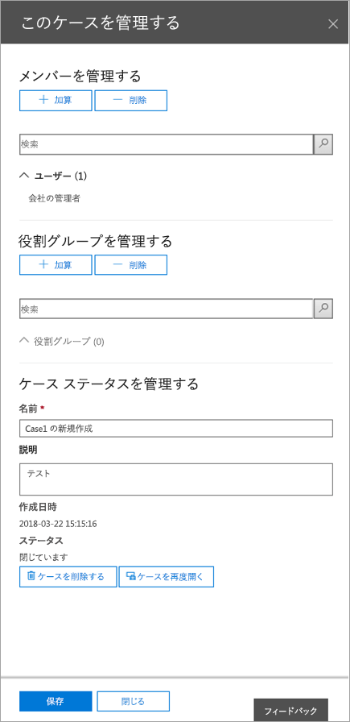
  
3. [**メンバーの管理**] をクリックしてメンバーを追加する場合に**追加**します。 
    
    ケースにロール グループを追加することもできます。**役割グループの管理**] の下をクリックして**追加**します。
    
    > [!NOTE]
    > 電子的証拠開示のサポート案件をメンバーに割り当てることができますユーザーの役割グループを制御します。つまり、大文字と小文字のメンバーとしている役割グループを割り当てることができますのみです。
    
4. 、大文字と小文字のメンバーとして追加できるユーザーまたはロールのグループの一覧に追加するユーザーまたはロールのグループの名前の横のチェック ボックスをクリックします。
    
    > [!TIP]
    > メンバーとして追加できるユーザーのリストが大きい場合は、リスト内の特定の人を検索する**検索**ボックスを使用します。 
  
5. グループのメンバーとして追加するユーザーまたはロールのグループを選択したら、[**追加**] をクリックします。
    
    **このサポート案件の管理**、新しいケースのメンバーの一覧を保存する**保存**をクリックします。 
    
6. ケースのメンバーの新しいリストを保存**保存**をクリックします。 
  
## <a name="step-4-place-content-locations-on-hold"></a>上のコンテンツの場所を保持する手順 4: 場所

サポート案件に関連する可能性のあるコンテンツを保持するために保留リストを作成するのには、電子的証拠開示のサポート案件を使用できます。通告の場合は、ユーザーのビジネス サイトのメールボックスおよび OneDrive の保留リストに配置できます。Office 365 のグループのグループのメールボックス、SharePoint サイト、および OneDrive のビジネス サイトの保留を配置することもできます。同様に、メールボックスとマイクロソフトのチームに関連付けられているサイトで保留リストに配置できます。保留中のコンテンツの場所を配置すると、コンテンツは、コンテンツの場所から、または保留リストを削除するまで、保留リストを削除するまで保持されます。

> [!NOTE]
> 保留中のコンテンツの場所を配置した後、保留を有効にするには、最大で 24 時間がかかります。 
>   
保留リストを作成するときに指定されたコンテンツの場所に保持されているコンテンツの範囲を次のオプションがあります。
  
- 保留リストが無限であることを保留中のすべてのコンテンツを配置する場所を作成します。代わりに、保留中の検索クエリに一致するコンテンツのみを配置する場所のクエリ ベースの保留リストを作成できます。
    
- 送信、受信、またはその日付の範囲内で作成されたコンテンツのみを保持する日付の範囲を指定できます。代わりと、送信、受信、または作成に関係なくすべてのコンテンツを保持できます。
    
> [!NOTE]
> 最大 10,000 の組織内のすべての電子的証拠開示場合間でポリシーを保持することができます。 
  
電子的証拠開示のサポート案件の保留リストを作成します。
  
1. セキュリティ&amp;コンプライアンス センターで、**[検索&amp;調査]** \> **[電子情報開示]** の順にクリックし、組織内のケースの一覧を表示します。 
    
2. 保留リストを作成する場合の横にある [**開く**] をクリックします。 
    
3. [**ホーム**] ページの場合、**保持**タブをクリックします。 
    
    ![保留中] タブをクリックします。](media/3fef2db4-36de-4517-a34d-82f47b82d9bf.png)
  
4. [**保持**] ページをクリックして**を作成します**。
    
5. **名保留中**] ページで、[保留リストに名前を付けます。保留リストの名前は、組織内で一意である必要があります。 
    
    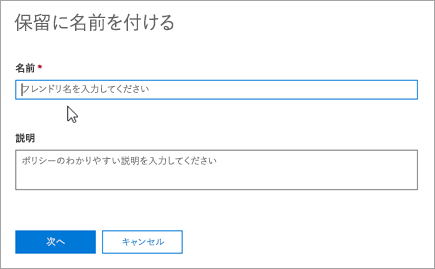
  
6. (省略可能)**[説明**] ボックスでは、保留リストの説明を追加します。 
    
7. [ **次へ**] をクリックします。
    
8. 上に配置するコンテンツの場所を保持」を選択します。メールボックス、サイト、およびパブリック フォルダーを配置するには、保留状態にします。
    
    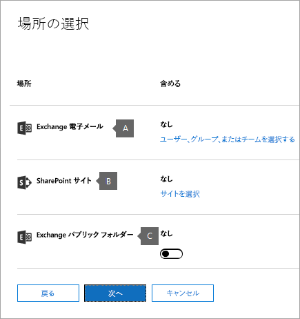
  
   a. **Exchange 電子メール**-**を選択してくださいユーザー、グループ、またはチーム**を**選択してくださいユーザー、グループ、またはチーム**をもう一度クリックします。保留リストに配置するメールボックスを指定します。保留リストに配置するのにユーザーのメールボックスと配布グループ (グループのメンバーのメールボックスは、[保留リストに配置) からの検索に検索ボックスを使用します。関連付けられたメールボックスを Office 365 グループまたはマイクロソフト チームの保留リストを配置することも。ユーザー、グループ、チームのチェック ボックスを選択、**選択**、し、[**完了**] をクリックします。
    
    > [!NOTE]
    > **ユーザー、グループ、またはチームの選択**を保留にするメールボックスを指定する] をクリックすると表示されるメールボックスの選択が空です。これはパフォーマンスを強化するための仕様です。このリストにユーザーを追加するには、検索ボックスに名前 (3 文字以上) を入力します。 
  
   b. **SharePoint サイト**の**サイトの選択**] をクリックし、上に配置するには、SharePoint とビジネス サイトの OneDrive を保持するかを指定するには、もう一度**サイトの選択**] をクリックします。保留リストに配置する各サイトの URL を入力します。Office 365 グループまたはマイクロソフト チームの SharePoint サイトの URL を追加することもできます。**を選択してください**] をクリックし、し、[**完了**] をクリックします。
    
    保留中の Office 365 のグループとマイクロソフトのチームの配置に関するヒントの[詳細について](#more-information)はを参照してください。 
    
    > [!NOTE]
    > まれに、ユーザーのユーザー プリンシパル名 (UPN) を変更することが OneDrive のアカウントの URL も変更されます新しい UPN を組み込むことです。このような場合は、ユーザーの新しい OneDrive の URL を追加し、古いものを削除する保留リストを変更する必要があります。 
  
   c. **Exchange パブリック フォルダー**の移動のオン/オフ スイッチ保留中のオンラインの Exchange 組織内のすべてのパブリック フォルダーを配置する**すべて**の位置にします。注記に配置する特定のパブリック フォルダーを選択することはできませんを保持します。パブリック フォルダーに対して設定したくない場合は、 **[なし]** に設定の切り替えスイッチのままにします。
    
9. 保留リストに追加するコンテンツの場所を確認したら、[**次へ**] をクリックします。
    
10. 条件を使用してクエリ ベースの保持を作成するのには、次の手順を完了します。それ以外の場合、だけで [**次へ**
    
    
  
    
       a. [**キーワード**] ボックスで、ボックスに検索クエリの種類に検索条件に一致するコンテンツのみを配置するためを保持します。キーワード、メッセージ プロパティ、またはファイル名など、文書のプロパティを指定することができます。**AND**、 **OR**、または**しない**などのブール演算子を使用する複雑なクエリを使用することもできます。ままにする場合に指定されたコンテンツの場所にあるすべてのコンテンツを配置するは、空の [キーワード] ボックスを保持します。
    
    b. [、保留中の検索クエリを絞り込むには 1 つまたは複数の条件を追加するのには**追加の条件**です。各条件は、KQL 検索クエリが作成され、保留リストを作成するときに実行するに句を追加します。たとえば日付の射程距離内で作成された電子メール、またはサイトのドキュメントが保留状態に配置されるように、日付の範囲を指定できます。条件の論理的な**AND**演算子によってキーワード クエリ ([キーワード] ボックスで指定) に接続します。キーワード クエリと、条件の両方に配置するを満たすために項目があることを意味が含まれています。

    検索クエリを作成し、条件を使用する方法の詳細については、[キーワード クエリとコンテンツの検索の検索条件](keyword-queries-and-search-conditions.md)を参照してください。
    
11. クエリ ベースを構成した後押したまま、[**次へ**] をクリックします。
    
12. 設定を確認し、[**この保留リストを作成**] をクリックします。
    
### <a name="hold-statistics"></a>統計情報を保持します。

しばらくして、選択された保留リストを**保持している**ページの詳細ウィンドウで、新しい保留リストに関する情報が表示されます。この情報には、メールボックスの数が含まれています。 上のサイトを保持し、保留中の合計数と項目のサイズを配置し、前回の統計情報が計算された保持など、上に作成されている内容に関する統計情報を保持します。これらは、保持されている場合は、電子的証拠開示に関連するコンテンツの量を特定する統計情報のヘルプを保持します。 
  
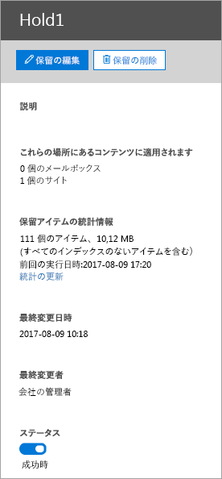
  
次の保留中の統計情報に関する注意点をしてください。
  
- 保留中のアイテムの合計数は、保留中のすべてのコンテンツ ソースからのアイテムの数を示します。作成した場合は、クエリに基づくを保持、この統計は、クエリに一致する項目の数を示します。
    
- 保留中のアイテムの数には、コンテンツの場所にインデックスの項目も含まれています。クエリ ベースの保留リストを作成する場合保留中のコンテンツの場所にインデックスを持たないすべての品目が配置されることを注意してください。これには、クエリ ベースの保留中の検索条件に一致しないアイテムのインデックスとインデックスを持たないアイテムを日付の範囲の条件を超える場合がありますが含まれます。これは、検索クエリに一致しない、または日付の範囲の条件によって除外されている項目インデックスにはが検索結果に含まれていない、コンテンツの検索を実行するときの動作とは異なります。インデックスの項目の詳細については、[部分的にアイテムを Office 365 でのコンテンツの検索にインデックスを作成](partially-indexed-items-in-content-search.md)を参照してください。
    
- 最新版を取得する保留中のアイテムの現在の数を計算する**統計情報の更新**を再検索を実行する] をクリックして統計情報の評価を保持します。必要に応じて、[**更新**] をクリックして詳細ウィンドウで保留中の統計情報を更新するのにはツールバーにします。 
    
- 上のアイテムの数の標準は、保留リストには、メールボックスまたはサイトを持つユーザーは、通常または新しい電子メール メッセージを受信および送信ビジネス ドキュメントの新しい SharePoint および OneDrive を作成するために、徐々 に増加する保持します。
    
> [!NOTE]
> 場合は、SharePoint サイトまたは OneDrive のアカウントを複数地域で別の地域に移動すると、そのサイトの統計情報は、保留中の統計情報に含まれません。ただし、サイト内のコンテンツは、保留状態にはできます。また、サイトが別の地域に移動した場合、保留リストに表示されている URL は更新されません。保留リストを編集し、URL を更新する必要があります。 
  
## <a name="step-5-create-and-run-a-content-search-associated-with-a-case"></a>手順 5: 作成し、サポート案件に関連付けられているコンテンツの検索を実行します。

保留中のケースに関連するすべての通告は、電子的証拠開示のサポート案件を作成すると、作成して、サポート案件に関連付けられている 1 つまたは複数のコンテンツ検索を実行します。コンテンツの**検索**] ページで、セキュリティに登録されていないサポート案件に関連する検索&amp;コンプライアンス センターです。コンテンツの検索がサポート案件に関連付けられていることを意味は、電子的証拠開示マネージャーの役割グループのメンバーでもあるケースのメンバーのみがアクセスできます。 
  
1. セキュリティ&amp;コンプライアンス センターで、**[検索&amp;調査]** \> **[電子情報開示]** の順にクリックし、組織内のケースの一覧を表示します。 
    
2. コンテンツの検索を作成する場合の横にある [**開く**] をクリックします。 
    
3. [**ホーム**] ページの場合、[**検索**] タブをクリックします。 
    
    ![[検索] タブ](media/2e15fe32-1a2e-4588-ad0b-5d96f77cece9.png)
  
4. [**検索**] ページをクリックして**新たに検索**します。 
    
5. **[新しい検索]** ページで、検索クエリを作成するためのキーワードと条件を追加できます。 
    
    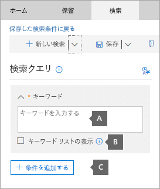
  
1. キーワード、メッセージのプロパティを次のように送受信された日付、またはファイル名など、文書のプロパティ、またはドキュメントが最後に変更された日付を指定できます。**AND**、**または**、**ない**、 **NEAR**、または**ONEAR**などのブール演算子を使用する複雑なクエリを使用することができます。などの機密情報 (社会保障番号) のドキュメント、または外部で共有されているドキュメントの検索で検索することもできます。場合は、[キーワード] ボックスを空白のままにすると、指定されたコンテンツの場所にあるすべてのコンテンツが検索結果に含まれます。 
    
2. それぞれの行のキーワード、[**キーワード] ボックスの一覧を表示する**] チェック ボックスと種類をクリックします。これを行うには、それぞれの行のキーワードが作成される検索クエリで**OR**演算子で接続されています。 
    
    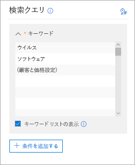
  
    キーワードの一覧を使用する理由各キーワードに一致する数の項目を表示する統計情報を取得できます。どのキーワードは、(と最も少ない) 効果をすばやく識別できます。(かっこで囲まれている) のキーワード句は、行にも使用できます。検索の統計情報の詳細については、[コンテンツの検索結果のキーワードの統計情報を表示](view-keyword-statistics-for-content-search.md)を参照してください。
    
    詳細については、[キーワード] ボックスの一覧を使用して、[検索クエリの作成](content-search.md#building-a-search-query)を参照してください。
    
3. **条件**の下では、検索を絞り込むより洗練された結果セットを返す検索クエリに条件を追加します。各条件は、KQL 検索クエリが作成され、検索を開始するときに実行するに句を追加します。条件の論理的な**AND**演算子によってキーワード クエリ ([キーワード] ボックスで指定) に接続します。キーワード クエリと結果に含まれる条件の両方を満たすために項目があることを意味します。これは、結果を絞り込む条件がどのように役立つか。 
    
    検索クエリの作成方法と条件の使用方法について詳しくは、「[Keyword queries for Content Search](keyword-queries-and-search-conditions.md)」をご覧ください。
    
6. **の場所: 保留中の場所**、検索するコンテンツの場所を選択します。同じ検索では、メールボックス、サイト、およびパブリック フォルダーを検索できます。
    
    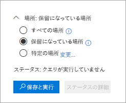
  
  - **すべての場所**に、組織内のすべてのコンテンツの場所を検索するには、このオプションを選択します。このオプションを選択すると選択をすべての Exchange メールボックスを検索する (を含む、メールボックスのすべての Office 365 のグループとマイクロソフトのチーム)、すべての SharePoint と (すべての Office 365 のグループとマイクロソフトのサイトが含まれるビジネス サイトの OneDriveチーム)、およびすべてのパブリック フォルダーです。
    
  - **のすべての場所を保持**- の場合に設定されているすべてのコンテンツの場所を検索するには、このオプションを保持] を選択します。ケースが複数含まれている場合は、コンテンツが格納されて、このオプションを選択するとすべての保留の場所が検索されます。さらに、クエリ ベースの保留中のコンテンツの場所が格納された、保留中のアイテムのみが検索されますこの手順で作成するコンテンツの検索を実行するとします。などの場合ユーザーがクエリに基づく場合保留中の送信または特定の日付より前に作成されたアイテムを保持したまま、コンテンツ検索の検索条件を使用してアイテムのみを検索します。これは、サポート ・ リクエストの保留中のクエリと**AND**演算子によってコンテンツの検索クエリを接続することによって行います。ケースのコンテンツの検索の詳細については、この資料の末尾には、[詳細について](ediscovery-cases.md#moreinfo_1)はを参照してください。 
    
  - **特定の場所**のメールボックスを検索するサイトを選択するには、このオプションを選択します。このオプションを選択して [**変更**] をクリックすると、場所の一覧が表示されます。任意またはすべてのユーザー、グループ、チーム、またはサイトの場所を検索することができます。
    
    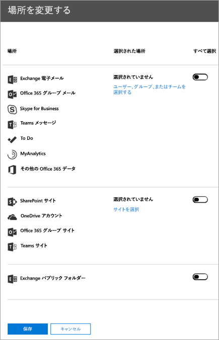
  
    組織内のすべてのパブリック フォルダーの検索が、このオプションを選択し、上にあるコンテンツの場所を検索する場合に選択することもできます、クエリ ベースのケース保留リストからすべてのクエリは、検索クエリには適用されません。つまり、場所のすべてのコンテンツを検索、クエリ ベースのケース保留で保存されているコンテンツだけでなく。
    
    あらかじめ設定されている場合コンテンツの場所を削除するか、新しいものを追加できます。このオプションを選択する場合も (すべての Exchange メールボックスを検索するには) などの特定のサービスのすべてのコンテンツの場所を検索するのには柔軟性がある場合またはサービスの特定のコンテンツの場所を検索することができます。組織でパブリック フォルダーを検索するかどうかを選択できます。
    
    検索するコンテンツの場所を追加する場合、これらの点に注意してください。
    
  - **を選択してくださいユーザー、グループ、またはチーム**を検索するメールボックスを指定する] をクリックすると表示されるメールボックスの選択が空です。これはパフォーマンスを強化するための仕様です。このリストに受信者を追加する**を選択してくださいユーザー、グループ、またはチーム**をクリックして、検索ボックスに名前 (3 文字以上) を入力、名前の横にあるチェック ボックスをオンにし、**選択]** をクリックし、です。 
    
  - 検索するメールボックスの一覧には、非アクティブなメールボックス、Office 365 のグループ、マイクロソフトのチーム、および配布グループを追加できます。動的配布グループはサポートされていません。Office 365 のグループ、またはマイクロソフトのチームを追加する場合、グループまたはチームのメールボックスを検索します。グループのメンバーのメールボックスが検索されません。
    
  - 追加するサイトは、**オプションを指定してサイト**をクリックし、もう一度、[**サイトの選択**] をクリックし、検索する各サイトの URL を入力します。Office 365 のグループとマイクロソフトのチームの SharePoint サイトの URL を追加することもできます。 
    
7. した後は、検索、[**完了**] をクリックし、[**保存**] をクリックしてコンテンツの場所を選択します。
    
8. **新しい検索**ページで、[**保存**] をクリックし、検索の名前を入力します。サポート案件に関連付けられているコンテンツの検索には、Office 365 の組織内で一意な名前を必要があります。 
    
9. クリックして**を保存&amp;実行**検索の設定を保存します。 
    
10. 検索では、一意の名前を入力し、**保存**検索を開始する] をクリックします。 
    
    検索を開始します。しばらくすると、詳細ペインで、検索結果の推定値が表示されます。見積には、検索基準に一致する項目の数と合計サイズが含まれます。検索見積には、検索されたコンテンツの場所のインデックス項目の数も含まれています。検索条件に一致しないインデックスの項目の数は、詳細ペインに表示される検索の統計情報に含まれます。(その他のメッセージまたはドキュメントのプロパティは、検索条件を満たす) ため、検索クエリを実行する項目のインデックスを持たない一致の場合は、インデックスの項目の推定数に含まれません。インデックスを持たないアイテムは、検索条件によって除外されて場合に、もに含まれませんインデックス項目の見積もりです。
    
    検索が完了したら、検索結果をプレビューできます。**更新**] をクリックして、必要に応じての詳細ウィンドウの情報を更新します。 
    
## <a name="step-6-export-the-results-of-a-content-search-associated-with-a-case"></a>手順 6: サポート案件に関連付けられているコンテンツの検索結果をエクスポートします。

検索が正常に実行すると、検索結果をエクスポートできます。検索結果をエクスポートすると、個々 のメッセージまたは PST ファイルにメールボックスのアイテムがダウンロードされます。SharePoint と OneDrive からビジネス サイトのコンテンツをエクスポートすると、ネイティブの Office ドキュメントとその他のドキュメントのコピーがエクスポートされます。すべての検索結果に関する情報を含むマニフェスト ファイル (XML 形式) でもエクスポートされます。
  
[サポート案件に関連付けられている 1 つの検索の結果のエクスポート](ediscovery-cases.md#singlesearch_1)の結果をエクスポートすることができます。 または[サポート案件に関連付けられている複数の検索結果のエクスポート](ediscovery-cases.md#multiplesearches_1)の結果をエクスポートすることができます。
  
### <a name="export-the-results-of-a-single-search-associated-with-a-case"></a>サポート案件に関連付けられている 1 つの検索の結果をエクスポートします。

1. セキュリティ&amp;コンプライアンス センターで、**[検索&amp;調査]** \> **[電子情報開示]** の順にクリックし、組織内のケースの一覧を表示します。 
    
2. 検索をエクスポートする場合の横にある [**開く**] をクリックします。 
    
3. [**ホーム**] ページの場合、[**検索**] をクリックします。
    
4. [大文字と小文字を検索の一覧で、[検索の検索結果のエクスポート] をクリックする] をクリックします**詳細**、およびドロップ ダウン リストから**結果のエクスポート**] を選択します。 
    
    **結果のエクスポート**] ページが表示されます。 
    
    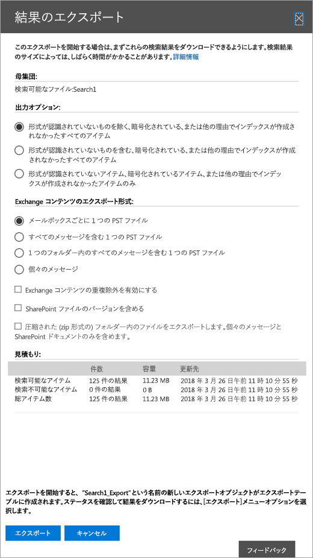
  
    コンテンツの検索結果をエクスポートするのにはワークフローは、**コンテンツの検索**ページの検索の検索結果をエクスポートすると同じを使用する場合に関連付けられています。手順についてを参照してください[エクスポート コンテンツの検索結果を Office 365 のセキュリティ&amp;コンプライアンス センター](export-search-results.md)です。
    
    > [!NOTE]
    > 検索結果をエクスポートするときに重複除外を有効にする場合でも、検索されたメールボックスに同じメッセージの複数のインスタンスが検出された可能性がありますが、電子メール メッセージのコピーを 1 つだけがエクスポートされるようにするオプションがあります。について重複し、重複した項目を識別する詳細については、[電子的証拠開示検索結果内の重複](de-duplication-in-ediscovery-search-results.md)を参照してください。 
  
5. そのケースに存在しているエクスポート ジョブの一覧を表示するのには [**エクスポート**] タブをクリックします。 
    
    ![[エクスポート] タブ](media/1b84c45e-4ec9-4ecd-9e07-eaf8fc4cc307.png)
  
    [**更新**] をクリックする必要がありますだけで作成したエクスポート ジョブが表示されるように、エクスポート ジョブの一覧を更新します。**_Export**検索名の末尾に追加の検索、対応するコンテンツとして同じ名前をエクスポート ジョブがあることに注意してください。 
    
6. 詳細ペインにステータス情報を表示用に作成したエクスポート ジョブをクリックします。この情報には、マイクロソフトのクラウド内の Azure ストレージ領域に転送されたアイテムの割合が含まれています。
    
    すべてのアイテムが転送されると、**結果のダウンロード**の検索結果をローカル コンピューターにダウンロードする] をクリックします。詳細については、手順 2 を参照してください[エクスポート コンテンツの検索結果を Office 365 のセキュリティ&amp;コンプライアンス センター](export-search-results.md)
    
### <a name="export-the-results-of-multiple-searches-associated-with-a-case"></a>サポート案件に関連付けられている複数の検索結果をエクスポートします。

代わりに 1 つのコンテンツ検索の結果をエクスポートするのには、サポート案件に関連付けられていると同じ場合は 1 回のエクスポートで複数の検索の結果をエクスポートできます。高速化と同時に 1 つの結果の検索をエクスポートするよりも簡単には、複数の検索の結果をエクスポートします。
  
> [!NOTE]
> な検索条件のいずれかのケースのすべてのコンテンツを検索するのには構成されている場合は、複数の検索の結果をエクスポートできません。電子的証拠開示のサポート案件に関連付けられている検索のための複数の検索の結果のみをエクスポートします。セキュリティ**コンテンツの検索**ページに記載されている複数の検索結果をエクスポートすることはできません&amp;コンプライアンス センターです。 
  
1. セキュリティ&amp;コンプライアンス センターで、**[検索&amp;調査]** \> **[電子情報開示]** の順にクリックし、組織内のケースの一覧を表示します。 
    
2. 検索結果をエクスポートする場合の横にある [**開く**] をクリックします。 
    
3. [**ホーム**] ページの場合、[**検索**] をクリックします。
    
4. ケースの検索結果の一覧での検索結果をエクスポートする 2 つ以上の検索を選択します。
    
    > [!NOTE]
    > 複数の検索を選択するには、ctrl キーを押し検索] をクリックするとします。または、Shift キーを押しながら、最初の検索] をクリックし、最後の検索] をクリックして隣接する複数の検索を選択することができます。 
  
5. 検索内容を選択すると、**一括操作**のページが表示されます。 
    
    ![バルク アクション] ページで、結果のエクスポートをクリックします。](media/f34e3707-a9c1-494f-91a4-da1165aa730a.png)
  
    
6. クリックして**結果をエクスポート**します。

7. **結果のエクスポート**] ページで、エクスポートに一意な名前を付けて、出力オプションでは、し、コンテンツをエクスポートする方法を選択します。[**エクスポート**] をクリックします。
    
    サポート案件に関連付けられている複数のコンテンツの検索結果をエクスポートするのにはワークフローは、1 つの検索の検索結果のエクスポートと同じです。手順についてを参照してください[エクスポート コンテンツの検索結果を Office 365 のセキュリティ&amp;コンプライアンス センター](export-search-results.md)です。
    
    > [!NOTE]
    > 同じメッセージの複数のインスタンスが検出された可能性がありますがある場合でも、電子メール メッセージのコピーを 1 つだけがエクスポートされるようにする、データ重複除外を有効にするオプションもあるサポート案件に関連付けられている複数の検索から検索結果をエクスポートする場合、1 つ以上の検索で検索されたメールボックス。について重複し、重複した項目を識別する詳細については、[電子的証拠開示検索結果内の重複](de-duplication-in-ediscovery-search-results.md)を参照してください。 
  
8. エクスポートを開始した後は、そのケースに対してエクスポート ジョブの一覧を表示するのには [**エクスポート**] タブをクリックします。 
    
    ![エクスポート] タブで、複数の検索](media/b9505e1b-559f-4a8c-96b3-a3f734753926.png)
  
    [**更新**] をクリックする必要がありますに作成したエクスポート ジョブを表示するのにはエクスポート ジョブの一覧を更新します。エクスポート ジョブに含まれていた検索が [**検索**] 列に表示されていることに注意してください。 
    
8. 詳細ペインにステータス情報を表示用に作成したエクスポート ジョブをクリックします。この情報には、マイクロソフトのクラウド内の Azure ストレージ領域に転送されたアイテムの割合が含まれています。
    
9. すべてのアイテムが転送されると、**結果のダウンロード**の検索結果をローカル コンピューターにダウンロードする] をクリックします。詳細については、手順 2 を参照してください[Office 365 のセキュリティのエクスポートの検索結果を&amp;コンプライアンス センター](export-search-results.md)
    
#### <a name="more-information-about-exporting-the-results-of-multiple-searches"></a>複数の検索の結果のエクスポートの詳細については

- 複数の検索の結果をエクスポートするとき、**または**演算子を使用してすべての検索から検索クエリを結合し、結合の検索を開始し。推定結合された検索の結果は、選択したエクスポート ジョブの詳細ウィンドウに表示されます。検索結果は、マイクロソフトのクラウド内の Azure ストレージ領域に転送されます。転送の状態の詳細ペインにも表示されます。前述したように、すべての検索結果が転送されると、ダウンロードできます、ローカル コンピューターにします。 
    
- エクスポートするすべての検索の検索クエリのキーワードの最大数は 500 です。これは、1 つのコンテンツ検索用のと同じ制限)。エクスポート ジョブ、**または**演算子を使用してすべての検索クエリを結合するためです。この制限を超えると、エラーが戻されます。この例では、検索も少なくて済むから結果をエクスポートまたはエクスポートする検索の検索クエリを簡略化する必要があります。 
    
- エクスポートした検索結果は、コンテンツ ソースのアイテムが見つかりましたが整理されます。つまり、エクスポートの結果でのコンテンツ ソース別の検索によって返される項目があります。たとえば、メールボックスごとに 1 つの PST ファイルに電子メール メッセージをエクスポートする場合は、PST ファイルは複数の検索の結果があります。
    
- エクスポートする検索結果の 1 つ以上同じの電子メール アイテムまたはコンテンツの同じ場所からドキュメントが返される場合は、アイテムのコピーを 1 つだけがエクスポートされます。
    
- 作成後は、複数の検索のエクスポートを編集できません。たとえば、追加または検索をエクスポートから削除できません。検索結果のエクスポートを変更するのには、新しいエクスポート ジョブを作成する必要があります。エクスポート ジョブが作成されると、のみ、結果をコンピューターにダウンロード、エクスポートを再起動したりエクスポート ジョブを削除します。
    
- エクスポートを再起動すると、エクスポート ジョブを構成する検索のクエリへの変更が抽出される検索結果に影響しません。再起動すると、エクスポート、エクスポート ジョブが作成されたときに実行されたジョブの同じ組み合わせの検索クエリが再び実行されます。
    
- 電子的証拠開示の場合、[**エクスポート**] ページからのエクスポートを再起動すると、Azure のストレージ領域に移動する検索結果は、前回の結果を上書きあった以前の結果をダウンロードする利用可能な転送はできません。 
    
- 高度な電子的証拠開示の分析のための複数の検索の結果を準備するは使用できません。分析のために高度な電子的証拠開示の 1 つの検索の結果のみを準備できます。

## <a name="step-7-prepare-search-results-for-advanced-ediscovery"></a>手順 7: 準備する高度な電子的証拠開示の検索結果

組織に、Office 365 の E5 のサブスクリプションがある場合は、分析のために高度な電子的証拠開示のサポート案件に関連付けられているコンテンツの検索結果を準備できます。検索結果を準備した後は、高度な電子的証拠開示に移動することができます (を参照してください[手順 8: 高度な電子的証拠開示の場合に、](#step-8-go-to-the-case-in-advanced-ediscovery)) と高度な電子的証拠開示の詳細な分析の検索結果のデータを処理します。
  
高度な電子的証拠開示の検索結果を準備すると、光学式文字認識 (OCR) 機能は自動的に画像からテキストを抽出します。OCR は、圧縮しないファイルではサポートされて、電子メールの添付ファイルと、イメージが埋め込まれています。これにより、イメージ ファイル内の任意のテキストを (重複の近くに、電子メールのスレッド、テーマ、および予測のコーディング) 高度な電子的証拠開示のテキストの分析機能を適用することができます。
  
> [!NOTE]
> 高度な電子的証拠開示を使用してユーザーのデータを分析するには、ユーザー (データの保管担当者) 割り当てる必要があります、Office 365 の E5 のライセンスです。または、Office 365 の E1 または E3 のライセンスを持つユーザーが高度な電子的証拠開示のスタンドアロン ライセンスを割り当てることができます。管理者およびコンプライアンス担当者の場合に割り当てられ、データを分析する高度な電子的証拠開示を使用している E5 のライセンスは不要です。 
  
1. セキュリティ&amp;コンプライアンス センターで、**[検索&amp;調査]** \> **[電子情報開示]** の順にクリックし、組織内のケースの一覧を表示します。 
    
2. 分析のために高度な電子的証拠開示検索結果を準備する場合の横にある [**開く**] をクリックします。 
    
3. [**ホーム**] ページの場合、**検索**] をクリックし、検索を選択し、します。
    
4. 詳細ペインでをクリックして**詳細**、**高度な電子的証拠開示の準備**をしをクリックします。
    
    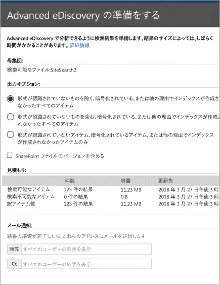
  
5. [**高度な電子的証拠開示の準備**] ページで、次のいずれかを準備するのにを選択します。 
    
    - 認識できない形式のものを除いて、すべてのアイテムが暗号化されているか、他の理由によりインデックスが作成されませんでした。
    
    - 形式を認識できないものも含めて、すべてのアイテムが暗号化されているか、他の理由によりインデックスが作成されませんでした。
    
    - 、認識できない形式を持っているアイテムのみが暗号化されているか、他の理由によりインデックスが作成されませんでした。
    
6. (省略可能)**SharePoint ファイルのバージョンを含める**] チェック ボックスをクリックします。 
    
7. **[準備]** をクリックします。
    
    検索結果の分析と高度な電子的証拠開示の準備ができます。
    
8. 詳細ウィンドウを閉じます**閉じる**をクリックします。 
    
## <a name="step-8-go-to-the-case-in-advanced-ediscovery"></a>高度な電子的証拠開示の場合に、手順 8。

セキュリティでサポート案件を作成した後&amp;コンプライアンス センターでは、高度な電子的証拠開示で同じ大文字と小文字に移動することができます。
  
Advanced eDiscovery のケースに移動するには、以下を実施します:
  
1. セキュリティ&amp;コンプライアンス センターで、**[検索&amp;調査]** \> **[電子情報開示]** の順にクリックし、組織内のケースの一覧を表示します。 
    
2. 高度な電子的証拠開示に移動する場合の横にある [**開く**] をクリックします。 
    
3. [**ホーム**] ページの場合、**高度な電子的証拠開示に切り替える**] をクリックします。
    
    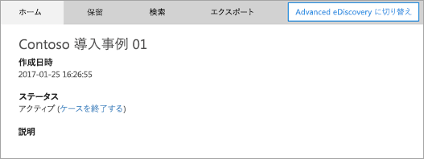
  
    **高度な電子的証拠開示への接続**の進行状況バーが表示されます。高度な電子的証拠開示に接続しているときにページ上のコンテナーの一覧が表示されます。 
    
    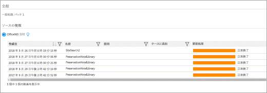
  
    これらのコンテナーでは、手順 7 には、[高度な電子的証拠開示の分析のために準備した検索結果を表します。コンテナーの名前が、セキュリティの場合はコンテンツの検索と同じ名前を持って注&amp;コンプライアンス センターです。コンテナー、ボックスの一覧では、準備したものです。さまざまなユーザーが検索結果を高度な電子的証拠開示に備える、対応するコンテナーが一覧に含まれません。
    
4. コンテナーから検索結果のデータを読み込むには高度な電子的証拠開示の場合に、コンテナーを選択して [**プロセス**] をクリックします。
    
    コンテナーを処理する方法の詳細については、[プロセス モジュールを実行し Office 365 の高度な電子的証拠の開示にデータを読み込む](run-the-process-module-and-load-data-in-advanced-ediscovery.md)を参照してください。
    
> [!TIP]
> セキュリティで同じケースに戻るには、**電子的証拠開示への切り替え**をクリックして&amp;コンプライアンス センターです。 
  
## <a name="optional-step-9-close-a-case"></a>(省略可能)手順 9: サポート案件をクローズします。

訴訟事件や、電子的証拠開示の場合でサポートされている調査が完了すると、ケースを閉じることができます。サポート案件をクローズするときの動作を以下に示します。
  
- 場合に、保留中のすべてのコンテンツの場所が含まれている場合、これらの保留はオフにします。これは、可能性がありますコンテンツが完全に削除または削除されたユーザーまたは削除ポリシーなど、自動化されたプロセスのいずれか。
    
- サポート案件のみを閉じると、そのサポート案件に関連付けられている保留リスト無効になります。他の保留リストは、(など、訴訟ホールドします。 保存ポリシーやさまざまな電子的証拠開示のケースからの保留中) のコンテンツの場所でそれらを保持も保持されます。
    
- セキュリティで電子的証拠開示のページで、大文字と小文字が表示されて&amp;コンプライアンス センターです。詳細情報、保留リスト、検索、およびクローズされたサポート案件のメンバーが保持されます。
    
- 閉じられた後、サポート案件を編集できます。追加するなど、メンバーを削除するには、検索を作成、検索結果をエクスポートし、分析のために高度な電子的証拠開示検索結果を準備します。アクティブおよび終了した場合の主な違いは、ケースを終了するときに、保留リストがオフになってことです。
    
ケースを閉じます。
  
1. セキュリティ&amp;コンプライアンス センターで、**[検索&amp;調査]** \> **[電子情報開示]** の順にクリックし、組織内のケースの一覧を表示します。 
    
2. サポート案件をクローズするの名前をクリックします。
    
    フライアウトの**このサポート案件の管理**] ページが表示されます。 
    
3. [**ケースの状態の管理**] をクリックして![、[プレビュー] ボタンを削除する](media/b6512677-5e7b-42b0-a8a3-3be1d7fa23ee.gif)**ケースのクローズ**します。
    
    サポート案件に関連付けられている保留リストがオフにすることを示す警告が表示されます。
    
4. **はい**ケースを閉じるをクリックします。 
    
    フライアウトの**このサポート案件の管理**] ページのステータスは**アクティブ**から**終了します**。
    
5. **このサポート案件の管理**] ページを閉じます。 
    
6. **電子的証拠開示**ページをクリックして**更新**を終了した場合のステータスを更新します。終了処理が完了するには、最大で 60 分かかる場合があります。 
    
    プロセスが完了すると、ケースの状態は、**電子的証拠開示**のページで、**終了**に変更されます。もう一度ページを表示する、**このサポート案件の管理**フライアウト、ケースを終了したときの情報が含まれている場合、それを終了したの名前をクリックします。 
     
## <a name="optional-step-10-re-open-a-closed-case"></a>(省略可能)手順 10: がクローズされたサポート案件を再度開く

サポート案件を開くときにケースを終了したときで用意されていたすべての保留リストを自動的に回復しません。大文字と小文字が再度開くと後、は、**保持**のページに移動し、前の保留を有効にする必要があります。を有効にする保留リストを選択し、詳細ペインで**を有効にする**] をクリックします。 
  
1. セキュリティ&amp;コンプライアンス センターで、**[検索&amp;調査]** \> **[電子情報開示]** の順にクリックし、組織内のケースの一覧を表示します。 
    
2. 再度開くには大文字と小文字の名前をクリックします。
    
    フライアウトの**このサポート案件の管理**] ページが表示されます。 
    
3. **ケースの状態を管理**するには、[**大文字と小文字を再度開く**をクリックします。
    
    閉じたときに、サポート案件に関連付けられている保留リストを自動的にオンしないことを示す警告が表示されます。
    
4. **はい**大文字と小文字を再度開くには] をクリックします。 
    
    フライアウトの**このサポート案件の管理**] ページの状態は**終了**から**アクティブ**に変更されます。
    
5. **このサポート案件の管理**] ページを閉じます。 
    
6. **電子的証拠開示**] ページで、をクリックして**更新**が再開されたケースのステータスを更新します。Reopening 処理が完了するには、最大で 60 分かかる場合があります。 
    
    プロセスが完了すると、ケースの状態は、**電子的証拠開示**のページで、**アクティブ**に変更されます。 
  
## <a name="more-information"></a>More information

- **電子的証拠開示の場合、または電子的証拠開示のサポート案件に関連付けられている保留リストのすべての制限ではありますか?** 次の表は、電子的証拠開示のサポート案件とサポート ・ リクエストの保留の制限を示します。
    
  |**制限の説明**|**制限**|
  |:-----|:-----|
  |組織のケースの最大数  <br/> |無制限  <br/> |
  |ケースの最大数を保持する組織の  <br/> |10,000  <br/> |
  |1 つのケース内のメールボックスの最大数を保持します。  <br/> |1,000  <br/> |
  |SharePoint および OneDrive の 1 つのケースでのビジネス サイトの最大数を保持します。  <br/> |100  <br/> |
   
- **高度な電子的証拠開示で、サポート案件の管理] ページで作成された場合はどうですか?** セキュリティで**電子的証拠開示**のページの下部にあるリンクをクリックして以前の高度な電子的証拠開示のサポート案件の一覧にアクセスすることができます&amp;コンプライアンス センターです。ただし、Office 365 サポートに問い合わせるし、大文字と小文字がセキュリティの新しい電子的証拠開示ケースに移動することを要求するが、古い場合は、すべての作業には、&amp;コンプライアンス センターです。 
    
- **電子的証拠開示管理者を作成する理由ですか?** 前に、管理者は、表示し、組織のすべての電子的証拠開示の場合にアクセスする電子的証拠開示マネージャーの役割グループのメンバーを電子情報開示を説明します。すべての電子的証拠開示の場合にアクセスするには、この機能には、2 つの重要な目的があります。
    
  - メンバーではありませんので (組織の管理役割グループのメンバーまたは電子的証拠開示マネージャーの役割グループの他のメンバーを含む)、誰もの場合は、電子的証拠開示の場合の唯一のメンバーである人が退職、電子的証拠開示の場合はそのアクセスします。場合です。この状況でなかったでしょう、ケース内のデータにアクセスする方法です。セキュリティでサポート案件を表示するには電子的証拠開示管理者が組織内のすべての電子的証拠開示ケースにアクセスできるため、&amp;コンプライアンス センター ケースのメンバーとして自分自身または他の電子的証拠開示マネージャーを追加するとします。
    
  - 電子的証拠開示管理者では、表示でき、すべての電子的証拠開示の場合にアクセスすることためを監査し、すべてのケースと関連付けられているコンテンツの検索を監視することができます。これはコンテンツの検索や電子的証拠開示のサポート案件のすべての悪用を避けるために役立ちます。および電子的証拠開示の管理者がコンテンツの検索結果内の機密情報にアクセスできるため、電子的証拠開示の管理者はユーザーの数を制限する必要があります。
    
    最後に、前に説明すると、電子的証拠開示、セキュリティ管理者&amp;コンプライアンス センターは、高度な電子的証拠開示で管理者として自動的に追加します。つまり、電子的証拠開示管理者は、ユーザーがユーザーを設定する場合を作成するの場合にデータを追加するなどの高度な電子情報開示の管理タスクを実行できます。
    
- **コンテンツの場所を保留リストに配置するのにはライセンス契約の要件は何ですか?** 組織が、Office 365 の E3 サブスクリプションを必要とする一般に、または保留中のコンテンツの場所に配置するのにはそれ以上です。保留中のメールボックスを配置するのには、Exchange オンライン計画 2 ライセンスが必要保留リストに配置するメールボックスの。
    
- **その他必要な知識について、手順 5 で大文字のすべてのコンテンツを検索しますか?** 説明したようには、大文字と小文字の保持が設定されているコンテンツの場所を検索できます。これを行うと、保留中の検索条件に一致するコンテンツのみ、検索です。保留基準がない場合は、すべてのコンテンツが検索されます。内容は、クエリ ベースの場合は、両方の一致の抽出条件 (手順 4 に配置する保留中) が含まれているコンテンツのみを保持します。. (手順 5 での検索) の検索条件は、検索結果と共に返されます。
    
    その他のケースのすべてのコンテンツを検索するときに留意する点を以下に示します。
    
  - コンテンツの場所が同じケースに複数の保留リストの一部である場合は、保留中のクエリは、すべてのケースのコンテンツ オプションを使用してそのコンテンツの場所を検索すると、**または**オペレーターが結合されます。同様に、コンテンツの場所が 2 つの一部である場合別を保持する、1 つは、クエリ ベースで、もう一方 (すべてのコンテンツは保留中の配置) 無限の保留、無限の保留中のためのすべてのコンテンツが検索を行う。 
    
  - コンテンツの検索では、ケースのケースのすべてのコンテンツを検索するように設定されているし、(追加や削除、コンテンツの場所、保留中のクエリを変更する)、保留リストを変更するし、それらの変更、検索の構成が更新されます。ただし、検索結果を更新するのには、保留リストが変更された後に、検索を再実行するのにはあります。
    
  - ケースの複数の保留リストは、電子的証拠開示の場合も、コンテンツの場所に配置されます、サポート ・ リクエストのすべてのコンテンツを検索するを選択する場合は、検索クエリのキーワードの最大数は 500 になります。コンテンツの検索、**または**演算子を使用してクエリ ベースのすべての保留を結合するためです。複合で 500 個以上のキーワード クエリとコンテンツの検索クエリを保持する場合は、メールボックス内のすべてのコンテンツは、検索、クエリ ベースのケースのいずれかに一致するコンテンツだけではなくを保持します。 
    
  - サポート ・ リクエストの保留中の状態**を**有効にする場合は、保留されている電源を入れたまま、ケースのコンテンツの場所も検索できます。
    
  - 述べたように、複数の検索の結果をエクスポートする場合、その検索を含めることはできませんし、検索が大文字のすべてのコンテンツを検索するのには構成されている場合。ケースのすべてのコンテンツを検索する検索を構成する場合する必要がありますその 1 つの検索の結果をエクスポートします。
    
- **メールボックス、SharePoint サイト、または保留中である OneDrive のアカウントを複数地域で別の地域に移動すると、保留リストが適用されますか?** すべての場合、メールボックス、サイト、または OneDrive のアカウント内のコンテンツが保持されます。ただし、保留中の統計情報では、別の領域に移動されているコンテンツの場所の項目が含まれなくなります。移動されているコンテンツの場所の保留中の統計情報を含めるには、保留リストを編集し、URL を更新する必要があります (または、メールボックスの SMTP アドレス) コンテンツの場所がもう一度保留中の統計情報に含まれるようにします。 
    
- **Office 365 のグループとマイクロソフトのチームの保留リストを配置することについてですか?** Office 365 コミュニティでは、マイクロソフトのチームがビルドされます。したがって、電子的証拠開示の場合は、保留リストに配置することは非常に似ています。Office 365 のグループとマイクロソフトのチームでの配置を保持すると、次の点に注意してください。 
    
  - 保留中の Office 365 のグループとマイクロソフトのチームで配置されているコンテンツを配置するには、メールボックスを指定する必要がし、グループまたはチームに関連付けられている SharePoint サイトです。
    
  - Office 365 のグループまたはマイクロソフト チームのプロパティを表示するのには Exchange Online では、 **Get UnifiedGroup**コマンドレットを実行します。これは、Office 365 グループまたはマイクロソフト チームに関連付けられているサイトの URL を取得するのには良い方法です。たとえば、次のコマンドでは、Office 365 グループ シニア ・ リーダーシップ ・ チームをという名前の選択したプロパティが表示されます。 
    
     ```
    Get-UnifiedGroup "Senior Leadership Team" | FL DisplayName,Alias,PrimarySmtpAddress,SharePointSiteUrl

     DisplayName            : Senior Leadership Team
     Alias                  : seniorleadershipteam
     PrimarySmtpAddress     : seniorleadershipteam@contoso.onmicrosoft.com
     SharePointSiteUrl      : https://contoso.sharepoint.com/sites/seniorleadershipteam
    ```

    > [!NOTE]
    > **Get UnifiedGroup**コマンドレットを実行するには、受信者の参照の役割を割り当てるには、Exchange オンラインする必要がある、または役割グループのメンバーであること役割が割り当て参照受信者です。 
  
  - ユーザーのメールボックスが検索されると、任意の Office 365 のグループまたはユーザーがのメンバーであるマイクロソフト チームは検索されません。同様に、Office 365 グループを配置すると、メールボックスのグループとグループのサイトは、マイクロソフトのチームが保持を保持します。メールボックスおよびグループのメンバーのビジネス サイトの OneDrive は、保留リストに明示的に追加しない限り、保留中の配置されていません。したがって、ビジネス サイトの同じグループとチームのメンバーのメールボックスおよび OneDrive の追加を考慮に、Office 365 のグループまたはマイクロソフトのチームを配置する必要があるが法的な理由から保持する場合を保持します。
    
  - Office 365 のグループまたはマイクロソフトのチームのメンバーの一覧を取得するには、プロパティを表示することができます、**ホーム\>グループ**Office 365 管理センターのページです。または、Exchange オンライン PowerShell で次のコマンドを実行できます。 
    
      ```
      Get-UnifiedGroupLinks <group or team name> -LinkType Members | FL DisplayName,PrimarySmtpAddress 
      ```

    > [!NOTE]
    > **Get UnifiedGroupLinks**コマンドレットを実行するには、受信者の参照の役割を割り当てるには、Exchange オンラインする必要がある、または役割グループのメンバーであること役割が割り当て参照受信者です。 
  
  - マイクロソフト チームのチャネルの一部である会話は、マイクロソフトのチームに関連付けられているメールボックスに格納されます。同様に、チーム メンバーがチャネルで共有するファイルは、チームの SharePoint サイトに格納されます。したがって、マイクロソフト チームのメールボックスを配置する必要がある、上の SharePoint サイトの会話と、チャネル内のファイルを保持するします。
    
    代わりに、マイクロソフトのチームの [チャット] ボックスの一覧の一部である会話は、ユーザーのチャットに参加しているメールボックスに格納されます。ファイルを共有しているユーザーのビジネス サイトの OneDrive のユーザーがチャットで会話を共有するファイルが格納されます。したがって、個々 のユーザーのメールボックスを配置する必要があるし、会話し、[チャット] ボックスの一覧内のファイルを保持するビジネス上のサイトの OneDrive を保持します。理由は保留中ではチームのメールボックス (およびサイト) に配置するだけでなく、マイクロソフト チームのメンバーのメールボックスは、[保留リストに配置することをお勧めします。
    
    > [!IMPORTANT]
    > マイクロソフト チームの [チャット] ボックスの一覧に含まれている会話に参加するユーザーには、電子的証拠開示の保留中のメールボックスが配置されると、チャットの会話を保持するために Exchange のオンラインの (クラウド ・ ベース) のメールボックスが必要です。チャットに参加して、クラウド ベースのメールボックスで、[チャット] ボックスの一覧の一部である会話が保存されるためです。チャットの参加者には、Exchange Online のメールボックスが割り当てられていない、チャットの会話を保持することはできません。たとえば、Exchange ハイブリッド展開の場合は、オンプレミスのメールボックスを持つユーザーありますマイクロソフト チームの [チャット] ボックスの一覧に含まれている会話に参加すること。ただしここでは、これらの会話からコンテンツことはできません保持、ユーザーがクラウド ベースのメールボックスを持っていないため。 
  
  - マイクロソフト チームまたはチームのすべてのチャネルには、ノートとのコラボレーションの Wiki が含まれています。Wiki のコンテンツは自動的に .mht 形式のファイルに保存されます。このファイルは、チームの SharePoint サイトの Wiki のデータをチームのドキュメント ライブラリに格納されます。保留中の Wiki にコンテンツを配置するには、保留中のチームの SharePoint サイトに配置します。
    
    > [!NOTE]
    > (保留中のチームの SharePoint サイトを配置する) 場合は、マイクロソフトのチームまたはチームのチャネルの Wiki のコンテンツを保持する機能は、2017 年 6 月 22 日にリリースされました。チーム サイトが上にある場合を保持、Wiki の内容はその日付に保持されます。ただし、保留中のチーム サイトがあり、2017 年 6 月 22日、Wiki のコンテンツは削除された場合、Wiki のコンテンツは保持されません。 
  
- **OneDrive のビジネス サイトの URL を表示しますか?** 保留リストに追加したり検索したりすることができますので、組織内のビジネス サイトは、電子的証拠開示のサポート案件に関連付けられている[組織内のすべての OneDrive 場所のリストの作成](https://support.office.com/article/8e200cb2-c768-49cb-88ec-53493e8ad80a)を参照してください、OneDrive の Url の一覧を収集します。この資料では、このスクリプトは、OneDrive のすべてのサイトの一覧を含むテキスト ファイルを作成します。このスクリプトを実行するをインストールして、SharePoint のオンライン管理シェルを使用する必要があります。OneDrive サイトを検索するごとに、組織の個人用サイトのドメインの URL を追加することを確認します。これは、すべての OneDrive が含まれるドメインは、します。たとえば、 `https://contoso-my.sharepoint.com`。ユーザーの OneDrive のサイトの URL の例を次のとおりです: `https://contoso-my.sharepoint.com/personal/sarad_contoso_onmicrosoft.com`。
