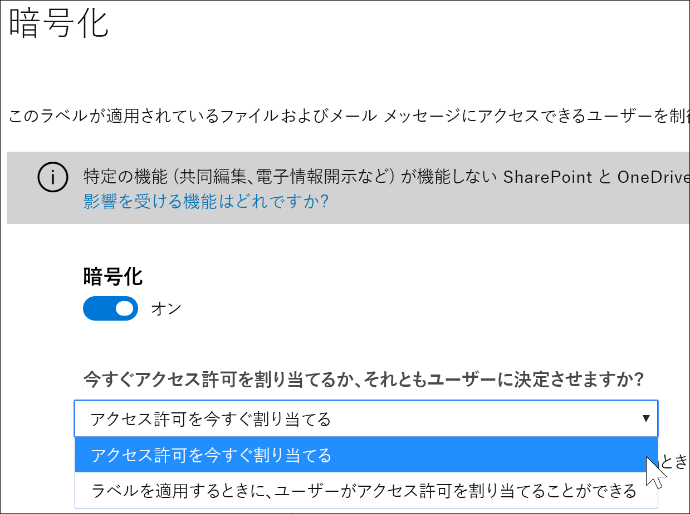
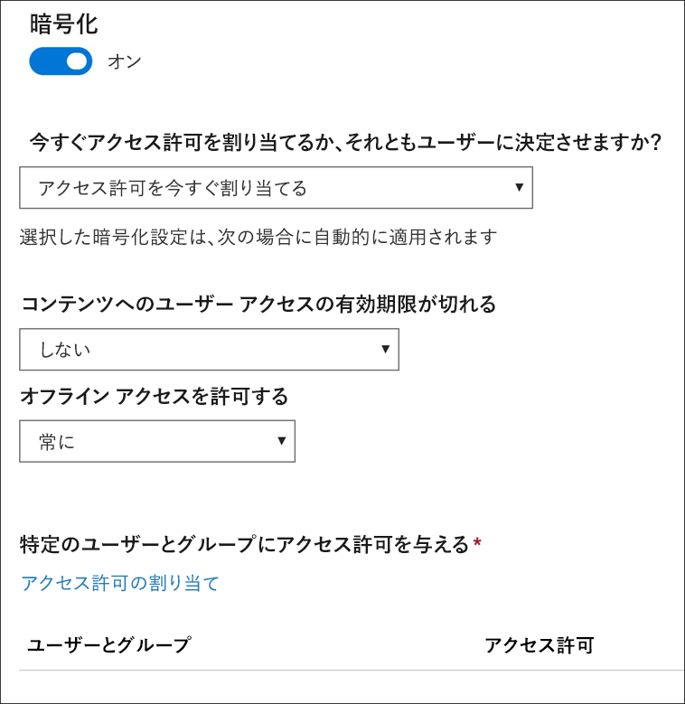
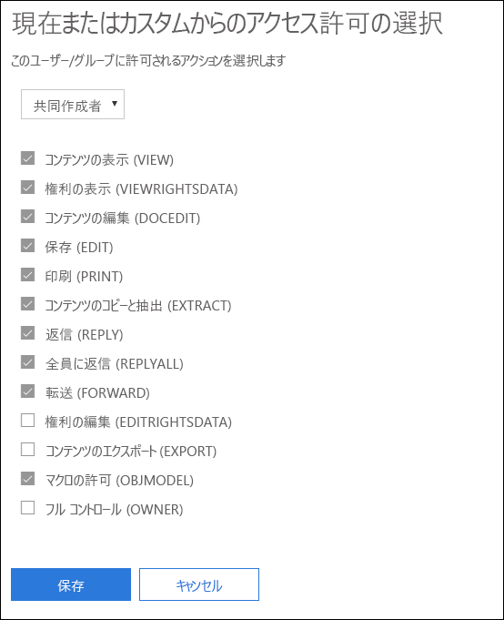
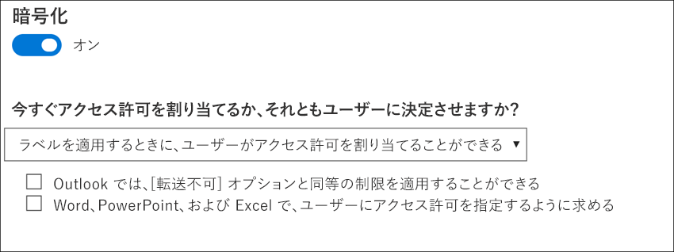
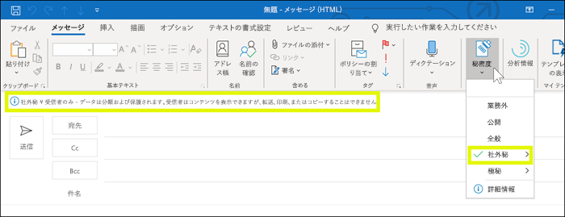
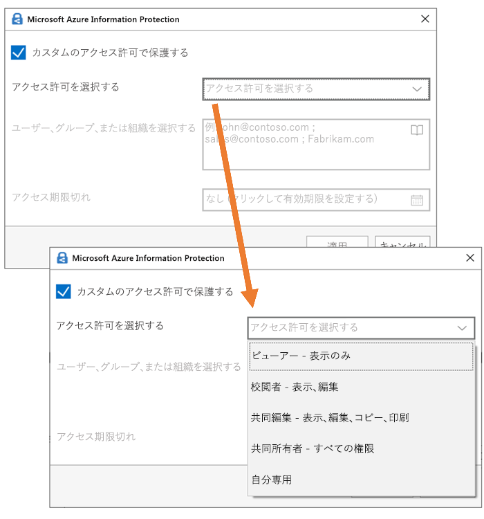

# 機密ラベルの暗号化を使用してコンテンツへのアクセスを制限するRestrict access to content by using encryption in sensitivity labels

機密ラベルを作成するときに、そのラベルが適用されるコンテンツへのアクセスを制限できます。たとえば、機密ラベルに対応する暗号化の設定によって、次のようにコンテンツを保護できます。When you create a sensitivity label, you can restrict access to content that the label will be applied to. For example, with the encryption settings for a sensitivity label, you can protect content so that:

- 組織内のユーザーのみが機密ドキュメントや電子メールを開けるようにする。Only users within your organization can open a confidential document or email.
- 宣伝広告用のドキュメントや電子メールは、マーケティング部門のユーザーのみが編集および印刷できるようにして、その他の組織内のユーザーは閲覧のみできるようにする。Only users in the marketing department can edit and print the promotion announcement document or email, while all other users in your organization can only read it.
- 内部の再編成に関するニュースが含まれている電子メールは、ユーザーが転送や情報のコピーをできないようにする。Users cannot forward an email or copy information from it that contains news about an internal reorganization.
- ビジネス パートナーに送信する現行の価格リストは、指定した日付以降は開けないようにする。The current price list that is sent to business partners cannot be opened after a specified date.

ドキュメントや電子メールを暗号化するときには、次のようにしてコンテンツへのアクセスが制限されます。When a document or email is encrypted, access to the content is restricted, so that it:

- 暗号化の解除は、ラベルの暗号化設定で許可されているユーザーのみが可能です。Can be decrypted only by users authorized by the label’s encryption settings.
- 暗号化は、ファイルの場所 (組織内外) を問わず、ファイル名が変更されていても維持されます。Remains encrypted no matter where it resides, inside or outside your organization, even if the file’s renamed.
- 保存中 (OneDrive アカウントなど) と転送中 (送信中の電子メールなど) の両方で暗号化されています。Is encrypted both at rest (for example, in a OneDrive account) and in transit (for example, a sent email).

最後に、管理者として、秘密度ラベルを作成するときに、次のいずれかを選択できます。Finally, as an admin, when you create a sensitivity label, you can choose either to:

- **アクセス許可を割り当てます**。これにより、どのユーザーがそのラベルのコンテンツにどのアクセス許可を取得するかを正確に決定します。**Assign permissions now**, so that you determine exactly which users get which permissions to content with that label.
- ラベルをコンテンツに適用するときに、**ユーザーがアクセス許可を割り当てる**ことができます。**Let users assign permissions** when they apply the label to content. このようにして、組織内のユーザーに、共同作業を行って作業を完了するために必要な柔軟性を与えることができます。This way, you can allow people in your organization some flexibility that they might need to collaborate and get their work done.

暗号化の設定は、Microsoft 365 コンプライアンス センター、Microsoft 365 セキュリティ センター、または Office 365 セキュリティ/コンプライアンス センターで機密ラベルを作成するときに使用できます。The encryption settings are available when you create a sensitivity label in the Microsoft 365 compliance center, Microsoft 365 security center, or Office 365 Security & Compliance Center. 左側のナビゲーションで、[**分類**]  >  [**秘密度ラベル**]  >  [**ラベルの作成**] の順に選択します。In the left nav, choose **Classification** > **Sensitivity label** > **Create a label**.

## 暗号化のしくみHow encryption works

暗号化には、Azure Rights Management (Azure RMS) を使用します。Azure RMS は、暗号化ポリシー、ID ポリシー、および認証ポリシーを使用します。詳細については、「[Azure Rights Management とは](https://docs.microsoft.com/ja-JP/azure/information-protection/what-is-azure-rms)」を参照してください。Encryption uses Azure Rights Management (Azure RMS). Azure RMS uses encryption, identity, and authorization policies. To learn more, see [What is Azure Rights Management?](https://docs.microsoft.com/ja-JP/azure/information-protection/what-is-azure-rms)

## 機密ラベルに対する暗号化を有効にする方法How to turn on encryption for a sensitivity label

開始するには、単に [**暗号化**] を [**オン**] に切り替えてから、次のいずれかを選択します。To begin, simply toggle **Encryption** to **On**, and then choose whether to:

- **アクセス許可を割り当てます**。これにより、どのユーザーがそのラベルのコンテンツにどのアクセス許可を取得するかを正確に決定することができます。**Assign permissions now**, so that you can determine exactly which users get which permissions to content with that label. 詳細については、次のセクション「[アクセス許可を割り当てる](#assign-permissions-now)」を参照してください。For more information, see the next section.
- ラベルをコンテンツに適用するときに、**ユーザーがアクセス許可を割り当てる**ことができます。**Let users assign permissions** when they apply the label to content. このようにして、組織内のユーザーに、共同作業を行って作業を完了するために必要な柔軟性を与えることができます。This way, you can allow people in your organization some flexibility that they might need to collaborate and get their work done. 詳細については、次のセクション「[ユーザーがアクセス許可を割り当てる](#let-users-assign-permissions)」を参照してください。For more information, see the below section [Let users assign permissions](#let-users-assign-permissions).

たとえば、最も機密性の高いコンテンツに適用される**極秘**という名前の秘密度ラベルがある場合、誰がそのコンテンツに対してどのタイプのアクセス許可を取得するかを決定することができます。For example, if you have a sensitivity label named **Highly Confidential** that will be applied to your most sensitive content, you may want to decide now who gets what type of permissions to that content.

あるいは、**業務契約**という名前の秘密度ラベルがあり、組織のワークフローで従業員がこのコンテンツでアドホック ベースで異なるユーザーと共同作業する必要がある場合、ラベルを割り当てるときに従業員にアクセス許可を与えるユーザーを決定できるようにすることができます。Alternatively, if you have a sensitivity label named **Business Contracts**, and your organization's workflow requires that your people collaborate on this content with different people on an ad hoc basis, you may want to allow your users to decide who gets permissions when they assign the label. この柔軟性により、ユーザーの生産性が向上し、特定のシナリオに対処するために管理者に新しい機密度ラベルを更新または作成を要求することを減らすことができます。This flexibility both helps your users' productivity and reduces the requests for your admins to update or create new sensitivity labels to address specific scenarios.

## アクセス許可を割り当てるAssign permissions now

以下のオプションを使用して、このラベルが適用される電子メールやドキュメントにアクセスできるユーザーを制御します。To begin, simply toggle Encryption to On, and then use the options below to control who can access email or documents to which this label is applied. You can: 次の操作を実行できます:You can:

1. **電子メールとドキュメントの両方、または電子メールにのみ暗号化を適用します。** 電子メールのみを選択すると、このラベルが付いたメッセージは Outlook で暗号化されますが、このラベルが付いたドキュメントは他のアプリ (Word や PowerPoint など) では暗号化されません。**Apply encryption to both email and documents, or just email.** If you choose just email, messages with this label will be encrypted in Outlook, but documents with this label won't be encrypted in other apps, such as Word or PowerPoint. 
2. **ラベル付けされたコンテンツへのアクセスに有効期限を設定します。** 指定の日付または指定の日数 (ラベル適用後の経過日数) で有効期限が切れます。この期限が切れると、ユーザーはラベル付きのアイテムを開けなくなります。日付を指定すると、現在のタイム ゾーンでその日付の午前 0 時まで有効になります (一部のメール クライアントでは、キャッシュ メカニズムがあるため、有効期限が適用されず、有効期限を過ぎたメールが表示されることがある点に注意してください)。**Allow access to labeled content to expire**, either on a specific date or after a specific number of days after the label is applied. After this time, users won’t be able to open the labeled item. If you specify a date, it is effective midnight on that date in your current time zone. (Note that some email clients may not enforce expiration and show emails past their expiration date, due to their caching mechanisms.)
3. **オフライン アクセス**を禁止、常に許可、または指定の日数 (ラベル適用後の経過日数) で許可します。オフライン アクセスを禁止または日数で制限すると、そのしきい値に達したときに、ユーザーは再認証される必要があり、ユーザーのアクセスがログに記録されます。詳細については、Rights Management 使用ライセンスに関する次のセクションを参照してください。**Allow offline access** never, always, or for a specific number of days after the label is applied. If you restrict offline access to never or a number of days, when that threshold is reached, users must be reauthenticated and their access is logged. For more information, see the next section on the Rights Management use license.

### オフライン アクセスのための Rights Management 使用ライセンスRights Management use license for offline access

ユーザーが機密ラベルで保護されているドキュメントや電子メールをオフラインで開くと、そのコンテンツの Azure Rights Management 使用ライセンスがユーザーに付与されます。この使用ライセンスは、ドキュメントまたは電子メールに対するユーザーの使用権とコンテンツの暗号化に使用された暗号化キーが含まれている証明書です。この使用ライセンスには、有効期限日 (設定されている場合) と使用ライセンスの有効期間も含まれています。When a user opens a document or email offline that’s been protected by a sensitivity label, an Azure Rights Management use license for that content is granted to the user. This use license is a certificate that contains the user's usage rights for the document or email, and the encryption key that was used to encrypt the content. The use license also contains an expiration date if this has been set, and how long the use license is valid.

有効期限日が設定されていない場合、テナントに対する使用ライセンスの既定の有効期間は 30 日間です。使用ライセンスの有効期間中は、そのコンテンツに対してユーザーが再認証または再承認されることはありません。これにより、ユーザーは保護されたドキュメントまたは電子メールをインターネット接続なしで継続して開くことができます。使用ライセンスの有効期間が切れると、保護されたドキュメントまたは電子メールの次回のユーザー アクセス時に、ユーザーの再認証または再承認が必要になります。If no expiration date has been set, the default use license validity period for a tenant is 30 days. For the duration of the use license, the user is not reauthenticated or reauthorized for the content. This lets the user continue to open the protected document or email without an Internet connection. When the use license validity period expires, the next time the user accesses the protected document or email, the user must be reauthenticated and reauthorized.

再認証だけでなく、ポリシーとユーザー グループ メンバーシップの再評価も実行されます。そのため、ユーザーが最後にコンテンツにアクセスした後でポリシーやグループ メンバーシップに変更が加えられていると、同じドキュメントや電子メールに対して異なるアクセス結果がユーザーに示されることがあります。In addition to reauthentication, the policy and user group membership is reevaluated. This means that users could experience different access results for the same document or email if there are changes in the policy or group membership from when they last accessed the content.

既定の 30 日の設定を変更する方法については、「[Rights Management 使用ライセンス](https://docs.microsoft.com/ja-JP/azure/information-protection/configure-usage-rights#rights-management-use-license)」を参照してください。To learn how to change the default 30-day setting, see [Rights Management use license](https://docs.microsoft.com/ja-JP/azure/information-protection/configure-usage-rights#rights-management-use-license).

### 特定のユーザーまたはグループにアクセス許可を割り当てるAssign permissions to specific users or groups

特定のユーザーにアクセス許可を付与することで、ラベル付きコンテンツの操作を特定のユーザーにのみ許可することができます。You can grant permissions to specific people so that only they can interact with the labeled content.

そのようにするには、次の簡単な 2 段階の手順を実行します。Doing so is a straightforward two-step process:

1. まず、ラベル付きコンテンツへのアクセス許可を割り当てるユーザーまたはグループを追加します。First you add users or groups that will be assigned permissions to the labeled content.
2. 次に、該当するユーザーに付与するラベル付きコンテンツへのアクセス許可を選択します。Then you choose which permissions those users have for the labeled content.

#### ユーザーまたはグループの追加Add users or groups

アクセス許可を割り当てるときには、次の選択が可能です。When you assign permissions, you can choose:

- 組織内のすべてのユーザー (すべてのテナント メンバー)。この設定ではゲスト アカウントが除外されます。Everyone in your organization (all tenant members). This setting excludes guest accounts.
- 特定のユーザーまたは電子メールが有効なセキュリティ グループ、配布グループ、Office 365 グループ、または動的配布グループ。Any specific user or email-enabled security group, distribution group, Office 365 group, or dynamic distribution group. 
- 組織外の電子メール アドレスまたはドメイン (gmail.com、hotmail.com、outlook.com など)。Any email address or domain outside your organization, such as gmail.com, hotmail.com, or outlook.com.

すべてのテナント メンバーを選択する場合やディレクトリを参照する場合は、ユーザーまたはグループに電子メール アドレスが必要になります。When you choose all tenant members or browse the directory, the users or groups must have an email address.

ベスト プラクティスとして、ユーザーではなくグループを使用します。この方針により、シンプルな構成を維持できます。As a best practice, use groups rather than users. This strategy keeps your configuration simpler.

#### アクセス許可の選択Choose permissions

該当するユーザーまたはグループに付与するアクセス許可を選択するときには、次のいずれかを選択できます。When you choose which permissions to allow for those users or groups, you can select either:

- 既定の権限のグループ (「共同制作者」や「レビュー担当者」など) で[事前定義されたアクセス許可レベル](https://docs.microsoft.com/ja-JP/azure/information-protection/configure-usage-rights#rights-included-in-permissions-levels)。A [predefined permissions level](https://docs.microsoft.com/ja-JP/azure/information-protection/configure-usage-rights#rights-included-in-permissions-levels) with a preset group of rights, such as Co-Author or Reviewer.
- カスタムの権限のグループ。この場合は任意のアクセス許可を選択できます。A Custom group of rights, where you choose whichever permissions you want.

それぞれの具体的なアクセス許可に関する詳細については、「[使用権限と説明](https://docs.microsoft.com/ja-JP/azure/information-protection/configure-usage-rights#usage-rights-and-descriptions)」を参照してください。For more information on each specific permission, see [Usage rights and descriptions](https://docs.microsoft.com/ja-JP/azure/information-protection/configure-usage-rights#usage-rights-and-descriptions).  

同じラベルで異なるユーザーに異なるアクセス許可を付与できます。たとえば、次に示すように、単一のラベルで一部のユーザーを「レビュー担当者」として割り当てて、別のユーザーを「共同作成者」として割り当てることができます。Note that the same label can grant different permissions to different users. For example, a single label can assign some users as Reviewer and a different user as Co-author, as shown below.

このようにするには、ユーザーまたはグループを追加し、それらにアクセス許可を割り当てて、その設定を保存します。その後で、この手順 (ユーザーの追加とアクセス許可の割り当て) を繰り返して、そのたびに保存します。この手順は、異なるユーザーに異なるアクセス許可を定義することが必要になるたびに実行できます。To do this, add users or groups, assign them permissions, and save those settings. Then repeat these steps, adding users and assigning them permissions, saving the settings each time. You can do this as often as necessary, to define different permissions for different users.

#### 常にフル コントロールを持つ Rights Management 発行者 (機密ラベルを適用するユーザー)Rights Management issuer (user applying the sensitivity label) always has Full Control

機密ラベルに対する暗号化には Azure RMS が使用されます。ユーザーがドキュメントや電子メールを保護するために Azure RMS を使用して機密ラベルを適用すると、そのユーザーはそのコンテンツに対する Rights Management 発行者になります。Encryption for a sensitivity label uses Azure RMS. When a user applies a sensitivity label to protect a document or email by using Azure RMS, that user becomes the Rights Management issuers for that content.

Rights Management 発行者には、常に、ドキュメントや電子メールに対するフル コントロールのアクセス許可が付与されます。さらに、次のことが可能になります。The Rights Management issuer is always granted Full Control permissions for the document or email, and in addition:

- 保護設定に有効期限日が含まれている場合、Rights Management 発行者は、その期日が過ぎていてもドキュメントや電子メールを開いて編集できます。If the protection settings include an expiration date, the Rights Management issuer can still open and edit the document or email after that date.
- Rights Management 発行者は、常に、オフラインでドキュメントや電子メールにアクセスできます。The Rights Management issuer can always access the document or email offline.
- Rights Management 発行者は、失効後のドキュメントも開くことができます。The Rights Management issuer can still open a document after it is revoked.

詳細については、「[Rights Management 発行者と Rights Management 所有者](https://docs.microsoft.com/ja-JP/azure/information-protection/configure-usage-rights#rights-management-issuer-and-rights-management-owner)」を参照してください。For more information, see [Rights Management issuer and Rights Management owner](https://docs.microsoft.com/ja-JP/azure/information-protection/configure-usage-rights#rights-management-issuer-and-rights-management-owner).

## ユーザーがアクセス許可を割り当てるLet users assign permissions

これらのオプションを使用すると、ユーザーがコンテンツに機密度ラベルを手動で適用するときにアクセス許可を割り当てることができます。You can use these options to let users assign permissions when they manually apply a sensitivity label to content:

- Outlook では、ユーザーは [**転送不可**] オプションと同等の制限を適用することができます。In Outlook, a user can enforce restrictions equivalent to the **Do Not Forward** option. このオプションは Windows での Outlook でネイティブにサポートされており、Azure Information Protection 統合ラベル付けクライアントをインストールする必要はありません。This option is supported natively in Outlook on Windows, and does not require you to install the Azure Information Protection unified labeling client.
- Word、PowerPoint、Excel で、ユーザーは特定のユーザー、グループ、または組織のアクセス許可レベルを選択するよう求められます。In Word, PowerPoint, and Excel, a user is prompted to select a permission level for specific users, groups, or organizations. このオプションはこれらの Office アプリではネイティブにサポートされていないため、ユーザーは Azure Information Protection 統合ラベル付けクライアントをインストールする必要があります。This option is not supported natively in these Office apps, so your users must install the Azure Information Protection unified labeling client.

これらのオプションは、機密度ラベルが表示されるアプリを決定します。These options determine in which apps the sensitivity label will appear:

- 機密度ラベルで Outlook オプションのみが有効になっている場合、ラベルは Outlook でのみユーザーに表示されます。If the sensitivity label has only the Outlook option enabled, the label will appear to users only in Outlook.
- 機密度ラベルで Word、PowerPoint、Excel オプションのみが有効になっている場合、ラベルはこれらのアプリでのみユーザーに表示されます。If the sensitivity label has only the Word, PowerPoint, and Excel option enabled, the label will appear to users only in those apps.
- 機密度ラベルの両方のオプションが有効になっている場合、利用可能なすべてのアプリ (Outlook、Word、PowerPoint、Excel) のユーザーにラベルが表示されます。If the sensitivity label has both options enabled, the label will appear to users in all of the available apps: Outlook, Word, PowerPoint, and Excel.

ユーザーがアクセス許可を割り当てることができる機密度ラベルは、ユーザーが手動でのみコンテンツに適用できます。自動適用したり、推奨ラベルとして使用したりすることはできません。A sensitivity label that lets users assign permissions can be applied to content only manually by users; it can't be auto-applied or used as a recommended label.

> [!NOTE]
> ユーザーがアクセス許可を割り当てることができるようになるには、Azure Information Protection サブスクリプションが必要です。Letting users assign permissions requires an Azure Information Protection subscription. この機能を Word、PowerPoint、Excel で使用するには、[Azure Information Protection 統合ラベル付けクライアント](https://docs.microsoft.com/azure/information-protection/rms-client/install-unifiedlabelingclient-app)をダウンロードしてインストールする必要があります。To use this feature in Word, PowerPoint, and Excel, you must download and install the [Azure Information Protection unified labeling client](https://docs.microsoft.com/azure/information-protection/rms-client/install-unifiedlabelingclient-app). これらの Office アプリでは、Azure Information Protection クライアントを必要としないように、この機能のネイティブ サポートに取り組んでいます。We're working on native support for this feature in these Office apps, so that they won't require the Azure Information Protection client. また、クライアントは Windows でのみ実行されるため、この機能は Mac、iOS、Android、または Web 用 Office ではまだサポートされていません。Also, the client runs only on Windows, so this feature is not yet supported on Mac, iOS, Android, or Office for the web.

### Outlook の制限Outlook restrictions

Outlook では、ユーザーがメッセージにアクセス許可を割り当てることができる機密度ラベルを適用する場合、制限は [転送不可] オプションと同じです。In Outlook, when a user applies a sensitivity label that lets them assign permissions to a message, the restrictions are the same as the Do Not Forward option. メッセージの上部にラベル名と説明が表示されます。これは、コンテンツが保護されていることを示します。The user will see the label name and description at the top of the message, which indicates the content's being protected. Word、PowerPoint、Excel ([次のセクション](#word-powerpoint-and-excel-permissions)参照) とは異なり、ユーザーは特定のアクセス許可を選択するよう求められません。Unlike Word, PowerPoint, and Excel (see the [next section](#word-powerpoint-and-excel-permissions)), users aren't prompted to select specific permissions.

[転送不可] オプションがメールに適用されると、メールは暗号化され、受信者は認証する必要があります。When the Do Not Forward option is applied to an email, the email is encrypted and recipients must be authenticated. それにより、受信者はそれを転送したり、印刷したり、コピーしたりすることができなくなります。Then, the recipients cannot forward it, print it, or copy from it. たとえば、Outlook クライアントでは、[転送] ボタン、[名前を付けて保存] および [印刷] メニュー オプションは使用できず、[宛先]、[CC]、または [BCC] ボックスで受信者を追加または変更することはできません。For example, in the Outlook client, the Forward button is not available, the Save As and Print menu options are not available, and you cannot add or change recipients in the To, Cc, or Bcc boxes.

メールに添付されている保護されていない Office ドキュメントは、自動的に同じ制限を継承します。Unprotected Office documents that are attached to the email automatically inherit the same restrictions. これらのドキュメントに適用される使用権は、[コンテンツの編集]、[編集]、[保存]、[表示]、[開く]、[読み取り]、および [マクロの許可] です。The usage rights applied to these documents are Edit Content, Edit; Save; View, Open, Read; and Allow Macros. ユーザーが添付ファイルに別の使用権を要求する場合、または添付ファイルがこの継承された保護をサポートする Office ドキュメントでない場合は、メールに添付する前にファイルを保護する必要があります。If the user wants different usage rights for an attachment, or the attachment is not an Office document that supports this inherited protection, the user needs to protect the file before attaching it to the email.

### Word、PowerPoint、および Excel のアクセス許可Word, PowerPoint, and Excel permissions

Word、PowerPoint、および Excel では、ユーザーがドキュメントにアクセス許可を割り当てることができる機密度ラベルを適用すると、次のようにコンテンツを保護するように求められます。In Word, PowerPoint, and Excel, when a user applies a sensitivity label that lets them assign permissions to a document, they are prompted to protect the content as shown below.

その場合、ユーザーは次のことを行うことができます。The user can modify records.

- ビューアー ([表示のみ] アクセス許可を割り当てる) または共同作成者 ([表示]、[編集]、[コピー]、および [印刷] アクセス許可を割り当てる) などのアクセス許可レベルを選択します。Select a permission level, such as Viewer (which assigns View Only permission) or Co-Author (which assigns View, Edit, Copy, and Print permissions).
- ユーザー、グループ、または組織を選択します。Select users, groups, or organizations. これには、組織内外のユーザーが含まれます。This can include people both inside or outside your organizations.
- 選択したユーザがコンテンツにアクセスできなくなる有効期限を設定します。Set an expiration date, after which the selected users cannot access the content. 詳細については、上記のセクション「[オフライン アクセスのための Rights Management 使用ライセンス](#rights-management-use-license-for-offline-access)」を参照してください。For more information, see the above section [Rights Management use license for offline access](#rights-management-use-license-for-offline-access).

## ラベルが適用された場合の既存の暗号化What happens to existing encryption when a label's applied

機密ラベルをコンテンツに適用する前に、ユーザーが他の保護設定を適用してコンテンツを既に暗号化している場合があります。Before a sensitivity label is applied to content, it's possible that a user already encrypted the content by applying some other protection setting. たとえば、ユーザーが以下を適用している場合があります。For example, a user might have applied:

- **転送不可**オプション。The **Do Not Forward** option.
- Azure Information Protection の統合ラベル付けクライアントを使用したカスタム保護。Custom protection by using the Azure Information Protection unified labeling client.
- ラベルには関連付けされずにコンテンツを暗号化する Azure Rights Management Service (RMS) テンプレート。An Azure Rights Management Service (RMS) template that encrypts the content but is not associated with a label.

次の表は、機密ラベルがコンテンツに適用されたときに既存の暗号化がどうなるかについての説明です。This table describe what happens to existing encyption when a sensitivity label is applied to that content.
 
 

| |**ユーザーが暗号化をオフにして機密ラベルを適用する****User applies a sensitivity label with encryption turned off**|**ユーザーが暗号化をオンにして機密ラベルを適用する****User applies a sensitivity label with encryption turned on**|**ユーザーが保護を解除してラベルを適用する**1**User applies a label with Remove Protection**1|
|:-----|:-----|:-----|:-----|
|**転送不可****Do Not Forward**|メール - 保護が解除されますEmail - Protection is removed ドキュメント - 保護が維持されますDocument - Protection is preserved|ラベルの保護が適用されますLabel protection is applied|**転送不可**が削除されます**Do Not Forward** is removed|
|**カスタム保護**1**Custom protection**1|保護が維持されますProtection is preserved|ラベルの保護が適用されますLabel protection is applied|カスタム保護が解除されますCustom protection is removed|
|**Azure RMS テンプレート****Azure RMS template**|保護が維持されますProtection is preserved|ラベルの保護が適用されますLabel protection is applied|カスタム保護が解除されますCustom protection is removed|

1これらは、Azure Information Protection のラベル付けクライアントでのみサポートされています。1This is supported only in the Azure Information Protection labeling client.

## OneDrive および SharePoint に暗号化されたコンテンツを保存するStoring encrypted content in OneDrive and SharePoint

OneDrive および SharePoint に保存されているファイルに暗号化を適用すると、サービスは該当するファイルのコンテンツを処理できなくなります。そのため、共同編集、電子情報開示、検索、Delve などの共同作業機能が動作しなくなります。さらに、データ損失防止 (DLP) ポリシーはメタデータ (Office 365 のラベルを含む) にのみ作用し、暗号化されたファイルのコンテンツ (ファイル内のクレジット カード番号など) には作用しなくなります。Be aware that when encryption is applied to files stored in OneDrive and SharePoint, the service cannot process the contents of these files. This means that features such as co-authoring, eDiscovery, search, Delve, and other collaborative features do not work. Also, data loss prevention (DLP) policies can work only with the metadata (including Office 365 labels) but not the contents of encrypted files (such as credit card numbers within files).

これは、OneDrive および SharePoint に保存されているコンテンツにのみ当てはまります。Exchange Online では、メール フロー ルール (トランスポート ルールとも呼ばれる) で[スーパー ユーザー アカウント](https://docs.microsoft.com/ja-JP/azure/information-protection/configure-super-users)が使用されるため、暗号化されたコンテンツのスキャンと DLP ポリシーの強制適用が可能です。This applies only to content stored in OneDrive and SharePoint. In Exchange Online, mail flow rules (also known as transport rules) use the [super user account](https://docs.microsoft.com/ja-JP/azure/information-protection/configure-super-users) so that they can scan encrypted content and enforce DLP policies.

## 重要な前提条件Important prerequisites

暗号化を使用する前に、次のタスクの実行が必要になることがあります。Before you can use encryption, you might need to perform these tasks.

### Azure Rights Management を有効化するActivating Azure Rights Management

機密ラベルでの暗号化を使用する場合は、Azure Rights Management サービスがテナントで有効化されている必要があります。新しいテナントでは、このサービスが既定でオンになっていますが、手動で有効化することが必要になる場合もあります。詳細については、「[Rights Management をアクティブにする](https://docs.microsoft.com/ja-JP/azure/information-protection/activate-service)」を参照してください。To use encryption in sensitivity labels, the Azure Rights Management service needs to be activated in your tenant. In newer tenants, the service is on by default, but you might need to manually activate the service. For more information, see [Activating Azure Rights Management](https://docs.microsoft.com/ja-JP/azure/information-protection/activate-service).

### Azure Information Protection 用に Exchange を構成するConfigure Exchange for Azure Information Protection

ユーザーが Outlook で電子メールの保護のためにラベルを適用するまでは、Azure Information Protection 用に Exchange を構成する必要はありません。ただし、Exchange が Azure Information Protection 用に構成されるまで、Exchange には Azure Rights Management 保護の使用よる完全な機能が備わりません。Exchange does not have to be configured for Azure Information Protection before users can apply labels in Outlook to protect their emails. However, until Exchange is configured for Azure Information Protection, you do not get the full functionality of using Azure Rights Management protection with Exchange.
 
たとえば、ユーザーは保護された電子メールを携帯電話や Outlook on the web で表示できません。また、保護された電子メールは検索用のインデックスを作成できません。さらに、Rights Management 保護用に Exchange Online DLP を構成することもできません。For example, users cannot view protected emails on mobile phones or with Outlook on the web, protected emails cannot be indexed for search, and you cannot configure Exchange Online DLP for Rights Management protection. 

このような追加のシナリオを Exchange でサポートする場合は、次の項目を参照してください。To ensure that Exchange can support these additional scenarios, see the following:

- Exchange Online の場合は、「[Exchange Online: IRM 構成](https://docs.microsoft.com/ja-JP/azure/information-protection/configure-office365#exchange-online-irm-configuration)」の説明を参照してください。For Exchange Online, see the instructions for [Exchange Online: IRM Configuration](https://docs.microsoft.com/ja-JP/azure/information-protection/configure-office365#exchange-online-irm-configuration).
- Exchange On-Premises の場合は、[RMS コネクタを展開して Exchange サーバーを構成する](https://docs.microsoft.com/ja-JP/azure/information-protection/deploy-rms-connector)必要があります。For Exchange on-premises, you must deploy the [RMS connector and configure your Exchange servers](https://docs.microsoft.com/ja-JP/azure/information-protection/deploy-rms-connector). 
