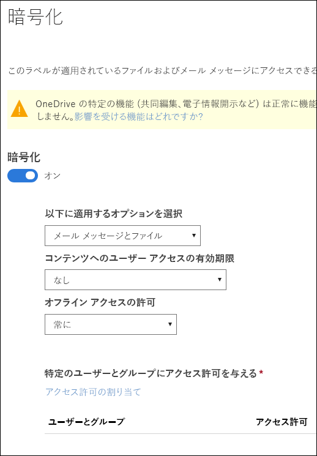
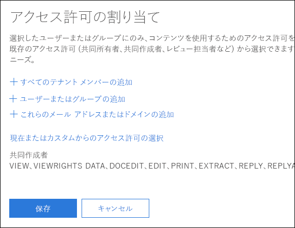
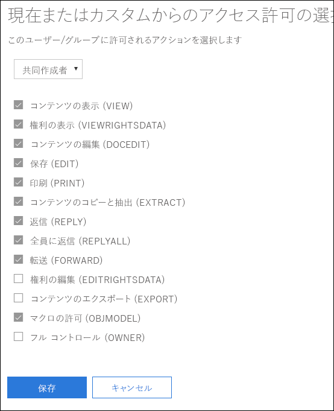
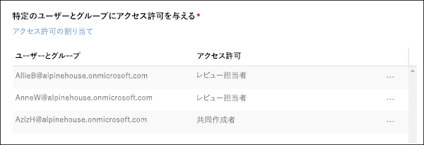

# 機密ラベルの暗号化を使用してコンテンツへのアクセスを制限する

機密ラベルを作成するときに、そのラベルが適用されるコンテンツへのアクセスを制限できます。たとえば、機密ラベルに対応する暗号化の設定によって、次のようにコンテンツを保護できます。

- 組織内のユーザーのみが機密ドキュメントや電子メールを開けるようにする。
- 宣伝広告用のドキュメントや電子メールは、マーケティング部門のユーザーのみが編集および印刷できるようにして、その他の組織内のユーザーは閲覧のみできるようにする。
- 内部の再編成に関するニュースが含まれている電子メールは、ユーザーが転送や情報のコピーをできないようにする。
- ビジネス パートナーに送信する現行の価格リストは、指定した日付以降は開けないようにする。

ドキュメントや電子メールを暗号化するときには、次のようにしてコンテンツへのアクセスが制限されます。

- 暗号化の解除は、ラベルの暗号化設定で許可されているユーザーのみが可能です。
- 暗号化は、ファイルの場所 (組織内外) を問わず、ファイル名が変更されていても維持されます。
- 保存中 (OneDrive アカウントなど) と転送中 (送信中の電子メールなど) の両方で暗号化されています。

暗号化設定は、Office 365 セキュリティ/コンプライアンス センターの **[ラベル]** ページにある **[秘密度]** タブの **[ラベルの作成]** で使用可能になります。

## 暗号化のしくみ

暗号化には、Azure Rights Management (Azure RMS) を使用します。Azure RMS は、暗号化ポリシー、ID ポリシー、および認証ポリシーを使用します。詳細については、「[Azure Rights Management とは](https://docs.microsoft.com/ja-JP/azure/information-protection/what-is-azure-rms)」を参照してください。

## 機密ラベルに対する暗号化を有効にする方法

最初に **[暗号化]** を **[オン]** に切り替えて、その下側にあるオプションを使用して、このラベルが適用される電子メールやドキュメントにアクセスできるユーザーを制御します。次のことが可能です。

1. **電子メールとドキュメントの両方、または電子メールにのみ暗号化を適用します。** 電子メールのみを選択すると、このラベルが付いたメッセージは Outlook で暗号化されますが、このラベルが付いたドキュメントは他のアプリ (Word や PowerPoint など) では暗号化されません。 
2. **ラベル付けされたコンテンツへのアクセスに有効期限を設定します。** 指定の日付または指定の日数 (ラベル適用後の経過日数) で有効期限が切れます。この期限が切れると、ユーザーはラベル付きのアイテムを開けなくなります。日付を指定すると、その日付の午前 0 時まで有効になります (現在のタイム ゾーン)。 
3. **オフライン アクセス**を禁止、常に許可、または指定の日数 (ラベル適用後の経過日数) で許可します。オフライン アクセスを禁止または日数で制限すると、そのしきい値に達したときに、ユーザーは再認証される必要があり、ユーザーのアクセスがログに記録されます。詳細については、Rights Management 使用ライセンスに関する次のセクションを参照してください。

### オフライン アクセスのための Rights Management 使用ライセンス

ユーザーが機密ラベルで保護されているドキュメントや電子メールをオフラインで開くと、そのコンテンツの Azure Rights Management 使用ライセンスがユーザーに付与されます。この使用ライセンスは、ドキュメントまたは電子メールに対するユーザーの使用権とコンテンツの暗号化に使用された暗号化キーが含まれている証明書です。この使用ライセンスには、有効期限日 (設定されている場合) と使用ライセンスの有効期間も含まれています。

有効期限日が設定されていない場合、テナントに対する使用ライセンスの既定の有効期間は 30 日間です。使用ライセンスの有効期間中は、そのコンテンツに対してユーザーが再認証または再承認されることはありません。これにより、ユーザーは保護されたドキュメントまたは電子メールをインターネット接続なしで継続して開くことができます。使用ライセンスの有効期間が切れると、保護されたドキュメントまたは電子メールの次回のユーザー アクセス時に、ユーザーの再認証または再承認が必要になります。

再認証だけでなく、ポリシーとユーザー グループ メンバーシップの再評価も実行されます。そのため、ユーザーが最後にコンテンツにアクセスした後でポリシーやグループ メンバーシップに変更が加えられていると、同じドキュメントや電子メールに対して異なるアクセス結果がユーザーに示されることがあります。

既定の 30 日の設定を変更する方法については、「[Rights Management 使用ライセンス](https://docs.microsoft.com/ja-JP/azure/information-protection/configure-usage-rights#rights-management-use-license)」を参照してください。

## 特定のユーザーまたはグループにアクセス許可を割り当てる

特定のユーザーにアクセス許可を付与することで、ラベル付きコンテンツの操作を特定のユーザーにのみ許可することができます。

そのようにするには、次の簡単な 2 段階の手順を実行します。

1. まず、ラベル付きコンテンツへのアクセス許可を割り当てるユーザーまたはグループを追加します。
2. 次に、該当するユーザーに付与するラベル付きコンテンツへのアクセス許可を選択します。

### ユーザーまたはグループの追加

アクセス許可を割り当てるときには、次の選択が可能です。

- 組織内のすべてのユーザー (すべてのテナント メンバー)。この設定ではゲスト アカウントが除外されます。
- 特定のユーザーまたは電子メールが有効なセキュリティ グループ、配布グループ、Office 365 グループ、または動的配布グループ。 
- 組織外の電子メール アドレスまたはドメイン (gmail.com、hotmail.com、outlook.com など)。

すべてのテナント メンバーを選択する場合やディレクトリを参照する場合は、ユーザーまたはグループに電子メール アドレスが必要になります。

ベスト プラクティスとして、ユーザーではなくグループを使用します。この方針により、シンプルな構成を維持できます。

### アクセス許可の選択

該当するユーザーまたはグループに付与するアクセス許可を選択するときには、次のいずれかを選択できます。

- 既定の権限のグループ (「共同制作者」や「レビュー担当者」など) で[事前定義されたアクセス許可レベル](https://docs.microsoft.com/ja-JP/azure/information-protection/configure-usage-rights#rights-included-in-permissions-levels)。
- カスタムの権限のグループ。この場合は任意のアクセス許可を選択できます。

それぞれの具体的なアクセス許可に関する詳細については、「[使用権限と説明](https://docs.microsoft.com/ja-JP/azure/information-protection/configure-usage-rights#usage-rights-and-descriptions)」を参照してください。  

同じラベルで異なるユーザーに異なるアクセス許可を付与できます。たとえば、次に示すように、単一のラベルで一部のユーザーを「レビュー担当者」として割り当てて、別のユーザーを「共同作成者」として割り当てることができます。

このようにするには、ユーザーまたはグループを追加し、それらにアクセス許可を割り当てて、その設定を保存します。その後で、この手順 (ユーザーの追加とアクセス許可の割り当て) を繰り返して、そのたびに保存します。この手順は、異なるユーザーに異なるアクセス許可を定義することが必要になるたびに実行できます。

### 常にフル コントロールを持つ Rights Management 発行者 (機密ラベルを適用するユーザー)

機密ラベルに対する暗号化には Azure RMS が使用されます。ユーザーがドキュメントや電子メールを保護するために Azure RMS を使用して機密ラベルを適用すると、そのユーザーはそのコンテンツに対する Rights Management 発行者になります。

Rights Management 発行者には、常に、ドキュメントや電子メールに対するフル コントロールのアクセス許可が付与されます。さらに、次のことが可能になります。

- 保護設定に有効期限日が含まれている場合、Rights Management 発行者は、その期日が過ぎていてもドキュメントや電子メールを開いて編集できます。
- Rights Management 発行者は、常に、オフラインでドキュメントや電子メールにアクセスできます。
- Rights Management 発行者は、失効後のドキュメントも開くことができます。

詳細については、「[Rights Management 発行者と Rights Management 所有者](https://docs.microsoft.com/ja-JP/azure/information-protection/configure-usage-rights#rights-management-issuer-and-rights-management-owner)」を参照してください。

## OneDrive および SharePoint に暗号化されたコンテンツを保存する

OneDrive および SharePoint に保存されているファイルに暗号化を適用すると、サービスは該当するファイルのコンテンツを処理できなくなります。そのため、共同編集、電子情報開示、検索、Delve などの共同作業機能が動作しなくなります。さらに、データ損失防止 (DLP) ポリシーはメタデータ (Office 365 のラベルを含む) にのみ作用し、暗号化されたファイルのコンテンツ (ファイル内のクレジット カード番号など) には作用しなくなります。

これは、OneDrive および SharePoint に保存されているコンテンツにのみ当てはまります。Exchange Online では、メール フロー ルール (トランスポート ルールとも呼ばれる) で[スーパー ユーザー アカウント](https://docs.microsoft.com/ja-JP/azure/information-protection/configure-super-users)が使用されるため、暗号化されたコンテンツのスキャンと DLP ポリシーの強制適用が可能です。

## 重要な前提条件

暗号化を使用する前に、次のタスクの実行が必要になることがあります。

### Azure Rights Management を有効化する

機密ラベルでの暗号化を使用する場合は、Azure Rights Management サービスがテナントで有効化されている必要があります。新しいテナントでは、このサービスが既定でオンになっていますが、手動で有効化することが必要になる場合もあります。詳細については、「[Rights Management をアクティブにする](https://docs.microsoft.com/ja-JP/azure/information-protection/activate-service)」を参照してください。

### Azure Information Protection 用に Exchange を構成する

ユーザーが Outlook で電子メールの保護のためにラベルを適用するまでは、Azure Information Protection 用に Exchange を構成する必要はありません。ただし、Exchange が Azure Information Protection 用に構成されるまで、Exchange には Azure Rights Management 保護の使用よる完全な機能が備わりません。
 
たとえば、ユーザーは保護された電子メールを携帯電話や Outlook on the web で表示できません。また、保護された電子メールは検索用のインデックスを作成できません。さらに、Rights Management 保護用に Exchange Online DLP を構成することもできません。 

このような追加のシナリオを Exchange でサポートする場合は、次の項目を参照してください。

- Exchange Online の場合は、「[Exchange Online: IRM 構成](https://docs.microsoft.com/ja-JP/azure/information-protection/configure-office365#exchange-online-irm-configuration)」の説明を参照してください。
- Exchange On-Premises の場合は、[RMS コネクタを展開して Exchange サーバーを構成する](https://docs.microsoft.com/ja-JP/azure/information-protection/deploy-rms-connector)必要があります。 
