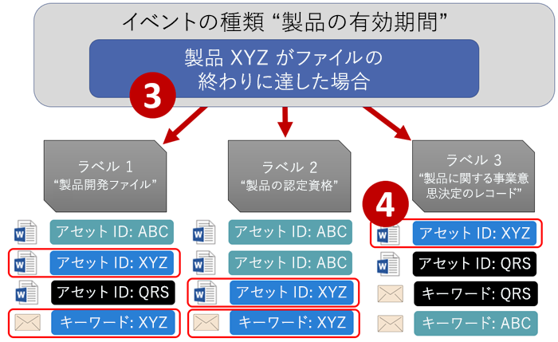
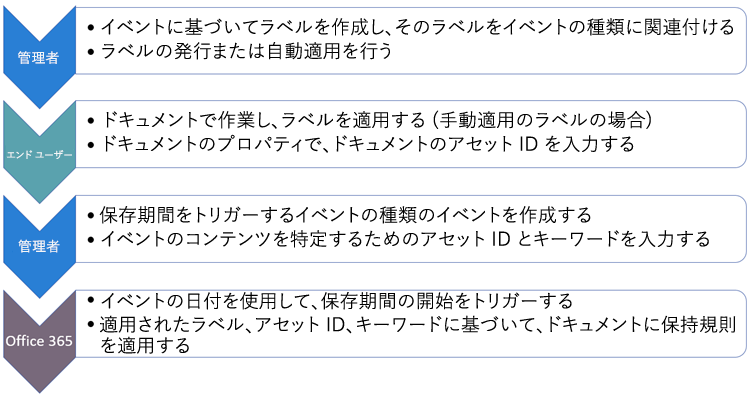
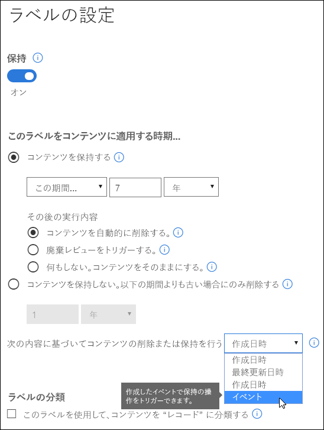
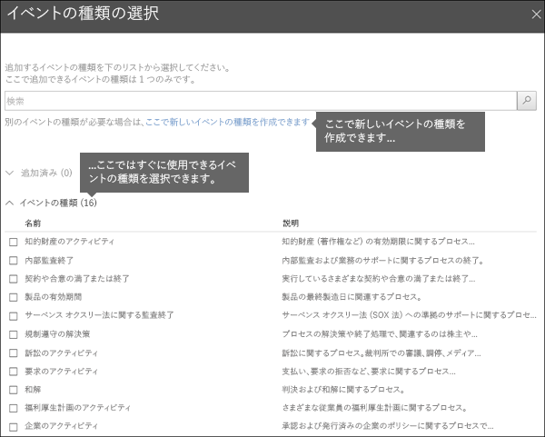
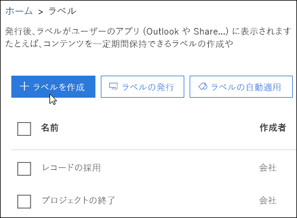
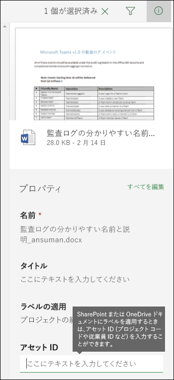
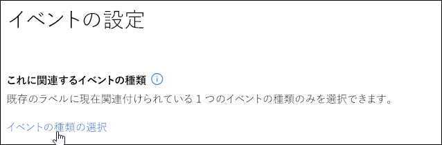

# イベント ベースの保持の概要Overview of event-driven retention

コンテンツを保持する場合、たとえば、ドキュメントを作成してから 7 年間保存し、その後削除するように、保存期間がコンテンツの有効期限に基づいていることがよくあります。Office 365 のラベルを使用すれば、特定の種類のイベントが発生したときの保存期間の基準を設定することができます。発生したイベントによって保存期間の開始がトリガーされ、そのイベントの種類のラベルが適用されたすべてのコンテンツによって、コンテンツに適用済みのラベルの保持操作が行われます。When you retain content, the retention period is often based on the age of the content - for example, you might retain documents for seven years after they're created and then delete them. But with labels in Office 365, you can also base a retention period on when a specific type of event occurs. The event triggers the start of the retention period, and all content with a label applied for that type of event get the label's retention actions enforced on them.
  
たとえば、以下のような場合に、イベント ベースの保持のラベルを使用することができます:For example, you can use labels with event-driven retention for:
  
- **従業員が組織のメンバーでなくなる**: たとえば、ある従業員が組織のメンバーでなくなった場合、その時点から該当従業員のレコードを 10 年間保持しなければならないとします。10 年経過すると、その従業員の雇用、業績、契約終了などに関するすべてのドキュメントを処分する必要があります。この場合は、従業員が組織から離れることが、10 年の保存期間をトリガーするイベントとなります。**Employees leaving the organization** Suppose that employee records must be retained for 10 years from the time an employee leaves the organization. After 10 years elapse, all documents related to the hiring, performance, and termination of that employee need to be disposed. The event that triggers the 10-year retention period is the employee leaving the organization. 
    
- **契約の期限切れ**: たとえば、契約に関連するすべてのレコードを、契約の期限が切れてから 5 年間保持する必要があるとします。この場合、契約の期限切れが、5 年の保存期間をトリガーするイベントとなります。**Contract expiration** Suppose that all records related to contracts need to be retained for five years from the time the contract expires. The event that triggers the five-year retention period is the expiration of the contract. 
    
- **製品の有効期間**: たとえば、組織に、技術仕様などのコンテンツに関して、最終製品製造日に関する保持要件があるとします。この場合、最後に製造された日が、保存期間をトリガーするイベントとなります。**Product lifetime** Your organization might have retention requirements related to the last manufacturing date of products for content such as technical specifications. In this case, the last manufacturing date is the event that triggers the retention period. 
    
イベント ベースの保持は通常、レコード管理プロセスの一環として使用します。これは以下のことを意味します:Event-driven retention is typically used as part of a records-management process. This means that:
  
- イベント ベースのラベルも通常、コンテンツをレコードとして分類します。詳細については、「[コンテンツ検索を使用した特定のラベルが適用されたすべてのコンテンツの検索](labels.md#using-content-search-to-find-all-content-with-a-specific-label-applied-to-it)」を参照してください。Labels based on events also usually classify content as a record. For more information, see [Using Content Search to find all content with a specific label applied to it](labels.md#using-content-search-to-find-all-content-with-a-specific-label-applied-to-it).
    
- レコードとして宣言されているもののイベント トリガーがまだ発生していない文書は、イベントがそのドキュメントの保存期間をトリガーするまで無期限に保持されます (レコードを完全に削除することはできません)。A document that's been declared as a record but whose event trigger has not yet happened is retained indefinitely (records can't be permanently deleted), until an event triggers that document's retention period.
    
- イベント ベースのラベルは通常、保存期間の終了時に廃棄レビューをトリガーするので、レコード管理者は手動でコンテンツを確認して廃棄できます。詳細については、「[廃棄レビューの概要](disposition-reviews.md)」を参照してください。Labels based on events usually trigger a disposition review at the end of the retention period, so that a records manager can manually review and dispose the content. For more information, see [Overview of disposition reviews](disposition-reviews.md).
    
イベント ベースのラベルには、Office 365 のラベルと同じ機能があります。詳細については、「[ラベルの概要](labels.md)」を参照してください。A label based on an event has the same capabilities as any label in Office 365. To learn more, see [Overview of labels](labels.md).
    
## イベントの種類、ラベル、イベント、アセット ID の関係を理解するUnderstanding the relationship between event types, labels, events, and asset IDs

イベント ベースの保持を活用するには、下の図に示すように、イベントの種類、ラベル、イベント、アセット ID の関係を理解することが重要です。図の下には説明文も記載しています。To successfully use event-driven retention, it's important to understand the relationship between event types, labels, events, and asset IDs as illustrated here. An explanation follows the diagram.
  

  

  
1. さまざまな種類のコンテンツのラベルを作成し、ラベルをイベントの種類に関連付けることができます。たとえば、さまざまな種類の製品ファイルとレコードのラベルは、製品を使用しなくなった時点からレコードを 10 年間保持する必要があるため、Product Lifetime という名前のイベントの種類に関連付けられます。You create labels for different types of content and then associate them with a type of event. For example, labels for different types of product files and records are associated with an event type named Product Lifetime because those records must be retained for 10 years from the time the product reaches its end of life.
    
2. ユーザー (通常はレコード管理者) はこれらのラベルをコンテンツに適用し、(SharePoint および OneDrive ドキュメントの場合は) 各アイテムのアセット ID を入力します。この例では、アセット ID は組織が使用する製品名あるいはコードになります。つまり、各製品のレコードにはラベルが割り当てられ、各レコードのプロパティにはアセット ID が含まれます。上の図で示されてるのは、組織内のすべての製品レコードの**すべてのコンテンツ**であり、各アイテムには、その製品のレコードのアセット ID が存在します。Users (typically records managers) apply those labels to content and (for SharePoint and OneDrive documents) enter an asset ID for each item. In this example, the asset ID is a product name or code used by the organization. Thus, each product's records are assigned a label, and each record has a property that contains an asset ID. The diagram represents **all of the content** for all product records in an organization, and each item bears the asset ID of the product whose record it is. 
    
3. Product Lifetime がイベントの種類で、使用しなくなった特定の製品がイベントになります。その種類のイベントが発生したら (上の図の例では、製品を使用しなくなる場合)、以下を指定するイベントを作成します:Product Lifetime is the event type; a specific product reaching end of life is an event. When an event of that event type occurs - in this case, when a product reaches its end of life - you create an event that specifies:
    
  - (SharePoint および OneDrive のドキュメントの) アセット ID。An asset ID (for SharePoint and OneDrive documents)
    
  - (Exchange アイテムの) キーワード。上の例において組織は、製品レコードを含むメッセージで製品コードを使用するため、Exchange アイテムのキーワードは  SharePoint および OneDrive ドキュメントのアセット  ID と同じになります。Keywords (for Exchange items). In this example, the organization uses a product code in messages containing product records, so the keyword for Exchange items is the same as the asset ID for SharePoint and OneDrive documents.
    
  - イベントが発生した日付。この日付は、保存期間の開始として使用します。この日付は、現在の日付または将来の日付にする必要があります。過去の日付にすることはできません。The date when the event occurred. This date is used as the start of the retention period. This date can only be the current or a future date, not a past date.
    
4. イベントを作成すると、そのイベントの日付は次のようなすべてのコンテンツに同期されます。すなわち、そのイベントの種類のラベルが割り当てられ、指定されたアセット ID またはキーワードを含むすべてのコンテンツです。他のラベルと同様、この同期には最大 7 日間かかります。上の図で赤く囲まれたすべてのアイテムに関しては、このイベントによって保存期間がトリガーされます。つまり、この製品を使用しなくなると、そのイベントによって製品のレコードの保存期間がトリガーされます。After you create an event, that event date is synced to all of the content that has a label of that event type and that contains the specified asset ID or keyword. Like any label, this syncing can take up to 7 days. In the diagram above, all of the items circled in red have their retention period triggered by this event - in other words, when this product reaches its end of life, that event triggers the retention period for that product's records.
    
銘記すべき点として、イベントのアセット ID またはキーワードを指定しない場合は、そのイベントの種類のラベルが割り当てられている**すべてのコンテンツ**の保存期間がイベントによってトリガーされます。つまり、上記の図では、すべてのコンテンツの保持が開始されますので、ご注意ください。It's important to understand that if you don't specify an asset ID or keywords for an event, **all of the content** with a label of that event type will have its retention period triggered by the event. This means that in the diagram above, all of the content would start being retained. This may not be what you intend. 
  
また、各ラベルには独自の保持の設定があります。上の例では、すべて 10 年を指定していますが、保存期間が異なるそれぞれのラベルをイベントがトリガーすることもできます。Finally, remember that each label has its own retention settings. In this example, they all specify 10 years, but it's possible for an event to trigger labels where each label has a different retention period.
  
## イベント ベースの保持のセットアップ方法How to set up event-driven retention

イベント ベースの保持の概要をまず説明し、その後に詳細な手順を示します。Here's the high-level workflow for event-driven retention. More detailed steps follow below.
  

  
### 手順 1: 保存期間がイベント ベースのラベルを作成するStep 1: Create a label whose retention period is based on an event

セキュリティ&amp;コンプライアンス センターの左側のナビゲーションの **[分類]** の下で、**[ラベル]** \> **[ラベルを作成]** の順に選択します。In the Security &amp; Compliance Center, in the left navigation, under **Classifications**, choose **Labels** \> **Create a label**.
  
ラベルを作成するときは、保持をオンにしてから、その下に表示されているオプションを選択して、イベント ベースのコンテンツの保持または削除を行います。保持の設定は、**[イベント]** ページでイベントを作成する手順 5 までは、有効になりません。When you create the label, turn on retention, and then choose the option shown below to retain or delete the content based on an event. This means that the retention settings won't go into effect until Step 5, when you create an event on the **Events** page. 
  
イベント ベースの保持は通常、レコードとして分類されるコンテンツに使用します。このため、イベント ベースでラベルを作成する場合は、**[ラベルを使用して "レコード" としてコンテンツを分類する]** オプションを選択します。Note that event-driven retention is typically used for content that's classified as a record. For this reason, when you create labels based on an event, you typically choose the option to **Use label to classify content as a "Record"**.
  
また、イベント ベースの保持には、以下のような保持の設定が必要になります:Also note that event-driven retention requires retention settings that:
  
- コンテンツを保持する。Retain the content.
    
- 保存期間の終わりに、コンテンツの自動削除または廃棄レビューのトリガーを行う。Delete the content automatically or trigger a disposition review at the end of the retention period.
    

  
### 手順 2: そのラベルのイベントの種類を選択するStep 2: Choose an event type for that label

ラベル設定で、ベースにする**イベント**のラベルのオプションを選択すると、**[イベントの種類を選択する]** オプションが表示されます。イベントの種類は、ラベルを関連付けるイベントに関する、簡単で一般的な説明内容になります。In the label settings, after you choose the option to base the label on **an event**, you'll see the option to **Choose an event type**. An event type is simply a general description of an event that you want to associate a label with.
  
たとえば、Product Lifetime という名前のイベントの種類を作成する場合は、"製品開発ファイル" や "製品の経営的意思決定" など、ラベルを適用するコンテンツの種類が分かるような名前でイベント ベースのラベルを作成する必要があります。For example, if you create an event type named Product Lifetime, you'll create event-based labels with names that describe what types of content you want the labels to be applied to, such as "Product development files" or "Product business decision records".
  
一度イベントの種類を選択してラベルを作成すると、イベントの種類の変更はできませんので、ご注意ください。Note that once you choose an event type and create the label, the event type cannot be changed.
  

  
### 手順 3: ラベルの発行または自動適用Step 3: Publish or auto-apply the label

他のラベルと同様、イベント ベースのラベルも発行または自動適用を行う必要があります。そのため、イベント ベースのラベルはコンテンツに手動または自動で適用されます。この操作は **[ラベル]** ページで行います。ただし、コンテンツをレコードとして分類するラベルに関しては、発行はできますが、コンテンツへの適用は手動のみとなります。コンテンツへの自動適用を行うことはできません。Just like any label, you need to publish or auto-apply an event-based label, so that it's manually or automatically applied to content. Do this on the **Labels** page. Note that labels that classify content as a record can only be published and manually applied to content; they can't be auto-applied to content. 
  

  
### 手順 4: アセット ID を入力するStep 4: Enter an asset ID

イベント ベースのラベルがコンテンツに適用されると、アイテムごとにアセット ID を入力できます。たとえば、組織が使用するのは以下のようなものになります:After an event-driven label is applied to content, you can enter an asset ID for each item. For example, your organization might use:
  
- 特定の製品のみのコンテンツ保持に使用する製品コード。Product codes that you can use to retain content for only a specific product.
    
- 特定の製品のみのコンテンツ保持に使用するプロジェクト コード。Project codes that you can use to retain content for only a specific project.
    
- 特定の製品のみのコンテンツ保持に使用する従業員 ID。Employee IDs that you can use to retain content for only a specific person.
    
アセット ID は、SharePoint および OneDrive for Business では、別のドキュメント プロパティになります。組織ですでに、他のドキュメント プロパティと ID を使用してコンテンツを分類している可能性がありますが、その場合は、イベントを作成するときにこれらのプロパティと値を使用することができます。詳細は、次の手順 6 を参照してください。組織がプロパティを使用する際には、ドキュメント プロパティで property:value の組み合わせを使って、そのアイテムをイベントの種類に関連付けることが重要です。Understand that Asset ID is simply another document property in SharePoint and OneDrive for Business. Your organization may already use other document properties and IDs to classify content. If so, you can also use those properties and values when you create an event - see Step 6 below. The important point is that your organization must use some property:value combination in the document properties to associate that item with an event type.
  

  
### 手順 5: イベントを作成するStep 5: Create an event

製品の使用を終えるなど、イベントの種類の特定のインスタンスが発生するときは、セキュリティ&amp;コンプライアンス センターの [イベント] ページに移動し、イベントを作成します。イベントを作成して手動でトリガーする必要があります。When a particular instance of that event type occurs - for example, a product reaches its end of life - go to the Events page in the Security &amp; Compliance Center and create an event. You need to manually trigger an event by creating it.
  
![セキュリティ/コンプライアンス センターの [イベント] ページ](media/811bddfb-a7e9-4990-bf5e-abe0dfb91809.png)
  
### 手順 6: 手順 2 でのラベルを使用したイベントの種類と同じものを選択するStep 6: Choose the same event type used by the label in step 2

イベントを作成するときは、手順 2 でのラベルを使用したイベントの種類と同じもの (例: Product Lifetime)  を選択します。そのイベントの種類のラベルが適用されたコンテンツに関してのみ、保存期間がトリガーされます。When you create the event, choose the same event type used by the label in step 2 - for example, Product Lifetime. Only content with labels applied to it of that event type will have its retention period triggered.
  

  
### 手順 7: キーワードまたはアセット ID を入力するStep 7: Enter keywords or an asset ID

ここで、SharePoint および OneDrive コンテンツのアセット ID または Exchange コンテンツのキーワードを指定して、コンテンツの範囲を絞り込みます。アセット ID の保持は、指定された property:value のペアを持つコンテンツにのみ適用されます。アセット ID が入力されていない場合は、そのイベントの種類のラベルが割り当てられている**すべてのコンテンツ**に、ラベルに適用されているのと同じ保持期限が適用されます。Now you narrow the scope of the content by specifying asset IDs for SharePoint and OneDrive content or keywords for Exchange content. For asset IDs, retention will be enforced only on content with the specified property:value pair. If an asset ID is not entered, **all of the content** with labels of that event type get the same retention date applied to them. 
  
なお、アセット ID は、SharePoint と OneDrive for Business では、別のドキュメント プロパティにあります。アセット ID プロパティを使用している場合は、以下に示すアセット ID のボックスに ComplianceAssetID:\<値\> を入力します。Understand that Asset ID is simply another document property in SharePoint and OneDrive for Business. If you're using the Asset ID property, you would enter ComplianceAssetID:\<value\> in the box for asset IDs shown below.
  
組織がこのイベントの種類に関連するドキュメントに、他のプロパティと ID を適用している可能性があります。たとえば、特定の製品のレコードを検出する必要がある場合、ID はカスタム プロパティ ProductID と値 "XYZ" の組み合わせになります。この場合、以下に示すアセット ID のボックスには、ProductID:XYZ と入力します。Your organization might have applied other properties and IDs to the documents related to this event type. For example, if you need to detect a specific product's records, the ID might be a combination of your custom property ProductID and the value "XYZ". In this case, you'd enter ProductID:XYZ in the box for asset IDs shown below.
  
Exchange アイテムの場合は、キーワードを使用できます。AND、OR、NOT などの検索演算子を使って、クエリを絞り込むことができます。演算子の詳細については、「[コンテンツ検索のキーワード クエリと検索条件](keyword-queries-and-search-conditions.md)」を参照してください。For Exchange items, you can include keywords. You can refine your query by using search operators like AND, OR, and NOT. For more information on operators, see [Keyword queries and search conditions for Content Search](keyword-queries-and-search-conditions.md).
  
最後に、イベントが発生した日付を選択します。この日付は保存期間の開始として使用されます。イベントを作成した後、そのイベントの日付は、そのイベントの種類、アセット ID、キーワードのラベルが割り当てられたすべてのコンテンツに同期されます。他のラベルと同様、この同期には最大 7 日間かかります。Finally, choose the date when the event occurred; this date is used as the start of the retention period. After you create an event, that event date is synced to all of the content with a label of that event type, asset ID, and keywords. Like any label, this syncing can take up to 7 days.
  
![[イベントの設定] ページ](media/40d3c9db-f624-49a5-b38a-d16bcce20231.png)
  
## コンテンツ検索を使用して、特定のラベルまたはアセット ID が適用されたすべてのコンテンツを検索するUse Content Search to find all content with a specific label or asset ID

ラベルがコンテンツに割り当てられた後、セキュリティ&amp;コンプライアンス センターでコンテンツ検索を使用して、特定のラベルで分類されているコンテンツまたは特定のアセット ID を含むコンテンツすべてを検索することができます。After labels are assigned to content, you can use content search in the Security &amp; Compliance Center to find all content that's classified with a specific label or that contains a specific asset ID.
  
コンテンツ検索を行うときは、次のようにします:When you create a content search:
  
- 特定のラベルを持つすべてのコンテンツを検索するには、**[コンプライアンス タグ]** の条件を選択した後、完全なラベル名を入力するか、またはラベル名の一部を入力してワイルドカードを使用します。To find all content with a specific label, choose the **Compliance Tag** condition, and then enter the complete label name or part of the label name and use a wildcard. 
    
- 特定のアセット ID を持つすべてのコンテンツを検索するには、**ComplianceAssetID** プロパティと値 (例: ComplianceAssetID:\<値\>) を入力します。To find all content with a specific asset ID, enter the **ComplianceAssetID** property and a value, like ComplianceAssetID:\<value\>. 
    
詳細については、「[コンテンツ検索のキーワード クエリと検索条件](keyword-queries-and-search-conditions.md)」を参照してください。For more information, see [Keyword queries and search conditions for Content Search](keyword-queries-and-search-conditions.md).
  
## アクセス許可Permissions

**[イベント]** ページにアクセスするには、レビュー担当者は、**廃棄管理**の役割と**監査ログの閲覧限定**の役割を持つ、役割グループのメンバーである必要があります。Disposition Reviewers という新しい役割グループを作成し、これら 2 つの役割をその役割グループに追加して、それからメンバーをその役割グループに追加することをお勧めします。To get access to the **Events** page, reviewers must be members of a role group with the **Disposition Management** role and the **View-Only Audit Logs** role. We recommend creating a new role group called Disposition Reviewers, adding these two roles to that role group, and then adding members to the role group. 
  
詳細については、「[ユーザーに Office 365 セキュリティ&amp;コンプライアンス センターへのアクセス権を付与する](grant-access-to-the-security-and-compliance-center.md)」を参照してください。See [Give users access to the Office 365 Security &amp; Compliance Center](grant-access-to-the-security-and-compliance-center.md).
  
## PowerShell を使用してイベントを自動化するAutomate events by using PowerShell

Office 365 セキュリティ&amp;コンプライアンス センターでは、イベントは手動でしか作成できません。イベントが発生したときに自動的にイベントをトリガーすることはできません。ただし、PowerShell スクリプトを使用すれば、ビジネス アプリケーションからのイベント ベースの保持を自動化することができます。In the Office 365 Security &amp; Compliance Center, you can only create events manually; it's not possible to automatically trigger an event when it occurs. However, you can use a PowerShell script to automate event-based retention from your business applications.
  
現在、ビジネス アプリケーション (人事、CRM、金融アプリケーションなど) をイベント ベースの保持に適用できるよう、API に関する開発を行っています。たとえば、人事システムをイベント ベースの保持に適用できるようになると、従業員が組織を離れたときにそのイベントの種類のイベントが自動的にトリガーされるようになります。We are currently working on APIs, so that you can connect your business applications (such as HR, CRM, or financial applications) to event-driven retention. For example, you'll be able to connect your HR system to event-driven retention, so that when an employee leaves the organization, and event of that event type is automatically triggered.
  
その時までは、イベント ベースの保持に使用できるのは以下の PowerShell コマンドレットです:Until then, here are the PowerShell cmdlets available for event-driven retention:
  
- [Get-ComplianceRetentionEventTypeGet-ComplianceRetentionEventType](https://go.microsoft.com/fwlink/?linkid=873002)
    
- [New-ComplianceRetentionEventTypeNew-ComplianceRetentionEventType](https://go.microsoft.com/fwlink/?linkid=873004)
    
- [Remove-ComplianceRetentionEventTypeRemove-ComplianceRetentionEventType](https://go.microsoft.com/fwlink/?linkid=873005)
    
- [Set-ComplianceRetentionEventTypeSet-ComplianceRetentionEventType](https://go.microsoft.com/fwlink/?linkid=873006)
    
- [Get-ComplianceRetentionEventGet-ComplianceRetentionEvent](https://go.microsoft.com/fwlink/?linkid=873001)
    
- [New-ComplianceRetentionEventNew-ComplianceRetentionEvent](https://go.microsoft.com/fwlink/?linkid=873003)
    

