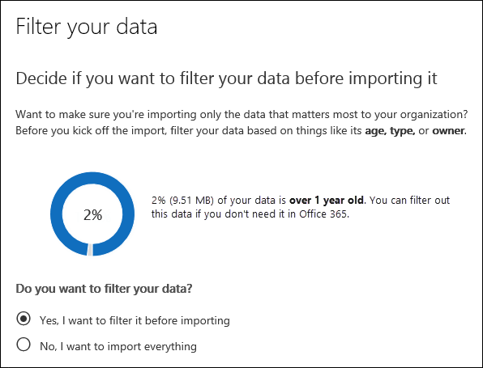

# Office 365 に PST ファイルをインポートするときにデータをフィルター処理します。

対象のメールボックスに実際にインポートを取得する PST ファイル内のアイテムにフィルターを適用するのには、Office 365 のインポート サービスの新しいインテリジェントなインポート機能を使用します。その動作を以下に示します。
  
- 作成し、PST のインポート ジョブを送信した後、PST ファイルは、マイクロソフトのクラウド内の Azure ストレージ領域にアップロードされます。
    
- Office 365 は、メールボックスのアイテムと PST ファイルに含まれている別のメッセージの種類の保存期間を識別することによって、安全性とセキュリティで保護された方法で、PST ファイル内のデータを分析します。
    
- 分析が完了すると、データをインポートする準備ができました、またはインポートされたデータを取得するかを制御するフィルターを設定することによってインポートされたデータをトリミングすると、PST ファイルのすべてのデータをインポートするオプションがあります。たとえば、することもできます。
    
  - 特定の年齢の項目のみをインポートします。
    
  - 選択したメッセージの種類をインポートします。
    
  - 特定のユーザーによって送信または受信のメッセージを除外します。
    
- フィルターの設定を構成した後、Office 365 は、インポート ジョブで指定されたターゲット メールボックスにフィルター条件に一致するデータのみをインポートします。
    
次の図はインテリジェントなインポート プロセスを示していて、タスクを実行し、Office 365 によって実行されるタスクを強調表示します。
  

  
## はじめに

- このトピックの手順では、PST のインポート ジョブ ネットワーク アップロードまたは送付先のドライブを使用して Office 365 のインポート サービスに作成したと仮定します。手順については、次のトピックを参照してください。
    
  - [ネットワーク アップロードを使用して PST ファイルを Office 365 にインポートする](use-network-upload-to-import-pst-files.md)
    
  - [ドライブ送付を使用して PST ファイルを Office 365 にインポートする](use-drive-shipping-to-import-pst-files-to-office-365.md)
    
- インポートでインポート ジョブのステータスが Office 365 のセキュリティ ページ ネットワークのアップロードを使用して、インポート ジョブを作成したら、&amp;コンプライアンス センターに設定**を解析して**、Office 365 が PST ファイルのデータを分析していることを意味することアップロードします。[**更新**] をクリックしてインポート ジョブの状態を更新します。 
    
- インポート ジョブを配布するドライブは、Microsoft データ センターのスタッフは、ハード ディスク ドライブが表示され、組織、Azure のストレージ領域を PST ファイルをアップロードした後、Office 365 でデータを分析してがします。
  
## メールボックスにインポートを取得するデータをフィルター処理します。

作成した後、PST ジョブのインポートは、Office 365 にインポートする前にデータをフィルター処理するのには次の手順に従います。
  
1. [https://protection.office.com/](https://protection.office.com/)し、組織の Office 365 の管理者アカウントの資格情報を使用してサインインします。 
    
2. Office 365 のセキュリティの左側のウィンドウで&amp;コンプライアンス センターでは、**データの管理**をクリックして\>**インポート**します。
    
    組織のインポート ジョブは、[**インポート**] ページに一覧表示されます。**分析は完了****状態**] 列に値が、インポート ジョブは Office 365 によって分析されているし、インポートする準備ができているを示しているに注意してください。 
    
    
  
3. インポート ジョブを完了するのには、 **Office 365 にインポートする準備**をクリックします。 
    
    ページをその場は、PST ファイルの情報とインポート ジョブに関する他の情報が表示されます。
    
4. **Office 365 にインポート**] をクリックします。
    
    **データにフィルターをかける**] ページが表示されます。データの保存期間に関する情報を含む、インポート ジョブは、PST ファイルのデータに関するデータの情報が含まれています。 
    
    
  
5. で、Office 365 にインポートされるデータをトリミングするかどうかに基づいて**にデータをフィルターする?**、次のいずれかの操作を行います。
    
    a. では、**インポートする前にフィルター処理する**、インポートしたデータをトリムするのにはをクリックし、[**次へ**] をクリックします。
    
    **Office 365 のページへのデータのインポート**] ページには、Office 365 を実行する解析の詳細なデータ分析が表示されます。 
    
    
  
    このページ上のグラフでは、インポートされるデータの量を示します。PST ファイルで検出された各メッセージの種類に関する情報は、グラフに表示されます。そのメッセージの種類に関する特定の情報を表示するには、各バーの上にカーソルを合わせたことができます。PST ファイルの解析に基づくさまざまな年齢の値を持つドロップ ダウン リストもあります。ドロップ ダウン リストで、有効期間を選択すると、データの量は、選択した期間のインポートを表示するグラフが更新されます。 
    
    b. インポートされるデータの量を減らすために追加のフィルターを構成するには、**他のフィルター オプション**をクリックします。
    
    ![インポートするデータをトリムするのには [詳細オプション] ページで、フィルターを構成します。](media/3f8d68c3-3fe2-4b4e-9488-b368b98fa9fe.png)
  
    これらのフィルターを構成することができます。
    
      - **時代**のアイテムのみが指定された期間よりも新しいため、経過時間をインポートする] を選択します。Office 365 で**年齢**フィルターの有効期間のバケットを決定する方法についての説明の[詳細について](filter-data-when-importing-pst-files.md#moreinfo)はを参照してください。 
    
      - **タイプ**- このセクションでは、インポート ジョブの PST ファイル内で見つかったすべてのメッセージの種類を示しています。除外するメッセージの種類の横のボックスをオフにすることができます。その他のメッセージの種類を除外することはできませんに注意してください。メールボックス アイテムを他のカテゴリに含まれているリストの[詳細について](filter-data-when-importing-pst-files.md#moreinfo)はセクションを参照してください。 
    
      - **ユーザー**にメッセージを送信または受信した特定の人を除外することができます。From に表示するユーザーを除外する: フィールドに、: フィールド、または [Cc: メッセージのフィールドをクリックして**ユーザーを除外**する受信者の種類です。相手の電子メール アドレス (SMTP アドレス) を入力、[**追加**] をクリックして、その受信者の種類を除外するユーザーのリストに追加し、**保存**を除外するユーザーの一覧を保存する] をクリックします。 
    
        > [!NOTE]
        > Office 365**ユーザー**フィルターの設定に起因するデータの情報が表示されません。ただし、特定のユーザーによって送信または受信のメッセージを除外するには、このフィルターを設定する場合、実際のインポート プロセス中にこれらのメッセージが除外されます。 
  
    c. では、フィルター設定を保存するページを**複数のフィルター オプション**その場で**適用**をクリックします。 
    
    **Office 365 へのデータのインポート**] ページに関する情報を提供は、フィルターの設定に基づいてください。、更新データは、インポートするデータ量の合計を含むフィルターの設定に基づいてください。フィルター設定の概要が表示されてもいることを注意してください。必要に応じて設定を変更するフィルターの横には、**編集**をクリックします。 
    
    
  
    d. [**次へ**をクリックします。
    
    状態ページに、フィルターの設定が表示されます。もう一度、フィルターの設定を編集できます。
    
    e. では、**データをインポートする**インポートを開始します] をクリックします。インポートされるデータ量の合計が表示されることに注意してください。 
    
    または
    
    a.**いいえ、すべてのものをインポートする**を Office 365 では、PST ファイル内のすべてのデータをインポートする] をクリックし、[**次へ**] をクリックします。
    
    b. **Office 365 へのデータのインポート**] ページで、[**データをインポート**インポートを開始するをクリックします。インポートされるデータ量の合計が表示されることに注意してください。 
    
6. [**インポート**] ページで [**更新**] をクリックします。インポート ジョブのステータスは、[**状態**] 列に表示されます。 
    
7. インポートの詳細については、各 PST ファイルと設定したフィルターの設定の状態などを表示するジョブをクリックします。

  
## 詳細情報

- Office 365 は、フィルターの有効期間の単位をどのように決定するのでしょうか。各項目の送信または受信した時刻のタイムスタンプにするときに Office 365 は、PST ファイルを分析し、検索 (最も古い日付を選択する場合は、品目には、送信および受信したタイムスタンプの両方が割り当てられている)。Office 365 を使用して、そのタイムスタンプの年の値を調べ、アイテムの期間を確認する現在の日付を比較します。これらの年齢は、**年齢**フィルターのドロップダウン リスト内の値として使用されます。たとえば、PST ファイルは、2016、2015 年と 2014 年からメッセージを受信し、**年齢**フィルターに値をなります**1 年間** **2 年間**、および**3 年間**。
    
- 次の表に、ページを**他のオプション**の実行時に**型**のフィルターで**その他の**カテゴリに含まれるメッセージの種類 (前の手順の手順 5 b を参照してください)。現時点では、Office 365 に pst ファイルをインポートするときは、「その他」カテゴリ内の項目を除外できません。 します 
    
    |**メッセージ クラス ID**|**このメッセージ クラスを使用して、メールボックスのアイテム**|
    |:-----|:-----|
    |IPM.活動    |仕訳帳のエントリ    |
    |IPM.ドキュメント    |ドキュメントやファイルを (電子メール メッセージに添付されません)    |
    |IPM.ファイル    |(IPM と同じです。ドキュメント)    |
    |IPM.Note.IMC.Notification    |レポートを送信して、インターネット メールの接続、インターネットへの Exchange Server のゲートウェイであります。    |
    |IPM.Note.Microsoft.Fax    |Fax メッセージ    |
    |IPM.Note.Rules.Oof.Template.Microsoft    |不在時の自動応答メッセージ    |
    |IPM.Note.Rules.ReplyTemplate.Microsoft    |受信トレイ ルールによってメッセージの返信    |
    |IPM.OLE です。クラス    |定期的な一連の例外    |
    |IPM.Recall.Report    |メッセージの取り消し状況レポート    |
    |IPM.リモート    |リモート メール メッセージ    |
    |IPM.レポート    |項目ステータス レポート    |
