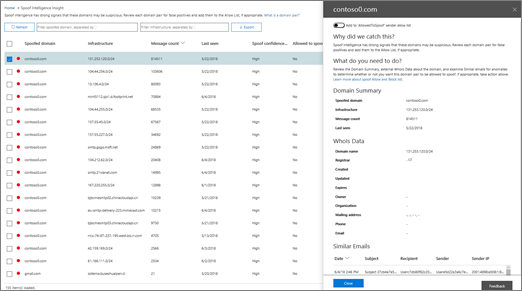

# チュートリアル - ダッシュボードからインサイトへの移動

[Office 365 セキュリティ&amp;コンプライアンスセンターのレポートと洞察](reports-and-insights-in-security-and-compliance.md)を初めて使用する場合は、ダッシュボードから洞察や推奨されるアクションに簡単にアクセスする方法を確認することができます。 
  
これは、セキュリティ&amp;コンプライアンスセンターのいくつかのチュートリアルの1つです。その他のチュートリアルについては、「[関連項目](#related-topics)」セクションを参照してください。 
  
## チュートリアル: ダッシュボードから洞察へ

ダッシュボードからレポートへのフローについて詳しく説明し、分析情報とアクションについて説明します。(これは、簡単な[スプーフィングインテリジェンス](learn-about-spoof-intelligence.md)の例です。) 
  
1. [ &amp;セキュリティ/コンプライアンスセンター](https://protection.office.com)のセキュリティダッシュボードから始めます。([**脅威管理** \> ]**ダッシュボード**に移動します。) ![セキュリティ&amp; /コンプライアンスセンターで、[脅威管理\>ダッシュボード] を選択します。](media/05a38660-eb13-4960-a266-11809c453d95.png) 
  
2. 「 **Insights** 」行には、疑わしいと考えられるいくつかのドメインを確認する必要があることを示す洞察があります。([**インサイト**] 行で、[**ドメインペア**] をクリックします)。  
  
3. スプーフィングインテリジェンスに関連するアクティビティの一覧が表示されます。これらのインスタンスは、電子メールメッセージが組織から送信されたように見えても、実際には別の組織から送信されたものです。目的は、スプーフィングされたメッセージが承認されているかどうかを判断することです。  このリストでは、メッセージ数、スプーフィングが最後に検出された日付などによって情報を並べ替えることができます。([**メッセージ数**]、[**最後の表示**] など) をクリックして、並べ替えの動作を確認します。 
    
4. リスト内の項目を選択すると、検出された類似の電子メールメッセージなどの追加情報が表示される詳細ウィンドウが開きます。(リスト内の項目をクリックし、情報と推奨事項を確認します)。  
  
5. ウィンドウの上部に、組織の許可された送信者リストに送信者を追加するオプションがあります。(この操作を実行するまで、[**送信者許可リストに追加**] を選択しないでください。[スプーフィングインテリジェンスの詳細について説明](learn-about-spoof-intelligence.md)します)。 
  
この方法では、ダッシュボードから洞察および推奨されるアクションに移行できます。
  
## 関連項目

[チュートリアル: 洞察から詳細レポートへ](from-an-insight-to-a-detailed-report.md)
  
[チュートリアル: 詳細レポートから洞察を得る](from-a-detailed-report-to-an-insight.md)
  

