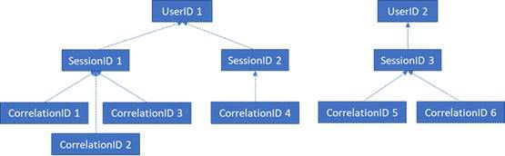

# Office Web Apps Server および Office Online Server の GDPR

Office Online Server および Office Web Apps Server のテレメトリ データは、ULS ログの形で保存されます。[ULS Viewer](https://www.microsoft.com/en-us/download/details.aspx?id=44020) を使用することにより、オンプレミス テナントから ULS のログを確認できます。

ログの各行には、それぞれ 1 つの CorrelationID が含まれています。関連するログ行は同じ CorrelationID を共有します。各 CorrelationID は単一の SessionID に結び付いており、1 つの SessionID は複数の CorrelationID に関連付けられている場合があります。各 SessionID を単一の UserID に関連付けることが可能ですが、いくつかのセッションは匿名のことがあり、その場合は関連する UserID がありません。そのため、特定のユーザーに関連付けられているのがどのデータかを判別するため、単一 UserID をそのユーザーに関連する SessionID に、それらの SessionID を対応する CorrelationID に、そしてそれらの CorrelationID をその関連付けのすべてのログにマッピングすることが可能です。さまざまな ID の間の関係については、次の図を参照してください。

## ログの収集

たとえば、UserID 1 に関連するすべてのログを収集するための最初のステップは、UserID 1 に関連するすべてのセッション (つまり SessionID 1 と SessionID 2) を収集することです。次のステップは、SessionID 1 に関連するすべての関連付け (CorrelationID 1、2、および 3)、および SessionID 2 に関連するすべての関連付け (CorrelationID 4) を収集することです。最後に、リスト内の関連付けのそれぞれに関連するすべてのログを収集します。

1.  UlsViewer の起動

2.  対象となる期間に対応する uls ログを開きます。ULS ログは、%PROGRAMDATA%\\Microsoft\\OfficeWebApps\\Data\\Logs\\ULS の中に保存されています。

3.  フィルターの編集 | 変更

4.  次のフィルターを適用します。

    -   EventID が apr3y に等しい、または

    -   EventID が bp2d6 に等しい

5.  ハッシュ UserID が、これら 2 つのイベントのうちのいずれか 1 つのメッセージ内に含まれます

6.  apr3y の場合、メッセージには UserID 値および PUID 値が含まれます

7.  bp2d6 の場合、メッセージにかなりの情報が含まれます。LoggableUserId 値フィールドがハッシュ UserID です。

8.  これらの 2 つのタグのうちのいずれか 1 つからハッシュ UserID が取得されると、ULSViewer のその行の WacSessionId 値の内容は、そのユーザーに関連する WacSessionId になります

9.  問題のユーザーに関連する WacSessionId 値をすべて収集します

10. リスト内の最初の WacSessionId で、EventId が "xmnv" に等しく、Message が "UserSessionId=\<WacSessionId\>" に等しいものすべてをフィルター処理します (フィルターの \<WacSessionId\> の部分を実際の WacSessionId に置き換える)

11. その WacSessionId に一致する Correlation のすべての値を収集します

12. ステップ 10-11 を、リスト内にある対象ユーザーの WacSessionId の値すべてについて繰り返します

13. Correlation がリスト内の最初の Correlation に等しいものすべてをフィルター処理します

14. その Correlation に一致するログすべてを収集します

15. ステップ 13-14 を、リスト内にある対象ユーザーの Correlation の値すべてについて繰り返します

## データの種類

Office Online のログには、さまざまな異なるタイプのデータが含まれます。ULS ログに含まれるデータの例を、次に示します。

-   製品使用中に発生した問題のエラー コード

-   ボタンのクリックおよびアプリ使用状況についてのその他のデータ

-   アプリについて、またアプリ内の特定の機能についてのパフォーマンス データ

-   ユーザーのコンピューターの所在地を示す一般的な位置情報 (IP アドレスから派生する国 / 地域、県、市町村)、ただし正確な地理的位置ではありません

-   ブラウザーに関する基本的なメタデータ (つまりブラウザーの名前とバージョン)、およびコンピューターに関する基本的なメタデータ (OS の種類とバージョン)

-   ドキュメント ホストからのエラー メッセージ (OneDrive、SharePoint、Exchange など)

-   ユーザーのアクションには関係しないアプリの内部プロセスに関する情報
