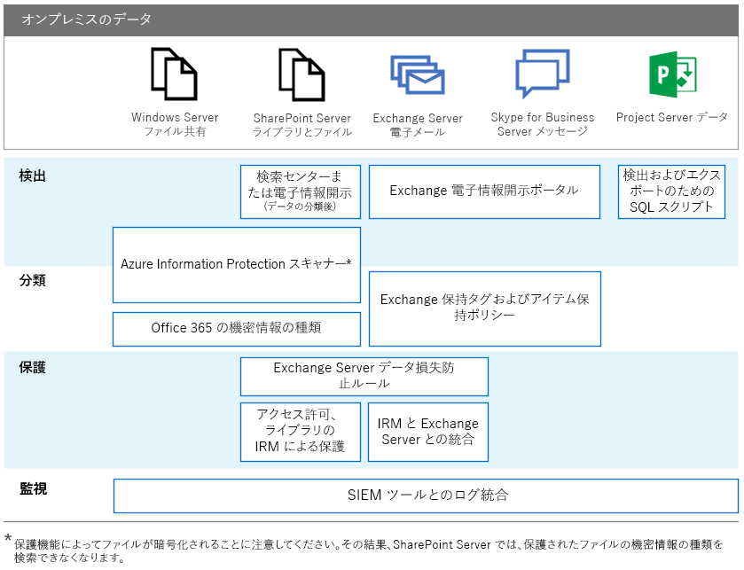

# オンプレミス サーバー上の Office の GDPR

一般データ保護規則 (GDPR) により、組織が個人データを保護し、データ主体要求に適切に応答するための要件が導入されます。このシリーズの記事では、オンプレミスのワークロードのために推奨されるアプローチを示します。

-   [SharePoint Server](gdpr-for-sharepoint-server.md)

-   [Exchange Server](gdpr-for-exchange-server.md)

-   [Skype for Business Server](gdpr-for-skype-for-business-server.md)

-   [Project Server](gdpr-for-project-server.md)

-   [Office Web Apps Server および Office Online Server](gdpr-for-office-online-server.md)

-   [オンプレミス ファイル共有](gdpr-for-on-premises-file-shares.md)

GDPR について、また Microsoft による支援方法の詳細については、[Microsoft セキュリティ センター](https://www.microsoft.com/en-us/TrustCenter/Privacy/gdpr/default.aspx)を参照してください。

オンプレミス データで何らかの作業を実行する前に、法律およびコンプライアンスのチームに問い合わせて、ガイダンス情報を入手し、個人データを処理する際の既存の分類スキーマやアプローチについて確認してください。Microsoft では、[http://aka.ms/gdprpartners](<http://aka.ms/gdprpartners>) の Microsoft GDPR Data Discovery Toolkit で、分類スキーマの開発と拡張の推奨事項を提供しています。このツールキットでは、オンプレミス データをクラウドに移行するためのアプローチも記述されています。クラウドでは、必要に応じて、より洗練されたデータ ガバナンス機能を使用できます。このセクションの記事では、意図的にオンプレミスのままにするデータに関する推奨事項が示されています。

次の図に、これらのワークロードそれぞれで、個人データを検出、分類、保護、監視するために使用する推奨機能のリストを示します。詳細については、このセクションの記事を参照してください。

## 図の説明

見やすいように、次の表では図の例と同じ例を記載しています。

|             |Windows Server ファイル共有|SharePoint Server|Exchange Server|Skype for Business|Project Server|
|:------------|:-------------------------|:----------------|:--------------|:-----------------|:-------------|
|検出|Azure Information Protection スキャナー*|検索センターまたは電子情報開示 (データ分類後); Azure Information Protection スキャナー*|Exchange 電子情報開示ポータル|Exchange 電子情報開示ポータル|検出およびエクスポートのための SQL スクリプト|
|分類|Azure Information Protection スキャナー*; Office 365 機密情報タイプ|Azure Information Protection スキャナー*; Office 365 機密情報タイプ|Exchange 保持タグおよびアイテム保持ポリシー|Exchange 保持タグおよびアイテム保持ポリシー||
|保護||Exchange Server データ損失防止規則; アクセス許可、ライブラリの IRM 保護|Exchange Server データ損失防止規則; IRM と Exchange Server の統合|||
|監視|SIEM ツールとのログ統合|SIEM ツールとのログ統合|SIEM ツールとのログ統合|SIEM ツールとのログ統合|SIEM ツールとのログ統合|

* 保護機能によってファイルが暗号化されることに注意してください。結果として、SharePoint Server では、保護されたファイルの機密情報の種類を検索できなくなります。
