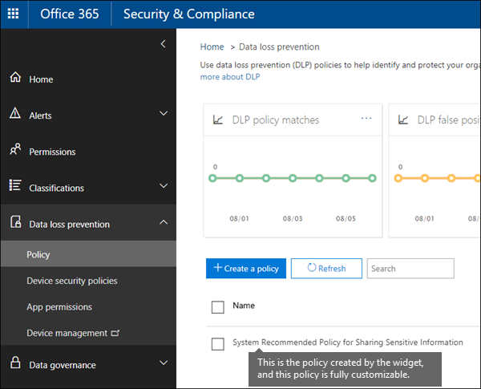

# DLP のポリシー勧告を見る

この洞察を重視する推奨事項は、組織が DLP ポリシーの範囲内に潜在的なギャップがある場合に通知することによって、Office 365 で機密コンテンツを保存および共有する際に、機密コンテンツを安全に保持するのに役に立ちます。 ドキュメントに上位5つの最も**** 一般的な種類の機密&amp;情報が含まれていても、データ損失防止 (DLP) ポリシーでは保護されていない場合は、セキュリティコンプライアンスセンターのホームページにこの推奨事項が表示されます。 
  
このウィジェットを使用すると、クリックまたは2つのカスタマイズされた DLP ポリシーをすばやく作成できます。この DLP ポリシーを作成すると、完全にカスタマイズできるようになります。 最初に推奨事項が表示されない場合は、[**推奨する**方法] セクションの下部にある [ **+ More** ] をクリックしてください。 
  

  
## 推奨の DLP ポリシーを作成する

保護されていない機密情報がウィジェットに表示されたら、一番下にある [**開始**] を選んで DLP ポリシーをすばやく作成します。 
  
機密情報を保護するために、次の DLP ポリシーを使用します。
  
- 保護されていない種類の機密情報のいずれかが含まれている Exchange、SharePoint、OneDrive のコンテンツを組織外のユーザーと共有していることを検出します。
    
- 詳細なアクティビティレポートを生成して、組織外のユーザーとコンテンツを共有しているユーザーや、自分が行ったことなどを追跡できるようにします。 [DLP レポート](view-the-dlp-reports.md)および[監査ログデータ](search-the-audit-log-in-security-and-compliance.md)(**アクティビティ** = **DLP**) を使用して、この情報を確認できます。
    
DLP ポリシーを選択することもできます。
  
- ユーザーがこの機密情報を組織外のユーザーと共有している場合は、インシデントレポート電子メールを送信します。
    
- 他のユーザーを電子メールインシデントレポートに追加します。
    
- ポリシーヒントを表示し、この機密情報を組織外のユーザーと共有しようとしたときに、ユーザーに電子メール通知を送信します。 これらのオプションの詳細については、「[電子メール通知を送信する」と「DLP ポリシーのポリシーヒントを表示する](use-notifications-and-policy-tips.md)」を参照してください。
    
これらのオプションを後で変更する場合は、作成後に DLP ポリシーを編集できます。 たとえば、最初の場所に機密情報が含まれるコンテンツの共有をブロックすることで、ポリシーの制限を高めることができます。次のセクションを参照してください。
  

  
## 推奨の DLP ポリシーを編集する

このウィジェットを使用して DLP ポリシーを作成すると、セキュリティ&amp;コンプライアンスセンターの [**ポリシー** ] ページの [**データ損失防止**] の下にポリシーが表示されます。 
  
既定では、**機密情報を共有するためのシステム推奨ポリシー**という名前のポリシーです。 このポリシーは完全にカスタマイズ可能ですが、最初から自分で作成した DLP ポリシーと同じです。 たとえば、ウィジェットを使用したときにインシデントレポートとポリシーヒントを有効にしないことにした場合は、いつでもポリシーを編集してこれらのオプションを有効にすることができます。
  

  
## ウィジェットが表示されない場合

保護されていない**機密情報**という名前のウィジェットが**** 、セキュリティ&amp; /コンプライアンスセンターのホームページの [**お勧めのお勧め**] セクションに表示されます。 
  
このウィジェットは、次の場合にのみ表示されます。
  
- 過去30日間の SharePoint または OneDrive で最も一般的な種類の機密情報のいずれかを含む新しいドキュメントが検出されます。
    
- その機密情報は既存の DLP ポリシーによって保護されていません。
    
絶えずデータをスキャンする DLP ポリシーとは異なり、この推奨事項では、DLP ポリシーの範囲内で約48時間ごとにギャップをスキャンします。そのため、新しいコンテンツがアップロードされると、推奨事項が表示されるまで最大で2日かかる場合があります。
  
最後に、ウィジェットを使用して推奨の DLP ポリシーを作成すると、そのウィジェットは**ホーム**ページに表示されなくなります。 
  

