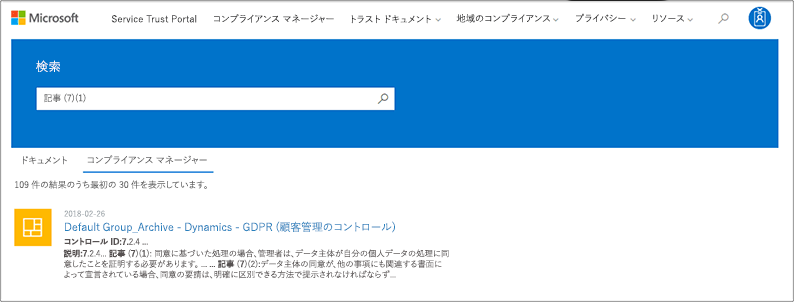
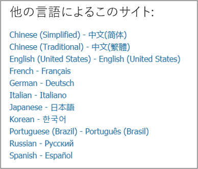

# Microsoft Service Trust Portal を使い始める

Microsoft Service Trust Portal は、Microsoft のセキュリティ、プライバシー、コンプライアンスのプラクティスに関するさまざまなコンテンツ、ツール、およびその他のリソースを提供します。
  
## サービス信頼ポータルへのアクセス

Service Trust Portal には、クラウドサービスおよびお客様のデータを保護する Microsoft の制御とプロセスの実装に関する詳細が含まれています。 サービス信頼ポータルの一部のリソースにアクセスするには、Microsoft クラウドサービスアカウント (Azure Active Directory 組織アカウントまたは Microsoft アカウント) を使用して認証済みユーザーとしてログインし、Microsoft を確認して同意する必要があります。コンプライアンス資料の機密保持契約。
  
**既存のお客様**は、次の[https://aka.ms/STP](https://aka.ms/STP)オンラインサブスクリプション (試用版または有料版) のいずれかでサービス信頼ポータルにアクセスできます。 
  
- Office 365

- Dynamics 365

- Azure
    
 > [!NOTE]
 > 組織に関連付けられている Azure Active Directory アカウントは、コンプライアンスマネージャーのようなあらゆるドキュメントや機能にアクセスできます。 個人使用のために作成された Microsoft アカウントは、サービス信頼ポータルコンテンツへのアクセスを制限します。 
  
**Microsoft online services を評価する新しいお客様とお客様**
  
新しいアカウントを作成するか、試用版アカウントを作成するには、次のサインアップフォームのいずれかを使用します (試用版アカウントにも使用されます)。
  
- 新しい[office 365 Business 試用版アカウント](https://go.microsoft.com/fwlink/p/?LinkID=507653)または新しい[office 365 Enterprise 試用版アカウント](https://go.microsoft.com/fwlink/p/?LinkID=698279)にサインアップする

- 新しい[Dynamics 365 試用版アカウント](https://go.microsoft.com/fwlink/?LinkId=252780)にサインアップする

- 新しい[Azure 試用版アカウント](https://go.microsoft.com/fwlink/?LinkId=722737)にサインアップします。 
    
無料試用版またはサブスクリプションのいずれかにサインアップする場合は、Azure Active Directory を有効にして、STP へのアクセスをサポートする必要があります。
  
## Service Trust Portal の使用

サービス信頼ポータルの機能とコンテンツは、メインメニューからアクセスできます。
  

次のセクションでは、メインメニューの各項目について説明します。
  
### Service Trust Portal

**Service Trust Portal**リンクには、ホームページが表示されます。 これにより、ホームページにすばやく戻ることができます。

### コンプライアンス

次のコンプライアンス関連のツールとリソースが提供されます。

- **監査レポート**-Microsoft のクラウドサービスに関する個別の監査および評価レポートの一覧が表示されます。 これらのレポートは、次のようなデータ保護標準および規制要件に対する Microsoft Cloud services のコンプライアンスに関する情報を提供します。
  
    - 国際標準化機構 (ISO)
    - サービス組織の制御 (SOC)
    - アメリカ国立標準技術研究所 (NIST)
    - Federal Risk and Authorization Management Program (FedRAMP)
    - EU 一般データ保護規則 (GDPR)

  監査レポートと、[**監査レポート**] ページへのリンクに関する情報も、サービス信頼ポータルのホームページに表示されます。 
  
- **コンプライアンスマネージャー** -コンプライアンスマネージャーは、office 365、Dynamics 365 などの Microsoft クラウドサービスに関連する組織のコンプライアンスアクティビティを追跡、割り当て、および検証するために役立つ、ワークフローベースのリスク評価ツールです。Azure. コンプライアンスマネージャーを使用して、クラウドの共有責任モデルで法令遵守を管理します。 詳細については、「[コンプライアンスマネージャーを使用して、Microsoft クラウドサービスを使用する際のデータ保護と規制要件を満たす](meet-data-protection-and-regulatory-reqs-using-microsoft-cloud.md)」を参照してください。

### 業界 & 地域

Microsoft クラウドサービスに関する業界固有または地域固有のコンプライアンス情報を提供します。

- **業界**: Microsoft クラウドサービスがこれらの業界の標準および規制に準拠できるようにするための情報と、お客様のための業界固有のランディングページが提供されています。

    - Education
    - 金融サービス
    - 合衆国
    - 正常性
    - 製造
    - 小売

- **地域**-さまざまな国のさまざまな法律に準拠した Microsoft クラウドサービスに関する法的な意見を提供します。 特定の国にはオーストラリア、チェコ共和国、ドイツ、ポーランド、ルーマニア、スペイン、英国が含まれます。
  
### ドキュメント & リソース

さまざまなセキュリティの実装と設計情報を提供し、Microsoft Cloud services がデータを安全に保持する方法について理解することで、コンプライアンスの目標を簡単に達成できるようにすることを目標としています。 コンテンツを確認するには、[ **Documents _AMP_ Resources** ] ページで、いずれかのオプションを選択します。

- ホワイトペーパー、Faq、およびハウツー記事
- コンプライアンスガイド
- Pen テストとセキュリティ評価
- セキュリティ スコア
- Azure のセキュリティとコンプライアンスの青写真
- 監査対象のコントロール
  
### セキュリティ センター

Microsoft セキュリティ[センター](https://www.microsoft.com/trustcenter)へのリンク。これにより、microsoft クラウドでのセキュリティ、コンプライアンス、およびプライバシーに関する詳細情報が提供されます。 これには、Microsoft クラウドサービスの機能に関する情報が含まれています。この情報には、GDPR の特定の要件に対応するために役立つドキュメント、GDPR のアカウンタビリティに役立つドキュメント、および技術および組織の測定基準についての理解を深めることができます。Microsoft は、GDPR をサポートするために実行しました。
  
### My Library

この新機能を使用すると、ドキュメントを保存 (または*pin*) して、自分のライブラリページにすばやくアクセスできるようにすることができます。 また、個人用ライブラリのドキュメントが更新されたときに Microsoft が電子メールメッセージを送信するように通知を設定することもできます。 詳細については、この記事の「 [My Library](#my-library-1) 」セクションを参照してください。

### 管理者

グローバル管理者アカウントのみが使用できる管理機能。 このオプションは、全体管理者としてサインインしている場合にのみ表示されます。
  
 [**設定**] ページでは、コンプライアンスマネージャーへの役割ベースのアクセスを割り当てることができます。 詳細については、「コンプライアンスマネージャーを使用する」の「アクセス許可と役割ベースのアクセス制御」セクションを参照し、「 [Microsoft クラウドサービスを使用するときのデータ保護と規制の要件を満たす」を](meet-data-protection-and-regulatory-reqs-using-microsoft-cloud.md#permissions-and-role-based-access-control)参照してください。
  
### 検索

[サービス信頼ポータル] ページの右上隅にある虫眼鏡をクリックして、ボックスを展開し、検索語句を入力して**** enter キーを押します。

  
 検索**** ページが表示されます。検索語が検索ボックスに表示され、下に表示されている検索結果が表示されます。
  

既定では、検索はドキュメントの結果を返します。 ドロップダウンリストを使用して、表示されるドキュメントの一覧を絞り込むことができます。 複数のフィルターを使用して、ドキュメントの一覧を絞り込むことができます。 フィルターには、特定のクラウドサービス、コンプライアンスのカテゴリ、セキュリティプラクティス、地域、業界などが含まれます。 ドキュメント名のリンクをクリックして、ドキュメントをダウンロードします。
  
コンプライアンスマネージャーの評価からコントロールをリストするには、検索用語をクリックして、[**コンプライアンスマネージャー**] をクリックします。 検索結果には、評価が作成された日付、評価グループの名前、適用可能な Microsoft クラウドサービス、およびそのコントロールが Microsoft であるか顧客が管理されているかが表示されます。 コントロールの名前をクリックして、コンプライアンスマネージャーの評価でコントロールを表示します。
  

  
> [!NOTE]
> Service Trust Portal のレポートとドキュメントは、発行後、または新しいバージョンのドキュメントが使用可能になるまで、少なくとも12か月間ダウンロードできます。
  
## My Library

My Library 機能を使用して、サービス信頼ポータルのドキュメントとリソースを [My Library] ページに追加します。 これにより、関連するドキュメントを1か所でアクセスできるようになります。  自分のライブラリにドキュメントを追加するには、ドキュメントの右側にある [.. **.** ] メニューをクリックし、[**ライブラリに保存**] を選択します。 1つまたは複数のドキュメントの横にあるチェックボックスをクリックし、ページの上部にある [**ライブラリに保存**] をクリックすることによって、複数のドキュメントを My Library に追加することができます。

また、通知機能を使用すると、個人用ライブラリに追加したドキュメントが Microsoft によって更新されたときに電子メールメッセージが送信されるように、個人用ライブラリを構成することができます。 通知を設定するには、[マイライブラリ] に移動して [**通知設定**] をクリックします。 通知の頻度を選択し、組織内で通知の送信先となる電子メールアドレスを指定することができます。 電子メール通知には、更新されたドキュメントへのリンクと、更新プログラムの簡単な説明が含まれます。

また、通知を有効にするかどうかに関係なく、過去30日間以内に更新された My ライブラリ内のドキュメントを識別することにも注意してください。 更新プログラムの簡単な説明もツールヒントに表示されます。 

## スターターパック

Starter pack は、特定の業界向けの Microsoft クラウドサービスに関するドキュメントの合わせセットです。 現在、Service Trust Portal は、金融サービス組織に対して次の3つのスターターパックを提供しています。 これらのスターターパックを使用すると、組織は Microsoft クラウドのセキュリティ、コンプライアンス、およびプライバシーを評価および評価し、高度な規制のある金融サービス業界に Microsoft Cloud services を実装するのに役立つガイダンスを提供します。

- **評価版スターターパック**-金融サービス組織のための Microsoft クラウドの初期評価に使用します。

- **アセスメントスターターパック**-評価後、このスターターパックのチェックリストとその他のガイダンスを使用して、組織がセキュリティ、コンプライアンス、プライバシーに関連するリスクを評価できるようにします。

- **Audit Starter pack** -ユーザーこのスターターパックでは、監査コントロールとその他のツールを使用して、組織のリスクを軽減するように Microsoft クラウドサービスの実装を支援するためのガイダンスを提供します。

これらのスターターパックにアクセスするには、「 **Service Trust Portal > 工業 & Regions > 工業ソリューション > 金融サービス**」にアクセスしてください。 スターターパックからドキュメントを開いたり、ダウンロードしたり、自分のライブラリに保存したりすることができます。

## ローカライズのサポート

Service Trust Portal では、ページコンテンツを異なる言語で表示できます。 ページの言語を変更するには、ページの左下隅にある地球のアイコンをクリックして、任意の言語を選択します。 
  

  
## フィードバック

サービス信頼ポータル、またはポータルの使用時に発生するエラーについてのご質問にお答えすることができます。 また、STP ページの下部にある [フィードバック] リンクを使用して、サービス信頼ポータルコンプライアンスレポートに関する質問やフィードバックをお寄せいただくこともできます。
  
フィードバックは我々にとって非常に重要です。 ページの下部にある [フィードバック] ボタンをクリックして、お客様や製品の機能を向上させるためのご意見やご提案をお寄せください。
  

