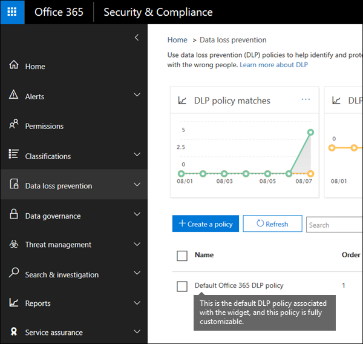

# 既定の DLP ポリシーの使用を開始するGet started with the default DLP policy

最初のデータ損失防止 (DLP) ポリシーを作成する前に、DLP は既定のポリシーを使用して機密情報を保護するのに役立ちます。Before you even create your first data loss prevention (DLP) policy, DLP is helping to protect your sensitive information with a default policy. この既定のポリシーとその推奨事項 (以下を参照) は、クレジットカード番号を含む電子メールやドキュメントが組織外のユーザーと共有されたことを通知することにより、機密コンテンツの安全性を確保するのに役立ちます。This default policy and its recommendation (shown below) help keep your sensitive content secure by notifying you when email or documents containing a credit card number were shared with someone outside your organization. この推奨事項は、セキュリティ&amp;コンプライアンスセンターの**ホーム**ページに表示されます。You'll see this recommendation on the **Home** page of the Security &amp; Compliance Center. 
  
このウィジェットを使用すると、共有された機密性の高い情報をすばやく表示し、1回または2つの方法で既定の DLP ポリシーを調整することができます。You can use this widget to quickly view when and how much sensitive information was shared, and then refine the default DLP policy in just a click or two. 完全にカスタマイズできるので、いつでも既定の DLP ポリシーを編集できます。You can also edit the default DLP policy at any time because it's fully customizable. 最初に推奨事項が表示されない場合は、[**推奨する**方法] セクションの下部にある [ **+ More** ] をクリックしてください。Note that if you don't see the recommendation at first, try clicking **+More** at the bottom of the **Recommended for you** section. 
  

  
## レポートを表示し、既定の DLP ポリシーを調整するView the report and refine the default DLP policy

ユーザーが組織外のユーザーと機密情報を共有していることがウィジェットに表示されたら、下部にある [ **DLP ポリシーの調整**] を選択します。When the widget shows you that users have shared sensitive information with people outside your organization, choose **Refine DLP policy** at the bottom. 
  
詳細レポートでは、過去30日間にクレジットカード番号が共有されたコンテンツの日時と量が表示されます。The detailed report shows you when and how much content containing credit card numbers was shared in the past 30 days. ルールの一致がウィジェットに表示されるまでに最大48時間かかる場合があることに注意してください。Note that rule matches can take up to 48 hours to show up in the widget.
  
機密情報を保護するために、既定の DLP ポリシーを使用します。To help protect the sensitive information, the default DLP policy:
  
- 少なくとも1つのクレジットカード番号が含まれている Exchange、SharePoint、OneDrive のコンテンツが組織外のユーザーと共有されていることを検出します。Detects when content in Exchange, SharePoint, and OneDrive that contains at least one credit card number is shared with people outside your organization.
    
- ポリシーヒントを表示し、その機密情報を組織外のユーザーと共有しようとしたときに、ユーザーに電子メール通知を送信します。Shows a policy tip and sends an email notification to users when they attempt to share this sensitive information with people outside your organization. これらのオプションの詳細については、「[電子メール通知を送信する」と「DLP ポリシーのポリシーヒントを表示する](use-notifications-and-policy-tips.md)」を参照してください。For more information on these options, see [Send email notifications and show policy tips for DLP policies](use-notifications-and-policy-tips.md).
    
- 詳細なアクティビティレポートを生成して、組織外のユーザーとコンテンツを共有しているユーザーや、自分が行ったことなどを追跡できるようにします。Generates detailed activity reports so that you can track things like who shared the content with people outside your organization and when they did it. [DLP レポート](view-the-dlp-reports.md)および[監査ログデータ](search-the-audit-log-in-security-and-compliance.md)(**アクティビティ** = **DLP**) を使用して、この情報を確認できます。You can use the [DLP reports](view-the-dlp-reports.md) and [audit log data](search-the-audit-log-in-security-and-compliance.md) (where **Activity** = **DLP**) to see this information.
    
既定の DLP ポリシーをすばやく変更するには、次のいずれかを選択します。To quickly refine the default DLP policy, you can choose to have it:
  
- この機密情報をユーザーが組織外のユーザーと共有する場合は、インシデントレポート電子メールを送信します。Send you an incident report email when users share this sensitive information with people outside your organization.
    
- 他のユーザーを電子メールインシデントレポートに追加します。Add other users to the email incident report.
    
- 機密情報を含むコンテンツへのアクセスをブロックします。ただし、必要に応じて、ユーザーによる上書きと共有または送信を許可します。Block access to the content containing the sensitive information, but allow the user to override and share or send if they need to.
    
インシデントレポートの詳細については、「[データ損失防止ポリシーの概要](data-loss-prevention-policies.md)」を参照してください。For more information on incident reports or restricting access, see [Overview of data loss prevention policies](data-loss-prevention-policies.md).
  
これらのオプションを後で変更する場合は、既定の DLP ポリシーをいつでも編集できます。次のセクションを参照してください。If you want to change these options later, you can edit the default DLP policy at any time - see the next section.
  

  
## 既定の DLP ポリシーを編集するEdit the default DLP policy

このポリシーは、 **Default Office 365 DLP ポリシー**という名前で、セキュリティ&amp;コンプライアンスセンターの [**ポリシー** ] ページの [**データ損失防止**] の下に表示されます。This policy is named **Default Office 365 DLP policy** and appears under **Data loss prevention** on the **Policy** page of the Security &amp; Compliance Center. 
  
このポリシーは完全にカスタマイズ可能ですが、最初から自分で作成した DLP ポリシーと同じです。This policy is fully customizable, the same as any DLP policy that you create yourself from scratch. また、ポリシーを無効にするか削除して、ユーザーがポリシーヒントや電子メール通知を受信しなくなるようにすることもできます。You can also turn off or delete the policy, so that your users no longer receive policy tips or email notifications.
  

  
## ウィジェットが表示されない場合When the widget does and does not appear

その他の保護された**共有コンテンツ**という名前のウィジェットは\*\*\*\* 、セキュリティ&amp; /コンプライアンスセンターのホームページにある [**推奨事項**] セクションに表示されます。The widget named **Further protect shared content** appears in the **Recommended for you** section of the **Home** page of the Security &amp; Compliance Center. 
  
このウィジェットは、次の場合にのみ表示されます。This widget appears only when:
  
- セキュリティ&amp;コンプライアンスセンターまたは Exchange 管理センターにデータ損失防止ポリシーはありません。There are no data loss prevention policies in the Security &amp; Compliance Center or Exchange admin center. このウィジェットは DLP の使用を開始するためのものなので、既に DLP ポリシーがある場合には表示されません。This widget is intended to help you get started with DLP, so it doesn't appear if you already have DLP policies.
    
- 過去30日間に、少なくとも1つのクレジットカードが含まれるコンテンツが組織外のユーザーと共有されています。Content containing least one credit card has been shared with someone outside your organization in the past 30 days.
    
ルールの一致がウィジェットで利用できるようになるまでに最大48時間かかる場合があるため、外部で共有される機密情報が検出された後は、推奨事項が表示されるまで最大で2日かかる場合があることに注意してください。Note that rule matches can take up to 48 hours to be available to the widget, so after sensitive information shared externally is detected, it may take up to two days for the recommendation to appear.
  
最後に、ウィジェットを使用して既定の DLP ポリシーを調整すると、そのウィジェットは**ホーム**ページに表示されなくなります。Finally, after you use the widget to refine the default DLP policy, the widget disappears from the **Home** page. 
  

