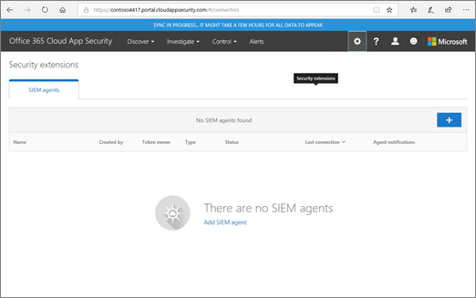
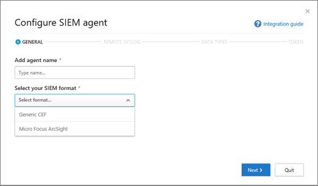
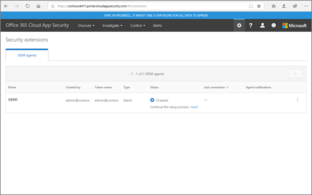
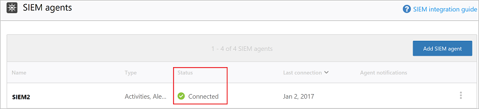

# <a name="integrate-your-siem-server-with-office-365-cloud-app-security"></a>SIEM サーバーと Office 365 Cloud App Security を統合する
  
|評価 * *\>**|計画 * *\>**|配置 * *\>**|使用率。|
|:-----|:-----|:-----|:-----|
|[評価を開始します。](office-365-cas-overview.md) <br/> |[計画の開始します。](get-ready-for-office-365-cas.md) <br/> |コースです!  <br/> [次の手順](utilization-activities-for-ocas.md) <br/> |[使用します。](utilization-activities-for-ocas.md) <br/> |
   
## <a name="overview-and-prerequisites"></a>概要と前提条件

警告の集中型の監視を有効にするセキュリティ情報およびイベント管理 (SIEM) サーバーを使用して[Office 365 のクラウド アプリケーションのセキュリティ](get-ready-for-office-365-cas.md)を統合できます。これは、クラウド サービスを使用している組織で特に効果的とオンプレミスのサーバー アプリケーションです。SIEM サーバーとの統合により、セキュリティ チームは、特定のセキュリティ保護手順を自動化し、クラウド ・ ベースの間に相関関連づけることによって、セキュリティの一般的なワークフローを維持しながら、Office 365 アプリケーションの保護を強化して、設置型のイベントです。  
  
とき、最初に、Office 365 のクラウド アプリケーションのセキュリティと、SIEM のサーバーを統合すると、最後の 2 日間からの通知から転送されます SIEM サーバーとすべてのアラートに後で (選択したフィルターに基づいて)。さらに、長期間、有効にすると、再度、この機能を無効にした場合、過去 2 日間の通知とし、すべてのアラートの後に転送します。

### <a name="siem-integration-architecture"></a>SIEM の統合アーキテクチャ

SIEM のエージェントは、組織のネットワークに設定されます。SIEM エージェントが構成されているデータ型を取得を展開し、構成すると Office 365 クラウド アプリケーション セキュリティ RESTful Api を使用するように (警告)。トラフィックは、ポート 443 の HTTPS の暗号化されたチャネル経由で送信されます。
  
SIEM エージェントでは、Office 365 のクラウド アプリケーションのセキュリティからデータを取得、Syslog メッセージを (TCP または UDP のカスタム ポート) のセットアップ中に提供されているネットワークの構成を使用して、ローカルの SIEM サーバーに送信します。


### <a name="supported-siem-servers"></a>SIEM サーバーがサポートされています。

現在、office 365 のクラウド アプリケーションのセキュリティには、次の SIEM サーバーがサポートされています。
- Arcsight 社のマイクロ フォーカス
- 汎用 CEF

### <a name="prerequisites"></a>前提条件

- この資料で説明するタスクを実行するには、グローバル管理者またはセキュリティ管理者である必要があります。参照してください[では、Office 365 のセキュリティ アクセス許可&amp;コンプライアンス センター](permissions-in-the-security-and-compliance-center.md)

- 組織の[Office 365 のクラウド アプリケーションのセキュリティを有効に](turn-on-office-365-cas.md)するが必要です。

- Office 365 の[監査ログを記録](turn-audit-log-search-on-or-off.md)を有効する必要があります。

- SIEM サーバー統合を構成するのには次の要件を満たす標準的なサーバーが必要です。
    - OS: Windows または Linux を (これは、仮想マシンを使用できます)
    - CPU: 2
    - ディスクの空き容量: 20 GB
    - 2 GB の RAM。
    - インストールされている[oracle Java 8](http://www.oracle.com/technetwork/java/javase/downloads/index.html)
    - ファイアウォールが[ネットワークの要件](https://docs.microsoft.com/cloud-app-security/network-requirements)に従って構成されています。

- **リモートの syslog ホスト**と**ポート番号の Syslot**に関する詳細情報が必要です。ネットワーク管理者またはセキュリティ管理者はその情報を特定することがあります。 

- [JAR ファイル](https://go.microsoft.com/fwlink/?linkid=838596)、SIEM のサーバーを統合する必要がありますをダウンロードするのには、[ソフトウェア ライセンス条項](https://go.microsoft.com/fwlink/?linkid=862491)に同意する必要があります。
 
## <a name="step-1-set-it-up-a-siem-agent-in-office-365-cloud-app-security"></a>手順 1: Office 365 のクラウド アプリケーションのセキュリティの SIEM エージェントを設定します。

1. クラウド アプリケーションのセキュリティ関連ポータルに移動 ([https://portal.cloudappsecurity.com](https://portal.cloudappsecurity.com)) し、サインインします。
  
2. **設定**] をクリックして\>**セキュリティ拡張機能**、し、SIEM のエージェントを選択します。<br/>


3. **SIEM の追加のエージェント**を選択します。<br/>
    
4. **ウィザードの開始**」を選択します。<br/> 
    
5. **全般**の手順では、名、および **、SIEM の形式を選択して**指定しの**詳細設定**は、その形式に関連するを設定します。**次へ**を選択します。<br/>
    
6. **リモートの Syslog**の手順で、IP アドレスまたは**リモートの syslog ホスト**と**ポート番号の Syslog**のホスト名を指定します。リモートの Syslog プロトコルとして TCP または UDP を選択します。(使用することがない場合、これらの詳細を取得するには、ネットワーク管理者またはセキュリティ管理者です。)**次へ**を選択します。<br/>
  
7. ステップでは、**データ型**、次のいずれかを実行し、[**次へ**] をクリックします。
    - **すべてのアラート**の既定の設定をしてください。<br/>または
    - **すべてのアラート**をクリックし、[**特定のフィルター**を選択します。SIEM サーバーに送信するアラートの種類を選択するためのフィルターを定義します。<br/>
  
8. [おめでとうございます] 画面で、トークンをコピーし、後にします。<br/>![SIEM のエージェントの作成] 画面](media/SIEMAgentFinished.png) 

> [!IMPORTANT]
> この時点で、Office 365 クラウド アプリケーションのセキュリティで、SIEM のエージェントを設定しているが、SIEM のサーバの統合がまだ完了していません。SIEM のサーバの統合を続行するのには次の手順に進みます。

[閉じる] をクリックし、セキュリティ拡張機能の画面上に、ウィザードを終了すると、テーブルに追加する SIEM エージェントを表示できます。後で接続されていることになるまで**作成済**] ステータスが表示されます。


    
## <a name="step-2-download-a-jar-file-and-run-it-on-your-siem-server"></a>手順 2: JAR ファイルをダウンロードし、SIEM サーバーで実行します。

1. [マイクロソフト クラウド アプリケーションのセキュリティの SIEM エージェント](https://go.microsoft.com/fwlink/?linkid=838596)をダウンロードして、フォルダーに解凍します。[(する必要がありますソフトウェア ライセンス条項](https://go.microsoft.com/fwlink/?linkid=862491)に同意先に進む。) 
    
2. .Jar ファイルを zip 形式のフォルダーから抽出し、SIEM のサーバー上で実行します。
    
3. ファイルを実行すると、次の実行: コマンド。<br/>
  ```
  java -jar mcas-siemagent-0.87.20-signed.jar [--logsDirectory DIRNAME] [--proxy ADDRESS[:PORT]] --token TOKEN
  ```
### <a name="important-notes"></a>重要事項

- SIEM エージェントのバージョンによってファイル名が異なる場合があります。 

- SIEM サーバー上の JAR ファイルは、サーバーのセットアップ中に実行することをお勧めします。

    - **Windows**:**ユーザーがログオンしているかどうかどうかを実行**するタスクを設定し**より長い場合にタスクを停止する**オプションをオフにすることを確認、スケジュールされたタスクとして実行します。

    - **Linux**: を指定して実行コマンドを追加、**&** に、`rc.local`ファイルです。 <br/>例:<br/> 
    ```
    java -jar mcas-siemagent-0.87.20-signed.jar [--logsDirectory DIRNAME] [--proxy ADDRESS[:PORT]] --token TOKEN &
    ```

- 括弧内のパラメーターはオプションであり、該当する場合にのみ使用する必要があります。次の変数を使用します。

    - **DIRNAME**は、デバッグ ログのローカル エージェントを使用するディレクトリへのパスです。

    - **アドレス [: ポート]** は、プロキシ サーバーのアドレスと、インターネットに接続するサーバーを使用するポートです。

    - **トークン**は、最初の手順でコピーした SIEM エージェントのトークンです。

    - ヘルプを表示するには、次のように入力します。 `-h`。 
  
## <a name="step-3-validate-that-the-siem-agent-is-working"></a>手順 3: SIEM エージェントが動作していることを検証します。

1. **接続エラー**と Office 365 のクラウド アプリケーションのセキュリティ関連ポータルの SIEM のエージェントの状態が設定されていないエージェントの通知がない**切断**していることを確認してください。<br/>たとえば、ご覧の SIEM サーバーが接続されています。<br/><br/>ご覧の SIEM サーバー接続を切断します。<br/> 
  
2. /SIEM の Syslog サーバーに Office 365 のクラウド アプリケーションのセキュリティの警告が届きましたと表示になっていることを確認します。
  
## <a name="what-the-logfiles-look-like"></a>ログ ファイルがどのように

SIEM のサーバーに送信される可能性があります警告ログ ファイルの例を以下に示します。

```
2017-07-15T20:42:30.531Z CEF:0|MCAS|SIEM_Agent|0.102.17|ALERT_CABINET_EVENT_MATCH_AUDIT|myPolicy|3|externalId=596a7e360c204203a335a3fb start=1500151350531 end=1500151350531 msg=Activity policy ''myPolicy'' was triggered by ''admin@box-contoso.com'' suser=admin@box-contoso.com destinationServiceName=Box cn1Label=riskScore cn1= cs1Label=portalURL cs1=https://cloud-app-security.com/#/alerts/596a7e360c204203a335a3fb cs2Label=uniqueServiceAppIds cs2=APPID_BOX cs3Label=relatedAudits cs3=1500151288183_acc891bf-33e1-424b-a021-0d4370789660 cs4Label=policyIDs cs4=59f0ab82f797fa0681e9b1c7

2017-07-16T09:36:26.550Z CEF:0|MCAS|SIEM_Agent|0.102.17|ALERT_CABINET_EVENT_MATCH_AUDIT|test-activity-policy|3|externalId=596b339b0c204203a33a51ae start=1500197786550 end=1500197786550 msg=Activity policy ''test-activity-policy'' was triggered by ''user@contoso.com'' suser=user@contoso.com destinationServiceName=Salesforce cn1Label=riskScore cn1= cs1Label=portalURL cs1=https://cloud-app-security.com/#/alerts/596b339b0c204203a33a51ae cs2Label=uniqueServiceAppIds cs2=APPID_SALESFORCE cs3Label=relatedAudits cs3=1500197720691_b7f6317c-b8de-476a-bc8f-dfa570e00349 cs4Label=policyIDs cs4=

2017-07-16T09:17:03.361Z CEF:0|MCAS|SIEM_Agent|0.102.17|ALERT_CABINET_EVENT_MATCH_AUDIT|test-activity-policy3|3|externalId=596b2fd70c204203a33a3eeb start=1500196623361 end=1500196623361 msg=Activity policy ''test-activity-policy3'' was triggered by ''admin@contoso.com'' suser=admin@contoso.com destinationServiceName=Office 365 cn1Label=riskScore cn1= cs1Label=portalURL cs1=https://cloud-app-security.com/#/alerts/596b2fd70c204203a33a3eeb cs2Label=uniqueServiceAppIds cs2=APPID_O365 cs3Label=relatedAudits cs3=1500196549157_a0e01f8a-e29a-43ae-8599-783c1c11597d cs4Label=policyIDs cs4=

2017-07-16T09:17:15.426Z CEF:0|MCAS|SIEM_Agent|0.102.17|ALERT_CABINET_EVENT_MATCH_AUDIT|test-activity-policy|3|externalId=596b2fd70c204203a33a3eec start=1500196635426 end=1500196635426 msg=Activity policy ''test-activity-policy'' was triggered by ''admin@contoso.com'' suser=admin@contoso.com destinationServiceName=Microsoft Office 365 admin center cn1Label=riskScore cn1= cs1Label=portalURL cs1=https://cloud-app-security.com/#/alerts/596b2fd70c204203a33a3eec cs2Label=uniqueServiceAppIds cs2=APPID_O365_PORTAL cs3Label=relatedAudits cs3=1500196557398_3e102b20-d9fa-4f66-b550-8c7a403bb4d8 cs4Label=policyIDs cs4=59f0ab35f797fa9811e9b1c7

2017-07-16T09:17:46.290Z CEF:0|MCAS|SIEM_Agent|0.102.17|ALERT_CABINET_EVENT_MATCH_AUDIT|test-activity-policy4|3|externalId=596b30200c204203a33a4765 start=1500196666290 end=1500196666290 msg=Activity policy ''test-activity-policy4'' was triggered by ''admin@contoso.com'' suser=admin@contoso.com destinationServiceName=Microsoft Exchange Online cn1Label=riskScore cn1= cs1Label=portalURL cs1=https://cloud-app-security.com/#/alerts/596b30200c204203a33a4765 cs2Label=uniqueServiceAppIds cs2=APPID_OUTLOOK cs3Label=relatedAudits cs3=1500196587034_a8673602-7e95-46d6-a1fe-c156c4709c5d cs4Label=policyIDs cs4=

2017-07-16T09:41:04.369Z CEF:0|MCAS|SIEM_Agent|0.102.17|ALERT_CABINET_EVENT_MATCH_AUDIT|test-activity-policy2|3|externalId=596b34b10c204203a33a5240 start=1500198064369 end=1500198064369 msg=Activity policy ''test-activity-policy2'' was triggered by ''user2@test15-adallom.com'' suser=user2@test15-adallom.com destinationServiceName=Google cn1Label=riskScore cn1= cs1Label=portalURL cs1=https://cloud-app-security.com/#/alerts/596b34b10c204203a33a5240 cs2Label=uniqueServiceAppIds cs2=APPID_33626 cs3Label=relatedAudits cs3=1500197996117_fd71f265-1e46-4f04-b372-2e32ec874cd3 cs4Label=policyIDs cs4=
```

別のサンプルでは、CEF の形式では、この時間を次のとおりです。


|CEF のフィールド名  | 説明  |
|---------|---------|
|開始     | アラートのタイムスタンプ        |
|終わり     | アラートのタイムスタンプ        |
|rt     | アラートのタイムスタンプ        |
|msg     | Office 365 のクラウド アプリケーションのセキュリティ関連ポータルに示すようにアラートの説明        |
|suser     | 警告の対象ユーザー        |
|destinationServiceName     | 元のアプリケーションでは、Office 365、SharePoint、または OneDrive などの警告        |
|csLabel     | 異なります (ラベルでは、さまざまな意味を持っています)。通常、ラベルは、自明ですが、targetObjects のようにします。        |
|cs     | ラベル (ラベルの例に従って、アラートの対象ユーザー) などに対応する情報        |

## <a name="additional-tasks-as-needed"></a>(必要に応じて) その他のタスク

SIEM サーバーを構成し、Office 365 のクラウド アプリケーションのセキュリティと統合して、トークンを再生成し、SIEM のエージェントを編集または、SIEM のエージェントを削除する必要があります。次のセクションでは、これらのタスクを実行する方法について説明します。

### <a name="regenerate-a-token"></a>トークンを再生成します。

ユーザーのトークンを紛失した場合に、1 つが再生成できます。 

1. Office 365 のクラウド アプリケーションのセキュリティ関連ポータルに ([https://portal.cloudappsecurity.com](https://portal.cloudappsecurity.com))、**設定**を選択して > **セキュリティ拡張機能**です。

2. テーブルでは、SIEM エージェントの行を探します。 

3. 、省略記号をクリックし、**トークンを再生成**します。<br/>
  
### <a name="edit-a-siem-agent"></a>SIEM エージェントを編集します。

1. Office 365 のクラウド アプリケーションのセキュリティ関連ポータルに ([https://portal.cloudappsecurity.com](https://portal.cloudappsecurity.com))、**設定**を選択して > **セキュリティ拡張機能**です。

2. SIEM エージェントの行を探します。 

3. 、省略記号をクリックし、し、[**編集**] をクリックします。(SIEM エージェントを編集する場合は、.jar ファイルを再実行する必要はありません; 自動的に更新)。<br/>
  
### <a name="delete-a-siem-agent"></a>SIEM エージェントを削除します。

1. Office 365 のクラウド アプリケーションのセキュリティ関連ポータルに ([https://portal.cloudappsecurity.com](https://portal.cloudappsecurity.com))、**設定**を選択して > **セキュリティ拡張機能**です。

2. SIEM エージェントの行を探します。 

3. 、省略記号をクリックし、[**削除**] をクリックします。<br/>

  
## <a name="next-steps"></a>次のステップ

- [Office 365 Cloud App Security 展開後の利用に関する作業](utilization-activities-for-ocas.md)
    
- [確認し、アラート アクションを実行](review-office-365-cas-alerts.md)
    
- [管理を簡略化する IP アドレスをグループ化します。](group-your-ip-addresses-in-ocas.md)
    

