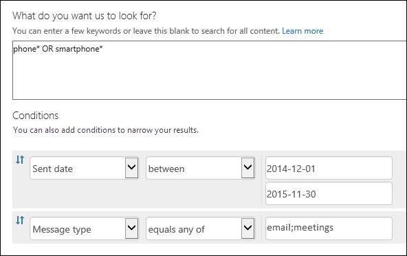

# <a name="keyword-queries-and-search-conditions-for-content-search"></a><span data-ttu-id="c2ec5-103">コンテンツ検索のキーワード クエリと検索条件</span><span class="sxs-lookup"><span data-stu-id="c2ec5-103">Keyword queries and search conditions for Content Search</span></span>

<span data-ttu-id="c2ec5-p101">このトピックでは、Office 365 のセキュリティ&amp;コンプライアンスのコンテンツ検索機能を使用して、Exchange Online の電子メールアイテム、および SharePoint および OneDrive for business サイトに保存されているドキュメントで検索できる電子メールおよびドキュメントプロパティについて説明します。拠点.また、セキュリティ&amp;コンプライアンスセンターの PowerShell で\*\* \*-new-compliancesearch\*\*コマンドレットを使用して、これらのプロパティを検索することもできます。このトピックでは、以下についても説明します。</span><span class="sxs-lookup"><span data-stu-id="c2ec5-p101">This topic describes the email and document properties that you can search for in email items in Exchange Online and documents stored on SharePoint and OneDrive for Business sites by using the Content Search feature in the Office 365 Security &amp; Compliance Center. You can also use the **\*-ComplianceSearch** cmdlets in Security &amp; Compliance Center PowerShell to search for these properties. The topic also describes:</span></span>   
  
- <span data-ttu-id="c2ec5-107">ブール検索演算子、検索条件、およびその他の検索クエリ手法を使用して、検索結果を調整します。</span><span class="sxs-lookup"><span data-stu-id="c2ec5-107">Using Boolean search operators, search conditions, and other search query techniques to refine your search results.</span></span>
    
- <span data-ttu-id="c2ec5-108">SharePoint と OneDrive for business で機密性の高いデータ型とカスタムの機密データ型を検索します。</span><span class="sxs-lookup"><span data-stu-id="c2ec5-108">Searching for sensitive data types and custom sensitive data types in SharePoint and OneDrive for Business.</span></span>
    
- <span data-ttu-id="c2ec5-109">組織外のユーザーと共有しているサイトコンテンツを検索する</span><span class="sxs-lookup"><span data-stu-id="c2ec5-109">Searching for site content that's shared with users outside of your organization</span></span>
    
<span data-ttu-id="c2ec5-110">コンテンツ検索を作成する方法の詳細な手順については、「 [Office 365 のコンテンツ検索](content-search.md)」を参照してください。</span><span class="sxs-lookup"><span data-stu-id="c2ec5-110">For step-by-step instructions on how to create a Content Search, see [Content Search in Office 365](content-search.md).</span></span>

  
> [!NOTE]
> <span data-ttu-id="c2ec5-p102">セキュリティ&amp; /コンプライアンスセンターのコンテンツ検索と、セキュリティ&amp;コンプライアンスセンター PowerShell の対応する\*\* \*-new-compliancesearch\*\*コマンドレットは、キーワードクエリ言語 (kql) を使用します。詳細については、「 [Keyword Query Language 構文 reference](https://go.microsoft.com/fwlink/?LinkId=269603)」を参照してください。</span><span class="sxs-lookup"><span data-stu-id="c2ec5-p102">Content Search in the Security &amp; Compliance Center and the corresponding **\*-ComplianceSearch** cmdlets in Security &amp; Compliance Center PowerShell use the Keyword Query Language (KQL). For more detailed information, see [Keyword Query Language syntax reference](https://go.microsoft.com/fwlink/?LinkId=269603).</span></span> 
  
## <a name="searchable-email-properties"></a><span data-ttu-id="c2ec5-113">検索可能なメール プロパティ</span><span class="sxs-lookup"><span data-stu-id="c2ec5-113">Searchable email properties</span></span>

<span data-ttu-id="c2ec5-p103">次の表に、セキュリティ&amp;コンプライアンスセンターでコンテンツ検索機能を使用するか、 **new-compliancesearch**または**new-compliancesearch**コマンドレットを使用して検索できる電子メールメッセージプロパティの一覧を示します。表には、各プロパティの_プロパティ: 値_の構文の例と、例によって返される検索結果の説明が含まれています。これら`property:value`のペアは、コンテンツ検索の [キーワード] ボックスに入力できます。</span><span class="sxs-lookup"><span data-stu-id="c2ec5-p103">The following table lists email message properties that can be searched by using the Content Search feature in the Security &amp; Compliance Center or by using the **New-ComplianceSearch** or the **Set-ComplianceSearch** cmdlet. The table includes an example of the  _property:value_ syntax for each property and a description of the search results returned by the examples. You can type these  `property:value` pairs in the keywords box for a Content Search.</span></span> 
  
|<span data-ttu-id="c2ec5-117">**プロパティ**</span><span class="sxs-lookup"><span data-stu-id="c2ec5-117">**Property**</span></span>|<span data-ttu-id="c2ec5-118">**プロパティの説明**</span><span class="sxs-lookup"><span data-stu-id="c2ec5-118">**Property description**</span></span>|<span data-ttu-id="c2ec5-119">**例**</span><span class="sxs-lookup"><span data-stu-id="c2ec5-119">**Examples**</span></span>|<span data-ttu-id="c2ec5-120">**例で返される検索結果**</span><span class="sxs-lookup"><span data-stu-id="c2ec5-120">**Search results returned by the examples**</span></span>|
|:-----|:-----|:-----|:-----|
|<span data-ttu-id="c2ec5-121">attachmentnames</span><span class="sxs-lookup"><span data-stu-id="c2ec5-121">AttachmentNames</span></span>|<span data-ttu-id="c2ec5-122">電子メール メッセージに添付されているファイルの名前。</span><span class="sxs-lookup"><span data-stu-id="c2ec5-122">The names of files attached to an email message.</span></span>|`attachmentnames:annualreport.ppt`  <br/> `attachmentnames:annual*`|<span data-ttu-id="c2ec5-p104">annualreport.ppt という名前の添付ファイルのあるメッセージ。2 番目の例では、ワイルドカードを使用して、添付ファイルのファイル名に「annual」の語が含まれるメッセージを返します。</span><span class="sxs-lookup"><span data-stu-id="c2ec5-p104">Messages that have an attached file named annualreport.ppt. In the second example, using the wildcard returns messages with the word "annual" in the file name of an attachment.</span></span>|
|<span data-ttu-id="c2ec5-125">Bcc</span><span class="sxs-lookup"><span data-stu-id="c2ec5-125">Bcc</span></span>|<span data-ttu-id="c2ec5-126">メール メッセージの BCC フィールド。<sup>1</sup></span><span class="sxs-lookup"><span data-stu-id="c2ec5-126">The BCC field of an email message.<sup>1</sup></span></span>|`bcc:pilarp@contoso.com`  <br/> `bcc:pilarp`  <br/> `bcc:"Pilar Pinilla"`|<span data-ttu-id="c2ec5-127">どの例も Bcc フィールドに「Pilar Pinilla」が含まれているメッセージを返します。</span><span class="sxs-lookup"><span data-stu-id="c2ec5-127">All examples return messages with Pilar Pinilla included in the Bcc field.</span></span>|
|<span data-ttu-id="c2ec5-128">Category</span><span class="sxs-lookup"><span data-stu-id="c2ec5-128">Category</span></span>| <span data-ttu-id="c2ec5-p105">検索するカテゴリを示します。カテゴリは、outlook または web 上の outlook (旧称 outlook web App) を使用してユーザーが定義できます。使用可能な値は次のとおりです。</span><span class="sxs-lookup"><span data-stu-id="c2ec5-p105">The categories to search. Categories can be defined by users by using Outlook or Outlook on the web (formerly known as Outlook Web App). The possible values are:</span></span>  <br/><br/>  <span data-ttu-id="c2ec5-132">blue</span><span class="sxs-lookup"><span data-stu-id="c2ec5-132">blue</span></span>  <br/>  <span data-ttu-id="c2ec5-133">green</span><span class="sxs-lookup"><span data-stu-id="c2ec5-133">green</span></span>  <br/>  <span data-ttu-id="c2ec5-134">orange</span><span class="sxs-lookup"><span data-stu-id="c2ec5-134">orange</span></span>  <br/>  <span data-ttu-id="c2ec5-135">purple</span><span class="sxs-lookup"><span data-stu-id="c2ec5-135">purple</span></span>  <br/>  <span data-ttu-id="c2ec5-136">red</span><span class="sxs-lookup"><span data-stu-id="c2ec5-136">red</span></span>  <br/>  <span data-ttu-id="c2ec5-137">yellow</span><span class="sxs-lookup"><span data-stu-id="c2ec5-137">yellow</span></span>|`category:"Red Category"`|<span data-ttu-id="c2ec5-138">元のメールボックスで「red」のカテゴリが割り当てられているメッセージ。</span><span class="sxs-lookup"><span data-stu-id="c2ec5-138">Messages that have been assigned the red category in the source mailboxes.</span></span>|
|<span data-ttu-id="c2ec5-139">CC</span><span class="sxs-lookup"><span data-stu-id="c2ec5-139">Cc</span></span>|<span data-ttu-id="c2ec5-140">メール メッセージの CC フィールド。<sup>1</sup></span><span class="sxs-lookup"><span data-stu-id="c2ec5-140">The CC field of an email message.<sup>1</sup></span></span>|`cc:pilarp@contoso.com`  <br/> `cc:"Pilar Pinilla"`|<span data-ttu-id="c2ec5-141">どちらの例も、CC フィールドに Pilar Pinilla が指定されたメッセージ。</span><span class="sxs-lookup"><span data-stu-id="c2ec5-141">In both examples, messages with Pilar Pinilla specified in the CC field.</span></span>|
|<span data-ttu-id="c2ec5-142">Folderid</span><span class="sxs-lookup"><span data-stu-id="c2ec5-142">Folderid</span></span>|<span data-ttu-id="c2ec5-p106">特定のメールボックスフォルダーのフォルダー ID (GUID)。このプロパティを使用する場合は、指定したフォルダーが配置されているメールボックスを検索してください。指定したフォルダーのみが検索されることに注意してください。フォルダー内のサブフォルダーは検索されません。サブフォルダーを検索するには、検索するサブフォルダーの Folderid プロパティを使用する必要があります。</span><span class="sxs-lookup"><span data-stu-id="c2ec5-p106">The folder ID (GUID) of a specific mailbox folder. If you use this property, be sure to search the mailbox that the specified folder is located in. Note that only the specified folder will be searched. Any subfolders in the folder won't be searched. To search sub-folders, you need to use the Folderid property for the sub-folder you want to search.  </span></span><br/> <span data-ttu-id="c2ec5-148">Folderid プロパティを検索する方法と、スクリプトを使用して特定のメールボックスのフォルダー id を取得する方法の詳細については、「[対象化コレクションの Office 365 でコンテンツ検索を使用](use-content-search-for-targeted-collections.md)する」を参照してください。</span><span class="sxs-lookup"><span data-stu-id="c2ec5-148">For more information about searching for the Folderid property and using a script to obtain the folder IDs for a specific mailbox, see [Use Content Search in Office 365 for targeted collections](use-content-search-for-targeted-collections.md).</span></span>|`folderid:4D6DD7F943C29041A65787E30F02AD1F00000000013A0000`  <br/> `folderid:2370FB455F82FC44BE31397F47B632A70000000001160000 AND participants:garthf@contoso.com`|<span data-ttu-id="c2ec5-p107">最初の例では、指定されたメールボックスフォルダー内のすべてのアイテムを返します。2番目の例では、garthf@contoso.com によって送受信された、指定されたメールボックスフォルダー内のすべてのアイテムを返します。</span><span class="sxs-lookup"><span data-stu-id="c2ec5-p107">The first example returns all items in the specified mailbox folder. The second example return all items in the specified mailbox folder that were sent or received by garthf@contoso.com.</span></span>|
|<span data-ttu-id="c2ec5-151">From</span><span class="sxs-lookup"><span data-stu-id="c2ec5-151">From</span></span>|<span data-ttu-id="c2ec5-152">メール メッセージの送信者。<sup>1</sup></span><span class="sxs-lookup"><span data-stu-id="c2ec5-152">The sender of an email message.<sup>1</sup></span></span>|`from:pilarp@contoso.com`  <br/> `from:contoso.com`|<span data-ttu-id="c2ec5-153">指定されたユーザーによって送信された、または指定されたドメインから送信されたメッセージ。</span><span class="sxs-lookup"><span data-stu-id="c2ec5-153">Messages sent by the specified user or sent from a specified domain.</span></span>|
|<span data-ttu-id="c2ec5-154">HasAttachment</span><span class="sxs-lookup"><span data-stu-id="c2ec5-154">HasAttachment</span></span>|<span data-ttu-id="c2ec5-p108">メッセージに添付ファイルがあるかどうかを示します。**true**または**false**の値を使用します。</span><span class="sxs-lookup"><span data-stu-id="c2ec5-p108">Indicates whether or not a message has an attachment. Use the values **true** or **false**.</span></span>|`from:pilar@contoso.com AND hasattachment:true`|<span data-ttu-id="c2ec5-157">添付ファイルを持つ、指定されたユーザーによって送信されたメッセージ。</span><span class="sxs-lookup"><span data-stu-id="c2ec5-157">Messages sent by the specified user that have attachments.</span></span>|
|<span data-ttu-id="c2ec5-158">Importance</span><span class="sxs-lookup"><span data-stu-id="c2ec5-158">Importance</span></span>|<span data-ttu-id="c2ec5-p109">送信者がメッセージを送信するときに指定できる電子メール メッセージの重要度。既定では、送信者が重要度を **high** または **low** に設定していない限り、メッセージは普通の重要度で送信されます。  </span><span class="sxs-lookup"><span data-stu-id="c2ec5-p109">The importance of an email message, which a sender can specify when sending a message. By default, messages are sent with normal importance, unless the sender sets the importance as **high** or **low**.</span></span>|`importance:high`  <br/> `importance:medium`  <br/> `importance:low`|<span data-ttu-id="c2ec5-161">高重要度、中重要度、または低重要度とマークされているメッセージ。</span><span class="sxs-lookup"><span data-stu-id="c2ec5-161">Messages that are marked as high importance, medium importance, or low importance.</span></span>|
|<span data-ttu-id="c2ec5-162">IsRead</span><span class="sxs-lookup"><span data-stu-id="c2ec5-162">IsRead</span></span>|<span data-ttu-id="c2ec5-p110">メッセージが開封されたかどうかを示します。**true**または**false**の値を使用します。</span><span class="sxs-lookup"><span data-stu-id="c2ec5-p110">Indicates whether or not messages have been read. Use the values **true** or **false**.</span></span>|`isread:true`  <br/> `isread:false`|<span data-ttu-id="c2ec5-p111">最初の例では、isread プロパティが**True**に設定されたメッセージを返します。2番目の例では、isread プロパティが**False**に設定されたメッセージを返します。</span><span class="sxs-lookup"><span data-stu-id="c2ec5-p111">The first example returns messages with the IsRead property set to **True**. The second example returns messages with the IsRead property set to **False**.</span></span>|
|<span data-ttu-id="c2ec5-167">ItemClass</span><span class="sxs-lookup"><span data-stu-id="c2ec5-167">ItemClass</span></span>|<span data-ttu-id="c2ec5-p112">このプロパティを使用して、組織が Office 365 にインポートした特定のサードパーティのデータ型を検索します。このプロパティには、次の構文を使用します。`itemclass:ipm.externaldata.<third-party data type>*`</span><span class="sxs-lookup"><span data-stu-id="c2ec5-p112">Use this property to search specific third-party data types that your organization imported to Office 365. Use the following syntax for this property:  `itemclass:ipm.externaldata.<third-party data type>*`</span></span>|`itemclass:ipm.externaldata.Facebook* AND subject:contoso`  <br/> `itemclass:ipm.externaldata.Twitter* AND from:"Ann Beebe" AND "Northwind Traders"`|<span data-ttu-id="c2ec5-p113">最初の例では、Subject プロパティに "contoso" という単語が含まれる Facebook のアイテムを返します。2番目の例では、彩 Beebe によって投稿され、キーワード "Northwind Traders" が含まれている Twitter アイテムを返します。</span><span class="sxs-lookup"><span data-stu-id="c2ec5-p113">The first example returns Facebook items that contain the word "contoso" in the Subject property. The second example returns Twitter items that were posted by Ann Beebe and that contain the keyword phrase "Northwind Traders".  </span></span><br/> <span data-ttu-id="c2ec5-172">itemclass プロパティのサードパーティデータ型に使用する値の完全な一覧については、「[コンテンツ検索を使用して、Office 365 にインポートされたサードパーティのデータを検索する](use-content-search-to-search-third-party-data-that-was-imported.md)」を参照してください。</span><span class="sxs-lookup"><span data-stu-id="c2ec5-172">For a complete list of values to use for third-party data types for the ItemClass property, see [Use Content Search to search third-party data that was imported to Office 365](use-content-search-to-search-third-party-data-that-was-imported.md).</span></span>|
|<span data-ttu-id="c2ec5-173">Kind</span><span class="sxs-lookup"><span data-stu-id="c2ec5-173">Kind</span></span>| <span data-ttu-id="c2ec5-p114">検索する電子メールメッセージの種類。可能な値:</span><span class="sxs-lookup"><span data-stu-id="c2ec5-p114">The type of email message to search for. Possible values:</span></span>  <br/>  <span data-ttu-id="c2ec5-176">contacts</span><span class="sxs-lookup"><span data-stu-id="c2ec5-176">contacts</span></span>  <br/>  <span data-ttu-id="c2ec5-177">docs</span><span class="sxs-lookup"><span data-stu-id="c2ec5-177">docs</span></span>  <br/>  <span data-ttu-id="c2ec5-178">email</span><span class="sxs-lookup"><span data-stu-id="c2ec5-178">email</span></span>  <br/>  <span data-ttu-id="c2ec5-179">externaldata</span><span class="sxs-lookup"><span data-stu-id="c2ec5-179">externaldata</span></span>  <br/>  <span data-ttu-id="c2ec5-180">faxes</span><span class="sxs-lookup"><span data-stu-id="c2ec5-180">faxes</span></span>  <br/>  <span data-ttu-id="c2ec5-181">im</span><span class="sxs-lookup"><span data-stu-id="c2ec5-181">im</span></span>  <br/>  <span data-ttu-id="c2ec5-182">journals</span><span class="sxs-lookup"><span data-stu-id="c2ec5-182">journals</span></span>  <br/>  <span data-ttu-id="c2ec5-183">meetings</span><span class="sxs-lookup"><span data-stu-id="c2ec5-183">meetings</span></span>  <br/>  <span data-ttu-id="c2ec5-184">microsoft teams (Microsoft teams でチャット、会議、通話のアイテムを返す)</span><span class="sxs-lookup"><span data-stu-id="c2ec5-184">microsoftteams (returns items from chats, meetings, and calls in Microsoft Teams)</span></span>  <br/>  <span data-ttu-id="c2ec5-185">notes</span><span class="sxs-lookup"><span data-stu-id="c2ec5-185">notes</span></span>  <br/>  <span data-ttu-id="c2ec5-186">posts</span><span class="sxs-lookup"><span data-stu-id="c2ec5-186">posts</span></span>  <br/>  <span data-ttu-id="c2ec5-187">rssfeeds</span><span class="sxs-lookup"><span data-stu-id="c2ec5-187">rssfeeds</span></span>  <br/>  <span data-ttu-id="c2ec5-188">tasks</span><span class="sxs-lookup"><span data-stu-id="c2ec5-188">tasks</span></span>  <br/>  <span data-ttu-id="c2ec5-189">voicemail</span><span class="sxs-lookup"><span data-stu-id="c2ec5-189">voicemail</span></span>|`kind:email`  <br/> `kind:email OR kind:im OR kind:voicemail`  <br/> `kind:externaldata`|<span data-ttu-id="c2ec5-p115">最初の例では、検索条件に一致する電子メールメッセージを返します。2番目の例では、電子メールメッセージ、インスタントメッセージの会話 (Microsoft Teams での Skype for business の会話やチャットを含む)、および検索条件に一致する音声メッセージを返します。3番目の例では、検索条件を満たす Twitter、Facebook、Cisco jabber などのサードパーティのデータソースから、Office 365 のメールボックスにインポートされたアイテムを返します。詳細については、「 [Office 365 でサードパーティのデータをアーカイブ](https://go.microsoft.com/fwlink/p/?linkid=716918)する」を参照してください。</span><span class="sxs-lookup"><span data-stu-id="c2ec5-p115">The first example returns email messages that meet the search criteria. The second example returns email messages, instant messaging conversations (including Skype for Business conversations and chats in Microsoft Teams), and voice messages that meet the search criteria. The third example returns items that were imported to mailboxes in Office 365 from third-party data sources, such as Twitter, Facebook, and Cisco Jabber, that meet the search criteria. For more information, see [Archiving third-party data in Office 365](https://go.microsoft.com/fwlink/p/?linkid=716918).</span></span>|
|<span data-ttu-id="c2ec5-194">Participants</span><span class="sxs-lookup"><span data-stu-id="c2ec5-194">Participants</span></span>|<span data-ttu-id="c2ec5-195">メール メッセージ内のすべての送受信者フィールド。すなわち、From、To、CC、BCC の各フィールドです。<sup>1</sup></span><span class="sxs-lookup"><span data-stu-id="c2ec5-195">All the people fields in an email message; these fields are From, To, CC, and BCC.<sup>1</sup></span></span>|`participants:garthf@contoso.com`  <br/> `participants:contoso.com`|<span data-ttu-id="c2ec5-p116">garthf@contoso.com が送信元または送信先のメッセージ。2 番目の例は、contoso.com ドメイン内のユーザーが送信元または送信先のすべてのメッセージを返します。</span><span class="sxs-lookup"><span data-stu-id="c2ec5-p116">Messages sent by or sent to garthf@contoso.com. The second example returns all messages sent by or sent to a user in the contoso.com domain.</span></span>|
|<span data-ttu-id="c2ec5-198">Received</span><span class="sxs-lookup"><span data-stu-id="c2ec5-198">Received</span></span>|<span data-ttu-id="c2ec5-199">電子メール メッセージが受信者によって受信された日付。</span><span class="sxs-lookup"><span data-stu-id="c2ec5-199">The date that an email message was received by a recipient.</span></span>|`received:04/15/2016`  <br/> `received>=01/01/2016 AND received<=03/31/2016`|<span data-ttu-id="c2ec5-p117">2016年4月15日に受信したメッセージ。2番目の例では、2016年1月1日から2016年3月31日までの間に受信したすべてのメッセージを返します。</span><span class="sxs-lookup"><span data-stu-id="c2ec5-p117">Messages that were received on April 15, 2016. The second example returns all messages received between January 1, 2016 and March 31, 2016.</span></span>|
|<span data-ttu-id="c2ec5-202">Recipients</span><span class="sxs-lookup"><span data-stu-id="c2ec5-202">Recipients</span></span>|<span data-ttu-id="c2ec5-203">メール メッセージ内のすべての受信者フィールド。すなわち、To、CC、BCC の各フィールドです。<sup>1</sup></span><span class="sxs-lookup"><span data-stu-id="c2ec5-203">All recipient fields in an email message; these fields are To, CC, and BCC.<sup>1</sup></span></span>|`recipients:garthf@contoso.com`  <br/> `recipients:contoso.com`|<span data-ttu-id="c2ec5-p118">garthf@contoso.com に送信されたメッセージ。2 番目の例では、contoso.com ドメイン内のすべての受信者に送信されたメッセージを返します。</span><span class="sxs-lookup"><span data-stu-id="c2ec5-p118">Messages sent to garthf@contoso.com. The second example returns messages sent to any recipient in the contoso.com domain.</span></span>|
|<span data-ttu-id="c2ec5-206">Sent</span><span class="sxs-lookup"><span data-stu-id="c2ec5-206">Sent</span></span>|<span data-ttu-id="c2ec5-207">送信者によって電子メール メッセージが送信された日付。</span><span class="sxs-lookup"><span data-stu-id="c2ec5-207">The date that an email message was sent by the sender.</span></span>|`sent:07/01/2016`  <br/> `sent>=06/01/2016 AND sent<=07/01/2016`|<span data-ttu-id="c2ec5-208">指定された日付に送信された、または指定された日付範囲内に送信されたメッセージ。</span><span class="sxs-lookup"><span data-stu-id="c2ec5-208">Messages that were sent on the specified date or sent within the specified date range.</span></span>|
|<span data-ttu-id="c2ec5-209">Size</span><span class="sxs-lookup"><span data-stu-id="c2ec5-209">Size</span></span>|<span data-ttu-id="c2ec5-210">アイテムのサイズ (バイト数)。</span><span class="sxs-lookup"><span data-stu-id="c2ec5-210">The size of an item, in bytes.</span></span>|`size>26214400`  <br/> `size:1..1048567`|<span data-ttu-id="c2ec5-p119">25より大きいメッセージ8mb.2番目の例では、1 ~ 1048567 バイト (1 MB) のサイズのメッセージを返します。</span><span class="sxs-lookup"><span data-stu-id="c2ec5-p119">Messages larger than 25??MB. The second example returns messages from 1 through 1,048,567 bytes (1 MB) in size.</span></span>|
|<span data-ttu-id="c2ec5-213">Subject</span><span class="sxs-lookup"><span data-stu-id="c2ec5-213">Subject</span></span>|<span data-ttu-id="c2ec5-214">電子メール メッセージの件名行に含まれるテキスト。</span><span class="sxs-lookup"><span data-stu-id="c2ec5-214">The text in the subject line of an email message.</span></span>  <br/> <span data-ttu-id="c2ec5-p120">**注:** クエリで subject プロパティを使用すると、???the search は、検索するテキストが件名に含まれているすべてのメッセージを返します。つまり、クエリは、完全に一致するメッセージのみを返しません。たとえば、を検索`subject:"Quarterly Financials"`すると、件名が "四半期財務 2018" のメッセージが結果に含まれます。</span><span class="sxs-lookup"><span data-stu-id="c2ec5-p120">**Note:** When you use the Subject property in a query, ???the search returns all messages in which the subject line contains the text you're searching for. In other words, the query doesn't return only those messages that have an exact match. For example, if you search for  `subject:"Quarterly Financials"`, your results will include messages with the subject "Quarterly Financials 2018".</span></span>|`subject:"Quarterly Financials"`  <br/> `subject:northwind`|<span data-ttu-id="c2ec5-p121">件名行のテキスト内の任意の場所に "四半期財務" という語句が含まれるメッセージ。2番目の例では、件名行に "northwind" が含まれるすべてのメッセージを返します。</span><span class="sxs-lookup"><span data-stu-id="c2ec5-p121">Messages that contain the phrase "Quarterly Financials" anywhere in the text of the subject line. The second example returns all messages that contain the word northwind in the subject line.</span></span>|
|<span data-ttu-id="c2ec5-220">To</span><span class="sxs-lookup"><span data-stu-id="c2ec5-220">To</span></span>|<span data-ttu-id="c2ec5-221">メール メッセージの To フィールド。<sup>1</sup></span><span class="sxs-lookup"><span data-stu-id="c2ec5-221">The To field of an email message.<sup>1</sup></span></span>|`to:annb@contoso.com`  <br/> `to:annb ` <br/> `to:"Ann Beebe"`|<span data-ttu-id="c2ec5-222">どの例も、To: 行に「Ann Beebe」が指定されているメッセージを返します。</span><span class="sxs-lookup"><span data-stu-id="c2ec5-222">All examples return messages where Ann Beebe is specified in the To: line.</span></span>|
   
> [!NOTE]
> <span data-ttu-id="c2ec5-p122"><sup>1</sup>受信者プロパティの値には、電子メールアドレス (*ユーザープリンシパル名*または UPN とも呼ばれる)、表示名、またはエイリアスを使用して、ユーザーを指定できます。たとえば、annb@contoso.com、"b"、または "彩 Beebe" を使用して、ユーザー彩 Beebe を指定できます。</span><span class="sxs-lookup"><span data-stu-id="c2ec5-p122"><sup>1</sup> For the value of a recipient property, you can use email address (also called *user principal name* or UPN), display name, or alias to specify a user. For example, you can use annb@contoso.com, annb, or "Ann Beebe" to specify the user Ann Beebe.</span></span><br/><br/><span data-ttu-id="c2ec5-p123">受信者のプロパティ (From、To、Cc、Bcc、参加者、および受信者) を検索する場合、Office 365 は Azure Active Directory で検索して各ユーザーの id を拡張しようとします。 ユーザーが Azure Active Directory で見つかった場合、そのユーザーの電子メールアドレス (または UPN)、エイリアス、表示名、および LegacyExchangeDN を含むようにクエリが拡張されます。</span><span class="sxs-lookup"><span data-stu-id="c2ec5-p123">When searching any of the recipient properties (From, To, Cc, Bcc, Participants, and Recipients), Office 365 attempts to expand the identity of each user by looking them up in Azure Active Directory.  If the user is found in Azure Active Directory, the query is expanded to include the user's email address (or UPN), alias, display name, and LegacyExchangeDN.</span></span><br/><br/><span data-ttu-id="c2ec5-227">たとえば、のようなクエリが`participants:ronnie@contoso.com`に`participants:ronnie@contoso.com OR participants:ronnie OR participants:"Ronald Nelson" OR participants:"<LegacyExchangeDN>"`展開されます。</span><span class="sxs-lookup"><span data-stu-id="c2ec5-227">For example, a query such as `participants:ronnie@contoso.com` expands to `participants:ronnie@contoso.com OR participants:ronnie OR participants:"Ronald Nelson" OR participants:"<LegacyExchangeDN>"`.</span></span>

## <a name="searchable-site-properties"></a><span data-ttu-id="c2ec5-228">検索可能なサイトのプロパティ</span><span class="sxs-lookup"><span data-stu-id="c2ec5-228">Searchable site properties</span></span>

<span data-ttu-id="c2ec5-p124">次の表に、セキュリティ&amp;コンプライアンスセンターのコンテンツ検索機能を使用するか、 **new-compliancesearch**また**はを使用して検索できる SharePoint および OneDrive for business プロパティの一部を示します。new-compliancesearch**コマンドレット。表には、各プロパティの_プロパティ: 値_の構文の例と、例によって返される検索結果の説明が含まれています。</span><span class="sxs-lookup"><span data-stu-id="c2ec5-p124">The following table lists some of the SharePoint and OneDrive for Business properties that can be searched by using the Content Search feature in the Security &amp; Compliance Center or by using the **New-ComplianceSearch** or the **Set-ComplianceSearch** cmdlet. The table includes an example of the  _property:value_ syntax for each property and a description of the search results returned by the examples.</span></span> 
  
<span data-ttu-id="c2ec5-p125">検索できる sharepoint プロパティの完全な一覧については、「 [sharepoint のクロールされたプロパティと管理プロパティの概要](https://go.microsoft.com/fwlink/p/?LinkId=331599)」を参照してください。**クエリ**可能な列で**Yes**が設定されているプロパティを検索することができます。</span><span class="sxs-lookup"><span data-stu-id="c2ec5-p125">For a complete list of SharePoint properties that can be searched, see [Overview of crawled and managed properties in SharePoint](https://go.microsoft.com/fwlink/p/?LinkId=331599). Properties marked with a **Yes** in the **Queryable** column can be searched.</span></span> 
  
|<span data-ttu-id="c2ec5-233">**プロパティ**</span><span class="sxs-lookup"><span data-stu-id="c2ec5-233">**Property**</span></span>|<span data-ttu-id="c2ec5-234">**プロパティの説明**</span><span class="sxs-lookup"><span data-stu-id="c2ec5-234">**Property description**</span></span>|<span data-ttu-id="c2ec5-235">**例**</span><span class="sxs-lookup"><span data-stu-id="c2ec5-235">**Example**</span></span>|<span data-ttu-id="c2ec5-236">**例で返される検索結果**</span><span class="sxs-lookup"><span data-stu-id="c2ec5-236">**Search results returned by the examples**</span></span>|
|:-----|:-----|:-----|:-----|
|<span data-ttu-id="c2ec5-237">作成者</span><span class="sxs-lookup"><span data-stu-id="c2ec5-237">Author</span></span>|<span data-ttu-id="c2ec5-p126">ドキュメントがコピーされた場合に保持される Office ドキュメントの作成者フィールドです。たとえば、ユーザーがドキュメントを作成し、そのドキュメントを他のユーザーが SharePoint にアップロードした場合、そのドキュメントは元の作成者を保持したままになります。このプロパティには、必ずユーザーの表示名を使用してください。</span><span class="sxs-lookup"><span data-stu-id="c2ec5-p126">The author field from Office documents, which persists if a document is copied. For example, if a user creates a document and the emails it to someone else who then uploads it to SharePoint, the document will still retain the original author. Be sure to use the user's display name for this property.</span></span>|`author:"Garth Fort"`|<span data-ttu-id="c2ec5-241">Garth Fort によって作成されたすべてのドキュメント。</span><span class="sxs-lookup"><span data-stu-id="c2ec5-241">All documents that are authored by Garth Fort.</span></span>|
|<span data-ttu-id="c2ec5-242">ContentType</span><span class="sxs-lookup"><span data-stu-id="c2ec5-242">ContentType</span></span>|<span data-ttu-id="c2ec5-243">アイテム、ドキュメント、ビデオなどのアイテムの SharePoint コンテンツタイプ。</span><span class="sxs-lookup"><span data-stu-id="c2ec5-243">The SharePoint content type of an item, such as Item, Document, or Video.</span></span>|`contenttype:document`|<span data-ttu-id="c2ec5-244">すべてのドキュメントが返されます。</span><span class="sxs-lookup"><span data-stu-id="c2ec5-244">All documents would be returned.</span></span>|
|<span data-ttu-id="c2ec5-245">Created</span><span class="sxs-lookup"><span data-stu-id="c2ec5-245">Created</span></span>|<span data-ttu-id="c2ec5-246">アイテムが作成された日付。</span><span class="sxs-lookup"><span data-stu-id="c2ec5-246">The date that an item is created.</span></span>|`created\>=06/01/2016`|<span data-ttu-id="c2ec5-247">2016年6月1日以降に作成されたすべてのアイテム。</span><span class="sxs-lookup"><span data-stu-id="c2ec5-247">All items created on or after June 1, 2016.</span></span>|
|<span data-ttu-id="c2ec5-248">CreatedBy</span><span class="sxs-lookup"><span data-stu-id="c2ec5-248">CreatedBy</span></span>|<span data-ttu-id="c2ec5-p127">アイテムを作成またはアップロードしたユーザー。このプロパティには、必ずユーザーの表示名を使用してください。</span><span class="sxs-lookup"><span data-stu-id="c2ec5-p127">The person that created or uploaded an item. Be sure to use the user's display name for this property.</span></span>|`createdby:"Garth Fort"`|<span data-ttu-id="c2ec5-251">Garth Fort によって作成またはアップロードされたすべてのアイテム。</span><span class="sxs-lookup"><span data-stu-id="c2ec5-251">All items created or uploaded by Garth Fort.</span></span>|
|<span data-ttu-id="c2ec5-252">DetectedLanguage</span><span class="sxs-lookup"><span data-stu-id="c2ec5-252">DetectedLanguage</span></span>|<span data-ttu-id="c2ec5-253">アイテムの言語。</span><span class="sxs-lookup"><span data-stu-id="c2ec5-253">The language of an item.</span></span>|`detectedlanguage:english`|<span data-ttu-id="c2ec5-254">英語のすべてのアイテム。</span><span class="sxs-lookup"><span data-stu-id="c2ec5-254">All items in English.</span></span>|
|<span data-ttu-id="c2ec5-255">FileExtension</span><span class="sxs-lookup"><span data-stu-id="c2ec5-255">FileExtension</span></span>|<span data-ttu-id="c2ec5-256">ファイルの拡張子。例: .docx、one、.pptx、または .xlsx。</span><span class="sxs-lookup"><span data-stu-id="c2ec5-256">The extension of a file; for example, docx, one, pptx, or xlsx.</span></span>|`fileextension:xlsx`|<span data-ttu-id="c2ec5-257">すべての excel ファイル (excel 2007 以降)</span><span class="sxs-lookup"><span data-stu-id="c2ec5-257">All Excel files (Excel 2007 and later)</span></span>|
|<span data-ttu-id="c2ec5-258">FileName</span><span class="sxs-lookup"><span data-stu-id="c2ec5-258">FileName</span></span>|<span data-ttu-id="c2ec5-259">ファイルの名前。</span><span class="sxs-lookup"><span data-stu-id="c2ec5-259">The name of a file.</span></span>|`filename:"marketing plan"`  <br/> `filename:estimate`|<span data-ttu-id="c2ec5-p128">最初の例では、タイトルに "marketing plan" と完全一致する語句が含まれるファイルが返されます。2 番目の例では、ファイル名に "estimate" という単語を含むファイルが返されます。</span><span class="sxs-lookup"><span data-stu-id="c2ec5-p128">The first example returns files with the exact phrase "marketing plan" in the title. The second example returns files with the word "estimate" in the file name.</span></span>|
|<span data-ttu-id="c2ec5-262">LastModifiedTime</span><span class="sxs-lookup"><span data-stu-id="c2ec5-262">LastModifiedTime</span></span>|<span data-ttu-id="c2ec5-263">アイテムが最後に変更された日付。</span><span class="sxs-lookup"><span data-stu-id="c2ec5-263">The date that an item was last changed.</span></span>|`lastmodifiedtime>=05/01/2016`  <br/> `lastmodifiedtime>=05/10/2016 AND lastmodifiedtime<=06/1/2016`|<span data-ttu-id="c2ec5-p129">最初の例では、2016年5月1時以降に変更されたアイテムを返します。2番目の例では、2016年5月1日から2016年6月1日までの間に変更されたアイテムを返します。</span><span class="sxs-lookup"><span data-stu-id="c2ec5-p129">The first example returns items that were changed on or after May 1, 2016. The second example returns items changed between May 1, 2016 and June 1, 2016.</span></span>|
|<span data-ttu-id="c2ec5-266">ModifiedBy</span><span class="sxs-lookup"><span data-stu-id="c2ec5-266">ModifiedBy</span></span>|<span data-ttu-id="c2ec5-p130">アイテムを最後に変更したユーザー。このプロパティには、必ずユーザーの表示名を使用してください。</span><span class="sxs-lookup"><span data-stu-id="c2ec5-p130">The person who last changed an item. Be sure to use the user's display name for this property.</span></span>|`modifiedby:"Garth Fort"`|<span data-ttu-id="c2ec5-269">Garth Fort によって最後に変更されたすべてのアイテム。</span><span class="sxs-lookup"><span data-stu-id="c2ec5-269">All items that were last changed by Garth Fort.</span></span>|
|<span data-ttu-id="c2ec5-270">Path</span><span class="sxs-lookup"><span data-stu-id="c2ec5-270">Path</span></span>|<span data-ttu-id="c2ec5-p131">SharePoint または OneDrive for business サイトの特定のフォルダーのパス (URL)。このプロパティを使用する場合は、指定したフォルダーが配置されているサイトを検索するようにしてください。</span><span class="sxs-lookup"><span data-stu-id="c2ec5-p131">The path (URL) of a specific folder on a SharePoint or OneDrive for Business site. If you use this property, be sure to search the site that the specified folder is located in.  </span></span><br/> <span data-ttu-id="c2ec5-273">path プロパティに指定したフォルダー内のサブフォルダー内にあるアイテムを返すには、指定し\*たフォルダーの URL を追加する必要があります。例えば`path: "https://contoso.sharepoint.com/Shared Documents/*"`</span><span class="sxs-lookup"><span data-stu-id="c2ec5-273">To return items located in subfolders in the folder that you specify for the path property, you have to add /\* to the URL of the specified folder; for example,  `path: "https://contoso.sharepoint.com/Shared Documents/*"`</span></span>  <br/> <br/> <span data-ttu-id="c2ec5-p132">**注:** OneDrive の`Path`場所を検索するためにプロパティを使用しても、検索結果には .png, tiff ファイル、.wav ファイルなどのメディアファイルは返されません。検索クエリで別のサイトプロパティを使用して、OneDrive フォルダーのメディアファイルを検索します。</span><span class="sxs-lookup"><span data-stu-id="c2ec5-p132">**Note:** Using the  `Path` property to search OneDrive locations won't return media files, such as .png, .tiff, or .wav files, in the search results. Use a different site property in your search query to search for media files in OneDrive folders. </span></span><br/> <br/> <span data-ttu-id="c2ec5-276">path プロパティを検索し、スクリプトを使用して特定のサイト上のフォルダーのパス url を取得する方法の詳細については、「[対象化コレクションの Office 365 でコンテンツ検索を使用](use-content-search-for-targeted-collections.md)する」を参照してください。</span><span class="sxs-lookup"><span data-stu-id="c2ec5-276">For more information about searching for the Path property and using a script to obtain the path URLs for folders on a specific site, see [Use Content Search in Office 365 for targeted collections](use-content-search-for-targeted-collections.md).</span></span>|`path:"https://contoso-my.sharepoint.com/personal/garthf_contoso_com/Documents/Private"`  <br/> `path:"https://contoso-my.sharepoint.com/personal/garthf_contoso_com/Documents/Shared with Everyone/*" AND filename:confidential`|<span data-ttu-id="c2ec5-p133">最初の例では、指定した OneDrive for business フォルダー内のすべてのアイテムを返します。2番目の例では、指定されたサイトフォルダー (およびすべてのサブフォルダー) に、ファイル名に "confidential" という単語が含まれるドキュメントを返します。</span><span class="sxs-lookup"><span data-stu-id="c2ec5-p133">The first example returns all items in the specified OneDrive for Business folder. The second example returns documents in the specified site folder (and all subfolders) that contain the word "confidential" in the file name.</span></span>|
|<span data-ttu-id="c2ec5-279">sharedwithusersowsuser</span><span class="sxs-lookup"><span data-stu-id="c2ec5-279">SharedWithUsersOWSUser</span></span>|<span data-ttu-id="c2ec5-p134">指定したユーザーと共有され、ユーザーの OneDrive for business サイトの [**自分と共有**] ページに表示されるドキュメント。これらは、組織内の他のユーザーによって指定されたユーザーが明示的に共有しているドキュメントです。sharedwithusersowsuser プロパティを使用する検索クエリに一致するドキュメントをエクスポートすると、指定されたユーザーとドキュメントを共有しているユーザーの元のコンテンツの場所からドキュメントがエクスポートされます。詳細については、「[組織内で共有しているサイトコンテンツを検索する](keyword-queries-and-search-conditions.md#internal)」を参照してください。</span><span class="sxs-lookup"><span data-stu-id="c2ec5-p134">Documents that have been shared with the specified user and displayed on the **Shared with me** page in the user's OneDrive for Business site. These are documents that have been explicitly shared with the specified user by other people in your organization. When you export documents that match a search query that uses the SharedWithUsersOWSUser property, the documents are exported from the original content location of the person who shared the document with the specified user. For more details, see [Searching for site content shared within your organization](keyword-queries-and-search-conditions.md#internal).</span></span>|`sharedwithusersowsuser:garthf`  <br/> `sharedwithusersowsuser:"garthf@contoso.com"`|<span data-ttu-id="c2ec5-284">両方の例では、Garth 砦と明示的に共有されており、Garth 砦の OneDrive for business アカウントの [**自分と共有**] ページに表示されるすべての内部ドキュメントを返します。</span><span class="sxs-lookup"><span data-stu-id="c2ec5-284">Both examples return all internal documents that have been explicitly shared with Garth Fort and that appear on the **Shared with me** page in Garth Fort's OneDrive for Business account.</span></span>|
|<span data-ttu-id="c2ec5-285">Site</span><span class="sxs-lookup"><span data-stu-id="c2ec5-285">Site</span></span>|<span data-ttu-id="c2ec5-286">組織内のサイトかサイトのグループの URL。</span><span class="sxs-lookup"><span data-stu-id="c2ec5-286">The URL of a site or group of sites in your organization.</span></span>|`site:"https://contoso-my.sharepoint.com"`  <br/> `site:"https://contoso.sharepoint.com/sites/teams"`|<span data-ttu-id="c2ec5-p135">最初の例では、組織内のすべてのユーザーについて、OneDrive for business サイトからアイテムを返します。2番目の例では、すべてのチームサイトからアイテムを返します。</span><span class="sxs-lookup"><span data-stu-id="c2ec5-p135">The first example returns items from the OneDrive for Business sites for all users in the organization. The second example returns items from all team sites.</span></span>|
|<span data-ttu-id="c2ec5-289">Size</span><span class="sxs-lookup"><span data-stu-id="c2ec5-289">Size</span></span>|<span data-ttu-id="c2ec5-290">アイテムのサイズ (バイト数)。</span><span class="sxs-lookup"><span data-stu-id="c2ec5-290">The size of an item, in bytes.</span></span>|`size>=1`  <br/> `size:1..10000`|<span data-ttu-id="c2ec5-p136">最初の例では、1 バイトより大きいアイテムが返されます。2 番目の例では、1 ～ 10,000 バイトのサイズのメッセージが返されます。</span><span class="sxs-lookup"><span data-stu-id="c2ec5-p136">The first example returns items larger than 1 byte. The second example returns items from 1 through 10,000 bytes in size.</span></span>|
|<span data-ttu-id="c2ec5-293">Title</span><span class="sxs-lookup"><span data-stu-id="c2ec5-293">Title</span></span>|<span data-ttu-id="c2ec5-p137">文書のタイトルを示します。Title プロパティは、Microsoft Office ドキュメントで指定されているメタデータです。ドキュメントのファイル名とは異なります。</span><span class="sxs-lookup"><span data-stu-id="c2ec5-p137">The title of the document. The Title property is metadata that's specified in Microsoft Office documents. It's different from the file name of the document.</span></span>|`title:"communication plan"`|<span data-ttu-id="c2ec5-297">Office ドキュメントの Title メタデータ プロパティに "communication plan" という語句が含まれるすべてのドキュメント。</span><span class="sxs-lookup"><span data-stu-id="c2ec5-297">Any document that contains the phrase "communication plan" in the Title metadata property of an Office document.</span></span>|
   
## <a name="searchable-contact-properties"></a><span data-ttu-id="c2ec5-298">検索可能な連絡先のプロパティ</span><span class="sxs-lookup"><span data-stu-id="c2ec5-298">Searchable contact properties</span></span>

<span data-ttu-id="c2ec5-p138">次の表に、インデックスが作成され、コンテンツ検索を使用して検索できる、連絡先のプロパティを示します。ユーザーのメールボックスの個人用アドレス帳にある連絡先 (個人用連絡先とも呼ばれます) に対してユーザーが構成できるプロパティを次に示します。連絡先を検索するには、検索するメールボックスを選択し、キーワードクエリで1つ以上の連絡先プロパティを使用します。</span><span class="sxs-lookup"><span data-stu-id="c2ec5-p138">The following table lists the contact properties that are indexed and that you can search for using Content Search. These are the properties that are available for users to configure for the contacts (also called personal contacts) that are located in the personal address book of a user's mailbox. To search for contacts, you can select the mailboxes to search and then use one or more contact properties in the keyword query.</span></span>
  
> [!TIP]
> <span data-ttu-id="c2ec5-302">スペースまたは特殊文字を含む値を検索するには、二重引用符 ("") を使用して語句を入力します。たとえば、 `businessaddress:"123 Main Street"`のようになります。</span><span class="sxs-lookup"><span data-stu-id="c2ec5-302">To search for values that contain spaces or special characters, use double quotation marks ("  ") to contain the phrase; for example,  `businessaddress:"123 Main Street"`.</span></span> 
  
|<span data-ttu-id="c2ec5-303">**プロパティ**</span><span class="sxs-lookup"><span data-stu-id="c2ec5-303">**Property**</span></span>|<span data-ttu-id="c2ec5-304">**プロパティの説明**</span><span class="sxs-lookup"><span data-stu-id="c2ec5-304">**Property description**</span></span>|
|:-----|:-----|
|<span data-ttu-id="c2ec5-305">BusinessAddress</span><span class="sxs-lookup"><span data-stu-id="c2ec5-305">BusinessAddress</span></span>|<span data-ttu-id="c2ec5-p139">"**会社住所**" プロパティの住所。このプロパティは、連絡先のプロパティページの [**勤務**先住所] とも呼ばれます。</span><span class="sxs-lookup"><span data-stu-id="c2ec5-p139">The address in the **Business Address** property. The property is also called the **Work** address on the contact properties page.</span></span>|
|<span data-ttu-id="c2ec5-308">BusinessPhone</span><span class="sxs-lookup"><span data-stu-id="c2ec5-308">BusinessPhone</span></span>|<span data-ttu-id="c2ec5-309">任意の**勤務先電話**番号のプロパティの電話番号。</span><span class="sxs-lookup"><span data-stu-id="c2ec5-309">The phone number in any of the **Business Phone** number properties.</span></span>|
|<span data-ttu-id="c2ec5-310">CompanyName</span><span class="sxs-lookup"><span data-stu-id="c2ec5-310">CompanyName</span></span>|<span data-ttu-id="c2ec5-311">**Company**プロパティの名前。</span><span class="sxs-lookup"><span data-stu-id="c2ec5-311">The name in the **Company** property.</span></span>|
|<span data-ttu-id="c2ec5-312">部署</span><span class="sxs-lookup"><span data-stu-id="c2ec5-312">Department</span></span>|<span data-ttu-id="c2ec5-313">**Department**プロパティの名前。</span><span class="sxs-lookup"><span data-stu-id="c2ec5-313">The name in the **Department** property.</span></span>|
|<span data-ttu-id="c2ec5-314">DisplayName</span><span class="sxs-lookup"><span data-stu-id="c2ec5-314">DisplayName</span></span>|<span data-ttu-id="c2ec5-p140">連絡先の表示名。これは、連絡先の**氏名**プロパティの名前です。</span><span class="sxs-lookup"><span data-stu-id="c2ec5-p140">The display name of the contact. This is the name in the **Full Name** property of the contact.</span></span>|
|<span data-ttu-id="c2ec5-317">EmailAddress</span><span class="sxs-lookup"><span data-stu-id="c2ec5-317">EmailAddress</span></span>|<span data-ttu-id="c2ec5-p141">連絡先の任意の電子メールアドレスプロパティのアドレス。ユーザーが連絡先に複数の電子メールアドレスを追加できることに注意してください。このプロパティを使用すると、連絡先の電子メールアドレスのいずれかに一致する連絡先が返されます。</span><span class="sxs-lookup"><span data-stu-id="c2ec5-p141">The address for any email address property for the contact. Note that users can add multiple email addresses for a contact. Using this property would return contacts that match any of the contact's email addresses.</span></span>|
|<span data-ttu-id="c2ec5-321">FileAs</span><span class="sxs-lookup"><span data-stu-id="c2ec5-321">FileAs</span></span>|<span data-ttu-id="c2ec5-p142">プロパティ**としてのファイル**。このプロパティは、連絡先をユーザーの連絡先リストに表示する方法を指定するために使用されます。たとえば、連絡先を姓 *、lastname* 、または*lastname、firstname*として一覧表示することができます。</span><span class="sxs-lookup"><span data-stu-id="c2ec5-p142">The **File as** property. This property is used to specify how the contact is listed in the user's contact list. For example, a contact could be listed as  *FirstName,LastName*  or  *LastName,FirstName*  .</span></span>|
|<span data-ttu-id="c2ec5-325">GivenName</span><span class="sxs-lookup"><span data-stu-id="c2ec5-325">GivenName</span></span>|<span data-ttu-id="c2ec5-326">"名" プロパティ\*\*\*\* の名前を指定します。</span><span class="sxs-lookup"><span data-stu-id="c2ec5-326">The name in the **First Name** property.</span></span>|
|<span data-ttu-id="c2ec5-327">HomeAddress</span><span class="sxs-lookup"><span data-stu-id="c2ec5-327">HomeAddress</span></span>|<span data-ttu-id="c2ec5-328">任意の**ホーム**アドレスプロパティのアドレス。</span><span class="sxs-lookup"><span data-stu-id="c2ec5-328">The address in any of the **Home** address properties.</span></span>|
|<span data-ttu-id="c2ec5-329">HomePhone</span><span class="sxs-lookup"><span data-stu-id="c2ec5-329">HomePhone</span></span>|<span data-ttu-id="c2ec5-330">任意の**自宅**電話番号のプロパティの電話番号。</span><span class="sxs-lookup"><span data-stu-id="c2ec5-330">The phone number in any of the **Home** phone number properties.</span></span>|
|<span data-ttu-id="c2ec5-331">IMAddress</span><span class="sxs-lookup"><span data-stu-id="c2ec5-331">IMAddress</span></span>|<span data-ttu-id="c2ec5-332">IM アドレスプロパティ。通常は、インスタントメッセージングに使用される電子メールアドレスです。</span><span class="sxs-lookup"><span data-stu-id="c2ec5-332">The IM address property, which is typically an email address used for instant messaging.</span></span>|
|<span data-ttu-id="c2ec5-333">ミドルネーム</span><span class="sxs-lookup"><span data-stu-id="c2ec5-333">MiddleName</span></span>|<span data-ttu-id="c2ec5-334">"**ミドル**ネーム" プロパティの名前を指定します。</span><span class="sxs-lookup"><span data-stu-id="c2ec5-334">The name in the **Middle** name property.</span></span>|
|<span data-ttu-id="c2ec5-335">MobilePhone</span><span class="sxs-lookup"><span data-stu-id="c2ec5-335">MobilePhone</span></span>|<span data-ttu-id="c2ec5-336">**携帯**電話番号プロパティの電話番号。</span><span class="sxs-lookup"><span data-stu-id="c2ec5-336">The phone number in the **Mobile** phone number property.</span></span>|
|<span data-ttu-id="c2ec5-337">Nickname</span><span class="sxs-lookup"><span data-stu-id="c2ec5-337">Nickname</span></span>|<span data-ttu-id="c2ec5-338">**ニックネーム**プロパティの名前を指定します。</span><span class="sxs-lookup"><span data-stu-id="c2ec5-338">The name in the **Nickname** property.</span></span>|
|<span data-ttu-id="c2ec5-339">OfficeLocation</span><span class="sxs-lookup"><span data-stu-id="c2ec5-339">OfficeLocation</span></span>|<span data-ttu-id="c2ec5-340">**office**または office の**location**プロパティの値。</span><span class="sxs-lookup"><span data-stu-id="c2ec5-340">The value in **Office** or **Office location** property.</span></span>|
|<span data-ttu-id="c2ec5-341">OtherAddress</span><span class="sxs-lookup"><span data-stu-id="c2ec5-341">OtherAddress</span></span>|<span data-ttu-id="c2ec5-342">**Other** address プロパティの値。</span><span class="sxs-lookup"><span data-stu-id="c2ec5-342">The value for the **Other** address property.</span></span>|
|<span data-ttu-id="c2ec5-343">Surname</span><span class="sxs-lookup"><span data-stu-id="c2ec5-343">Surname</span></span>|<span data-ttu-id="c2ec5-344">" **Last** name/名前" プロパティの名前を指定します。</span><span class="sxs-lookup"><span data-stu-id="c2ec5-344">The name in the **Last** name property.</span></span>|
|<span data-ttu-id="c2ec5-345">タイトル</span><span class="sxs-lookup"><span data-stu-id="c2ec5-345">Title</span></span>|<span data-ttu-id="c2ec5-346">役職プロパティのタイトル\*\*\*\* 。</span><span class="sxs-lookup"><span data-stu-id="c2ec5-346">The title in the **Job title** property.</span></span>|
   

## <a name="searchable-sensitive-data-types"></a><span data-ttu-id="c2ec5-347">検索可能な機密性の高いデータ型</span><span class="sxs-lookup"><span data-stu-id="c2ec5-347">Searchable sensitive data types</span></span>

<span data-ttu-id="c2ec5-p143">セキュリティ&amp; /コンプライアンスセンターのコンテンツ検索機能を使用して、SharePoint および OneDrive for business サイトのドキュメントに格納されている機密データ (クレジットカード番号や社会保障番号など) を検索できます。これを行うには、キーワード`SensitiveType`クエリで、プロパティと機密情報の種類の名前を使用します。たとえば、クエリ`SensitiveType:"Credit Card Number"`は、クレジットカード番号が含まれるドキュメントを返します。このクエリ`SensitiveType:"U.S. Social Security Number (SSN)"`は、米国の社会保障番号が含まれるドキュメントを返します。検索可能な機密性の高いデータ型の一覧を表示する&amp;には、セキュリティ/コンプライアンスセンターの [**分類** \> **機密情報の種類**] に移動します。または、セキュリティ&amp;コンプライアンスセンターの PowerShell で**set-dlpsensitiveinformationtype**コマンドレットを使用して、機密情報の種類の一覧を表示することもできます。</span><span class="sxs-lookup"><span data-stu-id="c2ec5-p143">You can use the Content Search feature in the Security &amp; Compliance Center to search for sensitive data, such as credit card numbers or social security numbers, that is stored in documents on SharePoint and OneDrive for Business sites. You can do this by using the  `SensitiveType` property and the name of a sensitive information type in a keyword query. For example, the query  `SensitiveType:"Credit Card Number"` returns documents that contain a credit card number. The query  `SensitiveType:"U.S. Social Security Number (SSN)"` returns documents that contains a U.S. social security number. To see a list of the sensitive data types that you can search for, go to **Classifications** \> **Sensitive information types** in the Security &amp; Compliance Center. Or you can use the **Get-DlpSensitiveInformationType** cmdlet in the Security &amp; Compliance Center PowerShell to display a list of sensitive information types.</span></span> 
  
<span data-ttu-id="c2ec5-p144">`SensitiveType`プロパティを使用して、組織に対して作成したカスタムの機密情報の種類の名前を検索することもできます (または別の管理者)。組み込みおよびカスタムの機密情報&amp;を区別するために、セキュリティコンプライアンスセンター (または PowerShell の**Publisher**プロパティ) の [**機密情報の種類**] ページで**publisher**列を使用できることに注意してください。情報の種類。詳細については、「[カスタムの機密情報の種類を作成する](create-a-custom-sensitive-information-type.md)」を参照してください。</span><span class="sxs-lookup"><span data-stu-id="c2ec5-p144">You can also use the  `SensitiveType` property to search for the name of a custom sensitive information type that you (or another administrator) created for your organization. Note that you can use the **Publisher** column on the **Sensitive information types** page in the Security &amp; Compliance Center (or the **Publisher** property in PowerShell) to differentiate between built-in and custom sensitive information types. For more information, see [Create a custom sensitive information type](create-a-custom-sensitive-information-type.md).</span></span>
  
<span data-ttu-id="c2ec5-357">`SensitiveType`プロパティを使用してクエリを作成する方法の詳細については、「[サイトに保存されている機密データを検索するためのクエリを形成する](form-a-query-to-find-sensitive-data-stored-on-sites.md)」を参照してください。</span><span class="sxs-lookup"><span data-stu-id="c2ec5-357">For more information about creating queries using the  `SensitiveType` property, see [Form a query to find sensitive data stored on sites](form-a-query-to-find-sensitive-data-stored-on-sites.md).</span></span>
  
## <a name="search-operators"></a><span data-ttu-id="c2ec5-358">検索演算子</span><span class="sxs-lookup"><span data-stu-id="c2ec5-358">Search operators</span></span>

<span data-ttu-id="c2ec5-p145">**and**、 **OR**、 **NOT**などのブール型の検索演算子を使用すると、検索クエリで特定の単語を含めたり除外したりして、より正確な検索を定義できます。その他の手法 (たとえば、 \>= または..)、引用符、かっこ、ワイルドカードなどを使用して、検索クエリを絞り込むことができます。次の表に、検索結果を絞り込んだり広げたりするために使用できる演算子を示します。</span><span class="sxs-lookup"><span data-stu-id="c2ec5-p145">Boolean search operators, such as **AND**, **OR**, and **NOT**, help you define more-precise searches by including or excluding specific words in the search query. Other techniques, such as using property operators (such as \>= or ..), quotation marks, parentheses, and wildcards, help you refine a search query. The following table lists the operators that you can use to narrow or broaden search results.</span></span> 
  
|<span data-ttu-id="c2ec5-362">**演算子**</span><span class="sxs-lookup"><span data-stu-id="c2ec5-362">**Operator**</span></span>|<span data-ttu-id="c2ec5-363">**用途**</span><span class="sxs-lookup"><span data-stu-id="c2ec5-363">**Usage**</span></span>|<span data-ttu-id="c2ec5-364">**説明**</span><span class="sxs-lookup"><span data-stu-id="c2ec5-364">**Description**</span></span>|
|:-----|:-----|:-----|
|<span data-ttu-id="c2ec5-365">AND</span><span class="sxs-lookup"><span data-stu-id="c2ec5-365">AND</span></span>|<span data-ttu-id="c2ec5-366">keyword1 AND keyword2</span><span class="sxs-lookup"><span data-stu-id="c2ec5-366">keyword1 AND keyword2</span></span>|<span data-ttu-id="c2ec5-p146">指定されたすべてのキーワードまたは`property:value`式を含むアイテムを返します。たとえば、は`from:"Ann Beebe" AND subject:northwind` 、件名行に "northwind" が含まれている、彩 Beebe が送信したすべてのメッセージを返します。<sup>2</sup></span><span class="sxs-lookup"><span data-stu-id="c2ec5-p146">Returns items that include all of the specified keywords or  `property:value` expressions. For example,  `from:"Ann Beebe" AND subject:northwind` would return all messages sent by Ann Beebe that contained the word northwind in the subject line. <sup>2</sup></span></span>|
|+|<span data-ttu-id="c2ec5-370">keyword1 + keyword2 + keyword3</span><span class="sxs-lookup"><span data-stu-id="c2ec5-370">keyword1 + keyword2 + keyword3</span></span>|<span data-ttu-id="c2ec5-p147">`keyword2`または`keyword3` \*\* が含ま\*\* れているアイテムを返し`keyword1`ます。そのため、この例はクエリ`(keyword2 OR keyword3) AND keyword1`に相当します。  </span><span class="sxs-lookup"><span data-stu-id="c2ec5-p147">Returns items that contain  *either*  `keyword2` or  `keyword3` *and*  that also contain  `keyword1`. Therefore, this example is equivalent to the query  `(keyword2 OR keyword3) AND keyword1`.  </span></span><br/> <span data-ttu-id="c2ec5-p148">クエリ`keyword1 + keyword2` (記号の**+** 後にスペースがある場合) は、\* \* 演算子と \* \* 演算子を使用するのと同じではないことに注意してください。このクエリはに相当し`"keyword1 + keyword2"` 、正確なフェーズ`"keyword1 + keyword2"`を持つアイテムを返します。</span><span class="sxs-lookup"><span data-stu-id="c2ec5-p148">Note that the query  `keyword1 + keyword2` (with a space after the **+** symbol) isn't the same as using the \*\* AND \*\* operator. This query would be equivalent to  `"keyword1 + keyword2"` and return items with the exact phase  `"keyword1 + keyword2"`.</span></span>|
|<span data-ttu-id="c2ec5-375">OR</span><span class="sxs-lookup"><span data-stu-id="c2ec5-375">OR</span></span>|<span data-ttu-id="c2ec5-376">keyword1 OR keyword2</span><span class="sxs-lookup"><span data-stu-id="c2ec5-376">keyword1 OR keyword2</span></span>|<span data-ttu-id="c2ec5-p149">指定した1つ以上のキーワードまた`property:value`は式を含むアイテムを返します。<sup>2</sup></span><span class="sxs-lookup"><span data-stu-id="c2ec5-p149">Returns items that include one or more of the specified keywords or  `property:value` expressions. <sup>2</sup></span></span>|
|<span data-ttu-id="c2ec5-379">NOT</span><span class="sxs-lookup"><span data-stu-id="c2ec5-379">NOT</span></span>|<span data-ttu-id="c2ec5-380">keyword1 NOT keyword2</span><span class="sxs-lookup"><span data-stu-id="c2ec5-380">keyword1 NOT keyword2</span></span>  <br/> <span data-ttu-id="c2ec5-381">NOT from:"Ann Beebe"</span><span class="sxs-lookup"><span data-stu-id="c2ec5-381">NOT from:"Ann Beebe"</span></span>  <br/> <span data-ttu-id="c2ec5-382">NOT kind: im</span><span class="sxs-lookup"><span data-stu-id="c2ec5-382">NOT kind:im</span></span>|<span data-ttu-id="c2ec5-p150">キーワードまたは`property:value`式で指定された項目を除外します。2番目の例では、彩 Beebe によって送信されたメッセージを除外します。3番目の例では、会話履歴メールボックスフォルダーに保存されている Skype for business の会話など、インスタントメッセージングの会話を除外します。<sup>2</sup></span><span class="sxs-lookup"><span data-stu-id="c2ec5-p150">Excludes items specified by a keyword or a  `property:value` expression. In the second example excludes messages sent by Ann Beebe. The third example excludes any instant messaging conversations, such as Skype for Business conversations that are saved to the Conversation History mailbox folder. <sup>2</sup></span></span>|
|-|<span data-ttu-id="c2ec5-387">keyword1 -keyword2</span><span class="sxs-lookup"><span data-stu-id="c2ec5-387">keyword1 -keyword2</span></span>|<span data-ttu-id="c2ec5-p151">**not**演算子と同じです。そのため`keyword1` 、このクエリは、を含むアイテムを返し、 `keyword2`を含むアイテムを除外します。</span><span class="sxs-lookup"><span data-stu-id="c2ec5-p151">The same as the **NOT** operator. So this query returns items that contain  `keyword1` and would exclude items that contain  `keyword2`.</span></span>|
|<span data-ttu-id="c2ec5-390">NEAR</span><span class="sxs-lookup"><span data-stu-id="c2ec5-390">NEAR</span></span>|<span data-ttu-id="c2ec5-391">keyword1 NEAR(n) keyword2</span><span class="sxs-lookup"><span data-stu-id="c2ec5-391">keyword1 NEAR(n) keyword2</span></span>|<span data-ttu-id="c2ec5-p152">互いに近い単語を含む項目を返します。 n は単語の数と等しくなります。たとえば、 `best NEAR(5) worst` "最下位" という単語が5単語の "best" に含まれているアイテムを返します。数値が指定されていない場合、既定の距離は8単語になります。<sup>2</sup></span><span class="sxs-lookup"><span data-stu-id="c2ec5-p152">Returns items with words that are near each other, where n equals the number of words apart. For example,  `best NEAR(5) worst` returns any item where the word "worst" is within five words of "best". If no number is specified, the default distance is eight words. <sup>2</sup></span></span>|
|<span data-ttu-id="c2ec5-396">ONEAR</span><span class="sxs-lookup"><span data-stu-id="c2ec5-396">ONEAR</span></span>|<span data-ttu-id="c2ec5-397">keyword1 ONEAR(n) keyword2</span><span class="sxs-lookup"><span data-stu-id="c2ec5-397">keyword1 ONEAR(n) keyword2</span></span>|<span data-ttu-id="c2ec5-p153">**near**に似ていますが、指定された順序で互いに近い単語を持つアイテムを返します。たとえば、" `best ONEAR(5) worst` best" という単語の前に "best" が出現し、2つの単語がそれぞれ互いの5つの単語の中にある場合は、"best" という単語を返します。数値が指定されていない場合、既定の距離は8単語になります。<sup>2</sup></span><span class="sxs-lookup"><span data-stu-id="c2ec5-p153">Similar to **NEAR**, but returns items with words that are near each other in the specified order. For example,  `best ONEAR(5) worst` returns any item where the word "best" occurs before the word "worst" and the two words are within five words of each other. If no number is specified, the default distance is eight words. <sup>2</sup></span></span> <br/> <span data-ttu-id="c2ec5-p154">> [!NOTE]> メールボックスの検索では、 **onear**演算子はサポートされていません。SharePoint と OneDrive for business サイトを検索する場合にのみ機能します。同じ検索でメールボックスとサイトを検索していて、クエリに**onear**演算子が含まれている場合、検索では、 **NEAR**演算子を使用している場合と同様にメールボックスアイテムが返されます。つまり、検索では、単語が出現する順序に関係なく、指定した単語が互いに近くにあるアイテムが返されます。</span><span class="sxs-lookup"><span data-stu-id="c2ec5-p154">> [!NOTE]> The **ONEAR** operator isn't supported when searching mailboxes; it only works when searching SharePoint and OneDrive for Business sites. If you're searching mailboxes and sites in the same search and the query includes the **ONEAR** operator, the search will return mailbox items as if you were using the **NEAR** operator. In other words, the search returns items in which the specified words are near each other regardless of the order in which the words occur.</span></span>|
|<span data-ttu-id="c2ec5-405">:</span><span class="sxs-lookup"><span data-stu-id="c2ec5-405"></span></span>|<span data-ttu-id="c2ec5-406">property:value</span><span class="sxs-lookup"><span data-stu-id="c2ec5-406">property:value</span></span>|<span data-ttu-id="c2ec5-p155">コロン (:)`property:value`構文では、検索対象のプロパティの値に指定された値が含まれることを指定します。たとえば、は`recipients:garthf@contoso.com` garthf@contoso.com に送信されたすべてのメッセージを返します。</span><span class="sxs-lookup"><span data-stu-id="c2ec5-p155">The colon (:) in the  `property:value` syntax specifies that the value of the property being searched for contains the specified value. For example,  `recipients:garthf@contoso.com` returns any message sent to garthf@contoso.com.</span></span>|
|=|<span data-ttu-id="c2ec5-409">property=value</span><span class="sxs-lookup"><span data-stu-id="c2ec5-409">property=value</span></span>|<span data-ttu-id="c2ec5-410">**:** 演算子と同じです。</span><span class="sxs-lookup"><span data-stu-id="c2ec5-410">The same as the **:** operator.</span></span>|
|\<|<span data-ttu-id="c2ec5-411">property\<value</span><span class="sxs-lookup"><span data-stu-id="c2ec5-411">property\<value</span></span>|<span data-ttu-id="c2ec5-p156">検索対象のプロパティが指定の値より小さいことを意味します。<sup>1</sup></span><span class="sxs-lookup"><span data-stu-id="c2ec5-p156">Denotes that the property being searched is less than the specified value. <sup>1</sup></span></span>|
|\>|<span data-ttu-id="c2ec5-414">property\>value</span><span class="sxs-lookup"><span data-stu-id="c2ec5-414">property\>value</span></span>|<span data-ttu-id="c2ec5-415">検索対象のプロパティが指定の値より大きいことを意味します。<sup>1</sup></span><span class="sxs-lookup"><span data-stu-id="c2ec5-415">Denotes that the property being searched is greater than the specified value.<sup>1</sup></span></span>|
|\<=|<span data-ttu-id="c2ec5-416">property\<=value</span><span class="sxs-lookup"><span data-stu-id="c2ec5-416">property\<=value</span></span>|<span data-ttu-id="c2ec5-417">検索対象のプロパティが特定の値以下であることを意味します。<sup>1</sup></span><span class="sxs-lookup"><span data-stu-id="c2ec5-417">Denotes that the property being searched is less than or equal to a specific value.<sup>1</sup></span></span>|
|\>=|<span data-ttu-id="c2ec5-418">property\>=value</span><span class="sxs-lookup"><span data-stu-id="c2ec5-418">property\>=value</span></span>|<span data-ttu-id="c2ec5-419">検索対象のプロパティが特定の値以上であることを意味します。<sup>1</sup></span><span class="sxs-lookup"><span data-stu-id="c2ec5-419">Denotes that the property being searched is greater than or equal to a specific value.<sup>1</sup></span></span>|
|<span data-ttu-id="c2ec5-420">..</span><span class="sxs-lookup"><span data-stu-id="c2ec5-420"></span></span>|<span data-ttu-id="c2ec5-421">プロパティ: value1..value2</span><span class="sxs-lookup"><span data-stu-id="c2ec5-421">property:value1..value2</span></span>|<span data-ttu-id="c2ec5-422">検索対象のプロパティが value1 以上で value2 以下であることを意味します。<sup>1</sup></span><span class="sxs-lookup"><span data-stu-id="c2ec5-422">Denotes that the property being searched is greater than or equal to value1 and less than or equal to value2.<sup>1</sup></span></span>|
|<span data-ttu-id="c2ec5-423">"  "</span><span class="sxs-lookup"><span data-stu-id="c2ec5-423"></span></span>|<span data-ttu-id="c2ec5-424">"fair value"</span><span class="sxs-lookup"><span data-stu-id="c2ec5-424">"fair value"</span></span>  <br/> <span data-ttu-id="c2ec5-425">subject:"Quarterly Financials"</span><span class="sxs-lookup"><span data-stu-id="c2ec5-425">subject:"Quarterly Financials"</span></span>|<span data-ttu-id="c2ec5-426">二重引用符 ("") を使用して、キーワードおよび`property:value`検索クエリの完全に一致する語句を検索します。</span><span class="sxs-lookup"><span data-stu-id="c2ec5-426">Use double quotation marks ("  ") to search for an exact phrase or term in keyword and  `property:value` search queries.</span></span>|
|\*|<span data-ttu-id="c2ec5-427">cat\*</span><span class="sxs-lookup"><span data-stu-id="c2ec5-427">cat\*</span></span>  <br/> <span data-ttu-id="c2ec5-428">subject:set\*</span><span class="sxs-lookup"><span data-stu-id="c2ec5-428">subject:set\*</span></span>|<span data-ttu-id="c2ec5-p157">プレフィックスワイルドカード検索 (アスタリスクが単語の末尾に配置されている場合) は、キーワードまた`property:value`はクエリの0文字以上に一致します。たとえば、ドキュメント`title:set*`タイトルで、word の set、setup、setting (および "set" で始まるその他の単語) を含むドキュメントを返します。</span><span class="sxs-lookup"><span data-stu-id="c2ec5-p157">Prefix wildcard searches (where the asterisk is placed at the end of a word) match for zero or more characters in keywords or  `property:value` queries. For example,  `title:set*` returns documents that contain the word set, setup, and setting (and other words that start with "set") in the document title.  </span></span><br/><br/> <span data-ttu-id="c2ec5-p158">**注:** プレフィックスワイルドカード検索のみ使用できます。例: **cat\* **または**set\***。サフィックス検索 ( \*\* \*cat\*\* )、挿入辞検索 **(\*c t** )、および部分文字列検索 ( \*\* \*\* cat\*\* ) はサポートされていません。</span><span class="sxs-lookup"><span data-stu-id="c2ec5-p158">**Note:** You can use only prefix wildcard searches; for example, **cat\*** or **set\***. Suffix searches ( **\*cat** ), infix searches ( **c\*t** ), and substring searches ( **\*cat\*** ) are not supported.</span></span>|
|<span data-ttu-id="c2ec5-433">(  )</span><span class="sxs-lookup"><span data-stu-id="c2ec5-433"></span></span>|<span data-ttu-id="c2ec5-434"> (fair OR free) AND (from:contoso.com)</span><span class="sxs-lookup"><span data-stu-id="c2ec5-434">(fair OR free) AND (from:contoso.com)</span></span>  <br/> <span data-ttu-id="c2ec5-435">(IPO OR initial) AND (stock OR shares)</span><span class="sxs-lookup"><span data-stu-id="c2ec5-435">(IPO OR initial) AND (stock OR shares)</span></span>  <br/> <span data-ttu-id="c2ec5-436">(quarterly financials)</span><span class="sxs-lookup"><span data-stu-id="c2ec5-436">(quarterly financials)</span></span>|<span data-ttu-id="c2ec5-p159">括弧は、ブール演算子の文字列、 `property:value` アイテム、およびキーワードをグループにまとめます。たとえば、  `(quarterly financials)` は quarterly および financials の語を含むアイテムを返します。  </span><span class="sxs-lookup"><span data-stu-id="c2ec5-p159">Parentheses group together Boolean phrases,  `property:value` items, and keywords. For example,  `(quarterly financials)` returns items that contain the words quarterly and financials.</span></span>|
   
> [!NOTE]
> <span data-ttu-id="c2ec5-439"><sup>1</sup>日付または数値を含むプロパティには、この演算子を使用します。</span><span class="sxs-lookup"><span data-stu-id="c2ec5-439"><sup>1</sup> Use this operator for properties that have date or numeric values.</span></span><br/> <span data-ttu-id="c2ec5-p160"><sup>2</sup>ブール検索演算子は大文字である必要があります。たとえば、**と**のようになります。**と**などの小文字演算子を使用すると、検索クエリではキーワードとして扱われます。</span><span class="sxs-lookup"><span data-stu-id="c2ec5-p160"><sup>2</sup> Boolean search operators must be uppercase; for example, **AND**. If you use a lowercase operator, such as **and**, it will be treated as a keyword in the search query.</span></span> 
  
## <a name="search-conditions"></a><span data-ttu-id="c2ec5-442">検索条件</span><span class="sxs-lookup"><span data-stu-id="c2ec5-442">Search conditions</span></span>

<span data-ttu-id="c2ec5-p161">検索クエリに条件を追加して、検索を絞り込んだり、より絞り込みのある結果セットを返すことができます。各条件は、検索を開始するときに作成され、実行される kql 検索クエリに句を追加します。</span><span class="sxs-lookup"><span data-stu-id="c2ec5-p161">You can add conditions to a search query to narrow a search and return a more refined set of results. Each condition adds a clause to the KQL search query that is created and run when you start the search.</span></span>
  
[<span data-ttu-id="c2ec5-445">共通プロパティの条件 </span><span class="sxs-lookup"><span data-stu-id="c2ec5-445">Conditions for common properties</span></span>](#conditions-for-common-properties)

[<span data-ttu-id="c2ec5-446">メール プロパティの条件</span><span class="sxs-lookup"><span data-stu-id="c2ec5-446">Conditions for mail properties</span></span>](#conditions-for-mail-properties)

[<span data-ttu-id="c2ec5-447">ドキュメント プロパティの条件</span><span class="sxs-lookup"><span data-stu-id="c2ec5-447">Conditions for document properties</span></span>](#conditions-for-document-properties)

[<span data-ttu-id="c2ec5-448">条件で使用する演算子</span><span class="sxs-lookup"><span data-stu-id="c2ec5-448">Operators used with conditions</span></span>](#operators-used-with-conditions)

[<span data-ttu-id="c2ec5-449">条件を使用するためのガイドライン</span><span class="sxs-lookup"><span data-stu-id="c2ec5-449">Guidelines for using conditions</span></span>](#guidelines-for-using-conditions)

[<span data-ttu-id="c2ec5-450">検索クエリでの条件の使用例</span><span class="sxs-lookup"><span data-stu-id="c2ec5-450">Examples of using conditions in search queries</span></span>](#examples-of-using-conditions-in-search-queries)
  
### <a name="conditions-for-common-properties"></a><span data-ttu-id="c2ec5-451">共通プロパティの条件 </span><span class="sxs-lookup"><span data-stu-id="c2ec5-451">Conditions for common properties</span></span>

<span data-ttu-id="c2ec5-p162">同じ検索でメールボックスとサイトを検索するときに共通プロパティを使用して条件を作成します。次の表に、条件を追加するときに使用できるプロパティを示します。</span><span class="sxs-lookup"><span data-stu-id="c2ec5-p162">Create a condition using common properties when searching mailboxes and sites in the same search. The following table lists the available properties to use when adding a condition.</span></span>
  
|<span data-ttu-id="c2ec5-454">**条件**</span><span class="sxs-lookup"><span data-stu-id="c2ec5-454">**Condition**</span></span>|<span data-ttu-id="c2ec5-455">**説明**</span><span class="sxs-lookup"><span data-stu-id="c2ec5-455">**Description**</span></span>|
|:-----|:-----|
|<span data-ttu-id="c2ec5-456">日付</span><span class="sxs-lookup"><span data-stu-id="c2ec5-456">Date</span></span>|<span data-ttu-id="c2ec5-p163">電子メールの場合、メッセージが受信者によって受信された日付または送信者によって送信された日付。ドキュメントの場合は、ドキュメントが最後に変更された日付。</span><span class="sxs-lookup"><span data-stu-id="c2ec5-p163">For email, the date a message was received by a recipient or sent by the sender. For documents, the date a document was last modified.</span></span>|
|<span data-ttu-id="c2ec5-459">Sender/Author</span><span class="sxs-lookup"><span data-stu-id="c2ec5-459">Sender/Author</span></span>|<span data-ttu-id="c2ec5-p164">電子メールの場合、メッセージを送信したユーザー。ドキュメントの場合、[作成者] フィールドは Office ドキュメントから引用されています。複数の名前をコンマで区切って入力できます。2つ以上の値が**or**演算子で論理的に接続されています。</span><span class="sxs-lookup"><span data-stu-id="c2ec5-p164">For email, the person who sent a message. For documents, the person cited in the author field from Office documents. You can type more than one name, separated by commas. Two or more values are logically connected by the **OR** operator.</span></span>|
|<span data-ttu-id="c2ec5-464">サイズ (バイト数)</span><span class="sxs-lookup"><span data-stu-id="c2ec5-464">Size (in bytes)</span></span>|<span data-ttu-id="c2ec5-465">メールとドキュメントのいずれの場合も、アイテムのサイズ (バイト単位)。</span><span class="sxs-lookup"><span data-stu-id="c2ec5-465">For both email and documents, the size of the item (in bytes).</span></span>|
|<span data-ttu-id="c2ec5-466">Subject/Title</span><span class="sxs-lookup"><span data-stu-id="c2ec5-466">Subject/Title</span></span>|<span data-ttu-id="c2ec5-p165">電子メールの場合、メッセージの件名行のテキスト。ドキュメントの場合は、ドキュメントのタイトル。前述のとおり、Title プロパティは、Microsoft Office ドキュメントで指定されたメタデータです。複数の件名またはタイトルの名前をコンマで区切って入力することができます。2つ以上の値が**or**演算子で論理的に接続されています。</span><span class="sxs-lookup"><span data-stu-id="c2ec5-p165">For email, the text in the subject line of a message. For documents, the title of the document. As previously explained, the Title property is metadata specified in Microsoft Office documents. You can type the name of more than one subject/title, separated by commas. Two or more values are logically connected by the **OR** operator.</span></span>|
|<span data-ttu-id="c2ec5-472">コンプライアンス タグ</span><span class="sxs-lookup"><span data-stu-id="c2ec5-472">Compliance tag</span></span>|<span data-ttu-id="c2ec5-p166">電子メールとドキュメントの両方について、ユーザーによって手動で割り当てられたラベルポリシーまたはラベルによって、メッセージやドキュメントに自動的に割り当てられたラベル。ラベルは、データガバナンスのために電子メールとドキュメントを分類し、ラベルで定義された分類に基づいて保持ルールを適用するために使用されます。ラベル名の一部を入力し、ワイルドカードを使用するか、完全なラベル名を入力できます。詳細については、「 [Office 365 のラベルの概要](labels.md)」を参照してください。</span><span class="sxs-lookup"><span data-stu-id="c2ec5-p166">For both email and documents, labels that have been assigned to messages and documents automatically by label policies or labels that have been manually assigned by users. Labels are used to classify email and documents for data governance and enforce retention rules based on the classification defined by the label. You can type part of the label name and use a wildcard or type the complete label name. For more information, see [Overview of labels in Office 365](labels.md).</span></span>|
  
### <a name="conditions-for-mail-properties"></a><span data-ttu-id="c2ec5-477">メール プロパティの条件</span><span class="sxs-lookup"><span data-stu-id="c2ec5-477">Conditions for mail properties</span></span>

<span data-ttu-id="c2ec5-p167">メールボックスやパブリック フォルダーを検索する場合は、メール プロパティを使って条件を作成します。条件で使うメール プロパティを次の表に一覧表示します。これらのプロパティは上記で説明されているメール プロパティのサブセットであることに注意してください。これらの説明は、必要に応じて繰り返されます。</span><span class="sxs-lookup"><span data-stu-id="c2ec5-p167">Create a condition using mail properties when searching mailboxes or public folders. The following table lists the email properties that you can use for a condition. Note that these properties are a subset of the email properties that were previously described; these descriptions are repeated for your convenience.</span></span>
  
|<span data-ttu-id="c2ec5-481">**条件**</span><span class="sxs-lookup"><span data-stu-id="c2ec5-481">**Condition**</span></span>|<span data-ttu-id="c2ec5-482">**説明**</span><span class="sxs-lookup"><span data-stu-id="c2ec5-482">**Description**</span></span>|
|:-----|:-----|
|<span data-ttu-id="c2ec5-483">メッセージの種類</span><span class="sxs-lookup"><span data-stu-id="c2ec5-483">Message kind</span></span>| <span data-ttu-id="c2ec5-p168">検索するメッセージの種類を示します。このプロパティは、Kind email プロパティと同じです。可能な値:</span><span class="sxs-lookup"><span data-stu-id="c2ec5-p168">The message type to search. This is the same property as the Kind email property. Possible values:</span></span>  <br/><br/>  <span data-ttu-id="c2ec5-487">contacts</span><span class="sxs-lookup"><span data-stu-id="c2ec5-487">contacts</span></span>  <br/>  <span data-ttu-id="c2ec5-488">docs</span><span class="sxs-lookup"><span data-stu-id="c2ec5-488">docs</span></span>  <br/>  <span data-ttu-id="c2ec5-489">email</span><span class="sxs-lookup"><span data-stu-id="c2ec5-489">email</span></span>  <br/>  <span data-ttu-id="c2ec5-490">externaldata</span><span class="sxs-lookup"><span data-stu-id="c2ec5-490">externaldata</span></span>  <br/>  <span data-ttu-id="c2ec5-491">faxes</span><span class="sxs-lookup"><span data-stu-id="c2ec5-491">faxes</span></span>  <br/>  <span data-ttu-id="c2ec5-492">im</span><span class="sxs-lookup"><span data-stu-id="c2ec5-492">im</span></span>  <br/>  <span data-ttu-id="c2ec5-493">journals</span><span class="sxs-lookup"><span data-stu-id="c2ec5-493">journals</span></span>  <br/>  <span data-ttu-id="c2ec5-494">meetings</span><span class="sxs-lookup"><span data-stu-id="c2ec5-494">meetings</span></span>  <br/>  <span data-ttu-id="c2ec5-495">microsoftteams</span><span class="sxs-lookup"><span data-stu-id="c2ec5-495">microsoftteams</span></span>  <br/>  <span data-ttu-id="c2ec5-496">notes</span><span class="sxs-lookup"><span data-stu-id="c2ec5-496">notes</span></span>  <br/>  <span data-ttu-id="c2ec5-497">posts</span><span class="sxs-lookup"><span data-stu-id="c2ec5-497">posts</span></span>  <br/>  <span data-ttu-id="c2ec5-498">rssfeeds</span><span class="sxs-lookup"><span data-stu-id="c2ec5-498">rssfeeds</span></span>  <br/>  <span data-ttu-id="c2ec5-499">tasks</span><span class="sxs-lookup"><span data-stu-id="c2ec5-499">tasks</span></span>  <br/>  <span data-ttu-id="c2ec5-500">voicemail</span><span class="sxs-lookup"><span data-stu-id="c2ec5-500">voicemail</span></span>|
|<span data-ttu-id="c2ec5-501">Participants</span><span class="sxs-lookup"><span data-stu-id="c2ec5-501">Participants</span></span>|<span data-ttu-id="c2ec5-502">電子メール メッセージ内のすべての送受信者フィールド。すなわち、From、To、CC、および BCC の各フィールドです。</span><span class="sxs-lookup"><span data-stu-id="c2ec5-502">All the people fields in an email message; these fields are From, To, CC, and BCC.</span></span>|
|<span data-ttu-id="c2ec5-503">Type</span><span class="sxs-lookup"><span data-stu-id="c2ec5-503">Type</span></span>|<span data-ttu-id="c2ec5-p169">電子メールアイテムのメッセージクラスプロパティ。このプロパティは、itemclass email プロパティと同じです。複数値の条件でもあります。そのため、複数のメッセージクラスを選択するには、 **CTRL**キーを押したまま、条件に追加するドロップダウンリストで2つ以上のメッセージクラスをクリックします。リストで選択した各メッセージクラスは、対応する検索クエリの**or**演算子によって論理的に接続されます。</span><span class="sxs-lookup"><span data-stu-id="c2ec5-p169">The message class property for an email item. This is the same property as the ItemClass email property. It's also a multi-value condition. So to select multiple message classes, hold the **CTRL** key and then click two or more message classes in the drop-down list that you want to add to the condition. Each message class that you select in the list will be logically connected by the **OR** operator in the corresponding search query.  </span></span><br/> <span data-ttu-id="c2ec5-509">Exchange によって使用されるメッセージクラス (および対応するメッセージクラス ID) の一覧については、「アイテムの\*\*\*\* [種類とメッセージクラス](https://go.microsoft.com/fwlink/?linkid=848143)」を参照してください。</span><span class="sxs-lookup"><span data-stu-id="c2ec5-509">For a list of the message classes (and their corresponding message class ID) that are used by Exchange and that you can select in the **Message class** list, see [Item Types and Message Classes](https://go.microsoft.com/fwlink/?linkid=848143).</span></span>|
|<span data-ttu-id="c2ec5-510">Received</span><span class="sxs-lookup"><span data-stu-id="c2ec5-510">Received</span></span>|<span data-ttu-id="c2ec5-p170">メール メッセージが受信者によって受信された日付。これは、Received メール プロパティと同じプロパティです。</span><span class="sxs-lookup"><span data-stu-id="c2ec5-p170">The date that an email message was received by a recipient. This is the same property as the Received email property.</span></span>|
|<span data-ttu-id="c2ec5-513">受信者</span><span class="sxs-lookup"><span data-stu-id="c2ec5-513">Recipients</span></span>|<span data-ttu-id="c2ec5-p171">電子メールメッセージが送信されたユーザー。これは、To email プロパティと同じプロパティです。</span><span class="sxs-lookup"><span data-stu-id="c2ec5-p171">The person an email message was sent to. This is the same property as the To email property.</span></span>|
|<span data-ttu-id="c2ec5-516">Sender</span><span class="sxs-lookup"><span data-stu-id="c2ec5-516">Sender</span></span>|<span data-ttu-id="c2ec5-517">電子メール メッセージの差出人。</span><span class="sxs-lookup"><span data-stu-id="c2ec5-517">The sender of an email message.</span></span>|
|<span data-ttu-id="c2ec5-518">Sent</span><span class="sxs-lookup"><span data-stu-id="c2ec5-518">Sent</span></span>|<span data-ttu-id="c2ec5-p172">送信者によって電子メールメッセージが送信された日付。これは、送信された電子メールのプロパティと同じプロパティです。</span><span class="sxs-lookup"><span data-stu-id="c2ec5-p172">The date that an email message was sent by the sender. This is the same property as the Sent email property.</span></span>|
|<span data-ttu-id="c2ec5-521">Subject</span><span class="sxs-lookup"><span data-stu-id="c2ec5-521">Subject</span></span>|<span data-ttu-id="c2ec5-522">電子メール メッセージの件名行に含まれるテキスト。</span><span class="sxs-lookup"><span data-stu-id="c2ec5-522">The text in the subject line of an email message.</span></span>|
|<span data-ttu-id="c2ec5-523">To</span><span class="sxs-lookup"><span data-stu-id="c2ec5-523">To</span></span>|<span data-ttu-id="c2ec5-524">電子メールメッセージの受信者。</span><span class="sxs-lookup"><span data-stu-id="c2ec5-524">The recipient of an email message.</span></span>|
  
### <a name="conditions-for-document-properties"></a><span data-ttu-id="c2ec5-525">ドキュメント プロパティの条件</span><span class="sxs-lookup"><span data-stu-id="c2ec5-525">Conditions for document properties</span></span>

<span data-ttu-id="c2ec5-p173">SharePoint および OneDrive for business サイトでドキュメントを検索するときに、ドキュメントプロパティを使用して条件を作成します。次の表に、条件に使用できるドキュメントプロパティを示します。これらのプロパティは、前に説明したサイトプロパティのサブセットであることに注意してください。これらの説明は、利便性のために繰り返されています。</span><span class="sxs-lookup"><span data-stu-id="c2ec5-p173">Create a condition using document properties when searching for documents on SharePoint and OneDrive for Business sites. The following table lists the document properties that you can use for a condition. Note that these properties are a subset of the site properties that were previously described; these descriptions are repeated for your convenience.</span></span>
  
|<span data-ttu-id="c2ec5-529">**条件**</span><span class="sxs-lookup"><span data-stu-id="c2ec5-529">**Condition**</span></span>|<span data-ttu-id="c2ec5-530">**説明**</span><span class="sxs-lookup"><span data-stu-id="c2ec5-530">**Description**</span></span>|
|:-----|:-----|
|<span data-ttu-id="c2ec5-531">作成者</span><span class="sxs-lookup"><span data-stu-id="c2ec5-531">Author</span></span>|<span data-ttu-id="c2ec5-p174">ドキュメントがコピーされた場合に保持される Office ドキュメントの作成者フィールドです。たとえば、ユーザーがドキュメントを作成し、そのドキュメントを他のユーザーが SharePoint にアップロードした場合、そのドキュメントは元の作成者を保持したままになります。</span><span class="sxs-lookup"><span data-stu-id="c2ec5-p174">The author field from Office documents, which persists if a document is copied. For example, if a user creates a document and the emails it to someone else who then uploads it to SharePoint, the document will still retain the original author.</span></span>|
|<span data-ttu-id="c2ec5-534">タイトル</span><span class="sxs-lookup"><span data-stu-id="c2ec5-534">Title</span></span>|<span data-ttu-id="c2ec5-p175">文書のタイトルを示します。Title プロパティは、Office ドキュメントで指定されているメタデータです。ドキュメントのファイル名とは異なります。</span><span class="sxs-lookup"><span data-stu-id="c2ec5-p175">The title of the document. The Title property is metadata that's specified in Office documents. It's different than the file name of the document.</span></span>|
|<span data-ttu-id="c2ec5-538">作成済み</span><span class="sxs-lookup"><span data-stu-id="c2ec5-538">Created</span></span>|<span data-ttu-id="c2ec5-539">ドキュメントが作成された日付。</span><span class="sxs-lookup"><span data-stu-id="c2ec5-539">The date that a document is created.</span></span>|
|<span data-ttu-id="c2ec5-540">最終更新日時</span><span class="sxs-lookup"><span data-stu-id="c2ec5-540">Last modified</span></span>|<span data-ttu-id="c2ec5-541">ドキュメントが最後に変更された日付。</span><span class="sxs-lookup"><span data-stu-id="c2ec5-541">The date that a document was last changed.</span></span>|
|<span data-ttu-id="c2ec5-542">ファイルの種類</span><span class="sxs-lookup"><span data-stu-id="c2ec5-542">File type</span></span>|<span data-ttu-id="c2ec5-p176">ファイルの拡張子。例: .docx、one、.pptx、または .xlsx。これは、fileextension サイトプロパティと同じプロパティです。</span><span class="sxs-lookup"><span data-stu-id="c2ec5-p176">The extension of a file; for example, docx, one, pptx, or xlsx. This is the same property as the FileExtension site property.</span></span>|
  
### <a name="operators-used-with-conditions"></a><span data-ttu-id="c2ec5-545">条件で使用する演算子</span><span class="sxs-lookup"><span data-stu-id="c2ec5-545">Operators used with conditions</span></span>

<span data-ttu-id="c2ec5-p177">条件を追加するときは、条件のプロパティの種類に関連した演算子を選択します。条件とともに使用される演算子を次の表で説明します。また、検索クエリで使用される同等物の一覧も表示します。</span><span class="sxs-lookup"><span data-stu-id="c2ec5-p177">When you add a condition, you can select an operator that is relevant to type of property for the condition. The following table describes the operators that are used with conditions and lists the equivalent that is used in the search query.</span></span>
  
|<span data-ttu-id="c2ec5-548">**演算子**</span><span class="sxs-lookup"><span data-stu-id="c2ec5-548">**Operator**</span></span>|<span data-ttu-id="c2ec5-549">**クエリの同等物**</span><span class="sxs-lookup"><span data-stu-id="c2ec5-549">**Query equivalent**</span></span>|<span data-ttu-id="c2ec5-550">**説明**</span><span class="sxs-lookup"><span data-stu-id="c2ec5-550">**Description**</span></span>|
|:-----|:-----|:-----|
|<span data-ttu-id="c2ec5-551">After</span><span class="sxs-lookup"><span data-stu-id="c2ec5-551">After</span></span>|`property>date`|<span data-ttu-id="c2ec5-p178">日付の条件で使用されます。指定された日付の後に送信、受信、変更された項目を返します。 </span><span class="sxs-lookup"><span data-stu-id="c2ec5-p178">Used with date conditions. Returns items that were sent, received, or modified after the specified date.</span></span>|
|<span data-ttu-id="c2ec5-554">Before</span><span class="sxs-lookup"><span data-stu-id="c2ec5-554">Before</span></span>|`property<date`|<span data-ttu-id="c2ec5-p179">日付の条件で使用されます。指定された日付の前に送信、受信、変更された項目を返します。</span><span class="sxs-lookup"><span data-stu-id="c2ec5-p179">Used with date conditions. Returns items that were sent, received, or modified before the specified date.</span></span>|
|<span data-ttu-id="c2ec5-557">Between</span><span class="sxs-lookup"><span data-stu-id="c2ec5-557">Between</span></span>|`date..date`|<span data-ttu-id="c2ec5-p180">日付とサイズの条件で使用します。日付条件と共に使用すると、指定した日付範囲内に送信、受信、または変更されたアイテムを返します。サイズの条件を指定した場合は、指定された範囲内にあるアイテムを返します。</span><span class="sxs-lookup"><span data-stu-id="c2ec5-p180">Use with date and size conditions. When used with a date condition, returns items there were sent, received, or modified within the specified date range. When used with a size condition, returns items whose size is within the specified range.</span></span>|
|<span data-ttu-id="c2ec5-561">Contains any of</span><span class="sxs-lookup"><span data-stu-id="c2ec5-561">Contains any of</span></span>|`(property:value) OR (property:value)`|<span data-ttu-id="c2ec5-p181">文字列値を指定するプロパティの条件と共に使用します。1つ以上の指定された文字列値の一部を含むアイテムを返します。</span><span class="sxs-lookup"><span data-stu-id="c2ec5-p181">Used with conditions for properties that specify a string value. Returns items that contain any part of one or more specified string values.</span></span>|
|<span data-ttu-id="c2ec5-564">Doesn't contain any of</span><span class="sxs-lookup"><span data-stu-id="c2ec5-564">Doesn't contain any of</span></span>|`-property:value`  <br/> `NOT property:value`|<span data-ttu-id="c2ec5-p182">文字列値を指定するプロパティの条件で使用されます。指定された文字列のどの部分も含まれない項目を返します。</span><span class="sxs-lookup"><span data-stu-id="c2ec5-p182">Used with conditions for properties that specify a string value. Returns items that don't contain any part of the specified string value.</span></span>|
|<span data-ttu-id="c2ec5-567">Doesn't equal any of
</span><span class="sxs-lookup"><span data-stu-id="c2ec5-567">Doesn't equal any of</span></span>|`-property=value`  <br/> `NOT property=value`|<span data-ttu-id="c2ec5-p183">文字列値を指定するプロパティの条件で使用されます。特定の文字列が含まれない項目を返します。</span><span class="sxs-lookup"><span data-stu-id="c2ec5-p183">Used with conditions for properties that specify a string value. Returns items that don't contain the specific string.</span></span>|
|<span data-ttu-id="c2ec5-570">Equals</span><span class="sxs-lookup"><span data-stu-id="c2ec5-570">Equals</span></span>|`size=value`|<span data-ttu-id="c2ec5-571">指定されたサイズに等しい項目を返します。<sup>1</sup></span><span class="sxs-lookup"><span data-stu-id="c2ec5-571">Returns items that are equal to the specified size.<sup>1</sup></span></span>|
|<span data-ttu-id="c2ec5-572">Equals any of</span><span class="sxs-lookup"><span data-stu-id="c2ec5-572">Equals any of</span></span>|`(property=value) OR (property=value)`|<span data-ttu-id="c2ec5-p184">文字列値を指定するプロパティの条件で使用されます。1 つ以上の指定された文字列の値と完全に一致する項目を返します。</span><span class="sxs-lookup"><span data-stu-id="c2ec5-p184">Used with conditions for properties that specify a string value. Returns items that are an exact match of one or more specified string values.</span></span>|
|<span data-ttu-id="c2ec5-575">Greater</span><span class="sxs-lookup"><span data-stu-id="c2ec5-575">Greater</span></span>|`size>value`|<span data-ttu-id="c2ec5-576">指定されたプロパティが指定された値より大きい項目を返します。<sup>1</sup></span><span class="sxs-lookup"><span data-stu-id="c2ec5-576">Returns items where the specified property is greater than the specified value.<sup>1</sup></span></span>|
|<span data-ttu-id="c2ec5-577">Greater or equal</span><span class="sxs-lookup"><span data-stu-id="c2ec5-577">Greater or equal</span></span>|`size>=value`|<span data-ttu-id="c2ec5-578">指定されたプロパティが指定された値以上の項目を返します。<sup>1</sup></span><span class="sxs-lookup"><span data-stu-id="c2ec5-578">Returns items where the specified property is greater than or equal to the specified value.<sup>1</sup></span></span>|
|<span data-ttu-id="c2ec5-579">Less</span><span class="sxs-lookup"><span data-stu-id="c2ec5-579">Less</span></span>|`size<value`|<span data-ttu-id="c2ec5-580">特定の値以上の項目を返します。<sup>1</sup></span><span class="sxs-lookup"><span data-stu-id="c2ec5-580">Returns items that are greater than or equal to the specific value.<sup>1</sup></span></span>|
|<span data-ttu-id="c2ec5-581">Less or equal</span><span class="sxs-lookup"><span data-stu-id="c2ec5-581">Less or equal</span></span>|`size<=value`|<span data-ttu-id="c2ec5-582">特定の値以上の項目を返します。<sup>1</sup></span><span class="sxs-lookup"><span data-stu-id="c2ec5-582">Returns items that are greater than or equal to the specific value.<sup>1</sup></span></span>|
|<span data-ttu-id="c2ec5-583">Not equal</span><span class="sxs-lookup"><span data-stu-id="c2ec5-583">Not equal</span></span>|`size<>value`|<span data-ttu-id="c2ec5-584">指定されたサイズと等しくない項目を返します。<sup>1</sup></span><span class="sxs-lookup"><span data-stu-id="c2ec5-584">Returns items that don't equal the specified size.<sup>1</sup></span></span>|
   
> [!NOTE]
> <span data-ttu-id="c2ec5-585"><sup>1</sup>この演算子は、Size プロパティを使用する条件に対してのみ使用できます。</span><span class="sxs-lookup"><span data-stu-id="c2ec5-585"><sup>1</sup> This operator is available only for conditions that use the Size property.</span></span> 
  
### <a name="guidelines-for-using-conditions"></a><span data-ttu-id="c2ec5-586">条件を使用するためのガイドライン</span><span class="sxs-lookup"><span data-stu-id="c2ec5-586">Guidelines for using conditions</span></span>

<span data-ttu-id="c2ec5-587">検索条件を使用する際は、以下の点に留意してください。</span><span class="sxs-lookup"><span data-stu-id="c2ec5-587">Keep the following in mind when using search conditions.</span></span>
  
- <span data-ttu-id="c2ec5-p185">**and**演算子を使って、条件が論理的にキーワードクエリ (キーワード box で指定) に接続されています。つまり、アイテムは、検索結果に含まれるキーワードクエリと条件の両方を満たす必要があることを意味します。このようにすると、条件によって結果を絞り込むことができます。</span><span class="sxs-lookup"><span data-stu-id="c2ec5-p185">A condition is logically connected to the keyword query (specified in the keyword box) by the **AND** operator. That means that items have to satisfy both the keyword query and the condition to be included in the results. This is how conditions help to narrow your results.</span></span> 
    
- <span data-ttu-id="c2ec5-p186">検索クエリに2つ以上の一意の条件を追加すると、それらの条件は**and**演算子によって論理的に接続されます。つまり、すべての条件を満たすアイテム (任意のキーワードクエリに加えて) だけが返されます。</span><span class="sxs-lookup"><span data-stu-id="c2ec5-p186">If you add two or more unique conditions to a search query (conditions that specify different properties), those conditions are logically connected by the **AND** operator. That means only items that satisfy all the conditions (in addition to any keyword query) are returned.</span></span> 
    
- <span data-ttu-id="c2ec5-p187">同じプロパティに複数の条件を追加すると、それらの条件は**or**演算子によって論理的に接続されます。これは、キーワードクエリに一致するアイテムと、いずれかの条件が返されることを意味します。そのため、 **or**演算子によって同じ条件のグループが互いに接続されてから、 **and**演算子によって一意の条件の集合が接続されます。</span><span class="sxs-lookup"><span data-stu-id="c2ec5-p187">If you add more than one condition for the same property, those conditions are logically connected by the **OR** operator. That means items that satisfy the keyword query and any one of the conditions are returned. So, groups of the same conditions are connected to each other by the **OR** operator and then sets of unique conditions are connected by the **AND** operator.</span></span> 
    
- <span data-ttu-id="c2ec5-p188">複数の値をコンマまたはセミコロンで区切って1つの条件に追加すると、それらの値は**or**演算子によって接続されます。これは、条件内のプロパティに指定された値が含まれている場合に、アイテムが返されることを意味します。</span><span class="sxs-lookup"><span data-stu-id="c2ec5-p188">If you add multiple values (separated by commas or semi-colons) to a single condition, those values are connected by the **OR** operator. That means items are returned if they contain any of the specified values for the property in the condition.</span></span> 
    
- <span data-ttu-id="c2ec5-p189">[キーワード] ボックスと条件を使用して作成された検索クエリは、選択した検索の詳細ウィンドウの [**検索**] ページに表示されます。クエリでは、表記`(c:c)`の右にあるものはすべて、クエリに追加された条件を示します。</span><span class="sxs-lookup"><span data-stu-id="c2ec5-p189">The search query that is created by using the keywords box and conditions is displayed on the **Search** page, in the details pane for the selected search. In a query, everything to the right of the notation  `(c:c)` indicates conditions that are added to the query.</span></span> 
    
- <span data-ttu-id="c2ec5-p190">条件のみ検索クエリにプロパティを追加します。演算子を追加しません。このため、詳細ウィンドウに表示されるクエリには、 `(c:c)`表記の右側に演算子は表示されません。kql は、クエリを実行するときに、(前に説明したルールに従って) 論理演算子を追加します。</span><span class="sxs-lookup"><span data-stu-id="c2ec5-p190">Conditions only add properties to the search query; the don't add operators. This is why the query displayed in the detail pane doesn't show operators to the right of the  `(c:c)` notation. KQL adds the logical operators (according to the previously explained rules) when the executing the query.</span></span> 
    
- <span data-ttu-id="c2ec5-p191">ドラッグアンドドロップコントロールを使用して、条件の順序を並べ替えることができます。条件に対してコントロールをクリックして、上下に移動するだけです。</span><span class="sxs-lookup"><span data-stu-id="c2ec5-p191">You can use the drag and drop control to re-sequence the order of conditions. Just click on the control for a condition and move it up or down.</span></span>
    
- <span data-ttu-id="c2ec5-p192">前述のように、条件プロパティによっては、複数の値を入力できます。各値は**or**演算子で論理的に接続されています。これにより、同じ条件の複数のインスタンスを持つ場合と同じロジックが実行されます。それぞれに1つの値があります。次の図は、複数の値を持つ単一の条件の例と、単一の値を持つ複数の条件 (同じプロパティの場合) の例を示しています。両方の例は、同じクエリになります。`(filetype="docx") OR (filetype="pptx") OR (filetype="xlsx")`</span><span class="sxs-lookup"><span data-stu-id="c2ec5-p192">As previously explained, some condition properties allow you to type multiple values. Each value is logically connected by the **OR** operator. This results in the same logic as having multiple instances of the same condition, where each has a single value. The following illustrations shows an example of a single condition with multiple values and an example of multiple conditions (for the same property) with a single value. Both examples result in the same query:  `(filetype="docx") OR (filetype="pptx") OR (filetype="xlsx")`</span></span>
    
    
  
    
  
> [!TIP]
> <span data-ttu-id="c2ec5-p193">条件が複数の値を受け入れる場合、1 つの条件を使用し、(コンマまたはセミコロンで区切って) 複数の値を指定することをお勧めします。これにより、適用されるクエリ ロジックが確実に意図するものとなるようにすることができます。</span><span class="sxs-lookup"><span data-stu-id="c2ec5-p193">If a condition accepts multiple values, we recommend that you use a single condition and specify multiple values (separated by commas or semi-colons). This helps ensure the query logic that's applied is what you intend.</span></span> 
  
### <a name="examples-of-using-conditions-in-search-queries"></a><span data-ttu-id="c2ec5-614">検索クエリでの条件の使用例</span><span class="sxs-lookup"><span data-stu-id="c2ec5-614">Examples of using conditions in search queries</span></span>

<span data-ttu-id="c2ec5-615">次の例は、条件を使用した検索クエリの GUI ベースのバージョン、および選択した検索の詳細ウィンドウに表示される検索クエリ構文 ( **new-compliancesearch**コマンドレットによっても返されます) と、対応する kql クエリ。</span><span class="sxs-lookup"><span data-stu-id="c2ec5-615">The following examples show the GUI-based version of a search query with conditions, the search query syntax that is displayed in the details pane of the selected search (which is also returned by the **Get-ComplianceSearch** cmdlet), and the logic of the corresponding KQL query.</span></span> 
  
#### <a name="example-1"></a><span data-ttu-id="c2ec5-616">例 1</span><span class="sxs-lookup"><span data-stu-id="c2ec5-616">Example 1</span></span>

<span data-ttu-id="c2ec5-617">この例では、クレジットカード番号が含まれ、2016年1月1日より前に最終変更された SharePoint および OneDrive for business サイトのドキュメントを返します。</span><span class="sxs-lookup"><span data-stu-id="c2ec5-617">This example returns documents on SharePoint and OneDrive for Business sites that contain a credit card number and were last modified before January 1, 2016.</span></span>
  
 <span data-ttu-id="c2ec5-618">**GUI**</span><span class="sxs-lookup"><span data-stu-id="c2ec5-618">**GUI**</span></span>
  

  
 <span data-ttu-id="c2ec5-620">**検索クエリ構文**</span><span class="sxs-lookup"><span data-stu-id="c2ec5-620">**Search query syntax**</span></span>
  
 `SensitiveType:"Credit Card Number(c:c)(lastmodifiedtime<2016-01-01)`
  
 <span data-ttu-id="c2ec5-621">**検索クエリ ロジック**</span><span class="sxs-lookup"><span data-stu-id="c2ec5-621">**Search query logic**</span></span>
  
 `SensitiveType:"Credit Card Number" AND (lastmodifiedtime<2016-01-01)`
  
#### <a name="example-2"></a><span data-ttu-id="c2ec5-622">例 2</span><span class="sxs-lookup"><span data-stu-id="c2ec5-622">Example 2</span></span>

<span data-ttu-id="c2ec5-p194">この例では、キーワード "report" を含み、2105 年 4 月 1 日より前に送信または作成され、メール メッセージの件名フィールドかドキュメントのタイトル プロパティに "northwind" という単語を含む、メールのアイテムやドキュメントを返します。クエリは、他の検索条件に一致する Web ページを除外します。 </span><span class="sxs-lookup"><span data-stu-id="c2ec5-p194">This example returns email items or documents that contain the keyword "report", that were sent or created before April 1, 2105, and that contain the word "northwind" in the subject field of email messages or in the title property of documents. The query excludes Web pages that meet the other search criteria.</span></span>
  
 <span data-ttu-id="c2ec5-625">**GUI**</span><span class="sxs-lookup"><span data-stu-id="c2ec5-625">**GUI**</span></span>
  

  
 <span data-ttu-id="c2ec5-627">**検索クエリ構文**</span><span class="sxs-lookup"><span data-stu-id="c2ec5-627">**Search query syntax**</span></span>
  
 `report(c:c)(date<2016-04-01)(subjecttitle:"northwind")(-filetype="aspx")`
  
 <span data-ttu-id="c2ec5-628">**検索クエリ ロジック**</span><span class="sxs-lookup"><span data-stu-id="c2ec5-628">**Search query logic**</span></span>
  
 `report AND (date<2016-04-01) AND (subjecttitle:"northwind") NOT (filetype="aspx")`
  
#### <a name="example-3"></a><span data-ttu-id="c2ec5-629">例 3</span><span class="sxs-lookup"><span data-stu-id="c2ec5-629">Example 3</span></span>
<span data-ttu-id="c2ec5-630"><a name="conditionexamples"> </a></span><span class="sxs-lookup"><span data-stu-id="c2ec5-630"></span></span>

<span data-ttu-id="c2ec5-631">この例では、12/1/2016 と11/30/2016 の間に送信され、"phone" または "smartphone" で始まる単語を含む電子メールメッセージまたは予定表会議を返します。</span><span class="sxs-lookup"><span data-stu-id="c2ec5-631">This example returns email messages or calendar meetings that were sent between 12/1/2016 and 11/30/2016 and that contain words that start with "phone" or "smartphone".</span></span>
  
 <span data-ttu-id="c2ec5-632">**GUI**</span><span class="sxs-lookup"><span data-stu-id="c2ec5-632">**GUI**</span></span>
  

  
 <span data-ttu-id="c2ec5-634">**検索クエリ構文**</span><span class="sxs-lookup"><span data-stu-id="c2ec5-634">**Search query syntax**</span></span>
  
 `phone* OR smartphone*(c:c)(sent=2016-12-01..2016-11-30)(kind="email")(kind="meetings")`
  
 <span data-ttu-id="c2ec5-635">**検索クエリ ロジック**</span><span class="sxs-lookup"><span data-stu-id="c2ec5-635">**Search query logic**</span></span>
  
 `phone* OR smartphone* AND (sent=2016-12-01..2016-11-30) AND ((kind="email") OR (kind="meetings"))`
  
## <a name="searching-for-site-content-shared-with-external-users"></a><span data-ttu-id="c2ec5-636">外部ユーザーと共有されているサイト コンテンツの検索</span><span class="sxs-lookup"><span data-stu-id="c2ec5-636">Searching for site content shared with external users</span></span>

<span data-ttu-id="c2ec5-p195">また、セキュリティ&amp;コンプライアンスセンターのコンテンツ検索機能を使用して、組織外のユーザーと共有している SharePoint および OneDrive for business サイトに保存されているドキュメントを検索することもできます。これは、組織外で共有されている機密情報を特定するのに役立ちます。これを行うには、キーワード`ViewableByExternalUsers`クエリでプロパティを使用します。このプロパティは、次のいずれかの共有方法を使用して、外部ユーザーと共有されているドキュメントまたはサイトを返します。</span><span class="sxs-lookup"><span data-stu-id="c2ec5-p195">You can also use the Content Search feature in the Security &amp; Compliance Center to search for documents stored on SharePoint and OneDrive for Business sites that have been shared with people outside of your organization. This can help you identify sensitive or proprietary information that's being shared outside your organization. You can do this by using the  `ViewableByExternalUsers` property in a keyword query. This property will return documents or sites that have been shared with external users by using one of the following sharing methods:</span></span> 
  
- <span data-ttu-id="c2ec5-641">ユーザーが認証されたユーザーとして組織にサインインすることを要求する共有の招待。</span><span class="sxs-lookup"><span data-stu-id="c2ec5-641">A sharing invitation that requires users to sign in to your organization as an authenticated user.</span></span>
    
- <span data-ttu-id="c2ec5-642">匿名ゲストリンク。このリンクを持つすべてのユーザーが、認証なしでリソースにアクセスできるようにします。</span><span class="sxs-lookup"><span data-stu-id="c2ec5-642">An anonymous guest link, which allows anyone with this link to access the resource without having to be authenticated.</span></span>
    
<span data-ttu-id="c2ec5-643">次に、いくつかの例を示します。</span><span class="sxs-lookup"><span data-stu-id="c2ec5-643">Here are some examples:</span></span>
  
- <span data-ttu-id="c2ec5-644">このクエリ`ViewableByExternalUsers:true AND SensitiveType:"Credit Card Number"`は、組織外のユーザーと共有されていて、クレジットカード番号が含まれているすべてのアイテムを返します。</span><span class="sxs-lookup"><span data-stu-id="c2ec5-644">The query  `ViewableByExternalUsers:true AND SensitiveType:"Credit Card Number"` will return all items that have been shared with people outside your organization and contain a credit card number.</span></span> 
    
- <span data-ttu-id="c2ec5-645">このクエリ`ViewableByExternalUsers:true AND ContentType:document AND site:"https://contoso.sharepoint.com/Sites/Teams"`は、外部ユーザーと共有されている、組織内のすべてのチームサイトのドキュメントの一覧を返します。</span><span class="sxs-lookup"><span data-stu-id="c2ec5-645">The query  `ViewableByExternalUsers:true AND ContentType:document AND site:"https://contoso.sharepoint.com/Sites/Teams"` will return a list of documents on all team sites in the organization that have been shared with external users.</span></span> 
    
> [!TIP]
> <span data-ttu-id="c2ec5-p196">検索クエリでは、 `ViewableByExternalUsers:true AND ContentType:document`検索結果に多くの .aspx ファイルが返されることがあります。これら (または他の種類のファイル) を削除するには`FileExtension` 、プロパティを使用して特定のファイルの種類を除外できます。例`ViewableByExternalUsers:true AND ContentType:document NOT FileExtension:aspx`を示します。</span><span class="sxs-lookup"><span data-stu-id="c2ec5-p196">A search query such as  `ViewableByExternalUsers:true AND ContentType:document` might return a lot of .aspx files in the search results. To eliminate these (or other types of files), you can use the  `FileExtension` property to exclude specific file types; for example  `ViewableByExternalUsers:true AND ContentType:document NOT FileExtension:aspx`.</span></span> 
  
<span data-ttu-id="c2ec5-p197">組織外のユーザーと共有されているコンテンツとはどのようなものですか。組織の SharePoint および OneDrive for business サイト内のドキュメント。共有への招待を送信するか、またはパブリックの場所で共有されます。たとえば、次のユーザーアクティビティは、外部ユーザーに表示されるコンテンツになります。</span><span class="sxs-lookup"><span data-stu-id="c2ec5-p197">What is considered content that is shared with people outside your organization? Documents in your organization's SharePoint and OneDrive for Business sites that are shared by sending a sharing invitations or that are shared in public locations. For example, the following user activities result in content that is viewable by external users:</span></span>
  
- <span data-ttu-id="c2ec5-651">ユーザーが組織外のユーザーとファイルやフォルダーを共有する。
</span><span class="sxs-lookup"><span data-stu-id="c2ec5-651">A user shares a file or folder with a person outside your organization.</span></span>
    
- <span data-ttu-id="c2ec5-p198">ユーザーが組織外のユーザーに対して共有ファイルのリンクを作成して送信します。このリンクにより、外部ユーザーはファイルを表示 (または編集) することができます。</span><span class="sxs-lookup"><span data-stu-id="c2ec5-p198">A user creates and sends a link to a shared file to a person outside your organization. This link allows the external user to view (or edit) the file.</span></span>
    
- <span data-ttu-id="c2ec5-654">ユーザーが、共有ファイルを表示 (または編集) するための共有への招待やゲスト リンクを組織外のユーザーに送信する。</span><span class="sxs-lookup"><span data-stu-id="c2ec5-654">A user sends a sharing invitation or a guest link to a person outside your organization to view (or edit) a shared file.</span></span>
    
### <a name="issues-using-the-viewablebyexternalusers-property"></a><span data-ttu-id="c2ec5-655">viewablebyexternalusers プロパティを使用した問題</span><span class="sxs-lookup"><span data-stu-id="c2ec5-655">Issues using the ViewableByExternalUsers property</span></span>

<span data-ttu-id="c2ec5-p199">この`ViewableByExternalUsers`プロパティは、ドキュメントまたはサイトが外部ユーザーと共有されているかどうかの状態を表しますが、このプロパティが何をしていても反映されないいくつかの注意点があります。次のシナリオでは、 `ViewableByExternalUsers`プロパティの値は更新されず、このプロパティを使用するコンテンツ検索クエリの結果が正しくない可能性があります。</span><span class="sxs-lookup"><span data-stu-id="c2ec5-p199">While the  `ViewableByExternalUsers` property represents the status of whether a document or site is shared with external users, there are some caveats to what this property does and doesn't reflect. In the following scenarios, the value of the  `ViewableByExternalUsers` property won't be updated, and the results of a Content Search query that uses this property may be inaccurate.</span></span> 
  
- <span data-ttu-id="c2ec5-p200">サイトまたは組織の外部共有をオフにするなど、共有ポリシーに対する変更。このプロパティには、外部アクセスが取り消された場合でも、以前共有されていたドキュメントが外部からアクセス可能であると表示されます。</span><span class="sxs-lookup"><span data-stu-id="c2ec5-p200">Changes to sharing policy, such as turning off external sharing for a site or for the organization. The property will still show previously shared documents as being externally accessible even though external access might have been revoked.</span></span>
    
- <span data-ttu-id="c2ec5-p201">office 365 グループまたは office 365 セキュリティグループに外部ユーザーを追加したり、削除したりするなど、グループメンバーシップに対する変更。このプロパティは、そのグループがアクセス権を持つアイテムに対して自動的には更新されません。</span><span class="sxs-lookup"><span data-stu-id="c2ec5-p201">Changes to group membership, such as adding or removing external users to Office 365 Groups or Office 365 security groups. The property won't automatically be updated for items the group has access to.</span></span>
    
- <span data-ttu-id="c2ec5-662">受信者が招待を受け入れていないために、共有への招待を外部ユーザーに送信しているため、まだコンテンツにアクセスできません。</span><span class="sxs-lookup"><span data-stu-id="c2ec5-662">Sending sharing invitations to external users where the recipient hasn't accepted the invitation, and therefore doesn't yet have access to the content.</span></span>
    
<span data-ttu-id="c2ec5-663">このようなシナリオで`ViewableByExternalUsers`は、サイトまたはドキュメントライブラリが再クロールされてインデックスが再作成されるまで、プロパティは現在の共有の状態を反映しません。</span><span class="sxs-lookup"><span data-stu-id="c2ec5-663">In these scenarios, the  `ViewableByExternalUsers` property won't reflect the current sharing status until the site or document library is re-crawled and re-indexed.</span></span> 

## <a name="searching-for-site-content-shared-within-your-organization"></a><span data-ttu-id="c2ec5-664">組織内で共有しているサイトコンテンツを検索する</span><span class="sxs-lookup"><span data-stu-id="c2ec5-664">Searching for site content shared within your organization</span></span>

<span data-ttu-id="c2ec5-p202">前述したように、この`SharedWithUsersOWSUser`プロパティを使用すると、組織内のユーザー間で共有されているドキュメントを検索できます。ユーザーが自分の組織内の別のユーザーとファイル (またはフォルダー) を共有すると、共有ファイルへの\*\*\*\* リンクが、そのファイルが共有されていたユーザーの OneDrive for business アカウントの OneDrive for business アカウントに表示されます。たとえば、Sara Davis と共有されているドキュメントを検索するには、クエリ`SharedWithUsersOWSUser:"sarad@contoso.com"`を使用できます。この検索の結果をエクスポートすると、元のドキュメント (Sara を使用してドキュメントを共有しているユーザーのコンテンツの場所にあります) がダウンロードされます。</span><span class="sxs-lookup"><span data-stu-id="c2ec5-p202">As previously explained, you can use the  `SharedWithUsersOWSUser` property so search for documents that have been shared between people in your organization. When a person shares a file (or folder) with another user inside your organization, a link to the shared file appears on the **Shared with me** page in the OneDrive for Business account of the person who the file was shared with. For example, to search for the documents that have been shared with Sara Davis, you can use the query  `SharedWithUsersOWSUser:"sarad@contoso.com"`. If you export the results of this search, the original documents (located in the content location of the person who shared the documents with Sara) will be downloaded.</span></span>
  
<span data-ttu-id="c2ec5-p203">`SharedWithUsersOWSUser`プロパティを使用するときに、検索結果で返される特定のユーザーとドキュメントを明示的に共有する必要があることに注意してください。たとえば、ユーザーが自分の OneDrive アカウントでドキュメントを共有している場合、そのユーザーは、組織内または組織外のユーザーと共有したり、組織内のユーザーと共有したり、特定のユーザーと共有したりすることができます。OneDrive の [**共有**] ウィンドウのスクリーンショットでは、3つの共有オプションが表示されています。</span><span class="sxs-lookup"><span data-stu-id="c2ec5-p203">Note that documents must be explicitly shared with a specific user to be returned in search results when using the  `SharedWithUsersOWSUser` property. For example, when a person shares a document in their OneDrive account, they have the option to share it with anyone (inside or outside the organization), share it only with people inside the organization, or share it with a specific person. Here's a screenshot of the **Share** window in OneDrive, that shows the three sharing options.</span></span> 
  

  
<span data-ttu-id="c2ec5-673">この`SharedWithUsersOWSUser`プロパティを使用する検索クエリでは、3番目のオプション (**特定のユーザー**と共有) を使用して共有されているドキュメントのみが返されます。</span><span class="sxs-lookup"><span data-stu-id="c2ec5-673">Only documents that are shared by using the third option (shared with **Specific people**) will be returned by a search query that uses the  `SharedWithUsersOWSUser` property.</span></span> 

## <a name="searching-for-skype-for-business-conversations"></a><span data-ttu-id="c2ec5-674">Skype for business の会話を検索する</span><span class="sxs-lookup"><span data-stu-id="c2ec5-674">Searching for Skype for Business conversations</span></span>

<span data-ttu-id="c2ec5-675">次のキーワードクエリを使用して、Skype for business の会話で特にコンテンツを検索することができます。</span><span class="sxs-lookup"><span data-stu-id="c2ec5-675">You can use the following keyword query to specifically search for content in Skype for Business conversations:</span></span>

```
kind:im
```

<span data-ttu-id="c2ec5-p204">メモ以前の検索クエリは、Microsoft Teams からのチャットも返します。これを防ぐには、次のキーワードクエリを使用して、Skype for business の会話のみを含めるように検索結果を絞り込むことができます。</span><span class="sxs-lookup"><span data-stu-id="c2ec5-p204">Note the previous search query will also return chats from Microsoft Teams. To prevent this, you can narrow the search results to include only Skype for Business conversations by using the following keyword query:</span></span>

```
kind:im AND subject:conversation
```

<span data-ttu-id="c2ec5-678">前のキーワードクエリでは、Microsoft Teams のチャットが除外されています。 Skype for business の会話は、"会話" という件名で始まる件名の電子メールメッセージとして保存されるためです。</span><span class="sxs-lookup"><span data-stu-id="c2ec5-678">The previous keyword query excludes chats in Microsoft Teams because Skype for Business conversations are saved as email messages with a Subject line that starts with the word "Conversation".</span></span>

<span data-ttu-id="c2ec5-679">特定の日付範囲内で発生した Skype for business の会話を検索するには、次のキーワードクエリを使用します。</span><span class="sxs-lookup"><span data-stu-id="c2ec5-679">To search for Skype for Business conversations that occurred within a specific date range, use the following keyword query:</span></span>

```
kind:im AND subject:conversation AND (received=startdate..enddate)
```

## <a name="search-tips-and-tricks"></a><span data-ttu-id="c2ec5-680">検索のヒントと秘訣</span><span class="sxs-lookup"><span data-stu-id="c2ec5-680">Search tips and tricks</span></span>

- <span data-ttu-id="c2ec5-p205">キーワード検索では大文字と小文字は区別されません。たとえば、「 **cat** 」と「 **CAT** 」では同じ結果が返されます。</span><span class="sxs-lookup"><span data-stu-id="c2ec5-p205">Keyword searches are not case sensitive. For example, **cat** and **CAT** return the same results.</span></span> 
    
- <span data-ttu-id="c2ec5-683">ブール演算子**AND**、 **OR**、 **NOT**、 **NEAR**、 **onear**は大文字である必要があります。</span><span class="sxs-lookup"><span data-stu-id="c2ec5-683">The Boolean operators **AND**, **OR**, **NOT**, **NEAR**, and **ONEAR** must be uppercase.</span></span> 
    
- <span data-ttu-id="c2ec5-p206">2つのキーワードまたは 2 `property:value`つの式の間のスペースは、**および**を使用した場合と同じです。たとえば、次`from:"Sara Davis" subject:reorganization`の例では、件名行に "再編成" が含まれている Sara Davis が送信したすべてのメッセージを返します。</span><span class="sxs-lookup"><span data-stu-id="c2ec5-p206">A space between two keywords or two  `property:value` expressions is the same as using **AND**. For example,  `from:"Sara Davis" subject:reorganization` returns all messages sent by Sara Davis that contain the word reorganization in the subject line.</span></span> 
    
- <span data-ttu-id="c2ec5-p207">形式に`property:value`一致する構文を使用します。値の大文字と小文字は区別されず、演算子の後にスペースを含めることはできません。スペースがある場合、目的の値はフルテキスト検索だけになります。たとえば`to: pilarp` 、pilarp がに送信されたメッセージではなく、キーワードとして "pilarp が" を検索します。</span><span class="sxs-lookup"><span data-stu-id="c2ec5-p207">Use syntax that matches the  `property:value` format. Values are not case-sensitive, and they can't have a space after the operator. If there is a space, your intended value will just be a full-text search. For example `to: pilarp` searches for "pilarp" as a keyword, rather than for messages that were sent to pilarp.</span></span> 
    
- <span data-ttu-id="c2ec5-p208">To、From、Cc、Recipients などの受信者プロパティを検索するとき、SMTP アドレス、別名、または表示名を使用して受信者を指定できます。たとえば、pilarp@contoso.com、pilarp、または "Pilar Pinilla" を使用できます。</span><span class="sxs-lookup"><span data-stu-id="c2ec5-p208">When searching a recipient property, such as To, From, Cc, or Recipients, you can use an SMTP address, alias, or display name to denote a recipient. For example, you can use pilarp@contoso.com, pilarp, or "Pilar Pinilla".</span></span>
    
- <span data-ttu-id="c2ec5-p209">プレフィックスワイルドカード検索のみ使用できます。例: **cat\* **または**set\***。サフィックス検索 ( \*\* \*cat\*\* )、挿入辞検索 **(\*c t** )、および部分文字列検索 ( \*\* \*\* cat\*\* ) はサポートされていません。</span><span class="sxs-lookup"><span data-stu-id="c2ec5-p209">You can use only prefix wildcard searches; for example, **cat\*** or **set\***. Suffix searches ( **\*cat** ), infix searches ( **c\*t** ), and substring searches ( **\*cat\*** ) are not supported.</span></span> 
    
- <span data-ttu-id="c2ec5-p210">プロパティを検索するときに、検索値が複数の単語で構成されている場合は、二重引用符 ("") を使用します。たとえば、 `subject:budget Q1` [件名] 行に**予算**が含まれているメッセージを返します。また、メッセージの [Q1] または [ **Q1** ] を含むメッセージのいずれかのプロパティを取得します。Using `subject:"budget Q1"`は、[件名の後のすべての場所にある**予算 (四半期**) を含むすべてのメッセージを返します。</span><span class="sxs-lookup"><span data-stu-id="c2ec5-p210">When searching a property, use double quotation marks ("  ") if the search value consists of multiple words. For example `subject:budget Q1` returns messages that contain **budget** in the in the subject line and that contain **Q1** anywhere in the message or in any of the message properties. Using `subject:"budget Q1"` returns all messages that contain **budget Q1** anywhere in the subject line.</span></span> 
    
- <span data-ttu-id="c2ec5-p211">特定のプロパティ値でマークされたコンテンツを検索結果から除外するには、プロパティの名前の前にマイナス記号 (-) を配置します。たとえば、は`-from:"Sara Davis"` 、Sara Davis によって送信されたメッセージを除外します。</span><span class="sxs-lookup"><span data-stu-id="c2ec5-p211">To exclude content marked with a certain property value from your search results, place a minus sign (-) before the name of the property. For example, `-from:"Sara Davis"` will exclude any messages sent by Sara Davis.</span></span>

- <span data-ttu-id="c2ec5-p212">アイテムは、メッセージの種類に基づいてエクスポートできます。たとえば、Microsoft Teams で Skype の会話とチャットをエクスポートするには、 `kind:im`構文を使用します。電子メールメッセージのみを返すには、 `kind:email`を使用します。Microsoft Teams でチャット、会議、通話を取得するには`kind:microsoftteams`、を使用します。</span><span class="sxs-lookup"><span data-stu-id="c2ec5-p212">You can export items based on message type. For example, to export Skype conversations and chats in Microsoft Teams, use the syntax `kind:im`. To return only email messages, you would use `kind:email`. To return chats, meetings, and calls in Microsoft Teams, use `kind:microsoftteams`.</span></span>
