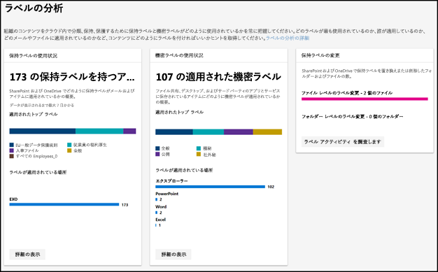
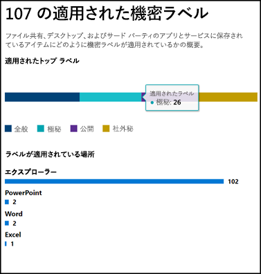
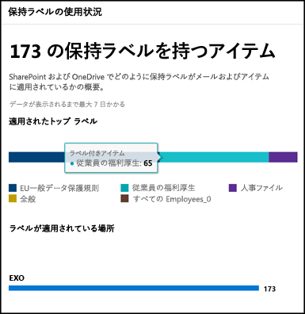

# ラベル分析によるラベル使用状況の表示

保持ラベルと機密ラベルを作成した後に、テナント全体でどのように使用されているかを確認することができます。 Microsoft 365 コンプライアンス センターと Microsoft 365 セキュリティ センターのラベル分析で、どのラベルが最もよく使われているか、どこで適用されているかを簡単に確認できます。

たとえば、ラベル分析で次を確認できます:

- コンテンツに適用された保持ラベルと機密ラベルの合計数。
- 上位のラベルと各ラベルの適用回数。
- ラベルの適用場所と、各場所での適用回数。
- 保持レベルが変更または削除されたファイルとフォルダーの数。

ラベル分析は、[[Microsoft 365 コンプライアンス センター]](https://compliance.microsoft.com/labelanalytics) または [[Microsoft 365 セキュリティ センター]](https://security.microsoft.com/labelanalytics)  >  **[分類]**  >  **[ラベル分析]** で確認できます。

## 機密ラベルの使用状況

機密ラベルの使用状況のデータは、Azure Information Protection のレポートから取得します。詳細については、「[Azure Information Protection の集中レポート](https://docs.microsoft.com/ja-JP/azure/information-protection/reports-aip)」を参照してください。

Azure Information Protection のレポートは、Microsoft 365 コンプライアンス センターと Microsoft 365 セキュリティセンターの機密ラベルに対するラベル分析にも適用される[前提条件](https://docs.microsoft.com/ja-JP/azure/information-protection/reports-aip#prerequisites-for-azure-information-protection-analytics)があるのでご注意ください。 たとえば、これらのレポートは Azure Information Protection のクライアントとスキャン プログラムから Azure Log Analytics サービスに基づいて集中管理された場所に情報保護の監視イベントを送信した結果なので、Log Analytics を含む Azure サブスクリプションが必要です。

機密ラベルの使用状況は:

- データの待機時間はありません。 リアルタイムのレポートです。
- 上位の各ラベルの数を確認するには、棒グラフをポイントすると表示されるツール ヒントを確認してください。
- レポートでは、アプリごとに機密ラベルがどこに適用されているかを示します (保持ラベルは場所ごとに示されます)。

## 保持ラベルの使用状況

このレポートでは、上位のラベルとそれがどこで適用されているかについてクイック ビューが表示されます。 SharePoint や OneDrive のコンテンツがどのようにラベル付けされているかについての詳細は、「[ドキュメントのラベル アクティビティを表示する](view-label-activity-for-documents.md)」を参照してください。

保持ラベルの使用状況は:

- データは、週ごとに集計されるため、データがレポートに表示されるまで最大 7 日間がかかる場合があります。
- 上位の各ラベルの数を確認するには、棒グラフをポイントすると表示されるツール ヒントを確認してください。
- レポートでは、場所ごとに保持ラベルがどこに適用されているかを示します (機密ラベルはアプリごとに示されます)。
- 保持レベルは、テナントの全期間のデータの概要で、特定の日付範囲にフィルター処理はされません。 これに対し、[ラベル アクティビティ エクスプローラー](view-label-activity-for-documents.md)は、過去 30 日間のみのデータが表示されます。

## 特定の保持ラベルが付いたコンテンツをすべて表示する

保持ラベルの使用状況レポートから、そのラベルが適用されたすべてのコンテンツを簡単に参照することができます。 (この機能については、現在作業中のためすべてのラベル付けされたコンテンツを見るにはいくつかの手順が必要になります。)

最初に、レポートの下部にある **[詳細の表示]** を選択します。

![保持ラベルの使用状況レポートの下部にある [詳細の表示] オプション](media/retention-label-usage-view-details.png)

次に、保持ラベル > **右側のウィンドウの [アイテムを参照する]** を選択します。

![右側のウィンドウの [アイテムを参照する] オプション](media/retention-label-usage-explore-items.png)

そのラベルで、**[アクティビティ]** タブを選択すると、そのラベルの場所ごとのアイテム数が表示されます。

![保持ラベルの [アクティビティ] タブ](media/retention-label-usage-activity-tab.png)

**[このラベルを含むアイテム]** タブも選択できます。それから、特定の場所について確認することができます。

- Exchange Online では、メールボックスの一覧とメールボックスごとにラベルが付いたアイテムの数を確認できます。
- SharePoint Online と OneDrive for Business では、サイト コレクションの一覧と、OneDrive アカウントをそれぞれの場所のラベル付けされたアイテムの数と合わせて確認できます。

メールボックスまたはサイト コレクションを選択すると、その場所の保持ラベルを含むアイテムの一覧が表示されます。

![[このラベルを含むアイテム] タブでその保持ラベルを持つすべてのアイテムを表示](media/retention-label-usage-content-explorer.png)

## アクセス許可

ラベル分析を確認するには、Azure Active Directory で次のいずれかの役割に割り当てられている必要があります。

- グローバル管理者
- コンプライアンス管理者
- セキュリティ管理者
- セキュリティ閲覧者

さらに、これらのレポートでは、Azure Monitor を使用して、組織が所有する Log Analytics ワークスペースにデータを格納します。 そのため、データが格納されている Azure Monitor のワークスペースの閲覧者としてユーザーを追加しておく必要があります。詳細については、「[Azure Information Protection の分析に必要なアクセス許可](https://docs.microsoft.com/ja-JP/azure/information-protection/reports-aip#permissions-required-for-azure-information-protection-analytics)」を参照してください。

