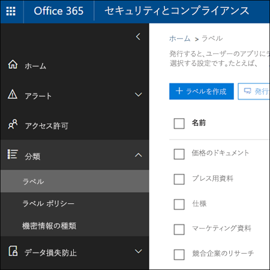

# <a name="overview-of-labels"></a><span data-ttu-id="f3bc2-105">ラベルの概要</span><span class="sxs-lookup"><span data-stu-id="f3bc2-105">Overview of labels</span></span>

<span data-ttu-id="f3bc2-p102">おそらく、組織全体では、業界の規制や社内のポリシーを遵守するためにさまざまアクションを実行する必要のある、多様な種類のコンテンツがあります。たとえば、次のようなものがあります。</span><span class="sxs-lookup"><span data-stu-id="f3bc2-p102">Across your organization, you probably have different types of content that require different actions taken on them in order to comply with industry regulations and internal policies. For example, you might have:</span></span>
  
- <span data-ttu-id="f3bc2-108">最小限の期間、**保持する**必要のある税フォーム。</span><span class="sxs-lookup"><span data-stu-id="f3bc2-108">Tax forms that need to be **retained** for a minimum period of time.</span></span> 
    
- <span data-ttu-id="f3bc2-109">一定の期間に到達した場合、**完全に削除する**必要があるプレス資料。</span><span class="sxs-lookup"><span data-stu-id="f3bc2-109">Press materials that need to be **permanently deleted** when they reach a certain age.</span></span> 
    
- <span data-ttu-id="f3bc2-110">**保持**と**完全な削除**の両方が必要な競合他社のリサーチ。</span><span class="sxs-lookup"><span data-stu-id="f3bc2-110">Competitive research that needs to be both **retained** and then **permanently deleted**.</span></span> 
    
- <span data-ttu-id="f3bc2-111">編集も削除もできないように、**レコードとしてマーク**する必要のある就労ビザ。</span><span class="sxs-lookup"><span data-stu-id="f3bc2-111">Work visas that must be **marked as a record** so that they can't be edited or deleted.</span></span> 
    
<span data-ttu-id="f3bc2-p103">これらのすべてのケースにおいて、Office 365 のラベルは、適切なコンテンツで適切な操作を実行するのに役立ちます。ラベルを使用すると、ガバナンス用に組織全体のデータを分類し、その分類に基づいて保持ルールを強制できます。</span><span class="sxs-lookup"><span data-stu-id="f3bc2-p103">In all of these cases, labels in Office 365 can help you take the right actions on the right content. With labels, you can classify data across your organization for governance, and enforce retention rules based on that classification.</span></span>
  
<span data-ttu-id="f3bc2-114">ラベルを使用すると、次のことができます。</span><span class="sxs-lookup"><span data-stu-id="f3bc2-114">With labels, you can:</span></span>
  
- <span data-ttu-id="f3bc2-p104">Outlook on the web、Outlook 2010 以降、OneDrive、SharePoint、Office 365 グループのコンテンツに、**組織内のユーザーがラベルを手動で適用できるようにします**。多くの場合、コンテンツの種類を最も良く理解しているのはそれを扱っているユーザーです。そこでユーザーにコンテンツを分類し、適切なポリシーを適用してもらいます。</span><span class="sxs-lookup"><span data-stu-id="f3bc2-p104">**Enable people in your organization to apply a label manually** to content in Outlook on the web, Outlook 2010 and later, OneDrive, SharePoint, and Office 365 groups. Users often know best what type of content they're working with, so they can classify it and have the appropriate policy applied.</span></span> 
    
- <span data-ttu-id="f3bc2-117">コンテンツに次のものが含まれている場合など、特定の条件に一致するときには、**ラベルをコンテンツに自動的に適用できます**。</span><span class="sxs-lookup"><span data-stu-id="f3bc2-117">**Apply labels to content automatically** if it matches specific conditions, such as when the content contains:</span></span> 
    
  - <span data-ttu-id="f3bc2-118">特定の種類の機密情報。</span><span class="sxs-lookup"><span data-stu-id="f3bc2-118">Specific types of sensitive information.</span></span>
    
  - <span data-ttu-id="f3bc2-119">作成したクエリに一致する特定のキーワード。</span><span class="sxs-lookup"><span data-stu-id="f3bc2-119">Specific keywords that match a query you create.</span></span>
    
    <span data-ttu-id="f3bc2-120">ラベルを自動的にコンテンツに適用する機能が重要である理由は次のとおりです。</span><span class="sxs-lookup"><span data-stu-id="f3bc2-120">The ability to apply labels to content automatically is important because:</span></span>
    
  - <span data-ttu-id="f3bc2-121">ユーザーのトレーニングは、一部の分類方法についてのみ必要。</span><span class="sxs-lookup"><span data-stu-id="f3bc2-121">You don't need to train your users on all of your classifications.</span></span>
    
  - <span data-ttu-id="f3bc2-122">ユーザーへの依存は、一部のコンテンツを正しく分類するためにのみ必要。</span><span class="sxs-lookup"><span data-stu-id="f3bc2-122">You don't need to rely on users to classify all content correctly.</span></span>
    
  - <span data-ttu-id="f3bc2-123">ユーザーはデータ ガバナンス ポリシーについて把握する必要がなくなり、仕事に集中できる。</span><span class="sxs-lookup"><span data-stu-id="f3bc2-123">Users no longer need to know about data governance policies - they can instead focus on their work.</span></span>
    
    <span data-ttu-id="f3bc2-124">自動適用ラベルには、Office 365 Enterprise E5 サブスクリプションが必要です。</span><span class="sxs-lookup"><span data-stu-id="f3bc2-124">Note that auto-apply labels require an Office 365 Enterprise E5 subscription.</span></span>
    
- <span data-ttu-id="f3bc2-125">SharePoint と Office 365 グループのサイトの **ドキュメント ライブラリに既定のラベルを適用する** ことにより、それらのライブラリ内のすべてのドキュメントに既定のラベルを適用できるようになります。</span><span class="sxs-lookup"><span data-stu-id="f3bc2-125">**Apply a default label to a document library** in SharePoint and Office 365 group sites, so that all documents in that library get the default label.</span></span> 
    
- <span data-ttu-id="f3bc2-p105">メールとドキュメントの両方を含む、**Office 365 全体でレコード管理を実装できます**。ラベルを使用して、コンテンツをレコードとして分類することができます。この場合、ラベルの変更と削除、およびコンテンツの編集と削除はできません。</span><span class="sxs-lookup"><span data-stu-id="f3bc2-p105">**Implement records management across Office 365**, including both email and documents. You can use a label to classify content as a record. When this happens, the label can't be changed or removed, and the content can't be edited or deleted.</span></span> 
    
<span data-ttu-id="f3bc2-129">Office 365 セキュリティ/コンプライアンス センターの **[ラベル]** ページでラベルを作成および管理します。</span><span class="sxs-lookup"><span data-stu-id="f3bc2-129">You create and manage labels on the **Labels** page in the Office 365 Security &amp; Compliance Center.</span></span> 
  

 
## <a name="how-labels-work-with-label-policies"></a><span data-ttu-id="f3bc2-131">ラベル ポリシーでのラベルのしくみ</span><span class="sxs-lookup"><span data-stu-id="f3bc2-131">How labels work with label policies</span></span>

<span data-ttu-id="f3bc2-p106">組織内のユーザーがラベルを使用して、コンテンツを分類できるようにするには、2 段階のプロセスで実行できます。まず、ラベルを作成し、次に選択した場所にそのラベルを発行します。ラベルを発行すると、ラベル ポリシーが作成されます。</span><span class="sxs-lookup"><span data-stu-id="f3bc2-p106">Making labels available to people in your organization so that they can classify content is a two-step process: first you create the labels, and then you publish them to the locations you choose. When you publish labels, a label policy gets created.</span></span>
  

  
<span data-ttu-id="f3bc2-p107">ラベルは、独立した再利用可能な文書パーツであり、ラベル ポリシーに含まれ、さまざまな場所に発行されます。ラベルは、多くのポリシー間で再利用できます。ラベル ポリシーの主な目的は、ラベルのセットをグループ化し、それらのラベルを表示する場所を指定することです。</span><span class="sxs-lookup"><span data-stu-id="f3bc2-p107">Labels are independent, reusable building blocks that are included in a label policy and published to different locations. Labels can be reused across many policies. The primary purpose of the label policy is to group a set of labels and specify the locations where you want those labels to appear.</span></span>
  

  
1. <span data-ttu-id="f3bc2-p108">ラベルを発行すると、ラベルはラベル ポリシーに含まれます。単一のラベルは複数のポリシーに含めることができます。</span><span class="sxs-lookup"><span data-stu-id="f3bc2-p108">When you publish labels, they're included in a label policy. A single label can be included in many policies.</span></span>
    
2. <span data-ttu-id="f3bc2-141">ラベル ポリシーは、ラベルを発行する場所を指定します。</span><span class="sxs-lookup"><span data-stu-id="f3bc2-141">Label policies specify the locations to publish the labels.</span></span>
    
## <a name="only-one-label-at-a-time"></a><span data-ttu-id="f3bc2-142">一度に 1 つのラベルのみ割り当て可能</span><span class="sxs-lookup"><span data-stu-id="f3bc2-142">Only one label at a time</span></span>

<span data-ttu-id="f3bc2-143">ここで重要なのは、メールやドキュメントなどのコンテンツには、一度に 1 つのラベルしか割り当てられないことを把握することです。</span><span class="sxs-lookup"><span data-stu-id="f3bc2-143">It's important to know that content like an email or document can have only a single label assigned to it at a time:</span></span>
  
- <span data-ttu-id="f3bc2-144">エンド ユーザーが手動で割り当てたラベルの場合、ユーザーは割り当てられたラベルを削除または変更できます。</span><span class="sxs-lookup"><span data-stu-id="f3bc2-144">For labels assigned manually by end users, people can remove or change the label that's assigned.</span></span>
    
- <span data-ttu-id="f3bc2-145">コンテンツに自動適用ラベルが割り当てられている場合は、自動適用ラベルをエンド ユーザーが手動で割り当てたラベルに置き換えることができます。</span><span class="sxs-lookup"><span data-stu-id="f3bc2-145">If content has an auto-apply label assigned, an auto-apply label can be replaced by a label assigned manually by an end user.</span></span>
    
- <span data-ttu-id="f3bc2-146">コンテンツにエンド ユーザーが手動で割り当てたラベルがある場合は、自動適用ラベルで手動で割り当てられたラベルを置き換えることはできません。</span><span class="sxs-lookup"><span data-stu-id="f3bc2-146">If content has a label assigned manually by an end user, an auto-apply label cannot replace the manually assigned label.</span></span>
    
- <span data-ttu-id="f3bc2-147">自動適用ラベルを割り当てるルールが複数あり、コンテンツが複数のルールの条件を満たしている場合、最も古いルールのラベルが割り当てられます。</span><span class="sxs-lookup"><span data-stu-id="f3bc2-147">If there are multiple rules that assign an auto-apply label and content meets the conditions of multiple rules, the label for the oldest rule is assigned.</span></span>
    
<span data-ttu-id="f3bc2-p109">手動で割り当てたラベルは明示的に割り当てられ、自動適用ラベルは暗黙的に割り当てられます。明示的なラベルは暗黙的なラベルよりも優先されます。詳細については、以下の「[保持の原則、すなわち優先順位について](labels.md#principles)」セクションをご参照ください。</span><span class="sxs-lookup"><span data-stu-id="f3bc2-p109">Manually assigned labels are explicitly assigned; auto-apply labels are implicitly assigned; an explicit label takes precedence over an implicit label. For more information, see the below section on [The principles of retention, or what takes precedence?](labels.md#principles).</span></span>
  
## <a name="how-long-it-takes-for-labels-to-take-effect"></a><span data-ttu-id="f3bc2-150">ラベルが有効になるまでの所要時間</span><span class="sxs-lookup"><span data-stu-id="f3bc2-150">How long it takes for labels to take effect</span></span>

<span data-ttu-id="f3bc2-151">ラベルを発行または自動適用しても、すぐには有効になりません。</span><span class="sxs-lookup"><span data-stu-id="f3bc2-151">When you publish or auto-apply labels, they don't take effect immediately:</span></span>
  
1. <span data-ttu-id="f3bc2-152">まず、ラベル ポリシーをセキュリティ/コンプライアンス センターからポリシー内の場所に同期させる必要があります。</span><span class="sxs-lookup"><span data-stu-id="f3bc2-152">First the label policy needs to be synced from the Security &amp; Compliance Center to the locations in the policy.</span></span>
    
2. <span data-ttu-id="f3bc2-p110">その後、エンド ユーザーが手動ラベルを利用できるようにする、またはラベルをコンテンツに自動適用するには、時間がかかることがあります。この所要時間はラベルの場所と種類によって異なります。</span><span class="sxs-lookup"><span data-stu-id="f3bc2-p110">Then the location may require time to make manual labels available to end users or auto-apply labels to content. How long this takes depends on the location and type of label.</span></span>
    
### <a name="manual-labels"></a><span data-ttu-id="f3bc2-155">手動ラベル</span><span class="sxs-lookup"><span data-stu-id="f3bc2-155">Manual labels</span></span>

<span data-ttu-id="f3bc2-p111">SharePoint または OneDrive にラベルを発行する場合は、ラベルがエンド ユーザーに表示されるまでに 1 日かかる場合があります。また、Exchange にラベルを発行する場合は、ラベルがエンド ユーザーに表示するまでに 7 日間かかる場合があり、さらにメールボックスには少なくとも 10 MB のデータが含まれている必要があります。</span><span class="sxs-lookup"><span data-stu-id="f3bc2-p111">If you publish labels to SharePoint or OneDrive, it can take one day for those labels to appear for end users. In addition, if you publish labels to Exchange, it can take 7 days for those labels to appear for end users, and the mailbox needs to contain at least 10 MB of data.</span></span>
  

  
### <a name="auto-apply-labels"></a><span data-ttu-id="f3bc2-159">自動適用ラベル</span><span class="sxs-lookup"><span data-stu-id="f3bc2-159">Auto-apply labels</span></span>

<span data-ttu-id="f3bc2-160">特定の条件に一致するコンテンツにラベルを自動適用する場合、ラベルが条件に一致するすべてのコンテンツにラベルが適用されるまでに 7 日間かかります。</span><span class="sxs-lookup"><span data-stu-id="f3bc2-160">If you auto-apply labels to content matching specific conditions, it can take seven days for the labels to be applied to all content that matches the conditions.</span></span>
  

  
### <a name="how-to-check-on-the-status-of-exchange-labels"></a><span data-ttu-id="f3bc2-162">Exchange ラベルの状態を確認する方法</span><span class="sxs-lookup"><span data-stu-id="f3bc2-162">How to check on the status of Exchange labels</span></span>

<span data-ttu-id="f3bc2-p112">Exchange Online では、7 日ごとに実行されるプロセスによってエンド ユーザーがラベルを利用できるようになります。Powershell を使用することで、このプロセスが最後に実行された日時を確認できるため、次に実行される日時を判断できます。</span><span class="sxs-lookup"><span data-stu-id="f3bc2-p112">In Exchange Online, labels are made available to end users by a process that runs every seven days. By using Powershell, you can see when this process last ran and thus determine when it will run again.</span></span>
  
1. <span data-ttu-id="f3bc2-165">[Exchange Online PowerShell に接続します](https://go.microsoft.com/fwlink/?linkid=799773)。</span><span class="sxs-lookup"><span data-stu-id="f3bc2-165">[Connect to Exchange Online PowerShell](https://go.microsoft.com/fwlink/?linkid=799773).</span></span>
    
2. <span data-ttu-id="f3bc2-166">これらのコマンドを実行します。</span><span class="sxs-lookup"><span data-stu-id="f3bc2-166">Run these commands.</span></span>
    
  ```
  $logProps = Export-MailboxDiagnosticLogs <user> -ExtendedProperties
  ```

  ```
  $xmlprops = [xml]($logProps.MailboxLog)
  ```

  ```
  $xmlprops.Properties.MailboxTable.Property | ? {$_.Name -like "ELC*"}
  ```

    <span data-ttu-id="f3bc2-p113">結果では、`ELCLastSuccessTimeStamp` (UTC) プロパティは、システムがメールボックスを最後に処理した日時を示します。ポリシーの作成時点からこの処理が発生していない場合、ラベルは表示されません。処理を強制するには、`Start-ManagedFolderAssistant -Identity <user>` を実行します。</span><span class="sxs-lookup"><span data-stu-id="f3bc2-p113">In the results, the  `ELCLastSuccessTimeStamp` (UTC) property shows when the system last processed your mailbox. If it has not happened since the time you created the policy, the labels are not going to appear. To force processing, run  `Start-ManagedFolderAssistant -Identity <user>`.</span></span>
    
    <span data-ttu-id="f3bc2-170">Outlook on the web にラベルが表示されると思われるにもかかわらず、ラベルが表示されない場合は、ブラウザーのキャッシュを必ず消去してください (CTRL + F5)。</span><span class="sxs-lookup"><span data-stu-id="f3bc2-170">If labels aren't appearing in Outlook on the web and you think they should be, make sure to clear the cache in your browser (CTRL+F5).</span></span>
    
## <a name="label-policies-and-locations"></a><span data-ttu-id="f3bc2-171">ラベルのポリシーと場所</span><span class="sxs-lookup"><span data-stu-id="f3bc2-171">Label policies and locations</span></span>

<span data-ttu-id="f3bc2-172">ラベルの内容に応じて、多様な種類のラベルをさまざまな場所に発行できます。</span><span class="sxs-lookup"><span data-stu-id="f3bc2-172">Different types of labels can be published to different locations, depending on what the label does.</span></span>
  
|<span data-ttu-id="f3bc2-173">**ラベルの種類**</span><span class="sxs-lookup"><span data-stu-id="f3bc2-173">**If the label is…**</span></span>|<span data-ttu-id="f3bc2-174">**ラベル ポリシーの適用先**</span><span class="sxs-lookup"><span data-stu-id="f3bc2-174">**Then the label policy can be applied to…**</span></span>|
|:-----|:-----|
|<span data-ttu-id="f3bc2-175">エンド ユーザーに発行されたラベル</span><span class="sxs-lookup"><span data-stu-id="f3bc2-175">Published to end users</span></span>  <br/> |<span data-ttu-id="f3bc2-176">Exchange、SharePoint、OneDrive、Office 365 グループ</span><span class="sxs-lookup"><span data-stu-id="f3bc2-176">Exchange, SharePoint, OneDrive, Office 365 groups</span></span>  <br/> |
|<span data-ttu-id="f3bc2-177">機密情報の種類に基づいて自動適用されたラベル</span><span class="sxs-lookup"><span data-stu-id="f3bc2-177">Auto-applied based on sensitive information types</span></span>  <br/> |<span data-ttu-id="f3bc2-178">Exchange (すべてのメールボックスのみ)、SharePoint、OneDrive</span><span class="sxs-lookup"><span data-stu-id="f3bc2-178">Exchange (all mailboxes only), SharePoint, OneDrive</span></span>  <br/> |
|<span data-ttu-id="f3bc2-179">クエリに基づいて自動適用されたラベル</span><span class="sxs-lookup"><span data-stu-id="f3bc2-179">Auto-applied based on a query</span></span>  <br/> |<span data-ttu-id="f3bc2-180">Exchange、SharePoint、OneDrive、Office 365 グループ</span><span class="sxs-lookup"><span data-stu-id="f3bc2-180">Exchange, SharePoint, OneDrive, Office 365 groups</span></span>  <br/> |
   
<span data-ttu-id="f3bc2-p114">Exchange では、自動適用ラベル (クエリおよび機密情報の種類の両方) は、新しく送信されたメッセージ (送信中のデータ) にのみ適用され、現在メールボックスにあるすべてのアイテム (保存データ) には適用されません。また、機密情報の種類用の自動適用ラベルは、すべてのメールボックスにのみ適用できます。ただし、特定のメールボックスを選択することはできません。</span><span class="sxs-lookup"><span data-stu-id="f3bc2-p114">Note that in Exchange, auto-apply labels (for both queries and sensitive information types) are applied only to messages newly sent (data in transit), not to all items currently in the mailbox (data at rest). Also, auto-apply labels for sensitive information types can apply only to all mailboxes; you can't select the specific mailboxes.</span></span>
  
<span data-ttu-id="f3bc2-183">Exchange パブリック フォルダーと Skype ではラベルはサポートされていません。</span><span class="sxs-lookup"><span data-stu-id="f3bc2-183">Note that Exchange public folders and Skype do not support labels.</span></span>
  
## <a name="how-labels-enforce-retention"></a><span data-ttu-id="f3bc2-184">ラベルによる強制保持のしくみ</span><span class="sxs-lookup"><span data-stu-id="f3bc2-184">How labels enforce retention</span></span>

<span data-ttu-id="f3bc2-p115">ラベルは、アイテム保持ポリシーが強制できる保持アクションとまったく同じ保持アクションを強制することができます。ラベルを使用すると、高度なコンテンツ プラン (またはファイル プラン) を実装できます。保持のしくみに関する詳細については、「[アイテム保持ポリシーの概要](retention-policies.md)」を参照してください。</span><span class="sxs-lookup"><span data-stu-id="f3bc2-p115">Labels can enforce exactly the same retention actions that a retention policy can. You can use labels to implement a sophisticated content plan (or file plan). For more information on how retention works, see [Overview of retention policies](retention-policies.md).</span></span>
  
<span data-ttu-id="f3bc2-p116">さらに、ラベルには 2 つの保持オプションがあります。これらのオプションはラベルでのみ使用でき、アイテム保持ポリシーでは使用できません。ラベルを使用すると、次のことができます。</span><span class="sxs-lookup"><span data-stu-id="f3bc2-p116">In addition, a label has two retention options that are available only in a label and not in a retention policy. With a label, you can:</span></span>
  
- <span data-ttu-id="f3bc2-p117">保持期間の終了時に廃棄レビューをトリガーし、SharePoint と OneDrive のドキュメントを確認してから削除するようにできます。詳細については、「[廃棄レビューの概要](disposition-reviews.md)」をご参照ください。</span><span class="sxs-lookup"><span data-stu-id="f3bc2-p117">Trigger a disposition review at the end of the retention period, so that SharePoint and OneDrive documents must be reviewed before they can be deleted. For more information, see [Overview of disposition reviews](disposition-reviews.md).</span></span>
    
- <span data-ttu-id="f3bc2-192">コンテンツの作成日または最終変更日時ではなく、コンテンツがラベル付けされた時点から保持期間を開始できます。</span><span class="sxs-lookup"><span data-stu-id="f3bc2-192">Start the retention period from when the content was labeled, instead of the age of the content or when it was last modified.</span></span>
    

  
## <a name="where-published-labels-can-appear-to-end-users"></a><span data-ttu-id="f3bc2-194">エンドユーザーに発行済みラベルを表示できる場所</span><span class="sxs-lookup"><span data-stu-id="f3bc2-194">Where published labels can appear to end users</span></span>

<span data-ttu-id="f3bc2-195">エンドユーザーがラベルをコンテンツに割り当てる場合は、ラベルは次の場所に発行できます。</span><span class="sxs-lookup"><span data-stu-id="f3bc2-195">If your label will be assigned to content by end users, you can publish it to:</span></span>
  
- <span data-ttu-id="f3bc2-196">Outlook on the web</span><span class="sxs-lookup"><span data-stu-id="f3bc2-196">Outlook on the web</span></span>
    
- <span data-ttu-id="f3bc2-197">Outlook 2010 以降</span><span class="sxs-lookup"><span data-stu-id="f3bc2-197">Outlook 2010 and later</span></span>
    
- <span data-ttu-id="f3bc2-198">OneDrive</span><span class="sxs-lookup"><span data-stu-id="f3bc2-198">OneDrive</span></span>
    
- <span data-ttu-id="f3bc2-199">SharePoint</span><span class="sxs-lookup"><span data-stu-id="f3bc2-199">SharePoint</span></span>
    
- <span data-ttu-id="f3bc2-200">Office 365 グループ (Outlook on the web のグループ サイトとグループ メールボックスの両方)</span><span class="sxs-lookup"><span data-stu-id="f3bc2-200">Office 365 groups (both the group site and group mailbox in Outlook on the web)</span></span>
    
<span data-ttu-id="f3bc2-201">以下のセクションでは、さまざまなアプリで組織内のユーザーに対してラベルがどのように表示されるかを説明します。</span><span class="sxs-lookup"><span data-stu-id="f3bc2-201">The sections below show how labels will appear in different apps to people in your organization.</span></span>
  
### <a name="outlook-on-the-web"></a><span data-ttu-id="f3bc2-202">Outlook on the web</span><span class="sxs-lookup"><span data-stu-id="f3bc2-202">Outlook on the web</span></span>

<span data-ttu-id="f3bc2-203">Outlook on the web でアイテムにラベルを付けるには、アイテム \> **[ポリシーの割り当て]** の順に右クリックして、ラベルを選択します。</span><span class="sxs-lookup"><span data-stu-id="f3bc2-203">To label an item in Outlook on the web, right-click the item \> **Assign policy** \> choose the label.</span></span> 
  
![Outlook on the web の [ポリシーの割り当て] メニュー](media/146a23cf-e478-4595-b2e8-f707fc4e6ea3.png)
  
<span data-ttu-id="f3bc2-p118">ラベルが適用されると、アイテムの上部にそのラベルとラベルが実行するアクションが表示されます。メールが分類され、保持期間が関連付けられている場合、メールの有効期限が一目で分かります。</span><span class="sxs-lookup"><span data-stu-id="f3bc2-p118">After the label is applied, you can view that label and what action it takes at the top of the item. If an email is classified and has an associated retention period, you can know at a glance when the email will expire.</span></span>
  

  
<span data-ttu-id="f3bc2-208">ラベルをフォルダーに適用することもできます。その場合は次のようになります。</span><span class="sxs-lookup"><span data-stu-id="f3bc2-208">You can also apply labels to folders, in which case:</span></span>
  
- <span data-ttu-id="f3bc2-p119">明示的にラベルが適用されているアイテムを**除き**、フォルダー内のすべてのアイテムに同じラベルが自動的に設定されます。明示的にラベル付けされたアイテムは、既存のラベルを保持します。詳細については、保持の原則に関する以下のセクションをご参照ください。</span><span class="sxs-lookup"><span data-stu-id="f3bc2-p119">All items in the folder automatically get the same label, **except** for items that have had a label applied explicitly to them. Explicitly labeled items keep their existing label. For more information, see the below section on the principles of retention.</span></span> 
    
- <span data-ttu-id="f3bc2-212">フォルダーの既定のラベルを変更または削除すると、明示的なラベルを持つアイテムを**除き**、フォルダー内にあるすべてのアイテムのラベルも変更または削除されます。</span><span class="sxs-lookup"><span data-stu-id="f3bc2-212">If you change or remove the default label for a folder, the label's also changed or removed for all items in the folder, **except** items with explicit labels.</span></span> 
    
- <span data-ttu-id="f3bc2-213">既定のラベルを持つアイテムをあるフォルダーから異なる既定のラベルを持つ別のフォルダーに移動すると、そのアイテムには新しい既定のラベルが設定されます。</span><span class="sxs-lookup"><span data-stu-id="f3bc2-213">If you move an item with a default label from one folder to another folder with a different default label, the item will get the new default label.</span></span>
    
- <span data-ttu-id="f3bc2-214">既定のラベルを持つアイテムをあるフォルダーから既定のラベルがない別のフォルダーに移動すると、以前の既定のラベルが削除されます。</span><span class="sxs-lookup"><span data-stu-id="f3bc2-214">If you move an item with a default label from one folder to another folder with no default label, the old default label is removed.</span></span>
    
### <a name="outlook-2010-and-later"></a><span data-ttu-id="f3bc2-215">Outlook 2010 以降</span><span class="sxs-lookup"><span data-stu-id="f3bc2-215">Outlook 2010 and later</span></span>

<span data-ttu-id="f3bc2-216">Outlook on the web でアイテムにラベルを付けるには、アイテム \> **[リボン]** の **[ポリシーの割り当て]** の順に右クリックして、ラベルを選択します。</span><span class="sxs-lookup"><span data-stu-id="f3bc2-216">To label an item in Outlook on the web, right-click the item \> on the **Ribbon** \> **Assign Policy** \> choose the label.</span></span> 
  
![[ポリシーの割り当て] ボタン](media/30684dea-dd73-4e4a-9185-8e29f403b6ca.png)
  
<span data-ttu-id="f3bc2-p120">ラベルが適用されると、アイテムの上部にそのラベルとラベルが実行するアクションが表示されます。メールが分類され、保持期間が関連付けられている場合、メールの有効期限が一目で分かります。</span><span class="sxs-lookup"><span data-stu-id="f3bc2-p120">After the label is applied, you can view that label and what action it takes at the top of the item. If an email is classified and has an associated retention period, you can know at a glance when the email will expire.</span></span>
  
<span data-ttu-id="f3bc2-p121">フォルダーにラベルを適用することもできます。これは、Outlook on the web での機能と同様に Outlook 2010 以降でも機能します。詳細については、前のセクションをご参照ください。</span><span class="sxs-lookup"><span data-stu-id="f3bc2-p121">You can also apply labels to folders. This works the same in Outlook 2010 and later as it does in Outlook on the web -- see the previous section for more info.</span></span>
  
### <a name="onedrive-and-sharepoint"></a><span data-ttu-id="f3bc2-222">OneDrive と SharePoint</span><span class="sxs-lookup"><span data-stu-id="f3bc2-222">OneDrive and SharePoint</span></span>

<span data-ttu-id="f3bc2-223">OneDrive または SharePoint でドキュメント (OneNote ファイルを含む) にラベルを付けるには、アイテム \> 右上隅にある **[詳細ウィンドウを開く]** \> **[ラベルの適用]** \> ラベルの順に選択します。</span><span class="sxs-lookup"><span data-stu-id="f3bc2-223">To label a document (including OneNote files) in OneDrive or SharePoint, select the item \> in the upper-right corner, choose **Open the details pane** \> **Apply label** \> choose the label.</span></span> 
  
<span data-ttu-id="f3bc2-224">フォルダーまたはドキュメントのセットにラベルを適用することもできます。また、ドキュメント ライブラリに対して既定のラベルを設定できます。詳細については、以下のセクションを参照してください。</span><span class="sxs-lookup"><span data-stu-id="f3bc2-224">Note that you can also apply a label to a folder or document set, and you can set a default label for a document library - see the section below for more information.</span></span>
  

  
<span data-ttu-id="f3bc2-226">アイテムにラベルが適用されると、そのアイテムを選択したときに詳細ウィンドウにラベルを表示できます。</span><span class="sxs-lookup"><span data-stu-id="f3bc2-226">After a label is applied to an item, you can view it in the details pane when that item's selected.</span></span>
  

  
<span data-ttu-id="f3bc2-p122">**[ラベル]** 列または **[アイテムがレコード]** 列を含むライブラリのビューを作成して、すべてのアイテムに割り当てられたラベルとレコードであるアイテムを一目で確認できるようにすることも可能です。ただし、**[アイテムがレコード]** 列を使用してビューをフィルターすることはできません。</span><span class="sxs-lookup"><span data-stu-id="f3bc2-p122">You can also create a view of the library that contains the **Labels** column or **Item is a Record** column, so that you can see at a glance the labels assigned to all items and which items are records. Note, however, that you can't filter the view by the **Item is a Record** column.</span></span> 
  

  
### <a name="office-365-groups"></a><span data-ttu-id="f3bc2-231">Office 365 グループ</span><span class="sxs-lookup"><span data-stu-id="f3bc2-231">Office 365 groups</span></span>

<span data-ttu-id="f3bc2-p123">Office 365 グループにラベルを発行すると、ラベルは Outlook on the web のグループ サイトとグループ メールボックスの両方に表示されます。コンテンツにラベルを適用する場合の操作性は、上記のメールとドキュメントの場合と同じです。</span><span class="sxs-lookup"><span data-stu-id="f3bc2-p123">When you publish labels to an Office 365 group, the labels appear in both the group site and group mailbox in Outlook on the web. The experience of applying a label to content is identical to that shown above for email and documents.</span></span>
  
## <a name="applying-a-label-automatically-based-on-conditions"></a><span data-ttu-id="f3bc2-234">条件に基づいたラベルの自動適用</span><span class="sxs-lookup"><span data-stu-id="f3bc2-234">Applying a label automatically based on conditions</span></span>

<span data-ttu-id="f3bc2-p124">ラベルの最も強力な機能の 1 つは、特定の条件に一致したコンテンツにラベルを自動的に適用する機能です。この場合、ラベルは Office 365 によって適用されるので、組織内のユーザーはラベルを適用する必要はありません。</span><span class="sxs-lookup"><span data-stu-id="f3bc2-p124">One of the most powerful features of labels is the ability to apply them automatically to content that matches certain conditions. In this case, people in your organization don't need to apply the labels - Office 365 does the work for them.</span></span>
  

  
<span data-ttu-id="f3bc2-238">自動適用ラベルが強力な機能である理由は次のとおりです。</span><span class="sxs-lookup"><span data-stu-id="f3bc2-238">Auto-apply labels are powerful because:</span></span>
  
- <span data-ttu-id="f3bc2-239">ユーザーのトレーニングは、一部の分類方法についてのみ必要。</span><span class="sxs-lookup"><span data-stu-id="f3bc2-239">You don't need to train your users on all of your classifications.</span></span>
    
- <span data-ttu-id="f3bc2-240">ユーザーへの依存は、一部のコンテンツを正しく分類するためにのみ必要。</span><span class="sxs-lookup"><span data-stu-id="f3bc2-240">You don't need to rely on users to classify all content correctly.</span></span>
    
- <span data-ttu-id="f3bc2-241">ユーザーはデータ ガバナンス ポリシーについて把握する必要がなくなるので、仕事に集中できる。</span><span class="sxs-lookup"><span data-stu-id="f3bc2-241">Users no longer need to know about data governance policies - they can focus on their work.</span></span>
    
<span data-ttu-id="f3bc2-242">コンテンツに次の内容が含まれている場合、ラベルを自動的にコンテンツに適用するように選択できます。</span><span class="sxs-lookup"><span data-stu-id="f3bc2-242">You can choose to apply labels to content automatically when that content contains:</span></span>
  
- <span data-ttu-id="f3bc2-243">特定の種類の機密情報。</span><span class="sxs-lookup"><span data-stu-id="f3bc2-243">Specific types of sensitive information.</span></span>
    
- <span data-ttu-id="f3bc2-244">作成したクエリに一致する特定のキーワード。</span><span class="sxs-lookup"><span data-stu-id="f3bc2-244">Specific keywords that match a query you create.</span></span>
    
![自動適用ラベルの [条件選択] ページ](media/c0b7a3ef-bda0-494c-941d-f1f93753ecdd.png)
  
<span data-ttu-id="f3bc2-246">自動適用ラベルには Office 365 Enterprise E5 サブスクリプションが必要であり、また前述のように、条件に一致するすべてのコンテンツに自動適用ラベルが適用されるまでに最大 7 日間かかります。</span><span class="sxs-lookup"><span data-stu-id="f3bc2-246">Note that auto-apply labels require an Office 365 Enterprise E5 subscription, and that it can take up to seven days for auto-apply labels to be applied to all content that matches the conditions, as described above.</span></span>
  
### <a name="auto-apply-labels-to-content-with-specific-types-of-sensitive-information"></a><span data-ttu-id="f3bc2-247">特定の種類の機密情報によるコンテンツへのラベルの自動適用</span><span class="sxs-lookup"><span data-stu-id="f3bc2-247">Auto-apply labels to content with specific types of sensitive information</span></span>

<span data-ttu-id="f3bc2-p125">機密情報の自動適用ラベルを作成すると、データ損失防止 (DLP) ポリシーを作成する場合と同じポリシー テンプレートの一覧が表示されます。各ポリシーテンプレートは、特定の種類の機密情報を検索するように事前設定されています。たとえば、ここに表示されているテンプレートでは、米国の ITIN、SSN、およびパスポート番号が検索されます。DLP の詳細については、「[データ損失防止ポリシーの概要](data-loss-prevention-policies.md)」をご参照ください。</span><span class="sxs-lookup"><span data-stu-id="f3bc2-p125">When you create auto-apply labels for sensitive information, you see the same list of policy templates as when you create a data loss prevention (DLP) policy. Each policy template is preconfigured to look for specific types of sensitive information - for example, the template shown here looks for U.S. ITIN, SSN, and passport numbers. To learn more about DLP, see [Overview of data loss prevention policies](data-loss-prevention-policies.md).</span></span>
  

  
<span data-ttu-id="f3bc2-p126">ポリシー テンプレートを選択すると、すべての種類の機密情報を追加または削除したり、インスタンス数と一致精度を変更したりできます。ここに示す例では、ラベルは次の場合にのみ自動的に適用されます。</span><span class="sxs-lookup"><span data-stu-id="f3bc2-p126">After you select a policy template, you can add or remove any types of sensitive information, and you can change the instance count and match accuracy. In the example shown here, a label will be auto-applied only when:</span></span>
  
- <span data-ttu-id="f3bc2-p127">コンテンツに、次の 3 種類の機密情報のいずれかに 1 から 9 個のインスタンスが含まれる場合。**最大** 値を削除して、**任意** の値に変更できます。</span><span class="sxs-lookup"><span data-stu-id="f3bc2-p127">The content contains between 1 and 9 instances of any of these three sensitive information types. You can delete the **max** value so that it changes to **any**.</span></span>
    
- <span data-ttu-id="f3bc2-p128">検出された機密情報の種類は、一致精度 (または信頼レベル) が少なくとも 75 に設定されています。多くの機密情報の種類は複数のパターンで定義されています。一致精度の高いパターンでは、より多くの証拠 (キーワード、日付、アドレスなど) が検索される必要がありますが、一致精度の低いパターンでは必要な証拠は少なくなります。簡単に言えば、一致精度の **最小** 値が低いほど、コンテンツは条件に一致しやすくなります。</span><span class="sxs-lookup"><span data-stu-id="f3bc2-p128">The type of sensitive information that's detected has a match accuracy (or confidence level) of at least 75. Many sensitive information types are defined with multiple patterns, where a pattern with a higher match accuracy requires more evidence to be found (such as keywords, dates, or addresses), while a pattern with a lower match accuracy requires less evidence. Simply put, the lower the **min** match accuracy, the easier it is for content to match the condition.</span></span> 
    
    <span data-ttu-id="f3bc2-259">一致精度 (または信頼レベル) を変更する場合は、「[機密情報の種類の検索基準:](what-the-sensitive-information-types-look-for.md)」で定義されているように、その機密情報の種類のパターンに使用されている信頼レベルのいずれかを使用する必要があります。</span><span class="sxs-lookup"><span data-stu-id="f3bc2-259">If you change the match accuracy (or confidence level), you should use one of confidence levels used in a pattern for that type of sensitive information, as defined in [What the sensitive information types look for](what-the-sensitive-information-types-look-for.md).</span></span>
    

  
### <a name="auto-apply-labels-to-content-with-keywords-or-searchable-properties"></a><span data-ttu-id="f3bc2-261">キーワードまたは検索可能なプロパティによるコンテンツへの自動適用ラベル</span><span class="sxs-lookup"><span data-stu-id="f3bc2-261">Auto-apply labels to content with keywords or searchable properties</span></span>

<span data-ttu-id="f3bc2-p129">特定の条件を満たすコンテンツにラベルを自動的に適用できます。現在利用可能な条件では、特定の単語、フレーズ、または検索可能なプロパティの値を含むコンテンツへのラベルの適用がサポートされています。AND、OR、NOT などの検索演算子を使用してクエリを絞り込むことができます。</span><span class="sxs-lookup"><span data-stu-id="f3bc2-p129">You can auto-apply labels to content that satisfies certain conditions. The conditions available now support applying a label to content that contains specific words or phrases. You can refine your query by using search operators like AND, OR, and NOT. For more information on operators, see Keyword queries and search conditions for Content Search.</span></span> 

<span data-ttu-id="f3bc2-265">クエリ構文の詳細については、次を参照してください。</span><span class="sxs-lookup"><span data-stu-id="f3bc2-265">For more information on query syntax, see:</span></span>

- [<span data-ttu-id="f3bc2-266">キーワード クエリ言語 (KQL) 構文のリファレンス</span><span class="sxs-lookup"><span data-stu-id="f3bc2-266">Keyword Query Language (KQL) syntax reference (DMC)</span></span>](https://docs.microsoft.com/ja-JP/sharepoint/dev/general-development/keyword-query-language-kql-syntax-reference)

<span data-ttu-id="f3bc2-p130">クエリ ベースのラベルは検索インデックスを使用してコンテンツを特定します。有効な検索可能なプロパティの詳細については、以下を参照してください。</span><span class="sxs-lookup"><span data-stu-id="f3bc2-p130">Query-based labels use the search index to identify content. For more information on valid searchable properties, see:</span></span>

- [<span data-ttu-id="f3bc2-269">コンテンツ検索のキーワード クエリと検索条件</span><span class="sxs-lookup"><span data-stu-id="f3bc2-269">Keyword queries and search conditions for Content Search</span></span>](keyword-queries-and-search-conditions.md)
- [<span data-ttu-id="f3bc2-270">クロールされたプロパティと管理プロパティの概要 (SharePoint Server)</span><span class="sxs-lookup"><span data-stu-id="f3bc2-270">Overview of crawled and managed properties in SharePoint Server</span></span>](https://docs.microsoft.com/ja-JP/SharePoint/technical-reference/crawled-and-managed-properties-overview)
  
<span data-ttu-id="f3bc2-271">クエリの例:</span><span class="sxs-lookup"><span data-stu-id="f3bc2-271">Examples of search queries</span></span>

- <span data-ttu-id="f3bc2-272">Exchange</span><span class="sxs-lookup"><span data-stu-id="f3bc2-272">Exchange</span></span>
    - <span data-ttu-id="f3bc2-273">subject:"Quarterly Financials"</span><span class="sxs-lookup"><span data-stu-id="f3bc2-273">subject:"Quarterly Financials"</span></span>
    - <span data-ttu-id="f3bc2-274">recipients:garthf<!--nolink-->@contoso.com</span><span class="sxs-lookup"><span data-stu-id="f3bc2-274">recipients:garthf<!--nolink-->@contoso.com</span></span>

- <span data-ttu-id="f3bc2-275">SharePoint および OneDrive for Business</span><span class="sxs-lookup"><span data-stu-id="f3bc2-275">SharePoint Online and OneDrive for Business</span></span>
    - <span data-ttu-id="f3bc2-276">contenttype:contract</span><span class="sxs-lookup"><span data-stu-id="f3bc2-276">contenttype:contract</span></span>
    - <span data-ttu-id="f3bc2-277">site:https<!--nolink-->://contoso.sharepoint.com/sites/teams/procurement AND contenttype:contract</span><span class="sxs-lookup"><span data-stu-id="f3bc2-277">site:https<!--nolink-->://contoso.sharepoint.com/sites/teams/procurement AND contenttype:contract</span></span>
  

  
## <a name="applying-a-default-label-to-all-content-in-a-sharepoint-library-folder-or-document-set"></a><span data-ttu-id="f3bc2-279">SharePoint ライブラリ、フォルダー、またはドキュメントセット内のすべてのコンテンツへの既定のラベルの適用</span><span class="sxs-lookup"><span data-stu-id="f3bc2-279">Applying a default label to all content in a SharePoint library, folder, or document set</span></span>

<span data-ttu-id="f3bc2-280">個々のドキュメントにユーザーがラベルを適用できるようにするだけでなく、既定のラベルを SharePoint ライブラリ、フォルダー、またはドキュメント セットに適用して、その場所にあるすべてのドキュメントに既定のラベルを設定することもできます。</span><span class="sxs-lookup"><span data-stu-id="f3bc2-280">In addition to enabling people to apply a label to individual documents, you can also apply a default label to a SharePoint library, folder, or document set, so that all documents in that location get the default label.</span></span>
  
<span data-ttu-id="f3bc2-p131">ドキュメント ライブラリの場合、ドキュメント ライブラリの **ライブラリの設定** ページでこれを実行できます。既定のラベルを選択すると、ライブラリにある任意の既存のアイテムに対して適用するように選択することもできます。</span><span class="sxs-lookup"><span data-stu-id="f3bc2-p131">For a document library, this is done on the **Library settings** page for a document library. When you choose the default label, you can also choose to apply it to any existing items in the library.</span></span> 
  
<span data-ttu-id="f3bc2-283">たとえば、マーケティング資料用のタグがあり、特定のドキュメント ライブラリにその種類のコンテンツだけが含まれていることがわかっている場合は、[マーケティング資料] タグをそのライブラリ内にあるすべてのドキュメントの既定にすることができます。</span><span class="sxs-lookup"><span data-stu-id="f3bc2-283">For example, if you have a tag for marketing materials, and you know a specific document library will contain only that type of content, you can make the Marketing Materials tag the default for all documents in that library.</span></span>
  

  
<span data-ttu-id="f3bc2-285">ライブラリ、フォルダー、またはドキュメント セット内にある既存のアイテムに既定のラベルを適用すると、次のようになります。</span><span class="sxs-lookup"><span data-stu-id="f3bc2-285">If you apply a default label to existing items in the library, folder, or document set:</span></span>
  
- <span data-ttu-id="f3bc2-p132">明示的にラベルが適用されているアイテムを**除き**、ライブラリ、フォルダー、またはドキュメント セット内にあるすべてのアイテムに同じラベルが自動的に設定されます。明示的にラベル付けされたアイテムは、既存のラベルを保持します。詳細については、以下の「[保持の原則、すなわち優先順位について](labels.md#principles)」セクションをご参照ください。</span><span class="sxs-lookup"><span data-stu-id="f3bc2-p132">All items in the library, folder, or document set automatically get the same label, **except** for items that have had a label applied explicitly to them. Explicitly labeled items keep their existing label. For more information, see the below section on [The principles of retention, or what takes precedence?](labels.md#principles).</span></span>
    
- <span data-ttu-id="f3bc2-289">ライブラリ、フォルダー、またはドキュメント セットの既定のラベルを変更または削除すると、明示的なラベルを持つアイテムを**除き**、ライブラリ、フォルダー、またはドキュメント セット内にあるすべてのアイテムのラベルも変更または削除されます。</span><span class="sxs-lookup"><span data-stu-id="f3bc2-289">If you change or remove the default label for a library, folder, or document set, the label's also changed or removed for all items in the library, folder, or document set, **except** items with explicit labels.</span></span> 
    
- <span data-ttu-id="f3bc2-290">既定のラベルを持つアイテムをあるライブラリ、フォルダー、またはドキュメント セットから別のライブラリ、フォルダー、またはドキュメント セットに移動すると、新しい場所に別の既定のラベルが設定されていても、アイテムは既存の既定のラベルを保持します。</span><span class="sxs-lookup"><span data-stu-id="f3bc2-290">If you move an item with a default label from one library, folder, or document set to another library, folder, or document set, the item keeps its existing default label, even if the new location has a different default label.</span></span>
    
## <a name="applying-a-label-to-email-by-using-rules"></a><span data-ttu-id="f3bc2-291">ルールを使用したメールへのラベルの適用</span><span class="sxs-lookup"><span data-stu-id="f3bc2-291">Applying a label to email by using rules</span></span>

<span data-ttu-id="f3bc2-292">Outlook 2010 以降では、ラベルまたはアイテム保持ポリシーを適用するためのルールを作成できます。</span><span class="sxs-lookup"><span data-stu-id="f3bc2-292">In Outlook 2010 or later, you can create rules to apply a label or retention policy.</span></span>
  
<span data-ttu-id="f3bc2-293">たとえば、特定の配布グループとの間で送受信されるすべてのメッセージに対して特定のラベルを適用するルールを作成できます。</span><span class="sxs-lookup"><span data-stu-id="f3bc2-293">For example, you can create a rule that applies a specific label to all messages sent to or from a specific distribution group.</span></span>
  
<span data-ttu-id="f3bc2-294">ルールを作成するには、アイテム \> **[ルール]** \> **[ルールの作成]** \> **[高度なオプション]** \> **[ルール ウィザード]** \> **[アイテム保持ポリシーの適用]** の順に右クリックします。</span><span class="sxs-lookup"><span data-stu-id="f3bc2-294">To create a rule, right-click an item \> **Rules** \> **Create Rule** \> **Advanced Options** \> **Rules Wizard** \> **apply retention policy**.</span></span>
  

  
## <a name="classifying-content-without-applying-any-actions"></a><span data-ttu-id="f3bc2-296">アクションを適用しないコンテンツの分類</span><span class="sxs-lookup"><span data-stu-id="f3bc2-296">Classifying content without applying any actions</span></span>

<span data-ttu-id="f3bc2-p133">ラベルを作成する場合、以下に示すように、保持やその他の操作を有効にすることなくラベルを作成できます。この場合、アクションを強制せずに、ラベルを単にテキスト ラベルとして使用できます。</span><span class="sxs-lookup"><span data-stu-id="f3bc2-p133">When you create a label, you can do so without turning on any retention or other actions, as shown below. In this case, you can use a label simply as a text label, without enforcing any actions.</span></span>
  
<span data-ttu-id="f3bc2-299">たとえば、アクションを適用せずに、"後で確認" という名前のラベルを作成して、機密情報の種類を持つコンテンツまたはクエリの対象となるコンテンツにそのラベルを自動的に適用することができます。</span><span class="sxs-lookup"><span data-stu-id="f3bc2-299">For example, you can create a label named "Review later" with no actions, and then auto-apply that label to content with sensitive information types or queried content.</span></span>
  

  
## <a name="using-labels-for-records-management"></a><span data-ttu-id="f3bc2-301">レコード管理用のラベルの使用</span><span class="sxs-lookup"><span data-stu-id="f3bc2-301">Using labels for records management</span></span>

<span data-ttu-id="f3bc2-302">概ね、レコード管理とは次のことを意味します。</span><span class="sxs-lookup"><span data-stu-id="f3bc2-302">At a high level, records management means that:</span></span>
  
- <span data-ttu-id="f3bc2-303">ユーザーによって重要なコンテンツがレコードとして分類されている。</span><span class="sxs-lookup"><span data-stu-id="f3bc2-303">Important content is classified as a record by users.</span></span>
    
- <span data-ttu-id="f3bc2-304">レコードは変更も削除もできない。</span><span class="sxs-lookup"><span data-stu-id="f3bc2-304">A record can't be modified or deleted.</span></span>
    
- <span data-ttu-id="f3bc2-305">レコードは指定された有効期限が過ぎた後、最終的に破棄される。</span><span class="sxs-lookup"><span data-stu-id="f3bc2-305">Records are finally disposed of after their stated lifetime is past.</span></span>
    
<span data-ttu-id="f3bc2-p134">ラベルを使用して Office 365 全体にわたって一貫したレコード管理戦略を実装できます。一方、レコード センターなどの他のレコード管理機能は SharePoint コンテンツにのみ適用されます。また、レコードの保持アクションを強制して、ライフサイクルの終了時にレコードを自動的に破棄することができます。</span><span class="sxs-lookup"><span data-stu-id="f3bc2-p134">You can use labels to implement a single, consistent records-management strategy across Office 365, whereas other records-management features such as the Record Center apply only to SharePoint content. And you can enforce retention actions on records, so that they're disposed of automatically at the end of their lifecycle.</span></span>
  
<span data-ttu-id="f3bc2-308">ラベルを作成する場合、ラベルを使用してコンテンツをレコードとして分類するオプションを利用できます。</span><span class="sxs-lookup"><span data-stu-id="f3bc2-308">When you create a label, you have the option to use the label to classify the content as a record.</span></span>
  
![[レコードとしてコンテンツを分類する] チェック ボックス](media/9c300739-d5d0-41d2-88dd-137f1cfc9cb6.png)
  
<span data-ttu-id="f3bc2-310">アイテムがレコードとしてラベル付けされると、次の 4 つの処理ができなくなります。</span><span class="sxs-lookup"><span data-stu-id="f3bc2-310">When an item is labeled as a record, four things happen:</span></span>
  
- <span data-ttu-id="f3bc2-311">アイテムの完全な削除。</span><span class="sxs-lookup"><span data-stu-id="f3bc2-311">The item can't be permanently deleted.</span></span>
    
- <span data-ttu-id="f3bc2-312">アイテムの編集。</span><span class="sxs-lookup"><span data-stu-id="f3bc2-312">The item can't be edited.</span></span>
    
- <span data-ttu-id="f3bc2-313">ラベルの変更。</span><span class="sxs-lookup"><span data-stu-id="f3bc2-313">The label can't be changed.</span></span>
    
- <span data-ttu-id="f3bc2-314">ラベルの削除。</span><span class="sxs-lookup"><span data-stu-id="f3bc2-314">The label can't be removed.</span></span>
    
### <a name="who-can-classify-content-as-a-record"></a><span data-ttu-id="f3bc2-315">コンテンツをレコードとして分類できるユーザー</span><span class="sxs-lookup"><span data-stu-id="f3bc2-315">Who can classify content as a record</span></span>

<span data-ttu-id="f3bc2-p135">SharePoint コンテンツの場合、既定のメンバー グループ (投稿アクセス許可レベル) のユーザーは、コンテンツにレコード ラベルを適用できます。適用後、サイト コレクション管理者のみがそのラベルを削除または変更できます。さらに、コンテンツをレコードとして分類するラベルは手動で適用する必要があります。自動適用することはできません。</span><span class="sxs-lookup"><span data-stu-id="f3bc2-p135">For SharePoint content, any user in the default Members group (the Contribute permission level) can apply a record label to content. Only the site collection administrator can remove or change that label after it's been applied. In addition, a label that classifies content as a record needs to be applied manually; it can't be auto-applied.</span></span>
  
### <a name="records-and-folders"></a><span data-ttu-id="f3bc2-319">レコードとフォルダー</span><span class="sxs-lookup"><span data-stu-id="f3bc2-319">Records and folders</span></span>

<span data-ttu-id="f3bc2-p136">ラベルは、Exchange、SharePoint、または OneDrive 内のフォルダーに適用できます。フォルダーがレコードとしてラベル付けされている場合にフォルダーにアイテムを移動すると、アイテムはレコードとしてラベル付けされます。フォルダーからアイテムを移動しても、アイテムは引き続きレコードとしてラベル付けされます。</span><span class="sxs-lookup"><span data-stu-id="f3bc2-p136">You can apply a label to a folder in Exchange, SharePoint, or OneDrive. If a folder is labeled as a record, and you move an item into the folder, the item is labeled as a record. When you move the item out of the folder, the item will continue to be labeled as a record.</span></span>
  
### <a name="records-cant-be-deleted"></a><span data-ttu-id="f3bc2-323">レコードの削除不可</span><span class="sxs-lookup"><span data-stu-id="f3bc2-323">Records can't be deleted</span></span>

<span data-ttu-id="f3bc2-324">Exchange でレコードを削除しようとすると、「[アイテム保持ポリシーは所定の場所にあるコンテンツに対してどのように機能するか](retention-policies.md#how-a-retention-policy-works-with-content-in-place)」で説明されているように、アイテムは [回復可能なアイテム] フォルダーに移動されます。</span><span class="sxs-lookup"><span data-stu-id="f3bc2-324">If you attempt to delete a record in Exchange, the item is moved to the Recoverable Items folder as described in [How a retention policy works with content in place](retention-policies.md#how-a-retention-policy-works-with-content-in-place).</span></span>
  
<span data-ttu-id="f3bc2-325">SharePoint でレコードを削除しようとすると、「アイテムが削除されませんでした」というエラーが表示され、そのアイテムはライブラリに残ります。</span><span class="sxs-lookup"><span data-stu-id="f3bc2-325">If you attempt to delete a record in a SharePoint, you see an error that the item wasn't deleted, and the item remains in the library.</span></span>
  

  
<span data-ttu-id="f3bc2-327">OneDrive でレコードを削除しようとすると、「[アイテム保持ポリシーは所定の場所にあるコンテンツに対してどのように機能するか](retention-policies.md#how-a-retention-policy-works-with-content-in-place)」で説明されているように、アイテムは [アイテム保管] ライブラリに移動されます。</span><span class="sxs-lookup"><span data-stu-id="f3bc2-327">If you attempt to delete a record in OneDrive, the item is moved to the Preservation Hold library as described in [How a retention policy works with content in place](retention-policies.md#how-a-retention-policy-works-with-content-in-place).</span></span>
  
## <a name="using-a-label-as-a-condition-in-a-dlp-policy"></a><span data-ttu-id="f3bc2-328">DLP ポリシーにおける条件としてのラベルの使用</span><span class="sxs-lookup"><span data-stu-id="f3bc2-328">Using a label as a condition in a DLP policy</span></span>

<span data-ttu-id="f3bc2-p137">ラベルはコンテンツに対して **保持** アクションを強制することができます。また、データ損失防止 (DLP) ポリシーでラベルを条件として使用できます。つまり、DLP ポリシーは、特定のラベルを含むコンテンツに対して、アクセスを制限するなどの **保護** アクションを強制できます。</span><span class="sxs-lookup"><span data-stu-id="f3bc2-p137">A label can enforce **retention** actions on content. In addition, you can use a label as a condition in a data loss prevention (DLP) policy. This means that a DLP policy can enforce **protection** actions, such as restricting access, on content that contains a specific label.</span></span> 
  
<span data-ttu-id="f3bc2-332">詳細については、「[DLP ポリシーにおける条件としてのラベルの使用](data-loss-prevention-policies.md#using-a-label-as-a-condition-in-a-dlp-policy)」をご参照ください。</span><span class="sxs-lookup"><span data-stu-id="f3bc2-332">For more information, see [Using a label as a condition in a DLP policy](data-loss-prevention-policies.md#using-a-label-as-a-condition-in-a-dlp-policy).</span></span>
  
## <a name="using-the-label-activity-explorer-and-the-data-governance-reports"></a><span data-ttu-id="f3bc2-333">ラベル アクティビティ エクスプ ローラーとデータ ガバナンス レポートの使用。</span><span class="sxs-lookup"><span data-stu-id="f3bc2-333">Using the Label Activity Explorer and the data governance reports</span></span>

<span data-ttu-id="f3bc2-p138">ラベルを発行または自動適用した後、意図したとおりにラベルがコンテンツに適用されていることを確認する必要があります。ラベルを監視するには、以下を使用できます。</span><span class="sxs-lookup"><span data-stu-id="f3bc2-p138">After you publish or auto-apply your labels, you'll want to verify that they're being applied to content as you intended. To monitor your labels, you can use the:</span></span>
  
- <span data-ttu-id="f3bc2-p139">**ラベル アクティビティ エクスプ ローラー**。エクスプ ローラー (以下を参照) を使用すると、過去 30 日間の SharePoint および OneDrive for Business 全体のすべてのコンテンツのラベル アクティビティをすばやく検索して表示できます。詳細については、「[ドキュメントのラベルのアクティビティを表示する](view-label-activity-for-documents.md)」をご参照ください。</span><span class="sxs-lookup"><span data-stu-id="f3bc2-p139">**Label Activity Explorer**. With the explorer (shown below), you can quickly search and view label activity for all content across SharePoint and OneDrive for Business over the past 30 days. For more information, see [View label activity for documents](view-label-activity-for-documents.md).</span></span>
    
- <span data-ttu-id="f3bc2-p140">**データ ガバナンス レポート**。これらのレポートでは、過去 90 日間の Exchange、SharePoint および OneDrive for Business 全体のすべてのコンテンツのラベルの傾向とアクティビティをすばやく表示できます。詳細については、「[データ ガバナンス レポートを表示する](view-the-data-governance-reports.md)」をご参照ください。</span><span class="sxs-lookup"><span data-stu-id="f3bc2-p140">**Data governance reports**. With these reports, you can quickly view label trends and activity for all content across Exchange, SharePoint, and OneDrive for Business over the past 90 days. For more information, see [View the data governance reports](view-the-data-governance-reports.md).</span></span>
    

  
## <a name="using-content-search-to-find-all-content-with-a-specific-label-applied-to-it"></a><span data-ttu-id="f3bc2-343">コンテンツ検索を使用した特定のラベルが適用されたすべてのコンテンツの検索</span><span class="sxs-lookup"><span data-stu-id="f3bc2-343">Using Content Search to find all content with a specific label applied to it</span></span>

<span data-ttu-id="f3bc2-344">ユーザーまたは自動適用のいずれかによって、ラベルがコンテンツに割り当てられた後、セキュリティ/コンプライアンス センターでコンテンツ検索を使用して、特定のラベルで分類されているすべてのコンテンツを検索することができます。</span><span class="sxs-lookup"><span data-stu-id="f3bc2-344">After labels are assigned to content, either by users or auto-applied, you can use content search in the Security &amp; Compliance Center to find all content that's classified with a specific label.</span></span>
  

  
<span data-ttu-id="f3bc2-p141">コンテンツ検索を作成する場合は、**[コンプライアンス タグ]** 条件を選択し、完全なラベル名またはラベル名の一部を入力し、ワイルドカードを使用します。詳細については、「[コンテンツ検索のキーワード クエリと検索条件](keyword-queries-and-search-conditions.md)」をご参照ください。</span><span class="sxs-lookup"><span data-stu-id="f3bc2-p141">When you create a content search, choose the **Compliance Tag** condition, and then enter the complete label name or part of the label name and use a wildcard. For more information, see [Keyword queries and search conditions for Content Search](keyword-queries-and-search-conditions.md).</span></span>
  
![[コンプライアンス タグ] 条件](media/82d6af16-59f8-462f-babb-c894b2917018.png)
  
## <a name="the-principles-of-retention-or-what-takes-precedence"></a><span data-ttu-id="f3bc2-349">保持の原則、すなわち優先順位について</span><span class="sxs-lookup"><span data-stu-id="f3bc2-349">The principles of retention, or what takes precedence?</span></span>

<span data-ttu-id="f3bc2-p142">コンテンツには複数のアイテム保持ポリシーが適用され、各ポリシーに異なるアクション (保持または削除、あるいはその両方) と保持期間が設定されている場合が多くあります。どれが優先されるのでしょうか? 概ね、あるポリシーで保持されているコンテンツを別のポリシーで完全に削除することはできないので、ご安心ください。</span><span class="sxs-lookup"><span data-stu-id="f3bc2-p142">It's possible or even likely that content might have several retention policies applied to it, each with a different action (retain, delete, or both) and retention period. What takes precedence? At the highest level, rest assured that content being retained by one policy can't be permanently deleted by another policy.</span></span>
  

  
<span data-ttu-id="f3bc2-354">保持アクションが設定されたさまざまなラベルがコンテンツにどのように適用されているかを理解するには、次の保持の原則に注意してください。</span><span class="sxs-lookup"><span data-stu-id="f3bc2-354">To understand how different labels with retention actions are applied to content, keep these principles of retention in mind:</span></span>
  
1. <span data-ttu-id="f3bc2-p143">**保持の削除が優先されます。** あるアイテム保持ポリシーで 3 年後に Exchange メールを削除するように設定され、別のアイテム保持ポリシーでは Exchange メールを 5 年間保持してから削除するように設定されているとします。この場合、3 年を経過したコンテンツはすべて削除され、ユーザーには表示されなくなりますが、コンテンツは完全に削除される 5 年を経過するまで、回復可能なアイテム フォルダーに保持されます。</span><span class="sxs-lookup"><span data-stu-id="f3bc2-p143">**Retention wins over deletion.** Suppose that one retention policy says to delete Exchange email after three years, but another retention policy says to retain Exchange email for five years and then delete it. Any content that reaches three years old will be deleted and hidden from the users' view, but still retained in the Recoverable Items folder until the content reaches five years old, when it will be permanently deleted.</span></span> 
    
2. <span data-ttu-id="f3bc2-p144">**最長の保持期間が優先されます。** コンテンツを保持する複数のポリシーの対象となるコンテンツは、最長の保持期間が終了するまで保持されます。</span><span class="sxs-lookup"><span data-stu-id="f3bc2-p144">**The longest retention period wins.** If content's subject to multiple policies that retain content, it will be retained until the end of the longest retention period.</span></span> 
    
3. <span data-ttu-id="f3bc2-p145">**明示的な包含は暗黙的な包含に優先します。** これは次を意味します。</span><span class="sxs-lookup"><span data-stu-id="f3bc2-p145">**Explicit inclusion wins over implicit inclusion.** This means:</span></span> 
    
    1. <span data-ttu-id="f3bc2-p146">保持設定を持つラベルをユーザーが Exchange メールや OneDrive ドキュメントなどのアイテムに手動で割り当てると、そのラベルはサイト レベルまたはメールボックス レベルで割り当てられたポリシー、およびドキュメント ライブラリによって割り当てられた既定のラベルよりも優先されます。たとえば、明示的なラベルで 10 年間保持するように設定されているときに、サイトに割り当てられたポリシーでは 5 年間のみ保持するように設定されている場合は、ラベルが優先されます。自動適用ラベルは、Office 365 によって自動的に適用されるため、明示的ではなく暗黙的に指定されます。</span><span class="sxs-lookup"><span data-stu-id="f3bc2-p146">If a label with retention settings is manually assigned by a user to an item, such as an Exchange email or OneDrive document, that label takes precedence over both a policy assigned at the site or mailbox level and a default label assigned by the document library. For example, if the explicit label says to retain for ten years, but the policy assigned to the site says to retain for only five years, the label takes precedence. Note that auto-apply labels are considered implicit, not explicit, because they're applied automatically by Office 365.</span></span>
    
    2. <span data-ttu-id="f3bc2-365">アイテム保持ポリシーに特定のユーザーのメールボックスまたは OneDrive for Business のアカウントなどの特定の場所が含まれている場合、そのポリシーは、すべてのユーザーのメールボックスまたは OneDrive for Business のアカウントに適用されるが、そのユーザーのメールボックスを特に含まない別の保持ポリシーよりも優先されます。</span><span class="sxs-lookup"><span data-stu-id="f3bc2-365">If a retention policy includes a specific location, such as a specific user's mailbox or OneDrive for Business account, that policy takes precedence over another retention policy that applies to all users' mailboxes or OneDrive for Business accounts but doesn't specifically include that user's mailbox.</span></span>
    
4. <span data-ttu-id="f3bc2-p147">**最短の削除期間が優先されます。** 同様に、コンテンツを削除する複数のポリシー (保持なし) の対象となるコンテンツは、最短保持期間の終了時に削除されます。</span><span class="sxs-lookup"><span data-stu-id="f3bc2-p147">**The shortest deletion period wins.** Similarly, if content's subject to multiple policies that delete content (with no retention), it will be deleted at the end of the shortest retention period.</span></span> 
    
<span data-ttu-id="f3bc2-368">保持の原則は上位から下位のタイブレーク フローとして機能することを理解します。すべてのポリシーまたはラベルによって適用された複数のルールがあるレベルで同じ場合、フローは次の下位レベルに移動し、ルールが適用される優先順位を決定します。</span><span class="sxs-lookup"><span data-stu-id="f3bc2-368">Understand that the principles of retention work as a tie-breaking flow from top to bottom: If the rules applied by all policies or labels are the same at one level, the flow moves down to the next level to determine precedence for which rule is applied.</span></span>
  
<span data-ttu-id="f3bc2-p148">最終的には、アイテム保持ポリシーまたはラベルでは、電子情報開示のために保留中のコンテンツを完全に削除することはできません。保留が解除されると、コンテンツは再び上記に記載されたクリーンアップ プロセスの対象となります。</span><span class="sxs-lookup"><span data-stu-id="f3bc2-p148">Finally, a retention policy or label cannot permanently delete any content that's on hold for eDiscovery. When the hold is released, the content again becomes eligible for the cleanup process described above.</span></span>
  
## <a name="use-labels-instead-of-these-features"></a><span data-ttu-id="f3bc2-371">次の機能の代わりとしてのラベルの使用</span><span class="sxs-lookup"><span data-stu-id="f3bc2-371">Use labels instead of these features</span></span>

<span data-ttu-id="f3bc2-p149">ラベルは、組織全体および Exchange、SharePoint、OneDrive、Office 365 グループなど Office 365 全体にわたる組織のコンテンツで簡単に使用できます。Office 365 の任意の場所でコンテンツを分類したり、レコードを管理したり必要がある場合は、ラベルを使用することをお勧めします。</span><span class="sxs-lookup"><span data-stu-id="f3bc2-p149">Labels can easily be made available to an entire organization and its content across Office 365, including Exchange, SharePoint, OneDrive, and Office 365 groups. If you need to classify content or manage records anywhere in Office 365, we recommend that you use labels.</span></span>
  
<span data-ttu-id="f3bc2-p150">Office 365 で以前にコンテンツの分類やレコードの管理に使用されていた機能は他に複数あります。以下にその機能を示します。これらの機能は、セキュリティ/コンプライアンス センターで作成されたラベルと並行して引き続き機能します。ラベルの実装は以前の機能とは異なる場合がありますが、ラベルの進化は Office 365 全体にわたるレコード管理を今後も向上させる原動力となります。そのため、この先、データ ガバナンスには以下の機能ではなくラベルを使用することをお勧めします。</span><span class="sxs-lookup"><span data-stu-id="f3bc2-p150">There are several other features that have previously been used to classify content or manage records in Office 365. These are listed below. These features will continue to work side by side with labels created in the Security &amp; Compliance Center. Note that while there are instances where the implementation of labels differs from previous features, the evolution of labels will drive the future of records management across Office 365. Therefore, moving forward, for data governance, we recommend that you use labels instead of these features.</span></span>
  
### <a name="exchange-online"></a><span data-ttu-id="f3bc2-379">Exchange Online</span><span class="sxs-lookup"><span data-stu-id="f3bc2-379">Exchange Online</span></span>

- <span data-ttu-id="f3bc2-380">[メッセージング レコード管理 (MRM)](https://go.microsoft.com/fwlink/?linkid=846126) とも呼ばれる、[保持タグおよびアイテム保持ポリシー](https://go.microsoft.com/fwlink/?linkid=846125) (削除のみ)</span><span class="sxs-lookup"><span data-stu-id="f3bc2-380">[Retention tags and retention policies](https://go.microsoft.com/fwlink/?linkid=846125), also known as [messaging records management (MRM)](https://go.microsoft.com/fwlink/?linkid=846126) (Deletion only)</span></span> 
    
### <a name="sharepoint-online-and-onedrive-for-business"></a><span data-ttu-id="f3bc2-381">SharePoint Online と OneDrive for Business</span><span class="sxs-lookup"><span data-stu-id="f3bc2-381">SharePoint Online and OneDrive for Business</span></span>

- <span data-ttu-id="f3bc2-382">[インプレース レコード管理の構成](https://support.office.com/article/7707a878-780c-4be6-9cb0-9718ecde050a) (保持)</span><span class="sxs-lookup"><span data-stu-id="f3bc2-382">[Configuring in place records management](https://support.office.com/article/7707a878-780c-4be6-9cb0-9718ecde050a) (Retention)</span></span> 
    
- <span data-ttu-id="f3bc2-383">[レコード センターの概要](https://support.office.com/article/bae6ca5a-7b19-40e0-b433-e3613a747c2c) (保持)</span><span class="sxs-lookup"><span data-stu-id="f3bc2-383">[Introduction to the Records Center](https://support.office.com/article/bae6ca5a-7b19-40e0-b433-e3613a747c2c) (Retention)</span></span> 
    
- <span data-ttu-id="f3bc2-384">[情報管理ポリシー](intro-to-info-mgmt-policies.md) (削除のみ)</span><span class="sxs-lookup"><span data-stu-id="f3bc2-384">[Information management policies](intro-to-info-mgmt-policies.md) (Deletion only)</span></span> 
    
## <a name="permissions"></a><span data-ttu-id="f3bc2-385">アクセス許可</span><span class="sxs-lookup"><span data-stu-id="f3bc2-385">Permissions</span></span>

<span data-ttu-id="f3bc2-p151">ラベルを作成するコンプライアンス チームのメンバーには、セキュリティ/コンプライアンス センターへのアクセス許可が必要です。テナント管理者は、既定でこの場所にアクセスできるため、法令遵守責任者や他のユーザーにセキュリティ/コンプライアンス センターへのアクセス権を付与できます。テナント管理者が持つすべてのアクセス許可を付与する必要はありません。これを行うには、セキュリティ/コンプライアンス センターの **[アクセス許可]** ページに移動して、**[コンプライアンス管理者]** 役割グループを編集し、その役割グループにメンバーを追加することをお勧めします。</span><span class="sxs-lookup"><span data-stu-id="f3bc2-p151">Members of your compliance team who will create labels need permissions to the Security &amp; Compliance Center. By default, your tenant admin will have access to this location and can give compliance officers and other people access to the Security &amp; Compliance Center, without giving them all of the permissions of a tenant admin. To do this, we recommend that you go to the **Permissions** page of the Security &amp; Compliance Center, edit the **Compliance Administrator** role group, and add members to that role group.</span></span> 
  
<span data-ttu-id="f3bc2-388">詳細については、「[ユーザーに Office 365 セキュリティ センター/コンプライアンス センターへのアクセス権を付与する](grant-access-to-the-security-and-compliance-center.md)」を参照してください。</span><span class="sxs-lookup"><span data-stu-id="f3bc2-388">For more information, see [Give users access to the Office 365 Security &amp; Compliance Center](grant-access-to-the-security-and-compliance-center.md).</span></span>
  
<span data-ttu-id="f3bc2-p152">ラベルとラベル ポリシーを作成して適用するときにのみ、これらのアクセス許可が必要になります。ポリシーを適用する場合に、コンテンツへのアクセスは必要ありません。</span><span class="sxs-lookup"><span data-stu-id="f3bc2-p152">These permissions are required only to create and apply labels and a label policy. Policy enforcement does not require access to the content.</span></span>
  
## <a name="find-the-powershell-cmdlets-for-labels"></a><span data-ttu-id="f3bc2-391">ラベルの PowerShell コマンドレットの検索</span><span class="sxs-lookup"><span data-stu-id="f3bc2-391">Find the PowerShell cmdlets for labels</span></span>

<span data-ttu-id="f3bc2-392">ラベル コマンドレットを使用するには、次を実行する必要があります。</span><span class="sxs-lookup"><span data-stu-id="f3bc2-392">To use the label cmdlets, you need to:</span></span>
  
1. [<span data-ttu-id="f3bc2-393">リモート PowerShell を使用して Office 365 セキュリティ/コンプライアンス センターに接続する</span><span class="sxs-lookup"><span data-stu-id="f3bc2-393">Connect to the Office 365 Security &amp; Compliance Center using remote PowerShell</span></span>](http://go.microsoft.com/fwlink/?LinkID=799771&amp;clcid=0x409)
    
2. <span data-ttu-id="f3bc2-394">[Office 365 セキュリティ/コンプライアンス センターのコマンドレット](http://go.microsoft.com/fwlink/?LinkID=799772&amp;clcid=0x409)を使用する</span><span class="sxs-lookup"><span data-stu-id="f3bc2-394">Use these [Office 365 Security &amp; Compliance Center cmdlets](http://go.microsoft.com/fwlink/?LinkID=799772&amp;clcid=0x409)</span></span>
    
## <a name="more-information"></a><span data-ttu-id="f3bc2-395">詳細情報</span><span class="sxs-lookup"><span data-stu-id="f3bc2-395">More information</span></span>

- [<span data-ttu-id="f3bc2-396">アイテム保持ポリシーの概要</span><span class="sxs-lookup"><span data-stu-id="f3bc2-396">Overview of retention policies</span></span>](retention-policies.md)
    

