# <a name="overview-of-retention-labels"></a>保持ラベルの概要

おそらく、組織全体では、業界の規制や社内のポリシーを遵守するためにさまざまアクションを実行する必要のある、多様な種類のコンテンツがあります。たとえば、次のようなものがあります。
  
- 最小限の期間、**保持する**必要のある税フォーム。 
    
- 一定の期間に到達した場合、**完全に削除する**必要があるプレス資料。 
    
- **保持**と**完全な削除**の両方が必要な競合他社のリサーチ。 
    
- 編集も削除もできないように、**レコードとしてマーク**する必要のある就労ビザ。 
    
これらのすべてのケースにおいて、Office 365 の保持ラベルは、適切なコンテンツで適切な操作を実行するために役立ちます。保持ラベルを使用すると、ガバナンス用に組織全体のデータを分類し、その分類に基づいて保持ルールを強制できます。
  
保持ラベルを使用すると、次のことができます。
  
- Outlook on the web、Outlook 2010 以降、OneDrive、SharePoint、Office 365 グループのコンテンツに、**組織内のユーザーが保持ラベルを手動で適用**できるようにします。多くの場合、コンテンツの種類を最も良く理解しているのはそれを扱っているユーザーです。そこでユーザーにコンテンツを分類し、適切なポリシーを適用してもらいます。 
    
- コンテンツに次のものが含まれている場合など、特定の条件に一致するときには、**保持ラベルをコンテンツに自動的に適用**できます。 
    
  - 特定の種類の機密情報。
    
  - 作成したクエリに一致する特定のキーワード。
    
    保持ラベルを自動的にコンテンツに適用する機能が重要である理由は次のとおりです。
    
  - ユーザーのトレーニングは、一部の分類方法についてのみ必要。
    
  - ユーザーへの依存は、一部のコンテンツを正しく分類するためにのみ必要。
    
  - ユーザーはデータ ガバナンス ポリシーについて把握する必要がなくなり、仕事に集中できる。

  > [!NOTE]
  > ラベルを自動的に適用する機能では、サイトまたはメールボックスで自動的にラベルが付けられたコンテンツを編集するアクセス許可を持つユーザーごとに Office 365 Enterprise E5 ライセンスが必要になります。読み取り専用アクセス許可だけを持つユーザーにはライセンスは不要です。
      
- SharePoint と Office 365 グループのサイトの **ドキュメント ライブラリに既定の保持ラベルを適用**することにより、それらのライブラリ内のすべてのドキュメントに既定の保持ラベルを適用できるようになります。 
    
- メールとドキュメントの両方を含む、**Office 365 全体でレコード管理を実装**できます。保持ラベルを使用して、コンテンツをレコードとして分類できます。この場合、ラベルの変更と削除、およびコンテンツの編集と削除はできません。 
    
保持ラベルは、Office 365 セキュリティ/コンプライアンス センターの **[ラベル]** ページにある **[保持]** タブで作成および管理します。 
  
![[ラベル] ページの [保持] タブ](media/Retention_tab_on_Labels_page.png)
 
## <a name="how-retention-labels-work-with-label-policies"></a>ラベル ポリシーでの保持ラベルのしくみ

2 段階のプロセスを実行することにより、組織内のユーザーが保持ラベルを使用してコンテンツを分類できるようになります。まず、ラベルを作成し、次に選択した場所にそのラベルを発行します。保持ラベルを発行すると、ラベル ポリシーが作成されます。
  
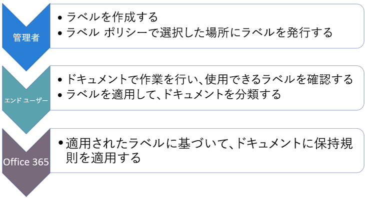
  
保持ラベルは独立した再利用可能な文書パーツであり、ラベル ポリシーに含まれ、さまざまな場所に発行されます。保持ラベルは多くのポリシー間で再利用できます。ラベル ポリシーの主な目的は、保持ラベルのセットをグループ化し、それらのラベルを表示する場所を指定することです。
  
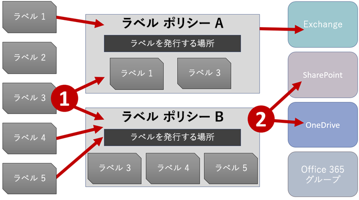
  
1. 保持ラベルを発行すると、それらはラベル ポリシーに含まれます。単一の保持ラベルは複数のポリシーに含めることができます。
    
2. ラベル ポリシーは保持ラベルを発行する場所を指定します。
    
## <a name="only-one-retention-label-at-a-time"></a>一度に 1 つの保持ラベルのみ

メールやドキュメントなどのコンテンツに一度に割り当てられる保持ラベルは 1 つのみです。これを知っておくことが重要です。
  
- エンド ユーザーが手動で割り当てた保持ラベルの場合、ユーザーは割り当てられたラベルを削除または変更できます。
    
- コンテンツに自動適用ラベルが割り当てられている場合は、自動適用ラベルをエンド ユーザーが手動で割り当てた保持ラベルに置き換えることができます。
    
- コンテンツにエンド ユーザーが手動で割り当てた保持ラベルがある場合は、自動適用ラベルと手動で割り当てられた保持ラベルを置き換えることはできません。
    
- 自動適用ラベルを割り当てるルールが複数あり、コンテンツが複数のルールの条件を満たしている場合、最も古いルールの保持ラベルが割り当てられます。
    
手動で割り当てたラベルは明示的に割り当てられ、自動適用のラベルは暗黙的に割り当てられます。明示的な保持ラベルは暗黙的なラベルよりも優先されます。詳細については、後続の「[保持の原則、すなわち優先順位について](labels.md#principles)」セクションを参照してください。

このセクションのすべての情報は、保持ラベルにのみ適用されます。コンテンツのアイテムには、1 つの保持ラベルの他に 1 つの機密ラベルを適用することもできます。
  
## <a name="how-long-it-takes-for-retention-labels-to-take-effect"></a>保持ラベルが有効になるまでの所要時間

保持ラベルを発行または自動適用しても、すぐには有効になりません。
  
1. まず、ラベル ポリシーをセキュリティ/コンプライアンス センターからポリシー内の場所に同期させる必要があります。
    
2. その後、エンド ユーザーが手動ラベルを利用できるようにする、またはラベルをコンテンツに自動適用するには、時間がかかることがあります。この所要時間はラベルの場所と種類によって異なります。
    
### <a name="manual-retention-labels"></a>手動の保持ラベル

SharePoint または OneDrive に保持ラベルを発行する場合、保持ラベルがエンド ユーザーに表示されるまでに 1 日かかる場合があります。また、Exchange に保持ラベルを発行する場合は、保持ラベルがエンド ユーザーに表示するまでに 7 日間かかる場合があり、さらにメールボックスには少なくとも 10 MB のデータが含まれている必要があります。
  
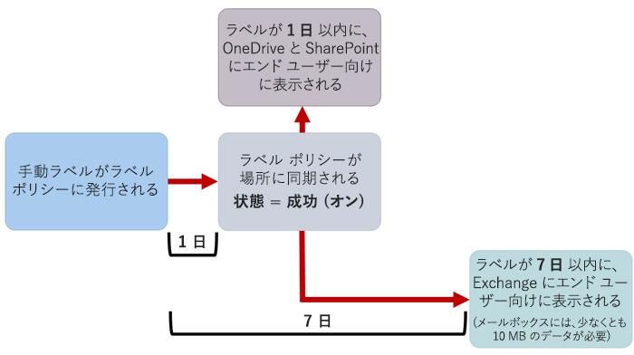
  
### <a name="auto-apply-retention-labels"></a>自動適用の保持ラベル

特定の条件に一致するコンテンツに保持ラベルを自動適用する場合、ラベルが条件に一致するすべてのコンテンツに保持ラベルが適用されるまでに 7 日間かかります。
  
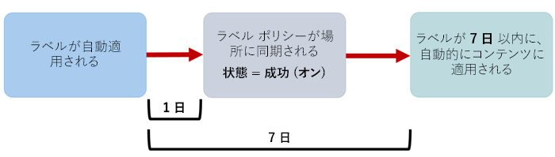
  
### <a name="how-to-check-on-the-status-of-exchange-labels"></a>Exchange ラベルの状態を確認する方法

Exchange Online では、7 日ごとに実行されるプロセスによってエンド ユーザーが保持ラベルを利用できるようになります。Powershell を使用することで、このプロセスが最後に実行された日時を確認できるため、次に実行される日時を判断できます。
  
1. [Exchange Online PowerShell に接続します](https://go.microsoft.com/fwlink/?linkid=799773)。
    
2. これらのコマンドを実行します。
    
  ```
  $logProps = Export-MailboxDiagnosticLogs <user> -ExtendedProperties
  ```

  ```
  $xmlprops = [xml]($logProps.MailboxLog)
  ```

  ```
  $xmlprops.Properties.MailboxTable.Property | ? {$_.Name -like "ELC*"}
  ```

結果では、`ELCLastSuccessTimeStamp` (UTC) プロパティは、システムがメールボックスを最後に処理した日時を示します。ポリシーの作成時点からこの処理が発生していない場合、ラベルは表示されません。処理を強制するには、`Start-ManagedFolderAssistant -Identity <user>` を実行します。
    
Outlook on the web にラベルが表示されると思われるにもかかわらず、ラベルが表示されない場合は、ブラウザーのキャッシュを必ず消去してください (CTRL + F5)。
    
## <a name="label-policies-and-locations"></a>ラベルのポリシーと場所

保持ラベルの内容に応じて、多様な種類の保持ラベルをさまざまな場所に発行できます。
  
|**保持ラベルの種類**|**ラベル ポリシーの適用先**|
|:-----|:-----|
|エンド ユーザーに発行されたラベル  <br/> |Exchange、SharePoint、OneDrive、Office 365 グループ  <br/> |
|機密情報の種類に基づいて自動適用されたラベル  <br/> |Exchange (すべてのメールボックスのみ)、SharePoint、OneDrive  <br/> |
|クエリに基づいて自動適用されたラベル  <br/> |Exchange、SharePoint、OneDrive、Office 365 グループ  <br/> |
   
Exchange では、自動適用の保持ラベル (情報の種類はクエリと機密の両方) は、新しく送信されたメッセージ (送信中のデータ) にのみ適用され、現在メールボックスにあるすべてのアイテム (保存データ) には適用されません。また、機密情報の種類向けの自動適用の保持ラベルは、すべてのメールボックスにのみ適用できます。ただし、特定のメールボックスを選択することはできません。
  
Exchange パブリック フォルダーと Skype ではラベルはサポートされていません。
  
## <a name="how-retention-labels-enforce-retention"></a>保持ラベルによる強制保持のしくみ

保持ラベルは、アイテム保持ポリシーが強制できる保持アクションとまったく同じ保持アクションを強制することができます。保持ラベルを使用すると、高度なコンテンツ プラン (またはファイル プラン) を実装できます。保持のしくみに関する詳細については、「[アイテム保持ポリシーの概要](retention-policies.md)」を参照してください。
  
さらに、保持ラベルには 2 つの保持オプションがあります。これらのオプションは保持ラベルでのみ使用でき、アイテム保持ポリシーでは使用できません。保持ラベルを使用すると、次のことができます。
  
- 保持期間の終了時に廃棄レビューをトリガーし、SharePoint と OneDrive のドキュメントを確認してから削除するようにできます。詳細については、「[廃棄レビューの概要](disposition-reviews.md)」をご参照ください。
    
- コンテンツの作成日または最終変更日時ではなく、コンテンツがラベル付けされた時点から保持期間を開始できます。
    
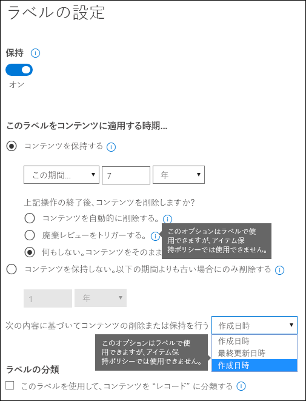
  
## <a name="where-published-retention-labels-can-appear-to-end-users"></a>発行済みラベルをエンド ユーザー向けに表示できる場所

保持ラベルがエンド ユーザーによってコンテンツに割り当てられる場合、保持ラベルは次の場所に発行できます。
  
- Outlook on the web
    
- Outlook 2010 以降
    
- OneDrive
    
- SharePoint
    
- Office 365 グループ (Outlook on the web のグループ サイトとグループ メールボックスの両方)
    
以下のセクションでは、さまざまなアプリで組織内のユーザーに対してラベルがどのように表示されるかを説明します。
  
### <a name="outlook-on-the-web"></a>Outlook on the web

Outlook on the web でアイテムにラベルを付けるには、アイテム \>**[ポリシーの割り当て]**\> の順に右クリックして、保持ラベルを選択します。 
  
![Outlook on the web の [ポリシーの割り当て] メニュー](media/146a23cf-e478-4595-b2e8-f707fc4e6ea3.png)
  
保持ラベルが適用されると、アイテムの上部にその保持ラベルとラベルが実行するアクションが表示されます。メールが分類され、保持期間が関連付けられている場合、メールの有効期限が一目でわかります。
  
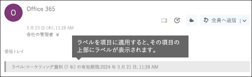
  
保持ラベルはフォルダーに適用することもできます。その場合は次のようになります。
  
- 明示的に保持ラベルが適用されているアイテムを**除き**、フォルダー内のすべてのアイテムに同じ保持ラベルが自動的に設定されます。明示的にラベル付けされたアイテムは、既存の保持ラベルを維持します。詳細については、保持の原則に関する後続のセクションを参照してください。 
    
- フォルダーの既定の保持ラベルを変更または削除すると、明示的な保持ラベルを持つアイテムを**除き**、フォルダー内にあるすべてのアイテムの保持ラベルも変更または削除されます。 
    
- 既定の保持ラベルを持つアイテムをあるフォルダーから異なる既定の保持ラベルを持つ別のフォルダーに移動すると、そのアイテムには新しい既定の保持ラベルが設定されます。
    
- 既定の保持ラベルを持つアイテムをあるフォルダーから既定の保持ラベルがない別のフォルダーに移動すると、以前の既定の保持ラベルが削除されます。
    
### <a name="outlook-2010-and-later"></a>Outlook 2010 以降

Outlook on the web でアイテムにラベルを付けるには、アイテム\>**[リボン]**\>**[ポリシーの割り当て]**\> の順に右クリックして、保持ラベルを選択します。 
  
![[ポリシーの割り当て] ボタン](media/30684dea-dd73-4e4a-9185-8e29f403b6ca.png)
  
保持ラベルが適用されると、アイテムの上部にその保持ラベルとラベルが実行するアクションが表示されます。メールが分類され、保持期間が関連付けられている場合、メールの有効期限が一目でわかります。
  
フォルダーに保持ラベルを適用することもできます。これは、Outlook on the web での機能と同様に Outlook 2010 以降でも機能します。詳細については、前出のセクションを参照してください。
  
### <a name="onedrive-and-sharepoint"></a>OneDrive と SharePoint

OneDrive または SharePoint でドキュメント (OneNote ファイルを含む) にラベルを付けるには、アイテム \> 右上隅にある **[詳細ウィンドウを開く]**\>**[ラベルの適用]**\> の順に選択し、保持ラベルを選択します。 
  
フォルダーまたはドキュメントのセットに保持ラベルを適用することもできます。また、ドキュメント ライブラリに対して既定の保持ラベルを設定できます。詳細については、以下のセクションを参照してください。
  
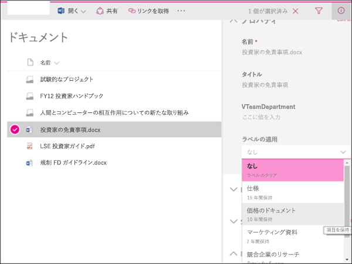
  
アイテムに保持ラベルが適用されると、そのアイテムの選択時に、詳細ウィンドウにラベルを表示できます。
  
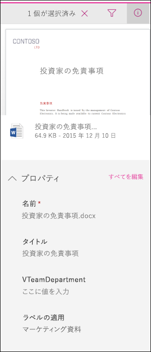
  
**[ラベル]** 列または **[アイテムがレコード]** 列を含むライブラリのビューを作成して、すべてのアイテムに割り当てられた保持ラベルとレコードであるアイテムを一目で確認できるようにすることも可能です。ただし、**[アイテムがレコード]** 列を使用してビューをフィルターすることはできません。 
  
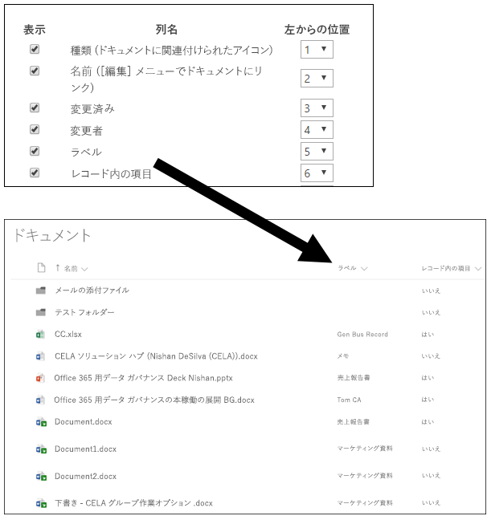
  
### <a name="office-365-groups"></a>Office 365 グループ

Office 365 グループに保持ラベルを発行すると、保持ラベルは Outlook on the web のグループ サイトとグループ メールボックスの両方に表示されます。コンテンツに保持ラベルを適用する場合のエクスペリエンスは、上記のメールとドキュメントの場合と同じです。

Office 365 グループのコンテンツを保持するには、Office 365 グループの場所を使用する必要があります。Office 365 グループには Exchange メールボックスがありますが、Exchange の場所全体が含まれるアイテム保持ポリシーには、Office 365 グループのメールボックスのコンテンツは含まれません。

また、Exchange の場所を使用して、特定のグループのメールボックスを含めたり除外したりすることはできません。最初は Exchange の場所でグループのメールボックスを選択できますが、アイテム保持ポリシーを保存しようとすると、Exchange の場所では "RemoteGroupMailbox" を選択できないことを示すエラーを受け取ります。
  
## <a name="applying-a-retention-label-automatically-based-on-conditions"></a>条件に基づいた保持ラベルの自動適用

保持ラベルの最も強力な機能の 1 つは、特定の条件に一致したコンテンツにラベルを自動的に適用する機能です。この場合、保持ラベルは Office 365 によって適用されるため、組織内のユーザーがラベルを適用する必要はありません。
  
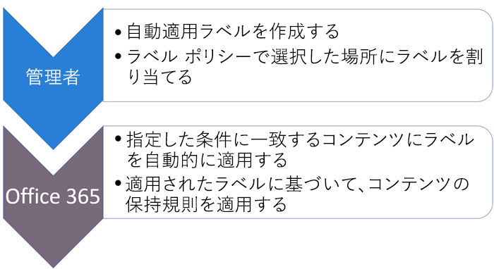
  
自動適用の保持ラベルが強力な機能である理由は次のとおりです。
  
- ユーザーのトレーニングは、一部の分類方法についてのみ必要。
    
- ユーザーへの依存は、一部のコンテンツを正しく分類するためにのみ必要。
    
- ユーザーはデータ ガバナンス ポリシーについて把握する必要がなくなるので、仕事に集中できる。
    
コンテンツに次の内容が含まれている場合は、保持ラベルを自動的にコンテンツに適用するように選択できます。
  
- 特定の種類の機密情報。
    
- 作成したクエリに一致する特定のキーワード。
    
![自動適用ラベルの [条件選択] ページ](media/c0b7a3ef-bda0-494c-941d-f1f93753ecdd.png)
  
自動適用の保持ラベルには Office 365 Enterprise E5 サブスクリプションが必要であす。また、前述したように、条件に一致するすべてのコンテンツに自動適用の保持ラベルが適用されるまでに最大 7 日間かかります。
  
### <a name="auto-apply-retention-labels-to-content-with-specific-types-of-sensitive-information"></a>特定の種類の機密情報によるコンテンツへの保持ラベルの自動適用

機密情報の自動適用の保持ラベルを作成すると、データ損失防止 (DLP) ポリシーを作成する場合と同じポリシー テンプレートの一覧が表示されます。各ポリシーテンプレートは、特定の種類の機密情報を検索するように事前設定されています。たとえば、ここに表示されているテンプレートでは、米国の ITIN、SSN、およびパスポート番号が検索されます。DLP の詳細については、「[データ損失防止ポリシーの概要](data-loss-prevention-policies.md)」を参照してください。
  
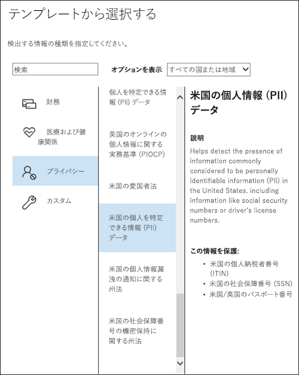
  
ポリシー テンプレートを選択すると、すべての種類の機密情報を追加または削除したり、インスタンス数と一致精度を変更したりできます。ここに示す例では、保持ラベルは次の場合にのみ自動的に適用されます。
  
- コンテンツに、次の 3 種類の機密情報のいずれかに 1 から 9 個のインスタンスが含まれる場合。**最大** 値を削除して、**任意** の値に変更できます。
    
- 検出された機密情報の種類は、一致精度 (または信頼レベル) が少なくとも 75 に設定されています。多くの機密情報の種類は複数のパターンで定義されています。一致精度の高いパターンでは、より多くの証拠 (キーワード、日付、アドレスなど) が検索される必要がありますが、一致精度の低いパターンでは必要な証拠は少なくなります。簡単に言えば、一致精度の **最小** 値が低いほど、コンテンツは条件に一致しやすくなります。 
    
これらのオプションの詳細については、「[一致の難易度を設定するためのルールの調整](data-loss-prevention-policies.md#tuning-rules-to-make-them-easier-or-harder-to-match)」をご覧ください。
    
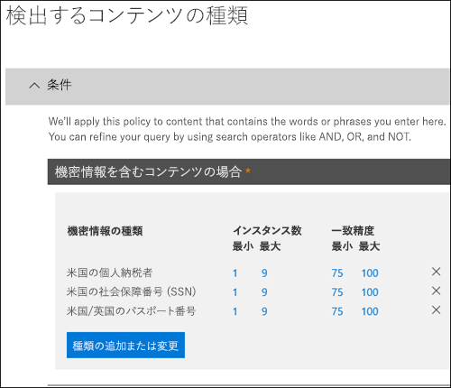
  
### <a name="auto-apply-labels-to-content-with-keywords-or-searchable-properties"></a>キーワードまたは検索可能なプロパティによるコンテンツへの自動適用ラベル

特定の条件を満たすコンテンツにラベルを自動的に適用できます。現在利用可能な条件では、特定の単語、フレーズ、または検索可能なプロパティの値を含むコンテンツへのラベルの適用がサポートされています。AND、OR、NOT などの検索演算子を使用してクエリを絞り込むことができます。

クエリ構文の詳細については、次を参照してください。

- [キーワード クエリ言語 (KQL) 構文のリファレンス](https://docs.microsoft.com/ja-JP/sharepoint/dev/general-development/keyword-query-language-kql-syntax-reference)

クエリ ベースのラベルは検索インデックスを使用してコンテンツを特定します。有効な検索可能なプロパティの詳細については、以下を参照してください。

- [コンテンツ検索のキーワード クエリと検索条件](keyword-queries-and-search-conditions.md)
- [クロールされたプロパティと管理プロパティの概要 (SharePoint Server)](https://docs.microsoft.com/ja-JP/SharePoint/technical-reference/crawled-and-managed-properties-overview)

クエリの例:

- Exchange
    - subject:"Quarterly Financials"
    - recipients:garthf<!--nolink-->@contoso.com
- SharePoint および OneDrive for Business
    - contenttype:contract
    - site:https<!--nolink-->://contoso.sharepoint.com/sites/teams/procurement AND contenttype:contract

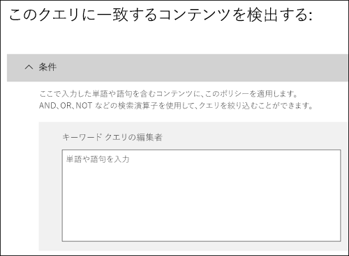

## <a name="applying-a-default-retention-label-to-all-content-in-a-sharepoint-library-folder-or-document-set"></a>SharePoint ライブラリ、フォルダー、またはドキュメント セット内のすべてのコンテンツへの既定の保持ラベルの適用

個々のドキュメントにユーザーが保持ラベルを適用できるようにするだけでなく、既定の保持ラベルを SharePoint ライブラリ、フォルダー、またはドキュメント セットに適用して、その場所にあるすべてのドキュメントに既定の保持ラベルを設定することもできます。
  
ドキュメント ライブラリの場合、これはドキュメント ライブラリの **[ライブラリの設定]** ページで実行できます。既定の保持ラベルを選択すると、ライブラリにある任意の既存のアイテムに対して適用するように選択することもできます。 
  
たとえば、マーケティング資料用のタグがあり、特定のドキュメント ライブラリにその種類のコンテンツだけが含まれていることがわかっている場合は、[マーケティング資料] タグをそのライブラリ内にあるすべてのドキュメントの既定にすることができます。
  
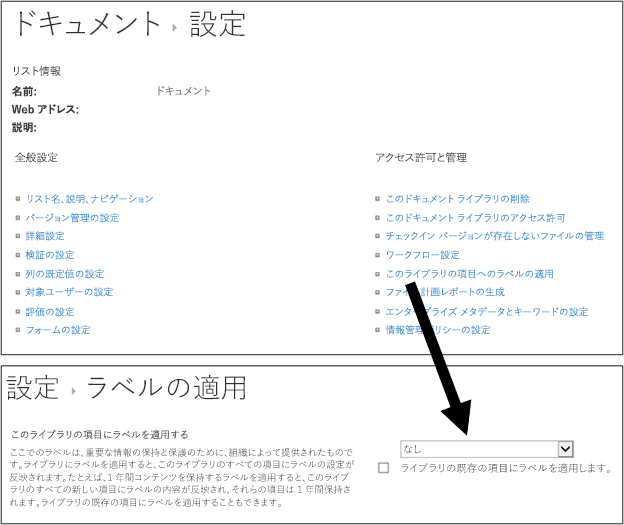
  
ライブラリ、フォルダー、またはドキュメント セット内にある既存のアイテムに既定の保持ラベルを適用すると、次のようになります。
  
- 明示的にラベルが適用されているアイテムを**除き**、ライブラリ、フォルダー、またはドキュメント セット内にあるすべてのアイテムに同じ保持ラベルが自動的に設定されます。明示的に保持ラベルが付けられたアイテムは、既存のラベルを維持します。詳細については、以下の「[保持の原則、すなわち優先順位について](#the-principles-of-retention-or-what-takes-precedence)」セクションを参照してください。
    
- ライブラリ、フォルダー、またはドキュメント セットの既定の保持ラベルを変更または削除すると、明示的な保持ラベルを持つアイテムを**除き**、ライブラリ、フォルダー、またはドキュメント セット内にあるすべてのアイテムの保持ラベルも変更または削除されます。 
    
- 既定の保持ラベルを持つアイテムをあるライブラリ、フォルダー、またはドキュメント セットから別のライブラリ、フォルダー、またはドキュメント セットに移動すると、新しい場所に別の既定の保持ラベルが設定されていても、アイテムは既存の既定の保持ラベルを維持します。
    
## <a name="applying-a-retention-label-to-email-by-using-rules"></a>ルールを使用したメールへの保持ラベルの適用

Outlook 2010 以降では、保持ラベルまたはアイテム保持ポリシーを適用するためのルールを作成できます。
  
たとえば、特定の配布グループとの間で送受信されるすべてのメッセージに対して特定の保持ラベルを適用するルールを作成できます。
  
ルールを作成するには、アイテム \>**[ルール]**\>**[ルールの作成]**\>**[高度なオプション]**\>**[ルール ウィザード]**\>**[アイテム保持ポリシーの適用]** の順に右クリックします。
  
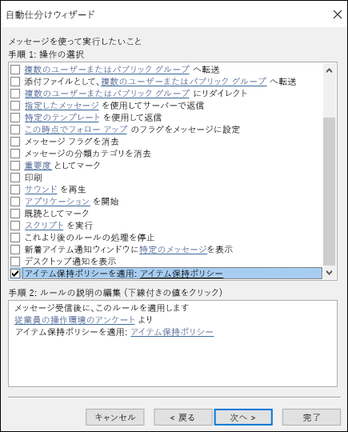
  
## <a name="classifying-content-without-applying-any-actions"></a>アクションを適用しないコンテンツの分類

保持ラベルを作成する場合、以下に示すように、保持やその他の操作を有効にすることなくラベルを作成できます。この場合、アクションを強制せずに、保持ラベルを単にテキスト ラベルとして使用できます。
  
たとえば、アクションを適用せずに「後で確認」という名前の保持ラベルを作成して、機密情報の種類を持つコンテンツまたはクエリの対象となるコンテンツにその保持ラベルを自動的に適用することができます。
  
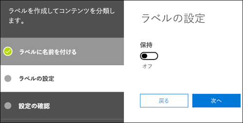
  
## <a name="using-retention-labels-for-records-management"></a>レコード管理用の保持ラベルの使用

概ね、レコード管理とは次のことを意味します。
  
- ユーザーによって重要なコンテンツがレコードとして分類されている。
    
- レコードは変更も削除もできない。
    
- レコードは指定された有効期限が過ぎた後、最終的に破棄される。
    
保持ラベルを使用して Office 365 全体にわたって一貫したレコード管理戦略を実装できます。一方、レコード センターなどの他のレコード管理機能は SharePoint コンテンツにのみ適用されます。また、レコードの保持アクションを強制して、ライフサイクルの終了時にレコードを自動的に破棄することができます。
  
保持ラベルを作成する場合、保持ラベルを使用してコンテンツをレコードとして分類するオプションを利用できます。
  
![[レコードとしてコンテンツを分類する] チェック ボックス](media/9c300739-d5d0-41d2-88dd-137f1cfc9cb6.png)
  
アイテムがレコードとしてラベル付けされると、次の 4 つの処理ができなくなります。
  
- アイテムの完全な削除。
    
- アイテムの編集。
    
- ラベルの変更。
    
- ラベルの削除。
    
### <a name="who-can-classify-content-as-a-record"></a>コンテンツをレコードとして分類できるユーザー

SharePoint コンテンツの場合、既定のメンバー グループ (投稿アクセス許可レベル) のユーザーは、コンテンツにレコード ラベルを適用できます。適用後、サイト コレクション管理者のみがその保持ラベルを削除または変更できます。さらに、コンテンツをレコードとして分類する保持ラベルは、[自動でコンテンツに適用](#auto-apply-retention-labels)できます。
  
### <a name="records-and-folders"></a>レコードとフォルダー

保持ラベルは、Exchange、SharePoint、または OneDrive 内のフォルダーに適用できます。フォルダーがレコードとしてラベル付けされている場合にフォルダーにアイテムを移動すると、アイテムはレコードとしてラベル付けされます。フォルダーからアイテムを移動しても、アイテムは引き続きレコードとしてラベル付けされます。
  
### <a name="records-cant-be-deleted"></a>レコードの削除不可

Exchange でレコードを削除しようとすると、「[アイテム保持ポリシーは所定の場所にあるコンテンツに対してどのように機能するか](retention-policies.md#how-a-retention-policy-works-with-content-in-place)」で説明されているように、アイテムは [回復可能なアイテム] フォルダーに移動されます。
  
SharePoint でレコードを削除しようとすると、「アイテムが削除されませんでした」というエラーが表示され、そのアイテムはライブラリに残ります。
  
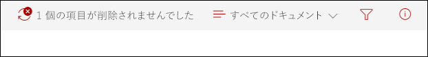
  
OneDrive でレコードを削除しようとすると、「[アイテム保持ポリシーは所定の場所にあるコンテンツに対してどのように機能するか](retention-policies.md#how-a-retention-policy-works-with-content-in-place)」で説明されているように、アイテムは [アイテム保管] ライブラリに移動されます。
  
## <a name="using-a-retention-label-as-a-condition-in-a-dlp-policy"></a>DLP ポリシーでの条件としての保持ラベルの使用

保持ラベルはコンテンツに対して保持アクションを強制できます。また、保持ラベルをデータ損失防止 (DLP) ポリシーで条件として使用できます。DLP ポリシーは特定のラベルを含むコンテンツに対して、アクセスを制限するなどの他のアクションを強制できます。 
  
詳細については、「[DLP ポリシーにおける条件としてのラベルの使用](data-loss-prevention-policies.md#using-a-label-as-a-condition-in-a-dlp-policy)」を参照してください。
  
## <a name="using-the-label-activity-explorer-and-the-data-governance-reports"></a>ラベル アクティビティ エクスプローラーとデータ ガバナンス レポートの使用。

保持ラベルを発行または自動適用した後、意図したとおりにラベルがコンテンツに適用されていることを確認する必要があります。保持ラベルを監視するには、次のものを使用できます。
  
- **ラベル アクティビティ エクスプローラー**。エクスプローラー (下記参照) を使用すると、過去 30 日間の SharePoint および OneDrive for Business 全体のすべてのコンテンツの保持ラベルのアクティビティをすばやく検索して表示できます。詳細については、「[ドキュメントのラベルのアクティビティを表示する](view-label-activity-for-documents.md)」を参照してください。
    
- **データ ガバナンス レポート**。これらのレポートでは、過去 90 日間の Exchange、SharePoint および OneDrive for Business 全体のすべてのコンテンツの保持ラベルの傾向とアクティビティをすばやく表示できます。詳細については、「[データ ガバナンス レポートを表示する](view-the-data-governance-reports.md)」を参照してください。
    

  
## <a name="using-content-search-to-find-all-content-with-a-specific-retention-label-applied-to-it"></a>コンテンツ検索を使用した特定の保持ラベルが適用されたすべてのコンテンツの検索

ユーザーまたは自動適用によって保持ラベルがコンテンツに割り当てられた後、セキュリティ/コンプライアンス センターでコンテンツ検索を使用して、特定の保持ラベルで分類されているすべてのコンテンツを検索することができます。
  
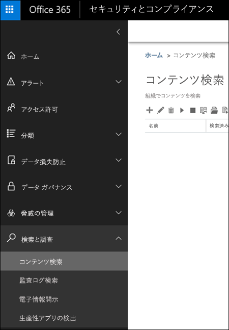
  
コンテンツ検索を作成する場合は、**[コンプライアンス タグ]** 条件を選択し、完全なラベル名またはラベル名の一部を入力し、ワイルドカードを使用します。詳細については、「[コンテンツ検索のキーワード クエリと検索条件](keyword-queries-and-search-conditions.md)」をご参照ください。
  
![[コンプライアンス タグ] 条件](media/82d6af16-59f8-462f-babb-c894b2917018.png)
  
## <a name="the-principles-of-retention-or-what-takes-precedence"></a>保持の原則、すなわち優先順位について

コンテンツには複数のアイテム保持ポリシーが適用され、各ポリシーに異なるアクション (保持または削除、あるいはその両方) と保持期間が設定されている場合が多くあります。どれが優先されるのでしょうか? 概ね、あるポリシーで保持されているコンテンツを別のポリシーで完全に削除することはできないので、ご安心ください。
  
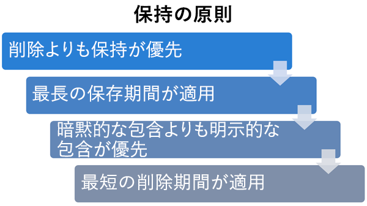
  
保持アクションが設定されたさまざまなラベルがコンテンツにどのように適用されているかを理解するには、次の保持の原則に注意してください。
  
1. **保持の削除が優先されます。** あるアイテム保持ポリシーで 3 年後に Exchange メールを削除するように設定され、別のアイテム保持ポリシーでは Exchange メールを 5 年間保持してから削除するように設定されているとします。この場合、3 年を経過したコンテンツはすべて削除され、ユーザーには表示されなくなりますが、コンテンツは完全に削除される 5 年を経過するまで、回復可能なアイテム フォルダーに保持されます。 
    
2. **最長の保持期間が優先されます。** コンテンツを保持する複数のポリシーの対象となるコンテンツは、最長の保持期間が終了するまで保持されます。 
    
3. **明示的な包含は暗黙的な包含に優先します。** これは次を意味します。 
    
    1. 保持設定を持つ保持ラベルをユーザーが Exchange メールや OneDrive ドキュメントなどのアイテムに手動で割り当てると、その保持ラベルはサイト レベルまたはメールボックス レベルで割り当てられたポリシー、およびドキュメント ライブラリによって割り当てられた既定の保持ラベルよりも優先されます。たとえば、明示的な保持ラベルで 10 年間保持するように設定されているときに、サイトに割り当てられた保持ポリシーでは 5 年間のみ保持するように設定されている場合は、保持ラベルが優先されます。自動適用の保持ラベルは、Office 365 によって自動的に適用されるため、明示的ではなく暗黙的に指定されます。
    
    2. アイテム保持ポリシーに特定のユーザーのメールボックスまたは OneDrive for Business のアカウントなどの特定の場所が含まれている場合、そのポリシーは、すべてのユーザーのメールボックスまたは OneDrive for Business のアカウントに適用されるが、そのユーザーのメールボックスを特に含まない別の保持ポリシーよりも優先されます。
    
4. **最短の削除期間が優先されます。** 同様に、コンテンツを削除する複数のポリシー (保持なし) の対象となるコンテンツは、最短保持期間の終了時に削除されます。 
    
保持の原則は上位から下位のタイブレーク フローとして機能することを理解します。すべてのポリシーまたはラベルによって適用された複数のルールがあるレベルで同じ場合、フローは次の下位レベルに移動し、ルールが適用される優先順位を決定します。
  
最終的には、アイテム保持ポリシーまたはラベルでは、電子情報開示のために保留中のコンテンツを完全に削除することはできません。保留が解除されると、コンテンツは再び上記に記載されたクリーンアップ プロセスの対象となります。
  
## <a name="use-retention-labels-instead-of-these-features"></a>次の機能の代わりとしての保持ラベルの使用

保持ラベルは、組織全体および Exchange、SharePoint、OneDrive、Office 365 グループなど Office 365 全体にわたる組織のコンテンツで簡単に使用できます。Office 365 の任意の場所でコンテンツを分類したり、レコードを管理したり必要がある場合は、保持ラベルを使用することをお勧めします。
  
Office 365 で以前にコンテンツの分類やレコードの管理に使用されていた機能は他に複数あります。それらの機能を次に示します。機能は引き続き、セキュリティ/コンプライアンス センターで作成された保持ラベルと並行して機能します。保持ラベルの実装は以前の機能とは異なる場合がありますが、保持ラベルの進化は Office 365 全体にわたるレコード管理を今後も向上させる原動力となります。そのため、この先、データ ガバナンスには、次に示す機能の代わりに保持ラベルを使用することをお勧めします。
  
### <a name="exchange-online"></a>Exchange Online

- [メッセージング レコード管理 (MRM)](https://go.microsoft.com/fwlink/?linkid=846126) とも呼ばれる、[保持タグおよびアイテム保持ポリシー](https://go.microsoft.com/fwlink/?linkid=846125) (削除のみ) 
    
### <a name="sharepoint-online-and-onedrive-for-business"></a>SharePoint Online と OneDrive for Business

- [インプレース レコード管理の構成](https://support.office.com/article/7707a878-780c-4be6-9cb0-9718ecde050a) (保持) 
    
- [レコード センターの概要](https://support.office.com/article/bae6ca5a-7b19-40e0-b433-e3613a747c2c) (保持) 
    
- [情報管理ポリシー](intro-to-info-mgmt-policies.md) (削除のみ) 
    
## <a name="permissions"></a>アクセス許可

アイテム保持ラベルを作成するコンプライアンス チームのメンバーには、セキュリティ/コンプライアンス センターへのアクセス許可が必要です。既定では、テナント管理者はこの場所へのアクセス許可を持っています。そのため、法令遵守責任者や他のユーザーに対し、テナント管理者のすべてのアクセス許可を付与せずに、セキュリティ/コンプライアンス センターへのアクセスを許可できます。これを行うには、セキュリティ/コンプライアンス センターの **[アクセス許可]** ページに移動して、**[コンプライアンス管理者]** 役割グループを編集し、メンバーをその役割グループに追加することをお勧めします。 
  
詳細については、「[ユーザーに Office 365 セキュリティ センター/コンプライアンス センターへのアクセス権を付与する](grant-access-to-the-security-and-compliance-center.md)」を参照してください。
  
これらのアクセス許可は、保持ラベルとラベル ポリシーを作成して適用するときにのみ必要になります。ポリシーを適用する場合に、コンテンツへのアクセスは必要ありません。
  
## <a name="find-the-powershell-cmdlets-for-labels"></a>ラベルの PowerShell コマンドレットの検索

ラベル コマンドレットを使用するには、次を実行する必要があります。
  
1. [Office 365 セキュリティ センターとコンプライアンス センターの PowerShell への接続](https://docs.microsoft.com/powershell/exchange/office-365-scc/connect-to-scc-powershell/connect-to-scc-powershell)
    
2. 以下の Office 365 セキュリティ センターとコンプライアンス センターのコマンドレットの使用

  - [Get-ComplianceTag](https://docs.microsoft.com/powershell/module/exchange/policy-and-compliance-retention/get-compliancetag)

  - [New-ComplianceTag](https://docs.microsoft.com/powershell/module/exchange/policy-and-compliance-retention/new-compliancetag)

  - [Remove-ComplianceTag](https://docs.microsoft.com/powershell/module/exchange/policy-and-compliance-retention/remove-compliancetag)

  - [Set-ComplianceTag](https://docs.microsoft.com/powershell/module/exchange/policy-and-compliance-retention/set-compliancetag)

  - [Enable-ComplianceTagStorage](https://docs.microsoft.com/powershell/module/exchange/policy-and-compliance-retention/enable-compliancetagstorage)

  - [Get-ComplianceTagStorage](https://docs.microsoft.com/powershell/module/exchange/policy-and-compliance-retention/get-compliancetagstorage)

  - [Get-RetentionCompliancePolicy](https://docs.microsoft.com/powershell/module/exchange/policy-and-compliance-retention/get-retentioncompliancepolicy)

  - [New-RetentionCompliancePolicy](https://docs.microsoft.com/powershell/module/exchange/policy-and-compliance-retention/new-retentioncompliancepolicy)

  - [Remove-RetentionCompliancePolicy](https://docs.microsoft.com/powershell/module/exchange/policy-and-compliance-retention/remove-retentioncompliancepolicy)

  - [Set-RetentionCompliancePolicy](https://docs.microsoft.com/powershell/module/exchange/policy-and-compliance-retention/set-retentioncompliancepolicy)

  - [Get-RetentionComplianceRule](https://docs.microsoft.com/powershell/module/exchange/policy-and-compliance-retention/get-retentioncompliancerule)

  - [New-RetentionComplianceRule](https://docs.microsoft.com/powershell/module/exchange/policy-and-compliance-retention/new-retentioncompliancerule)

  - [Remove-RetentionComplianceRule](https://docs.microsoft.com/powershell/module/exchange/policy-and-compliance-retention/remove-retentioncompliancerule)

  - [Set-RetentionComplianceRule](https://docs.microsoft.com/powershell/module/exchange/policy-and-compliance-retention/set-retentioncompliancerule)

## <a name="more-information"></a>詳細情報

[アイテム保持ポリシーの概要](retention-policies.md)
